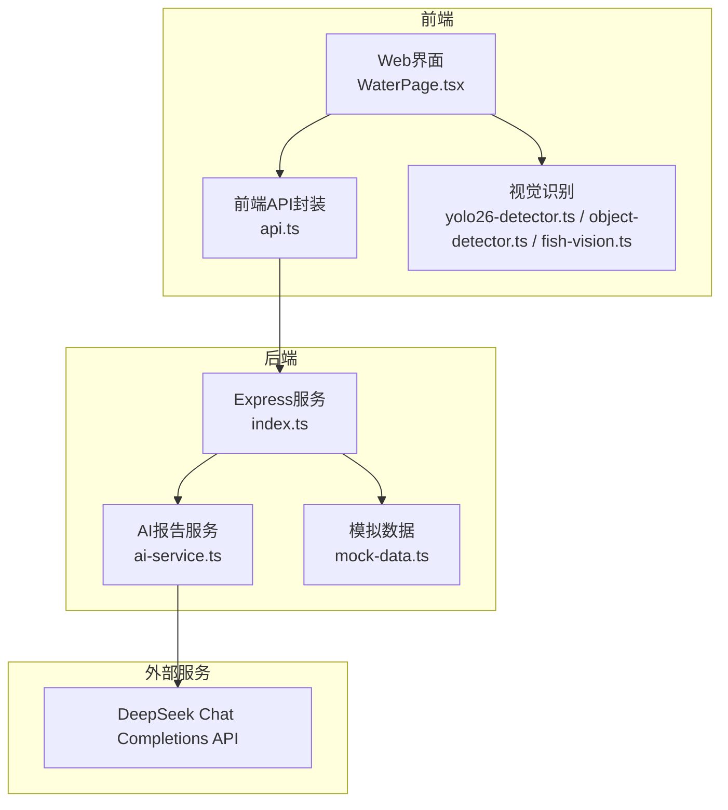
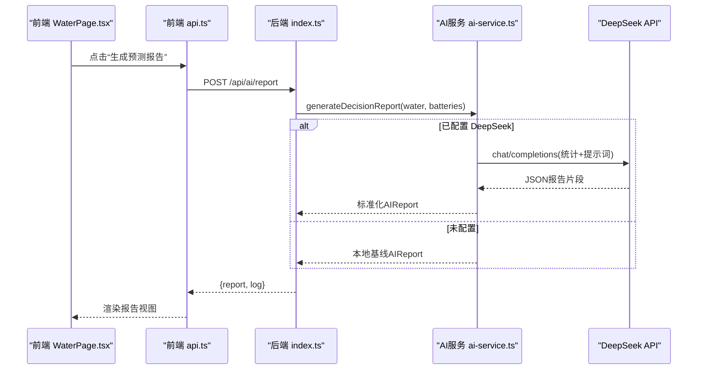
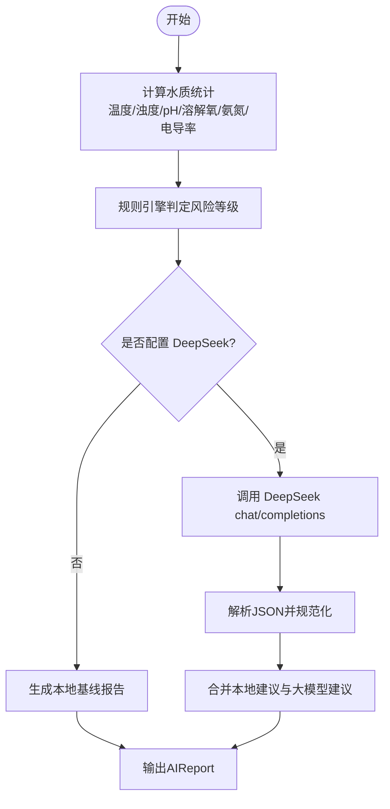
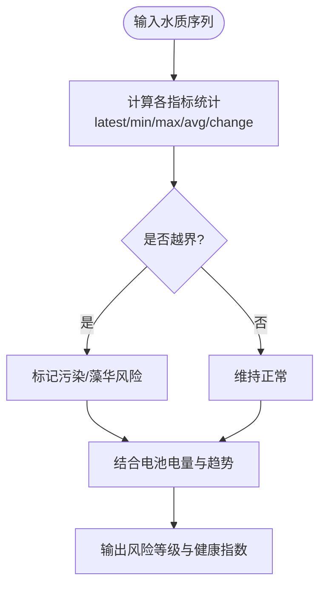
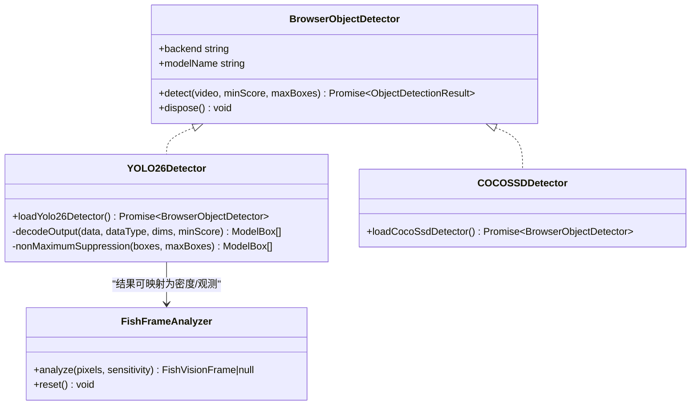
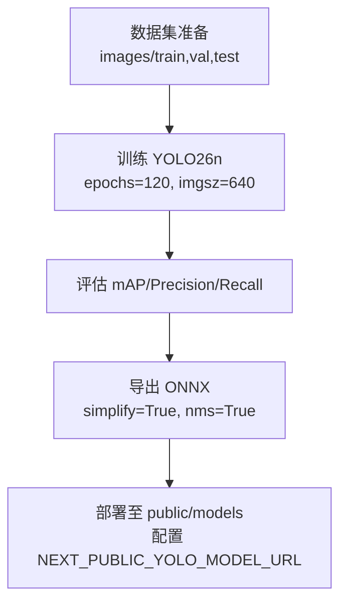
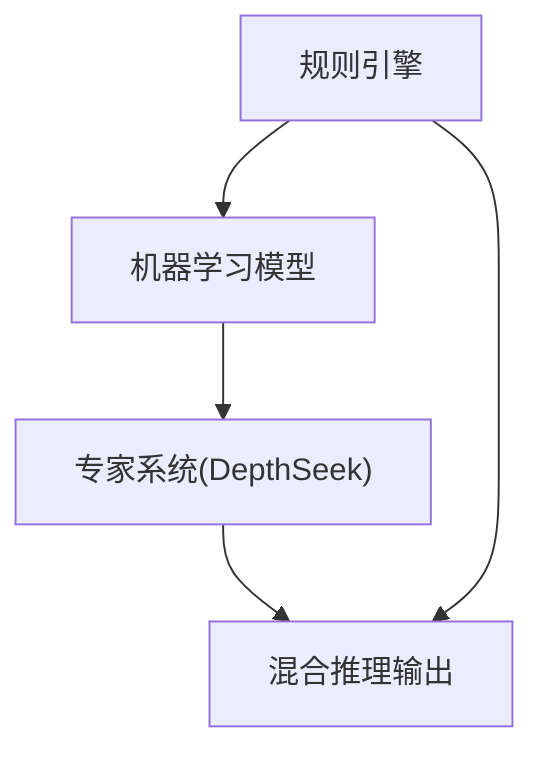
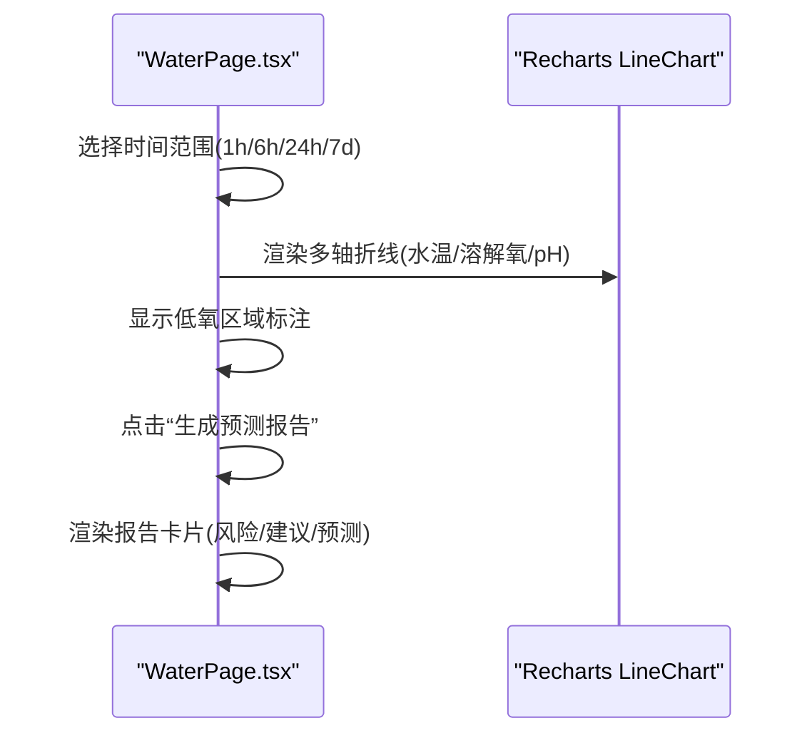
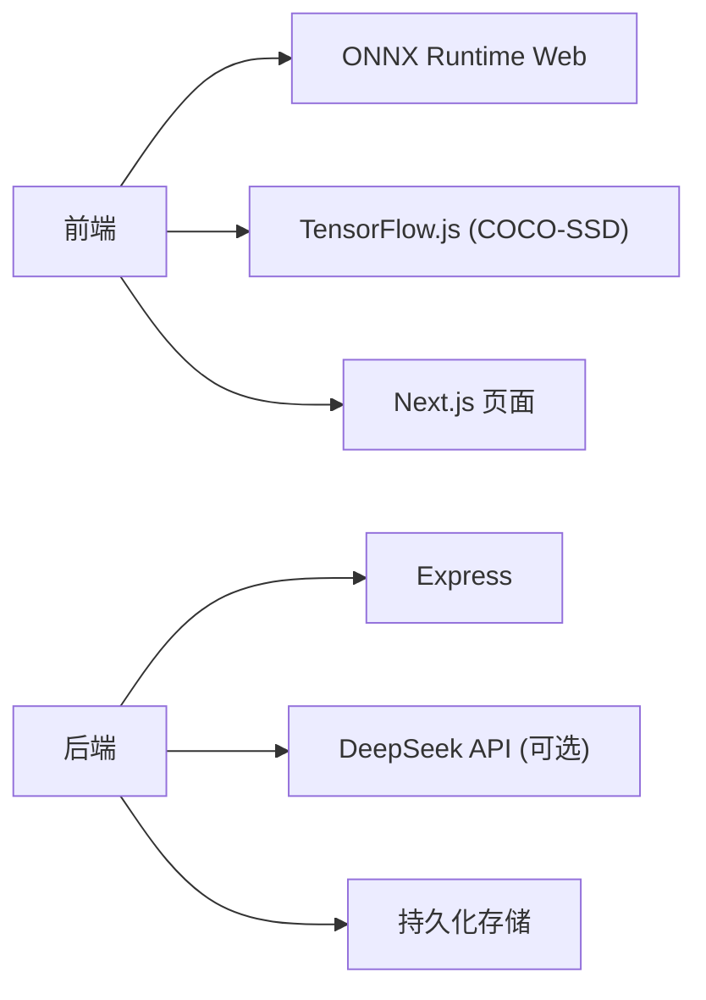

# AI决策系统

<cite>
**本文引用的文件**
- [ai-service.ts](file://fishery-digital-twin-platform/apps/backend/src/ai-service.ts)
- [index.ts](file://fishery-digital-twin-platform/apps/backend/src/index.ts)
- [mock-data.ts](file://fishery-digital-twin-platform/apps/backend/src/mock-data.ts)
- [api.ts](file://fishery-digital-twin-platform/apps/frontend/src/lib/api.ts)
- [WaterPage.tsx](file://fishery-digital-twin-platform/apps/frontend/src/components/dashboard/WaterPage.tsx)
- [yolo26-detector.ts](file://fishery-digital-twin-platform/apps/frontend/src/lib/yolo26-detector.ts)
- [object-detector.ts](file://fishery-digital-twin-platform/apps/frontend/src/lib/object-detector.ts)
- [fish-vision.ts](file://fishery-digital-twin-platform/apps/frontend/src/lib/fish-vision.ts)
- [vision-model-training.md](file://fishery-digital-twin-platform/docs/vision-model-training.md)
- [train-vision-model.py](file://fishery-digital-twin-platform/scripts/train-vision-model.py)
- [vision-dataset.yaml](file://fishery-digital-twin-platform/docs/vision-dataset.yaml)
</cite>

## 目录
1. [简介](#简介)
2. [项目结构](#项目结构)
3. [核心组件](#核心组件)
4. [架构总览](#架构总览)
5. [详细组件分析](#详细组件分析)
6. [依赖关系分析](#依赖关系分析)
7. [性能考量](#性能考量)
8. [故障排查指南](#故障排查指南)
9. [结论](#结论)
10. [附录](#附录)

## 简介
本文件面向“智慧渔业数字孪生平台”的AI决策系统，系统性说明AI在渔业巡检中的应用与实现。内容覆盖：
- AI报告生成：DeepSeek API集成、本地预测算法、多模型支持与结果格式化
- 水质分析算法：趋势预测、异常检测、风险评估与健康指数计算
- 视觉识别能力：鱼类检测、水面污染识别、设备状态监控
- 模型训练流程：数据集准备、模型训练、性能评估与部署更新
- AI决策逻辑：规则引擎、机器学习模型、专家系统与混合推理机制
- 结果可视化：图表展示、热力图思路、趋势分析与交互式报告
- 扩展指南：AI模型扩展、自定义算法与第三方服务集成

## 项目结构
后端提供统一API，聚合传感器数据、电池状态、导航信息，并基于本地规则与可选的大模型（DeepSeek）生成AI报告；前端提供交互界面，支持实时/演示数据采集、趋势可视化与报告查看。视觉识别在前端浏览器内完成，使用ONNX Runtime Web加载YOLO26或回退到COCO-SSD。

**图示来源**
- [index.ts:320-473](file://fishery-digital-twin-platform/apps/backend/src/index.ts#L320-L473)
- [ai-service.ts:167-232](file://fishery-digital-twin-platform/apps/backend/src/ai-service.ts#L167-L232)
- [WaterPage.tsx:45-167](file://fishery-digital-twin-platform/apps/frontend/src/components/dashboard/WaterPage.tsx#L45-L167)
- [api.ts:26-49](file://fishery-digital-twin-platform/apps/frontend/src/lib/api.ts#L26-L49)

**章节来源**
- [index.ts:320-473](file://fishery-digital-twin-platform/apps/backend/src/index.ts#L320-L473)
- [WaterPage.tsx:45-167](file://fishery-digital-twin-platform/apps/frontend/src/components/dashboard/WaterPage.tsx#L45-L167)
- [api.ts:26-49](file://fishery-digital-twin-platform/apps/frontend/src/lib/api.ts#L26-L49)

## 核心组件
- AI报告服务：本地基线规则 + 可选DeepSeek大模型增强，输出标准化AIReport
- 水质数据管道：传感器上报/演示数据注入 -> 历史窗口 -> 统计指标 -> 风险等级
- 视觉识别管线：YOLO26 ONNX（WebGPU/WASM）-> NMS解码 -> 类别映射 -> 密度估计
- 前端可视化：趋势折线图、低氧区域标注、报告卡片与交互式采集动画
- 训练与导出：Ultralytics YOLO26n训练脚本 -> ONNX导出 -> 前端离线推理

**章节来源**
- [ai-service.ts:33-122](file://fishery-digital-twin-platform/apps/backend/src/ai-service.ts#L33-L122)
- [yolo26-detector.ts:147-264](file://fishery-digital-twin-platform/apps/frontend/src/lib/yolo26-detector.ts#L147-L264)
- [object-detector.ts:193-267](file://fishery-digital-twin-platform/apps/frontend/src/lib/object-detector.ts#L193-L267)
- [WaterPage.tsx:289-347](file://fishery-digital-twin-platform/apps/frontend/src/components/dashboard/WaterPage.tsx#L289-L347)
- [train-vision-model.py:43-80](file://fishery-digital-twin-platform/scripts/train-vision-model.py#L43-L80)

## 架构总览
AI决策系统采用“规则+模型+大模型”的混合推理架构：
- 规则引擎：水质阈值判定、风险等级映射、健康指数估算
- 机器学习模型：YOLO26目标检测（鱼类/垃圾），COCO-SSD作为回退
- 大模型增强：DeepSeek根据统计数据生成结构化报告与建议
- 前端可视化：趋势图、报告视图、交互式数据采集

**图示来源**
- [WaterPage.tsx:445-461](file://fishery-digital-twin-platform/apps/frontend/src/components/dashboard/WaterPage.tsx#L445-L461)
- [api.ts:45-49](file://fishery-digital-twin-platform/apps/frontend/src/lib/api.ts#L45-L49)
- [index.ts:456-473](file://fishery-digital-twin-platform/apps/backend/src/index.ts#L456-L473)
- [ai-service.ts:167-232](file://fishery-digital-twin-platform/apps/backend/src/ai-service.ts#L167-L232)

## 详细组件分析

### AI报告生成与多模型支持
- 本地基线：对水质指标进行统计（最新值、均值、变化量），结合阈值判断风险等级，生成标题、摘要、发现与建议
- DeepSeek集成：当环境变量存在时，调用chat/completions接口，传入统计信息与参考范围，要求返回严格JSON；失败时回退到本地基线
- 结果规范化：将不同字段名与置信度范围归一化，确保前端一致渲染

**图示来源**
- [ai-service.ts:33-122](file://fishery-digital-twin-platform/apps/backend/src/ai-service.ts#L33-L122)
- [ai-service.ts:167-232](file://fishery-digital-twin-platform/apps/backend/src/ai-service.ts#L167-L232)

**章节来源**
- [ai-service.ts:33-122](file://fishery-digital-twin-platform/apps/backend/src/ai-service.ts#L33-L122)
- [ai-service.ts:167-232](file://fishery-digital-twin-platform/apps/backend/src/ai-service.ts#L167-L232)

### 水质分析算法
- 趋势预测：通过最近样本序列计算各指标的变化量与均值，推断短期趋势（如浊度上升/下降/稳定）
- 异常检测：依据阈值区间（pH、溶解氧、氨氮、浊度）判定污染、藻华风险或关注级别
- 风险评估：综合电池电量、水质状态与指标波动，输出warning/attention/normal
- 健康指数：以“正常/关注/预警”三级表达整体健康度，并结合续航估计辅助决策

**图示来源**
- [ai-service.ts:33-122](file://fishery-digital-twin-platform/apps/backend/src/ai-service.ts#L33-L122)
- [mock-data.ts:27-32](file://fishery-digital-twin-platform/apps/backend/src/mock-data.ts#L27-L32)

**章节来源**
- [ai-service.ts:33-122](file://fishery-digital-twin-platform/apps/backend/src/ai-service.ts#L33-L122)
- [mock-data.ts:27-32](file://fishery-digital-twin-platform/apps/backend/src/mock-data.ts#L27-L32)

### 视觉识别能力
- 鱼类检测：YOLO26 ONNX模型在浏览器推理，支持WebGPU与WASM双后端；检测到鱼后转换为密度与观测点，用于三维画面连续跟踪
- 水面污染识别：专用类别包含塑料瓶、塑料袋、易拉罐、泡沫、渔网等，配合人员检测确保安全策略（人员靠近时暂停自动跟踪）
- 设备状态监控：通过对象检测结果与运动区域分析，辅助判断摄像头视角下的设备可见性与状态

**图示来源**
- [yolo26-detector.ts:147-264](file://fishery-digital-twin-platform/apps/frontend/src/lib/yolo26-detector.ts#L147-L264)
- [object-detector.ts:193-267](file://fishery-digital-twin-platform/apps/frontend/src/lib/object-detector.ts#L193-L267)
- [fish-vision.ts:41-223](file://fishery-digital-twin-platform/apps/frontend/src/lib/fish-vision.ts#L41-L223)

**章节来源**
- [yolo26-detector.ts:147-264](file://fishery-digital-twin-platform/apps/frontend/src/lib/yolo26-detector.ts#L147-L264)
- [object-detector.ts:193-267](file://fishery-digital-twin-platform/apps/frontend/src/lib/object-detector.ts#L193-L267)
- [fish-vision.ts:41-223](file://fishery-digital-twin-platform/apps/frontend/src/lib/fish-vision.ts#L41-L223)

### 模型训练流程
- 数据集准备：按视频片段划分训练/验证/测试集，避免帧泄漏；包含真实场景与负样本
- 训练参数：Ultralytics YOLO26n，图像尺寸640，批次大小、学习率调度、数据增强（旋转、平移、缩放、HSV扰动）
- 导出部署：最佳权重导出为ONNX，放置于public/models，前端通过环境变量指定模型URL与类别名称
- 验收指标：mAP50-95、Precision、Recall分类别统计；实船连续运行记录误报/漏报与推理耗时

**图示来源**
- [train-vision-model.py:43-80](file://fishery-digital-twin-platform/scripts/train-vision-model.py#L43-L80)
- [vision-model-training.md:51-75](file://fishery-digital-twin-platform/docs/vision-model-training.md#L51-L75)
- [vision-dataset.yaml:1-19](file://fishery-digital-twin-platform/docs/vision-dataset.yaml#L1-L19)

**章节来源**
- [train-vision-model.py:43-80](file://fishery-digital-twin-platform/scripts/train-vision-model.py#L43-L80)
- [vision-model-training.md:51-75](file://fishery-digital-twin-platform/docs/vision-model-training.md#L51-L75)
- [vision-dataset.yaml:1-19](file://fishery-digital-twin-platform/docs/vision-dataset.yaml#L1-L19)

### AI决策逻辑（规则引擎、机器学习、专家系统、混合推理）
- 规则引擎：水质阈值判定、风险等级映射、电池电量阈值触发预警
- 机器学习模型：YOLO26/COCO-SSD目标检测，输出边界框与类别概率，NMS去重
- 专家系统：DeepSeek作为专家系统，基于统计与参考范围生成结构化建议
- 混合推理：优先本地规则保证稳定性，再融合大模型增强可读性与建议质量

**图示来源**
- [ai-service.ts:33-122](file://fishery-digital-twin-platform/apps/backend/src/ai-service.ts#L33-L122)
- [ai-service.ts:167-232](file://fishery-digital-twin-platform/apps/backend/src/ai-service.ts#L167-L232)
- [yolo26-detector.ts:63-80](file://fishery-digital-twin-platform/apps/frontend/src/lib/yolo26-detector.ts#L63-L80)

**章节来源**
- [ai-service.ts:33-122](file://fishery-digital-twin-platform/apps/backend/src/ai-service.ts#L33-L122)
- [ai-service.ts:167-232](file://fishery-digital-twin-platform/apps/backend/src/ai-service.ts#L167-L232)
- [yolo26-detector.ts:63-80](file://fishery-digital-twin-platform/apps/frontend/src/lib/yolo26-detector.ts#L63-L80)

### 结果可视化
- 趋势图：水温、溶解氧、pH等多轴折线，低氧区域用ReferenceArea高亮
- 报告视图：风险等级、标题、摘要、关键发现、行动建议、预测周期、藻华风险、浊度趋势、续航估计
- 交互式采集：演示模式逐步绘制历史曲线，支持时间范围切换与进度条反馈

**图示来源**
- [WaterPage.tsx:289-347](file://fishery-digital-twin-platform/apps/frontend/src/components/dashboard/WaterPage.tsx#L289-L347)
- [WaterPage.tsx:580-611](file://fishery-digital-twin-platform/apps/frontend/src/components/dashboard/WaterPage.tsx#L580-L611)

**章节来源**
- [WaterPage.tsx:289-347](file://fishery-digital-twin-platform/apps/frontend/src/components/dashboard/WaterPage.tsx#L289-L347)
- [WaterPage.tsx:580-611](file://fishery-digital-twin-platform/apps/frontend/src/components/dashboard/WaterPage.tsx#L580-L611)

## 依赖关系分析
- 前端依赖：Next.js页面、Recharts图表、ONNX Runtime Web（WebGPU/WASM）、TensorFlow.js（COCO-SSD回退）
- 后端依赖：Express、dotenv、cors、UDP广播（设备发现）、持久化存储
- 外部依赖：DeepSeek Chat Completions API（可选）

**图示来源**
- [yolo26-detector.ts:155-186](file://fishery-digital-twin-platform/apps/frontend/src/lib/yolo26-detector.ts#L155-L186)
- [object-detector.ts:193-234](file://fishery-digital-twin-platform/apps/frontend/src/lib/object-detector.ts#L193-L234)
- [index.ts:101-110](file://fishery-digital-twin-platform/apps/backend/src/index.ts#L101-L110)
- [ai-service.ts:167-232](file://fishery-digital-twin-platform/apps/backend/src/ai-service.ts#L167-L232)

**章节来源**
- [yolo26-detector.ts:155-186](file://fishery-digital-twin-platform/apps/frontend/src/lib/yolo26-detector.ts#L155-L186)
- [object-detector.ts:193-234](file://fishery-digital-twin-platform/apps/frontend/src/lib/object-detector.ts#L193-L234)
- [index.ts:101-110](file://fishery-digital-twin-platform/apps/backend/src/index.ts#L101-L110)
- [ai-service.ts:167-232](file://fishery-digital-twin-platform/apps/backend/src/ai-service.ts#L167-L232)

## 性能考量
- 前端推理：优先WebGPU，回退WASM；限制最大框数与最小分数以减少计算开销
- 模型优化：ONNX导出启用简化与NMS，静态形状以提升推理速度
- 后端限流：AI报告生成每分钟一次，避免频繁调用外部API
- 数据窗口：历史采样点限制（如180条），降低内存占用与渲染压力

[本节为通用指导，不直接分析具体文件]

## 故障排查指南
- DeepSeek API不可用：检查环境变量DEEPSEEK_API_KEY与网络连通性；若失败则自动回退本地基线
- 模型加载失败：确认NEXT_PUBLIC_YOLO_MODEL_URL指向有效ONNX文件；浏览器不支持WebGPU时将回退WASM
- CORS错误：检查CORS_ORIGIN配置，确保前端域名在白名单中
- 传感器数据未接入：确认POST /api/data携带至少一个数值字段；检查X-UISYS-Token与端口配置

**章节来源**
- [ai-service.ts:167-232](file://fishery-digital-twin-platform/apps/backend/src/ai-service.ts#L167-L232)
- [yolo26-detector.ts:155-186](file://fishery-digital-twin-platform/apps/frontend/src/lib/yolo26-detector.ts#L155-L186)
- [index.ts:101-110](file://fishery-digital-twin-platform/apps/backend/src/index.ts#L101-L110)
- [index.ts:367-430](file://fishery-digital-twin-platform/apps/backend/src/index.ts#L367-L430)

## 结论
本AI决策系统将规则引擎、机器学习与大模型有机结合，既保证了稳定性与可解释性，又提供了高质量的结构化报告与行动建议。前端可视化与在线推理使渔民与运维人员能够直观掌握水域健康状态与设备运行情况。通过标准化的训练与部署流程，系统具备持续迭代与扩展能力。

[本节为总结性内容，不直接分析具体文件]

## 附录

### 开发指南：AI模型扩展与自定义算法
- 新增视觉类别：在vision-dataset.yaml中定义新类别，并在训练脚本中调整类别映射
- 替换推理后端：可通过环境变量切换ONNX运行时（WebGPU/WASM）或引入其他推理引擎
- 集成第三方服务：在后端ai-service.ts中增加新的外部API调用，保持与本地基线的兼容与回退

**章节来源**
- [vision-dataset.yaml:1-19](file://fishery-digital-twin-platform/docs/vision-dataset.yaml#L1-L19)
- [train-vision-model.py:43-80](file://fishery-digital-twin-platform/scripts/train-vision-model.py#L43-L80)
- [ai-service.ts:167-232](file://fishery-digital-twin-platform/apps/backend/src/ai-service.ts#L167-L232)