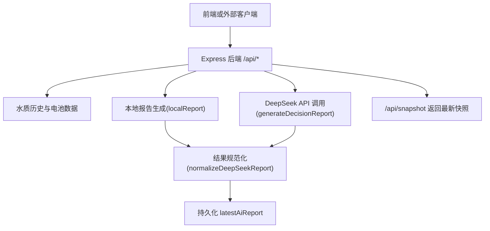
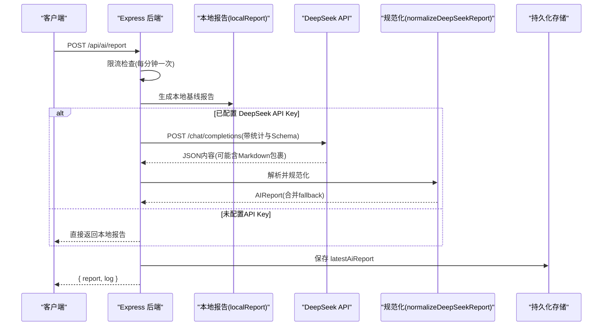
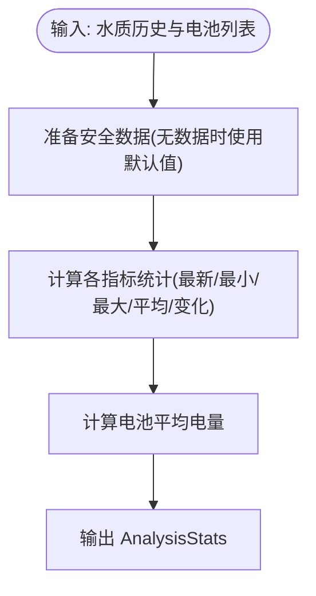
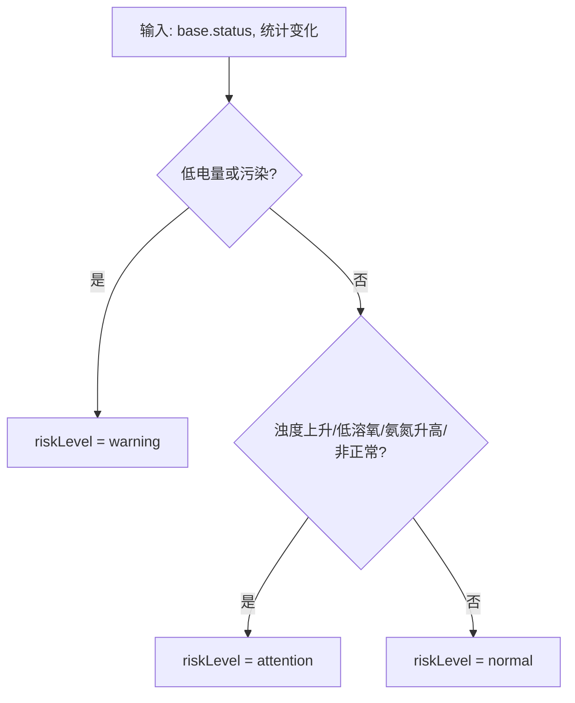
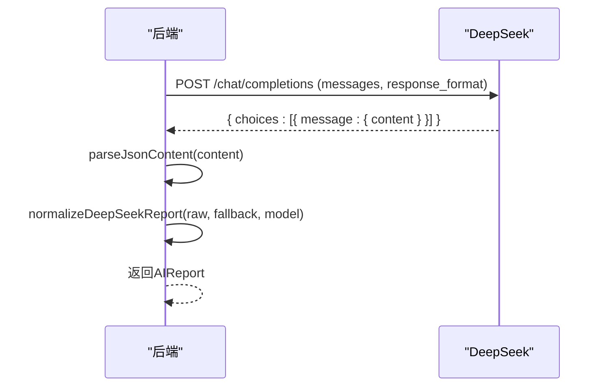
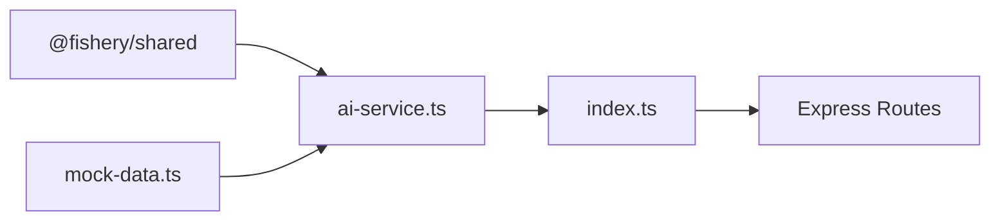

# AI报告生成

<cite>
**本文引用的文件**
- [ai-service.ts](file://fishery-digital-twin-platform/apps/backend/src/ai-service.ts)
- [index.ts](file://fishery-digital-twin-platform/apps/backend/src/index.ts)
- [mock-data.ts](file://fishery-digital-twin-platform/apps/backend/src/mock-data.ts)
- [shared index.ts](file://fishery-digital-twin-platform/packages/shared/src/index.ts)
</cite>

## 目录
1. [简介](#简介)
2. [项目结构](#项目结构)
3. [核心组件](#核心组件)
4. [架构总览](#架构总览)
5. [详细组件分析](#详细组件分析)
6. [依赖关系分析](#依赖关系分析)
7. [性能考虑](#性能考虑)
8. [故障排查指南](#故障排查指南)
9. [结论](#结论)
10. [附录：使用示例与场景](#附录使用示例与场景)

## 简介
本文件面向“智慧渔业数字孪生平台”的AI报告生成功能，系统性说明本地报告生成算法、DeepSeek API集成流程、报告数据结构设计、模板系统（标题、摘要、发现点与建议）、质量评估机制（置信度、数据质量检查、模型性能监控），并提供完整的使用场景与调用示例路径。目标是帮助开发者快速理解并扩展该能力，同时为运维与产品人员提供可操作的排障与优化建议。

## 项目结构
后端服务通过Express暴露REST接口，集中处理水质数据、设备状态、数字孪生推演以及AI报告生成。AI报告由两条路径产出：
- 本地基线报告：基于传感器统计与规则引擎快速生成，不依赖外部模型。
- DeepSeek增强报告：在本地基线基础上，调用DeepSeek Chat Completions接口进行文本增强与结构化输出，再规范化为统一报告结构。

图表来源
- [index.ts:322-473](file://fishery-digital-twin-platform/apps/backend/src/index.ts#L322-L473)
- [ai-service.ts:167-232](file://fishery-digital-twin-platform/apps/backend/src/ai-service.ts#L167-L232)

章节来源
- [index.ts:1-120](file://fishery-digital-twin-platform/apps/backend/src/index.ts#L1-L120)
- [ai-service.ts:1-20](file://fishery-digital-twin-platform/apps/backend/src/ai-service.ts#L1-L20)

## 核心组件
- 水质统计分析：计算温度、浊度、pH、溶解氧、氨氮、电导率的最新值、均值、极值与变化量；结合电池平均电量评估风险等级。
- 风险等级评估：将WaterStatus映射到AIReport.riskLevel，并结合阈值与趋势判定warning/attention/normal。
- 建议生成逻辑：根据指标异常与趋势组合生成针对性建议，如浊度上升、低溶解氧、氨氮升高、低电量等。
- DeepSeek集成：构造系统提示与用户消息，发送JSON Schema约束的请求，解析响应并规范化为AIReport。
- 报告数据结构：统一AIReport接口定义，包含id、generatedAt、status、riskLevel、title、summary、findings、recommendations、dataQuality、confidence、sampleCount、model、forecast等字段。
- 模板系统：标题、摘要、发现点与建议均支持本地模板与AI增强模板融合，保证可读性与一致性。
- 质量评估：置信度计算、数据来源标注、样本数量与趋势稳定性纳入质量描述；模型名称与时间戳用于性能追踪。

章节来源
- [ai-service.ts:33-122](file://fishery-digital-twin-platform/apps/backend/src/ai-service.ts#L33-L122)
- [shared index.ts:65-84](file://fishery-digital-twin-platform/packages/shared/src/index.ts#L65-L84)

## 架构总览
AI报告生成的端到端流程如下：
- 触发：前端或外部系统调用POST /api/ai/report（需鉴权）。
- 限流：同一分钟内仅允许一次请求，避免过度调用。
- 本地基线：优先计算localReport作为fallback，确保即使外部模型不可用也能返回可用报告。
- 可选AI增强：若配置了DEEPSEEK_API_KEY，则发起Chat Completions请求，携带统计信息与参考范围，要求严格JSON输出。
- 规范化：对AI返回的结构进行容错与裁剪，合并到fallback中，形成最终AIReport。
- 持久化：保存latestAiReport，供后续查询与快照展示。

图表来源
- [index.ts:456-473](file://fishery-digital-twin-platform/apps/backend/src/index.ts#L456-L473)
- [ai-service.ts:167-232](file://fishery-digital-twin-platform/apps/backend/src/ai-service.ts#L167-L232)

## 详细组件分析

### 水质统计分析
- 统计维度：温度、浊度、pH、溶解氧、氨氮、电导率，分别计算最新值、最小值、最大值、平均值与周期变化量。
- 安全回退：若无有效水质数据，使用内置默认值继续计算，避免空数组导致错误。
- 电池统计：计算电池平均电量，用于续航与风险判断。

图表来源
- [ai-service.ts:33-73](file://fishery-digital-twin-platform/apps/backend/src/ai-service.ts#L33-L73)

章节来源
- [ai-service.ts:33-73](file://fishery-digital-twin-platform/apps/backend/src/ai-service.ts#L33-L73)

### 风险等级评估
- 状态映射：将WaterStatus映射为AIReport.riskLevel（polluted/algae-risk -> warning；attention -> attention；其他 -> normal）。
- 阈值与趋势：
  - 浊度显著上升（变化>6）视为风险信号。
  - 溶解氧低于5 mg/L视为缺氧风险。
  - 氨氮高于0.2 mg/L或变化>0.08视为潜在污染风险。
  - 电池平均电量低于45%触发警告。
- 综合判定：满足任一高风险条件即提升为warning；否则按次要条件提升为attention；否则为normal。

图表来源
- [ai-service.ts:43-86](file://fishery-digital-twin-platform/apps/backend/src/ai-service.ts#L43-L86)

章节来源
- [ai-service.ts:43-86](file://fishery-digital-twin-platform/apps/backend/src/ai-service.ts#L43-L86)

### 建议生成逻辑
- 针对浊度上升：优先复查采样点，排除泥沙扰动或传感器污染。
- 针对低溶解氧：降低投喂强度，安排增氧或换水检查。
- 针对氨氮升高：复查残饵、排泄物堆积与水交换情况。
- 针对低电量：降低非必要动作频率，预留返航电量。
- 常规建议：保持固定采样路线与间隔，降雨后复测，结合鱼种阈值持续优化。

章节来源
- [ai-service.ts:105-110](file://fishery-digital-twin-platform/apps/backend/src/ai-service.ts#L105-L110)
- [mock-data.ts:224-228](file://fishery-digital-twin-platform/apps/backend/src/mock-data.ts#L224-L228)

### DeepSeek API集成实现
- 环境变量：
  - DEEPSEEK_API_KEY：认证令牌。
  - DEEPSEEK_BASE_URL：API基础地址，默认https://api.deepseek.com。
  - DEEPSEEK_MODEL：模型名，默认deepseek-v4-flash。
  - DEEPSEEK_TIMEOUT_SECONDS：超时秒数，限制在5s~120s之间。
- 请求格式：
  - 方法：POST /chat/completions
  - 头部：Authorization: Bearer <key>, Content-Type: application/json
  - 消息体：messages包含system与user角色；system提示专家身份并要求严格JSON；user消息包含任务、required_schema、aquacultureReference、stats、recentSamples、batteries；response_format指定json_object；temperature=0.2；max_tokens=1200。
- 响应解析：
  - 校验HTTP状态码，非2xx抛出错误。
  - 从choices[0].message.content提取内容，去除可能的Markdown包裹后解析为JSON。
  - 规范化字段：riskLevel兼容下划线命名；title截断至42字符；findings/recommendations取前若干条；dataQuality保留字符串；confidence归一化到[0,1]。
- 错误处理：
  - 网络或鉴权失败：抛出包含状态码与摘要的错误信息。
  - 内容为空：抛出明确错误。
  - JSON解析失败：由上层捕获并记录日志。

图表来源
- [ai-service.ts:167-232](file://fishery-digital-twin-platform/apps/backend/src/ai-service.ts#L167-L232)

章节来源
- [ai-service.ts:160-232](file://fishery-digital-twin-platform/apps/backend/src/ai-service.ts#L160-L232)

### 报告数据结构设计
- AIReport字段含义：
  - id：报告唯一标识。
  - generatedAt：生成时间。
  - status：水质状态（normal/attention/polluted/algae-risk）。
  - riskLevel：风险等级（normal/attention/warning）。
  - title：报告标题（不超过20字）。
  - summary：简洁结论。
  - findings：关键发现（2-4条）。
  - recommendations：行动建议（2-5条）。
  - dataQuality：数据质量说明（来源、样本数、是否混合数据等）。
  - confidence：置信度（0-1小数）。
  - sampleCount：样本数量。
  - model：模型名称（local-predictive-baseline或deepseek-*）。
  - forecast：预测信息（horizonHours、algaeRisk、turbidityTrend、batteryRuntimeHours）。
- 数据验证规则：
  - riskLevel必须为枚举之一。
  - confidence必须在[0,1]范围内。
  - findings/recommendations为字符串数组，长度受限于上限。
  - forecast.algaeRisk为low/medium/high；turbidityTrend为stable/rising/falling。

章节来源
- [shared index.ts:65-84](file://fishery-digital-twin-platform/packages/shared/src/index.ts#L65-L84)
- [ai-service.ts:135-157](file://fishery-digital-twin-platform/apps/backend/src/ai-service.ts#L135-L157)

### 报告模板系统
- 标题生成：
  - 本地模板：根据status映射标题（稳定/关注/污染/藻华风险）。
  - AI模板：从AI返回的title截取并限制长度。
- 摘要编写：
  - 本地模板：依据数据源模式（live/mixed/demo）生成不同摘要，强调参考性质与决策谨慎性。
  - AI模板：直接使用AI返回的summary。
- 发现点提取：
  - 本地模板：列出温度、浊度趋势、pH范围、溶解氧与氨氮等关键指标。
  - AI模板：从AI返回的findings中选取最多6条。
- 建议格式化：
  - 本地模板：给出巡检、复测、阈值绑定等通用建议。
  - AI模板：从AI返回的recommendations中选取最多8条。

章节来源
- [mock-data.ts:207-243](file://fishery-digital-twin-platform/apps/backend/src/mock-data.ts#L207-L243)
- [ai-service.ts:124-157](file://fishery-digital-twin-platform/apps/backend/src/ai-service.ts#L124-L157)

### 质量评估机制
- 置信度计算：
  - 本地基线：根据样本数量动态调整，样本越多置信度越高，上限0.9。
  - AI增强：对AI返回的confidence进行归一化到[0,1]，否则回退到本地置信度。
- 数据质量检查：
  - 标注数据来源（sensor/demo/fallback），区分混合数据模式。
  - 记录样本数量与趋势稳定性（如浊度趋势）。
- 模型性能监控：
  - 记录model字段（local-predictive-baseline或deepseek-*）。
  - 通过日志记录生成成功/失败与耗时（可通过外部监控采集）。
  - 限流策略防止频繁调用影响性能。

章节来源
- [mock-data.ts:229-243](file://fishery-digital-twin-platform/apps/backend/src/mock-data.ts#L229-L243)
- [ai-service.ts:153-157](file://fishery-digital-twin-platform/apps/backend/src/ai-service.ts#L153-L157)
- [index.ts:456-473](file://fishery-digital-twin-platform/apps/backend/src/index.ts#L456-L473)

## 依赖关系分析
- 模块耦合：
  - ai-service.ts依赖@fishery/shared类型定义与mock-data.ts中的createAIReport。
  - index.ts聚合所有业务接口，调用ai-service.ts生成报告，并维护latestAiReport。
- 外部依赖：
  - Express框架提供HTTP服务。
  - Node.js fetch用于DeepSeek API调用。
  - dotenv加载环境变量。
- 潜在循环依赖：
  - 当前结构清晰，ai-service与index之间为单向依赖，无循环引用。

图表来源
- [ai-service.ts:1-2](file://fishery-digital-twin-platform/apps/backend/src/ai-service.ts#L1-L2)
- [index.ts:21-31](file://fishery-digital-twin-platform/apps/backend/src/index.ts#L21-L31)

章节来源
- [ai-service.ts:1-2](file://fishery-digital-twin-platform/apps/backend/src/ai-service.ts#L1-L2)
- [index.ts:21-31](file://fishery-digital-twin-platform/apps/backend/src/index.ts#L21-L31)

## 性能考虑
- 本地报告优先：始终先计算本地基线，确保可用性。
- 超时控制：DeepSeek请求设置超时（5s~120s），避免阻塞。
- 限流保护：AI报告生成每分钟一次，减少外部调用压力。
- 数据规模：waterHistory限制最大历史条目，避免内存膨胀。
- 并发与I/O：使用异步fetch与AbortSignal，提高吞吐与健壮性。

## 故障排查指南
- 常见问题：
  - 未配置DEEPSEEK_API_KEY：返回本地报告，不会调用外部模型。
  - API返回非2xx：抛出包含状态码与摘要的错误，需检查网络与鉴权。
  - 内容为空：抛出“DeepSeek 返回内容为空”，检查模型输出与prompt。
  - JSON解析失败：检查AI返回内容是否符合required_schema，必要时放宽解析逻辑。
- 定位步骤：
  - 查看/api/health确认服务状态与AI配置。
  - 查看/api/logs获取最近日志，定位错误来源。
  - 检查环境变量与网络连通性。
  - 调整timeout或重试策略。

章节来源
- [ai-service.ts:220-232](file://fishery-digital-twin-platform/apps/backend/src/ai-service.ts#L220-L232)
- [index.ts:559-561](file://fishery-digital-twin-platform/apps/backend/src/index.ts#L559-L561)

## 结论
AI报告生成功能在本地基线与AI增强之间提供了灵活切换，既保证了离线可用性，又提升了文本质量与决策支持能力。通过统一的数据结构、严格的字段验证与质量评估机制，确保了报告的可靠性与可追溯性。建议在生产环境中结合监控与日志，持续优化提示词与阈值策略，以获得更准确的报告输出。

## 附录：使用示例与场景
- 生成AI报告：
  - 接口：POST /api/ai/report
  - 鉴权：需要X-UISYS-Token（当配置了UISYS_API_TOKEN时）
  - 频率：每分钟一次
  - 返回：{ report, log }
  - 参考路径：[index.ts:456-473](file://fishery-digital-twin-platform/apps/backend/src/index.ts#L456-L473)
- 查询AI报告状态：
  - 接口：GET /api/ai/status
  - 返回：{ configured, model, hasReport }
  - 参考路径：[index.ts:447-447](file://fishery-digital-twin-platform/apps/backend/src/index.ts#L447-L447)
- 获取最新AI报告：
  - 接口：GET /api/ai/report
  - 返回：AIReport或404
  - 参考路径：[index.ts:448-454](file://fishery-digital-twin-platform/apps/backend/src/index.ts#L448-L454)
- 获取平台快照（包含AI报告）：
  - 接口：GET /api/snapshot
  - 返回：PlatformSnapshot
  - 参考路径：[index.ts:336-336](file://fishery-digital-twin-platform/apps/backend/src/index.ts#L336-L336)
- 注入传感器数据：
  - 接口：POST /api/data
  - 鉴权：需要X-UISYS-Token
  - 返回：{ message, packet, snapshot }
  - 参考路径：[index.ts:367-430](file://fishery-digital-twin-platform/apps/backend/src/index.ts#L367-L430)
- 演示数据生成：
  - 接口：POST /api/demo/simulate
  - 鉴权：需要X-UISYS-Token
  - 返回：{ count, water, snapshot, log }
  - 参考路径：[index.ts:432-441](file://fishery-digital-twin-platform/apps/backend/src/index.ts#L432-L441)

章节来源
- [index.ts:336-473](file://fishery-digital-twin-platform/apps/backend/src/index.ts#L336-L473)