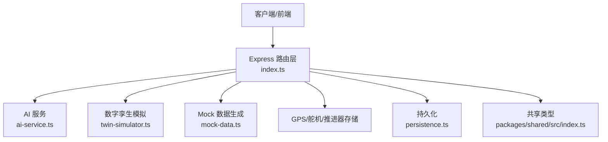
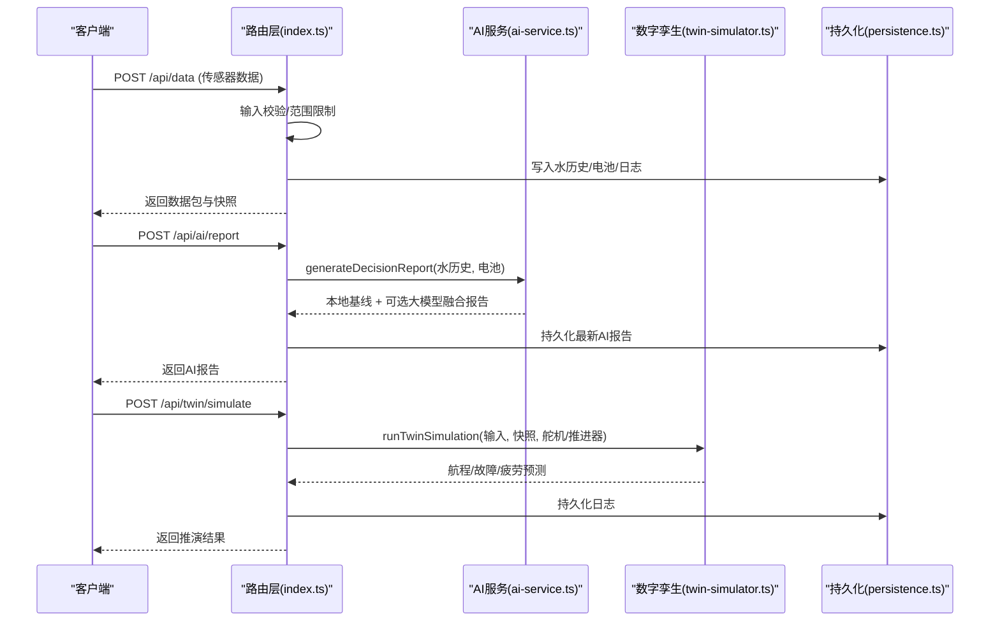
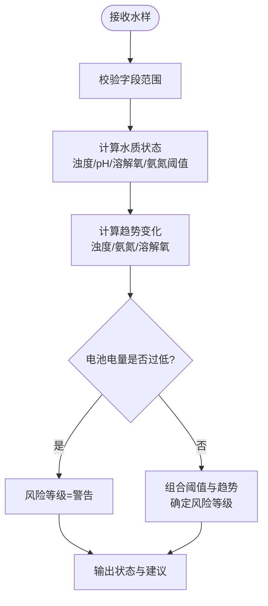
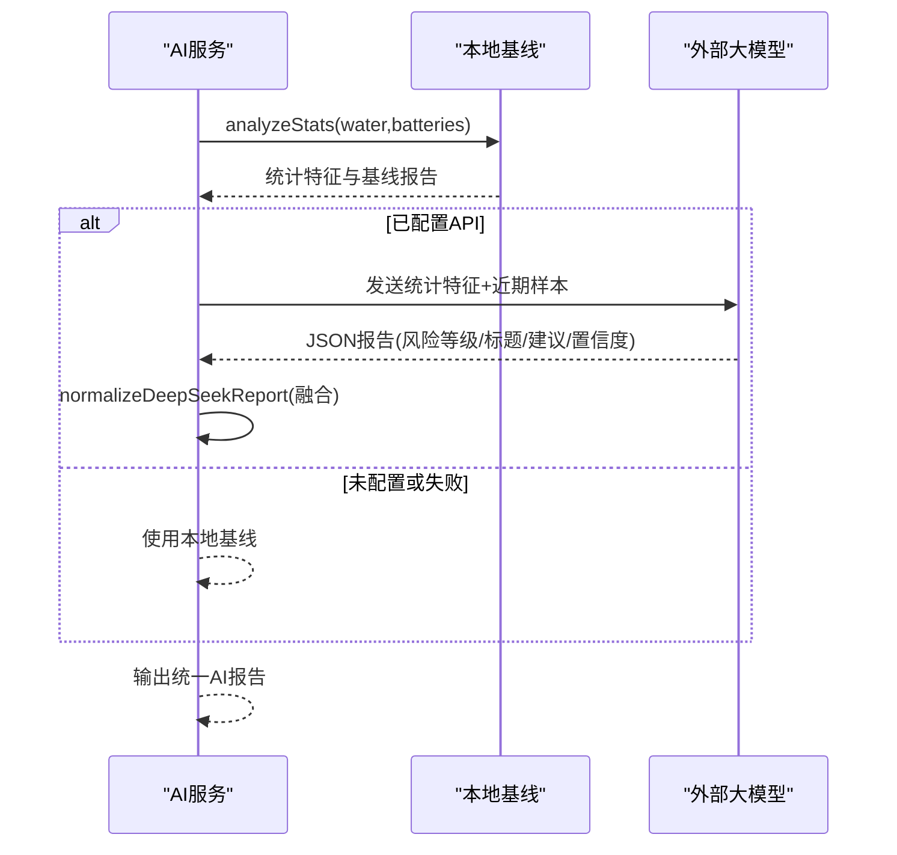
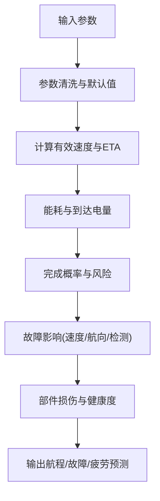
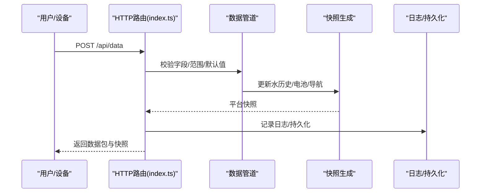
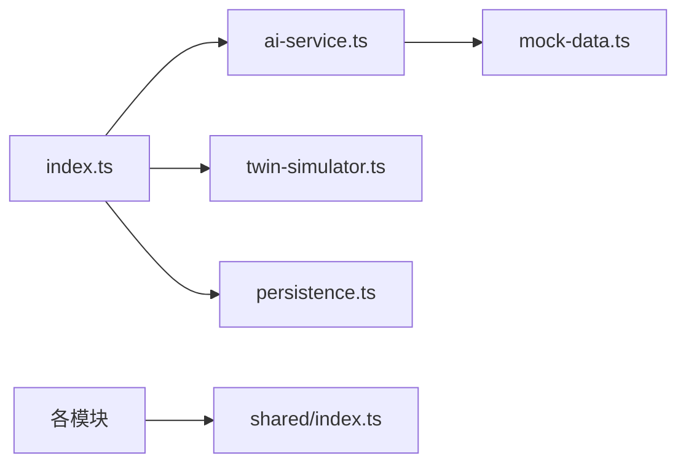
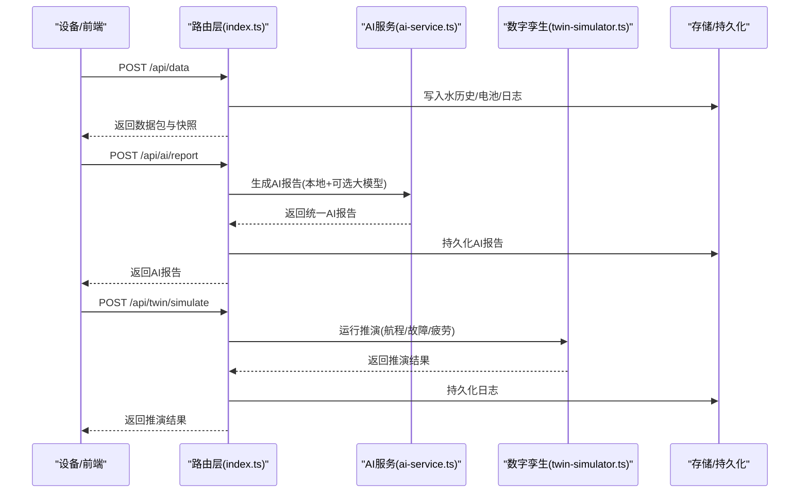

# 决策引擎

<cite>
**本文引用的文件**
- [index.ts](file://fishery-digital-twin-platform/apps/backend/src/index.ts)
- [ai-service.ts](file://fishery-digital-twin-platform/apps/backend/src/ai-service.ts)
- [twin-simulator.ts](file://fishery-digital-twin-platform/apps/backend/src/twin-simulator.ts)
- [mock-data.ts](file://fishery-digital-twin-platform/apps/backend/src/mock-data.ts)
- [persistence.ts](file://fishery-digital-twin-platform/apps/backend/src/persistence.ts)
- [index.ts（共享类型）](file://fishery-digital-twin-platform/packages/shared/src/index.ts)
</cite>

## 目录
1. [简介](#简介)
2. [项目结构](#项目结构)
3. [核心组件](#核心组件)
4. [架构总览](#架构总览)
5. [详细组件分析](#详细组件分析)
6. [依赖关系分析](#依赖关系分析)
7. [性能与可扩展性](#性能与可扩展性)
8. [故障排查指南](#故障排查指南)
9. [结论](#结论)
10. [附录：流程图与示例](#附录流程图与示例)

## 简介
本文件面向“智慧渔业数字孪生平台”的决策引擎，系统性说明规则引擎实现、混合推理机制、决策流程控制、可解释性设计、扩展机制与质量监控。该平台的决策能力由三部分构成：
- 水质规则引擎：基于阈值与趋势的专家系统，输出风险等级与建议。
- 大模型增强：可选接入 DeepSeek 等外部大模型，对统计特征进行自然语言总结与策略建议生成。
- 数字孪生推演：基于设备状态、海况与故障场景的能耗、航程完成度与疲劳寿命预测。

这些模块通过统一的 HTTP API 暴露，形成从输入验证、中间结果处理到输出格式化的完整决策流水线。

## 项目结构
后端以 Express 应用为入口，集中管理路由、鉴权、数据持久化与日志；AI 服务负责本地基线与可选的大模型报告；数字孪生模拟器负责航线与故障推演；共享类型定义贯穿前后端。

**图表来源**
- [index.ts:56-110](file://fishery-digital-twin-platform/apps/backend/src/index.ts#L56-L110)
- [ai-service.ts:167-233](file://fishery-digital-twin-platform/apps/backend/src/ai-service.ts#L167-L233)
- [twin-simulator.ts:74-254](file://fishery-digital-twin-platform/apps/backend/src/twin-simulator.ts#L74-L254)
- [mock-data.ts:192-244](file://fishery-digital-twin-platform/apps/backend/src/mock-data.ts#L192-L244)
- [persistence.ts:32-68](file://fishery-digital-twin-platform/apps/backend/src/persistence.ts#L32-L68)
- [index.ts（共享类型）:65-106](file://fishery-digital-twin-platform/packages/shared/src/index.ts#L65-L106)

**章节来源**
- [index.ts:56-110](file://fishery-digital-twin-platform/apps/backend/src/index.ts#L56-L110)
- [index.ts（共享类型）:65-106](file://fishery-digital-twin-platform/packages/shared/src/index.ts#L65-L106)

## 核心组件
- 规则引擎（水质）：在传感器数据接收时计算水样状态，并在快照中提供风险等级与趋势判断。
- 混合推理（AI 报告）：先构建本地统计与基线报告，再可选调用外部大模型，融合后输出统一结构。
- 数字孪生推演：根据当前快照、执行机构反馈与故障场景，输出航程完成概率、能耗、疲劳与健康度。
- 流程控制：统一的路由层负责输入校验、鉴权、错误处理、日志记录与状态持久化。
- 可解释性：所有报告均包含数据来源、置信度、关键发现与建议，并附带假设与限制说明。
- 扩展机制：新增规则可通过修改阈值函数或扩展 AI 提示词；算法插件通过独立模块注入；第三方服务通过环境变量配置。
- 质量监控：内置健康检查接口、系统日志、AI 状态查询与持久化恢复，便于评估与回滚。

**章节来源**
- [index.ts:367-430](file://fishery-digital-twin-platform/apps/backend/src/index.ts#L367-L430)
- [ai-service.ts:49-122](file://fishery-digital-twin-platform/apps/backend/src/ai-service.ts#L49-L122)
- [twin-simulator.ts:74-254](file://fishery-digital-twin-platform/apps/backend/src/twin-simulator.ts#L74-L254)
- [index.ts:322-334](file://fishery-digital-twin-platform/apps/backend/src/index.ts#L322-L334)

## 架构总览
决策引擎采用“路由层 + 领域服务 + 共享类型”的分层架构。路由层负责请求解析、鉴权、错误处理与日志；领域服务封装规则、AI 与大模型、数字孪生推演；共享类型保证前后端一致的数据契约。

**图表来源**
- [index.ts:367-430](file://fishery-digital-twin-platform/apps/backend/src/index.ts#L367-L430)
- [index.ts:456-473](file://fishery-digital-twin-platform/apps/backend/src/index.ts#L456-L473)
- [index.ts:540-555](file://fishery-digital-twin-platform/apps/backend/src/index.ts#L540-L555)
- [ai-service.ts:167-233](file://fishery-digital-twin-platform/apps/backend/src/ai-service.ts#L167-L233)
- [twin-simulator.ts:74-254](file://fishery-digital-twin-platform/apps/backend/src/twin-simulator.ts#L74-L254)
- [persistence.ts:51-68](file://fishery-digital-twin-platform/apps/backend/src/persistence.ts#L51-L68)

## 详细组件分析

### 规则引擎（水质阈值与趋势）
- 条件判断：依据浊度、pH、溶解氧、氨氮等指标阈值判定水质状态（正常/关注/污染/藻华风险）。
- 逻辑运算：结合最近样本变化量（如浊度上升、氨氮升高、溶解氧偏低）与电池电量，综合得出风险等级。
- 优先级管理：当电池电量低或水质达到污染级别时，直接提升风险等级；否则按趋势与阈值组合判定。

**图表来源**
- [index.ts:367-430](file://fishery-digital-twin-platform/apps/backend/src/index.ts#L367-L430)
- [mock-data.ts:27-32](file://fishery-digital-twin-platform/apps/backend/src/mock-data.ts#L27-L32)
- [ai-service.ts:49-122](file://fishery-digital-twin-platform/apps/backend/src/ai-service.ts#L49-L122)

**章节来源**
- [index.ts:367-430](file://fishery-digital-twin-platform/apps/backend/src/index.ts#L367-L430)
- [mock-data.ts:27-32](file://fishery-digital-twin-platform/apps/backend/src/mock-data.ts#L27-L32)
- [ai-service.ts:49-122](file://fishery-digital-twin-platform/apps/backend/src/ai-service.ts#L49-L122)

### 混合推理机制（专家系统 + 大模型）
- 专家系统：基于统计特征（均值、极值、变化量）与养殖参考范围，生成结构化报告（标题、摘要、发现、建议、置信度）。
- 大模型融合：若配置了外部 API Key，则发送统计特征与近期样本给大模型，要求严格 JSON 输出；将大模型结果与本地基线融合，保留必要字段并进行归一化。
- 降级策略：未配置 API 或网络异常时，始终返回本地基线报告，确保可用性。

**图表来源**
- [ai-service.ts:49-122](file://fishery-digital-twin-platform/apps/backend/src/ai-service.ts#L49-L122)
- [ai-service.ts:130-158](file://fishery-digital-twin-platform/apps/backend/src/ai-service.ts#L130-L158)
- [ai-service.ts:167-233](file://fishery-digital-twin-platform/apps/backend/src/ai-service.ts#L167-L233)

**章节来源**
- [ai-service.ts:49-122](file://fishery-digital-twin-platform/apps/backend/src/ai-service.ts#L49-L122)
- [ai-service.ts:130-158](file://fishery-digital-twin-platform/apps/backend/src/ai-service.ts#L130-L158)
- [ai-service.ts:167-233](file://fishery-digital-twin-platform/apps/backend/src/ai-service.ts#L167-L233)

### 数字孪生推演（航线、故障、疲劳）
- 输入校验：对航距、目标速度、海况、故障类型与严重度、运行时长、舵机动作次数等进行边界约束与默认值填充。
- 航程预测：考虑海况、执行机构反馈误差与电机不对称，估算有效速度、ETA、能耗、到达电量与完成概率。
- 故障推演：针对舵机卡滞、电机降额、反馈丢失三类故障，计算速度损失、航向漂移、检测时间与降级建议。
- 疲劳与健康：基于推进器负载、舵机跟踪误差、船体等效小时与电池折算循环，计算各部件损伤与整体健康度，给出下次巡检时间。

**图表来源**
- [twin-simulator.ts:35-50](file://fishery-digital-twin-platform/apps/backend/src/twin-simulator.ts#L35-L50)
- [twin-simulator.ts:74-116](file://fishery-digital-twin-platform/apps/backend/src/twin-simulator.ts#L74-L116)
- [twin-simulator.ts:118-153](file://fishery-digital-twin-platform/apps/backend/src/twin-simulator.ts#L118-L153)
- [twin-simulator.ts:155-189](file://fishery-digital-twin-platform/apps/backend/src/twin-simulator.ts#L155-L189)

**章节来源**
- [twin-simulator.ts:35-50](file://fishery-digital-twin-platform/apps/backend/src/twin-simulator.ts#L35-L50)
- [twin-simulator.ts:74-254](file://fishery-digital-twin-platform/apps/backend/src/twin-simulator.ts#L74-L254)

### 决策流程控制（输入验证、中间结果、输出格式化）
- 输入验证：对数值字段进行范围限制与类型转换，缺失字段使用上一时刻或默认值；对可选字段进行安全读取。
- 中间结果：维护水历史、电池状态、导航信息、设备在线状态，并生成平台快照；AI 报告按需刷新。
- 输出格式化：统一返回结构（数据包、快照、AI 报告、推演结果），并附带日志条目与持久化。

**图表来源**
- [index.ts:159-176](file://fishery-digital-twin-platform/apps/backend/src/index.ts#L159-L176)
- [index.ts:367-430](file://fishery-digital-twin-platform/apps/backend/src/index.ts#L367-L430)
- [index.ts:247-262](file://fishery-digital-twin-platform/apps/backend/src/index.ts#L247-L262)
- [persistence.ts:51-68](file://fishery-digital-twin-platform/apps/backend/src/persistence.ts#L51-L68)

**章节来源**
- [index.ts:159-176](file://fishery-digital-twin-platform/apps/backend/src/index.ts#L159-L176)
- [index.ts:367-430](file://fishery-digital-twin-platform/apps/backend/src/index.ts#L367-L430)
- [index.ts:247-262](file://fishery-digital-twin-platform/apps/backend/src/index.ts#L247-L262)
- [persistence.ts:51-68](file://fishery-digital-twin-platform/apps/backend/src/persistence.ts#L51-L68)

### 可解释性设计（追溯、置信度、不确定性）
- 决策依据追溯：AI 报告包含数据来源、样本数量、模型版本、关键发现与建议；数字孪生结果包含数据来源与假设说明。
- 置信度展示：AI 报告提供置信度（0-1），数字孪生提供百分比置信度；两者均随数据质量与设备在线情况动态调整。
- 不确定性量化：明确标注数据来源（真实/演示/混合）、假设（未接入风速/流速/浪高传感器）、限制（工程估算尚未校准）。

**章节来源**
- [ai-service.ts:75-122](file://fishery-digital-twin-platform/apps/backend/src/ai-service.ts#L75-L122)
- [ai-service.ts:135-158](file://fishery-digital-twin-platform/apps/backend/src/ai-service.ts#L135-L158)
- [twin-simulator.ts:225-251](file://fishery-digital-twin-platform/apps/backend/src/twin-simulator.ts#L225-L251)

### 扩展机制（新规则、算法插件、第三方集成）
- 新规则添加：修改水质阈值函数或趋势判断逻辑，即可快速扩展规则集；建议在共享类型中定义新的状态枚举。
- 算法插件：将特定算法封装为独立模块，通过路由层注入；例如新增统计模型或机器学习推理模块。
- 第三方服务集成：通过环境变量配置 API Key、Base URL、超时与模型名；对外部响应进行规范化与降级处理。

**章节来源**
- [ai-service.ts:160-178](file://fishery-digital-twin-platform/apps/backend/src/ai-service.ts#L160-L178)
- [ai-service.ts:180-233](file://fishery-digital-twin-platform/apps/backend/src/ai-service.ts#L180-L233)
- [index.ts:48-76](file://fishery-digital-twin-platform/apps/backend/src/index.ts#L48-L76)

### 决策质量监控（准确性评估、反馈学习、模型更新）
- 准确性评估：通过健康检查接口获取服务状态、数据模式、AI 状态、GPS/舵机/推进器快照；结合系统日志追踪异常。
- 反馈学习：持续收集传感器数据与 AI 报告，用于后续模型校准与阈值优化；可在未来引入人工标注与对照样本。
- 模型更新策略：支持切换不同大模型与 Base URL；对外部 API 设置超时与重试策略；保持本地基线作为兜底。

**章节来源**
- [index.ts:322-334](file://fishery-digital-twin-platform/apps/backend/src/index.ts#L322-L334)
- [index.ts:557-561](file://fishery-digital-twin-platform/apps/backend/src/index.ts#L557-L561)
- [ai-service.ts:160-178](file://fishery-digital-twin-platform/apps/backend/src/ai-service.ts#L160-L178)

## 依赖关系分析
- 路由层依赖 AI 服务与数字孪生模块，并通过共享类型约束数据结构。
- AI 服务依赖 Mock 数据生成器与外部大模型 API；具备降级能力。
- 数字孪生模块依赖设备快照（舵机/推进器）与平台快照，输出结构化预测结果。
- 持久化模块负责状态落盘，保障重启恢复与审计。

**图表来源**
- [index.ts:21-44](file://fishery-digital-twin-platform/apps/backend/src/index.ts#L21-L44)
- [ai-service.ts:1-3](file://fishery-digital-twin-platform/apps/backend/src/ai-service.ts#L1-L3)
- [twin-simulator.ts:1-10](file://fishery-digital-twin-platform/apps/backend/src/twin-simulator.ts#L1-L10)
- [persistence.ts:1-9](file://fishery-digital-twin-platform/apps/backend/src/persistence.ts#L1-L9)
- [index.ts（共享类型）:65-106](file://fishery-digital-twin-platform/packages/shared/src/index.ts#L65-L106)

**章节来源**
- [index.ts:21-44](file://fishery-digital-twin-platform/apps/backend/src/index.ts#L21-L44)
- [ai-service.ts:1-3](file://fishery-digital-twin-platform/apps/backend/src/ai-service.ts#L1-L3)
- [twin-simulator.ts:1-10](file://fishery-digital-twin-platform/apps/backend/src/twin-simulator.ts#L1-L10)
- [persistence.ts:1-9](file://fishery-digital-twin-platform/apps/backend/src/persistence.ts#L1-L9)
- [index.ts（共享类型）:65-106](file://fishery-digital-twin-platform/packages/shared/src/index.ts#L65-L106)

## 性能与可扩展性
- 性能特性：
  - 输入校验与范围限制避免无效计算；默认值与平滑过渡减少抖动。
  - 数字孪生推演采用准静态模型，计算复杂度低，适合实时交互。
  - 大模型调用带超时与降级，避免阻塞主流程。
- 可扩展性：
  - 规则与阈值集中在函数内，易于替换与扩展。
  - 外部服务通过环境变量配置，支持多模型与多端点。
  - 共享类型统一数据结构，便于前后端协同演进。

[本节为通用指导，不直接分析具体文件]

## 故障排查指南
- 常见问题定位：
  - 端口冲突或服务启动失败：查看 HTTP 启动错误与 UDP 发现端口占用。
  - CORS 拒绝：检查允许的源列表与请求头。
  - 鉴权失败：确认 X-UISYS-Token 是否正确配置与传递。
  - AI 报告失败：检查 API Key、Base URL、超时设置与返回内容是否为空。
  - 数字孪生失败：检查输入参数是否在合法范围内，设备快照是否在线。
- 日志与持久化：
  - 系统日志记录关键事件与错误；持久化状态支持重启恢复。
  - 健康检查接口可用于快速评估服务状态。

**章节来源**
- [index.ts:559-561](file://fishery-digital-twin-platform/apps/backend/src/index.ts#L559-L561)
- [index.ts:563-599](file://fishery-digital-twin-platform/apps/backend/src/index.ts#L563-L599)
- [persistence.ts:17-30](file://fishery-digital-twin-platform/apps/backend/src/persistence.ts#L17-L30)
- [ai-service.ts:220-233](file://fishery-digital-twin-platform/apps/backend/src/ai-service.ts#L220-L233)

## 结论
该决策引擎以规则为基础、以大模型为增强、以数字孪生为推演，形成完整的“感知-推理-预测-决策”闭环。其优势在于：
- 可解释性强：每个决策都有依据、置信度与假设说明。
- 鲁棒性好：具备降级与容错机制，确保离线与异常场景可用。
- 可扩展性高：规则、算法与第三方服务均可模块化扩展。
未来可进一步引入更多传感器数据、在线学习与模型校准，以提升决策准确性与时效性。

[本节为总结，不直接分析具体文件]

## 附录：流程图与示例

### 完整决策流程图

**图表来源**
- [index.ts:367-430](file://fishery-digital-twin-platform/apps/backend/src/index.ts#L367-L430)
- [index.ts:456-473](file://fishery-digital-twin-platform/apps/backend/src/index.ts#L456-L473)
- [index.ts:540-555](file://fishery-digital-twin-platform/apps/backend/src/index.ts#L540-L555)
- [ai-service.ts:167-233](file://fishery-digital-twin-platform/apps/backend/src/ai-service.ts#L167-L233)
- [twin-simulator.ts:74-254](file://fishery-digital-twin-platform/apps/backend/src/twin-simulator.ts#L74-L254)
- [persistence.ts:51-68](file://fishery-digital-twin-platform/apps/backend/src/persistence.ts#L51-L68)

### 代码实现示例（路径引用）
- 水质规则与状态判定：[index.ts:367-430](file://fishery-digital-twin-platform/apps/backend/src/index.ts#L367-L430)、[mock-data.ts:27-32](file://fishery-digital-twin-platform/apps/backend/src/mock-data.ts#L27-L32)
- AI 报告生成与融合：[ai-service.ts:49-122](file://fishery-digital-twin-platform/apps/backend/src/ai-service.ts#L49-L122)、[ai-service.ts:130-158](file://fishery-digital-twin-platform/apps/backend/src/ai-service.ts#L130-L158)、[ai-service.ts:167-233](file://fishery-digital-twin-platform/apps/backend/src/ai-service.ts#L167-L233)
- 数字孪生推演：[twin-simulator.ts:35-50](file://fishery-digital-twin-platform/apps/backend/src/twin-simulator.ts#L35-L50)、[twin-simulator.ts:74-254](file://fishery-digital-twin-platform/apps/backend/src/twin-simulator.ts#L74-L254)
- 输入校验与范围限制：[index.ts:159-176](file://fishery-digital-twin-platform/apps/backend/src/index.ts#L159-L176)
- 健康检查与状态查询：[index.ts:322-334](file://fishery-digital-twin-platform/apps/backend/src/index.ts#L322-L334)
- 持久化与恢复：[persistence.ts:32-68](file://fishery-digital-twin-platform/apps/backend/src/persistence.ts#L32-L68)