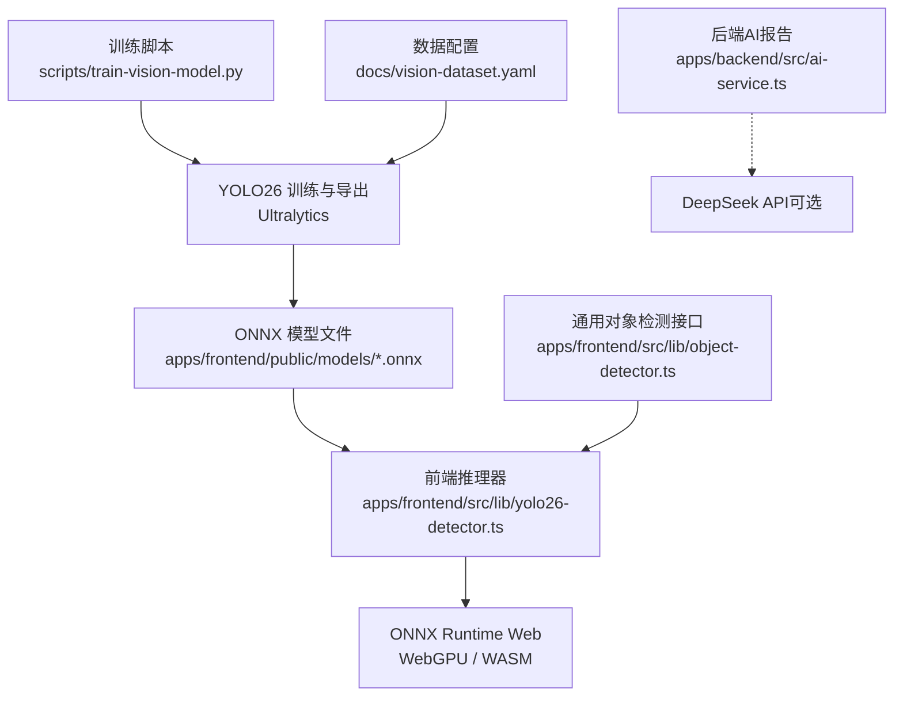
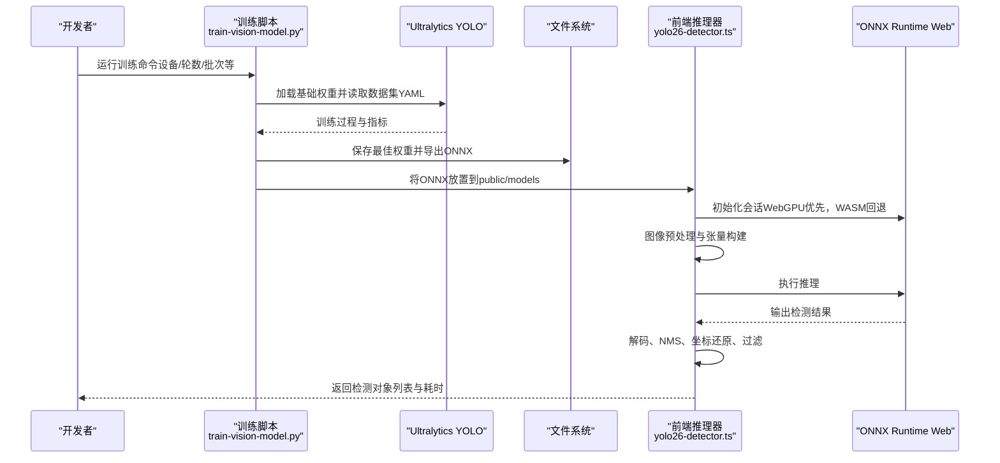
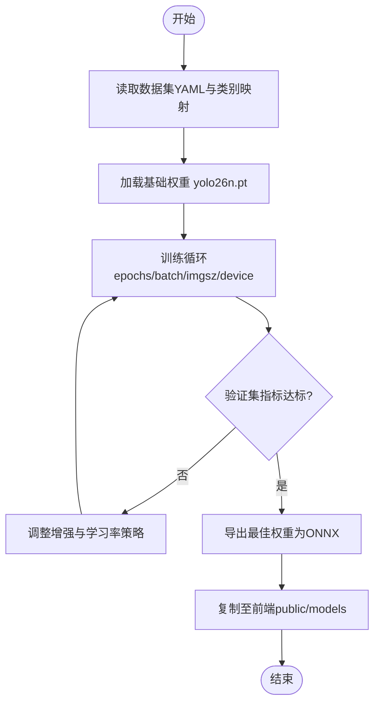
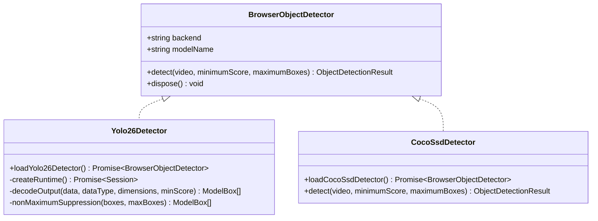
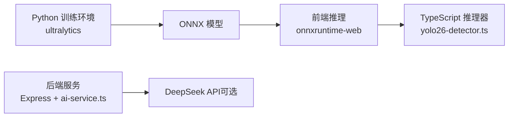

# 模型训练流水线

<cite>
**本文引用的文件**
- [train-vision-model.py](file://fishery-digital-twin-platform/scripts/train-vision-model.py)
- [vision-model-training.md](file://fishery-digital-twin-platform/docs/vision-model-training.md)
- [vision-dataset.yaml](file://fishery-digital-twin-platform/docs/vision-dataset.yaml)
- [yolo26-detector.ts](file://fishery-digital-twin-platform/apps/frontend/src/lib/yolo26-detector.ts)
- [object-detector.ts](file://fishery-digital-twin-platform/apps/frontend/src/lib/object-detector.ts)
- [ai-service.ts](file://fishery-digital-twin-platform/apps/backend/src/ai-service.ts)
- [frontend package.json](file://fishery-digital-twin-platform/apps/frontend/package.json)
- [backend package.json](file://fishery-digital-twin-platform/apps/backend/package.json)
- [README.md](file://fishery-digital-twin-platform/README.md)
</cite>

## 目录
1. [简介](#简介)
2. [项目结构](#项目结构)
3. [核心组件](#核心组件)
4. [架构总览](#架构总览)
5. [详细组件分析](#详细组件分析)
6. [依赖关系分析](#依赖关系分析)
7. [性能与部署优化](#性能与部署优化)
8. [故障排查指南](#故障排查指南)
9. [结论](#结论)
10. [附录：训练脚本使用与配置](#附录训练脚本使用与配置)

## 简介
本技术文档面向“鱼类与水面垃圾识别”的模型训练与部署流水线，覆盖数据管理、训练环境、自动化流程、评估方法、部署适配以及训练脚本使用说明。系统采用 YOLO26n 作为基础检测模型，通过项目自有数据集微调后导出为 ONNX 格式，在前端浏览器中基于 ONNX Runtime Web（WebGPU/WASM）进行推理；同时提供 COCO-SSD MobileNet V2 作为回退方案，确保在模型不可用时仍可维持基本目标识别能力。

## 项目结构
围绕模型训练与部署的关键位置如下：
- 训练脚本与数据配置位于 scripts 与 docs 目录
- 前端推理逻辑位于 apps/frontend/src/lib
- 后端 AI 报告生成位于 apps/backend/src
- 公共静态资源（含默认 ONNX 模型）位于 apps/frontend/public/models

图表来源
- [train-vision-model.py:22-80](file://fishery-digital-twin-platform/scripts/train-vision-model.py#L22-L80)
- [vision-dataset.yaml:1-19](file://fishery-digital-twin-platform/docs/vision-dataset.yaml#L1-L19)
- [yolo26-detector.ts:147-264](file://fishery-digital-twin-platform/apps/frontend/src/lib/yolo26-detector.ts#L147-L264)
- [object-detector.ts:236-267](file://fishery-digital-twin-platform/apps/frontend/src/lib/object-detector.ts#L236-L267)
- [ai-service.ts:167-232](file://fishery-digital-twin-platform/apps/backend/src/ai-service.ts#L167-L232)

章节来源
- [README.md:16-34](file://fishery-digital-twin-platform/README.md#L16-L34)

## 核心组件
- 训练脚本：负责加载基础权重、读取数据集 YAML、执行训练、导出最佳权重为 ONNX 并复制到前端 public 目录。
- 数据配置：定义数据集路径、划分方式与类别映射。
- 前端推理：自动选择 WebGPU 或 WASM 执行后端，完成图像预处理、张量构建、推理、解码、NMS、坐标还原与结果输出。
- 通用检测接口：统一封装 YOLO26 与 COCO-SSD 两种引擎，并提供标签映射与可视化绘制工具。
- 后端 AI 报告：在无外部大模型时提供本地统计报告，支持接入 DeepSeek API 生成结构化决策报告。

章节来源
- [train-vision-model.py:22-80](file://fishery-digital-twin-platform/scripts/train-vision-model.py#L22-L80)
- [vision-dataset.yaml:1-19](file://fishery-digital-twin-platform/docs/vision-dataset.yaml#L1-L19)
- [yolo26-detector.ts:147-264](file://fishery-digital-twin-platform/apps/frontend/src/lib/yolo26-detector.ts#L147-L264)
- [object-detector.ts:4-22](file://fishery-digital-twin-platform/apps/frontend/src/lib/object-detector.ts#L4-L22)
- [ai-service.ts:167-232](file://fishery-digital-twin-platform/apps/backend/src/ai-service.ts#L167-L232)

## 架构总览
下图展示从数据到训练的端到端链路，以及训练产物在前端的推理流程。

图表来源
- [train-vision-model.py:43-80](file://fishery-digital-twin-platform/scripts/train-vision-model.py#L43-L80)
- [yolo26-detector.ts:147-264](file://fishery-digital-twin-platform/apps/frontend/src/lib/yolo26-detector.ts#L147-L264)

## 详细组件分析

### 数据管理与版本控制
- 数据组织：数据集 YAML 指定 path、train/val/test 子目录及 names 类别映射。建议将图片与标注按视频片段划分，避免同一段视频的相邻帧随机拆分导致验证虚高。
- 类别规范：包含 fish、plastic_bottle、plastic_bag、can、foam、fishing_net、branch、aquatic_plant、other_trash、person。其中 person 用于安全拦截，不作为跟踪目标。
- 数据收集建议：以现场实拍为主，覆盖多种光照与水况；补充公开数据集增强泛化；保留困难样本与负样本。
- 版本控制：建议对数据集与 YAML 进行独立版本化管理（如 Git LFS），并在训练日志中记录使用的数据版本哈希，便于复现实验。

章节来源
- [vision-dataset.yaml:1-19](file://fishery-digital-twin-platform/docs/vision-dataset.yaml#L1-L19)
- [vision-model-training.md:9-49](file://fishery-digital-twin-platform/docs/vision-model-training.md#L9-L49)

### 训练环境配置
- Python 环境：在独立环境中安装 ultralytics。
- GPU 加速：通过 --device 指定 CUDA 设备编号或使用 cpu。
- 分布式训练：当前脚本未内置分布式参数；如需多卡或多机训练，可在 Ultralytics 框架基础上扩展启动脚本与环境变量。
- 依赖说明：前端依赖 onnxruntime-web 与 tensorflow.js（用于 COCO-SSD 回退）。

章节来源
- [train-vision-model.py:22-40](file://fishery-digital-twin-platform/scripts/train-vision-model.py#L22-L40)
- [frontend package.json:14-31](file://fishery-digital-twin-platform/apps/frontend/package.json#L14-L31)
- [backend package.json:13-25](file://fishery-digital-twin-platform/apps/backend/package.json#L13-L25)

### 训练流程自动化
- 数据预处理：训练脚本调用 Ultralytics 内部预处理管线，包括图像缩放、色彩抖动、翻转、平移、缩放等增强。
- 模型训练：加载基础权重 yolo26n.pt，按 epochs、batch、imgsz、device 等参数训练，缓存开启以提升效率。
- 超参数调优：可通过命令行调整 epochs、image-size、batch、device；也可在训练阶段调整增强强度与早停策略。
- 结果验证：训练完成后导出最佳权重为 ONNX，并复制到前端 public/models 目录供推理使用。

图表来源
- [train-vision-model.py:43-80](file://fishery-digital-twin-platform/scripts/train-vision-model.py#L43-L80)

章节来源
- [train-vision-model.py:43-80](file://fishery-digital-twin-platform/scripts/train-vision-model.py#L43-L80)

### 模型评估方法
- 验收指标：要求每个核心类别至少 200 个验证实例；统计 mAP50-95、Precision、Recall；针对小目标、遮挡、反光、浑水与夜间画面单独测试；人员邻近目标时触发安全暂停。
- 实船测试：连续运行至少 30 分钟，记录误报、漏报与平均推理耗时；确认断流、低帧率与目标短暂消失时的鲁棒性。
- 工程建议：建立离线评测集与自动化评测脚本，记录每版模型的指标变化与回归情况。

章节来源
- [vision-model-training.md:77-87](file://fishery-digital-twin-platform/docs/vision-model-training.md#L77-L87)

### 模型部署流程
- 格式转换：训练结束后导出 ONNX，设置 opset、NMS、simplify 等选项以获得更高效的推理图。
- 压缩优化：可考虑量化与算子融合（由导出参数控制），减少体积与提升速度。
- 边缘设备适配：前端通过 ONNX Runtime Web 在浏览器内推理，优先使用 WebGPU，不支持时回退到 WASM；WASM 资源随网页打包，支持离线运行。
- 环境变量：可通过 NEXT_PUBLIC_YOLO_MODEL_URL 与 NEXT_PUBLIC_YOLO_CLASS_NAMES 切换专用模型与类别名；COCO-SSD 模型 URL 也可通过 NEXT_PUBLIC_COCO_SSD_MODEL_URL 配置。

图表来源
- [object-detector.ts:16-22](file://fishery-digital-twin-platform/apps/frontend/src/lib/object-detector.ts#L16-L22)
- [yolo26-detector.ts:147-264](file://fishery-digital-twin-platform/apps/frontend/src/lib/yolo26-detector.ts#L147-L264)
- [object-detector.ts:193-234](file://fishery-digital-twin-platform/apps/frontend/src/lib/object-detector.ts#L193-L234)

章节来源
- [yolo26-detector.ts:147-264](file://fishery-digital-twin-platform/apps/frontend/src/lib/yolo26-detector.ts#L147-L264)
- [object-detector.ts:236-267](file://fishery-digital-twin-platform/apps/frontend/src/lib/object-detector.ts#L236-L267)

### 训练脚本使用说明
- 基本用法：在带 NVIDIA GPU 的机器上创建独立 Python 环境并安装 ultralytics，然后运行训练脚本。
- 关键参数：
  - --data：YOLO 数据集 YAML 路径
  - --model：基础权重文件名（默认 yolo26n.pt）
  - --epochs：训练轮数
  - --image-size：输入图像尺寸
  - --batch：批次大小
  - --device：CUDA 设备编号或 cpu
  - --output：导出的 ONNX 模型输出路径
- 配置文件：数据集 YAML 定义路径、划分与类别映射。
- 日志分析：训练日志会记录损失、指标与早停信息；导出成功后会打印最终模型路径。
- 故障排查：若导出失败，检查磁盘权限与路径；若前端无法加载模型，检查环境变量与 ONNX 文件是否存在。

章节来源
- [train-vision-model.py:22-80](file://fishery-digital-twin-platform/scripts/train-vision-model.py#L22-L80)
- [vision-dataset.yaml:1-19](file://fishery-digital-twin-platform/docs/vision-dataset.yaml#L1-L19)
- [vision-model-training.md:51-75](file://fishery-digital-twin-platform/docs/vision-model-training.md#L51-L75)

## 依赖关系分析
- 训练侧依赖：ultralytics（Python）、YOLO26 基础权重。
- 推理侧依赖：onnxruntime-web（WebGPU/WASM）、tensorflow.js（COCO-SSD 回退）。
- 前后端交互：前端直接加载 ONNX 进行本地推理；后端提供水质分析与决策报告，可接入 DeepSeek API。

图表来源
- [train-vision-model.py:16-17](file://fishery-digital-twin-platform/scripts/train-vision-model.py#L16-L17)
- [frontend package.json:14-31](file://fishery-digital-twin-platform/apps/frontend/package.json#L14-L31)
- [ai-service.ts:167-232](file://fishery-digital-twin-platform/apps/backend/src/ai-service.ts#L167-L232)

章节来源
- [frontend package.json:14-31](file://fishery-digital-twin-platform/apps/frontend/package.json#L14-L31)
- [backend package.json:13-25](file://fishery-digital-twin-platform/apps/backend/package.json#L13-L25)
- [ai-service.ts:167-232](file://fishery-digital-twin-platform/apps/backend/src/ai-service.ts#L167-L232)

## 性能与部署优化
- 训练阶段：
  - 开启缓存与 workers 提升 IO 吞吐
  - 合理设置 batch 与 image-size 平衡显存与精度
  - 使用早停 patience 防止过拟合
- 推理阶段：
  - 优先 WebGPU 执行，提高吞吐与延迟
  - 关闭动态形状与半精度以减少兼容性问题
  - 使用 NMS 与简化图降低后处理开销
  - 将 ONNX 与 WASM 资源放入 public 目录，支持离线运行
- 回退机制：当 YOLO26 模型不可用时，自动切换到 COCO-SSD MobileNet V2，保证基本识别能力。

章节来源
- [train-vision-model.py:46-79](file://fishery-digital-twin-platform/scripts/train-vision-model.py#L46-L79)
- [yolo26-detector.ts:155-186](file://fishery-digital-twin-platform/apps/frontend/src/lib/yolo26-detector.ts#L155-L186)
- [object-detector.ts:236-267](file://fishery-digital-twin-platform/apps/frontend/src/lib/object-detector.ts#L236-L267)

## 故障排查指南
- 训练失败：
  - 检查数据集 YAML 路径与 images/train/val/test 是否存在
  - 检查 GPU 驱动与 CUDA 设备是否可用
  - 查看训练日志中的损失曲线与早停信息
- 导出失败：
  - 检查输出目录权限与磁盘空间
  - 确认 opset 与 nms 参数兼容性
- 前端推理异常：
  - 检查 ONNX 模型是否已复制到 public/models
  - 检查 NEXT_PUBLIC_YOLO_MODEL_URL 与 NEXT_PUBLIC_YOLO_CLASS_NAMES 是否正确
  - 若 WebGPU 不可用，确认 WASM 资源存在并可加载
- 后端报告异常：
  - 检查 DeepSeek API Key 与超时配置
  - 解析 JSON 内容失败时，确认返回格式符合预期

章节来源
- [train-vision-model.py:43-80](file://fishery-digital-twin-platform/scripts/train-vision-model.py#L43-L80)
- [yolo26-detector.ts:187-203](file://fishery-digital-twin-platform/apps/frontend/src/lib/yolo26-detector.ts#L187-L203)
- [ai-service.ts:167-232](file://fishery-digital-twin-platform/apps/backend/src/ai-service.ts#L167-L232)

## 结论
本项目构建了从数据采集、标注、训练到前端部署的完整闭环。通过 YOLO26n 微调与 ONNX 导出，结合 ONNX Runtime Web 的 WebGPU/WASM 推理，实现了浏览器内的高效检测；同时提供 COCO-SSD 回退保障可用性。建议在后续迭代中完善分布式训练、自动化评测与持续集成，进一步提升模型质量与交付效率。

## 附录：训练脚本使用与配置
- 安装依赖：在独立 Python 环境中安装 ultralytics
- 运行示例：python scripts/train-vision-model.py --device 0 --epochs 120
- 输出位置：apps/frontend/public/models/fish-trash-yolo26n.onnx
- 环境变量：NEXT_PUBLIC_YOLO_MODEL_URL 与 NEXT_PUBLIC_YOLO_CLASS_NAMES 用于切换专用模型与类别名
- 注意事项：Ultralytics 涉及 AGPL-3.0/企业许可，商业部署前需确认许可要求

章节来源
- [vision-model-training.md:51-75](file://fishery-digital-twin-platform/docs/vision-model-training.md#L51-L75)
- [train-vision-model.py:22-80](file://fishery-digital-twin-platform/scripts/train-vision-model.py#L22-L80)