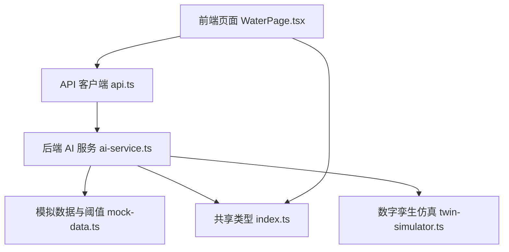
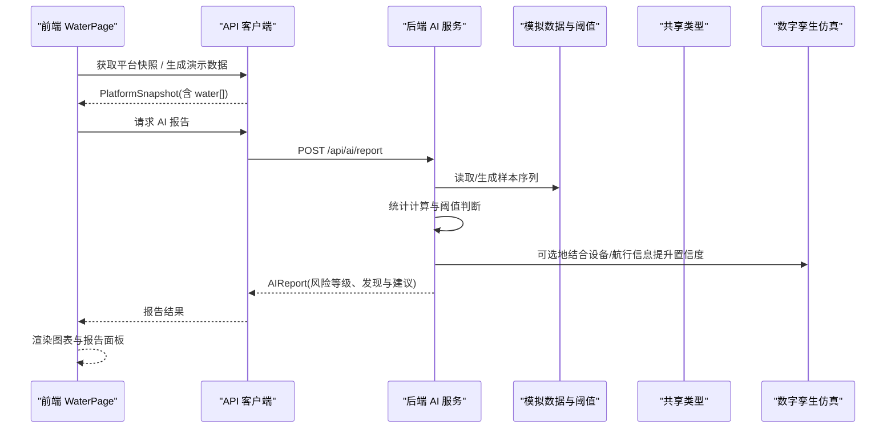
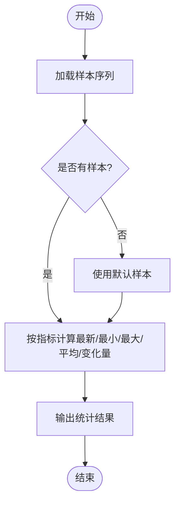
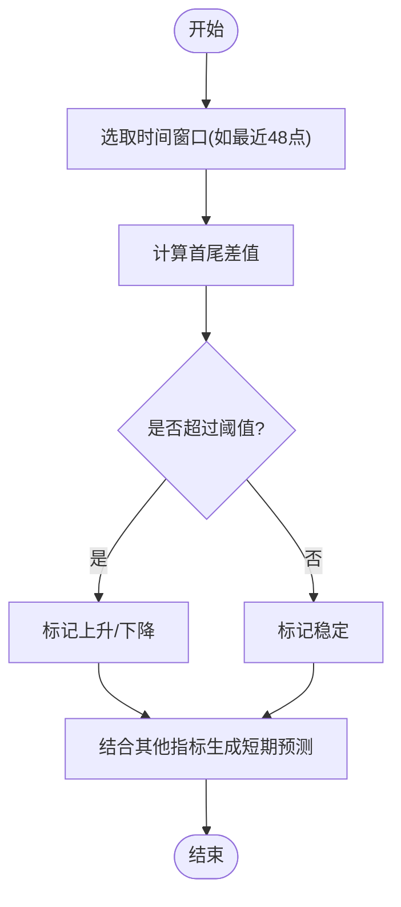
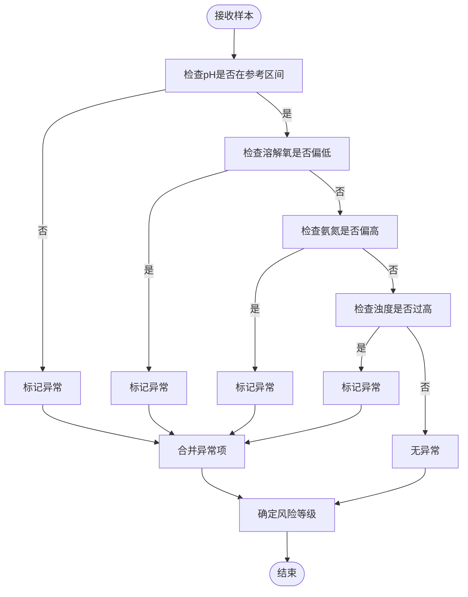
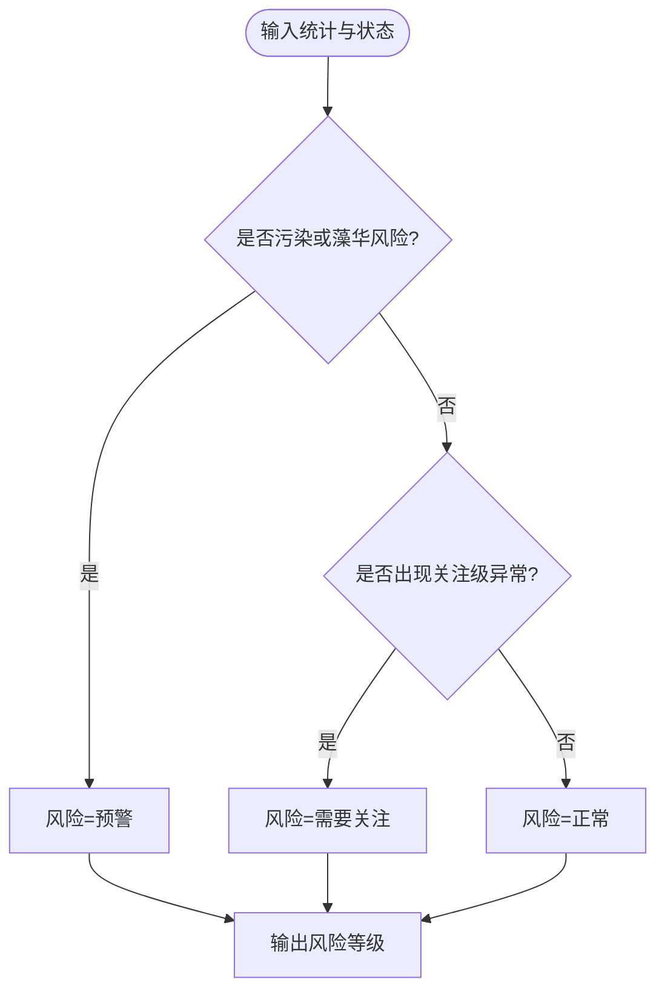
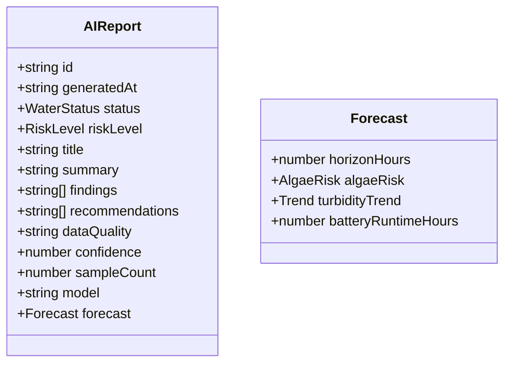
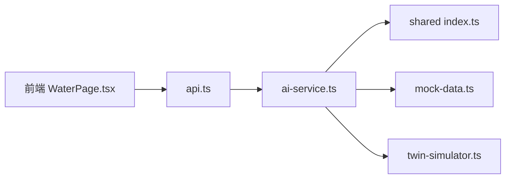

# 水质分析算法

<cite>
**本文引用的文件**
- [WaterPage.tsx](file://fishery-digital-twin-platform/apps/frontend/src/components/dashboard/WaterPage.tsx)
- [ai-service.ts](file://fishery-digital-twin-platform/apps/backend/src/ai-service.ts)
- [mock-data.ts](file://fishery-digital-twin-platform/apps/backend/src/mock-data.ts)
- [index.ts](file://fishery-digital-twin-platform/packages/shared/src/index.ts)
- [twin-simulator.ts](file://fishery-digital-twin-platform/apps/backend/src/twin-simulator.ts)
- [api.ts](file://fishery-digital-twin-platform/apps/frontend/src/lib/api.ts)
</cite>

## 目录
1. [简介](#简介)
2. [项目结构](#项目结构)
3. [核心组件](#核心组件)
4. [架构总览](#架构总览)
5. [详细组件分析](#详细组件分析)
6. [依赖关系分析](#依赖关系分析)
7. [性能与优化建议](#性能与优化建议)
8. [故障排查指南](#故障排查指南)
9. [结论](#结论)
10. [附录：参考标准与参数配置](#附录参考标准与参数配置)

## 简介
本技术文档围绕渔业数字孪生平台的水质分析能力，系统化说明以下方面：
- 水质指标统计计算：温度、浊度、pH、溶解氧、氨氮、电导率的最新值、均值、极差、变化量等。
- 趋势预测与异常检测：时间序列窗口内的变化率、趋势方向判断、阈值触发机制。
- 风险评估模型：单指标阈值、多指标综合评估、风险等级划分逻辑。
- 健康指数与综合评分：基于权重分配与标准化处理的综合评分思路（当前实现为规则基线，可扩展）。
- 水质参考标准：不同养殖模式适宜范围与季节性调整因子（以代码内嵌参考为依据）。
- 算法实现细节、参数配置与优化建议。

## 项目结构
本项目在水质分析方面涉及前端展示、后端服务、共享类型定义与仿真模块：
- 前端页面负责采集数据可视化、本地阈值判断与报告展示。
- 后端服务提供AI报告生成、统计分析与可选的LLM增强。
- 共享类型统一了水质数据结构、状态枚举与报告格式。
- 仿真器用于设备与航线的数字孪生推演，间接影响置信度与续航估算。

图表来源
- [WaterPage.tsx:45-218](file://fishery-digital-twin-platform/apps/frontend/src/components/dashboard/WaterPage.tsx#L45-L218)
- [api.ts:26-49](file://fishery-digital-twin-platform/apps/frontend/src/lib/api.ts#L26-L49)
- [ai-service.ts:167-233](file://fishery-digital-twin-platform/apps/backend/src/ai-service.ts#L167-L233)
- [mock-data.ts:27-32](file://fishery-digital-twin-platform/apps/backend/src/mock-data.ts#L27-L32)
- [index.ts:7-17](file://fishery-digital-twin-platform/packages/shared/src/index.ts#L7-L17)
- [twin-simulator.ts:74-253](file://fishery-digital-twin-platform/apps/backend/src/twin-simulator.ts#L74-L253)

章节来源
- [WaterPage.tsx:45-218](file://fishery-digital-twin-platform/apps/frontend/src/components/dashboard/WaterPage.tsx#L45-L218)
- [api.ts:26-49](file://fishery-digital-twin-platform/apps/frontend/src/lib/api.ts#L26-L49)
- [ai-service.ts:167-233](file://fishery-digital-twin-platform/apps/backend/src/ai-service.ts#L167-L233)
- [mock-data.ts:27-32](file://fishery-digital-twin-platform/apps/backend/src/mock-data.ts#L27-L32)
- [index.ts:7-17](file://fishery-digital-twin-platform/packages/shared/src/index.ts#L7-L17)
- [twin-simulator.ts:74-253](file://fishery-digital-twin-platform/apps/backend/src/twin-simulator.ts#L74-L253)

## 核心组件
- 前端水质页面：负责采样动画、图表渲染、本地阈值判断与报告面板展示。
- 后端AI服务：对历史样本进行统计计算、阈值判定、风险分级，并可选择调用外部大模型生成增强报告。
- 模拟数据与阈值：提供符合实际水域特征的样本序列与水质状态判定函数。
- 共享类型：统一定义水质数据、电池、导航、AI报告、数字孪生输入输出等。
- 数字孪生仿真：在设备与航线维度进行能耗、疲劳与健康评估，影响整体置信度与续航估计。

章节来源
- [WaterPage.tsx:45-218](file://fishery-digital-twin-platform/apps/frontend/src/components/dashboard/WaterPage.tsx#L45-L218)
- [ai-service.ts:33-122](file://fishery-digital-twin-platform/apps/backend/src/ai-service.ts#L33-L122)
- [mock-data.ts:27-32](file://fishery-digital-twin-platform/apps/backend/src/mock-data.ts#L27-L32)
- [index.ts:65-84](file://fishery-digital-twin-platform/packages/shared/src/index.ts#L65-L84)
- [twin-simulator.ts:74-253](file://fishery-digital-twin-platform/apps/backend/src/twin-simulator.ts#L74-L253)

## 架构总览
水质分析的数据流从前端采集到后端统计与报告生成，再返回前端展示：

图表来源
- [WaterPage.tsx:403-537](file://fishery-digital-twin-platform/apps/frontend/src/components/dashboard/WaterPage.tsx#L403-L537)
- [api.ts:37-49](file://fishery-digital-twin-platform/apps/frontend/src/lib/api.ts#L37-L49)
- [ai-service.ts:167-233](file://fishery-digital-twin-platform/apps/backend/src/ai-service.ts#L167-L233)
- [mock-data.ts:192-244](file://fishery-digital-twin-platform/apps/backend/src/mock-data.ts#L192-L244)
- [twin-simulator.ts:181-189](file://fishery-digital-twin-platform/apps/backend/src/twin-simulator.ts#L181-L189)

## 详细组件分析

### 水质指标统计计算
- 统计维度：最新值、最小值、最大值、平均值、周期变化量。
- 指标覆盖：水温、浊度、pH、溶解氧、氨氮、电导率。
- 数据来源：优先使用真实传感器样本；若无数据则回退到默认样本以保证报告可用性。
- 复杂度：对长度为N的样本序列，每个指标一次线性扫描，时间复杂度O(N)，空间复杂度O(1)。

图表来源
- [ai-service.ts:33-73](file://fishery-digital-twin-platform/apps/backend/src/ai-service.ts#L33-L73)
- [mock-data.ts:192-244](file://fishery-digital-twin-platform/apps/backend/src/mock-data.ts#L192-L244)

章节来源
- [ai-service.ts:33-73](file://fishery-digital-twin-platform/apps/backend/src/ai-service.ts#L33-L73)
- [mock-data.ts:192-244](file://fishery-digital-twin-platform/apps/backend/src/mock-data.ts#L192-L244)

### 趋势预测算法
- 时间序列分析：基于最近若干采样点（如48或20个）观察指标变化。
- 变化率计算：通过首尾差值判断上升、下降或稳定；例如浊度变化超过阈值即视为上升。
- 趋势方向：浊度变化大于某阈值记为“上升”，小于负阈值记为“下降”，否则“稳定”。
- 预测周期：报告包含未来12小时预测窗口，结合藻华风险与浊度趋势给出初步判断。

图表来源
- [ai-service.ts:75-122](file://fishery-digital-twin-platform/apps/backend/src/ai-service.ts#L75-L122)
- [mock-data.ts:192-244](file://fishery-digital-twin-platform/apps/backend/src/mock-data.ts#L192-L244)

章节来源
- [ai-service.ts:75-122](file://fishery-digital-twin-platform/apps/backend/src/ai-service.ts#L75-L122)
- [mock-data.ts:192-244](file://fishery-digital-twin-platform/apps/backend/src/mock-data.ts#L192-L244)

### 异常检测机制
- 单指标阈值：pH超出参考区间、溶解氧低于阈值、氨氮高于阈值、浊度过高均触发关注或预警。
- 组合条件：当多个指标同时异常时，风险等级上调。
- 状态映射：将内部水质状态映射为报告风险等级（正常、需要关注、风险预警）。

图表来源
- [mock-data.ts:27-32](file://fishery-digital-twin-platform/apps/backend/src/mock-data.ts#L27-L32)
- [ai-service.ts:43-86](file://fishery-digital-twin-platform/apps/backend/src/ai-service.ts#L43-L86)

章节来源
- [mock-data.ts:27-32](file://fishery-digital-twin-platform/apps/backend/src/mock-data.ts#L27-L32)
- [ai-service.ts:43-86](file://fishery-digital-twin-platform/apps/backend/src/ai-service.ts#L43-L86)

### 风险评估模型
- 阈值判断：基于内置参考范围与动态阈值（如浊度>34、pH<6.8或>8.4、溶解氧<5.5、氨氮>0.2）。
- 多指标综合评估：结合电池电量、趋势变化与状态映射，决定最终风险等级。
- 风险等级划分：
  - 正常：各项指标在参考范围内且无显著上升趋势。
  - 需要关注：出现单项或多项接近阈值或轻微异常。
  - 风险预警：存在污染风险、藻华风险或关键指标严重偏离。

图表来源
- [ai-service.ts:43-86](file://fishery-digital-twin-platform/apps/backend/src/ai-service.ts#L43-L86)
- [mock-data.ts:27-32](file://fishery-digital-twin-platform/apps/backend/src/mock-data.ts#L27-L32)

章节来源
- [ai-service.ts:43-86](file://fishery-digital-twin-platform/apps/backend/src/ai-service.ts#L43-L86)
- [mock-data.ts:27-32](file://fishery-digital-twin-platform/apps/backend/src/mock-data.ts#L27-L32)

### 健康指数计算方法
- 当前实现：采用规则基线，未显式计算加权健康指数；但通过风险等级与置信度体现整体健康水平。
- 扩展建议：可引入各指标权重与标准化处理，构建综合健康指数（如0-100分），便于跨场景比较。
- 置信度来源：在线设备数量、传感器反馈、航行状态与水质数据可用性共同影响置信度。

图表来源
- [index.ts:65-84](file://fishery-digital-twin-platform/packages/shared/src/index.ts#L65-L84)

章节来源
- [index.ts:65-84](file://fishery-digital-twin-platform/packages/shared/src/index.ts#L65-L84)
- [ai-service.ts:75-122](file://fishery-digital-twin-platform/apps/backend/src/ai-service.ts#L75-L122)

### 水质参考标准说明
- 淡水养殖参考范围：
  - 水温：常见温水性鱼类适宜约22-30°C，短时波动需结合鱼种判断。
  - 浊度：低于30 NTU较清，30-50 NTU需观察，持续高于50 NTU建议复核扰动或污染来源。
  - pH：常见淡水养殖参考约6.8-8.5，超出区间需关注应激风险。
  - 溶解氧：建议保持在5 mg/L以上，低于4 mg/L重点关注缺氧风险。
  - 氨氮：建议尽量低于0.2 mg/L，持续升高需排查残饵、排泄物或换水条件。
  - 电导率：常见参考约200-800 μS/cm，异常突变可能提示水源或盐分变化。
- 季节性调整因子：
  - 模拟数据中考虑日照与径流脉冲对温度、浊度、溶解氧、氨氮的影响，体现季节与天气因素。

章节来源
- [ai-service.ts:24-31](file://fishery-digital-twin-platform/apps/backend/src/ai-service.ts#L24-L31)
- [mock-data.ts:48-76](file://fishery-digital-twin-platform/apps/backend/src/mock-data.ts#L48-L76)

### 算法实现细节与参数配置
- 统计函数：对每个指标计算最新、最小、最大、平均与变化量，保留两位小数精度。
- 阈值与状态：
  - 污染：浊度>65或pH<6.4或>8.8或溶解氧<3.5或氨氮>0.5。
  - 藻华风险：浊度>48或氨氮>0.3。
  - 关注：浊度>34或pH<6.8或>8.4或溶解氧<5.5或氨氮>0.2。
- 风险等级映射：污染/藻华风险→预警；关注→需要关注；其余→正常。
- 置信度与续航：
  - 置信度受在线设备数、传感器反馈、航行状态与水质数据可用性影响。
  - 续航估计基于电池平均电量与运行消耗模型。

章节来源
- [mock-data.ts:27-32](file://fishery-digital-twin-platform/apps/backend/src/mock-data.ts#L27-L32)
- [ai-service.ts:75-122](file://fishery-digital-twin-platform/apps/backend/src/ai-service.ts#L75-L122)
- [twin-simulator.ts:181-189](file://fishery-digital-twin-platform/apps/backend/src/twin-simulator.ts#L181-L189)

## 依赖关系分析
- 前端依赖API客户端获取快照与报告，并在本地进行阈值判断与展示。
- 后端AI服务依赖共享类型与模拟数据，必要时调用外部大模型增强报告。
- 数字孪生仿真与水质分析解耦，但通过置信度与续航估计间接影响报告质量。

图表来源
- [WaterPage.tsx:403-537](file://fishery-digital-twin-platform/apps/frontend/src/components/dashboard/WaterPage.tsx#L403-L537)
- [api.ts:26-49](file://fishery-digital-twin-platform/apps/frontend/src/lib/api.ts#L26-L49)
- [ai-service.ts:167-233](file://fishery-digital-twin-platform/apps/backend/src/ai-service.ts#L167-L233)
- [mock-data.ts:192-244](file://fishery-digital-twin-platform/apps/backend/src/mock-data.ts#L192-L244)
- [twin-simulator.ts:74-253](file://fishery-digital-twin-platform/apps/backend/src/twin-simulator.ts#L74-L253)

章节来源
- [WaterPage.tsx:403-537](file://fishery-digital-twin-platform/apps/frontend/src/components/dashboard/WaterPage.tsx#L403-L537)
- [api.ts:26-49](file://fishery-digital-twin-platform/apps/frontend/src/lib/api.ts#L26-L49)
- [ai-service.ts:167-233](file://fishery-digital-twin-platform/apps/backend/src/ai-service.ts#L167-L233)
- [mock-data.ts:192-244](file://fishery-digital-twin-platform/apps/backend/src/mock-data.ts#L192-L244)
- [twin-simulator.ts:74-253](file://fishery-digital-twin-platform/apps/backend/src/twin-simulator.ts#L74-L253)

## 性能与优化建议
- 统计计算：对长序列可采用滑动窗口与增量更新，降低重复计算开销。
- 阈值与趋势：可引入自适应阈值（随季节与水域特征调整），减少误报。
- 报告生成：在LLM不可用时快速回退到本地基线，保证可用性。
- 前端渲染：大数据量时按需分页或降采样，避免卡顿。
- 置信度：接入更多传感器与设备反馈，提高置信度与准确性。

[本节为通用指导，不直接分析具体文件]

## 故障排查指南
- 报告生成失败：检查后端环境变量（如大模型密钥）与网络连通性。
- 数据为空：确认前端是否正确获取平台快照与样本序列。
- 阈值误判：核对水质参考范围与阈值配置，必要时调整阈值以适应特定水域。
- 置信度低：检查在线设备数量与传感器反馈，提升数据质量。

章节来源
- [api.ts:6-24](file://fishery-digital-twin-platform/apps/frontend/src/lib/api.ts#L6-L24)
- [ai-service.ts:160-172](file://fishery-digital-twin-platform/apps/backend/src/ai-service.ts#L160-L172)
- [WaterPage.tsx:445-461](file://fishery-digital-twin-platform/apps/frontend/src/components/dashboard/WaterPage.tsx#L445-L461)

## 结论
该平台实现了完整的水质监测与分析闭环：前端采集与可视化、后端统计与阈值判断、可选的大模型增强报告，以及数字孪生仿真辅助置信度与续航估计。当前实现以规则基线为主，具备良好可维护性与扩展性，适合在不同养殖模式与季节条件下进行水质评估与决策支持。

[本节为总结性内容，不直接分析具体文件]

## 附录：参考标准与参数配置
- 参考范围与阈值：
  - 水温：22-30°C（常见温水性鱼类）。
  - 浊度：<30 NTU较清，30-50 NTU需观察，>50 NTU建议复核。
  - pH：6.8-8.5（淡水养殖参考）。
  - 溶解氧：≥5 mg/L，<4 mg/L重点关注。
  - 氨氮：<0.2 mg/L，持续升高需排查。
  - 电导率：200-800 μS/cm（淡水养殖参考）。
- 季节性调整：
  - 模拟数据中考虑日照与径流脉冲对温度、浊度、溶解氧、氨氮的影响。
- 参数位置：
  - 参考范围与阈值定义位于后端模拟数据与服务中。
  - 报告结构与字段定义位于共享类型中。

章节来源
- [ai-service.ts:24-31](file://fishery-digital-twin-platform/apps/backend/src/ai-service.ts#L24-L31)
- [mock-data.ts:27-32](file://fishery-digital-twin-platform/apps/backend/src/mock-data.ts#L27-L32)
- [index.ts:65-84](file://fishery-digital-twin-platform/packages/shared/src/index.ts#L65-L84)