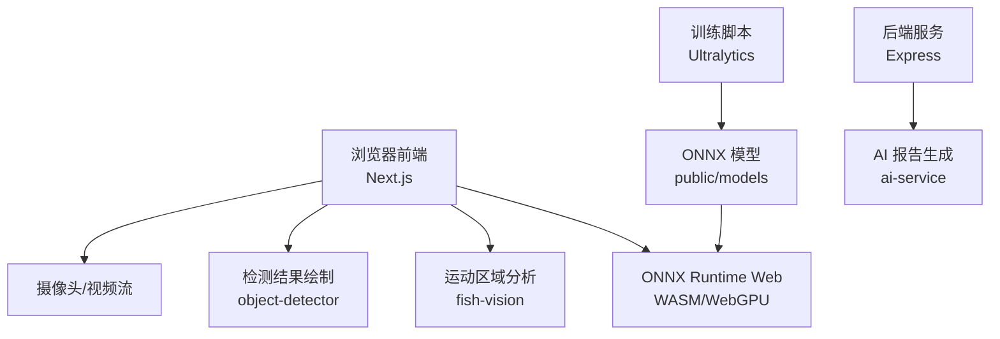
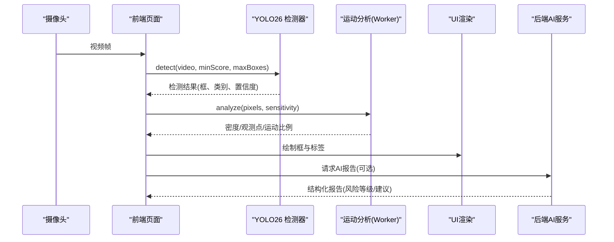
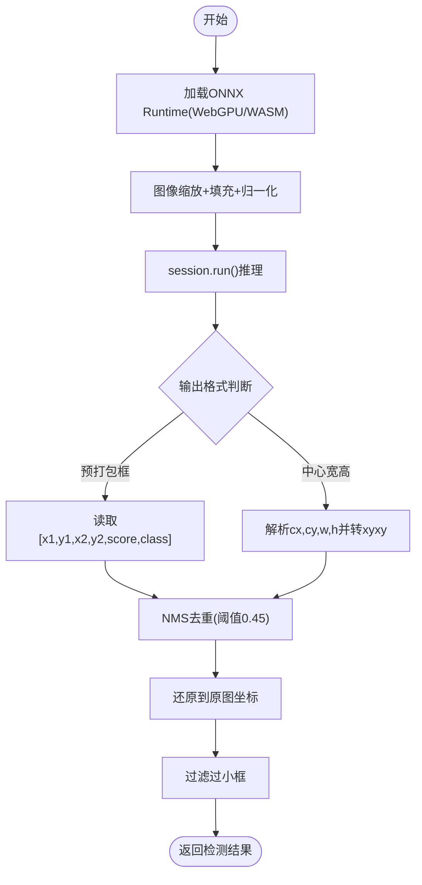
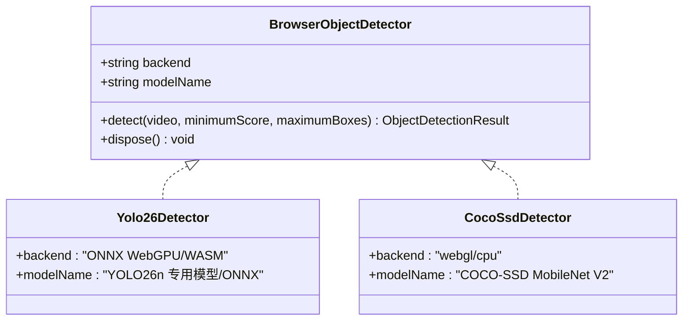
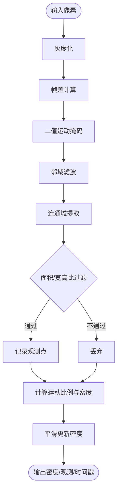
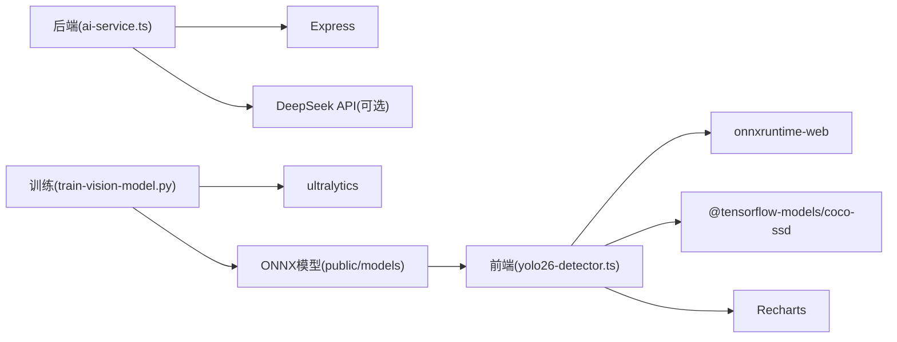

# 视觉识别系统

<cite>
**本文引用的文件**
- [README.md](file://fishery-digital-twin-platform/README.md)
- [vision-model-training.md](file://fishery-digital-twin-platform/docs/vision-model-training.md)
- [vision-dataset.yaml](file://fishery-digital-twin-platform/docs/vision-dataset.yaml)
- [yolo26-detector.ts](file://fishery-digital-twin-platform/apps/frontend/src/lib/yolo26-detector.ts)
- [object-detector.ts](file://fishery-digital-twin-platform/apps/frontend/src/lib/object-detector.ts)
- [fish-vision.ts](file://fishery-digital-twin-platform/apps/frontend/src/lib/fish-vision.ts)
- [fish-vision.worker.ts](file://fishery-digital-twin-platform/apps/frontend/src/lib/fish-vision.worker.ts)
- [train-vision-model.py](file://fishery-digital-twin-platform/scripts/train-vision-model.py)
- [ai-service.ts](file://fishery-digital-twin-platform/apps/backend/src/ai-service.ts)
- [WaterPage.tsx](file://fishery-digital-twin-platform/apps/frontend/src/components/dashboard/WaterPage.tsx)
- [project-structure.md](file://fishery-digital-twin-platform/docs/project-structure.md)
</cite>

## 目录
1. [简介](#简介)
2. [项目结构](#项目结构)
3. [核心组件](#核心组件)
4. [架构总览](#架构总览)
5. [详细组件分析](#详细组件分析)
6. [依赖关系分析](#依赖关系分析)
7. [性能与优化](#性能与优化)
8. [故障排查指南](#故障排查指南)
9. [结论](#结论)
10. [附录：训练与部署清单](#附录训练与部署清单)

## 简介
本视觉识别系统面向智慧渔业巡检船，提供鱼类检测、水面污染识别（油污、藻华风险、漂浮物分类）和设备状态监控能力。系统采用“前端本地推理 + 后端辅助决策”的混合架构：浏览器端通过 ONNX Runtime Web 运行 YOLO26n 模型进行实时目标检测，并辅以运动区域分析保持画面连续性；后端基于传感器数据生成水质分析与预测报告，支持接入大模型增强决策。

## 项目结构
- 前端 Next.js 应用负责摄像头采集、视频帧预处理、YOLO 推理、结果可视化与 UI 展示。
- 后端 Express 服务聚合传感器数据，生成 AI 报告，并可调用外部大模型接口。
- 训练脚本使用 Ultralytics 训练专用 YOLO26 模型并导出为 ONNX，供前端离线加载。
- 文档定义了数据集规范、类别定义和验收指标。

图表来源
- [yolo26-detector.ts:147-263](file://fishery-digital-twin-platform/apps/frontend/src/lib/yolo26-detector.ts#L147-L263)
- [fish-vision.ts:41-223](file://fishery-digital-twin-platform/apps/frontend/src/lib/fish-vision.ts#L41-L223)
- [object-detector.ts:236-267](file://fishery-digital-twin-platform/apps/frontend/src/lib/object-detector.ts#L236-L267)
- [train-vision-model.py:43-80](file://fishery-digital-twin-platform/scripts/train-vision-model.py#L43-L80)
- [ai-service.ts:167-232](file://fishery-digital-twin-platform/apps/backend/src/ai-service.ts#L167-L232)

章节来源
- [README.md:15-34](file://fishery-digital-twin-platform/README.md#L15-L34)
- [project-structure.md:15-107](file://fishery-digital-twin-platform/docs/project-structure.md#L15-L107)

## 核心组件
- YOLO26 检测器：在浏览器中加载 ONNX 模型，执行图像预处理、张量推理、NMS 后处理与坐标还原。
- 通用对象检测抽象：统一 YOLO26 与 COCO-SSD 回退路径，提供中文标签映射与绘制工具。
- 运动区域分析：对灰度帧做差分、邻域滤波、连通域提取，输出密度与观测点，用于无目标时维持跟踪连续性。
- Worker 隔离：将耗时计算放入 Web Worker，避免阻塞 UI。
- 训练与导出：Ultralytics 训练专用模型，导出 ONNX 并复制到前端静态资源目录。
- 后端 AI 报告：基于传感器统计生成报告，可选 DeepSeek API 增强。

章节来源
- [yolo26-detector.ts:147-263](file://fishery-digital-twin-platform/apps/frontend/src/lib/yolo26-detector.ts#L147-L263)
- [object-detector.ts:1-267](file://fishery-digital-twin-platform/apps/frontend/src/lib/object-detector.ts#L1-L267)
- [fish-vision.ts:41-223](file://fishery-digital-twin-platform/apps/frontend/src/lib/fish-vision.ts#L41-L223)
- [fish-vision.worker.ts:1-28](file://fishery-digital-twin-platform/apps/frontend/src/lib/fish-vision.worker.ts#L1-L28)
- [train-vision-model.py:43-80](file://fishery-digital-twin-platform/scripts/train-vision-model.py#L43-L80)
- [ai-service.ts:167-232](file://fishery-digital-twin-platform/apps/backend/src/ai-service.ts#L167-L232)

## 架构总览
系统分为三层：
- 感知层：摄像头采集视频帧，前端并行执行 YOLO 检测与运动分析。
- 推理层：ONNX Runtime Web 提供跨平台推理；Web Worker 承担密集计算。
- 决策层：后端汇总传感器数据，生成结构化报告，可调用外部大模型。

图表来源
- [yolo26-detector.ts:208-258](file://fishery-digital-twin-platform/apps/frontend/src/lib/yolo26-detector.ts#L208-L258)
- [fish-vision.worker.ts:19-27](file://fishery-digital-twin-platform/apps/frontend/src/lib/fish-vision.worker.ts#L19-L27)
- [WaterPage.tsx:437-460](file://fishery-digital-twin-platform/apps/frontend/src/components/dashboard/WaterPage.tsx#L437-L460)
- [ai-service.ts:167-232](file://fishery-digital-twin-platform/apps/backend/src/ai-service.ts#L167-L232)

## 详细组件分析

### YOLO26 检测器
- 输入尺寸固定为 640×640，支持 WebGPU 与 WASM 两种后端，自动选择最优执行提供者。
- 图像预处理：缩放、填充、像素归一化，构建 float32 张量。
- 输出解码：兼容多种布局（通道优先/非优先），过滤低分候选，NMS 去重。
- 坐标还原：根据是否归一化输出与填充参数还原到原始视频分辨率。
- 错误处理：缺少输入/输出节点或画布创建失败时抛出明确错误。

图表来源
- [yolo26-detector.ts:147-263](file://fishery-digital-twin-platform/apps/frontend/src/lib/yolo26-detector.ts#L147-L263)

章节来源
- [yolo26-detector.ts:147-263](file://fishery-digital-twin-platform/apps/frontend/src/lib/yolo26-detector.ts#L147-L263)

### 通用对象检测抽象与回退策略
- 统一接口：BrowserObjectDetector 暴露 detect/dispose，屏蔽底层差异。
- 回退机制：优先尝试 YOLO26，失败则自动切换至 COCO-SSD MobileNet V2，并标注回退原因。
- 标签映射：将英文类名映射为中文显示名称，便于界面展示。
- 绘图工具：drawRecognizedObjects 在 Canvas 上绘制边界框与标签。

图表来源
- [object-detector.ts:16-22](file://fishery-digital-twin-platform/apps/frontend/src/lib/object-detector.ts#L16-L22)
- [object-detector.ts:193-233](file://fishery-digital-twin-platform/apps/frontend/src/lib/object-detector.ts#L193-L233)
- [object-detector.ts:236-267](file://fishery-digital-twin-platform/apps/frontend/src/lib/object-detector.ts#L236-L267)

章节来源
- [object-detector.ts:1-267](file://fishery-digital-twin-platform/apps/frontend/src/lib/object-detector.ts#L1-L267)

### 运动区域分析（鱼群密度与连续跟踪）
- 灰度转换与帧差：计算当前帧与上一帧的灰度差，按灵敏度设置阈值生成运动掩码。
- 邻域滤波：仅保留有足够邻居的运动像素，抑制噪声。
- 连通域提取：BFS 搜索，统计面积、宽高比，过滤异常形状。
- 密度估计：结合运动像素占比与可见观测数量，平滑更新密度值。
- 观测保留：在无目标帧时对历史观测置信度衰减，保持轨迹连续性。

图表来源
- [fish-vision.ts:61-223](file://fishery-digital-twin-platform/apps/frontend/src/lib/fish-vision.ts#L61-L223)

章节来源
- [fish-vision.ts:41-223](file://fishery-digital-twin-platform/apps/frontend/src/lib/fish-vision.ts#L41-L223)
- [fish-vision.worker.ts:1-28](file://fishery-digital-twin-platform/apps/frontend/src/lib/fish-vision.worker.ts#L1-L28)

### 设备状态监控与画面分析
- 摄像头画面分析：通过 WaterPage 集成 NavigationCameraPanel，实现水域观察视角的视频流与叠加信息。
- 设备外观检查：系统健康页与日志页用于查看电池、电控、通信与传感器状态，异常时红色预警。
- 异常状态识别：后端 AI 报告根据传感器趋势与阈值判定风险等级，提示浊度上升、溶解氧偏低、氨氮升高、电池电量不足等。

章节来源
- [WaterPage.tsx:147-217](file://fishery-digital-twin-platform/apps/frontend/src/components/dashboard/WaterPage.tsx#L147-L217)
- [WaterPage.tsx:220-274](file://fishery-digital-twin-platform/apps/frontend/src/components/dashboard/WaterPage.tsx#L220-L274)
- [ai-service.ts:75-122](file://fishery-digital-twin-platform/apps/backend/src/ai-service.ts#L75-L122)

### 模型训练流程
- 数据集准备：遵循 vision-dataset.yaml 配置，图片与标签放置于 datasets/fish-trash，按视频片段划分训练/验证/测试集，避免同片段帧泄漏。
- 标注规范：包含 fish、塑料瓶、塑料袋、易拉罐、泡沫、渔网、树枝、水草、其他垃圾、人员等类别；必须保留困难样本与负样本。
- 训练参数：epochs=120、imgsz=640、batch=16、device=0，启用缓存与数据增强（旋转、平移、缩放、HSV扰动）。
- 导出与部署：最佳权重导出为 ONNX（opset=17，简化、NMS），复制到 public/models，前端通过环境变量加载。

章节来源
- [vision-dataset.yaml:1-19](file://fishery-digital-twin-platform/docs/vision-dataset.yaml#L1-L19)
- [vision-model-training.md:9-86](file://fishery-digital-twin-platform/docs/vision-model-training.md#L9-L86)
- [train-vision-model.py:22-80](file://fishery-digital-twin-platform/scripts/train-vision-model.py#L22-L80)

### 推理优化策略
- 模型量化与轻量化：默认使用 YOLO26n 小模型；导出时开启 simplify 与 NMS，减少运行时开销。
- 边缘部署：ONNX WASM 文件随网页打包，无需外部 CDN；可将专用模型置于 public/models 实现离线运行。
- 实时处理优化：
  - 双后端选择：优先 WebGPU，不支持时回退 WASM。
  - 线程控制：WASM 单线程，避免争用。
  - 最小框过滤：过滤小于阈值的检测框，降低后续处理压力。
  - Worker 隔离：运动分析在独立线程执行，避免阻塞 UI。

章节来源
- [yolo26-detector.ts:155-185](file://fishery-digital-twin-platform/apps/frontend/src/lib/yolo26-detector.ts#L155-L185)
- [yolo26-detector.ts:238-253](file://fishery-digital-twin-platform/apps/frontend/src/lib/yolo26-detector.ts#L238-L253)
- [fish-vision.worker.ts:8-12](file://fishery-digital-twin-platform/apps/frontend/src/lib/fish-vision.worker.ts#L8-L12)
- [vision-model-training.md:66-75](file://fishery-digital-twin-platform/docs/vision-model-training.md#L66-L75)

### 自定义模型开发指南
- 新类别添加：在 vision-dataset.yaml 中新增类别索引与名称，确保训练/验证/测试集一致。
- 模型微调：使用 scripts/train-vision-model.py 指定 data、model、epochs、image-size、batch、device 等参数进行微调。
- 性能评估方法：
  - 指标：mAP50-95、Precision、Recall 分类别统计。
  - 场景：小目标、遮挡、反光、浑水、夜间画面单独测试。
  - 安全逻辑：人员靠近垃圾时暂停自动跟踪，需专项验证。
  - 实船验收：连续运行至少 30 分钟，记录误报、漏报与平均推理耗时。

章节来源
- [vision-dataset.yaml:8-18](file://fishery-digital-twin-platform/docs/vision-dataset.yaml#L8-L18)
- [vision-model-training.md:32-86](file://fishery-digital-twin-platform/docs/vision-model-training.md#L32-L86)
- [train-vision-model.py:22-80](file://fishery-digital-twin-platform/scripts/train-vision-model.py#L22-L80)

## 依赖关系分析
- 前端依赖：
  - onnxruntime-web：提供 WebGPU/WASM 推理后端。
  - @tensorflow-models/coco-ssd：作为 YOLO 不可用时的回退检测器。
  - Recharts：图表展示。
  - Three.js/React Three Fiber：3D 船模与场景（与本模块间接相关）。
- 后端依赖：
  - Express：HTTP 服务。
  - 可选 DeepSeek API：增强报告生成。
- 训练依赖：
  - ultralytics：YOLO 训练与导出。

图表来源
- [yolo26-detector.ts:155-185](file://fishery-digital-twin-platform/apps/frontend/src/lib/yolo26-detector.ts#L155-L185)
- [object-detector.ts:193-233](file://fishery-digital-twin-platform/apps/frontend/src/lib/object-detector.ts#L193-L233)
- [ai-service.ts:167-232](file://fishery-digital-twin-platform/apps/backend/src/ai-service.ts#L167-L232)
- [train-vision-model.py:43-80](file://fishery-digital-twin-platform/scripts/train-vision-model.py#L43-L80)

章节来源
- [project-structure.md:15-107](file://fishery-digital-twin-platform/docs/project-structure.md#L15-L107)

## 性能与优化
- 推理后端选择：优先 WebGPU，其次 WASM；关闭不必要的日志级别以减少开销。
- 模型轻量化：使用 n 系列模型，导出时启用 simplify 与 NMS，固定输入尺寸。
- 数据处理：
  - 仅对必要区域进行图像处理，合理设置 minimumScore 与 maximumBoxes。
  - 使用 Worker 隔离密集计算，避免主线程卡顿。
- 稳定性：
  - 当模型加载失败时自动回退到 COCO-SSD。
  - 无目标时依靠运动分析维持跟踪连续性，降低断流影响。

[本节为通用指导，不直接分析具体文件]

## 故障排查指南
- 模型加载失败：
  - 检查 NEXT_PUBLIC_YOLO_MODEL_URL 与 NEXT_PUBLIC_ONNX_WASM_PATH 是否正确。
  - 确认 public/models 目录下存在对应 ONNX 文件。
  - 若 WebGPU 不可用，系统将回退到 WASM；如仍失败，检查浏览器兼容性。
- 检测结果为空：
  - 提高 minimumScore 或降低 maximumBoxes 以调整筛选条件。
  - 检查视频分辨率与输入尺寸匹配，确保缩放与填充正确。
- 运动分析异常：
  - 调整 sensitivity 参数，改变差异阈值与最小面积。
  - 检查像素数组长度与 ANALYSIS_WIDTH/HEIGHT 是否匹配。
- 后端报告生成失败：
  - 检查 DEEPSEEK_API_KEY 与网络连通性。
  - 超时设置：DEEPSEEK_TIMEOUT_SECONDS 合理范围 5–120 秒。

章节来源
- [yolo26-detector.ts:188-202](file://fishery-digital-twin-platform/apps/frontend/src/lib/yolo26-detector.ts#L188-L202)
- [yolo26-detector.ts:231-231](file://fishery-digital-twin-platform/apps/frontend/src/lib/yolo26-detector.ts#L231-L231)
- [fish-vision.ts:61-64](file://fishery-digital-twin-platform/apps/frontend/src/lib/fish-vision.ts#L61-L64)
- [ai-service.ts:174-232](file://fishery-digital-twin-platform/apps/backend/src/ai-service.ts#L174-L232)

## 结论
本视觉识别系统通过“YOLO26 检测 + 运动分析 + 后端报告”的组合，实现了鱼类与水面漂浮物的实时识别与水质趋势分析。系统在浏览器端具备离线推理能力，并通过回退机制保证鲁棒性；后端提供可扩展的决策支持。针对未来扩展，可按文档规范增加新类别、微调模型并评估性能，以满足复杂水域环境的实际需求。

[本节为总结，不直接分析具体文件]

## 附录：训练与部署清单
- 数据准备
  - 将图片与标签放入 datasets/fish-trash，按视频片段划分 train/val/test。
  - 类别定义见 vision-dataset.yaml。
- 训练命令
  - python scripts/train-vision-model.py --device 0 --epochs 120
- 导出与部署
  - 最佳权重导出为 ONNX，复制到 apps/frontend/public/models。
  - 配置环境变量 NEXT_PUBLIC_YOLO_MODEL_URL 与 NEXT_PUBLIC_YOLO_CLASS_NAMES。
- 验收指标
  - mAP50-95、Precision、Recall 分类别统计。
  - 小目标、遮挡、反光、浑水、夜间画面单独测试。
  - 人员邻近目标时暂停自动跟踪的专项验证。
  - 实船连续运行至少 30 分钟，记录误报、漏报与平均推理耗时。

章节来源
- [vision-dataset.yaml:1-19](file://fishery-digital-twin-platform/docs/vision-dataset.yaml#L1-L19)
- [vision-model-training.md:51-86](file://fishery-digital-twin-platform/docs/vision-model-training.md#L51-L86)
- [train-vision-model.py:43-80](file://fishery-digital-twin-platform/scripts/train-vision-model.py#L43-L80)