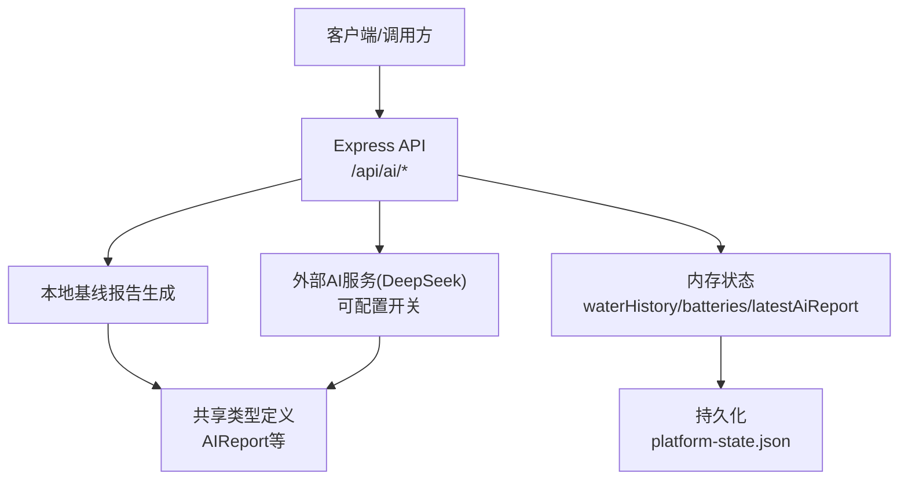
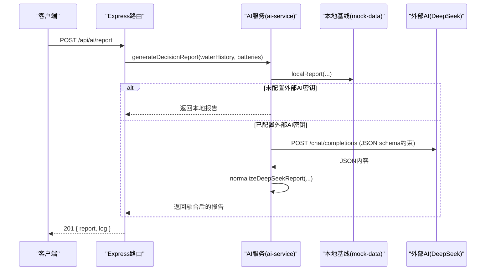
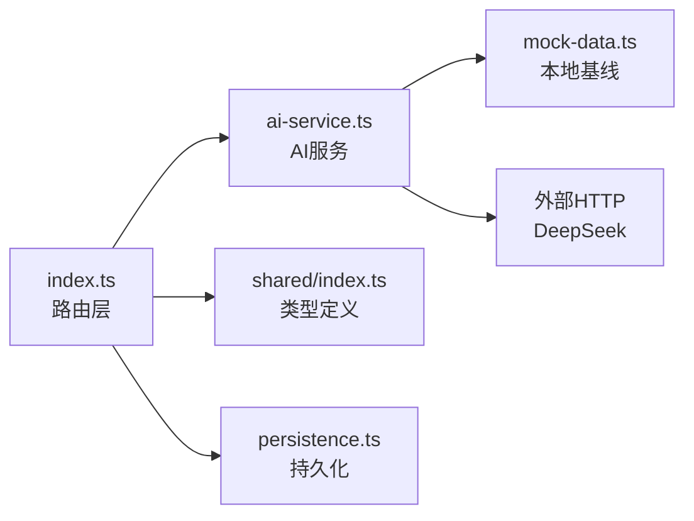

# AI服务API

<cite>
**本文引用的文件**
- [apps/backend/src/index.ts](file://fishery-digital-twin-platform/apps/backend/src/index.ts)
- [apps/backend/src/ai-service.ts](file://fishery-digital-twin-platform/apps/backend/src/ai-service.ts)
- [apps/backend/src/mock-data.ts](file://fishery-digital-twin-platform/apps/backend/src/mock-data.ts)
- [packages/shared/src/index.ts](file://fishery-digital-twin-platform/packages/shared/src/index.ts)
</cite>

## 目录
1. [简介](#简介)
2. [项目结构](#项目结构)
3. [核心组件](#核心组件)
4. [架构总览](#架构总览)
5. [详细组件分析](#详细组件分析)
6. [依赖关系分析](#依赖关系分析)
7. [性能与频率限制](#性能与频率限制)
8. [故障处理与排错](#故障处理与排错)
9. [结论](#结论)
10. [附录：接口清单与最佳实践](#附录接口清单与最佳实践)

## 简介
本文件面向“智慧渔业数字孪生平台”的AI服务API，覆盖AI报告生成、状态查询与分析结果获取等能力。文档说明触发条件、处理流程、耗时估计、报告字段结构、模型选择与版本管理、请求频率限制与防滥用机制、外部AI服务集成配置与故障处理策略，并提供最佳实践与性能优化建议。

## 项目结构
后端基于Express提供HTTP API，AI报告由本地基线与可选的外部大模型（DeepSeek）共同完成；前端页面当前重定向至水质页，不直接暴露AI入口。共享类型定义位于packages/shared中，供前后端共用。

图表来源
- [apps/backend/src/index.ts:322-473](file://fishery-digital-twin-platform/apps/backend/src/index.ts#L322-L473)
- [apps/backend/src/ai-service.ts:160-233](file://fishery-digital-twin-platform/apps/backend/src/ai-service.ts#L160-L233)
- [packages/shared/src/index.ts:65-84](file://fishery-digital-twin-platform/packages/shared/src/index.ts#L65-L84)

章节来源
- [apps/backend/src/index.ts:56-110](file://fishery-digital-twin-platform/apps/backend/src/index.ts#L56-L110)
- [apps/backend/src/index.ts:322-473](file://fishery-digital-twin-platform/apps/backend/src/index.ts#L322-L473)
- [apps/backend/src/ai-service.ts:1-233](file://fishery-digital-twin-platform/apps/backend/src/ai-service.ts#L1-L233)
- [packages/shared/src/index.ts:65-84](file://fishery-digital-twin-platform/packages/shared/src/index.ts#L65-L84)

## 核心组件
- Express路由层：提供健康检查、数据接入、快照、AI相关接口等。
- AI服务层：封装本地基线报告生成与外部AI调用、结果归一化。
- 数据与状态：维护水质历史、电池状态、最新AI报告、系统日志等。
- 共享类型：统一AIReport、WaterData、BatteryData等数据结构。

章节来源
- [apps/backend/src/index.ts:322-473](file://fishery-digital-twin-platform/apps/backend/src/index.ts#L322-L473)
- [apps/backend/src/ai-service.ts:1-233](file://fishery-digital-twin-platform/apps/backend/src/ai-service.ts#L1-L233)
- [packages/shared/src/index.ts:65-84](file://fishery-digital-twin-platform/packages/shared/src/index.ts#L65-L84)

## 架构总览
AI报告生成采用“本地基线优先 + 外部模型增强”的双轨模式：
- 当未配置外部AI密钥时，仅使用本地基线快速返回。
- 当配置了外部AI密钥时，先构造统计摘要与采样片段，再调用外部模型，并将返回内容规范化为统一AIReport结构。

图表来源
- [apps/backend/src/index.ts:456-473](file://fishery-digital-twin-platform/apps/backend/src/index.ts#L456-L473)
- [apps/backend/src/ai-service.ts:167-233](file://fishery-digital-twin-platform/apps/backend/src/ai-service.ts#L167-L233)
- [apps/backend/src/mock-data.ts:192-244](file://fishery-digital-twin-platform/apps/backend/src/mock-data.ts#L192-L244)

## 详细组件分析

### AI报告生成接口
- 触发条件
  - 需要控制授权（非回环地址且配置了令牌时）。
  - 频率限制：同一分钟内仅允许一次生成请求。
- 处理流程
  - 读取当前waterHistory与batteries。
  - 调用AI服务生成报告（本地基线或外部模型）。
  - 记录日志并持久化latestAiReport。
- 耗时估计
  - 本地基线：毫秒级。
  - 外部模型：受网络与模型响应影响，默认超时约45秒，可通过环境变量调整。
- 响应
  - 成功：201，包含report与log。
  - 失败：429（限流）、503（外部服务异常或解析失败）。

章节来源
- [apps/backend/src/index.ts:456-473](file://fishery-digital-twin-platform/apps/backend/src/index.ts#L456-L473)
- [apps/backend/src/ai-service.ts:167-233](file://fishery-digital-twin-platform/apps/backend/src/ai-service.ts#L167-L233)

### 状态查询接口
- GET /api/ai/status
  - 返回是否已配置外部AI、当前模型标识以及是否存在最新报告。
- GET /api/ai/report
  - 若存在最新报告则返回，否则404。

章节来源
- [apps/backend/src/index.ts:447-454](file://fishery-digital-twin-platform/apps/backend/src/index.ts#L447-L454)
- [apps/backend/src/ai-service.ts:160-165](file://fishery-digital-twin-platform/apps/backend/src/ai-service.ts#L160-L165)

### 数据源与快照接口（与AI报告相关）
- GET /api/water：返回水质历史序列。
- GET /api/batteries：返回电池状态。
- GET /api/snapshot：返回平台快照，其中包含aiReport（若无则使用本地基线填充）。

章节来源
- [apps/backend/src/index.ts:338-346](file://fishery-digital-twin-platform/apps/backend/src/index.ts#L338-L346)
- [apps/backend/src/index.ts:247-262](file://fishery-digital-twin-platform/apps/backend/src/index.ts#L247-L262)

### 报告数据结构（AIReport）
- 关键字段
  - id：报告唯一标识。
  - generatedAt：生成时间。
  - status：水质状态（normal/attention/polluted/algae-risk）。
  - riskLevel：风险等级（normal/attention/warning）。
  - title：标题（不超过20字）。
  - summary：摘要（简洁结论）。
  - findings：关键发现（数组）。
  - recommendations：行动建议（数组）。
  - dataQuality：数据质量说明。
  - confidence：置信度（0~1）。
  - sampleCount：样本数量。
  - model：使用的模型标识（如local-predictive-baseline或外部模型名）。
  - forecast：预测信息（horizonHours、algaeRisk、turbidityTrend、batteryRuntimeHours）。

章节来源
- [packages/shared/src/index.ts:65-84](file://fishery-digital-twin-platform/packages/shared/src/index.ts#L65-L84)
- [apps/backend/src/mock-data.ts:192-244](file://fishery-digital-twin-platform/apps/backend/src/mock-data.ts#L192-L244)
- [apps/backend/src/ai-service.ts:135-158](file://fishery-digital-twin-platform/apps/backend/src/ai-service.ts#L135-L158)

### 模型选择机制与版本管理
- 本地基线：始终可用，用于快速响应与兜底。
- 外部模型：
  - 通过环境变量启用与配置：DEEPSEEK_API_KEY、DEEPSEEK_BASE_URL、DEEPSEEK_MODEL、DEEPSEEK_TIMEOUT_SECONDS。
  - 默认模型：deepseek-v4-flash。
  - 超时：默认45秒，范围限制在5~120秒之间。
  - 返回内容需为严格JSON，并通过schema约束riskLevel/title/summary/findings/recommendations/dataQuality/confidence等字段。
- 版本管理：
  - 通过DEEPSEEK_MODEL切换不同模型版本。
  - 报告中的model字段会记录实际使用的模型名称，便于审计与回溯。

章节来源
- [apps/backend/src/ai-service.ts:160-179](file://fishery-digital-twin-platform/apps/backend/src/ai-service.ts#L160-L179)
- [apps/backend/src/ai-service.ts:180-233](file://fishery-digital-twin-platform/apps/backend/src/ai-service.ts#L180-L233)

### 请求频率限制与防滥用机制
- 频率限制：POST /api/ai/report在同一分钟内仅允许一次请求，超出返回429。
- 访问控制：非回环地址调用需携带X-UISYS-Token（当配置了UISYS_API_TOKEN时），否则返回401或503。
- CORS：按配置的白名单放行，避免跨域滥用。
- 输入限制：JSON请求体大小限制为1MB。

章节来源
- [apps/backend/src/index.ts:68-76](file://fishery-digital-twin-platform/apps/backend/src/index.ts#L68-L76)
- [apps/backend/src/index.ts:143-157](file://fishery-digital-twin-platform/apps/backend/src/index.ts#L143-L157)
- [apps/backend/src/index.ts:456-462](file://fishery-digital-twin-platform/apps/backend/src/index.ts#L456-L462)

### 外部AI服务集成配置与故障处理
- 配置项
  - DEEPSEEK_API_KEY：外部服务鉴权密钥。
  - DEEPSEEK_BASE_URL：外部服务基础URL（默认https://api.deepseek.com）。
  - DEEPSEEK_MODEL：模型名称（默认deepseek-v4-flash）。
  - DEEPSEEK_TIMEOUT_SECONDS：超时秒数（默认45，范围5~120）。
- 错误处理
  - 外部服务返回非2xx：抛出错误并返回503。
  - 内容为空：抛出错误并返回503。
  - JSON解析失败：通过schema约束与fallback保证健壮性。
  - 所有异常均记录系统日志，便于排查。

章节来源
- [apps/backend/src/ai-service.ts:167-233](file://fishery-digital-twin-platform/apps/backend/src/ai-service.ts#L167-L233)
- [apps/backend/src/index.ts:456-473](file://fishery-digital-twin-platform/apps/backend/src/index.ts#L456-L473)

## 依赖关系分析
- Express路由依赖AI服务模块，AI服务依赖本地基线与外部HTTP调用。
- 共享类型贯穿前后端，确保数据结构一致。
- 状态持久化将latestAiReport写入磁盘，重启后可恢复。

图表来源
- [apps/backend/src/index.ts:21-44](file://fishery-digital-twin-platform/apps/backend/src/index.ts#L21-L44)
- [apps/backend/src/ai-service.ts:1-3](file://fishery-digital-twin-platform/apps/backend/src/ai-service.ts#L1-L3)
- [packages/shared/src/index.ts:65-84](file://fishery-digital-twin-platform/packages/shared/src/index.ts#L65-L84)

章节来源
- [apps/backend/src/index.ts:21-44](file://fishery-digital-twin-platform/apps/backend/src/index.ts#L21-L44)
- [apps/backend/src/ai-service.ts:1-3](file://fishery-digital-twin-platform/apps/backend/src/ai-service.ts#L1-L3)

## 性能与频率限制
- 本地基线计算复杂度近似O(n)，n为样本数量，通常较小，响应极快。
- 外部模型调用受网络延迟与模型负载影响，建议合理设置超时与重试策略。
- 频率限制防止频繁触发外部调用，降低资源消耗与成本。
- 建议：
  - 在前端轮询GET /api/ai/report而非高频POST触发。
  - 结合业务场景调整DEEPSEEK_TIMEOUT_SECONDS。
  - 对大量历史数据做分页或窗口聚合后再提交给外部模型。

[本节为通用指导，无需特定文件引用]

## 故障处理与排错
- 常见问题
  - 未配置DEEPSEEK_API_KEY：将仅返回本地基线报告。
  - 外部服务超时或不可用：返回503，查看系统日志定位。
  - 请求被限流：等待至少一分钟后再试。
  - 认证失败：确认X-UISYS-Token与UISYS_API_TOKEN配置一致。
- 诊断步骤
  - 使用GET /api/health检查服务状态与AI配置。
  - 使用GET /api/logs查看最近系统日志。
  - 检查环境变量与网络连通性。

章节来源
- [apps/backend/src/index.ts:322-334](file://fishery-digital-twin-platform/apps/backend/src/index.ts#L322-L334)
- [apps/backend/src/index.ts:557-561](file://fishery-digital-twin-platform/apps/backend/src/index.ts#L557-L561)
- [apps/backend/src/ai-service.ts:220-233](file://fishery-digital-twin-platform/apps/backend/src/ai-service.ts#L220-L233)

## 结论
该AI服务API以本地基线为核心保障可用性，同时支持外部大模型增强报告质量。通过严格的频率限制、访问控制与错误处理，兼顾稳定性与安全性。建议在生产环境合理配置外部AI参数，并结合业务需求进行缓存与异步化处理，以获得更优的用户体验与系统性能。

[本节为总结性内容，无需特定文件引用]

## 附录：接口清单与最佳实践

### 接口清单
- 健康检查
  - GET /api/health
- 数据与快照
  - GET /api/water
  - GET /api/batteries
  - GET /api/snapshot
- AI服务
  - GET /api/ai/status
  - GET /api/ai/report
  - POST /api/ai/report（需控制授权，每分钟一次）

章节来源
- [apps/backend/src/index.ts:322-346](file://fishery-digital-twin-platform/apps/backend/src/index.ts#L322-L346)
- [apps/backend/src/index.ts:447-473](file://fishery-digital-twin-platform/apps/backend/src/index.ts#L447-L473)

### 最佳实践
- 报告生成
  - 仅在必要时触发POST /api/ai/report，日常展示使用GET /api/ai/report。
  - 合理设置DEEPSEEK_TIMEOUT_SECONDS，避免长时间阻塞。
- 数据准备
  - 确保waterHistory与batteries数据完整，提升报告准确性。
  - 使用GET /api/snapshot获取包含aiReport的完整上下文。
- 安全与合规
  - 配置UISYS_API_TOKEN并正确传递X-UISYS-Token。
  - 配置CORS白名单，限制跨域访问。
- 监控与排错
  - 定期查看/api/logs与/api/health。
  - 出现503时优先检查外部服务状态与网络连通性。

[本节为通用指导，无需特定文件引用]