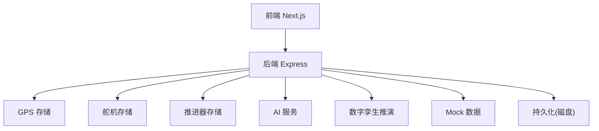
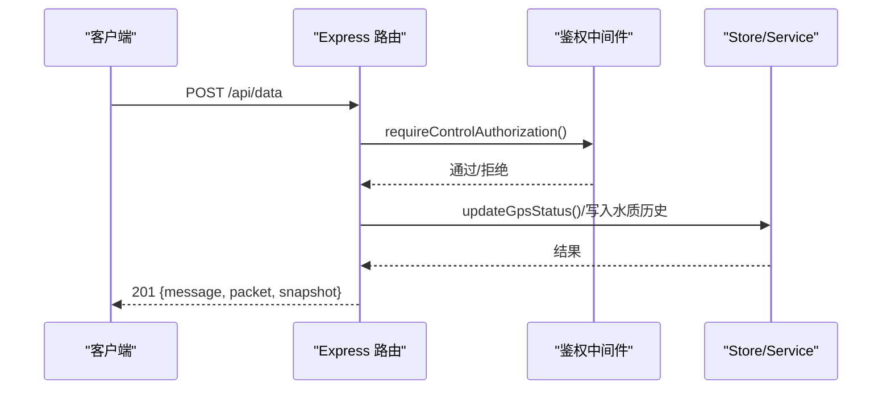
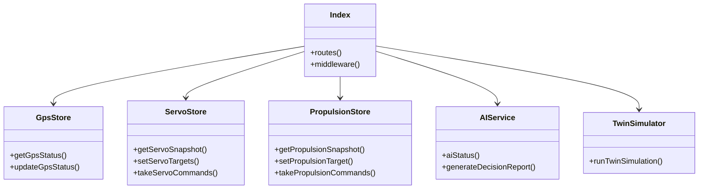

# API参考

<cite>
**本文引用的文件**
- [apps/backend/src/index.ts](file://fishery-digital-twin-platform/apps/backend/src/index.ts)
- [packages/shared/src/index.ts](file://fishery-digital-twin-platform/packages/shared/src/index.ts)
- [apps/backend/src/mock-data.ts](file://fishery-digital-twin-platform/apps/backend/src/mock-data.ts)
- [apps/backend/src/ai-service.ts](file://fishery-digital-twin-platform/apps/backend/src/ai-service.ts)
- [apps/backend/src/gps-store.ts](file://fishery-digital-twin-platform/apps/backend/src/gps-store.ts)
- [apps/backend/src/servo-store.ts](file://fishery-digital-twin-platform/apps/backend/src/servo-store.ts)
- [apps/backend/src/propulsion-store.ts](file://fishery-digital-twin-platform/apps/backend/src/propulsion-store.ts)
- [apps/backend/src/twin-simulator.ts](file://fishery-digital-twin-platform/apps/backend/src/twin-simulator.ts)
- [apps/frontend/src/lib/api.ts](file://fishery-digital-twin-platform/apps/frontend/src/lib/api.ts)
- [README.md](file://fishery-digital-twin-platform/README.md)
</cite>

## 目录
1. [简介](#简介)
2. [项目结构](#项目结构)
3. [核心组件](#核心组件)
4. [架构总览](#架构总览)
5. [详细接口规范](#详细接口规范)
6. [依赖关系分析](#依赖关系分析)
7. [性能与可用性](#性能与可用性)
8. [故障排查指南](#故障排查指南)
9. [结论](#结论)
10. [附录：客户端调用示例](#附录客户端调用示例)

## 简介
本API参考文档面向智慧渔业巡检船数字孪生平台后端服务，覆盖RESTful接口、数据模型、认证授权、错误码、版本策略与调试方法。系统基于Express提供HTTP接口，支持水质数据上报、平台快照、电池状态、导航/GPS、设备控制（舵机、推进器）、AI报告生成与数字孪生推演。前端通过轮询获取平台快照和设备反馈，未实现WebSocket实时推送。

## 项目结构
- 后端服务：Express应用，集中注册路由、CORS、鉴权中间件、持久化与日志记录。
- 共享类型：前后端共用TypeScript类型定义，确保请求/响应契约一致。
- 模块职责：
  - 水质与平台快照：聚合历史水质、电池、导航、AI报告、船舶状态。
  - GPS存储：维护GPS在线状态与定位信息。
  - 舵机存储：管理舵机目标角度、实际角度、命令队列与TTL。
  - 推进器存储：管理推进模式、功率、急停、命令队列与TTL。
  - AI服务：本地基线或DeepSeek外部模型生成决策报告。
  - 数字孪生推演：根据输入参数与当前快照进行航程、故障与疲劳预测。
- 前端：Next.js应用，封装统一fetch调用，自动附加令牌头，定时拉取快照与设备反馈。

图表来源
- [apps/backend/src/index.ts:56-110](file://fishery-digital-twin-platform/apps/backend/src/index.ts#L56-L110)
- [apps/backend/src/gps-store.ts:1-103](file://fishery-digital-twin-platform/apps/backend/src/gps-store.ts#L1-L103)
- [apps/backend/src/servo-store.ts:1-184](file://fishery-digital-twin-platform/apps/backend/src/servo-store.ts#L1-L184)
- [apps/backend/src/propulsion-store.ts:1-319](file://fishery-digital-twin-platform/apps/backend/src/propulsion-store.ts#L1-L319)
- [apps/backend/src/ai-service.ts:1-233](file://fishery-digital-twin-platform/apps/backend/src/ai-service.ts#L1-L233)
- [apps/backend/src/twin-simulator.ts:1-254](file://fishery-digital-twin-platform/apps/backend/src/twin-simulator.ts#L1-L254)

章节来源
- [apps/backend/src/index.ts:56-110](file://fishery-digital-twin-platform/apps/backend/src/index.ts#L56-L110)
- [README.md:16-77](file://fishery-digital-twin-platform/README.md#L16-L77)

## 核心组件
- 平台快照：聚合水质历史、电池、导航、AI报告、船舶状态，用于前端仪表盘渲染。
- 水质数据：支持传感器上报与演示数据注入；计算水质状态（正常/关注/藻华风险/污染）。
- 设备控制：舵机与推进器均具备“设置目标/查询快照/拉取命令”的三段式交互，命令带TTL过期清理。
- 数字孪生：输入航线、海况、故障等参数，输出航程预测、故障影响与部件疲劳评估。
- AI报告：本地统计+可选DeepSeek模型生成结构化报告，包含风险等级、建议与置信度。

章节来源
- [apps/backend/src/index.ts:178-262](file://fishery-digital-twin-platform/apps/backend/src/index.ts#L178-L262)
- [apps/backend/src/mock-data.ts:48-140](file://fishery-digital-twin-platform/apps/backend/src/mock-data.ts#L48-L140)
- [apps/backend/src/servo-store.ts:106-184](file://fishery-digital-twin-platform/apps/backend/src/servo-store.ts#L106-L184)
- [apps/backend/src/propulsion-store.ts:166-319](file://fishery-digital-twin-platform/apps/backend/src/propulsion-store.ts#L166-L319)
- [apps/backend/src/ai-service.ts:160-233](file://fishery-digital-twin-platform/apps/backend/src/ai-service.ts#L160-L233)
- [apps/backend/src/twin-simulator.ts:74-254](file://fishery-digital-twin-platform/apps/backend/src/twin-simulator.ts#L74-L254)

## 架构总览
后端以Express为中心，所有业务逻辑通过模块化store与服务解耦。认证通过X-UISYS-Token头部校验，仅对控制类写接口生效；读接口默认开放。CORS限制允许的前端源。UDP广播用于局域网设备发现后端端口。

图表来源
- [apps/backend/src/index.ts:143-157](file://fishery-digital-twin-platform/apps/backend/src/index.ts#L143-L157)
- [apps/backend/src/index.ts:367-430](file://fishery-digital-twin-platform/apps/backend/src/index.ts#L367-L430)
- [apps/backend/src/gps-store.ts:59-103](file://fishery-digital-twin-platform/apps/backend/src/gps-store.ts#L59-L103)

## 详细接口规范

### 通用约定
- 基础路径：/api
- 内容类型：application/json
- 认证：控制类写接口需携带请求头 X-UISYS-Token；若未配置令牌，非回环地址将返回503。
- CORS：由服务端配置允许的origin列表，默认包含本机开发地址。
- 错误格式：{ error: string } 或扩展字段；成功写操作通常返回201。

章节来源
- [apps/backend/src/index.ts:101-110](file://fishery-digital-twin-platform/apps/backend/src/index.ts#L101-L110)
- [apps/backend/src/index.ts:136-157](file://fishery-digital-twin-platform/apps/backend/src/index.ts#L136-L157)

### 健康检查
- GET /api/health
- 响应：服务状态、数据模式、AI/GPS/舵机/推进器概览。

章节来源
- [apps/backend/src/index.ts:322-334](file://fishery-digital-twin-platform/apps/backend/src/index.ts#L322-L334)

### 平台快照
- GET /api/snapshot
- 说明：聚合水质历史、电池、导航、AI报告、船舶状态；若未收到真实数据且演示模式开启，会追加演示样本。
- 响应：PlatformSnapshot（见共享类型）。

章节来源
- [apps/backend/src/index.ts:247-262](file://fishery-digital-twin-platform/apps/backend/src/index.ts#L247-L262)
- [apps/backend/src/index.ts:336-336](file://fishery-digital-twin-platform/apps/backend/src/index.ts#L336-L336)
- [packages/shared/src/index.ts:98-106](file://fishery-digital-twin-platform/packages/shared/src/index.ts#L98-L106)

### 水质数据
- GET /api/water
- 说明：返回最近N条水质历史（含source标记sensor/demo/fallback）。
- 响应：WaterData[]。

- POST /api/data（需要令牌）
- 说明：上报传感器数据，支持多字段可选；自动更新水质状态与电池百分比；首次真实数据后关闭演示注入。
- 请求体关键字段（任一数值字段即可）：waterTemperature/water_temperature、turbidity、ph/pH、dissolvedOxygen/dissolved_oxygen/do、ammoniaNitrogen/ammonia_nitrogen/nh3、conductivity/ec、batteryPercent/battery_percent。
- 响应：201 { message, packet, snapshot }。

章节来源
- [apps/backend/src/index.ts:338-341](file://fishery-digital-twin-platform/apps/backend/src/index.ts#L338-L341)
- [apps/backend/src/index.ts:367-430](file://fishery-digital-twin-platform/apps/backend/src/index.ts#L367-L430)
- [packages/shared/src/index.ts:7-17](file://fishery-digital-twin-platform/packages/shared/src/index.ts#L7-L17)

### 电池状态
- GET /api/batteries
- 说明：返回电池数组（id、电量、电压、状态、来源、更新时间）。
- 响应：BatteryData[]。

章节来源
- [apps/backend/src/index.ts:343-343](file://fishery-digital-twin-platform/apps/backend/src/index.ts#L343-L343)
- [packages/shared/src/index.ts:19-26](file://fishery-digital-twin-platform/packages/shared/src/index.ts#L19-L26)

### 导航信息
- GET /api/navigation
- 说明：优先使用GPS实时位置；无有效GPS时返回模拟航线与目标航点。
- 响应：NavigationData（含position、route、targetWaypoint、speed、heading、remainingDistance、etaMinutes、source、gps）。

章节来源
- [apps/backend/src/index.ts:197-222](file://fishery-digital-twin-platform/apps/backend/src/index.ts#L197-L222)
- [apps/backend/src/index.ts:344-344](file://fishery-digital-twin-platform/apps/backend/src/index.ts#L344-L344)
- [packages/shared/src/index.ts:53-63](file://fishery-digital-twin-platform/packages/shared/src/index.ts#L53-L63)

### GPS数据
- GET /api/gps
- 说明：返回GPS在线状态、坐标、卫星数、HDOP、高度、速度、航向等。
- 响应：GpsStatus。

- POST /api/gps/status（需要令牌）
- 说明：上报GPS状态；coordinate_system必须为WGS84；valid需满足经纬度范围与请求标志。
- 响应：201 { gps, becameOnline, fixAcquired }。

章节来源
- [apps/backend/src/index.ts:345-345](file://fishery-digital-twin-platform/apps/backend/src/index.ts#L345-L345)
- [apps/backend/src/index.ts:348-365](file://fishery-digital-twin-platform/apps/backend/src/index.ts#L348-L365)
- [apps/backend/src/gps-store.ts:55-103](file://fishery-digital-twin-platform/apps/backend/src/gps-store.ts#L55-L103)
- [packages/shared/src/index.ts:35-51](file://fishery-digital-twin-platform/packages/shared/src/index.ts#L35-L51)

### 船舶状态
- GET /api/vessel
- 说明：综合ESP32、通信、传感器、AI就绪等状态。
- 响应：VesselStatus。

章节来源
- [apps/backend/src/index.ts:228-245](file://fishery-digital-twin-platform/apps/backend/src/index.ts#L228-L245)
- [apps/backend/src/index.ts:346-346](file://fishery-digital-twin-platform/apps/backend/src/index.ts#L346-L346)
- [packages/shared/src/index.ts:86-96](file://fishery-digital-twin-platform/packages/shared/src/index.ts#L86-L96)

### 舵机控制
- GET /api/servos
- 说明：返回所有舵机设备快照或指定device_id的设备详情。
- 响应：ServoSnapshot 或 ServoDevice。

- POST /api/servos（需要令牌）
- 说明：设置舵机目标角度；支持angles数组或channel+angle；保留通道保护与角度上限。
- 响应：201 { command, device, servos }。

- POST /api/servos/status（需要令牌）
- 说明：上报舵机实际角度与心跳，更新设备在线状态。
- 响应：201 { device, servos }。

- GET /api/device/commands（需要令牌）
- 说明：拉取待执行的舵机命令（带TTL过滤）。
- 响应：ServoCommand[]。

章节来源
- [apps/backend/src/index.ts:475-503](file://fishery-digital-twin-platform/apps/backend/src/index.ts#L475-L503)
- [apps/backend/src/servo-store.ts:89-184](file://fishery-digital-twin-platform/apps/backend/src/servo-store.ts#L89-L184)
- [packages/shared/src/index.ts:108-131](file://fishery-digital-twin-platform/packages/shared/src/index.ts#L108-L131)

### 推进器控制
- GET /api/propulsion
- 说明：返回推进器设备快照或指定device_id详情。
- 响应：PropulsionSnapshot 或 PropulsionDevice。

- POST /api/propulsion（需要令牌）
- 说明：设置推进模式、使能、急停、油门/转向或直接左右功率；离线设备禁止激活命令。
- 响应：201 { command, device, propulsion }。

- POST /api/propulsion/status（需要令牌）
- 说明：上报推进器运行状态、冷却、循环阶段、往返计数等。
- 响应：201 { device, propulsion }。

- GET /api/propulsion/commands（需要令牌）
- 说明：拉取待执行的推进命令（带TTL过滤）。
- 响应：PropulsionCommand[]。

章节来源
- [apps/backend/src/index.ts:505-538](file://fishery-digital-twin-platform/apps/backend/src/index.ts#L505-L538)
- [apps/backend/src/propulsion-store.ts:149-319](file://fishery-digital-twin-platform/apps/backend/src/propulsion-store.ts#L149-L319)
- [packages/shared/src/index.ts:133-194](file://fishery-digital-twin-platform/packages/shared/src/index.ts#L133-L194)

### AI报告
- GET /api/ai/status
- 说明：返回AI能力配置与是否已有报告。
- 响应：{ configured, model, hasReport }。

- GET /api/ai/report
- 说明：获取最新AI报告；若无则返回404。
- 响应：AIReport。

- POST /api/ai/report（需要令牌）
- 说明：生成AI报告；频率限制每分钟一次；可调用DeepSeek或本地基线。
- 响应：201 { report, log }。

章节来源
- [apps/backend/src/index.ts:447-473](file://fishery-digital-twin-platform/apps/backend/src/index.ts#L447-L473)
- [apps/backend/src/ai-service.ts:160-233](file://fishery-digital-twin-platform/apps/backend/src/ai-service.ts#L160-L233)
- [packages/shared/src/index.ts:65-84](file://fishery-digital-twin-platform/packages/shared/src/index.ts#L65-L84)

### 数字孪生推演
- POST /api/twin/simulate（需要令牌）
- 说明：输入航线距离、目标航速、海况、故障类型与严重度、运行时长、舵机日动作次数等，输出航程预测、故障影响与疲劳评估。
- 响应：201 TwinSimulationResult。

章节来源
- [apps/backend/src/index.ts:540-555](file://fishery-digital-twin-platform/apps/backend/src/index.ts#L540-L555)
- [apps/backend/src/twin-simulator.ts:74-254](file://fishery-digital-twin-platform/apps/backend/src/twin-simulator.ts#L74-L254)
- [packages/shared/src/index.ts:205-287](file://fishery-digital-twin-platform/packages/shared/src/index.ts#L205-L287)

### 系统日志
- GET /api/logs
- 说明：返回系统事件日志（平台启动、传感器接收、AI生成、控制下发等）。
- 响应：SystemLog[]。

章节来源
- [apps/backend/src/index.ts:557-557](file://fishery-digital-twin-platform/apps/backend/src/index.ts#L557-L557)
- [packages/shared/src/index.ts:196-203](file://fishery-digital-twin-platform/packages/shared/src/index.ts#L196-L203)

### 演示数据
- POST /api/demo/simulate（需要令牌）
- 说明：生成独立演示水质序列与快照，不覆盖实时历史。
- 响应：201 { count, water, snapshot, log }。

- POST /api/simulate（已废弃）
- 说明：返回410并提示迁移至 /api/demo/simulate。

章节来源
- [apps/backend/src/index.ts:432-445](file://fishery-digital-twin-platform/apps/backend/src/index.ts#L432-L445)

### WebSocket实时通信
- 当前实现：未发现WebSocket服务器或事件推送逻辑。前端通过定时轮询获取平台快照与设备反馈。
- 建议：如需实时性，可在后续版本引入WebSocket，按事件类型（snapshot、servo、propulsion、gps、logs）推送增量消息。

章节来源
- [apps/frontend/src/lib/platformStore.ts:67-117](file://fishery-digital-twin-platform/apps/frontend/src/lib/platformStore.ts#L67-L117)
- [apps/frontend/src/hooks/usePlatformData.ts:1-23](file://fishery-digital-twin-platform/apps/frontend/src/hooks/usePlatformData.ts#L1-L23)

### 认证与授权
- 令牌验证：控制类写接口通过requireControlAuthorization中间件校验X-UISYS-Token；回环地址豁免。
- 访问限制：未配置令牌时，非回环地址的控制请求返回503；令牌不匹配返回401。
- CORS：限制允许的前端源，避免跨域误用。

章节来源
- [apps/backend/src/index.ts:131-157](file://fishery-digital-twin-platform/apps/backend/src/index.ts#L131-L157)
- [apps/backend/src/index.ts:559-561](file://fishery-digital-twin-platform/apps/backend/src/index.ts#L559-L561)

### 错误码汇总
- 200：成功读取。
- 201：成功写入（创建/更新）。
- 400：请求参数无效（如数值越界、字段缺失）。
- 401：令牌无效或缺失。
- 403：CORS不允许的来源。
- 410：接口已移除（/api/simulate）。
- 429：AI报告生成频率限制（每分钟一次）。
- 500：内部错误。
- 503：未配置令牌时的LAN控制拒绝或AI服务不可用。

章节来源
- [apps/backend/src/index.ts:143-157](file://fishery-digital-twin-platform/apps/backend/src/index.ts#L143-L157)
- [apps/backend/src/index.ts:348-365](file://fishery-digital-twin-platform/apps/backend/src/index.ts#L348-L365)
- [apps/backend/src/index.ts:367-430](file://fishery-digital-twin-platform/apps/backend/src/index.ts#L367-L430)
- [apps/backend/src/index.ts:432-445](file://fishery-digital-twin-platform/apps/backend/src/index.ts#L432-L445)
- [apps/backend/src/index.ts:456-473](file://fishery-digital-twin-platform/apps/backend/src/index.ts#L456-L473)
- [apps/backend/src/index.ts:559-561](file://fishery-digital-twin-platform/apps/backend/src/index.ts#L559-L561)

## 依赖关系分析
- 路由层依赖store与服务：index.ts集中注册路由，调用gps-store、servo-store、propulsion-store、ai-service、twin-simulator。
- 类型契约：packages/shared定义的数据模型被前后端共同引用，保证一致性。
- 前端依赖：frontend/src/lib/api.ts封装统一fetch，自动附加令牌头，调用上述接口。

图表来源
- [apps/backend/src/index.ts:21-44](file://fishery-digital-twin-platform/apps/backend/src/index.ts#L21-L44)
- [apps/backend/src/gps-store.ts:1-103](file://fishery-digital-twin-platform/apps/backend/src/gps-store.ts#L1-L103)
- [apps/backend/src/servo-store.ts:1-184](file://fishery-digital-twin-platform/apps/backend/src/servo-store.ts#L1-L184)
- [apps/backend/src/propulsion-store.ts:1-319](file://fishery-digital-twin-platform/apps/backend/src/propulsion-store.ts#L1-L319)
- [apps/backend/src/ai-service.ts:1-233](file://fishery-digital-twin-platform/apps/backend/src/ai-service.ts#L1-L233)
- [apps/backend/src/twin-simulator.ts:1-254](file://fishery-digital-twin-platform/apps/backend/src/twin-simulator.ts#L1-L254)

章节来源
- [apps/backend/src/index.ts:21-44](file://fishery-digital-twin-platform/apps/backend/src/index.ts#L21-L44)
- [packages/shared/src/index.ts:1-288](file://fishery-digital-twin-platform/packages/shared/src/index.ts#L1-L288)
- [apps/frontend/src/lib/api.ts:1-101](file://fishery-digital-twin-platform/apps/frontend/src/lib/api.ts#L1-L101)

## 性能与可用性
- 历史窗口：水质历史最多保留固定数量，避免内存增长。
- 命令TTL：舵机与推进器命令队列带有TTL，防止陈旧命令执行。
- 频率限制：AI报告生成限制每分钟一次，降低外部模型压力。
- 演示模式：在未收到真实数据前周期性注入演示样本，保障界面可用。
- 持久化：关键状态（水质历史、电池、AI报告、日志）定期落盘，重启恢复。

章节来源
- [apps/backend/src/index.ts:64-68](file://fishery-digital-twin-platform/apps/backend/src/index.ts#L64-L68)
- [apps/backend/src/index.ts:178-187](file://fishery-digital-twin-platform/apps/backend/src/index.ts#L178-L187)
- [apps/backend/src/index.ts:456-473](file://fishery-digital-twin-platform/apps/backend/src/index.ts#L456-L473)
- [apps/backend/src/servo-store.ts:175-184](file://fishery-digital-twin-platform/apps/backend/src/servo-store.ts#L175-L184)
- [apps/backend/src/propulsion-store.ts:310-319](file://fishery-digital-twin-platform/apps/backend/src/propulsion-store.ts#L310-L319)

## 故障排查指南
- 无法连接后端：检查端口与防火墙规则；确认CORS允许的前端源。
- 控制接口返回503：确认已配置UISYS_API_TOKEN；局域网设备需同一热点且无客户端隔离。
- 控制接口返回401：检查X-UISYS-Token是否正确；回环地址不受限。
- 水质数据未更新：确认POST /api/data字段合法；检查演示模式开关与真实数据到达时间。
- 舵机/推进器命令未执行：确认设备在线（last_seen新鲜）；检查命令TTL与设备拉取命令接口。
- AI报告失败：检查DeepSeek密钥与网络；查看系统日志中的错误信息。
- 数字孪生推演失败：检查输入参数范围与合法性；查看错误日志。

章节来源
- [README.md:173-185](file://fishery-digital-twin-platform/README.md#L173-L185)
- [apps/backend/src/index.ts:131-157](file://fishery-digital-twin-platform/apps/backend/src/index.ts#L131-L157)
- [apps/backend/src/index.ts:348-365](file://fishery-digital-twin-platform/apps/backend/src/index.ts#L348-L365)
- [apps/backend/src/index.ts:367-430](file://fishery-digital-twin-platform/apps/backend/src/index.ts#L367-L430)
- [apps/backend/src/servo-store.ts:106-153](file://fishery-digital-twin-platform/apps/backend/src/servo-store.ts#L106-L153)
- [apps/backend/src/propulsion-store.ts:166-231](file://fishery-digital-twin-platform/apps/backend/src/propulsion-store.ts#L166-L231)
- [apps/backend/src/ai-service.ts:167-233](file://fishery-digital-twin-platform/apps/backend/src/ai-service.ts#L167-L233)

## 结论
该后端API提供了完整的平台观测与控制能力，涵盖水质、导航、设备与健康、AI与数字孪生推演。通过统一的类型契约与严格的参数校验，保证了前后端协作的稳定性和安全性。当前采用HTTP轮询机制，未来可按需引入WebSocket以提升实时性。

## 附录：客户端调用示例

### JavaScript（浏览器/Node）
- 获取平台快照：GET /api/snapshot
- 上报传感器数据：POST /api/data（携带X-UISYS-Token）
- 设置舵机角度：POST /api/servos（携带X-UISYS-Token）
- 设置推进器目标：POST /api/propulsion（携带X-UISYS-Token）
- 生成AI报告：POST /api/ai/report（携带X-UISYS-Token）
- 数字孪生推演：POST /api/twin/simulate（携带X-UISYS-Token）

章节来源
- [apps/frontend/src/lib/api.ts:6-24](file://fishery-digital-twin-platform/apps/frontend/src/lib/api.ts#L6-L24)
- [apps/frontend/src/lib/api.ts:26-101](file://fishery-digital-twin-platform/apps/frontend/src/lib/api.ts#L26-L101)

### Python（requests）
- 示例流程：
  - 设置headers包含Content-Type与X-UISYS-Token。
  - 调用POST /api/data发送传感器数据。
  - 调用GET /api/snapshot获取最新快照。
  - 调用POST /api/servos或POST /api/propulsion下发控制指令。
  - 调用POST /api/ai/report生成AI报告。
  - 调用POST /api/twin/simulate执行数字孪生推演。

章节来源
- [apps/backend/src/index.ts:367-430](file://fishery-digital-twin-platform/apps/backend/src/index.ts#L367-L430)
- [apps/backend/src/index.ts:475-555](file://fishery-digital-twin-platform/apps/backend/src/index.ts#L475-L555)

### 版本管理与兼容性
- 当前版本：包版本0.1.0；接口路径未显式版本号，但通过废弃接口返回410提示迁移。
- 向后兼容：新增字段采用可选键；数值解析支持多种命名风格（如ph/pH、left_power/leftPower）。
- 迁移指南：旧接口/api/simulate迁移到/api/demo/simulate；遵循新请求体结构与响应格式。

章节来源
- [apps/backend/package.json:1-27](file://fishery-digital-twin-platform/apps/backend/package.json#L1-L27)
- [apps/backend/src/index.ts:432-445](file://fishery-digital-twin-platform/apps/backend/src/index.ts#L432-L445)
- [apps/backend/src/propulsion-store.ts:233-308](file://fishery-digital-twin-platform/apps/backend/src/propulsion-store.ts#L233-L308)