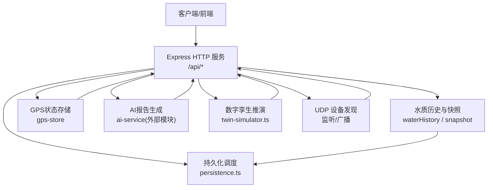
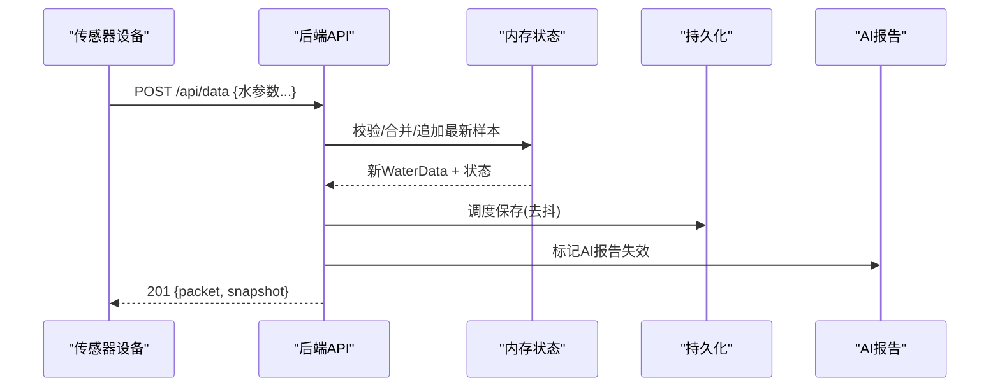
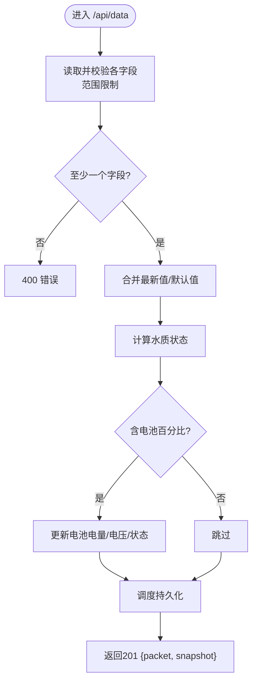
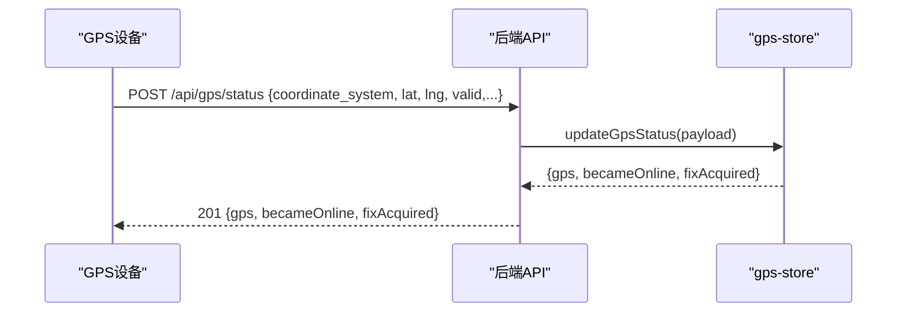
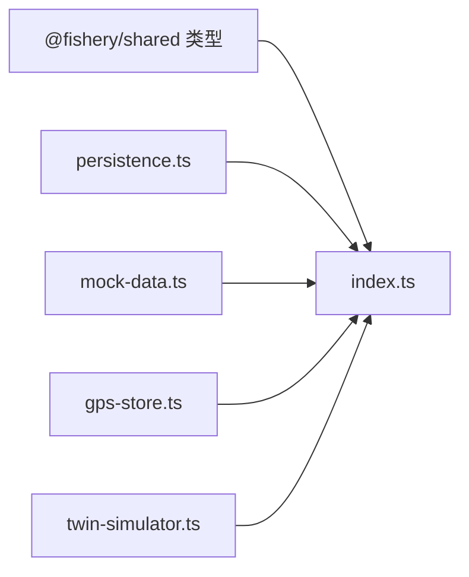

# 传感器数据API

<cite>
**本文引用的文件**
- [index.ts](file://fishery-digital-twin-platform/apps/backend/src/index.ts)
- [persistence.ts](file://fishery-digital-twin-platform/apps/backend/src/persistence.ts)
- [mock-data.ts](file://fishery-digital-twin-platform/apps/backend/src/mock-data.ts)
- [gps-store.ts](file://fishery-digital-twin-platform/apps/backend/src/gps-store.ts)
- [twin-simulator.ts](file://fishery-digital-twin-platform/apps/backend/src/twin-simulator.ts)
- [shared index.ts](file://fishery-digital-twin-platform/packages/shared/src/index.ts)
</cite>

## 目录
1. [简介](#简介)
2. [项目结构](#项目结构)
3. [核心组件](#核心组件)
4. [架构总览](#架构总览)
5. [详细组件分析](#详细组件分析)
6. [依赖关系分析](#依赖关系分析)
7. [性能与扩展性](#性能与扩展性)
8. [故障排查指南](#故障排查指南)
9. [结论](#结论)
10. [附录：接口清单与数据包规范](#附录接口清单与数据包规范)

## 简介
本文件面向“渔业数字孪生平台”的传感器数据API，覆盖水质监测数据上传、GPS状态更新、设备心跳/在线检测、演示数据生成、历史数据管理以及设备发现机制等。文档重点说明：
- 传感器数据包结构与字段含义
- 参数有效范围与边界校验规则
- 演示数据生成接口的使用方法（采样点数量、模拟场景）
- 数据持久化策略与历史数据管理
- 设备发现机制与网络通信协议

## 项目结构
后端服务基于Express提供HTTP API，并通过UDP广播实现局域网设备发现；在内存中维护水质历史、电池状态、导航与AI报告等运行时数据，并周期性落盘持久化。共享类型定义位于packages/shared中，供前后端与固件侧共同引用。

图表来源
- [index.ts:56-110](file://fishery-digital-twin-platform/apps/backend/src/index.ts#L56-L110)
- [index.ts:271-318](file://fishery-digital-twin-platform/apps/backend/src/index.ts#L271-L318)
- [persistence.ts:12-59](file://fishery-digital-twin-platform/apps/backend/src/persistence.ts#L12-L59)

章节来源
- [index.ts:56-110](file://fishery-digital-twin-platform/apps/backend/src/index.ts#L56-L110)
- [persistence.ts:12-59](file://fishery-digital-twin-platform/apps/backend/src/persistence.ts#L12-L59)

## 核心组件
- 水质数据接收与校验：POST /api/data，支持水温、浊度、pH、溶解氧、氨氮、电导率、电池百分比等可选字段，带严格范围校验与默认值回退。
- GPS状态更新：POST /api/gps/status，校验坐标范围与坐标系，维护在线/有效定位状态。
- 设备心跳/在线检测：通过最近一次真实传感器数据时间戳判断传感器是否“新鲜”，结合GPS/舵机/推进器在线状态综合判定设备整体在线情况。
- 演示数据生成：POST /api/demo/simulate，按指定采样点数量生成独立演示数据与快照，不污染实时历史。
- 历史数据与快照：GET /api/water、GET /api/snapshot，返回当前水质历史与平台快照。
- 设备发现：UDP广播监听与响应，用于ESP32等设备自动发现后端服务地址。

章节来源
- [index.ts:348-430](file://fishery-digital-twin-platform/apps/backend/src/index.ts#L348-L430)
- [index.ts:322-346](file://fishery-digital-twin-platform/apps/backend/src/index.ts#L322-L346)
- [index.ts:224-245](file://fishery-digital-twin-platform/apps/backend/src/index.ts#L224-L245)
- [index.ts:432-441](file://fishery-digital-twin-platform/apps/backend/src/index.ts#L432-L441)
- [index.ts:271-318](file://fishery-digital-twin-platform/apps/backend/src/index.ts#L271-L318)

## 架构总览
系统由以下关键路径组成：
- 传感器数据流：设备或模拟器 → POST /api/data → 校验与写入 → 更新电池 → 触发AI报告失效 → 持久化
- GPS状态流：设备上报 → POST /api/gps/status → 校验与更新 → 影响导航与设备在线判定
- 设备发现：UDP请求 → 服务端广播响应 → 设备解析端口并建立HTTP连接
- 演示数据：POST /api/demo/simulate → 生成独立样本集与快照 → 不修改实时历史
- 数字孪生：POST /api/twin/simulate → 基于当前快照与执行机构反馈进行能耗/健康/风险推演

图表来源
- [index.ts:367-430](file://fishery-digital-twin-platform/apps/backend/src/index.ts#L367-L430)
- [persistence.ts:51-59](file://fishery-digital-twin-platform/apps/backend/src/persistence.ts#L51-L59)

章节来源
- [index.ts:367-430](file://fishery-digital-twin-platform/apps/backend/src/index.ts#L367-L430)
- [persistence.ts:51-59](file://fishery-digital-twin-platform/apps/backend/src/persistence.ts#L51-L59)

## 详细组件分析

### 水质数据上传接口 POST /api/data
- 功能：接收传感器上报的水质与电池数据，进行范围校验，写入历史，计算水质状态，必要时更新电池信息，并返回最新快照。
- 支持字段（任一即可）：
  - waterTemperature / water_temperature：水温，单位°C，范围[-5, 50]
  - turbidity：浊度，单位NTU，范围[0, 1000]
  - ph / pH：酸碱度，范围[0, 14]
  - dissolvedOxygen / dissolved_oxygen / do：溶解氧，单位mg/L，范围[0, 30]
  - ammoniaNitrogen / ammonia_nitrogen / nh3：氨氮，单位mg/L，范围[0, 100]
  - conductivity / ec：电导率，单位μS/cm，范围[0, 200000]
  - batteryPercent / battery_percent：电池电量百分比，范围[0, 100]
- 校验与边界检查：
  - 使用统一数值读取函数，要求为有限数值且落在指定区间，否则返回400错误。
  - 未提供的字段会回退到上一时刻值或内置默认值，保证序列连续性。
- 状态计算：根据浊度、pH、溶解氧、氨氮阈值组合判定水质状态（正常/关注/藻华风险/污染）。
- 电池更新：若包含电池百分比，则更新首块电池的电量、电压与状态，并记录更新时间。
- 历史与持久化：
  - 首次收到真实数据后，历史从该点开始；之后保留最多180条。
  - 通过调度器异步落盘，避免频繁IO。
- 鉴权：需要控制授权头（见“安全与鉴权”小节）。

图表来源
- [index.ts:159-176](file://fishery-digital-twin-platform/apps/backend/src/index.ts#L159-L176)
- [index.ts:367-430](file://fishery-digital-twin-platform/apps/backend/src/index.ts#L367-L430)

章节来源
- [index.ts:159-176](file://fishery-digital-twin-platform/apps/backend/src/index.ts#L159-L176)
- [index.ts:367-430](file://fishery-digital-twin-platform/apps/backend/src/index.ts#L367-L430)

### GPS状态更新接口 POST /api/gps/status
- 功能：接收GPS串口数据或模拟器上报，校验坐标系与坐标范围，维护在线与有效定位标志，并输出变化事件（becameOnline、fixAcquired）。
- 校验规则：
  - coordinate_system必须为WGS84
  - lat∈[-90, 90]，lng∈[-180, 180]
  - valid需显式true才视为有效定位
- 在线判定：
  - serial_online为真且last_seen在超时窗口内（默认10秒）即认为online
  - valid仅在online且坐标有效时成立
- 输出：返回当前GPS状态及变更事件，便于上层记录日志或触发告警。

图表来源
- [gps-store.ts:59-103](file://fishery-digital-twin-platform/apps/backend/src/gps-store.ts#L59-L103)
- [index.ts:348-365](file://fishery-digital-twin-platform/apps/backend/src/index.ts#L348-L365)

章节来源
- [gps-store.ts:59-103](file://fishery-digital-twin-platform/apps/backend/src/gps-store.ts#L59-L103)
- [index.ts:348-365](file://fishery-digital-twin-platform/apps/backend/src/index.ts#L348-L365)

### 设备心跳与在线检测
- 传感器心跳：以最近一次真实传感器数据的时间戳为准，若在配置的新鲜度阈值内（默认30秒），则认为传感器在线。
- 设备整体在线：只要GPS、舵机、推进器或传感器任一在线，即认为设备在线；通信链路在线定义为GPS/舵机/推进器任一在线。
- 查询接口：GET /api/vessel 返回设备在线状态与AI就绪情况。

章节来源
- [index.ts:224-245](file://fishery-digital-twin-platform/apps/backend/src/index.ts#L224-L245)

### 演示数据生成接口 POST /api/demo/simulate
- 功能：生成一组独立的演示水质数据与平台快照，不修改实时历史，适合演示与联调。
- 参数：count（采样点数量），默认96，取值范围24~240。
- 返回：演示样本数组、演示快照、操作日志。
- 注意：此接口不会覆盖实时历史，仅用于一次性演示。

章节来源
- [index.ts:432-441](file://fishery-digital-twin-platform/apps/backend/src/index.ts#L432-L441)

### 历史数据与快照接口
- GET /api/water：返回当前水质历史（含演示与真实数据混合时的source标记）。
- GET /api/snapshot：返回平台快照，包括数据模式、水质、电池、导航、AI报告与设备状态。
- 数据模式：
  - live：全部来自真实传感器
  - demo：全部来自演示
  - mixed：混合来源
  - fallback：回退数据（当无真实数据且启用回退逻辑时）

章节来源
- [index.ts:336-346](file://fishery-digital-twin-platform/apps/backend/src/index.ts#L336-L346)
- [index.ts:189-195](file://fishery-digital-twin-platform/apps/backend/src/index.ts#L189-L195)

### 数字孪生推演接口 POST /api/twin/simulate
- 功能：基于当前快照与执行机构反馈，对航线能耗、到达电池、横偏误差、完成概率、故障影响与部件疲劳进行估算。
- 输入：航距、目标航速、海况等级、故障类型与严重度、累计运行小时、日舵机动作次数等。
- 输出：路线预测、故障预测、疲劳评估、置信度与假设说明。

章节来源
- [index.ts:540-555](file://fishery-digital-twin-platform/apps/backend/src/index.ts#L540-L555)
- [twin-simulator.ts:74-253](file://fishery-digital-twin-platform/apps/backend/src/twin-simulator.ts#L74-L253)

## 依赖关系分析
- 数据类型契约：所有数据结构（WaterData、GpsStatus、PlatformSnapshot等）均来源于共享类型定义，确保前后端一致。
- 模块耦合：
  - index.ts作为入口，协调GPS、持久化、AI、数字孪生与演示数据生成。
  - persistence.ts负责状态落盘，采用临时文件+原子重命名保障一致性。
  - mock-data.ts提供演示数据与导航基线。
  - gps-store.ts封装GPS状态与在线判定。
  - twin-simulator.ts实现能耗与健康模型。

图表来源
- [shared index.ts:7-106](file://fishery-digital-twin-platform/packages/shared/src/index.ts#L7-L106)
- [index.ts:1-44](file://fishery-digital-twin-platform/apps/backend/src/index.ts#L1-L44)

章节来源
- [shared index.ts:7-106](file://fishery-digital-twin-platform/packages/shared/src/index.ts#L7-L106)
- [index.ts:1-44](file://fishery-digital-twin-platform/apps/backend/src/index.ts#L1-L44)

## 性能与扩展性
- 历史长度限制：水质历史最多保留180条，避免无限增长。
- 持久化去抖：写盘操作延迟250ms合并，减少磁盘IO压力。
- 演示数据节流：演示水质注入间隔可配置，避免高频写入。
- CORS与限流：CORS白名单可控；AI报告生成限制每分钟一次，防止滥用。
- 可扩展点：
  - 新增传感器字段可在数据接收处增加范围校验与默认回退。
  - 持久化可替换为数据库或对象存储。
  - 设备发现可加入认证或加密通道。

[本节为通用指导，无需具体文件引用]

## 故障排查指南
- 400 错误：常见于字段缺失、类型错误或超出范围。检查请求体字段名与数值范围。
- 401/503 鉴权失败：控制类接口需要X-UISYS-Token头；若未配置令牌，LAN控制将被拒绝。
- 403 CORS错误：请求来源不在允许列表中，需调整CORS_ORIGIN。
- GPS无效：确认coordinate_system为WGS84，lat/lng在合法范围，valid为true。
- 设备离线：检查最近传感器数据时间戳是否超过新鲜度阈值，或GPS/舵机/推进器是否长时间无心跳。
- 持久化失败：查看控制台错误日志，确认数据目录权限与磁盘空间。

章节来源
- [index.ts:143-157](file://fishery-digital-twin-platform/apps/backend/src/index.ts#L143-L157)
- [index.ts:559-561](file://fishery-digital-twin-platform/apps/backend/src/index.ts#L559-L561)
- [gps-store.ts:59-103](file://fishery-digital-twin-platform/apps/backend/src/gps-store.ts#L59-L103)
- [persistence.ts:17-29](file://fishery-digital-twin-platform/apps/backend/src/persistence.ts#L17-L29)

## 结论
本API提供了完整的水质监测数据接入、GPS状态管理、设备在线检测、演示数据生成与数字孪生推演能力。通过严格的参数校验与边界检查，保障了数据质量；通过内存状态与持久化结合，兼顾了性能与可靠性；通过UDP设备发现简化了设备接入流程。建议在生产环境中合理配置鉴权、CORS与持久化路径，并根据实际硬件能力调整心跳阈值与历史长度。

[本节为总结，无需具体文件引用]

## 附录：接口清单与数据包规范

### 接口清单
- GET /api/health：服务健康检查
- GET /api/snapshot：平台快照
- GET /api/water：水质历史
- GET /api/batteries：电池列表
- GET /api/navigation：导航信息
- GET /api/gps：GPS状态
- GET /api/vessel：设备状态
- POST /api/gps/status：GPS状态更新（需鉴权）
- POST /api/data：传感器数据上传（需鉴权）
- POST /api/demo/simulate：演示数据生成（需鉴权）
- GET /api/ai/status：AI状态
- GET /api/ai/report：获取AI报告
- POST /api/ai/report：生成AI报告（需鉴权，限频）
- GET /api/servos：舵机快照
- POST /api/servos：下发舵机目标（需鉴权）
- POST /api/servos/status：舵机状态上报（需鉴权）
- GET /api/device/commands：取舵机命令（需鉴权）
- GET /api/propulsion：推进器快照
- POST /api/propulsion：下发推进器目标（需鉴权）
- POST /api/propulsion/status：推进器状态上报（需鉴权）
- GET /api/propulsion/commands：取推进器命令（需鉴权）
- POST /api/twin/simulate：数字孪生推演（需鉴权）
- GET /api/logs：系统日志

章节来源
- [index.ts:322-557](file://fishery-digital-twin-platform/apps/backend/src/index.ts#L322-L557)

### 传感器数据包结构（WaterData）
- timestamp：ISO时间字符串
- source：数据来源（sensor/demo/fallback）
- waterTemperature：水温（°C）
- turbidity：浊度（NTU）
- ph：pH值
- dissolvedOxygen：溶解氧（mg/L）
- ammoniaNitrogen：氨氮（mg/L）
- conductivity：电导率（μS/cm）
- status：水质状态（normal/attention/algae-risk/polluted）

章节来源
- [shared index.ts:7-17](file://fishery-digital-twin-platform/packages/shared/src/index.ts#L7-L17)

### 参数有效范围与校验规则
- waterTemperature：[-5, 50]
- turbidity：[0, 1000]
- ph：[0, 14]
- dissolvedOxygen：[0, 30]
- ammoniaNitrogen：[0, 100]
- conductivity：[0, 200000]
- batteryPercent：[0, 100]
- 任意字段缺失将回退到上一时刻值或默认值；任一字段存在即视为有效请求。

章节来源
- [index.ts:367-390](file://fishery-digital-twin-platform/apps/backend/src/index.ts#L367-L390)

### 演示数据生成使用方法
- 调用POST /api/demo/simulate，传入count（24~240），默认96。
- 返回演示样本数组与演示快照，不修改实时历史。
- 适用于演示、联调与界面验证。

章节来源
- [index.ts:432-441](file://fishery-digital-twin-platform/apps/backend/src/index.ts#L432-L441)

### 数据持久化策略与历史数据管理
- 内存维护：水质历史、电池、AI报告、系统日志
- 落盘策略：去抖250ms，临时文件+原子重命名
- 历史长度：水质历史最多180条，系统日志最多80条
- 启动加载：从platform-state.json恢复状态，若格式非法则忽略

章节来源
- [persistence.ts:12-59](file://fishery-digital-twin-platform/apps/backend/src/persistence.ts#L12-L59)
- [index.ts:78-91](file://fishery-digital-twin-platform/apps/backend/src/index.ts#L78-L91)

### 设备发现机制与网络通信协议
- UDP广播：后端监听指定端口，接收设备发现请求并回复包含后端端口信息的响应
- 广播地址：自动计算本地网段广播地址并向多个客户端端口广播
- 设备侧行为：ESP32固件发送发现请求并等待响应，解析后端地址后建立HTTP连接
- 配置项：UISYS_DISCOVERY_PORT、UISYS_DEMO_WATER_FEED、UISYS_DEMO_WATER_INTERVAL_MS、UISYS_SENSOR_FRESHNESS_MS

章节来源
- [index.ts:59-67](file://fishery-digital-twin-platform/apps/backend/src/index.ts#L59-L67)
- [index.ts:271-318](file://fishery-digital-twin-platform/apps/backend/src/index.ts#L271-L318)