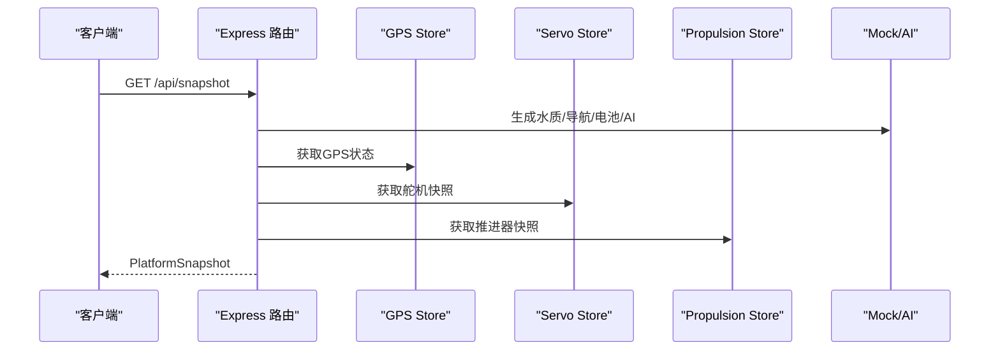
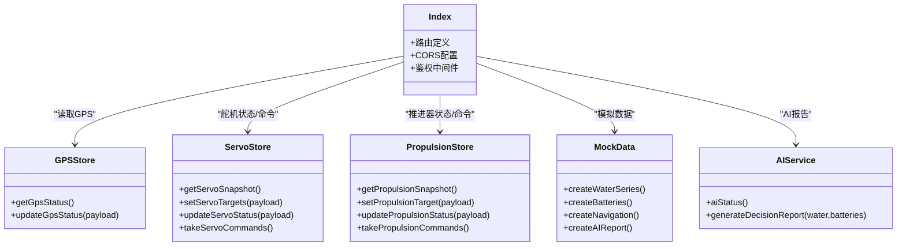

# 平台数据API

<cite>
**本文引用的文件**
- [index.ts](file://fishery-digital-twin-platform/apps/backend/src/index.ts)
- [mock-data.ts](file://fishery-digital-twin-platform/apps/backend/src/mock-data.ts)
- [gps-store.ts](file://fishery-digital-twin-platform/apps/backend/src/gps-store.ts)
- [propulsion-store.ts](file://fishery-digital-twin-platform/apps/backend/src/propulsion-store.ts)
- [servo-store.ts](file://fishery-digital-twin-platform/apps/backend/src/servo-store.ts)
- [ai-service.ts](file://fishery-digital-twin-platform/apps/backend/src/ai-service.ts)
- [shared index.ts](file://fishery-digital-twin-platform/packages/shared/src/index.ts)
- [platform-state.json](file://fishery-digital-twin-platform/apps/backend/data/platform-state.json)
</cite>

## 目录
1. [简介](#简介)
2. [项目结构](#项目结构)
3. [核心组件](#核心组件)
4. [架构总览](#架构总览)
5. [详细接口说明](#详细接口说明)
6. [依赖关系分析](#依赖关系分析)
7. [性能与实时性](#性能与实时性)
8. [故障排查指南](#故障排查指南)
9. [结论](#结论)
10. [附录：数据模式与状态说明](#附录数据模式与状态说明)

## 简介
本文件为“智慧渔业数字孪生平台”后端数据API的完整技术文档。内容覆盖健康检查、平台快照、水质数据、电池状态、导航信息、GPS数据、船舶状态、舵机与推进器控制、AI报告、日志等端点，并详细说明HTTP方法、URL模式、请求参数、响应结构、错误码、CORS配置、跨域访问设置、数据实时性与更新频率，以及dataMode（live、demo、fallback、mixed）的含义与区别。

## 项目结构
后端基于Express构建，集中路由在入口文件中定义；设备状态与命令通过独立store模块管理；共享类型定义位于packages/shared；演示与模拟数据由mock模块生成；AI报告可由本地基线或外部大模型生成。

```mermaid
graph TB
Client["客户端"] --> API["Express 路由<br/>index.ts"]
API --> Health["/api/health"]
API --> Snapshot["/api/snapshot"]
API --> Water["/api/water"]
API --> Batteries["/api/batteries"]
API --> Navigation["/api/navigation"]
API --> GPS["/api/gps"]
API --> Vessel["/api/vessel"]
API --> AIStatus["/api/ai/status"]
API --> AIGetReport["/api/ai/report"]
API --> AISetReport["/api/ai/report (POST)"]
API --> ServosGet["/api/servos"]
API --> ServosSet["/api/servos (POST)"]
API --> ServosStatus["/api/servos/status (POST)"]
API --> PropulsionGet["/api/propulsion"]
API --> PropulsionSet["/api/propulsion (POST)"]
API --> PropulsionStatus["/api/propulsion/status (POST)"]
API --> DataPost["/api/data (POST)"]
API --> DemoSimulate["/api/demo/simulate (POST)"]
API --> Logs["/api/logs"]
API --> TwinSimulate["/api/twin/simulate (POST)"]
API --> GPSStore["gps-store.ts"]
API --> ServoStore["servo-store.ts"]
API --> PropulsionStore["propulsion-store.ts"]
API --> MockData["mock-data.ts"]
API --> AIService["ai-service.ts"]
```

图表来源
- [index.ts:101-110](file://fishery-digital-twin-platform/apps/backend/src/index.ts#L101-L110)
- [index.ts:322-557](file://fishery-digital-twin-platform/apps/backend/src/index.ts#L322-L557)
- [gps-store.ts:55-103](file://fishery-digital-twin-platform/apps/backend/src/gps-store.ts#L55-L103)
- [servo-store.ts:89-184](file://fishery-digital-twin-platform/apps/backend/src/servo-store.ts#L89-L184)
- [propulsion-store.ts:149-319](file://fishery-digital-twin-platform/apps/backend/src/propulsion-store.ts#L149-L319)
- [mock-data.ts:114-258](file://fishery-digital-twin-platform/apps/backend/src/mock-data.ts#L114-L258)
- [ai-service.ts:160-233](file://fishery-digital-twin-platform/apps/backend/src/ai-service.ts#L160-L233)

章节来源
- [index.ts:46-110](file://fishery-digital-twin-platform/apps/backend/src/index.ts#L46-L110)
- [shared index.ts:1-106](file://fishery-digital-twin-platform/packages/shared/src/index.ts#L1-L106)

## 核心组件
- Express应用与中间件：启用CORS、JSON解析、全局错误处理、令牌鉴权中间件。
- 数据源与状态：
  - 水质历史waterHistory与电池batteries内存存储，支持持久化。
  - GPS状态gps-store，维护串口在线、定位有效性、时间戳新鲜度。
  - 舵机servo-store，维护多设备目标角度与实际角度、命令队列。
  - 推进器propulsion-store，维护设备目标功率、模式、命令队列与在线判断。
- 模拟与AI：
  - mock-data.ts提供水质序列、导航、电池、AI报告的模拟数据。
  - ai-service.ts提供本地基线AI报告，可选调用外部大模型生成增强报告。

章节来源
- [index.ts:78-114](file://fishery-digital-twin-platform/apps/backend/src/index.ts#L78-L114)
- [gps-store.ts:1-103](file://fishery-digital-twin-platform/apps/backend/src/gps-store.ts#L1-L103)
- [servo-store.ts:1-184](file://fishery-digital-twin-platform/apps/backend/src/servo-store.ts#L1-L184)
- [propulsion-store.ts:1-319](file://fishery-digital-twin-platform/apps/backend/src/propulsion-store.ts#L1-L319)
- [mock-data.ts:114-258](file://fishery-digital-twin-platform/apps/backend/src/mock-data.ts#L114-L258)
- [ai-service.ts:160-233](file://fishery-digital-twin-platform/apps/backend/src/ai-service.ts#L160-L233)

## 架构总览
后端以单一进程暴露REST API，同时启动UDP发现服务用于局域网设备发现。所有写操作均受令牌鉴权保护（当配置了令牌时）。数据在内存中维护，定时持久化到磁盘。

图表来源
- [index.ts:247-262](file://fishery-digital-twin-platform/apps/backend/src/index.ts#L247-L262)
- [index.ts:336-346](file://fishery-digital-twin-platform/apps/backend/src/index.ts#L336-L346)
- [gps-store.ts:55-57](file://fishery-digital-twin-platform/apps/backend/src/gps-store.ts#L55-L57)
- [servo-store.ts:89-104](file://fishery-digital-twin-platform/apps/backend/src/servo-store.ts#L89-L104)
- [propulsion-store.ts:149-164](file://fishery-digital-twin-platform/apps/backend/src/propulsion-store.ts#L149-L164)
- [mock-data.ts:151-190](file://fishery-digital-twin-platform/apps/backend/src/mock-data.ts#L151-L190)

## 详细接口说明

### 通用约定
- 基础路径：/api
- 认证：部分写接口需要头部X-UISYS-Token（当环境变量配置了令牌时），否则返回401；未配置令牌时LAN控制请求将返回503。
- CORS：默认允许localhost:3000与127.0.0.1:3000；可通过环境变量CORS_ORIGIN配置逗号分隔的白名单。
- 错误格式：统一返回{ error: string }或具体业务字段。

章节来源
- [index.ts:68-76](file://fishery-digital-twin-platform/apps/backend/src/index.ts#L68-L76)
- [index.ts:143-157](file://fishery-digital-twin-platform/apps/backend/src/index.ts#L143-L157)
- [index.ts:559-561](file://fishery-digital-twin-platform/apps/backend/src/index.ts#L559-L561)

### 健康检查
- 方法：GET
- URL：/api/health
- 描述：返回服务状态、数据模式、AI/GPS/舵机/推进器概览。
- 响应字段：status、service、time、dataMode、persistence、ai、gps、servos、propulsion。
- 错误码：无业务错误；CORS失败返回403。

章节来源
- [index.ts:322-334](file://fishery-digital-twin-platform/apps/backend/src/index.ts#L322-L334)

### 平台快照
- 方法：GET
- URL：/api/snapshot
- 描述：返回当前平台综合快照，包含数据模式、水质历史、电池、导航、AI报告、船舶状态。
- 响应结构：PlatformSnapshot（见附录数据模型）。
- 实时性：每次请求即时计算；若开启演示水样注入，会追加最近演示样本。

章节来源
- [index.ts:247-262](file://fishery-digital-twin-platform/apps/backend/src/index.ts#L247-L262)
- [index.ts:336-336](file://fishery-digital-twin-platform/apps/backend/src/index.ts#L336-L336)

### 水质数据
- 方法：GET
- URL：/api/water
- 描述：返回水质历史数组（最多保留最近N条）。
- 响应结构：WaterData[]。
- 实时性：每次请求可能追加演示水样；真实传感器数据通过POST /api/data写入。

章节来源
- [index.ts:338-341](file://fishery-digital-twin-platform/apps/backend/src/index.ts#L338-L341)
- [mock-data.ts:114-140](file://fishery-digital-twin-platform/apps/backend/src/mock-data.ts#L114-L140)

### 电池状态
- 方法：GET
- URL：/api/batteries
- 描述：返回电池数组（A/B/C三组）。
- 响应结构：BatteryData[]。
- 实时性：接收传感器数据时可更新电量与电压。

章节来源
- [index.ts:343-343](file://fishery-digital-twin-platform/apps/backend/src/index.ts#L343-L343)
- [mock-data.ts:142-149](file://fishery-digital-twin-platform/apps/backend/src/mock-data.ts#L142-L149)

### 导航信息
- 方法：GET
- URL：/api/navigation
- 描述：返回当前导航位置、航线、目标航点、速度、航向、剩余距离、ETA；若GPS有效则使用GPS数据，否则回退到模拟。
- 响应结构：NavigationData（含可选source与gps）。
- 实时性：每次请求即时计算。

章节来源
- [index.ts:197-222](file://fishery-digital-twin-platform/apps/backend/src/index.ts#L197-L222)
- [index.ts:344-344](file://fishery-digital-twin-platform/apps/backend/src/index.ts#L344-L344)
- [mock-data.ts:151-176](file://fishery-digital-twin-platform/apps/backend/src/mock-data.ts#L151-L176)

### GPS数据
- 读取：
  - 方法：GET
  - URL：/api/gps
  - 描述：返回GPS状态（设备ID、坐标系、串口在线、定位有效、经纬度、卫星数、HDOP、海拔、速度、航向、字符计数、最后可见时间、最后定位时间、整体在线）。
  - 响应结构：GpsStatus。
- 写入：
  - 方法：POST
  - URL：/api/gps/status
  - 鉴权：需要X-UISYS-Token（若配置）。
  - 描述：上报GPS状态，支持坐标校验与有效性判定。
  - 请求体字段：device_id、coordinate_system（必须WGS84）、serial_online、valid、lat、lng、satellites、hdop、altitude_m、speed_mps、heading_deg、chars_processed。
  - 响应：包含gps对象、becameOnline、fixAcquired布尔标志。
  - 错误：坐标无效或坐标系非WGS84返回400。

章节来源
- [index.ts:345-365](file://fishery-digital-twin-platform/apps/backend/src/index.ts#L345-L365)
- [gps-store.ts:55-103](file://fishery-digital-twin-platform/apps/backend/src/gps-store.ts#L55-L103)

### 船舶状态
- 方法：GET
- URL：/api/vessel
- 描述：返回船舶名称、在线、任务、AI就绪、Pixhawk/ESP32/通信/传感器状态、鱼舱百分比。
- 响应结构：VesselStatus。
- 实时性：根据GPS、舵机、推进器、传感器最新时间判断设备在线。

章节来源
- [index.ts:228-245](file://fishery-digital-twin-platform/apps/backend/src/index.ts#L228-L245)
- [index.ts:346-346](file://fishery-digital-twin-platform/apps/backend/src/index.ts#L346-L346)

### 传感器数据上报
- 方法：POST
- URL：/api/data
- 鉴权：需要X-UISYS-Token（若配置）。
- 描述：上报水质与电池数据；服务端自动计算水质状态并追加到历史，同时更新电池电量与电压。
- 请求体字段（至少提供一个数值字段）：
  - waterTemperature/water_temperature（-5~50）
  - turbidity（0~1000）
  - ph/pH（0~14）
  - dissolvedOxygen/dissolved_oxygen/do（0~30）
  - ammoniaNitrogen/ammonia_nitrogen/nh3（0~100）
  - conductivity/ec（0~200000）
  - batteryPercent/battery_percent（0~100）
- 响应：201 { message, packet, snapshot }；400 参数非法。

章节来源
- [index.ts:367-430](file://fishery-digital-twin-platform/apps/backend/src/index.ts#L367-L430)

### 演示数据生成
- 方法：POST
- URL：/api/demo/simulate
- 鉴权：需要X-UISYS-Token（若配置）。
- 描述：生成一组独立的演示水质与快照，不修改实时历史。
- 请求体：count（24~240，默认96）。
- 响应：201 { count, water, snapshot, log }。

章节来源
- [index.ts:432-441](file://fishery-digital-twin-platform/apps/backend/src/index.ts#L432-L441)
- [mock-data.ts:114-140](file://fishery-digital-twin-platform/apps/backend/src/mock-data.ts#L114-L140)

### AI报告
- 查询状态：
  - 方法：GET
  - URL：/api/ai/status
  - 描述：返回AI能力配置与模型信息。
- 获取报告：
  - 方法：GET
  - URL：/api/ai/report
  - 描述：返回最新AI报告；若无则返回404。
- 生成报告：
  - 方法：POST
  - URL：/api/ai/report
  - 鉴权：需要X-UISYS-Token（若配置）。
  - 限流：每分钟最多一次，否则返回429。
  - 描述：基于水质与电池数据生成AI报告；若配置外部大模型则尝试调用，失败回退本地基线。
  - 响应：201 { report, log }；503 生成失败。

章节来源
- [index.ts:447-473](file://fishery-digital-twin-platform/apps/backend/src/index.ts#L447-L473)
- [ai-service.ts:160-233](file://fishery-digital-twin-platform/apps/backend/src/ai-service.ts#L160-L233)

### 舵机控制
- 查询：
  - 方法：GET
  - URL：/api/servos
  - 描述：返回舵机设备列表与在线情况；可传device_id查询单设备。
- 设置目标：
  - 方法：POST
  - URL：/api/servos
  - 鉴权：需要X-UISYS-Token（若配置）。
  - 描述：设置舵机目标角度（四通道）或单通道角度；设备离线时拒绝入队。
  - 请求体：angles[4]（0~180）或channel(1~4)+angle(0~180)。
  - 响应：201 { command, device, servos }；400 参数非法。
- 上报状态：
  - 方法：POST
  - URL：/api/servos/status
  - 鉴权：需要X-UISYS-Token（若配置）。
  - 描述：上报实际角度与设备在线心跳。
  - 响应：201 { device, servos }；400 参数非法。
- 取命令：
  - 方法：GET
  - URL：/api/device/commands
  - 鉴权：需要X-UISYS-Token（若配置）。
  - 描述：拉取待执行的舵机命令（带TTL过滤）。

章节来源
- [index.ts:475-503](file://fishery-digital-twin-platform/apps/backend/src/index.ts#L475-L503)
- [servo-store.ts:89-184](file://fishery-digital-twin-platform/apps/backend/src/servo-store.ts#L89-L184)

### 推进器控制
- 查询：
  - 方法：GET
  - URL：/api/propulsion
  - 描述：返回推进器设备列表与在线情况；可传device_id查询单设备。
- 设置目标：
  - 方法：POST
  - URL：/api/propulsion
  - 鉴权：需要X-UISYS-Token（若配置）。
  - 描述：设置推进器模式、油门、转向或直接左右通道功率；设备离线时拒绝入队。
  - 请求体：mode、enabled、emergency_stop、throttle、steering、left_power、right_power、max_power等。
  - 响应：201 { command, device, propulsion }；400 参数非法。
- 上报状态：
  - 方法：POST
  - URL：/api/propulsion/status
  - 鉴权：需要X-UISYS-Token（若配置）。
  - 描述：上报设备运行状态、冷却、循环阶段等。
  - 响应：201 { device, propulsion }；400 参数非法。
- 取命令：
  - 方法：GET
  - URL：/api/propulsion/commands
  - 鉴权：需要X-UISYS-Token（若配置）。
  - 描述：拉取待执行的推进器命令（带TTL过滤）。

章节来源
- [index.ts:505-538](file://fishery-digital-twin-platform/apps/backend/src/index.ts#L505-L538)
- [propulsion-store.ts:149-319](file://fishery-digital-twin-platform/apps/backend/src/propulsion-store.ts#L149-L319)

### 数字孪生推演
- 方法：POST
- URL：/api/twin/simulate
- 鉴权：需要X-UISYS-Token（若配置）。
- 描述：基于当前快照与设备状态进行数字孪生仿真，输出航线预测、故障预测、疲劳预测。
- 响应：201 { id, generatedAt, modelVersion, confidence, input, route, fault, fatigue, sources, assumptions }；400 仿真失败。

章节来源
- [index.ts:540-555](file://fishery-digital-twin-platform/apps/backend/src/index.ts#L540-L555)

### 日志
- 方法：GET
- URL：/api/logs
- 描述：返回系统日志列表（最近80条）。

章节来源
- [index.ts:557-557](file://fishery-digital-twin-platform/apps/backend/src/index.ts#L557-L557)

## 依赖关系分析
- 路由层依赖：
  - gps-store：GPS状态读写与在线判断。
  - servo-store：舵机设备状态、命令队列与TTL。
  - propulsion-store：推进器设备状态、命令队列与TTL。
  - mock-data：水质序列、导航、电池、AI报告模拟。
  - ai-service：AI报告生成（本地基线与可选外部模型）。
- 共享类型：
  - packages/shared/src/index.ts定义了所有数据结构，确保前后端一致。

图表来源
- [index.ts:21-44](file://fishery-digital-twin-platform/apps/backend/src/index.ts#L21-L44)
- [gps-store.ts:55-103](file://fishery-digital-twin-platform/apps/backend/src/gps-store.ts#L55-L103)
- [servo-store.ts:89-184](file://fishery-digital-twin-platform/apps/backend/src/servo-store.ts#L89-L184)
- [propulsion-store.ts:149-319](file://fishery-digital-twin-platform/apps/backend/src/propulsion-store.ts#L149-L319)
- [mock-data.ts:114-258](file://fishery-digital-twin-platform/apps/backend/src/mock-data.ts#L114-L258)
- [ai-service.ts:160-233](file://fishery-digital-twin-platform/apps/backend/src/ai-service.ts#L160-L233)

章节来源
- [shared index.ts:1-288](file://fishery-digital-twin-platform/packages/shared/src/index.ts#L1-L288)

## 性能与实时性
- 数据更新频率：
  - 水质演示注入：由环境变量UISYS_DEMO_WATER_INTERVAL_MS控制，默认约4秒，最小2秒。
  - 传感器新鲜度：由UISYS_SENSOR_FRESHNESS_MS控制，默认30秒，用于判断传感器是否“在线”。
  - 舵机/推进器命令TTL：2.5秒，超时命令将被丢弃。
  - GPS在线判断：last_seen超过10秒视为不在线。
- 历史长度：水质历史最多保留180条。
- 持久化：平台状态（水质历史、电池、AI报告、日志）定时持久化到data/platform-state.json。
- CORS：默认允许localhost:3000与127.0.0.1:3000；可通过CORS_ORIGIN配置多个来源。

章节来源
- [index.ts:64-76](file://fishery-digital-twin-platform/apps/backend/src/index.ts#L64-L76)
- [index.ts:178-187](file://fishery-digital-twin-platform/apps/backend/src/index.ts#L178-L187)
- [index.ts:228-245](file://fishery-digital-twin-platform/apps/backend/src/index.ts#L228-L245)
- [servo-store.ts:175-184](file://fishery-digital-twin-platform/apps/backend/src/servo-store.ts#L175-L184)
- [propulsion-store.ts:310-319](file://fishery-digital-twin-platform/apps/backend/src/propulsion-store.ts#L310-L319)
- [gps-store.ts:40-53](file://fishery-digital-twin-platform/apps/backend/src/gps-store.ts#L40-L53)

## 故障排查指南
- 401 未授权：
  - 现象：调用受控接口返回401。
  - 原因：缺少X-UISYS-Token或令牌不匹配。
  - 处理：确保环境变量已配置UISYS_API_TOKEN并在请求头携带相同值。
- 503 服务不可用：
  - 现象：LAN控制请求被拒绝。
  - 原因：未配置UISYS_API_TOKEN。
  - 处理：配置令牌后重试。
- 400 参数非法：
  - 现象：GPS、舵机、推进器、数据上报等接口返回400。
  - 原因：字段类型或范围不符合要求。
  - 处理：核对请求体字段与取值范围。
- 403 跨域拒绝：
  - 现象：浏览器控制台报CORS错误。
  - 原因：请求来源不在允许列表中。
  - 处理：配置CORS_ORIGIN或在开发环境使用默认允许来源。
- 429 频率限制：
  - 现象：AI报告生成频繁调用被限流。
  - 原因：一分钟内多次生成。
  - 处理：降低调用频率。
- 410 接口移除：
  - 现象：/api/simulate返回410。
  - 原因：该接口已移除，请使用/api/demo/simulate。

章节来源
- [index.ts:143-157](file://fishery-digital-twin-platform/apps/backend/src/index.ts#L143-L157)
- [index.ts:348-365](file://fishery-digital-twin-platform/apps/backend/src/index.ts#L348-L365)
- [index.ts:367-430](file://fishery-digital-twin-platform/apps/backend/src/index.ts#L367-L430)
- [index.ts:432-445](file://fishery-digital-twin-platform/apps/backend/src/index.ts#L432-L445)
- [index.ts:456-473](file://fishery-digital-twin-platform/apps/backend/src/index.ts#L456-L473)
- [index.ts:559-561](file://fishery-digital-twin-platform/apps/backend/src/index.ts#L559-L561)

## 结论
该平台数据API提供了完整的设备与数据观测能力，涵盖健康检查、快照、水质、电池、导航、GPS、船舶状态、舵机与推进器控制、AI报告与日志等。通过统一的鉴权与CORS机制保障安全与跨域访问，结合演示数据与真实传感器数据，满足开发与演示需求。建议在生产环境中配置令牌与CORS白名单，并根据业务需求调整演示注入频率与传感器新鲜度阈值。

## 附录：数据模式与状态说明

### dataMode含义
- live：仅包含真实传感器来源的数据。
- demo：仅包含演示来源的数据。
- fallback：仅包含回退来源的数据（例如无数据时的默认值）。
- mixed：同时包含真实与演示/回退等多来源数据。

判断逻辑：根据水质历史中各点的source集合决定。

章节来源
- [index.ts:189-195](file://fishery-digital-twin-platform/apps/backend/src/index.ts#L189-L195)
- [shared index.ts:1-5](file://fishery-digital-twin-platform/packages/shared/src/index.ts#L1-L5)

### 水质状态WaterStatus
- normal：正常。
- attention：需关注（如浊度偏高、pH偏离参考范围等）。
- polluted：污染风险升高。
- algae-risk：藻华风险关注。

章节来源
- [shared index.ts:1-1](file://fishery-digital-twin-platform/packages/shared/src/index.ts#L1-L1)
- [mock-data.ts:27-32](file://fishery-digital-twin-platform/apps/backend/src/mock-data.ts#L27-L32)

### 设备状态DeviceStatus
- online：在线。
- warning：警告（如低电量）。
- offline：离线。

章节来源
- [shared index.ts:2-2](file://fishery-digital-twin-platform/packages/shared/src/index.ts#L2-L2)

### 关键数据模型
- WaterData：时间戳、来源、水温、浊度、pH、溶解氧、氨氮、电导率、状态。
- BatteryData：电池ID、电量百分比、电压、状态、来源、更新时间。
- NavigationData：当前位置、航线、目标航点、速度、航向、剩余距离、ETA、数据来源与GPS。
- GpsStatus：设备ID、坐标系、串口在线、定位有效、经纬度、卫星数、HDOP、海拔、速度、航向、字符计数、最后可见时间、最后定位时间、整体在线。
- PlatformSnapshot：生成时间、数据模式、水质历史、电池、导航、AI报告、船舶状态。
- VesselStatus：船名、在线、任务、AI就绪、Pixhawk/ESP32/通信/传感器状态、鱼舱百分比。

章节来源
- [shared index.ts:7-106](file://fishery-digital-twin-platform/packages/shared/src/index.ts#L7-L106)

### 请求响应示例（成功与失败）
以下为典型场景的结构化示例（字段名与类型依据共享类型定义）：

- GET /api/health
  - 成功：{ status: "ok", service: "...", time: "...", dataMode: "...", persistence: "enabled", ai: {...}, gps: {...}, servos: {...}, propulsion: {...} }
  - 失败：CORS错误返回403 { error: "Origin ... is not allowed by CORS" }

- GET /api/snapshot
  - 成功：{ generatedAt: "...", dataMode: "...", water: [...], batteries: [...], navigation: {...}, aiReport: {...}, vessel: {...} }

- POST /api/data（需令牌）
  - 成功：{ message: "ok", packet: {...}, snapshot: {...} }
  - 失败：400 { error: "provide at least one supported numeric field" }

- POST /api/gps/status（需令牌）
  - 成功：{ gps: {...}, becameOnline: true/false, fixAcquired: true/false }
  - 失败：400 { error: "coordinate_system must be WGS84" }

- GET /api/ai/report
  - 成功：{ id: "...", generatedAt: "...", status: "...", riskLevel: "...", title: "...", summary: "...", findings: [...], recommendations: [...], dataQuality: "...", confidence: number, sampleCount: number, model: "...", forecast: {...} }
  - 失败：404 { message: "No AI report yet" }

- POST /api/ai/report（需令牌）
  - 成功：{ report: {...}, log: {...} }
  - 失败：429 { error: "AI report generation is limited to once per minute" }

- GET /api/servos
  - 成功：{ devices: [...], device_count: number, online_count: number, online: boolean }

- POST /api/servos（需令牌）
  - 成功：{ command: {...}, device: {...}, servos: {...} }
  - 失败：400 { error: "angles must contain four numbers from 0 to 180" }

- GET /api/propulsion
  - 成功：{ devices: [...], device_count: number, online_count: number, online: boolean }

- POST /api/propulsion（需令牌）
  - 成功：{ command: {...}, device: {...}, propulsion: {...} }
  - 失败：400 { error: "propulsion device ... is offline; active command was not queued" }

- GET /api/logs
  - 成功：[ { id: "...", level: "...", title: "...", detail: "...", source: "...", timestamp: "..." }, ... ]

章节来源
- [index.ts:322-557](file://fishery-digital-twin-platform/apps/backend/src/index.ts#L322-L557)
- [shared index.ts:7-288](file://fishery-digital-twin-platform/packages/shared/src/index.ts#L7-L288)