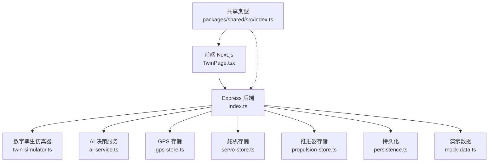
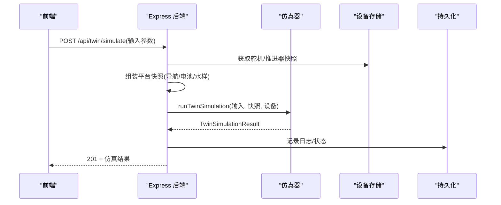
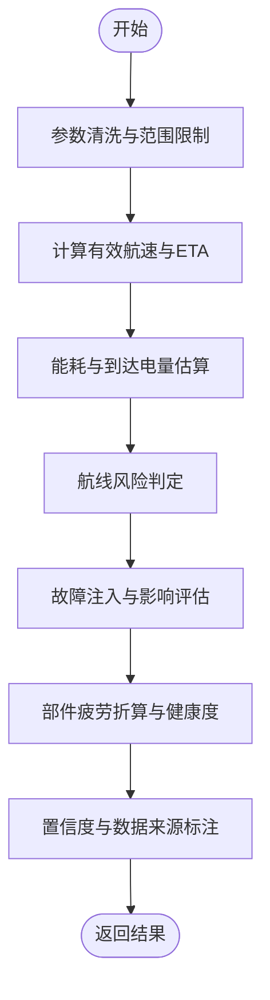
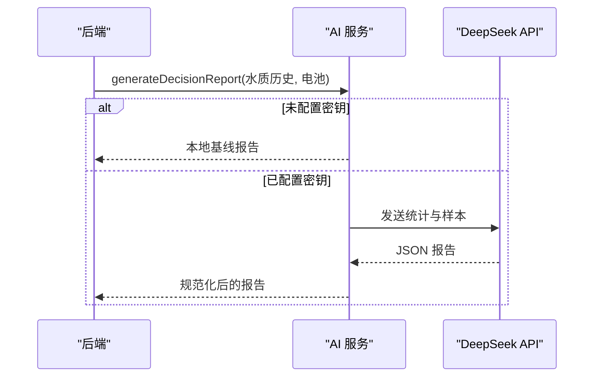
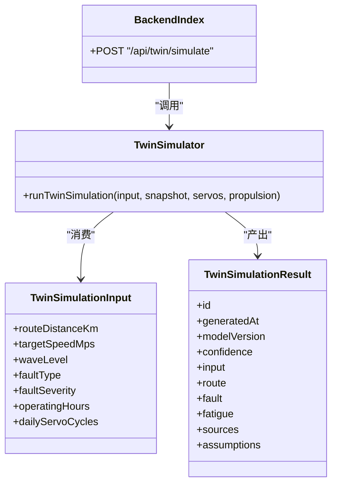

# 数字孪生API

<cite>
**本文引用的文件**
- [index.ts](file://fishery-digital-twin-platform/apps/backend/src/index.ts)
- [twin-simulator.ts](file://fishery-digital-twin-platform/apps/backend/src/twin-simulator.ts)
- [ai-service.ts](file://fishery-digital-twin-platform/apps/backend/src/ai-service.ts)
- [persistence.ts](file://fishery-digital-twin-platform/apps/backend/src/persistence.ts)
- [mock-data.ts](file://fishery-digital-twin-platform/apps/backend/src/mock-data.ts)
- [gps-store.ts](file://fishery-digital-twin-platform/apps/backend/src/gps-store.ts)
- [propulsion-store.ts](file://fishery-digital-twin-platform/apps/backend/src/propulsion-store.ts)
- [servo-store.ts](file://fishery-digital-twin-platform/apps/backend/src/servo-store.ts)
- [index.ts（共享类型）](file://fishery-digital-twin-platform/packages/shared/src/index.ts)
- [api.ts（前端调用）](file://fishery-digital-twin-platform/apps/frontend/src/lib/api.ts)
- [TwinPage.tsx（仿真页面）](file://fishery-digital-twin-platform/apps/frontend/src/components/dashboard/TwinPage.tsx)
- [README.md](file://fishery-digital-twin-platform/README.md)
</cite>

## 目录
1. [简介](#简介)
2. [项目结构](#项目结构)
3. [核心组件](#核心组件)
4. [架构总览](#架构总览)
5. [详细组件分析](#详细组件分析)
6. [依赖关系分析](#依赖关系分析)
7. [性能与资源管理](#性能与资源管理)
8. [故障排查指南](#故障排查指南)
9. [结论](#结论)
10. [附录：API 参考](#附录api-参考)

## 简介
本文件面向“智慧渔业巡检船数字孪生平台”的后端 API，重点说明数字孪生仿真推演、故障模拟与预测分析的接口能力。文档覆盖：
- 仿真输入参数配置：航线规划、环境条件、设备状态
- 仿真结果格式：路线距离、故障类型、健康度评估与建议措施
- 模型算法原理与计算过程
- 仿真场景配置与扩展方法
- 结果可视化集成指南
- 性能调优与资源管理最佳实践

## 项目结构
后端基于 Express 提供 HTTP 接口，核心模块包括：
- 路由与服务入口：统一鉴权、CORS、日志、持久化、设备状态聚合
- 数字孪生仿真器：航线预演、故障推演、疲劳损耗估算
- AI 决策服务：本地基线报告与可选 DeepSeek 云端增强
- 设备存储：GPS、舵机、推进器状态与命令队列
- 数据持久化：平台状态落盘
- 共享类型：前后端一致的 TypeScript 类型定义

图表来源
- [index.ts:56-110](file://fishery-digital-twin-platform/apps/backend/src/index.ts#L56-L110)
- [twin-simulator.ts:74-253](file://fishery-digital-twin-platform/apps/backend/src/twin-simulator.ts#L74-L253)
- [ai-service.ts:167-232](file://fishery-digital-twin-platform/apps/backend/src/ai-service.ts#L167-L232)
- [gps-store.ts:55-103](file://fishery-digital-twin-platform/apps/backend/src/gps-store.ts#L55-L103)
- [servo-store.ts:89-184](file://fishery-digital-twin-platform/apps/backend/src/servo-store.ts#L89-L184)
- [propulsion-store.ts:149-319](file://fishery-digital-twin-platform/apps/backend/src/propulsion-store.ts#L149-L319)
- [persistence.ts:12-68](file://fishery-digital-twin-platform/apps/backend/src/persistence.ts#L12-L68)
- [index.ts（共享类型）:209-287](file://fishery-digital-twin-platform/packages/shared/src/index.ts#L209-L287)

章节来源
- [index.ts:56-110](file://fishery-digital-twin-platform/apps/backend/src/index.ts#L56-L110)
- [README.md:16-76](file://fishery-digital-twin-platform/README.md#L16-L76)

## 核心组件
- 数字孪生仿真器：根据当前平台快照与输入参数，输出航线预演、故障推演、疲劳损耗与健康度评估。
- AI 决策服务：基于水质历史与电池状态生成报告，支持本地基线与 DeepSeek 云端增强。
- 设备存储：维护 GPS、舵机、推进器的在线状态、目标与实际反馈、命令队列。
- 持久化：将水质历史、电池、AI 报告、系统日志周期性落盘，保障重启恢复。
- 共享类型：统一定义 TwinSimulationInput、TwinSimulationResult 等关键数据结构。

章节来源
- [twin-simulator.ts:74-253](file://fishery-digital-twin-platform/apps/backend/src/twin-simulator.ts#L74-L253)
- [ai-service.ts:167-232](file://fishery-digital-twin-platform/apps/backend/src/ai-service.ts#L167-L232)
- [persistence.ts:12-68](file://fishery-digital-twin-platform/apps/backend/src/persistence.ts#L12-L68)
- [index.ts（共享类型）:209-287](file://fishery-digital-twin-platform/packages/shared/src/index.ts#L209-L287)

## 架构总览
数字孪生 API 通过单一入口暴露 REST 接口，前端调用 /api/twin/simulate 触发仿真；后端读取实时快照（导航、电池、设备反馈），结合输入参数运行仿真器，返回结构化结果并记录日志。AI 报告可独立生成，用于环境监测与趋势判断。

图表来源
- [index.ts:540-555](file://fishery-digital-twin-platform/apps/backend/src/index.ts#L540-L555)
- [twin-simulator.ts:74-253](file://fishery-digital-twin-platform/apps/backend/src/twin-simulator.ts#L74-L253)
- [servo-store.ts:89-184](file://fishery-digital-twin-platform/apps/backend/src/servo-store.ts#L89-L184)
- [propulsion-store.ts:149-319](file://fishery-digital-twin-platform/apps/backend/src/propulsion-store.ts#L149-L319)
- [persistence.ts:51-68](file://fishery-digital-twin-platform/apps/backend/src/persistence.ts#L51-L68)

## 详细组件分析

### 数字孪生仿真器（航线预演、故障推演、疲劳损耗）
- 输入参数校验与归一化：航程、目标航速、海况等级、故障类型与严重度、累计工时、舵机日动作次数。
- 航线预演：
  - 有效速度 = 目标航速 × 海况系数 × 执行机构反馈因子
  - ETA、能耗、到达电量、横向误差、完成概率、风险等级
  - 时间序列：分钟级航速与电量曲线
- 故障推演：
  - 三种故障：单舵机卡滞、推进电机降额、执行机构反馈丢失
  - 速度损失、航向漂移、检测时延、任务完成概率、建议措施
  - 时间序列：正常速度与故障后速度对比
- 疲劳损耗：
  - 推进、舵机、船体、电池四类部件的等效小时/循环折算
  - 综合健康度、最高风险部件、下次检查间隔
- 置信度与数据来源标注：是否使用实测反馈或假设值

图表来源
- [twin-simulator.ts:35-50](file://fishery-digital-twin-platform/apps/backend/src/twin-simulator.ts#L35-L50)
- [twin-simulator.ts:74-253](file://fishery-digital-twin-platform/apps/backend/src/twin-simulator.ts#L74-L253)

章节来源
- [twin-simulator.ts:35-50](file://fishery-digital-twin-platform/apps/backend/src/twin-simulator.ts#L35-L50)
- [twin-simulator.ts:74-253](file://fishery-digital-twin-platform/apps/backend/src/twin-simulator.ts#L74-L253)
- [index.ts（共享类型）:209-287](file://fishery-digital-twin-platform/packages/shared/src/index.ts#L209-L287)

### AI 决策服务（水质预测与辅助决策）
- 本地基线：统计水温、浊度、pH、溶解氧、氨氮、电导率与电池均值，生成风险等级、发现与建议。
- 云端增强：可选调用 DeepSeek，按指定 schema 输出 JSON，失败回退到本地基线。
- 限流：同一分钟内最多一次报告生成请求。

图表来源
- [ai-service.ts:167-232](file://fishery-digital-twin-platform/apps/backend/src/ai-service.ts#L167-L232)
- [index.ts:456-473](file://fishery-digital-twin-platform/apps/backend/src/index.ts#L456-L473)

章节来源
- [ai-service.ts:167-232](file://fishery-digital-twin-platform/apps/backend/src/ai-service.ts#L167-L232)
- [index.ts:456-473](file://fishery-digital-twin-platform/apps/backend/src/index.ts#L456-L473)

### 设备状态与命令（GPS、舵机、推进器）
- GPS：接收坐标、卫星数、HDOP、速度、航向，维护在线与有效性。
- 舵机：四通道角度控制，保留通道保护，角度范围校验，命令队列 TTL。
- 推进器：支持手动/网页/自动模式，左右功率直控或混合控制，急停与冷却周期。

章节来源
- [gps-store.ts:55-103](file://fishery-digital-twin-platform/apps/backend/src/gps-store.ts#L55-L103)
- [servo-store.ts:89-184](file://fishery-digital-twin-platform/apps/backend/src/servo-store.ts#L89-L184)
- [propulsion-store.ts:149-319](file://fishery-digital-twin-platform/apps/backend/src/propulsion-store.ts#L149-L319)

### 数据持久化与系统日志
- 平台状态（水质历史、电池、AI 报告、系统日志）异步落盘，避免频繁 IO。
- 系统日志记录仿真、传感器、AI 与控制事件，便于回溯。

章节来源
- [persistence.ts:12-68](file://fishery-digital-twin-platform/apps/backend/src/persistence.ts#L12-L68)
- [index.ts:116-129](file://fishery-digital-twin-platform/apps/backend/src/index.ts#L116-L129)

## 依赖关系分析
- 前端通过 api.ts 调用 /api/twin/simulate，传入 TwinSimulationInput，展示 TwinSimulationResult。
- 后端 index.ts 路由中调用 twin-simulator.runTwinSimulation，并组合设备快照。
- 共享类型确保前后端对输入输出结构一致。

图表来源
- [index.ts:540-555](file://fishery-digital-twin-platform/apps/backend/src/index.ts#L540-L555)
- [twin-simulator.ts:74-253](file://fishery-digital-twin-platform/apps/backend/src/twin-simulator.ts#L74-L253)
- [index.ts（共享类型）:209-287](file://fishery-digital-twin-platform/packages/shared/src/index.ts#L209-L287)
- [api.ts:95-100](file://fishery-digital-twin-platform/apps/frontend/src/lib/api.ts#L95-L100)

章节来源
- [api.ts:95-100](file://fishery-digital-twin-platform/apps/frontend/src/lib/api.ts#L95-L100)
- [index.ts:540-555](file://fishery-digital-twin-platform/apps/backend/src/index.ts#L540-L555)
- [twin-simulator.ts:74-253](file://fishery-digital-twin-platform/apps/backend/src/twin-simulator.ts#L74-L253)
- [index.ts（共享类型）:209-287](file://fishery-digital-twin-platform/packages/shared/src/index.ts#L209-L287)

## 性能与资源管理
- 输入参数边界限制：航程、航速、故障严重度、工时、动作次数均被钳制在合理范围，避免异常计算。
- 采样与历史长度：水质历史最大保留条数有限，防止内存膨胀。
- 持久化节流：状态写入采用延迟合并，降低磁盘 IO 频率。
- 网络与安全：CORS 白名单、令牌鉴权、UDP 自动发现端口固定，减少无效请求。
- 并发与超时：AI 报告生成限频，外部 API 调用设置超时，避免阻塞主线程。

章节来源
- [twin-simulator.ts:35-50](file://fishery-digital-twin-platform/apps/backend/src/twin-simulator.ts#L35-L50)
- [index.ts:64-68](file://fishery-digital-twin-platform/apps/backend/src/index.ts#L64-L68)
- [persistence.ts:51-68](file://fishery-digital-twin-platform/apps/backend/src/persistence.ts#L51-L68)
- [ai-service.ts:177-186](file://fishery-digital-twin-platform/apps/backend/src/ai-service.ts#L177-L186)

## 故障排查指南
- 仿真失败：检查输入参数是否在允许范围；确认设备在线状态；查看系统日志定位错误来源。
- AI 报告失败：确认是否配置 DeepSeek 密钥；若失败则回退到本地基线；检查网络与超时设置。
- 设备无响应：核对 GPS/舵机/推进器心跳时间戳；检查命令队列 TTL；确认局域网连通性与令牌。
- CORS 与令牌：非本机访问需携带 X-UISYS-Token；CORS 源需配置为允许的前端地址。

章节来源
- [index.ts:143-157](file://fishery-digital-twin-platform/apps/backend/src/index.ts#L143-L157)
- [index.ts:559-561](file://fishery-digital-twin-platform/apps/backend/src/index.ts#L559-L561)
- [ai-service.ts:220-232](file://fishery-digital-twin-platform/apps/backend/src/ai-service.ts#L220-L232)
- [servo-store.ts:106-153](file://fishery-digital-twin-platform/apps/backend/src/servo-store.ts#L106-L153)
- [propulsion-store.ts:166-231](file://fishery-digital-twin-platform/apps/backend/src/propulsion-store.ts#L166-L231)

## 结论
该数字孪生 API 提供了完整的航线预演、故障推演与疲劳损耗评估能力，结合设备实时反馈与历史数据，输出结构化结果与可视化所需的时间序列。通过严格的参数校验、安全鉴权与持久化机制，保证系统在开发与演示场景下的稳定性与可追溯性。AI 决策服务可在本地基线与云端增强之间灵活切换，满足不同部署需求。

## 附录：API 参考

### 数字孪生仿真接口
- 路径：POST /api/twin/simulate
- 鉴权：需要 X-UISYS-Token（非本机访问）
- 请求体：TwinSimulationInput
  - routeDistanceKm：航程（km），范围 0.2–20
  - targetSpeedMps：目标航速（m/s），范围 0.2–3
  - waveLevel：海况等级 calm/moderate/rough
  - faultType：故障类型 servo-stuck/motor-derate/feedback-loss
  - faultSeverity：故障严重度（%），范围 10–100
  - operatingHours：累计运行工时（h），范围 0–30000
  - dailyServoCycles：舵机日动作次数，范围 10–10000
- 响应体：TwinSimulationResult
  - id、generatedAt、modelVersion、confidence
  - input：原始输入
  - route：航线预测（distanceKm、etaMinutes、energyUsedPercent、arrivalBatteryPercent、maxCrossTrackErrorM、completionProbability、risk、series）
  - fault：故障预测（type、title、severity、risk、speedLossPercent、headingDriftDeg、completionProbability、detectionSeconds、recommendation、series）
  - fatigue：疲劳预测（overallHealth、nextInspectionHours、highestRiskComponent、components）
  - sources：数据来源标注（measured/snapshot/assumed）
  - assumptions：模型假设与限制

章节来源
- [index.ts:540-555](file://fishery-digital-twin-platform/apps/backend/src/index.ts#L540-L555)
- [index.ts（共享类型）:209-287](file://fishery-digital-twin-platform/packages/shared/src/index.ts#L209-L287)
- [twin-simulator.ts:74-253](file://fishery-digital-twin-platform/apps/backend/src/twin-simulator.ts#L74-L253)

### 其他相关接口（摘要）
- GET /api/snapshot：平台快照（水样、电池、导航、AI 报告、船舶状态）
- GET /api/water：水质历史
- POST /api/data：上报传感器数据（含水位、浊度、pH、溶解氧、氨氮、电导率、电池百分比）
- GET /api/navigation：导航信息（位置、航点、速度、航向、剩余距离、ETA）
- POST /api/gps/status：更新 GPS 状态
- GET /api/servos、POST /api/servos：舵机快照与控制
- GET /api/propulsion、POST /api/propulsion：推进器快照与控制
- GET /api/ai/status、GET /api/ai/report、POST /api/ai/report：AI 报告状态与生成
- GET /api/logs：系统日志

章节来源
- [index.ts:322-557](file://fishery-digital-twin-platform/apps/backend/src/index.ts#L322-L557)

### 仿真结果可视化集成指南
- 前端通过 TwinPage.tsx 调用 runTwinPrediction，渲染航线、故障与健康度图表。
- 推荐图表：
  - 航线预演：时间序列（分钟）显示预测航速与电量变化
  - 故障推演：对比正常与故障后速度曲线
  - 疲劳损耗：部件损伤进度条与风险标签
- 三维场景：BoatTwinScene 支持叠加仿真预测图层，注意标注“不代表实际设备位置”。

章节来源
- [api.ts:95-100](file://fishery-digital-twin-platform/apps/frontend/src/lib/api.ts#L95-L100)
- [TwinPage.tsx:67-78](file://fishery-digital-twin-platform/apps/frontend/src/components/dashboard/TwinPage.tsx#L67-L78)
- [TwinPage.tsx:586-768](file://fishery-digital-twin-platform/apps/frontend/src/components/dashboard/TwinPage.tsx#L586-L768)

### 仿真场景配置与自定义扩展
- 海况等级：calm/moderate/rough，影响速度、负载与横向误差
- 故障类型与严重度：支持注入不同故障并调节强度
- 设备反馈：接入真实舵机/推进器反馈可提高置信度
- 扩展点：
  - 新增故障类型：在仿真器中补充故障配置与影响公式
  - 调整载荷系数：依据实测电流/振动校准等效小时折算
  - 接入更多传感器：提升置信度与预测精度

章节来源
- [twin-simulator.ts:14-50](file://fishery-digital-twin-platform/apps/backend/src/twin-simulator.ts#L14-L50)
- [twin-simulator.ts:118-171](file://fishery-digital-twin-platform/apps/backend/src/twin-simulator.ts#L118-L171)
- [twin-simulator.ts:181-245](file://fishery-digital-twin-platform/apps/backend/src/twin-simulator.ts#L181-L245)