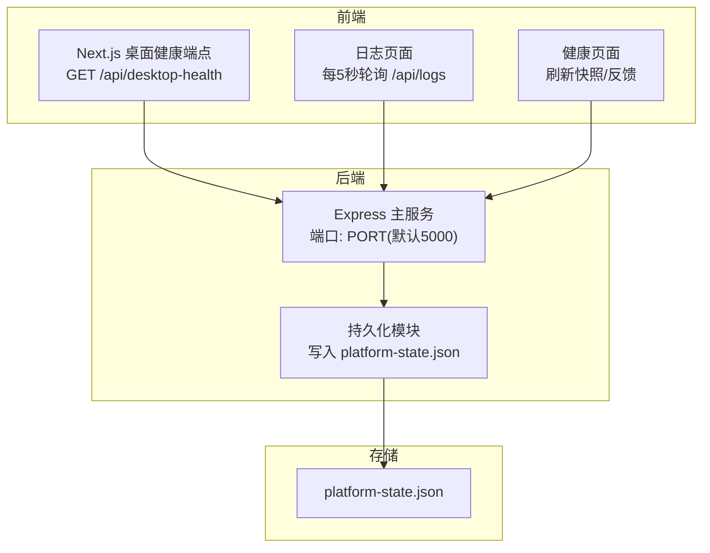
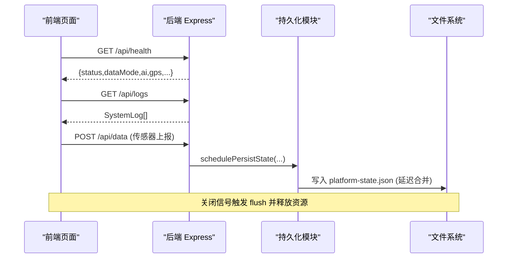
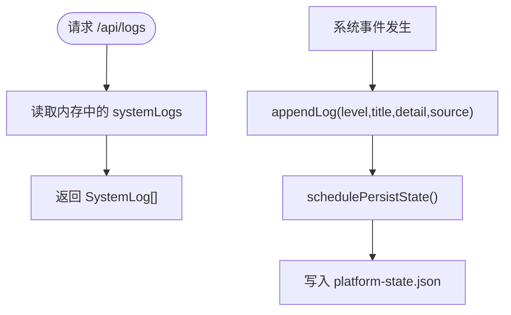
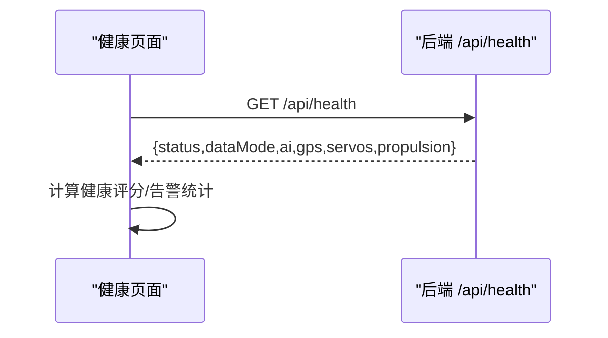
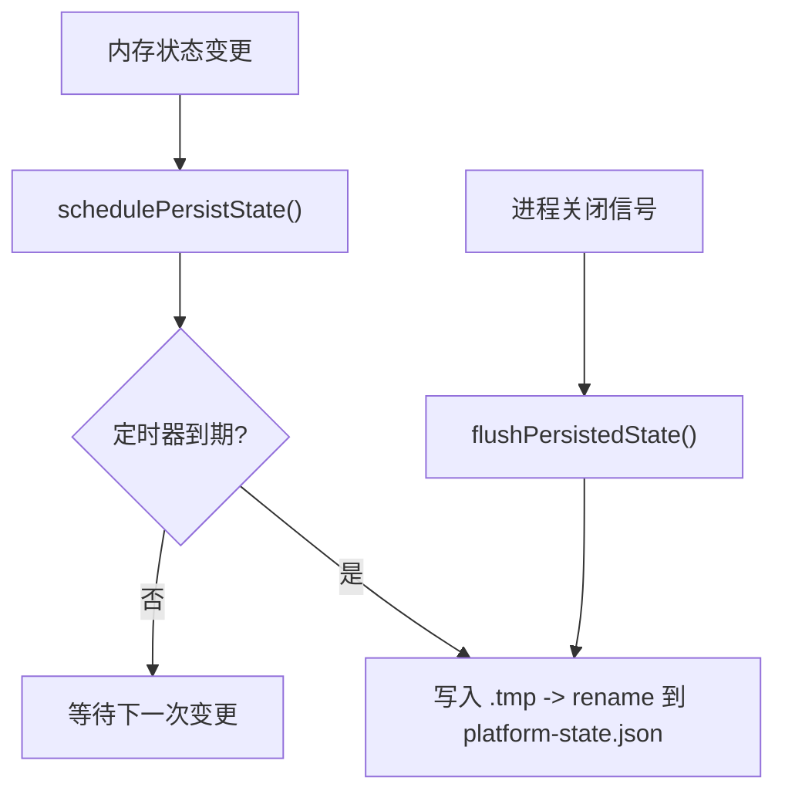
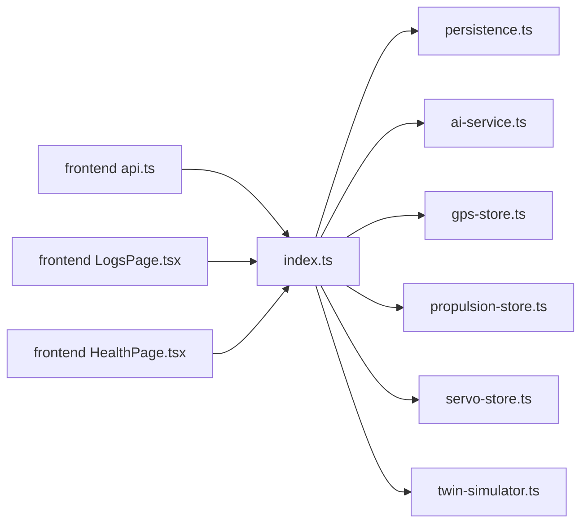

# 系统管理API

<cite>
**本文引用的文件**
- [index.ts](file://fishery-digital-twin-platform/apps/backend/src/index.ts)
- [persistence.ts](file://fishery-digital-twin-platform/apps/backend/src/persistence.ts)
- [route.ts](file://fishery-digital-twin-platform/apps/frontend/src/app/api/desktop-health/route.ts)
- [api.ts](file://fishery-digital-twin-platform/apps/frontend/src/lib/api.ts)
- [LogsPage.tsx](file://fishery-digital-twin-platform/apps/frontend/src/components/dashboard/LogsPage.tsx)
- [HealthPage.tsx](file://fishery-digital-twin-platform/apps/frontend/src/components/dashboard/HealthPage.tsx)
- [platform-state.json](file://fishery-digital-twin-platform/apps/backend/data/platform-state.json)
- [security-and-network.md](file://fishery-digital-twin-platform/docs/security-and-network.md)
</cite>

## 目录
1. [简介](#简介)
2. [项目结构](#项目结构)
3. [核心组件](#核心组件)
4. [架构总览](#架构总览)
5. [详细组件分析](#详细组件分析)
6. [依赖关系分析](#依赖关系分析)
7. [性能考量](#性能考量)
8. [故障排查指南](#故障排查指南)
9. [结论](#结论)
10. [附录：接口清单与配置项](#附录接口清单与配置项)

## 简介
本文件面向运维与平台管理员，系统化说明渔业数字孪生平台的“系统管理API”，覆盖日志查询、系统健康检查、数据持久化、安全审计与访问控制、以及前端监控页面的使用方式。文档基于后端Express服务、前端Next.js页面与桌面健康端点实现进行梳理，帮助读者快速定位问题并掌握日常运维操作。

## 项目结构
- 后端（Node/Express）
  - 入口与路由：apps/backend/src/index.ts
  - 状态持久化：apps/backend/src/persistence.ts
  - 运行态数据：apps/backend/data/platform-state.json
- 前端（Next.js）
  - 桌面健康端点：apps/frontend/src/app/api/desktop-health/route.ts
  - API客户端封装：apps/frontend/src/lib/api.ts
  - 日志页与健康页：apps/frontend/src/components/dashboard/LogsPage.tsx, HealthPage.tsx
- 安全与网络文档：docs/security-and-network.md

图表来源
- [index.ts:56-114](file://fishery-digital-twin-platform/apps/backend/src/index.ts#L56-L114)
- [persistence.ts:12-68](file://fishery-digital-twin-platform/apps/backend/src/persistence.ts#L12-L68)
- [route.ts:1-10](file://fishery-digital-twin-platform/apps/frontend/src/app/api/desktop-health/route.ts#L1-L10)
- [api.ts:1-24](file://fishery-digital-twin-platform/apps/frontend/src/lib/api.ts#L1-L24)

章节来源
- [index.ts:56-114](file://fishery-digital-twin-platform/apps/backend/src/index.ts#L56-L114)
- [persistence.ts:12-68](file://fishery-digital-twin-platform/apps/backend/src/persistence.ts#L12-L68)
- [route.ts:1-10](file://fishery-digital-twin-platform/apps/frontend/src/app/api/desktop-health/route.ts#L1-L10)
- [api.ts:1-24](file://fishery-digital-twin-platform/apps/frontend/src/lib/api.ts#L1-L24)

## 核心组件
- 健康检查与健康展示
  - 后端提供 /api/health，返回服务状态、数据模式、AI/GPS/舵机/推进器状态等。
  - 前端桌面健康端点 /api/desktop-health 用于快速探测Web服务可用性。
  - 健康页面聚合设备在线情况、电池电量、告警数量与健康评分。
- 日志查询
  - 后端提供 /api/logs 返回系统日志数组；前端日志页面按级别过滤并定时刷新。
- 数据持久化
  - 后端将水质历史、电池、AI报告、系统日志以JSON形式落盘到 platform-state.json，支持启动加载与定期保存。
- 安全与访问控制
  - 通过环境变量 UISYS_API_TOKEN 启用令牌校验；局域网写接口需携带 X-UISYS-Token。
  - CORS 白名单由 CORS_ORIGIN 控制，回环地址可免令牌直接访问。
- 动态更新机制
  - 运行时内存状态变更会触发延迟批量落盘；关闭时强制刷盘。
  - 前端通过轮询获取最新日志与健康快照，体现“动态更新”。

章节来源
- [index.ts:322-334](file://fishery-digital-twin-platform/apps/backend/src/index.ts#L322-L334)
- [route.ts:1-10](file://fishery-digital-twin-platform/apps/frontend/src/app/api/desktop-health/route.ts#L1-L10)
- [LogsPage.tsx:14-33](file://fishery-digital-twin-platform/apps/frontend/src/components/dashboard/LogsPage.tsx#L14-L33)
- [persistence.ts:17-68](file://fishery-digital-twin-platform/apps/backend/src/persistence.ts#L17-L68)
- [index.ts:101-157](file://fishery-digital-twin-platform/apps/backend/src/index.ts#L101-L157)

## 架构总览
系统采用前后端分离架构：前端Next.js应用负责可视化与交互，后端Express服务提供REST API与UDP发现服务，状态通过JSON文件持久化。

图表来源
- [index.ts:322-334](file://fishery-digital-twin-platform/apps/backend/src/index.ts#L322-L334)
- [index.ts:367-430](file://fishery-digital-twin-platform/apps/backend/src/index.ts#L367-L430)
- [persistence.ts:17-68](file://fishery-digital-twin-platform/apps/backend/src/persistence.ts#L17-L68)

## 详细组件分析

### 日志查询与管理
- 日志级别分类
  - 支持 info、success、warning、error 四种级别，前端日志页面提供对应筛选。
- 时间范围与过滤条件
  - 后端当前未暴露时间范围或关键字过滤参数；前端在本地对日志数组进行级别过滤。
  - 日志条目包含 id、level、title、detail、source、timestamp，便于前端展示与排序。
- 日志采集与落盘
  - 关键事件（GPS接入、传感器数据、AI报告、设备控制等）均调用 appendLog 记录，并触发持久化。
  - 内存中保留最近80条日志，启动时从持久化文件恢复最多80条。

图表来源
- [index.ts:116-129](file://fishery-digital-twin-platform/apps/backend/src/index.ts#L116-L129)
- [index.ts:557-557](file://fishery-digital-twin-platform/apps/backend/src/index.ts#L557-L557)
- [persistence.ts:32-49](file://fishery-digital-twin-platform/apps/backend/src/persistence.ts#L32-L49)

章节来源
- [index.ts:116-129](file://fishery-digital-twin-platform/apps/backend/src/index.ts#L116-L129)
- [index.ts:557-557](file://fishery-digital-twin-platform/apps/backend/src/index.ts#L557-L557)
- [LogsPage.tsx:35-43](file://fishery-digital-twin-platform/apps/frontend/src/components/dashboard/LogsPage.tsx#L35-L43)
- [persistence.ts:32-49](file://fishery-digital-twin-platform/apps/backend/src/persistence.ts#L32-L49)

### 系统健康检查与指标
- 健康端点
  - GET /api/health 返回服务名、状态、数据模式、AI状态、GPS状态、舵机与推进器快照等。
- 健康页面指标
  - 设备在线数、电池平均电量、预警项、严重故障项、综合健康评分与建议。
- 数据来源
  - 健康信息来自后端 snapshot/vessel/gps/servos/propulsion 等接口组合。

图表来源
- [index.ts:322-334](file://fishery-digital-twin-platform/apps/backend/src/index.ts#L322-L334)
- [HealthPage.tsx:18-31](file://fishery-digital-twin-platform/apps/frontend/src/components/dashboard/HealthPage.tsx#L18-L31)

章节来源
- [index.ts:322-334](file://fishery-digital-twin-platform/apps/backend/src/index.ts#L322-L334)
- [HealthPage.tsx:18-31](file://fishery-digital-twin-platform/apps/frontend/src/components/dashboard/HealthPage.tsx#L18-L31)

### 数据持久化管理
- 存储位置与策略
  - 数据目录由 UISYS_DATA_DIR 指定，默认在项目 data 目录；状态文件为 platform-state.json。
  - 写入采用临时文件+原子重命名，避免部分写入导致损坏。
- 持久化内容
  - waterHistory（水质历史）、batteries（电池）、latestAiReport（AI报告）、systemLogs（系统日志）。
- 加载与限长
  - 启动时加载历史，限制waterHistory最多180条、systemLogs最多80条。
- 刷新策略
  - 每次状态变更后调度延迟保存（250ms），关闭进程时强制刷盘。

图表来源
- [persistence.ts:12-68](file://fishery-digital-twin-platform/apps/backend/src/persistence.ts#L12-L68)
- [index.ts:112-114](file://fishery-digital-twin-platform/apps/backend/src/index.ts#L112-L114)
- [index.ts:581-595](file://fishery-digital-twin-platform/apps/backend/src/index.ts#L581-L595)

章节来源
- [persistence.ts:12-68](file://fishery-digital-twin-platform/apps/backend/src/persistence.ts#L12-L68)
- [index.ts:112-114](file://fishery-digital-twin-platform/apps/backend/src/index.ts#L112-L114)
- [index.ts:581-595](file://fishery-digital-twin-platform/apps/backend/src/index.ts#L581-L595)

### 系统配置的动态更新机制
- 运行时配置
  - 端口、主机、CORS、令牌、演示数据开关、传感器新鲜度阈值等通过环境变量注入，服务启动时读取。
- 动态行为
  - 日志与状态变更触发延迟持久化；前端每5秒轮询日志，健康页面主动刷新快照与反馈。
- 注意
  - 当前未提供热重载配置接口；修改环境变量后需重启服务生效。

章节来源
- [index.ts:48-76](file://fishery-digital-twin-platform/apps/backend/src/index.ts#L48-L76)
- [LogsPage.tsx:14-33](file://fishery-digital-twin-platform/apps/frontend/src/components/dashboard/LogsPage.tsx#L14-L33)
- [HealthPage.tsx:37-47](file://fishery-digital-twin-platform/apps/frontend/src/components/dashboard/HealthPage.tsx#L37-L47)

### 安全审计与访问控制
- 令牌鉴权
  - 非回环地址的写接口必须携带 X-UISYS-Token，且值需与 UISYS_API_TOKEN 一致；否则返回401。
  - 未配置令牌时，局域网控制请求将被拒绝（503）。
- CORS
  - 通过 CORS_ORIGIN 设置允许的来源；默认允许本机开发地址。
- 审计日志
  - 关键操作（GPS接入、传感器数据、AI报告生成、设备控制、数字孪生推演）均记录系统日志，便于审计追踪。
- 网络安全
  - 建议仅在可信局域网运行；固件与后端需在同一热点，防火墙放行UDP 42110与TCP 5000。

章节来源
- [index.ts:131-157](file://fishery-digital-twin-platform/apps/backend/src/index.ts#L131-L157)
- [index.ts:322-334](file://fishery-digital-twin-platform/apps/backend/src/index.ts#L322-L334)
- [security-and-network.md:17-30](file://fishery-digital-twin-platform/docs/security-and-network.md#L17-L30)

### 前端监控与管理工具
- 日志页面
  - 自动轮询 /api/logs，支持按级别过滤，显示总数、预警异常计数与最近事件。
- 健康页面
  - 聚合设备状态、电池信息、健康评分与告警列表，支持手动触发健康检查。
- 桌面健康端点
  - Next.js 提供 /api/desktop-health 快速检测Web服务可用性。

章节来源
- [LogsPage.tsx:14-89](file://fishery-digital-twin-platform/apps/frontend/src/components/dashboard/LogsPage.tsx#L14-L89)
- [HealthPage.tsx:13-203](file://fishery-digital-twin-platform/apps/frontend/src/components/dashboard/HealthPage.tsx#L13-L203)
- [route.ts:1-10](file://fishery-digital-twin-platform/apps/frontend/src/app/api/desktop-health/route.ts#L1-L10)

## 依赖关系分析
- 后端依赖
  - Express、cors、dotenv、node:dgram、node:os、node:crypto
  - 内部模块：ai-service、gps-store、mock-data、persistence、propulsion-store、servo-store、twin-simulator
- 前端依赖
  - Next.js、recharts、lucide-react、@fishery/shared 类型定义
- 外部集成
  - ESP32设备通过UDP发现与HTTP上报数据；AI报告可能调用外部模型服务（受限流保护）

图表来源
- [index.ts:21-44](file://fishery-digital-twin-platform/apps/backend/src/index.ts#L21-L44)
- [api.ts:26-100](file://fishery-digital-twin-platform/apps/frontend/src/lib/api.ts#L26-L100)

章节来源
- [index.ts:21-44](file://fishery-digital-twin-platform/apps/backend/src/index.ts#L21-L44)
- [api.ts:26-100](file://fishery-digital-twin-platform/apps/frontend/src/lib/api.ts#L26-L100)

## 性能考量
- 日志与状态大小控制
  - 内存中仅保留最近80条日志与180条水质历史，避免无限增长影响性能。
- 持久化节流
  - 使用250ms延迟合并写入，减少频繁IO；关闭时强制刷盘保证一致性。
- 前端轮询频率
  - 日志页面每5秒轮询，避免过高频率造成带宽与CPU压力。
- AI报告限流
  - 每分钟仅允许一次AI报告生成，防止过度调用外部模型。

章节来源
- [index.ts:64-68](file://fishery-digital-twin-platform/apps/backend/src/index.ts#L64-L68)
- [index.ts:456-473](file://fishery-digital-twin-platform/apps/backend/src/index.ts#L456-L473)
- [persistence.ts:51-59](file://fishery-digital-twin-platform/apps/backend/src/persistence.ts#L51-L59)
- [LogsPage.tsx:14-33](file://fishery-digital-twin-platform/apps/frontend/src/components/dashboard/LogsPage.tsx#L14-L33)

## 故障排查指南
- 无法访问 /api/health
  - 检查端口占用与CORS配置；确认服务已启动并监听预期端口。
- 日志为空
  - 确认有事件产生（如传感器上报、设备控制）；检查持久化文件是否可读。
- 写接口返回401/503
  - 确认已配置 UISYS_API_TOKEN 并在请求头携带 X-UISYS-Token；局域网访问需令牌匹配。
- 数据不持久化
  - 检查数据目录权限与磁盘空间；查看控制台错误输出。
- 前端连接失败
  - 检查 NEXT_PUBLIC_API_BASE 与网络连通性；确认后端服务可达。

章节来源
- [index.ts:101-157](file://fishery-digital-twin-platform/apps/backend/src/index.ts#L101-L157)
- [persistence.ts:17-29](file://fishery-digital-twin-platform/apps/backend/src/persistence.ts#L17-L29)
- [security-and-network.md:17-30](file://fishery-digital-twin-platform/docs/security-and-network.md#L17-L30)

## 结论
该系统的管理API围绕“健康检查、日志查询、数据持久化与安全访问”构建，具备清晰的职责划分与良好的可维护性。通过前端监控页面可实现日常运维与问题定位；通过令牌鉴权与CORS控制保障局域网安全。建议在生产环境中严格配置令牌、限制CORS来源，并结合日志与告警建立完善的运维体系。

## 附录：接口清单与配置项

- 健康与状态
  - GET /api/health：服务健康检查，返回状态、数据模式、AI/GPS/舵机/推进器快照。
  - GET /api/snapshot：平台快照（水质、电池、导航、AI报告、船舶状态）。
  - GET /api/water：水质历史。
  - GET /api/batteries：电池列表。
  - GET /api/navigation：导航信息。
  - GET /api/gps：GPS状态。
  - GET /api/vessel：船舶状态。
- 设备与控制（需令牌）
  - POST /api/gps/status：更新GPS状态。
  - POST /api/data：上传传感器数据。
  - POST /api/demo/simulate：生成演示数据。
  - GET/POST /api/servos：舵机快照与控制。
  - GET/POST /api/propulsion：推进器快照与控制。
  - GET /api/device/commands：取舵机命令。
  - GET /api/propulsion/commands：取推进器命令。
  - POST /api/twin/simulate：数字孪生推演。
- 日志与AI
  - GET /api/logs：系统日志。
  - GET /api/ai/status：AI状态。
  - GET /api/ai/report：获取AI报告。
  - POST /api/ai/report：生成AI报告（限频）。
- 前端桌面健康
  - GET /api/desktop-health：Web服务可用性检查。

- 环境变量与配置
  - PORT：后端HTTP端口（默认5000）。
  - HOST：绑定地址（默认0.0.0.0）。
  - UISYS_DISCOVERY_PORT：UDP发现端口（默认42110）。
  - UISYS_DEMO_WATER_FEED / UISYS_DEMO_WATER_INTERVAL_MS：演示水质数据开关与间隔。
  - UISYS_SENSOR_FRESHNESS_MS：传感器新鲜度阈值。
  - UISYS_API_TOKEN：控制令牌（局域网写接口必需）。
  - CORS_ORIGIN：允许的跨域来源。
  - UISYS_DATA_DIR：持久化数据目录（默认data）。

章节来源
- [index.ts:48-76](file://fishery-digital-twin-platform/apps/backend/src/index.ts#L48-L76)
- [index.ts:322-557](file://fishery-digital-twin-platform/apps/backend/src/index.ts#L322-L557)
- [route.ts:1-10](file://fishery-digital-twin-platform/apps/frontend/src/app/api/desktop-health/route.ts#L1-L10)
- [security-and-network.md:17-30](file://fishery-digital-twin-platform/docs/security-and-network.md#L17-L30)