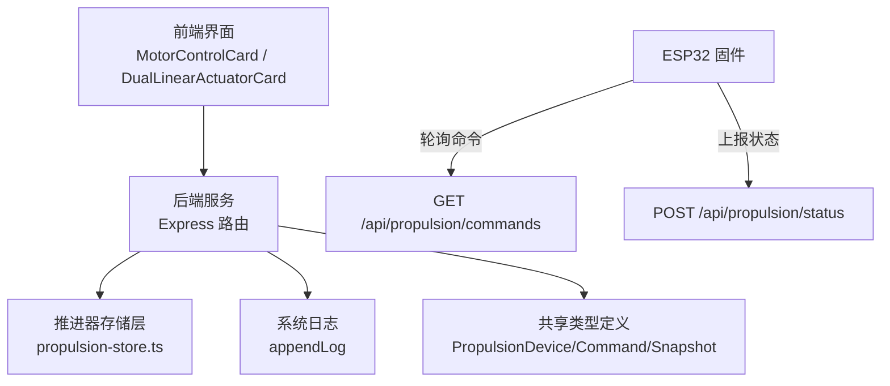
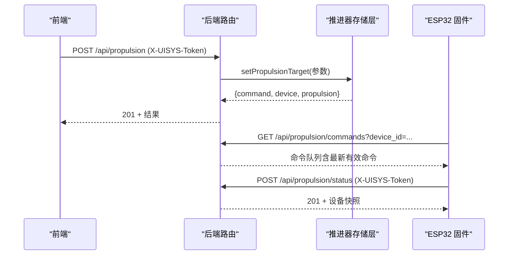
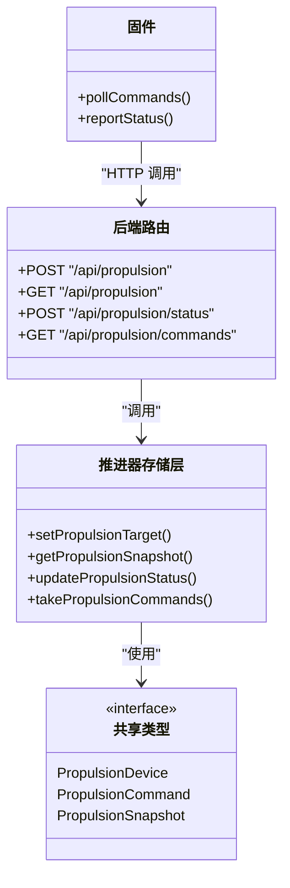

# 推进器控制API

<cite>
**本文引用的文件**
- [index.ts](file://fishery-digital-twin-platform/apps/backend/src/index.ts)
- [propulsion-store.ts](file://fishery-digital-twin-platform/apps/backend/src/propulsion-store.ts)
- [index.ts（共享类型）](file://fishery-digital-twin-platform/packages/shared/src/index.ts)
- [MotorControlCard.tsx](file://fishery-digital-twin-platform/apps/frontend/src/components/dashboard/MotorControlCard.tsx)
- [DualLinearActuatorCard.tsx](file://fishery-digital-twin-platform/apps/frontend/src/components/dashboard/DualLinearActuatorCard.tsx)
- [esp32_simplefoc_dual_propulsion.ino](file://fishery-digital-twin-platform/firmware/esp32/esp32_simplefoc_dual_propulsion/esp32_simplefoc_dual_propulsion.ino)
</cite>

## 目录
1. [简介](#简介)
2. [项目结构](#项目结构)
3. [核心组件](#核心组件)
4. [架构总览](#架构总览)
5. [详细组件分析](#详细组件分析)
6. [依赖关系分析](#依赖关系分析)
7. [性能与安全注意事项](#性能与安全注意事项)
8. [故障排查指南](#故障排查指南)
9. [结论](#结论)
10. [附录：接口规范](#附录接口规范)

## 简介
本文件面向推进器控制API，覆盖以下能力：
- POST /api/propulsion：推进器功率调节、模式控制与紧急停止
- GET /api/propulsion：推进器状态查询
- 认证机制：X-UISYS-Token
- 功率取值范围与左右推进器独立控制
- 命令队列的异步处理机制与安全保护
- 紧急停止触发、故障检测与系统日志记录

## 项目结构
后端通过Express暴露REST API；推进器控制逻辑集中在独立的存储模块中；前端提供控制面板调用API；固件设备周期性拉取命令并上报状态。

图表来源
- [index.ts:505-538](file://fishery-digital-twin-platform/apps/backend/src/index.ts#L505-L538)
- [propulsion-store.ts:149-231](file://fishery-digital-twin-platform/apps/backend/src/propulsion-store.ts#L149-L231)
- [index.ts（共享类型）:133-194](file://fishery-digital-twin-platform/packages/shared/src/index.ts#L133-L194)
- [esp32_simplefoc_dual_propulsion.ino:476-506](file://fishery-digital-twin-platform/firmware/esp32/esp32_simplefoc_dual_propulsion/esp32_simplefoc_dual_propulsion.ino#L476-L506)

章节来源
- [index.ts:56-110](file://fishery-digital-twin-platform/apps/backend/src/index.ts#L56-L110)
- [propulsion-store.ts:1-31](file://fishery-digital-twin-platform/apps/backend/src/propulsion-store.ts#L1-L31)

## 核心组件
- 认证中间件：对非回环地址的请求强制校验 X-UISYS-Token，未配置时拒绝局域网控制请求
- 推进器存储层：维护设备状态、目标值、命令队列、超时清理、安全钳制与模式切换
- 前端控制卡片：封装推油门/转向或直接通道功率，心跳式重发命令，支持急停
- 固件端：定时拉取命令并执行，定期上报实际功率与在线状态

章节来源
- [index.ts:136-157](file://fishery-digital-twin-platform/apps/backend/src/index.ts#L136-L157)
- [propulsion-store.ts:166-231](file://fishery-digital-twin-platform/apps/backend/src/propulsion-store.ts#L166-L231)
- [MotorControlCard.tsx:95-131](file://fishery-digital-twin-platform/apps/frontend/src/components/dashboard/MotorControlCard.tsx#L95-L131)
- [DualLinearActuatorCard.tsx:45-85](file://fishery-digital-twin-platform/apps/frontend/src/components/dashboard/DualLinearActuatorCard.tsx#L45-L85)
- [esp32_simplefoc_dual_propulsion.ino:476-506](file://fishery-digital-twin-platform/firmware/esp32/esp32_simplefoc_dual_propulsion/esp32_simplefoc_dual_propulsion.ino#L476-L506)

## 架构总览

图表来源
- [index.ts:510-538](file://fishery-digital-twin-platform/apps/backend/src/index.ts#L510-L538)
- [propulsion-store.ts:166-231](file://fishery-digital-twin-platform/apps/backend/src/propulsion-store.ts#L166-L231)
- [esp32_simplefoc_dual_propulsion.ino:476-506](file://fishery-digital-twin-platform/firmware/esp32/esp32_simplefoc_dual_propulsion/esp32_simplefoc_dual_propulsion.ino#L476-L506)

## 详细组件分析

### 认证机制（X-UISYS-Token）
- 当环境变量 UISYS_API_TOKEN 已配置时，所有写操作（包括推进器控制）必须携带请求头 X-UISYS-Token，且值需与服务端配置的令牌一致
- 本地回环地址访问可跳过鉴权；否则未携带或错误将返回 401
- 若未配置令牌，局域网控制请求将被拒绝并返回 503

章节来源
- [index.ts:68-76](file://fishery-digital-twin-platform/apps/backend/src/index.ts#L68-L76)
- [index.ts:136-157](file://fishery-digital-twin-platform/apps/backend/src/index.ts#L136-L157)

### POST /api/propulsion：推进器控制
- 功能：设置推进器工作模式、使能、紧急停止、油门/转向或直接左右通道功率
- 认证：需要 X-UISYS-Token（见上）
- 请求体关键字段（任一组合均可）：
  - device_id：设备标识（可选，默认使用内置设备ID）
  - mode：工作模式，支持 MANUAL、WEB、AUTO
  - enabled：是否使能（在 WEB 模式下生效）
  - emergency_stop：紧急停止标志（置真时将停止输出并进入保护）
  - throttle：油门百分比（-100~100），用于合成左右功率
  - steering：转向百分比（-100~100），用于合成左右功率
  - left_power/right_power：直接指定左右通道功率（-100~100），优先级高于油门/转向合成
  - max_power：最大允许功率百分比（5~100），会被限制到设备配置上限
- 响应体：
  - command：本次下发的推进器命令对象（包含 mode、enabled、emergency_stop、throttle、steering、left_power、right_power、max_power、created_at 等）
  - device：当前设备快照（包含 online/web_online/target 等）
  - propulsion：全局推进器快照（devices、online_count 等）
- 行为要点：
  - 当 active = mode==WEB && enabled && !emergency_stop 时才会计算输出；否则输出为 0
  - 单通道设备仅左通道输出；双通道设备支持左右独立控制
  - 若设备离线（last_seen 超过阈值），将拒绝激活命令并抛出错误
  - 所有参数均被钳制到合法范围，避免超限
  - 命令入队后由固件侧定时拉取并执行

章节来源
- [index.ts:510-523](file://fishery-digital-twin-platform/apps/backend/src/index.ts#L510-L523)
- [propulsion-store.ts:166-231](file://fishery-digital-twin-platform/apps/backend/src/propulsion-store.ts#L166-L231)
- [index.ts（共享类型）:133-194](file://fishery-digital-twin-platform/packages/shared/src/index.ts#L133-L194)

#### 功率取值范围与合成规则
- 功率范围：-100% ~ 100%（负值表示反向）
- 合成规则：
  - 单通道：left = clamp(throttle, -maxPower, maxPower)，right = 0
  - 双通道且提供 direct left_power/right_power：直接钳制到 ±maxPower
  - 双通道且未提供 direct：left = clamp(throttle + steering, -maxPower, maxPower)，right = clamp(throttle - steering, -maxPower, maxPower)
- max_power 会被限制到设备配置的最大值（不同设备可能不同）

章节来源
- [propulsion-store.ts:37-51](file://fishery-digital-twin-platform/apps/backend/src/propulsion-store.ts#L37-L51)
- [propulsion-store.ts:89-95](file://fishery-digital-twin-platform/apps/backend/src/propulsion-store.ts#L89-L95)
- [propulsion-store.ts:181-193](file://fishery-digital-twin-platform/apps/backend/src/propulsion-store.ts#L181-L193)

#### 模式控制
- MANUAL：手动模式（通常由外部系统控制）
- WEB：Web 控制模式（前端通过 API 下发命令）
- AUTO：自动模式（可由上层策略控制）
- 模式变更会写入设备状态，影响命令有效性判断

章节来源
- [propulsion-store.ts:65-67](file://fishery-digital-twin-platform/apps/backend/src/propulsion-store.ts#L65-L67)
- [propulsion-store.ts:196-206](file://fishery-digital-twin-platform/apps/backend/src/propulsion-store.ts#L196-L206)

#### 紧急停止
- 设置 emergency_stop=true 将立即停止输出（左右功率归零），并记录警告日志
- 即使设备反馈离线，急停命令仍可入队，确保安全性优先

章节来源
- [propulsion-store.ts:176-180](file://fishery-digital-twin-platform/apps/backend/src/propulsion-store.ts#L176-L180)
- [propulsion-store.ts:209-222](file://fishery-digital-twin-platform/apps/backend/src/propulsion-store.ts#L209-L222)
- [index.ts:513-518](file://fishery-digital-twin-platform/apps/backend/src/index.ts#L513-L518)

### GET /api/propulsion：状态查询
- 功能：获取推进器设备列表及在线数量；可通过 device_id 查询单个设备详情
- 无需鉴权（只读接口）
- 响应体：
  - 无 device_id：{ devices[], device_count, online_count, online }
  - 有 device_id：单个设备快照（包含 target、actual_left_power、actual_right_power、mode、enabled、emergency_stop、web_online、online 等）

章节来源
- [index.ts:505-508](file://fishery-digital-twin-platform/apps/backend/src/index.ts#L505-L508)
- [propulsion-store.ts:149-164](file://fishery-digital-twin-platform/apps/backend/src/propulsion-store.ts#L149-L164)

### 命令队列与异步处理
- 每次下发控制命令都会生成一条 PropulsionCommand 并放入设备对应的队列
- 固件端定时调用 GET /api/propulsion/commands?device_id=... 拉取命令
- 服务端会过滤掉超过超时时间的旧命令（默认约 2.5 秒），保证只执行最新有效命令
- 该机制实现“最近命令优先”的异步控制流，避免并发冲突

章节来源
- [propulsion-store.ts:209-225](file://fishery-digital-twin-platform/apps/backend/src/propulsion-store.ts#L209-L225)
- [propulsion-store.ts:310-318](file://fishery-digital-twin-platform/apps/backend/src/propulsion-store.ts#L310-L318)
- [esp32_simplefoc_dual_propulsion.ino:476-506](file://fishery-digital-twin-platform/firmware/esp32/esp32_simplefoc_dual_propulsion/esp32_simplefoc_dual_propulsion.ino#L476-L506)

### 前端交互与心跳
- MotorControlCard：以固定周期（约 800ms）发送当前目标功率，维持活跃控制
- DualLinearActuatorCard：支持左右独立功率设定，同样周期重发
- 两者均支持紧急停止按钮，调用同一控制接口并更新本地状态

章节来源
- [MotorControlCard.tsx:95-131](file://fishery-digital-twin-platform/apps/frontend/src/components/dashboard/MotorControlCard.tsx#L95-L131)
- [DualLinearActuatorCard.tsx:45-85](file://fishery-digital-twin-platform/apps/frontend/src/components/dashboard/DualLinearActuatorCard.tsx#L45-L85)

### 固件状态上报
- 固件定时 POST /api/propulsion/status 上报 actual_left_power、actual_right_power、mode、enabled、emergency_stop 等
- 后端据此更新设备在线状态与实际输出，便于前端展示与诊断

章节来源
- [index.ts:525-533](file://fishery-digital-twin-platform/apps/backend/src/index.ts#L525-L533)
- [esp32_simplefoc_dual_propulsion.ino:668-700](file://fishery-digital-twin-platform/firmware/esp32/esp32_simplefoc_dual_propulsion/esp32_simplefoc_dual_propulsion.ino#L668-L700)

## 依赖关系分析

图表来源
- [index.ts:505-538](file://fishery-digital-twin-platform/apps/backend/src/index.ts#L505-L538)
- [propulsion-store.ts:149-231](file://fishery-digital-twin-platform/apps/backend/src/propulsion-store.ts#L149-L231)
- [index.ts（共享类型）:133-194](file://fishery-digital-twin-platform/packages/shared/src/index.ts#L133-L194)
- [esp32_simplefoc_dual_propulsion.ino:476-506](file://fishery-digital-twin-platform/firmware/esp32/esp32_simplefoc_dual_propulsion/esp32_simplefoc_dual_propulsion.ino#L476-L506)

章节来源
- [index.ts:505-538](file://fishery-digital-twin-platform/apps/backend/src/index.ts#L505-L538)
- [propulsion-store.ts:149-231](file://fishery-digital-twin-platform/apps/backend/src/propulsion-store.ts#L149-L231)

## 性能与安全注意事项
- 命令超时：命令队列中的旧命令会在约 2.5 秒后被丢弃，避免执行过时指令
- 设备在线判定：基于 last_seen 时间戳判断设备是否在线；激活命令要求设备在线
- 功率钳制：所有功率值均被限制到 ±maxPower，防止超调
- 认证：生产环境务必配置 UISYS_API_TOKEN，并在所有写操作中携带 X-UISYS-Token
- CORS：跨域受控，仅允许的源可访问
- 日志：关键操作（命令下发、急停、设备在线）均记录系统日志，便于审计与排障

章节来源
- [propulsion-store.ts:6-7](file://fishery-digital-twin-platform/apps/backend/src/propulsion-store.ts#L6-L7)
- [propulsion-store.ts:176-180](file://fishery-digital-twin-platform/apps/backend/src/propulsion-store.ts#L176-L180)
- [propulsion-store.ts:310-318](file://fishery-digital-twin-platform/apps/backend/src/propulsion-store.ts#L310-L318)
- [index.ts:101-110](file://fishery-digital-twin-platform/apps/backend/src/index.ts#L101-L110)
- [index.ts:116-129](file://fishery-digital-twin-platform/apps/backend/src/index.ts#L116-L129)

## 故障排查指南
- 401 未授权：检查是否配置了 UISYS_API_TOKEN，并确保请求头 X-UISYS-Token 正确
- 503 服务不可用：未配置令牌时，局域网控制请求将被拒绝
- 400 请求无效：检查参数范围（功率 -100~100，max_power 5~100）、字段拼写与类型
- 设备离线：确认固件正常上报 /api/propulsion/status；检查网络连通性与令牌
- 命令不生效：确认 mode=WEB 且 enabled=true；检查是否触发了 emergency_stop；查看命令队列是否过期
- 日志定位：通过 /api/logs 查看系统日志，关注“推进器命令已下发”“推进器急停已触发”“推进控制板在线”等条目

章节来源
- [index.ts:136-157](file://fishery-digital-twin-platform/apps/backend/src/index.ts#L136-L157)
- [index.ts:510-533](file://fishery-digital-twin-platform/apps/backend/src/index.ts#L510-L533)
- [index.ts:557-561](file://fishery-digital-twin-platform/apps/backend/src/index.ts#L557-L561)

## 结论
推进器控制API提供了安全的、可审计的控制通道，支持多种工作模式、左右独立功率控制与紧急停止。通过命令队列与超时机制，实现了稳健的异步控制流程。配合前端心跳与固件状态上报，形成闭环控制链路。建议在生产环境中启用令牌认证，并结合系统日志进行监控与排障。

## 附录：接口规范

### 通用说明
- 基础路径：/api
- 认证：写操作需携带请求头 X-UISYS-Token；本地回环可免鉴权
- 数据格式：application/json

### POST /api/propulsion
- 方法：POST
- 认证：需要 X-UISYS-Token（除非本地回环）
- 请求体字段（示例键名，大小写兼容）：
  - device_id：string（可选）
  - mode：enum("MANUAL","WEB","AUTO")（可选）
  - enabled：boolean（可选）
  - emergency_stop：boolean（可选）
  - throttle：number（-100~100，可选）
  - steering：number（-100~100，可选）
  - left_power：number（-100~100，可选）
  - right_power：number（-100~100，可选）
  - max_power：number（5~100，可选）
- 成功响应（201）：
  - command：推进器命令对象
  - device：设备快照
  - propulsion：推进器全局快照
- 失败响应：
  - 400：请求参数无效
  - 401：令牌缺失或错误
  - 503：未配置令牌时的局域网控制拒绝

章节来源
- [index.ts:510-523](file://fishery-digital-twin-platform/apps/backend/src/index.ts#L510-L523)
- [propulsion-store.ts:166-231](file://fishery-digital-twin-platform/apps/backend/src/propulsion-store.ts#L166-L231)
- [index.ts（共享类型）:133-194](file://fishery-digital-twin-platform/packages/shared/src/index.ts#L133-L194)

### GET /api/propulsion
- 方法：GET
- 认证：不需要（只读）
- 查询参数：
  - device_id：string（可选，查询单个设备）
- 成功响应（200）：
  - 无 device_id：{ devices[], device_count, online_count, online }
  - 有 device_id：单个设备快照对象

章节来源
- [index.ts:505-508](file://fishery-digital-twin-platform/apps/backend/src/index.ts#L505-L508)
- [propulsion-store.ts:149-164](file://fishery-digital-twin-platform/apps/backend/src/propulsion-store.ts#L149-L164)

### 相关辅助接口
- POST /api/propulsion/status：固件上报状态（需要 X-UISYS-Token）
- GET /api/propulsion/commands：固件拉取命令（需要 X-UISYS-Token）
- GET /api/logs：系统日志查询

章节来源
- [index.ts:525-538](file://fishery-digital-twin-platform/apps/backend/src/index.ts#L525-L538)
- [index.ts:557-561](file://fishery-digital-twin-platform/apps/backend/src/index.ts#L557-L561)