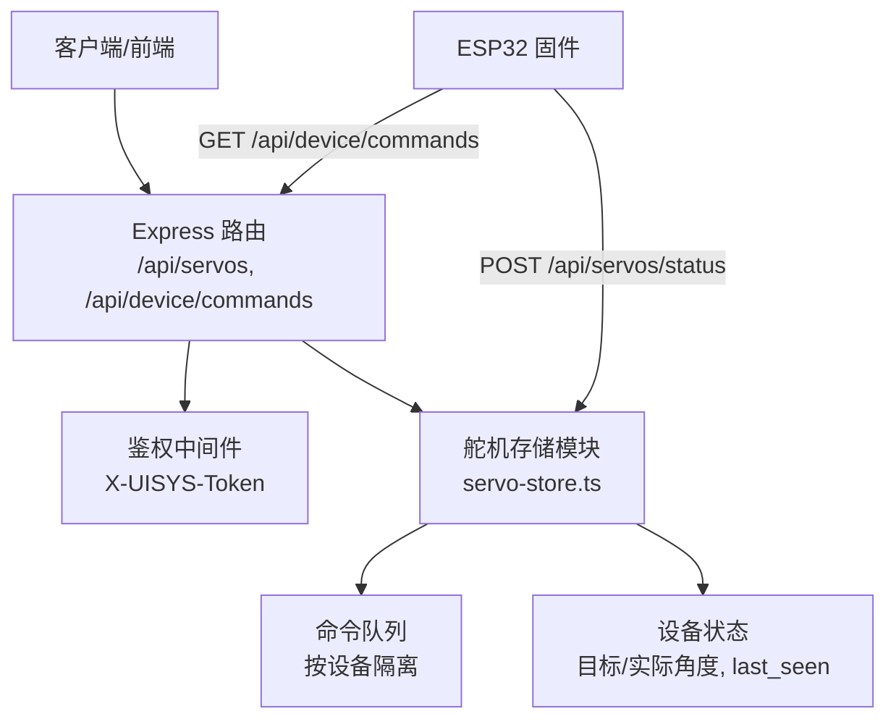
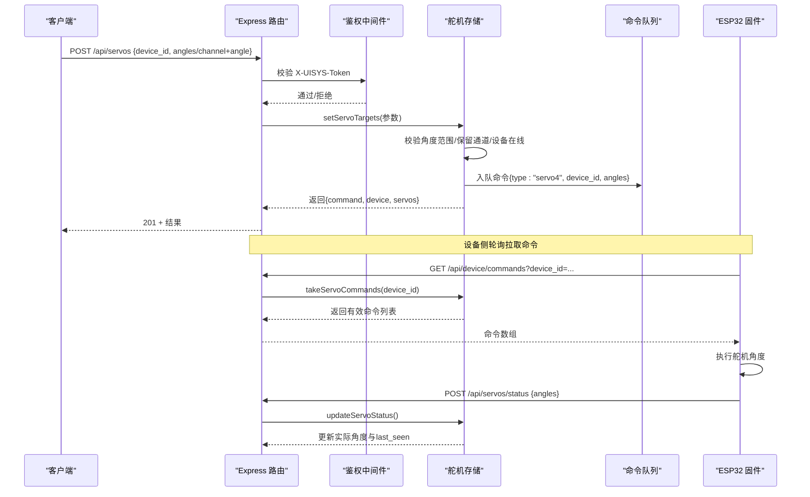
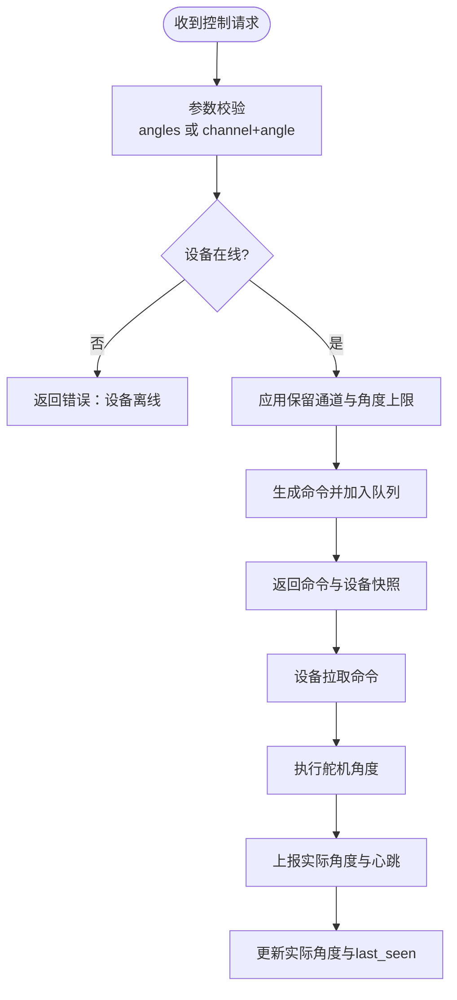
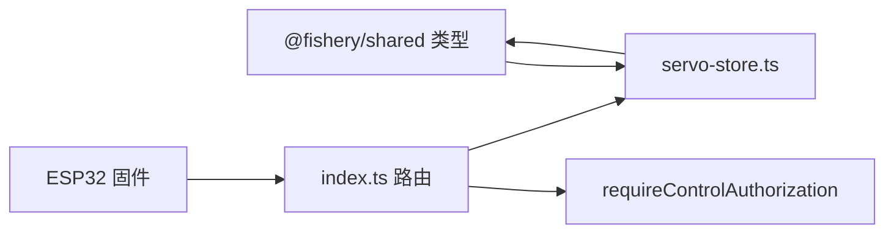

# 舵机控制API

<cite>
**本文引用的文件**
- [index.ts](file://fishery-digital-twin-platform/apps/backend/src/index.ts)
- [servo-store.ts](file://fishery-digital-twin-platform/apps/backend/src/servo-store.ts)
- [index.ts（共享类型）](file://fishery-digital-twin-platform/packages/shared/src/index.ts)
- [maker_esp32_pro_servo_temp_01.ino](file://fishery-digital-twin-platform/firmware/esp32/maker_esp32_pro_servo_temp_01/maker_esp32_pro_servo_temp_01.ino)
- [maker_esp32_pro_four_servo_02.ino](file://fishery-digital-twin-platform/firmware/esp32/maker_esp32_pro_four_servo_02/maker_esp32_pro_four_servo_02.ino)
</cite>

## 目录
1. [简介](#简介)
2. [项目结构](#项目结构)
3. [核心组件](#核心组件)
4. [架构总览](#架构总览)
5. [详细组件分析](#详细组件分析)
6. [依赖关系分析](#依赖关系分析)
7. [性能与可靠性](#性能与可靠性)
8. [故障诊断与日志](#故障诊断与日志)
9. [结论](#结论)
10. [附录：接口规范](#附录接口规范)

## 简介
本文件面向“舵机控制API”，覆盖以下能力：
- POST /api/servos：舵机角度控制（单通道或批量），含认证、参数校验、设备ID验证、命令队列入队。
- GET /api/servos：舵机状态查询，包含在线状态、目标角度与实际角度、设备计数等。
- 命令队列异步处理：服务端将控制指令写入队列，设备侧定时拉取执行；队列具备TTL过期机制。
- 错误处理策略：参数校验失败、设备离线、保留通道保护等场景的明确错误响应。
- 设备在线检测、故障诊断与日志记录：通过状态上报与系统日志追踪控制链路。

## 项目结构
后端服务基于Express提供REST API，舵机相关逻辑集中在服务层模块中，并通过统一中间件进行鉴权。固件端ESP32设备定期上报实际角度并拉取待执行命令。

图表来源
- [index.ts:475-503](file://fishery-digital-twin-platform/apps/backend/src/index.ts#L475-L503)
- [servo-store.ts:89-183](file://fishery-digital-twin-platform/apps/backend/src/servo-store.ts#L89-L183)

章节来源
- [index.ts:475-503](file://fishery-digital-twin-platform/apps/backend/src/index.ts#L475-L503)
- [servo-store.ts:89-183](file://fishery-digital-twin-platform/apps/backend/src/servo-store.ts#L89-L183)

## 核心组件
- 路由与鉴权
  - POST /api/servos：受控接口，需携带 X-UISYS-Token 鉴权头。
  - GET /api/servos：只读接口，无需鉴权。
  - GET /api/device/commands：设备侧拉取命令，需鉴权。
  - POST /api/servos/status：设备侧上报实际角度与在线心跳，需鉴权。
- 舵机存储与队列
  - 维护设备集合、目标角度、实际角度、最后在线时间。
  - 命令队列按设备隔离，带TTL过滤。
- 固件交互
  - 设备周期性上报实际角度，更新 last_seen 以驱动在线判定。
  - 设备拉取命令并执行，完成后再次上报。

章节来源
- [index.ts:136-157](file://fishery-digital-twin-platform/apps/backend/src/index.ts#L136-L157)
- [index.ts:475-503](file://fishery-digital-twin-platform/apps/backend/src/index.ts#L475-L503)
- [servo-store.ts:17-183](file://fishery-digital-twin-platform/apps/backend/src/servo-store.ts#L17-L183)

## 架构总览
下图展示一次完整的“角度控制”调用链：客户端发起POST请求，鉴权通过后进入业务层，校验参数并写入设备状态与命令队列，随后设备侧拉取并执行。

图表来源
- [index.ts:480-503](file://fishery-digital-twin-platform/apps/backend/src/index.ts#L480-L503)
- [servo-store.ts:106-183](file://fishery-digital-twin-platform/apps/backend/src/servo-store.ts#L106-L183)
- [maker_esp32_pro_servo_temp_01.ino:863-899](file://fishery-digital-twin-platform/firmware/esp32/maker_esp32_pro_servo_temp_01/maker_esp32_pro_servo_temp_01.ino#L863-L899)
- [maker_esp32_pro_four_servo_02.ino:975-1011](file://fishery-digital-twin-platform/firmware/esp32/maker_esp32_pro_four_servo_02/maker_esp32_pro_four_servo_02.ino#L975-L1011)

## 详细组件分析

### 认证机制（X-UISYS-Token）
- 所有写操作与设备命令拉取均受 requireControlAuthorization 保护。
- 本地回环地址可免鉴权；否则必须提供 X-UISYS-Token，且与服务端配置的 UISYS_API_TOKEN 一致。
- 未配置令牌时，局域网控制请求将被拒绝（HTTP 503）。

章节来源
- [index.ts:136-157](file://fishery-digital-twin-platform/apps/backend/src/index.ts#L136-L157)
- [index.ts:564-570](file://fishery-digital-twin-platform/apps/backend/src/index.ts#L564-L570)

### POST /api/servos：舵机角度控制
- 认证：需要 X-UISYS-Token。
- 请求体支持两种模式：
  - 批量控制：提供 angles，长度为4的数组，每个元素为0-180的整数。
  - 单通道控制：提供 channel（1-4）和 angle（0-180）。
- 设备ID验证：
  - 若未提供 device_id，使用默认设备；仅对已知设备生效。
  - 设备必须处于“在线”状态（最近10秒内有过状态上报），否则拒绝并提示离线。
- 角度限制与保护：
  - 角度取值范围严格为0-180度，非整数会被四舍五入后校验。
  - 部分通道被标记为保留通道，强制固定为90度，禁止外部控制。
  - 设备维度可设置最大角度上限，超出将被裁剪。
- 命令队列：
  - 成功解析后生成命令对象（包含id、type、device_id、angles、created_at），写入该设备的命令队列。
- 响应结构：
  - command：本次生成的命令对象。
  - device：该设备的快照（含online、target_angles、actual_angles等）。
  - servos：全部设备快照汇总（devices、device_count、online_count、online）。

章节来源
- [index.ts:480-488](file://fishery-digital-twin-platform/apps/backend/src/index.ts#L480-L488)
- [servo-store.ts:106-153](file://fishery-digital-twin-platform/apps/backend/src/servo-store.ts#L106-L153)
- [servo-store.ts:60-87](file://fishery-digital-twin-platform/apps/backend/src/servo-store.ts#L60-L87)

### GET /api/servos：状态查询
- 无需鉴权。
- 可选查询参数：
  - device_id：指定设备ID，返回单个设备快照。
  - 不传则返回全部设备汇总快照。
- 响应字段：
  - 单设备：device_id、device_name、target_angles、actual_angles、last_seen、updated_at、online。
  - 汇总：devices、device_count、online_count、online。
- 在线判定：
  - 依据 last_seen 时间戳，超过10秒未上报视为 offline。

章节来源
- [index.ts:475-478](file://fishery-digital-twin-platform/apps/backend/src/index.ts#L475-L478)
- [servo-store.ts:89-104](file://fishery-digital-twin-platform/apps/backend/src/servo-store.ts#L89-L104)
- [servo-store.ts:43-58](file://fishery-digital-twin-platform/apps/backend/src/servo-store.ts#L43-L58)

### 命令队列与异步处理
- 队列模型：按设备隔离的命令数组，命令对象包含创建时间。
- TTL机制：命令在创建后2.5秒内有效，超时自动丢弃。
- 设备拉取：设备通过 GET /api/device/commands?device_id=... 拉取当前有效命令。
- 执行闭环：设备执行后将实际角度通过 POST /api/servos/status 上报，更新 actual_angles 与 last_seen。

图表来源
- [servo-store.ts:106-183](file://fishery-digital-twin-platform/apps/backend/src/servo-store.ts#L106-L183)
- [index.ts:480-503](file://fishery-digital-twin-platform/apps/backend/src/index.ts#L480-L503)

章节来源
- [servo-store.ts:175-183](file://fishery-digital-twin-platform/apps/backend/src/servo-store.ts#L175-L183)
- [index.ts:500-503](file://fishery-digital-twin-platform/apps/backend/src/index.ts#L500-L503)

### 设备在线状态检测与故障诊断
- 在线判定：根据 last_seen 与当前时间差判断，阈值10秒。
- 设备上报：固件周期调用 POST /api/servos/status 上报 angles，更新 last_seen。
- 故障定位：
  - 若控制请求返回“设备离线”，检查设备是否持续上报状态。
  - 若命令未被拉取，检查设备是否正确调用 GET /api/device/commands。
  - 若角度未按预期变化，检查是否命中保留通道或超出设备最大角度限制。

章节来源
- [servo-store.ts:43-58](file://fishery-digital-twin-platform/apps/backend/src/servo-store.ts#L43-L58)
- [servo-store.ts:155-173](file://fishery-digital-twin-platform/apps/backend/src/servo-store.ts#L155-L173)
- [maker_esp32_pro_servo_temp_01.ino:863-899](file://fishery-digital-twin-platform/firmware/esp32/maker_esp32_pro_servo_temp_01/maker_esp32_pro_servo_temp_01.ino#L863-L899)
- [maker_esp32_pro_four_servo_02.ino:975-1011](file://fishery-digital-twin-platform/firmware/esp32/maker_esp32_pro_four_servo_02/maker_esp32_pro_four_servo_02.ino#L975-L1011)

### 日志记录
- 每次控制下发与设备在线都会记录系统日志，便于审计与排障。
- 日志级别包括 info、success、warning、error，并附带来源标识。

章节来源
- [index.ts:116-129](file://fishery-digital-twin-platform/apps/backend/src/index.ts#L116-L129)
- [index.ts:480-498](file://fishery-digital-twin-platform/apps/backend/src/index.ts#L480-L498)

## 依赖关系分析
- 路由层依赖鉴权中间件与存储层。
- 存储层依赖共享类型定义，确保前后端数据结构一致。
- 固件依赖后端提供的状态与命令接口，形成闭环控制。

图表来源
- [index.ts:475-503](file://fishery-digital-twin-platform/apps/backend/src/index.ts#L475-L503)
- [servo-store.ts:1-183](file://fishery-digital-twin-platform/apps/backend/src/servo-store.ts#L1-L183)
- [index.ts（共享类型）:108-131](file://fishery-digital-twin-platform/packages/shared/src/index.ts#L108-L131)

章节来源
- [index.ts:475-503](file://fishery-digital-twin-platform/apps/backend/src/index.ts#L475-L503)
- [servo-store.ts:1-183](file://fishery-digital-twin-platform/apps/backend/src/servo-store.ts#L1-L183)
- [index.ts（共享类型）:108-131](file://fishery-digital-twin-platform/packages/shared/src/index.ts#L108-L131)

## 性能与可靠性
- 参数校验与范围限制在请求入口处完成，避免无效命令进入队列。
- 命令队列TTL短（2.5秒），防止陈旧命令被执行，降低设备误动作风险。
- 在线判定阈值（10秒）平衡了实时性与网络抖动容忍度。
- 建议：
  - 控制频率不宜过高，避免频繁入队造成队列拥塞。
  - 设备应保证稳定上报心跳，维持 online 状态。
  - 对关键通道启用保留保护，防止误控。

[本节为通用指导，不直接分析具体文件]

## 故障诊断与日志
- 常见错误与处理：
  - 缺少或错误的 X-UISYS-Token：返回401。
  - 设备离线：控制请求返回错误，命令不入队。
  - 角度非法：返回400，提示角度范围或数量错误。
  - 访问保留通道：返回错误，提示通道被保留。
- 排查步骤：
  - 确认设备已正确上报状态（POST /api/servos/status）。
  - 检查设备是否拉取命令（GET /api/device/commands）。
  - 查看系统日志（GET /api/logs）定位问题。
  - 核对设备ID与通道配置，避免命中保留通道。

章节来源
- [index.ts:136-157](file://fishery-digital-twin-platform/apps/backend/src/index.ts#L136-L157)
- [servo-store.ts:106-153](file://fishery-digital-twin-platform/apps/backend/src/servo-store.ts#L106-L153)
- [servo-store.ts:175-183](file://fishery-digital-twin-platform/apps/backend/src/servo-store.ts#L175-L183)

## 结论
舵机控制API提供了安全可控的角度控制能力，结合设备在线检测、命令队列与日志记录，形成了可靠的闭环控制链路。通过严格的参数校验、保留通道保护与TTL机制，系统在易用性与安全性之间取得良好平衡。建议在部署时合理配置令牌与CORS，并确保设备稳定上报状态与拉取命令。

[本节为总结性内容，不直接分析具体文件]

## 附录：接口规范

### POST /api/servos（舵机角度控制）
- 认证：需要 X-UISYS-Token。
- 请求体（二选一）：
  - 批量：{ device_id?: string, angles: number[4] }，每个元素0-180整数。
  - 单通道：{ device_id?: string, channel: 1-4, angle: 0-180 }。
- 响应：
  - 201：{ command, device, servos }
  - 400：{ error }
  - 401：{ error }（未通过鉴权）
- 说明：
  - 设备必须在线（last_seen 在10秒内）。
  - 命中保留通道的请求将被拒绝。
  - 角度将被裁剪至设备最大角度限制。

章节来源
- [index.ts:480-488](file://fishery-digital-twin-platform/apps/backend/src/index.ts#L480-L488)
- [servo-store.ts:106-153](file://fishery-digital-twin-platform/apps/backend/src/servo-store.ts#L106-L153)

### GET /api/servos（状态查询）
- 认证：不需要。
- 查询参数：
  - device_id?: string（可选）
- 响应：
  - 单设备：ServoDevice
  - 汇总：ServoSnapshot（devices、device_count、online_count、online）

章节来源
- [index.ts:475-478](file://fishery-digital-twin-platform/apps/backend/src/index.ts#L475-L478)
- [servo-store.ts:89-104](file://fishery-digital-twin-platform/apps/backend/src/servo-store.ts#L89-L104)

### GET /api/device/commands（设备拉取命令）
- 认证：需要 X-UISYS-Token。
- 查询参数：device_id?: string
- 响应：命令数组（空数组表示无有效命令）

章节来源
- [index.ts:500-503](file://fishery-digital-twin-platform/apps/backend/src/index.ts#L500-L503)
- [servo-store.ts:175-183](file://fishery-digital-twin-platform/apps/backend/src/servo-store.ts#L175-L183)

### POST /api/servos/status（设备上报状态）
- 认证：需要 X-UISYS-Token。
- 请求体：{ device_id?: string, device_name?: string, angles: number[4] }
- 响应：
  - 201：{ device, servos }
  - 400：{ error }

章节来源
- [index.ts:490-498](file://fishery-digital-twin-platform/apps/backend/src/index.ts#L490-L498)
- [servo-store.ts:155-173](file://fishery-digital-twin-platform/apps/backend/src/servo-store.ts#L155-L173)

### 数据类型参考
- ServoDevice、ServoSnapshot、ServoCommand 等类型定义位于共享包中，用于前后端一致性。

章节来源
- [index.ts（共享类型）:108-131](file://fishery-digital-twin-platform/packages/shared/src/index.ts#L108-L131)