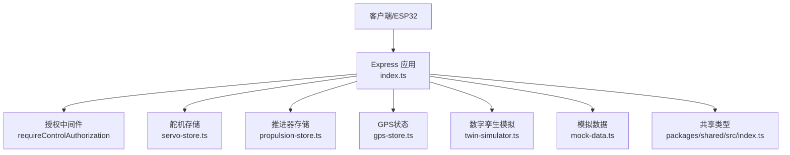
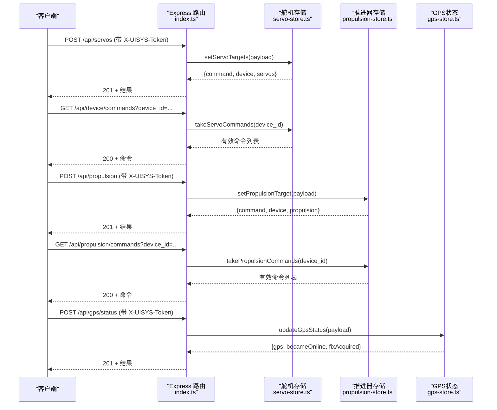
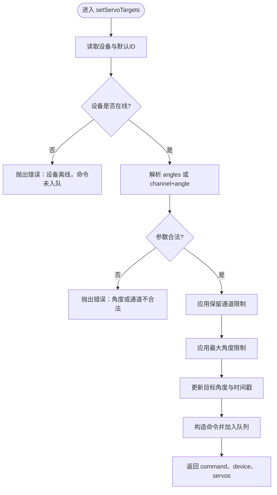
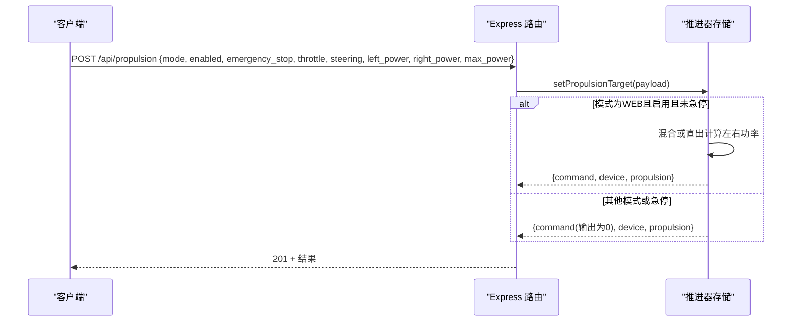
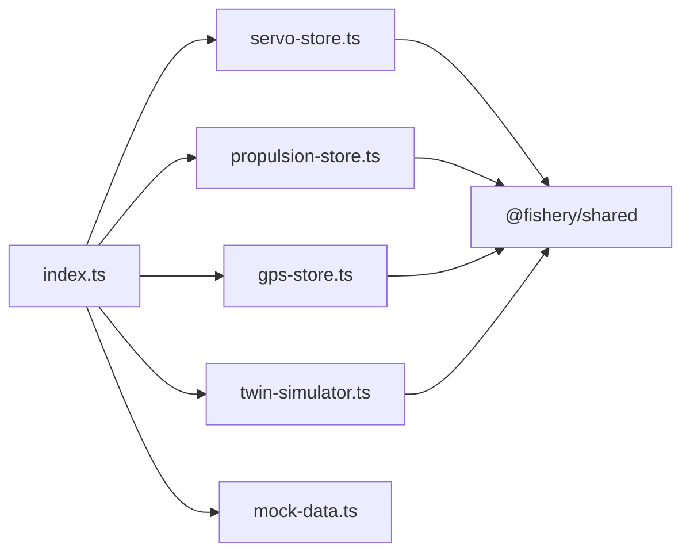

# 设备控制API

<cite>
**本文引用的文件**
- [index.ts](file://fishery-digital-twin-platform/apps/backend/src/index.ts)
- [servo-store.ts](file://fishery-digital-twin-platform/apps/backend/src/servo-store.ts)
- [propulsion-store.ts](file://fishery-digital-twin-platform/apps/backend/src/propulsion-store.ts)
- [gps-store.ts](file://fishery-digital-twin-platform/apps/backend/src/gps-store.ts)
- [twin-simulator.ts](file://fishery-digital-twin-platform/apps/backend/src/twin-simulator.ts)
- [mock-data.ts](file://fishery-digital-twin-platform/apps/backend/src/mock-data.ts)
- [index.ts（共享类型）](file://fishery-digital-twin-platform/packages/shared/src/index.ts)
- [package.json（后端）](file://fishery-digital-twin-platform/apps/backend/package.json)
</cite>

## 目录
1. [简介](#简介)
2. [项目结构](#项目结构)
3. [核心组件](#核心组件)
4. [架构总览](#架构总览)
5. [详细接口说明](#详细接口说明)
6. [依赖关系分析](#依赖关系分析)
7. [性能与限制](#性能与限制)
8. [故障排查指南](#故障排查指南)
9. [结论](#结论)

## 简介
本文件面向设备控制API，覆盖舵机控制、推进器控制、设备状态上报、命令队列与异步处理流程、认证与安全限制、错误处理等。所有POST控制接口默认要求通过X-UISYS-Token进行鉴权；本地回环地址可免令牌访问。系统提供设备状态查询、传感器数据上报、数字孪生推演等辅助接口。

## 项目结构
后端基于Express构建，入口文件集中注册路由、中间件、UDP发现服务与HTTP服务；舵机与推进器分别由独立模块维护设备状态与命令队列；GPS状态与模拟数据由专用模块管理；共享类型定义在packages/shared中。

图表来源
- [index.ts:56-109](file://fishery-digital-twin-platform/apps/backend/src/index.ts#L56-L109)
- [servo-store.ts:1-184](file://fishery-digital-twin-platform/apps/backend/src/servo-store.ts#L1-L184)
- [propulsion-store.ts:1-319](file://fishery-digital-twin-platform/apps/backend/src/propulsion-store.ts#L1-L319)
- [gps-store.ts:1-103](file://fishery-digital-twin-platform/apps/backend/src/gps-store.ts#L1-L103)
- [twin-simulator.ts:1-254](file://fishery-digital-twin-platform/apps/backend/src/twin-simulator.ts#L1-L254)
- [mock-data.ts:1-258](file://fishery-digital-twin-platform/apps/backend/src/mock-data.ts#L1-L258)
- [index.ts（共享类型）:1-288](file://fishery-digital-twin-platform/packages/shared/src/index.ts#L1-L288)

章节来源
- [index.ts:56-109](file://fishery-digital-twin-platform/apps/backend/src/index.ts#L56-L109)
- [package.json（后端）:1-27](file://fishery-digital-twin-platform/apps/backend/package.json#L1-L27)

## 核心组件
- 授权与CORS：统一校验跨域与X-UISYS-Token，支持本地回环免鉴权。
- 舵机存储：维护多块舵机板的目标角度、实际角度、在线状态与命令队列。
- 推进器存储：维护多类推进设备的模式、使能、急停、目标输出与实际输出，并生成命令队列。
- GPS状态：接收GPS上报，计算在线与有效定位。
- 数字孪生：基于当前快照与设备状态进行航路能耗、风险与疲劳评估。
- 模拟数据：为界面与演示提供水质、电池、导航等初始数据。

章节来源
- [index.ts:131-157](file://fishery-digital-twin-platform/apps/backend/src/index.ts#L131-L157)
- [servo-store.ts:17-184](file://fishery-digital-twin-platform/apps/backend/src/servo-store.ts#L17-L184)
- [propulsion-store.ts:30-319](file://fishery-digital-twin-platform/apps/backend/src/propulsion-store.ts#L30-L319)
- [gps-store.ts:8-103](file://fishery-digital-twin-platform/apps/backend/src/gps-store.ts#L8-L103)
- [twin-simulator.ts:74-254](file://fishery-digital-twin-platform/apps/backend/src/twin-simulator.ts#L74-L254)
- [mock-data.ts:114-258](file://fishery-digital-twin-platform/apps/backend/src/mock-data.ts#L114-L258)

## 架构总览
下图展示了从客户端到各存储模块的调用路径，以及命令队列的“下发-拉取”异步机制。

图表来源
- [index.ts:348-538](file://fishery-digital-twin-platform/apps/backend/src/index.ts#L348-L538)
- [servo-store.ts:106-184](file://fishery-digital-twin-platform/apps/backend/src/servo-store.ts#L106-L184)
- [propulsion-store.ts:166-319](file://fishery-digital-twin-platform/apps/backend/src/propulsion-store.ts#L166-L319)
- [gps-store.ts:59-103](file://fishery-digital-twin-platform/apps/backend/src/gps-store.ts#L59-L103)

## 详细接口说明

### 认证与安全限制
- 所有POST控制接口均受授权中间件保护。
- 本地回环地址（127.0.0.1/::1）可跳过令牌校验。
- 若未配置令牌，非回环请求将返回503。
- 令牌通过请求头X-UISYS-Token传递，使用安全比较函数验证。
- CORS按环境变量白名单放行，否则拒绝。

章节来源
- [index.ts:101-109](file://fishery-digital-twin-platform/apps/backend/src/index.ts#L101-L109)
- [index.ts:131-157](file://fishery-digital-twin-platform/apps/backend/src/index.ts#L131-L157)

### 舵机控制
- 设置舵机目标角度
  - 方法：POST /api/servos
  - 鉴权：需要X-UISYS-Token（非回环）
  - 请求体字段
    - device_id：可选，默认第一块舵机板
    - angles：长度为4的数组，每个值0-180整数；或
    - channel：1-4整数，angle：0-180整数（单通道）
  - 取值范围与限制
    - 角度必须为0-180的整数
    - 部分通道被保留（例如某板的第4通道），不可控
    - 设备离线时不会入队命令
  - 响应
    - 201：包含command、device快照、全局servos快照
  - 错误
    - 400：参数非法或设备离线
- 查询设备命令队列
  - 方法：GET /api/device/commands?device_id=...
  - 鉴权：需要X-UISYS-Token（非回环）
  - 行为：返回该设备的有效命令列表（TTL内）
- 上报舵机状态
  - 方法：POST /api/servos/status
  - 鉴权：需要X-UISYS-Token（非回环）
  - 请求体字段
    - device_id：可选
    - angles：长度为4的数组，0-180整数
    - device_name：可选
  - 响应：201 + 设备快照与全局快照

章节来源
- [index.ts:475-503](file://fishery-digital-twin-platform/apps/backend/src/index.ts#L475-L503)
- [servo-store.ts:60-184](file://fishery-digital-twin-platform/apps/backend/src/servo-store.ts#L60-L184)

#### 舵机角度控制流程图

图表来源
- [servo-store.ts:106-153](file://fishery-digital-twin-platform/apps/backend/src/servo-store.ts#L106-L153)

### 推进器控制
- 设置推进器目标
  - 方法：POST /api/propulsion
  - 鉴权：需要X-UISYS-Token（非回环）
  - 请求体字段（任选其一）
    - mode：MANUAL | WEB | AUTO
    - enabled：布尔（WEB模式下需启用才生效）
    - emergency_stop 或 emergencyStop：布尔（急停）
    - throttle：百分比 -100~100
    - steering：百分比 -100~100
    - left_power 或 right_power：直接通道功率百分比 -100~100
    - max_power 或 maxPower：上限百分比 5~100（受设备配置限制）
    - device_id：可选
  - 行为
    - 当mode为WEB且enabled为真且未急停时，才会产生输出
    - 单通道设备仅左侧输出有效
    - 若设备离线且尝试激活输出，会报错
  - 响应：201 + command、device、propulsion快照
  - 错误：400（参数非法或设备离线）
- 查询推进器命令队列
  - 方法：GET /api/propulsion/commands?device_id=...
  - 鉴权：需要X-UISYS-Token（非回环）
  - 行为：返回该设备的有效命令列表（TTL内）
- 上报推进器状态
  - 方法：POST /api/propulsion/status
  - 鉴权：需要X-UISYS-Token（非回环）
  - 请求体字段（可选）
    - device_id、device_name
    - mode、enabled、emergency_stop/emergencyStop
    - rc_online/auto_online
    - actual_left_power/left_power/leftPower
    - actual_right_power/right_power/rightPower
    - runtime_lockout/runtimeLockout
    - cooldown_remaining_ms/cooldownRemainingMs
    - run_active/runActive
    - run_remaining_ms/runRemainingMs
    - cycle_phase/cyclePhase
    - cycle_run_ms/cycleRunMs
    - duty_run_ms/dutyRunMs
    - duty_remaining_ms/dutyRemainingMs
    - round_trip_count/roundTripCount
    - round_trip_limit/roundTripLimit
  - 响应：201 + device、propulsion快照

章节来源
- [index.ts:505-538](file://fishery-digital-twin-platform/apps/backend/src/index.ts#L505-L538)
- [propulsion-store.ts:41-319](file://fishery-digital-twin-platform/apps/backend/src/propulsion-store.ts#L41-L319)

#### 推进器功率调节与急停时序

图表来源
- [propulsion-store.ts:166-231](file://fishery-digital-twin-platform/apps/backend/src/propulsion-store.ts#L166-L231)
- [index.ts:510-523](file://fishery-digital-twin-platform/apps/backend/src/index.ts#L510-L523)

### 设备状态上报
- GPS状态上报
  - 方法：POST /api/gps/status
  - 鉴权：需要X-UISYS-Token（非回环）
  - 请求体字段
    - coordinate_system：固定WGS84
    - serial_online：布尔
    - valid：布尔（需坐标有效）
    - lat/lng：经纬度（-90~90，-180~180）
    - satellites/hdop/altitude_m/speed_mps/heading_deg：数值或空
    - chars_processed：整数
    - device_id：可选
  - 响应：201 + {gps, becameOnline, fixAcquired}
- 传感器数据上报（水质/电池）
  - 方法：POST /api/data
  - 鉴权：需要X-UISYS-Token（非回环）
  - 请求体字段（至少一个）
    - waterTemperature/water_temperature：-5~50
    - turbidity：0~1000
    - ph/pH：0~14
    - dissolvedOxygen/dissolved_oxygen/do：0~30
    - ammoniaNitrogen/ammonia_nitrogen/nh3：0~100
    - conductivity/ec：0~200000
    - batteryPercent/battery_percent：0~100
  - 响应：201 + {message, packet, snapshot}
- 设备在线状态查询
  - 方法：GET /api/vessel、/api/servos、/api/propulsion、/api/gps
  - 无需鉴权（只读）

章节来源
- [index.ts:348-430](file://fishery-digital-twin-platform/apps/backend/src/index.ts#L348-L430)
- [gps-store.ts:59-103](file://fishery-digital-twin-platform/apps/backend/src/gps-store.ts#L59-L103)

### 数字孪生推演
- 方法：POST /api/twin/simulate
- 鉴权：需要X-UISYS-Token（非回环）
- 输入字段
  - routeDistanceKm：0.2~20
  - targetSpeedMps：0.2~3
  - waveLevel：calm|moderate|rough
  - faultType：servo-stuck|motor-derate|feedback-loss
  - faultSeverity：10~100
  - operatingHours：0~30000
  - dailyServoCycles：10~10000
- 响应：201 + 航路预测、故障预测、疲劳评估、置信度与假设

章节来源
- [index.ts:540-555](file://fishery-digital-twin-platform/apps/backend/src/index.ts#L540-L555)
- [twin-simulator.ts:35-254](file://fishery-digital-twin-platform/apps/backend/src/twin-simulator.ts#L35-L254)

### 其他只读接口
- 健康检查：GET /api/health
- 平台快照：GET /api/snapshot
- 水质历史：GET /api/water
- 电池：GET /api/batteries
- 导航/GPS：GET /api/navigation、/api/gps
- AI报告：GET /api/ai/report、POST /api/ai/report（限频）
- 日志：GET /api/logs

章节来源
- [index.ts:322-347](file://fishery-digital-twin-platform/apps/backend/src/index.ts#L322-L347)
- [index.ts:447-473](file://fishery-digital-twin-platform/apps/backend/src/index.ts#L447-L473)
- [index.ts:557-561](file://fishery-digital-twin-platform/apps/backend/src/index.ts#L557-L561)

## 依赖关系分析
- 路由层（index.ts）负责鉴权、参数校验、日志记录与持久化调度，并委托具体存储模块执行业务逻辑。
- 舵机与推进器存储各自维护设备Map与命令队列，提供快照、设置目标、状态更新与命令拉取能力。
- GPS存储维护单一设备状态，提供更新与快照。
- 数字孪生依赖共享类型与当前快照、设备状态进行计算。
- 模拟数据用于初始化与演示。

图表来源
- [index.ts:21-44](file://fishery-digital-twin-platform/apps/backend/src/index.ts#L21-L44)
- [servo-store.ts:1-184](file://fishery-digital-twin-platform/apps/backend/src/servo-store.ts#L1-L184)
- [propulsion-store.ts:1-319](file://fishery-digital-twin-platform/apps/backend/src/propulsion-store.ts#L1-L319)
- [gps-store.ts:1-103](file://fishery-digital-twin-platform/apps/backend/src/gps-store.ts#L1-L103)
- [twin-simulator.ts:1-254](file://fishery-digital-twin-platform/apps/backend/src/twin-simulator.ts#L1-L254)
- [index.ts（共享类型）:1-288](file://fishery-digital-twin-platform/packages/shared/src/index.ts#L1-L288)

章节来源
- [index.ts:21-44](file://fishery-digital-twin-platform/apps/backend/src/index.ts#L21-L44)

## 性能与限制
- 命令队列TTL
  - 舵机命令：约2.5秒过期
  - 推进器命令：约2.5秒过期
- 设备在线判定
  - 舵机：last_seen超过10秒视为离线
  - 推进器：last_seen超过10秒视为离线；web_online以target.updated_at为准
- 传感器新鲜度
  - 水质数据超过阈值视为不新鲜，影响整体设备在线判断
- 速率限制
  - AI报告生成每分钟最多一次
- 数据量限制
  - 请求体大小限制为1MB
- 端口与发现
  - HTTP端口与环境变量PORT相关
  - UDP发现端口默认42110，周期性广播后端信息

章节来源
- [servo-store.ts:5-6](file://fishery-digital-twin-platform/apps/backend/src/servo-store.ts#L5-L6)
- [propulsion-store.ts:6-7](file://fishery-digital-twin-platform/apps/backend/src/propulsion-store.ts#L6-L7)
- [index.ts:64-68](file://fishery-digital-twin-platform/apps/backend/src/index.ts#L64-L68)
- [index.ts:456-473](file://fishery-digital-twin-platform/apps/backend/src/index.ts#L456-L473)
- [index.ts:110](file://fishery-digital-twin-platform/apps/backend/src/index.ts#L110)
- [index.ts:59-63](file://fishery-digital-twin-platform/apps/backend/src/index.ts#L59-L63)

## 故障排查指南
- 401 未授权
  - 原因：缺少或错误的X-UISYS-Token
  - 处理：确认环境变量已配置令牌，并在请求头携带正确令牌
- 503 服务不可用
  - 原因：未配置令牌且非回环请求
  - 处理：配置UISYS_API_TOKEN或使用回环地址测试
- 400 参数错误
  - 原因：角度、通道、功率等超出范围或格式不正确
  - 处理：核对字段类型与取值范围，确保数组长度与数值合法
- 设备离线
  - 原因：长时间未上报状态
  - 处理：确保设备定时上报状态，保持last_seen刷新
- CORS错误
  - 原因：来源不在白名单
  - 处理：配置CORS_ORIGIN环境变量，包含前端域名

章节来源
- [index.ts:143-157](file://fishery-digital-twin-platform/apps/backend/src/index.ts#L143-L157)
- [index.ts:559-561](file://fishery-digital-twin-platform/apps/backend/src/index.ts#L559-L561)
- [servo-store.ts:106-132](file://fishery-digital-twin-platform/apps/backend/src/servo-store.ts#L106-L132)
- [propulsion-store.ts:166-180](file://fishery-digital-twin-platform/apps/backend/src/propulsion-store.ts#L166-L180)
- [gps-store.ts:59-75](file://fishery-digital-twin-platform/apps/backend/src/gps-store.ts#L59-L75)

## 结论
本设备控制API通过统一的授权中间件保障LAN控制安全，提供舵机角度控制、推进器功率调节与急停、设备状态上报与查询、数字孪生推演等能力。命令队列采用短TTL机制，配合设备状态上报实现可靠的异步控制闭环。建议在生产环境严格配置X-UISYS-Token与CORS白名单，并确保设备按时上报状态以避免误判离线。