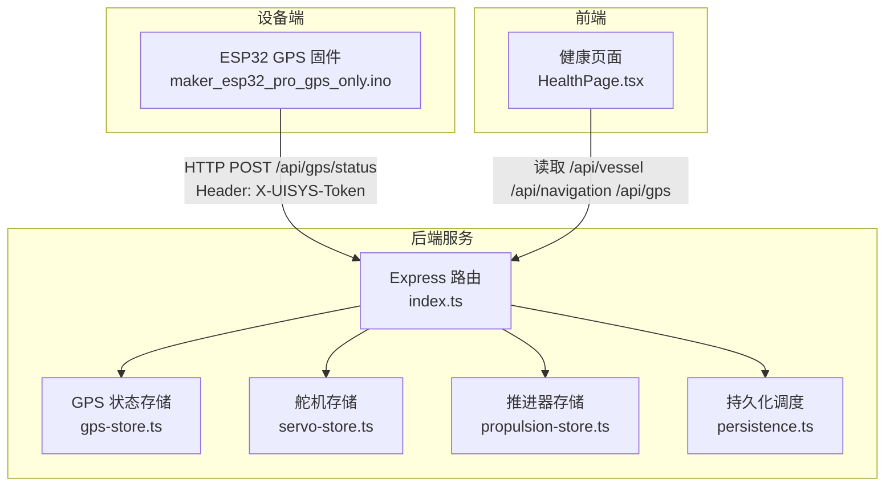
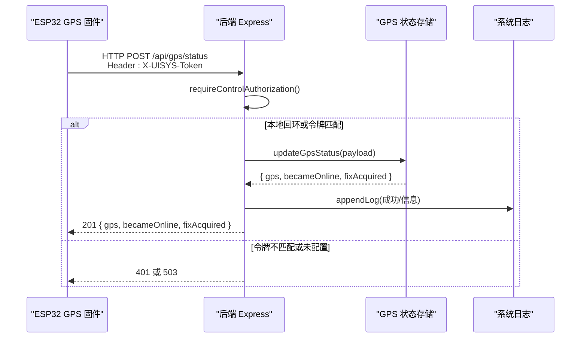
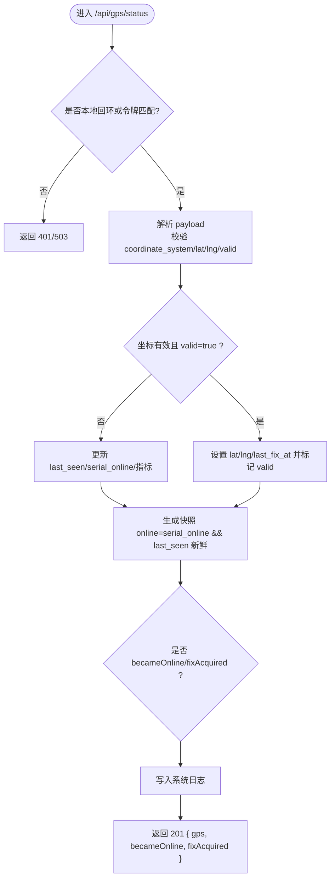
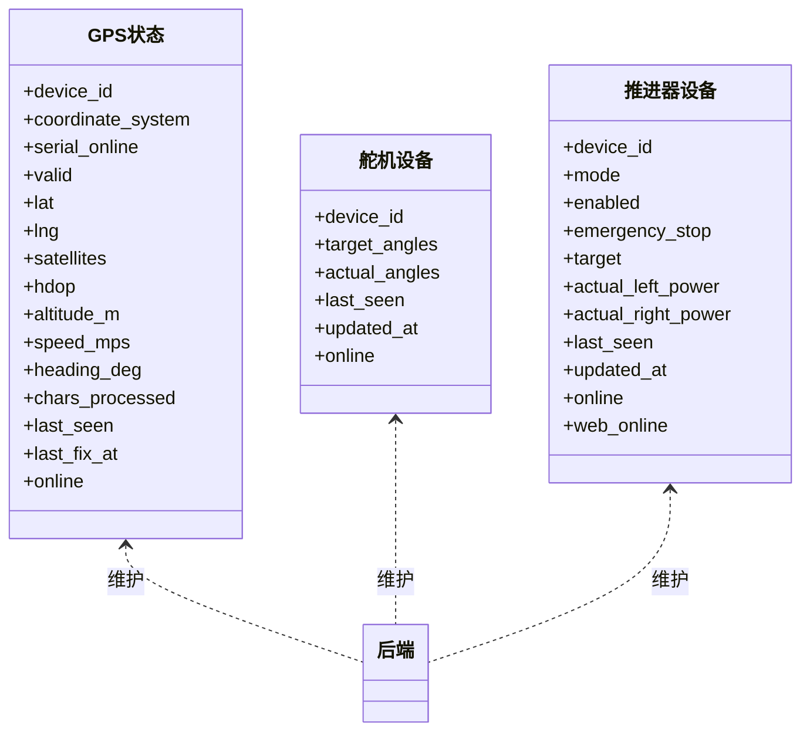
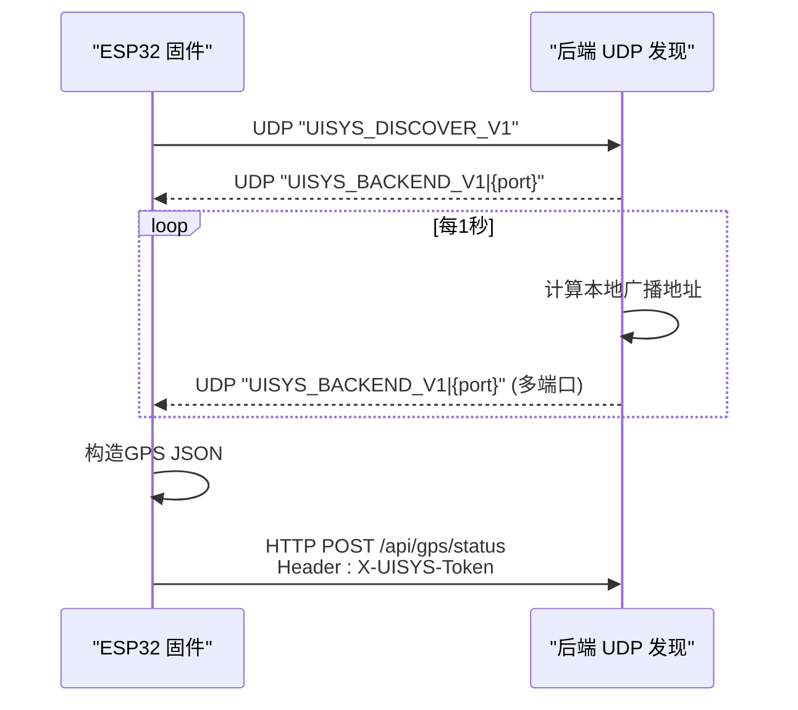
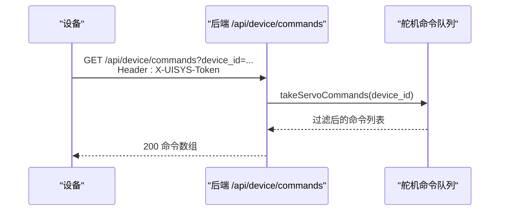
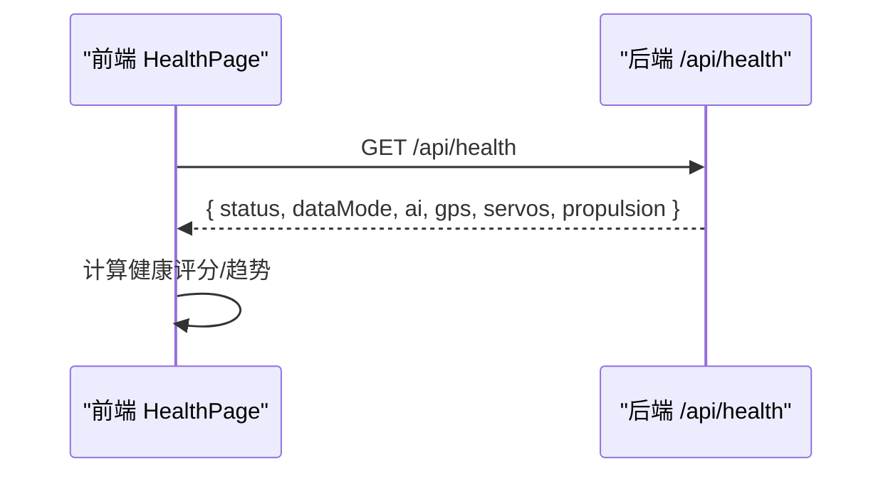
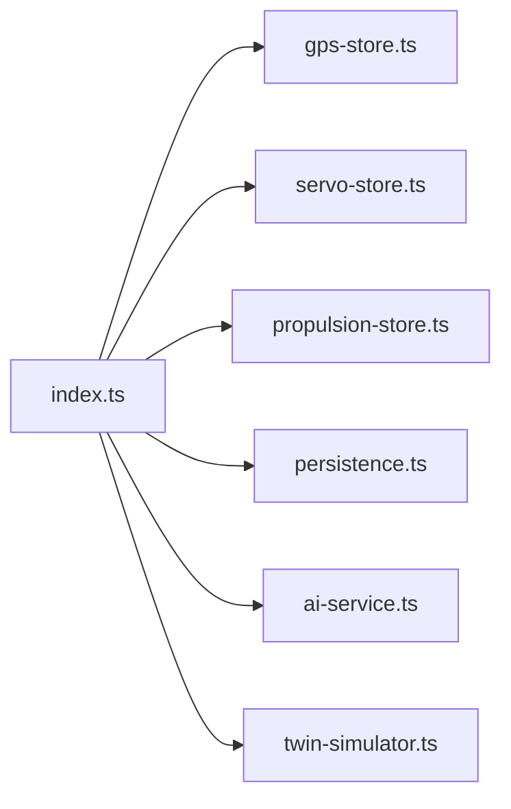

# 设备状态API

<cite>
**本文引用的文件**
- [index.ts](file://fishery-digital-twin-platform/apps/backend/src/index.ts)
- [gps-store.ts](file://fishery-digital-twin-platform/apps/backend/src/gps-store.ts)
- [persistence.ts](file://fishery-digital-twin-platform/apps/backend/src/persistence.ts)
- [servo-store.ts](file://fishery-digital-twin-platform/apps/backend/src/servo-store.ts)
- [propulsion-store.ts](file://fishery-digital-twin-platform/apps/backend/src/propulsion-store.ts)
- [HealthPage.tsx](file://fishery-digital-twin-platform/apps/frontend/src/components/dashboard/HealthPage.tsx)
- [maker_esp32_pro_gps_only.ino](file://fishery-digital-twin-platform/firmware/esp32/maker_esp32_pro_gps_only/maker_esp32_pro_gps_only.ino)
</cite>

## 目录
1. [简介](#简介)
2. [项目结构](#项目结构)
3. [核心组件](#核心组件)
4. [架构总览](#架构总览)
5. [详细组件分析](#详细组件分析)
6. [依赖关系分析](#依赖关系分析)
7. [性能与可靠性](#性能与可靠性)
8. [故障排查指南](#故障排查指南)
9. [结论](#结论)
10. [附录：接口清单与数据模型](#附录接口清单与数据模型)

## 简介
本文件面向设备状态管理API，覆盖GPS状态更新、设备在线检测、通信状态监控、设备发现服务、设备命令获取与健康检查等能力。重点说明POST /api/gps/status的认证机制（X-UISYS-Token）、GPS数据格式与定位精度验证；记录设备状态上报的数据结构与心跳机制；解释设备发现服务的UDP广播协议；提供GET /api/device/commands的使用方法；并总结连接状态管理、故障恢复与系统健康检查的实现要点。

## 项目结构
后端基于Express提供REST API，使用内存存储维护GPS、舵机、推进器等设备状态，并通过UDP实现局域网设备发现。前端通过健康页聚合快照与反馈进行可视化展示。固件侧ESP32定时上报GPS状态到后端。

图表来源
- [index.ts:271-318](file://fishery-digital-twin-platform/apps/backend/src/index.ts#L271-L318)
- [gps-store.ts:46-57](file://fishery-digital-twin-platform/apps/backend/src/gps-store.ts#L46-L57)
- [servo-store.ts:89-103](file://fishery-digital-twin-platform/apps/backend/src/servo-store.ts#L89-L103)
- [propulsion-store.ts:149-163](file://fishery-digital-twin-platform/apps/backend/src/propulsion-store.ts#L149-L163)
- [persistence.ts:51-58](file://fishery-digital-twin-platform/apps/backend/src/persistence.ts#L51-L58)
- [maker_esp32_pro_gps_only.ino:313-365](file://fishery-digital-twin-platform/firmware/esp32/maker_esp32_pro_gps_only/maker_esp32_pro_gps_only.ino#L313-L365)

章节来源
- [index.ts:56-110](file://fishery-digital-twin-platform/apps/backend/src/index.ts#L56-L110)
- [index.ts:271-318](file://fishery-digital-twin-platform/apps/backend/src/index.ts#L271-L318)
- [persistence.ts:12-16](file://fishery-digital-twin-platform/apps/backend/src/persistence.ts#L12-L16)

## 核心组件
- 认证与鉴权：对控制类接口统一校验X-UISYS-Token，本地回环地址可绕过；未配置令牌时拒绝LAN控制请求。
- GPS状态管理：接收GPS上报，校验坐标范围与有效性，维护在线/有效状态与最近更新时间。
- 设备在线与通信状态：综合GPS、舵机、推进器、传感器的心跳时间判定设备与通信链路是否在线。
- 设备发现服务：UDP广播监听与响应，支持客户端端口列表与周期性公告。
- 命令队列：舵机与推进器命令入队，按TTL清理，供设备轮询拉取。
- 健康检查：/api/health返回服务、AI、GPS、舵机、推进器等多维状态。

章节来源
- [index.ts:136-157](file://fishery-digital-twin-platform/apps/backend/src/index.ts#L136-L157)
- [gps-store.ts:59-102](file://fishery-digital-twin-platform/apps/backend/src/gps-store.ts#L59-L102)
- [index.ts:228-245](file://fishery-digital-twin-platform/apps/backend/src/index.ts#L228-L245)
- [index.ts:271-318](file://fishery-digital-twin-platform/apps/backend/src/index.ts#L271-L318)
- [servo-store.ts:175-183](file://fishery-digital-twin-platform/apps/backend/src/servo-store.ts#L175-L183)
- [propulsion-store.ts:310-318](file://fishery-digital-twin-platform/apps/backend/src/propulsion-store.ts#L310-L318)
- [index.ts:322-334](file://fishery-digital-twin-platform/apps/backend/src/index.ts#L322-L334)

## 架构总览
后端作为中心节点，接收来自ESP32设备的HTTP上报与UDP发现请求，维护各子系统状态，并提供统一的查询与控制接口。前端通过健康页聚合数据，辅助运维与诊断。

图表来源
- [index.ts:143-157](file://fishery-digital-twin-platform/apps/backend/src/index.ts#L143-L157)
- [index.ts:348-365](file://fishery-digital-twin-platform/apps/backend/src/index.ts#L348-L365)
- [gps-store.ts:59-102](file://fishery-digital-twin-platform/apps/backend/src/gps-store.ts#L59-L102)
- [maker_esp32_pro_gps_only.ino:313-365](file://fishery-digital-twin-platform/firmware/esp32/maker_esp32_pro_gps_only/maker_esp32_pro_gps_only.ino#L313-L365)

## 详细组件分析

### GPS状态更新接口 POST /api/gps/status
- 认证机制
  - 非本地回环请求必须携带X-UISYS-Token，且需与服务器配置的UISYS_API_TOKEN一致；否则返回401。
  - 若未配置令牌，则直接返回503提示必须先配置令牌。
- 数据格式与校验
  - coordinate_system仅支持WGS84。
  - lat/lng为可选数值，需在[-90,90]与[-180,180]范围内；valid为true时才视为有效定位。
  - 其他字段如satellites、hdop、altitude_m、speed_mps、heading_deg、chars_processed为可选数值/整数。
  - last_seen每次收到上报都会刷新；last_fix_at仅在有效定位时更新。
- 返回值
  - gps：当前GPS状态快照（包含online/valid及各项指标）。
  - becameOnline：由离线变为在线的事件标志。
  - fixAcquired：由无效变为有效的定位事件标志。
- 错误处理
  - 坐标越界或coordinate_system非法将返回400与错误消息。

图表来源
- [index.ts:143-157](file://fishery-digital-twin-platform/apps/backend/src/index.ts#L143-L157)
- [index.ts:348-365](file://fishery-digital-twin-platform/apps/backend/src/index.ts#L348-L365)
- [gps-store.ts:59-102](file://fishery-digital-twin-platform/apps/backend/src/gps-store.ts#L59-L102)

章节来源
- [index.ts:136-157](file://fishery-digital-twin-platform/apps/backend/src/index.ts#L136-L157)
- [index.ts:348-365](file://fishery-digital-twin-platform/apps/backend/src/index.ts#L348-L365)
- [gps-store.ts:59-102](file://fishery-digital-twin-platform/apps/backend/src/gps-store.ts#L59-L102)

### 设备状态上报与心跳机制
- 设备在线判定
  - GPS：当serial_online为真且last_seen在10秒内，视为online；valid需同时满足online与内部valid标志。
  - 舵机/推进器：以last_seen在10秒内判定online；web_online以目标更新时间在2.5秒内判定。
- 通信链路状态
  - 综合GPS、舵机、推进器、传感器的心跳判断communication与esp32整体在线性。
- 传感器数据上报
  - /api/data接收水质、电池等指标，自动计算状态并更新历史；同时刷新lastRealWaterAt用于传感器在线判定。

图表来源
- [gps-store.ts:8-23](file://fishery-digital-twin-platform/apps/backend/src/gps-store.ts#L8-L23)
- [servo-store.ts:24-34](file://fishery-digital-twin-platform/apps/backend/src/servo-store.ts#L24-L34)
- [propulsion-store.ts:97-130](file://fishery-digital-twin-platform/apps/backend/src/propulsion-store.ts#L97-L130)
- [index.ts:228-245](file://fishery-digital-twin-platform/apps/backend/src/index.ts#L228-L245)

章节来源
- [gps-store.ts:40-57](file://fishery-digital-twin-platform/apps/backend/src/gps-store.ts#L40-L57)
- [servo-store.ts:43-58](file://fishery-digital-twin-platform/apps/backend/src/servo-store.ts#L43-L58)
- [propulsion-store.ts:82-147](file://fishery-digital-twin-platform/apps/backend/src/propulsion-store.ts#L82-L147)
- [index.ts:228-245](file://fishery-digital-twin-platform/apps/backend/src/index.ts#L228-L245)

### 设备发现服务与网络通信协议
- 协议概述
  - UDP广播：服务端监听指定端口（默认42110），接收“UISYS_DISCOVER_V1”或前缀匹配的请求，回复“UISYS_BACKEND_V1|{port}”。
  - 周期性公告：每1秒向本机所有网卡的广播地址的多个客户端端口（42111-42114）发送公告。
- 工作原理
  - 启动时绑定UDP端口并启用广播；监听消息后原路回复；异常时根据错误码决定是否退出进程。
- 固件侧行为
  - ESP32固件定期调用reportGpsStatus，先确保后端已发现，再构造JSON并POST到/api/gps/status，附带X-UISYS-Token。

图表来源
- [index.ts:59-63](file://fishery-digital-twin-platform/apps/backend/src/index.ts#L59-L63)
- [index.ts:271-318](file://fishery-digital-twin-platform/apps/backend/src/index.ts#L271-L318)
- [maker_esp32_pro_gps_only.ino:313-365](file://fishery-digital-twin-platform/firmware/esp32/maker_esp32_pro_gps_only/maker_esp32_pro_gps_only.ino#L313-L365)

章节来源
- [index.ts:271-318](file://fishery-digital-twin-platform/apps/backend/src/index.ts#L271-L318)
- [maker_esp32_pro_gps_only.ino:313-365](file://fishery-digital-twin-platform/firmware/esp32/maker_esp32_pro_gps_only/maker_esp32_pro_gps_only.ino#L313-L365)

### 设备命令获取接口 GET /api/device/commands
- 用途：设备轮询拉取待执行的舵机命令队列。
- 认证：需要X-UISYS-Token（同其他控制接口）。
- 参数：可选device_id，用于指定设备。
- 行为：返回该设备命令队列中未过期的命令（TTL 2.5秒），并清理过期项。
- 典型流程：设备启动后先发现后端，再周期性调用此接口消费命令。

图表来源
- [index.ts:500-503](file://fishery-digital-twin-platform/apps/backend/src/index.ts#L500-L503)
- [servo-store.ts:175-183](file://fishery-digital-twin-platform/apps/backend/src/servo-store.ts#L175-L183)

章节来源
- [index.ts:500-503](file://fishery-digital-twin-platform/apps/backend/src/index.ts#L500-L503)
- [servo-store.ts:175-183](file://fishery-digital-twin-platform/apps/backend/src/servo-store.ts#L175-L183)

### 系统健康检查与前端健康页
- 后端健康端点：/api/health返回服务状态、数据模式、持久化开关、AI状态、GPS、舵机、推进器快照。
- 前端健康页：聚合快照与反馈，计算健康评分与趋势，辅助运维决策。

图表来源
- [index.ts:322-334](file://fishery-digital-twin-platform/apps/backend/src/index.ts#L322-L334)
- [HealthPage.tsx:30-46](file://fishery-digital-twin-platform/apps/frontend/src/components/dashboard/HealthPage.tsx#L30-L46)

章节来源
- [index.ts:322-334](file://fishery-digital-twin-platform/apps/backend/src/index.ts#L322-L334)
- [HealthPage.tsx:30-46](file://fishery-digital-twin-platform/apps/frontend/src/components/dashboard/HealthPage.tsx#L30-L46)

## 依赖关系分析
- 模块耦合
  - index.ts依赖gps-store、servo-store、propulsion-store、persistence、ai-service、twin-simulator。
  - 各store独立维护设备状态与命令队列，通过统一入口暴露快照与更新方法。
- 外部依赖
  - Express、CORS、dotenv、Node内置模块（crypto、dgram、os、fs、path）。
- 潜在循环依赖
  - 当前无直接循环导入；store之间相互独立。

图表来源
- [index.ts:21-44](file://fishery-digital-twin-platform/apps/backend/src/index.ts#L21-L44)

章节来源
- [index.ts:21-44](file://fishery-digital-twin-platform/apps/backend/src/index.ts#L21-L44)

## 性能与可靠性
- 性能
  - 内存状态读写为O(1)，命令队列按TTL过滤，避免无限增长。
  - 持久化采用延迟写（250ms节流）与临时文件原子替换，降低IO抖动。
- 可靠性
  - 心跳超时：GPS 10s、舵机/推进器10s/2.5s，快速失效检测。
  - 发现服务异常：端口占用或权限不足时主动退出，便于容器编排重启。
  - 安全：控制接口强制令牌校验，本地回环例外便于调试。

[本节为通用指导，无需特定文件引用]

## 故障排查指南
- 401/503错误
  - 确认X-UISYS-Token与服务器UISYS_API_TOKEN一致；若未配置令牌，需先设置环境变量。
- GPS未上线
  - 检查serial_online是否为真；确认last_seen是否在10秒内；确认坐标范围与valid标志。
- 命令未执行
  - 确认设备能拉取到命令；检查命令TTL是否过期；确认设备在线（last_seen新鲜）。
- 发现失败
  - 检查UDP端口是否被占用；确认防火墙允许广播；确认固件正确发送请求与接收回复。

章节来源
- [index.ts:143-157](file://fishery-digital-twin-platform/apps/backend/src/index.ts#L143-L157)
- [index.ts:305-318](file://fishery-digital-twin-platform/apps/backend/src/index.ts#L305-L318)
- [gps-store.ts:40-57](file://fishery-digital-twin-platform/apps/backend/src/gps-store.ts#L40-L57)
- [servo-store.ts:175-183](file://fishery-digital-twin-platform/apps/backend/src/servo-store.ts#L175-L183)
- [propulsion-store.ts:310-318](file://fishery-digital-twin-platform/apps/backend/src/propulsion-store.ts#L310-L318)

## 结论
本系统通过统一的认证与状态管理，实现了GPS定位、设备在线检测、通信链路监控、设备发现与命令下发等关键能力。GPS接口严格校验坐标与有效性，结合心跳机制保障状态准确性；UDP发现简化了局域网设备接入；健康检查与日志记录提升了可观测性与可维护性。建议在生产环境务必配置令牌、合理调优心跳阈值与持久化策略，并结合前端健康页进行持续监控。

[本节为总结，无需特定文件引用]

## 附录：接口清单与数据模型

- 认证与鉴权
  - 控制类接口需携带X-UISYS-Token；本地回环可跳过；未配置令牌时返回503。
- GPS相关
  - POST /api/gps/status：上传GPS状态，返回gps/becameOnline/fixAcquired。
  - GET /api/gps：获取当前GPS快照。
  - GET /api/navigation：导航信息中包含GPS位置与航速航向。
- 设备与通信
  - GET /api/vessel：设备与通信在线状态。
  - GET /api/servos、POST /api/servos、POST /api/servos/status：舵机状态与命令。
  - GET /api/propulsion、POST /api/propulsion、POST /api/propulsion/status：推进器状态与命令。
  - GET /api/device/commands：拉取舵机命令队列。
  - GET /api/propulsion/commands：拉取推进器命令队列。
- 数据与仿真
  - GET /api/water：水质历史。
  - GET /api/batteries：电池数据。
  - POST /api/data：传感器数据上报。
  - POST /api/demo/simulate：生成演示数据。
  - POST /api/twin/simulate：数字孪生推演。
- 健康与日志
  - GET /api/health：服务健康检查。
  - GET /api/logs：系统日志。

章节来源
- [index.ts:322-557](file://fishery-digital-twin-platform/apps/backend/src/index.ts#L322-L557)
- [gps-store.ts:59-102](file://fishery-digital-twin-platform/apps/backend/src/gps-store.ts#L59-L102)
- [servo-store.ts:89-183](file://fishery-digital-twin-platform/apps/backend/src/servo-store.ts#L89-L183)
- [propulsion-store.ts:149-318](file://fishery-digital-twin-platform/apps/backend/src/propulsion-store.ts#L149-L318)
- [persistence.ts:32-68](file://fishery-digital-twin-platform/apps/backend/src/persistence.ts#L32-L68)