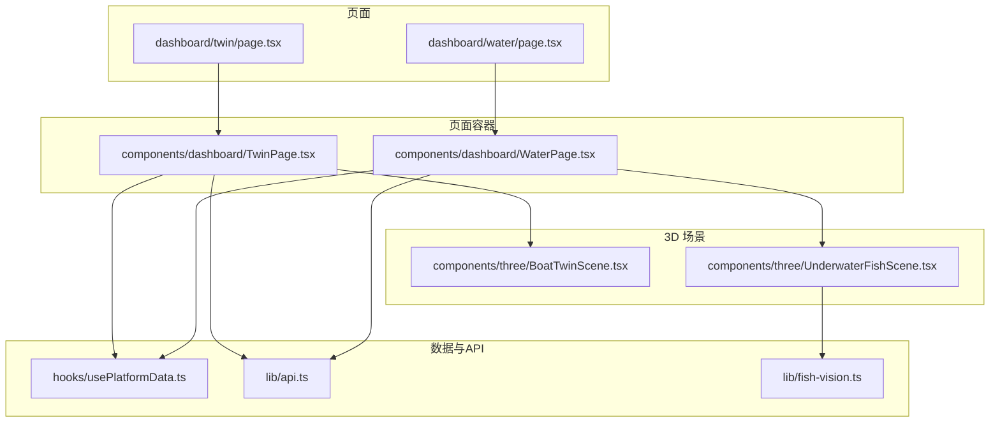
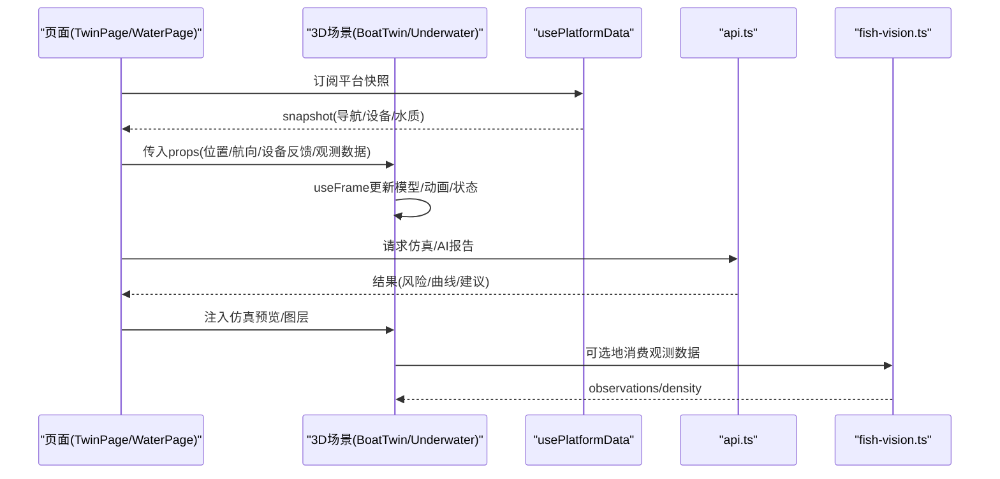
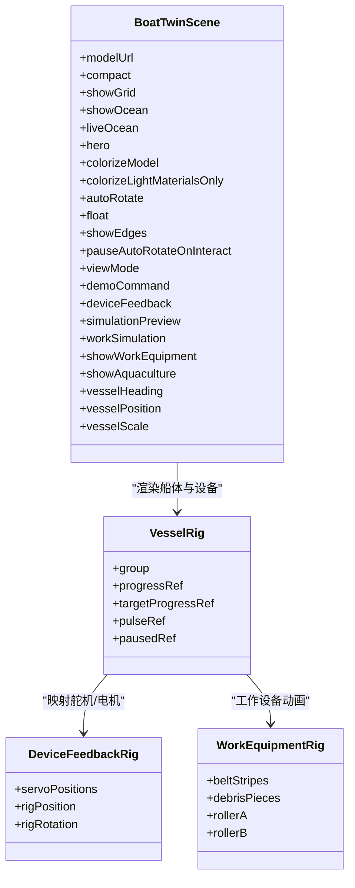
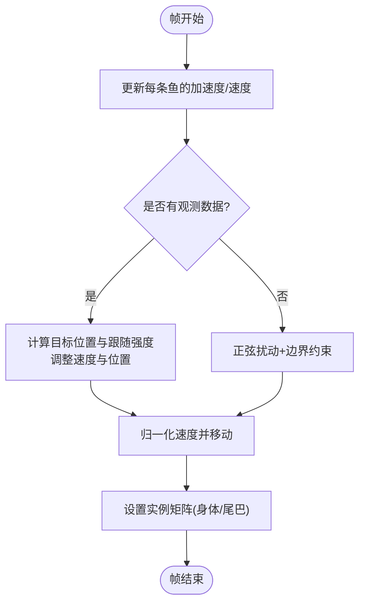
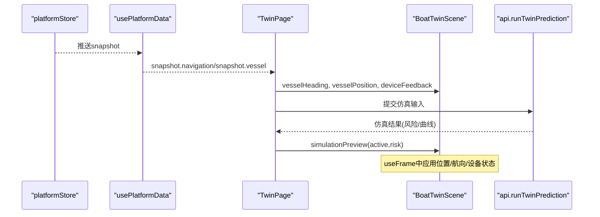
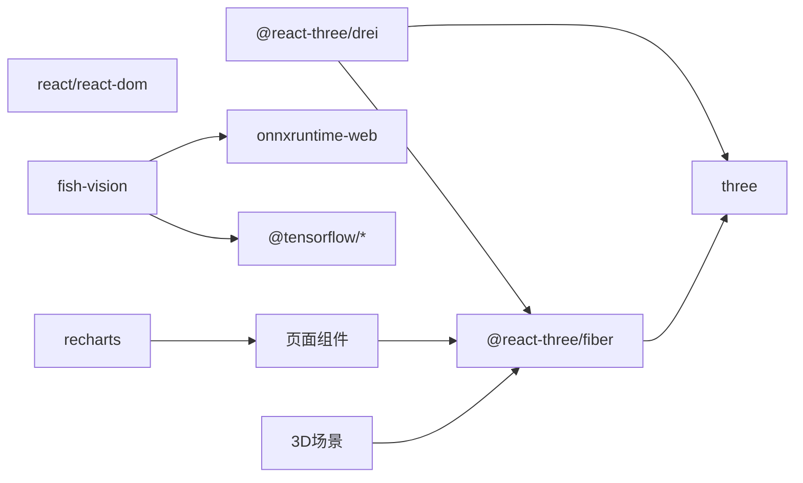

# 3D可视化系统

<cite>
**本文引用的文件**
- [BoatTwinScene.tsx](file://fishery-digital-twin-platform/apps/frontend/src/components/three/BoatTwinScene.tsx)
- [UnderwaterFishScene.tsx](file://fishery-digital-twin-platform/apps/frontend/src/components/three/UnderwaterFishScene.tsx)
- [TwinPage.tsx](file://fishery-digital-twin-platform/apps/frontend/src/components/dashboard/TwinPage.tsx)
- [WaterPage.tsx](file://fishery-digital-twin-platform/apps/frontend/src/components/dashboard/WaterPage.tsx)
- [page.tsx（数字孪生）](file://fishery-digital-twin-platform/apps/frontend/src/app/dashboard/twin/page.tsx)
- [page.tsx（水域监测）](file://fishery-digital-twin-platform/apps/frontend/src/app/dashboard/water/page.tsx)
- [usePlatformData.ts](file://fishery-digital-twin-platform/apps/frontend/src/hooks/usePlatformData.ts)
- [api.ts](file://fishery-digital-twin-platform/apps/frontend/src/lib/api.ts)
- [fish-vision.ts](file://fishery-digital-twin-platform/apps/frontend/src/lib/fish-vision.ts)
- [package.json](file://fishery-digital-twin-platform/apps/frontend/package.json)
</cite>

## 目录
1. [简介](#简介)
2. [项目结构](#项目结构)
3. [核心组件](#核心组件)
4. [架构总览](#架构总览)
5. [详细组件分析](#详细组件分析)
6. [依赖关系分析](#依赖关系分析)
7. [性能考虑](#性能考虑)
8. [故障排查指南](#故障排查指南)
9. [结论](#结论)
10. [附录](#附录)

## 简介
本系统基于 Three.js 与 React Three Fiber/Drei，构建面向渔业数字孪生的 3D 可视化平台。重点包含：
- 船模场景（BoatTwinScene）：加载 GLTF 模型、材质着色、光照配置、动画与设备反馈映射。
- 水下场景（UnderwaterFishScene）：水体效果、鱼群实例化渲染、动态环境模拟与视觉观测数据驱动。
- 实时数据同步：姿态更新、位置跟踪、状态映射到 3D 对象。
- 用户交互：视角控制、对象选择与操作反馈。
- 性能优化：模型与渲染优化、内存管理与帧率控制。

## 项目结构
前端采用 Next.js + React 组织页面与组件，Three.js 相关逻辑集中在 components/three 下；页面路由通过 app/dashboard 下的 page.tsx 挂载具体页面组件；数据层通过 hooks 与 lib 模块统一获取平台快照与仿真结果。

图表来源
- [page.tsx（数字孪生）:1-6](file://fishery-digital-twin-platform/apps/frontend/src/app/dashboard/twin/page.tsx#L1-L6)
- [page.tsx（水域监测）:1-6](file://fishery-digital-twin-platform/apps/frontend/src/app/dashboard/water/page.tsx#L1-L6)
- [TwinPage.tsx:1-120](file://fishery-digital-twin-platform/apps/frontend/src/components/dashboard/TwinPage.tsx#L1-L120)
- [WaterPage.tsx:1-120](file://fishery-digital-twin-platform/apps/frontend/src/components/dashboard/WaterPage.tsx#L1-L120)
- [BoatTwinScene.tsx:1-120](file://fishery-digital-twin-platform/apps/frontend/src/components/three/BoatTwinScene.tsx#L1-L120)
- [UnderwaterFishScene.tsx:1-90](file://fishery-digital-twin-platform/apps/frontend/src/components/three/UnderwaterFishScene.tsx#L1-L90)
- [usePlatformData.ts:1-24](file://fishery-digital-twin-platform/apps/frontend/src/hooks/usePlatformData.ts#L1-L24)
- [api.ts:1-101](file://fishery-digital-twin-platform/apps/frontend/src/lib/api.ts#L1-L101)
- [fish-vision.ts:1-40](file://fishery-digital-twin-platform/apps/frontend/src/lib/fish-vision.ts#L1-L40)

章节来源
- [page.tsx（数字孪生）:1-6](file://fishery-digital-twin-platform/apps/frontend/src/app/dashboard/twin/page.tsx#L1-L6)
- [page.tsx（水域监测）:1-6](file://fishery-digital-twin-platform/apps/frontend/src/app/dashboard/water/page.tsx#L1-L6)
- [TwinPage.tsx:1-120](file://fishery-digital-twin-platform/apps/frontend/src/components/dashboard/TwinPage.tsx#L1-L120)
- [WaterPage.tsx:1-120](file://fishery-digital-twin-platform/apps/frontend/src/components/dashboard/WaterPage.tsx#L1-L120)

## 核心组件
- BoatTwinScene：负责船体模型加载、材质与光照、水面与网格、设备反馈可视化（舵机、电机、线性推杆、相机云台）、演示轨迹与尾迹粒子等。
- UnderwaterFishScene：负责水下世界构建（背景、雾、光照、水面、海底、悬浮粒子）、鱼群实例化运动与跟随视觉观测数据。
- TwinPage/WaterPage：页面级容器，集成 3D 场景、图表、控制面板与数据流。
- usePlatformData：统一订阅平台快照，保证多组件数据一致性。
- api：封装后端接口调用（平台快照、仿真预测、AI报告等）。
- fish-vision：前端视频帧运动检测与密度估计，输出鱼群观测数据。

章节来源
- [BoatTwinScene.tsx:1-120](file://fishery-digital-twin-platform/apps/frontend/src/components/three/BoatTwinScene.tsx#L1-L120)
- [UnderwaterFishScene.tsx:1-90](file://fishery-digital-twin-platform/apps/frontend/src/components/three/UnderwaterFishScene.tsx#L1-L90)
- [TwinPage.tsx:1-120](file://fishery-digital-twin-platform/apps/frontend/src/components/dashboard/TwinPage.tsx#L1-L120)
- [WaterPage.tsx:1-120](file://fishery-digital-twin-platform/apps/frontend/src/components/dashboard/WaterPage.tsx#L1-L120)
- [usePlatformData.ts:1-24](file://fishery-digital-twin-platform/apps/frontend/src/hooks/usePlatformData.ts#L1-L24)
- [api.ts:1-101](file://fishery-digital-twin-platform/apps/frontend/src/lib/api.ts#L1-L101)
- [fish-vision.ts:1-40](file://fishery-digital-twin-platform/apps/frontend/src/lib/fish-vision.ts#L1-L40)

## 架构总览
系统以 React 页面为入口，通过动态导入加载 3D 场景组件；场景内部使用 R3F 的 Canvas、useFrame、OrbitControls 等能力完成渲染循环与交互；数据通过 usePlatformData 与 api 模块拉取并驱动场景更新；水下场景结合 fish-vision 将视觉检测结果映射为鱼群行为。

图表来源
- [TwinPage.tsx:80-160](file://fishery-digital-twin-platform/apps/frontend/src/components/dashboard/TwinPage.tsx#L80-L160)
- [WaterPage.tsx:140-220](file://fishery-digital-twin-platform/apps/frontend/src/components/dashboard/WaterPage.tsx#L140-L220)
- [usePlatformData.ts:1-24](file://fishery-digital-twin-platform/apps/frontend/src/hooks/usePlatformData.ts#L1-L24)
- [api.ts:26-101](file://fishery-digital-twin-platform/apps/frontend/src/lib/api.ts#L26-L101)
- [UnderwaterFishScene.tsx:90-250](file://fishery-digital-twin-platform/apps/frontend/src/components/three/UnderwaterFishScene.tsx#L90-L250)
- [fish-vision.ts:41-224](file://fishery-digital-twin-platform/apps/frontend/src/lib/fish-vision.ts#L41-L224)

## 详细组件分析

### 船模场景（BoatTwinScene）
- 模型加载与回退：优先加载 GLTF 模型，不可用时提供程序化船体几何作为占位。
- 材质与光照：支持颜色化模式与仅高亮材质模式；内置多种光源与环境色。
- 水面与网格：可切换静态/动态水面，自定义顶点/片段着色器实现波浪与高光。
- 设备反馈映射：舵机角度、电机功率、双推杆、伸缩执行器、相机云台均按真实设备状态驱动。
- 动画与演示：演示路线推进、漂浮动画、尾迹粒子、脉冲缩放等。
- 交互与视图：支持俯视/跟随/前视模式，自动旋转与交互暂停。

图表来源
- [BoatTwinScene.tsx:9-32](file://fishery-digital-twin-platform/apps/frontend/src/components/three/BoatTwinScene.tsx#L9-L32)
- [BoatTwinScene.tsx:153-273](file://fishery-digital-twin-platform/apps/frontend/src/components/three/BoatTwinScene.tsx#L153-L273)
- [BoatTwinScene.tsx:275-319](file://fishery-digital-twin-platform/apps/frontend/src/components/three/BoatTwinScene.tsx#L275-L319)
- [BoatTwinScene.tsx:381-509](file://fishery-digital-twin-platform/apps/frontend/src/components/three/BoatTwinScene.tsx#L381-L509)

章节来源
- [BoatTwinScene.tsx:92-127](file://fishery-digital-twin-platform/apps/frontend/src/components/three/BoatTwinScene.tsx#L92-L127)
- [BoatTwinScene.tsx:153-273](file://fishery-digital-twin-platform/apps/frontend/src/components/three/BoatTwinScene.tsx#L153-L273)
- [BoatTwinScene.tsx:275-319](file://fishery-digital-twin-platform/apps/frontend/src/components/three/BoatTwinScene.tsx#L275-L319)
- [BoatTwinScene.tsx:381-509](file://fishery-digital-twin-platform/apps/frontend/src/components/three/BoatTwinScene.tsx#L381-L509)
- [BoatTwinScene.tsx:512-576](file://fishery-digital-twin-platform/apps/frontend/src/components/three/BoatTwinScene.tsx#L512-L576)
- [BoatTwinScene.tsx:578-666](file://fishery-digital-twin-platform/apps/frontend/src/components/three/BoatTwinScene.tsx#L578-L666)
- [BoatTwinScene.tsx:668-779](file://fishery-digital-twin-platform/apps/frontend/src/components/three/BoatTwinScene.tsx#L668-L779)
- [BoatTwinScene.tsx:781-800](file://fishery-digital-twin-platform/apps/frontend/src/components/three/BoatTwinScene.tsx#L781-L800)

### 水下场景（UnderwaterFishScene）
- 世界构建：背景色、雾、环境光、半球光、定向光、点光源组合营造水下氛围。
- 水面与海底：平面几何顶点动画模拟水面波动；海底平面与随机岩石装饰。
- 悬浮粒子：Points 粒子缓慢旋转与上下浮动增强水体质感。
- 鱼群实例化：使用 InstancedMesh 批量绘制鱼体与鱼尾，每帧更新矩阵与颜色。
- 行为与观测：基于正弦扰动与边界约束形成自然游动；当存在观测数据时，鱼群会围绕目标聚拢并跟随。

图表来源
- [UnderwaterFishScene.tsx:90-250](file://fishery-digital-twin-platform/apps/frontend/src/components/three/UnderwaterFishScene.tsx#L90-L250)

章节来源
- [UnderwaterFishScene.tsx:53-88](file://fishery-digital-twin-platform/apps/frontend/src/components/three/UnderwaterFishScene.tsx#L53-L88)
- [UnderwaterFishScene.tsx:90-250](file://fishery-digital-twin-platform/apps/frontend/src/components/three/UnderwaterFishScene.tsx#L90-L250)
- [UnderwaterFishScene.tsx:252-356](file://fishery-digital-twin-platform/apps/frontend/src/components/three/UnderwaterFishScene.tsx#L252-L356)

### 实时数据同步机制
- 姿态与位置：TwinPage 从 usePlatformData 获取导航数据（经纬度、航向、速度），传递给 BoatTwinScene 的 vesselHeading/vesselPosition，场景内 useFrame 更新船体位置与朝向。
- 设备状态映射：BoatTwinScene 接收 deviceFeedback，驱动舵机臂、电机转子、线性推杆与相机云台的旋转/伸缩/发光状态。
- 仿真预览：TwinPage 调用 runTwinPrediction 后将结果注入 simulationPreview，场景根据风险等级叠加预测图层或提示。
- 水下观测：UnderwaterFishScene 接收 FishObservation[]，使鱼群围绕观测目标聚集，体现“视觉-渲染”闭环。

图表来源
- [usePlatformData.ts:1-24](file://fishery-digital-twin-platform/apps/frontend/src/hooks/usePlatformData.ts#L1-L24)
- [TwinPage.tsx:24-160](file://fishery-digital-twin-platform/apps/frontend/src/components/dashboard/TwinPage.tsx#L24-L160)
- [api.ts:95-101](file://fishery-digital-twin-platform/apps/frontend/src/lib/api.ts#L95-L101)
- [BoatTwinScene.tsx:153-273](file://fishery-digital-twin-platform/apps/frontend/src/components/three/BoatTwinScene.tsx#L153-L273)

章节来源
- [usePlatformData.ts:1-24](file://fishery-digital-twin-platform/apps/frontend/src/hooks/usePlatformData.ts#L1-L24)
- [TwinPage.tsx:24-160](file://fishery-digital-twin-platform/apps/frontend/src/components/dashboard/TwinPage.tsx#L24-L160)
- [api.ts:95-101](file://fishery-digital-twin-platform/apps/frontend/src/lib/api.ts#L95-L101)
- [BoatTwinScene.tsx:153-273](file://fishery-digital-twin-platform/apps/frontend/src/components/three/BoatTwinScene.tsx#L153-L273)

### 用户交互处理
- 视角控制：OrbitControls 默认启用阻尼、距离与极角限制，支持拖拽平移与滚轮缩放。
- 全屏与复位：页面提供全屏按钮与视角复位按钮，便于快速聚焦。
- 操作反馈：设备在线/离线、运行状态通过发光、颜色与动画反馈；仿真运行期间禁用按钮并显示进度。

章节来源
- [UnderwaterFishScene.tsx:76-86](file://fishery-digital-twin-platform/apps/frontend/src/components/three/UnderwaterFishScene.tsx#L76-L86)
- [TwinPage.tsx:118-143](file://fishery-digital-twin-platform/apps/frontend/src/components/dashboard/TwinPage.tsx#L118-L143)
- [WaterPage.tsx:147-165](file://fishery-digital-twin-platform/apps/frontend/src/components/dashboard/WaterPage.tsx#L147-L165)

## 依赖关系分析
- 运行时依赖：three、@react-three/fiber、@react-three/drei 用于 3D 渲染与交互；recharts 用于图表；onnxruntime-web 与 tensorflow 相关库用于视觉推理。
- 模块耦合：页面组件强依赖 3D 场景组件；场景组件依赖 Three.js 原生能力与 R3F 抽象；数据层通过 hooks 与 api 解耦。
- 外部服务：后端 API 提供平台快照、仿真预测、AI 报告等；Token 通过环境变量注入。

图表来源
- [package.json:14-31](file://fishery-digital-twin-platform/apps/frontend/package.json#L14-L31)
- [TwinPage.tsx:1-20](file://fishery-digital-twin-platform/apps/frontend/src/components/dashboard/TwinPage.tsx#L1-L20)
- [WaterPage.tsx:1-20](file://fishery-digital-twin-platform/apps/frontend/src/components/dashboard/WaterPage.tsx#L1-L20)
- [UnderwaterFishScene.tsx:1-10](file://fishery-digital-twin-platform/apps/frontend/src/components/three/UnderwaterFishScene.tsx#L1-L10)
- [fish-vision.ts:1-35](file://fishery-digital-twin-platform/apps/frontend/src/lib/fish-vision.ts#L1-L35)

章节来源
- [package.json:14-31](file://fishery-digital-twin-platform/apps/frontend/package.json#L14-L31)
- [TwinPage.tsx:1-20](file://fishery-digital-twin-platform/apps/frontend/src/components/dashboard/TwinPage.tsx#L1-L20)
- [WaterPage.tsx:1-20](file://fishery-digital-twin-platform/apps/frontend/src/components/dashboard/WaterPage.tsx#L1-L20)
- [UnderwaterFishScene.tsx:1-10](file://fishery-digital-twin-platform/apps/frontend/src/components/three/UnderwaterFishScene.tsx#L1-L10)
- [fish-vision.ts:1-35](file://fishery-digital-twin-platform/apps/frontend/src/lib/fish-vision.ts#L1-L35)

## 性能考虑
- 模型与几何
  - 使用 GLTF 模型并准备程序化回退，避免加载失败导致卡顿。
  - 合理设置几何细分与面数（如鱼体球面与圆锥尾部），减少过度细分。
- 渲染优化
  - 使用 InstancedMesh 批量绘制鱼群，降低 draw call。
  - 使用 DynamicDrawUsage 标记频繁更新的实例矩阵。
  - 水面与粒子使用 BufferGeometry/Points，减少 CPU/GPU 压力。
  - 关闭不必要的深度写入与透明混合优化（如水面、粒子）。
- 帧率与调度
  - 使用 requestAnimationFrame 与节流（如 SceneTicker 的 fps 控制）降低无效重绘。
  - 在 useFrame 中限制最大 delta 防止跳帧抖动。
- 内存管理
  - 复用 Vector3/Quaternion/Color 等临时对象，避免每帧分配。
  - 及时清理定时器与事件监听（如采集动画的 clearInterval）。
- 资源与网络
  - 通过环境变量配置 API Base 与 Token，避免硬编码。
  - 对大模型与资源进行懒加载与缓存策略（Next.js 静态资源与 CDN）。

章节来源
- [BoatTwinScene.tsx:128-151](file://fishery-digital-twin-platform/apps/frontend/src/components/three/BoatTwinScene.tsx#L128-L151)
- [UnderwaterFishScene.tsx:135-160](file://fishery-digital-twin-platform/apps/frontend/src/components/three/UnderwaterFishScene.tsx#L135-L160)
- [UnderwaterFishScene.tsx:162-236](file://fishery-digital-twin-platform/apps/frontend/src/components/three/UnderwaterFishScene.tsx#L162-L236)
- [WaterPage.tsx:68-107](file://fishery-digital-twin-platform/apps/frontend/src/components/dashboard/WaterPage.tsx#L68-L107)
- [api.ts:3-24](file://fishery-digital-twin-platform/apps/frontend/src/lib/api.ts#L3-L24)

## 故障排查指南
- 模型加载失败
  - 检查模型路径与权限；确认浏览器控制台无跨域错误；必要时启用程序化回退。
- 场景不渲染或黑屏
  - 检查 Canvas 尺寸与 DPR 设置；确认 Three.js 版本与 R3F/Drei 兼容；查看 WebGL 上下文是否创建成功。
- 数据不同步
  - 确认 usePlatformData 订阅正常；检查 platformStore 连接状态；验证 API 返回数据结构。
- 仿真请求失败
  - 检查 NEXT_PUBLIC_API_BASE 与 TOKEN 配置；查看网络请求响应码与错误信息。
- 水下场景卡顿
  - 降低鱼群数量或观察数据频率；减少粒子数量；关闭不必要的后处理与阴影。

章节来源
- [api.ts:6-24](file://fishery-digital-twin-platform/apps/frontend/src/lib/api.ts#L6-L24)
- [TwinPage.tsx:67-78](file://fishery-digital-twin-platform/apps/frontend/src/components/dashboard/TwinPage.tsx#L67-L78)
- [WaterPage.tsx:109-136](file://fishery-digital-twin-platform/apps/frontend/src/components/dashboard/WaterPage.tsx#L109-L136)
- [UnderwaterFishScene.tsx:41-49](file://fishery-digital-twin-platform/apps/frontend/src/components/three/UnderwaterFishScene.tsx#L41-L49)

## 结论
本系统通过 React + Three.js 构建了完整的数字孪生 3D 可视化平台，实现了船模场景与水下场景的高保真渲染与实时数据同步。借助 R3F/Drei 的高效抽象与实例化渲染，系统在复杂场景下仍保持良好性能。未来可进一步引入 LOD、GPU 加速与更精细的物理仿真，以提升交互体验与决策支持能力。

## 附录
- 关键类型与接口
  - 船设备反馈：舵机角度、在线状态、电机功率、推杆功率、冷却时间等。
  - 仿真输入/结果：航线预演、故障推演、疲劳损耗的参数与预测指标。
  - 水下观测：鱼群密度、观测点坐标、置信度、运动比例。

章节来源
- [BoatTwinScene.tsx:34-55](file://fishery-digital-twin-platform/apps/frontend/src/components/three/BoatTwinScene.tsx#L34-L55)
- [TwinPage.tsx:21-43](file://fishery-digital-twin-platform/apps/frontend/src/components/dashboard/TwinPage.tsx#L21-L43)
- [fish-vision.ts:1-35](file://fishery-digital-twin-platform/apps/frontend/src/lib/fish-vision.ts#L1-L35)