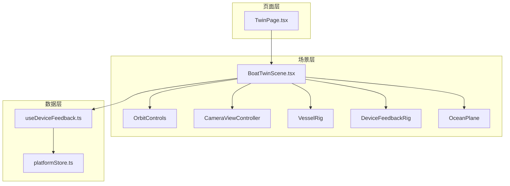
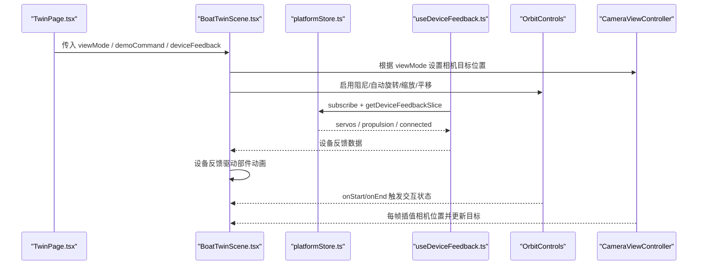
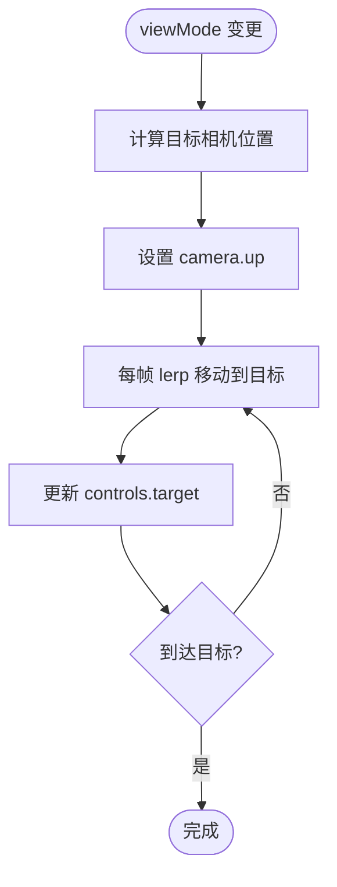
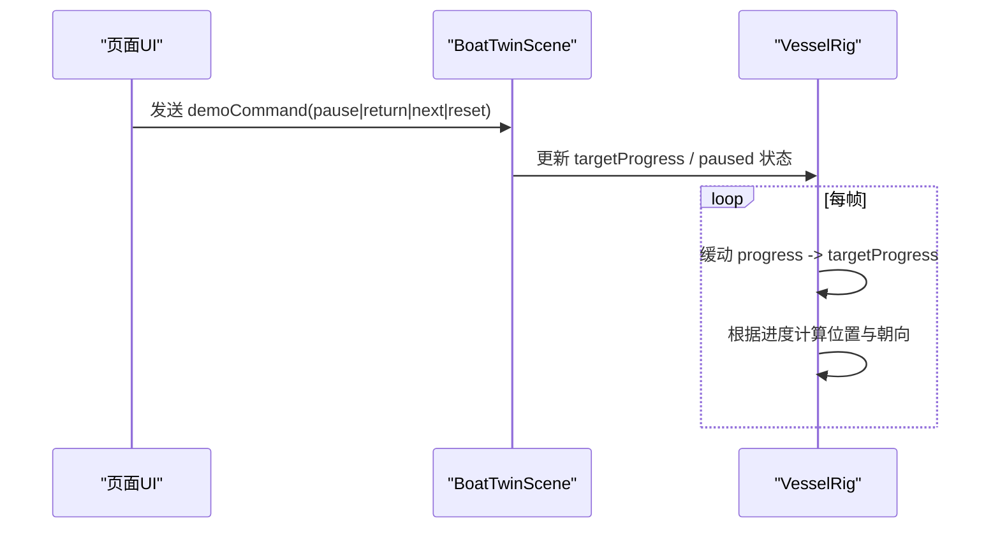
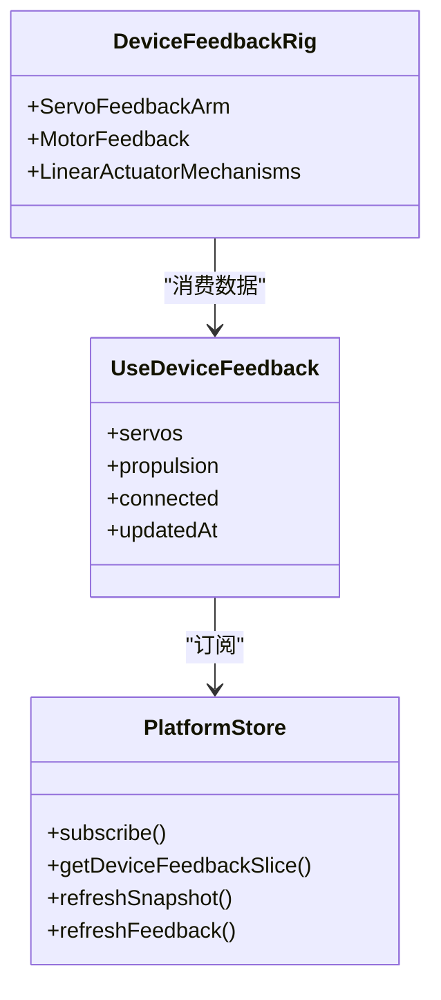
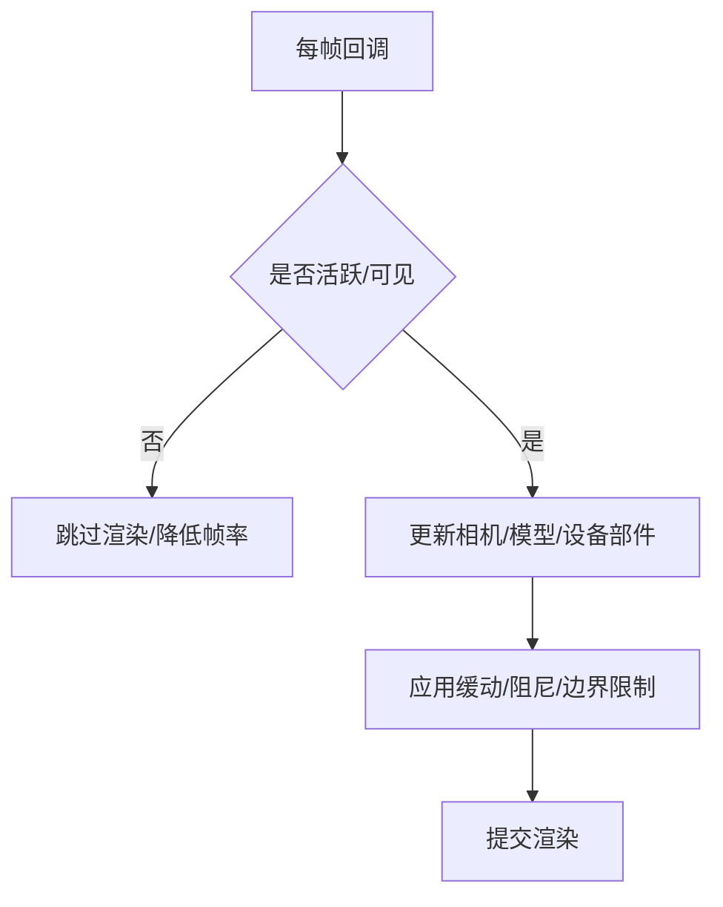
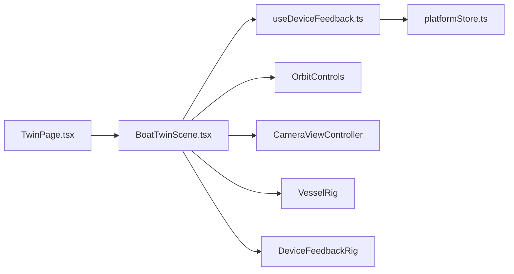

# 场景交互控制

<cite>
**本文引用的文件**
- [BoatTwinScene.tsx](file://fishery-digital-twin-platform/apps/frontend/src/components/three/BoatTwinScene.tsx)
- [TwinPage.tsx](file://fishery-digital-twin-platform/apps/frontend/src/components/dashboard/TwinPage.tsx)
- [useDeviceFeedback.ts](file://fishery-digital-twin-platform/apps/frontend/src/hooks/useDeviceFeedback.ts)
- [platformStore.ts](file://fishery-digital-twin-platform/apps/frontend/src/lib/platformStore.ts)
</cite>

## 目录
1. [简介](#简介)
2. [项目结构](#项目结构)
3. [核心组件](#核心组件)
4. [架构总览](#架构总览)
5. [详细组件分析](#详细组件分析)
6. [依赖关系分析](#依赖关系分析)
7. [性能考量](#性能考量)
8. [故障排查指南](#故障排查指南)
9. [结论](#结论)
10. [附录](#附录)

## 简介
本文件聚焦于基于 React Three Fiber 的场景交互控制系统，覆盖以下关键能力：
- OrbitControls 的配置与使用：旋转、缩放、平移的定制行为。
- 视角模式切换：跟随（follow）、俯视（top）、正面（front）三种模式的实现逻辑。
- 演示模式控制：自动播放、暂停、返回、重置的用户界面集成与内部状态流转。
- 设备反馈实时同步：舵机角度、推进器功率、设备状态的 3D 可视化更新。
- 动画系统：平滑过渡、缓动函数与时间控制策略。
- 性能监控与优化：帧率控制、内存管理与渲染效率优化建议。

## 项目结构
该功能主要位于前端 Next.js 应用中，核心由页面容器与 3D 场景组件组成：
- 页面层：数字孪生页面容器负责 UI 布局、仿真工作区与场景工具栏。
- 场景层：Three.js 场景封装了模型加载、设备反馈可视化、海洋环境、演示路线与相机控制。
- 数据层：平台数据与设备反馈通过共享 store 提供，React Hook 订阅并驱动视图更新。

图表来源
- [BoatTwinScene.tsx:1567-1759](file://fishery-digital-twin-platform/apps/frontend/src/components/three/BoatTwinScene.tsx#L1567-L1759)
- [TwinPage.tsx:80-151](file://fishery-digital-twin-platform/apps/frontend/src/components/dashboard/TwinPage.tsx#L80-L151)
- [useDeviceFeedback.ts:1-22](file://fishery-digital-twin-platform/apps/frontend/src/hooks/useDeviceFeedback.ts#L1-L22)
- [platformStore.ts:1-196](file://fishery-digital-twin-platform/apps/frontend/src/lib/platformStore.ts#L1-L196)

章节来源
- [TwinPage.tsx:80-151](file://fishery-digital-twin-platform/apps/frontend/src/components/dashboard/TwinPage.tsx#L80-L151)
- [BoatTwinScene.tsx:1567-1759](file://fishery-digital-twin-platform/apps/frontend/src/components/three/BoatTwinScene.tsx#L1567-L1759)

## 核心组件
- BoatTwinScene：场景主入口，负责 Canvas、光照、环境、模型装载、设备反馈可视化、演示路线、相机控制器与 OrbitControls 配置。
- CameraViewController：根据 viewMode 计算目标相机位置并进行平滑过渡动画。
- VesselRig：承载船体模型或程序化船体，处理演示运动、设备反馈驱动的部件动画。
- DeviceFeedbackRig：将舵机角度、电机功率等映射为 3D 可视化元素。
- OceanPlane：动态水面着色器，支持开关以节省资源。
- TwinPage：页面容器，集成场景、工具栏、仿真工作台与状态展示。

章节来源
- [BoatTwinScene.tsx:1567-1759](file://fishery-digital-twin-platform/apps/frontend/src/components/three/BoatTwinScene.tsx#L1567-L1759)
- [BoatTwinScene.tsx:1511-1565](file://fishery-digital-twin-platform/apps/frontend/src/components/three/BoatTwinScene.tsx#L1511-L1565)
- [BoatTwinScene.tsx:153-273](file://fishery-digital-twin-platform/apps/frontend/src/components/three/BoatTwinScene.tsx#L153-L273)
- [BoatTwinScene.tsx:275-379](file://fishery-digital-twin-platform/apps/frontend/src/components/three/BoatTwinScene.tsx#L275-L379)
- [BoatTwinScene.tsx:1060-1094](file://fishery-digital-twin-platform/apps/frontend/src/components/three/BoatTwinScene.tsx#L1060-L1094)
- [TwinPage.tsx:80-151](file://fishery-digital-twin-platform/apps/frontend/src/components/dashboard/TwinPage.tsx#L80-L151)

## 架构总览
下图展示了从页面到场景再到数据层的调用链路与数据流向：

图表来源
- [BoatTwinScene.tsx:1567-1759](file://fishery-digital-twin-platform/apps/frontend/src/components/three/BoatTwinScene.tsx#L1567-L1759)
- [BoatTwinScene.tsx:1511-1565](file://fishery-digital-twin-platform/apps/frontend/src/components/three/BoatTwinScene.tsx#L1511-L1565)
- [useDeviceFeedback.ts:1-22](file://fishery-digital-twin-platform/apps/frontend/src/hooks/useDeviceFeedback.ts#L1-L22)
- [platformStore.ts:1-196](file://fishery-digital-twin-platform/apps/frontend/src/lib/platformStore.ts#L1-L196)

## 详细组件分析

### OrbitControls 配置与使用
- 交互能力
  - 旋转：enableRotate 在俯视模式下禁用，避免用户误操作破坏俯视图构图；其他模式允许旋转。
  - 缩放：enableZoom 始终开启，zoomSpeed 区分 hero 与普通场景。
  - 平移：enablePan 始终开启，panSpeed 区分 hero 与普通场景。
- 阻尼与自动旋转
  - enableDamping 开启，dampingFactor 区分 hero 与普通场景。
  - autoRotate 在非俯视模式下可用，autoRotateSpeed 区分 hero 与普通场景。
- 距离限制
  - minDistance/maxDistance 区分 hero 与普通场景，防止过近或过远。
- 交互生命周期
  - onStart：标记交互开始，必要时暂停自动旋转。
  - onEnd：延迟恢复“平静”状态，用于帧率降级与资源回收。

章节来源
- [BoatTwinScene.tsx:1730-1754](file://fishery-digital-twin-platform/apps/frontend/src/components/three/BoatTwinScene.tsx#L1730-L1754)

### 视角模式切换（跟随/俯视/正面）
- 模式定义
  - follow：默认跟随视角，适合一般观察。
  - top：俯视模式，锁定相机朝下，禁用旋转，便于全局观察。
  - front：正面视角，适合细节检视。
- 实现要点
  - getCameraPosition 根据 compact/hero/viewMode 返回目标相机坐标。
  - CameraViewController 在 viewMode 变化时设置 camera.up 与目标位置，并在 useFrame 中按 delta 插值移动相机至目标，同时更新 controls.target。
  - 顶部视图会调整 up 向量以保证正确的“上”方向。

图表来源
- [BoatTwinScene.tsx:1511-1565](file://fishery-digital-twin-platform/apps/frontend/src/components/three/BoatTwinScene.tsx#L1511-L1565)

章节来源
- [BoatTwinScene.tsx:1511-1565](file://fishery-digital-twin-platform/apps/frontend/src/components/three/BoatTwinScene.tsx#L1511-L1565)

### 演示模式控制（自动播放/暂停/返回/重置）
- 命令类型
  - pause：切换暂停/继续，保持当前进度。
  - return：回到起始附近进度。
  - next：前进到下一个航点。
  - reset：重置到默认进度。
- 内部状态
  - demoCommand.nonce 作为触发信号，VesselRig 内维护 progressRef/targetProgressRef/pausedRef。
  - useFrame 中根据 delta 与缓动系数逐步逼近目标进度，并据此更新船体位置与朝向。
- 界面集成
  - 页面层可通过按钮触发 demoCommand（例如复位、全屏等），场景层响应后执行相应动作。

图表来源
- [BoatTwinScene.tsx:153-273](file://fishery-digital-twin-platform/apps/frontend/src/components/three/BoatTwinScene.tsx#L153-L273)
- [BoatTwinScene.tsx:1416-1449](file://fishery-digital-twin-platform/apps/frontend/src/components/three/BoatTwinScene.tsx#L1416-L1449)

章节来源
- [BoatTwinScene.tsx:153-273](file://fishery-digital-twin-platform/apps/frontend/src/components/three/BoatTwinScene.tsx#L153-L273)
- [BoatTwinScene.tsx:1416-1449](file://fishery-digital-twin-platform/apps/frontend/src/components/three/BoatTwinScene.tsx#L1416-L1449)

### 设备反馈实时同步（舵机/推进器/状态）
- 数据源
  - platformStore 定时拉取平台快照与设备反馈（舵机/推进器），并通过 useSyncExternalStore 暴露给组件订阅。
  - useDeviceFeedback 将 servos、propulsion、connected、updatedAt 暴露给上层。
- 3D 可视化
  - ServoFeedbackArm：将舵机角度映射为机械臂旋转，颜色指示在线/离线。
  - MotorFeedback：根据电机功率驱动转子旋转，颜色表示正/负功率与活动状态。
  - LinearActuatorMechanisms：双推杆与伸缩机构根据功率进行伸缩动画。
  - WorkEquipmentRig：传送带、滚轮、垃圾块等随功率与方向运动。
- 同步机制
  - 每秒刷新一次设备反馈，store 内部合并连接状态与最新数据，组件仅在数据变化时重渲染。

图表来源
- [platformStore.ts:1-196](file://fishery-digital-twin-platform/apps/frontend/src/lib/platformStore.ts#L1-L196)
- [useDeviceFeedback.ts:1-22](file://fishery-digital-twin-platform/apps/frontend/src/hooks/useDeviceFeedback.ts#L1-L22)
- [BoatTwinScene.tsx:275-379](file://fishery-digital-twin-platform/apps/frontend/src/components/three/BoatTwinScene.tsx#L275-L379)
- [BoatTwinScene.tsx:668-779](file://fishery-digital-twin-platform/apps/frontend/src/components/three/BoatTwinScene.tsx#L668-L779)

章节来源
- [platformStore.ts:1-196](file://fishery-digital-twin-platform/apps/frontend/src/lib/platformStore.ts#L1-L196)
- [useDeviceFeedback.ts:1-22](file://fishery-digital-twin-platform/apps/frontend/src/hooks/useDeviceFeedback.ts#L1-L22)
- [BoatTwinScene.tsx:275-379](file://fishery-digital-twin-platform/apps/frontend/src/components/three/BoatTwinScene.tsx#L275-L379)
- [BoatTwinScene.tsx:668-779](file://fishery-digital-twin-platform/apps/frontend/src/components/three/BoatTwinScene.tsx#L668-L779)

### 动画系统（平滑过渡/缓动/时间控制）
- 相机动画
  - CameraViewController 使用 lerp 在每帧将相机位置向目标靠近，delta * 系数控制速度，达到阈值后停止。
- 演示运动
  - VesselRig 使用 progressRef/targetProgressRef 与 delta 乘系数进行平滑推进，结合航点插值计算位置与朝向。
- 设备部件动画
  - 舵机、电机、线性推杆等使用 useFrame 与 delta 增量更新，部分使用 damp 或 clamp 保证稳定与边界安全。
- 帧率控制
  - SceneTicker 根据 active 状态与 fps 参数节流渲染；高运动时 30fps，低负载时 12fps；隐藏标签页时停止渲染。

图表来源
- [BoatTwinScene.tsx:128-151](file://fishery-digital-twin-platform/apps/frontend/src/components/three/BoatTwinScene.tsx#L128-L151)
- [BoatTwinScene.tsx:1511-1565](file://fishery-digital-twin-platform/apps/frontend/src/components/three/BoatTwinScene.tsx#L1511-L1565)
- [BoatTwinScene.tsx:153-273](file://fishery-digital-twin-platform/apps/frontend/src/components/three/BoatTwinScene.tsx#L153-L273)
- [BoatTwinScene.tsx:1664-1677](file://fishery-digital-twin-platform/apps/frontend/src/components/three/BoatTwinScene.tsx#L1664-L1677)

章节来源
- [BoatTwinScene.tsx:128-151](file://fishery-digital-twin-platform/apps/frontend/src/components/three/BoatTwinScene.tsx#L128-L151)
- [BoatTwinScene.tsx:1511-1565](file://fishery-digital-twin-platform/apps/frontend/src/components/three/BoatTwinScene.tsx#L1511-L1565)
- [BoatTwinScene.tsx:153-273](file://fishery-digital-twin-platform/apps/frontend/src/components/three/BoatTwinScene.tsx#L153-L273)
- [BoatTwinScene.tsx:1664-1677](file://fishery-digital-twin-platform/apps/frontend/src/components/three/BoatTwinScene.tsx#L1664-L1677)

## 依赖关系分析
- 页面依赖场景：TwinPage 通过 props 注入 viewMode、demoCommand、deviceFeedback 等，控制场景行为。
- 场景依赖数据：BoatTwinScene 通过 useDeviceFeedback 订阅 platformStore 的设备反馈切片，驱动 3D 可视化。
- 场景内部依赖：CameraViewController 依赖 OrbitControls 与 Three.js 相机；VesselRig 依赖模型与设备反馈；OceanPlane 依赖着色器与时间。

图表来源
- [TwinPage.tsx:80-151](file://fishery-digital-twin-platform/apps/frontend/src/components/dashboard/TwinPage.tsx#L80-L151)
- [BoatTwinScene.tsx:1567-1759](file://fishery-digital-twin-platform/apps/frontend/src/components/three/BoatTwinScene.tsx#L1567-L1759)
- [useDeviceFeedback.ts:1-22](file://fishery-digital-twin-platform/apps/frontend/src/hooks/useDeviceFeedback.ts#L1-L22)
- [platformStore.ts:1-196](file://fishery-digital-twin-platform/apps/frontend/src/lib/platformStore.ts#L1-L196)

章节来源
- [TwinPage.tsx:80-151](file://fishery-digital-twin-platform/apps/frontend/src/components/dashboard/TwinPage.tsx#L80-L151)
- [BoatTwinScene.tsx:1567-1759](file://fishery-digital-twin-platform/apps/frontend/src/components/three/BoatTwinScene.tsx#L1567-L1759)
- [useDeviceFeedback.ts:1-22](file://fishery-digital-twin-platform/apps/frontend/src/hooks/useDeviceFeedback.ts#L1-L22)
- [platformStore.ts:1-196](file://fishery-digital-twin-platform/apps/frontend/src/lib/platformStore.ts#L1-L196)

## 性能考量
- 帧率自适应
  - 高运动场景（自动旋转、浮动、演示、设备活动、仿真预览）使用 30fps；低负载时使用 12fps；标签页隐藏时停止渲染。
- 渲染循环控制
  - frameloop="demand" 按需渲染，hero 模式且自动旋转时改为 always。
- 像素密度与抗锯齿
  - dpr 范围限制，hero 与普通场景不同；AdaptiveDpr 自动适配；gl.antialias=true。
- 资源管理
  - 动态水面可关闭以减少 GPU 压力；网格与雾效按需显示；模型加载使用 Suspense 与预加载。
- 建议
  - 在低端设备上降低 dpr 上限或关闭动态水面。
  - 减少复杂几何与透明叠加面数量，合理设置 renderOrder。
  - 对高频更新的数据（如设备反馈）使用切片订阅，避免无关组件重渲染。

章节来源
- [BoatTwinScene.tsx:1664-1759](file://fishery-digital-twin-platform/apps/frontend/src/components/three/BoatTwinScene.tsx#L1664-L1759)
- [BoatTwinScene.tsx:128-151](file://fishery-digital-twin-platform/apps/frontend/src/components/three/BoatTwinScene.tsx#L128-L151)

## 故障排查指南
- 视角异常
  - 检查 viewMode 是否正确传入；确认 CameraViewController 的 camera.up 设置与目标位置计算。
- 自动旋转不生效
  - 确认 autoRotate 与 shouldAutoRotate 条件；检查 interact 状态与暂停逻辑。
- 设备反馈未更新
  - 检查 platformStore 的 refreshFeedback 是否被调用；确认网络请求与连接状态；验证 useDeviceFeedback 订阅是否生效。
- 动画卡顿
  - 检查 SceneTicker 的 fps 设置；确认 active 状态与文档可见性；评估设备部件动画复杂度。

章节来源
- [BoatTwinScene.tsx:1511-1565](file://fishery-digital-twin-platform/apps/frontend/src/components/three/BoatTwinScene.tsx#L1511-L1565)
- [BoatTwinScene.tsx:1600-1677](file://fishery-digital-twin-platform/apps/frontend/src/components/three/BoatTwinScene.tsx#L1600-L1677)
- [platformStore.ts:116-139](file://fishery-digital-twin-platform/apps/frontend/src/lib/platformStore.ts#L116-L139)
- [useDeviceFeedback.ts:1-22](file://fishery-digital-twin-platform/apps/frontend/src/hooks/useDeviceFeedback.ts#L1-L22)

## 结论
该场景交互控制系统通过清晰的组件分层与数据流设计，实现了：
- 灵活的视角模式切换与平滑相机动画。
- 完善的 OrbitControls 配置，满足旋转、缩放、平移的定制化需求。
- 演示模式的完整闭环：自动播放、暂停、返回、重置。
- 设备反馈的实时同步与丰富的 3D 可视化。
- 高效的动画系统与帧率控制，兼顾体验与性能。
建议在后续迭代中持续优化资源占用与低端设备兼容性，并扩展更多视角预设与交互手势。

## 附录
- 常用接口与属性
  - viewMode："follow" | "top" | "front"
  - demoCommand.type："pause" | "return" | "next" | "reset"
  - deviceFeedback.servoAngles、motorPower、dualPushrodPower、sxtlPower 等字段驱动对应 3D 部件。
- 参考路径
  - 视角控制：[CameraViewController:1511-1565](file://fishery-digital-twin-platform/apps/frontend/src/components/three/BoatTwinScene.tsx#L1511-L1565)
  - 演示运动：[VesselRig 演示逻辑:153-273](file://fishery-digital-twin-platform/apps/frontend/src/components/three/BoatTwinScene.tsx#L153-L273)
  - 设备反馈：[DeviceFeedbackRig:275-379](file://fishery-digital-twin-platform/apps/frontend/src/components/three/BoatTwinScene.tsx#L275-L379)
  - 数据订阅：[useDeviceFeedback:1-22](file://fishery-digital-twin-platform/apps/frontend/src/hooks/useDeviceFeedback.ts#L1-L22)
  - 存储实现：[platformStore:1-196](file://fishery-digital-twin-platform/apps/frontend/src/lib/platformStore.ts#L1-L196)