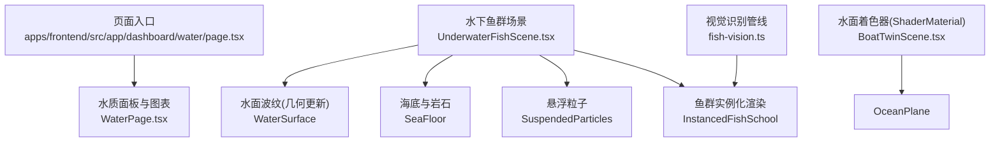
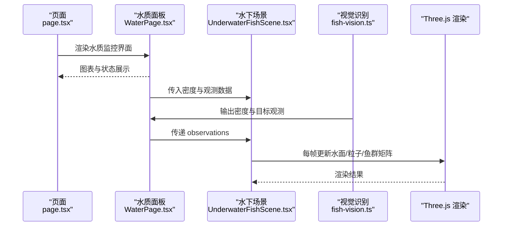
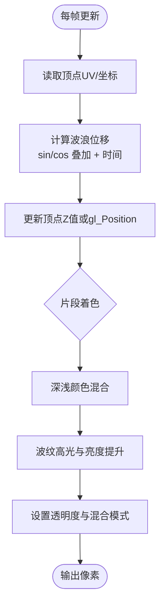
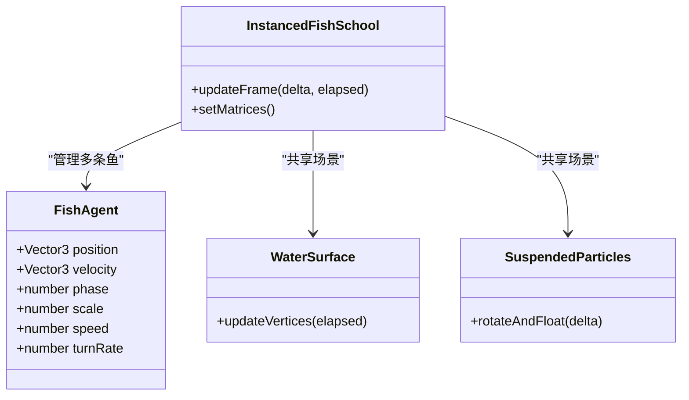
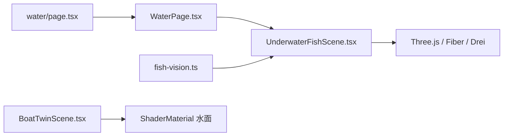

# 水下场景模拟

<cite>
**本文引用的文件**
- [UnderwaterFishScene.tsx](file://fishery-digital-twin-platform/apps/frontend/src/components/three/UnderwaterFishScene.tsx)
- [BoatTwinScene.tsx](file://fishery-digital-twin-platform/apps/frontend/src/components/three/BoatTwinScene.tsx)
- [WaterPage.tsx](file://fishery-digital-twin-platform/apps/frontend/src/components/dashboard/WaterPage.tsx)
- [page.tsx](file://fishery-digital-twin-platform/apps/frontend/src/app/dashboard/water/page.tsx)
- [fish-vision.ts](file://fishery-digital-twin-platform/apps/frontend/src/lib/fish-vision.ts)
</cite>

## 目录
1. [简介](#简介)
2. [项目结构](#项目结构)
3. [核心组件](#核心组件)
4. [架构总览](#架构总览)
5. [详细组件分析](#详细组件分析)
6. [依赖关系分析](#依赖关系分析)
7. [性能考量](#性能考量)
8. [故障排查指南](#故障排查指南)
9. [结论](#结论)
10. [附录](#附录)

## 简介
本文件面向“基于 Three.js 的水下场景模拟”，聚焦水体渲染、鱼类动画与交互控制，并结合项目中的实际实现进行说明。内容涵盖：
- 水面波纹的数学建模（正弦波叠加、时间变量控制）
- 水体着色器（顶点着色器的波浪计算、片段着色器的颜色混合与透明度）
- 鱼类模型加载与动画系统（游动姿态、群体行为、边界约束）
- 水下光照与环境效果（体积光近似、雾效、悬浮粒子）
- 交互控制（视角切换、缩放限制、对象选择）
- 性能优化策略（实例化渲染、帧率控制、绘制批次优化）

## 项目结构
本项目的前端采用 React + Three.js（通过 @react-three/fiber 和 drei）构建，关键模块如下：
- 水下鱼群场景：位于 three 组件目录，负责场景初始化、水体表面、海底、悬浮粒子与鱼群动画
- 水面着色器：在另一个场景中实现了自定义 ShaderMaterial 的水面波浪与高光
- 水质数据页面：提供图表与演示数据生成，用于展示环境指标趋势
- 视觉识别管线：将图像帧转换为密度与目标观测，驱动鱼群聚集行为

**图示来源**
- [page.tsx:1-6](file://fishery-digital-twin-platform/apps/frontend/src/app/dashboard/water/page.tsx#L1-L6)
- [WaterPage.tsx:45-218](file://fishery-digital-twin-platform/apps/frontend/src/components/dashboard/WaterPage.tsx#L45-L218)
- [UnderwaterFishScene.tsx:38-88](file://fishery-digital-twin-platform/apps/frontend/src/components/three/UnderwaterFishScene.tsx#L38-L88)
- [BoatTwinScene.tsx:92-126](file://fishery-digital-twin-platform/apps/frontend/src/components/three/BoatTwinScene.tsx#L92-L126)
- [fish-vision.ts:41-223](file://fishery-digital-twin-platform/apps/frontend/src/lib/fish-vision.ts#L41-L223)

**章节来源**
- [page.tsx:1-6](file://fishery-digital-twin-platform/apps/frontend/src/app/dashboard/water/page.tsx#L1-L6)
- [WaterPage.tsx:45-218](file://fishery-digital-twin-platform/apps/frontend/src/components/dashboard/WaterPage.tsx#L45-L218)

## 核心组件
- 水下世界容器：设置背景色、雾、多光源（环境光、半球光、方向光、点光），并组合水面、海底、粒子与鱼群
- 水面波纹：每帧更新平面几何的顶点高度，使用正弦与余弦叠加产生动态波纹
- 海底与岩石：静态底面与随机分布的多面体岩石，营造水底质感
- 悬浮粒子：以 Points 形式呈现水体悬浮物，缓慢旋转与上下浮动
- 鱼群系统：使用 InstancedMesh 批量渲染鱼体与尾鳍；每帧根据速度场、边界约束与视觉观测更新位置与朝向
- 水面着色器：通过自定义顶点与片段着色器实现更丰富的水面波浪与高光反射

**章节来源**
- [UnderwaterFishScene.tsx:53-88](file://fishery-digital-twin-platform/apps/frontend/src/components/three/UnderwaterFishScene.tsx#L53-L88)
- [UnderwaterFishScene.tsx:252-283](file://fishery-digital-twin-platform/apps/frontend/src/components/three/UnderwaterFishScene.tsx#L252-L283)
- [UnderwaterFishScene.tsx:285-320](file://fishery-digital-twin-platform/apps/frontend/src/components/three/UnderwaterFishScene.tsx#L285-L320)
- [UnderwaterFishScene.tsx:322-355](file://fishery-digital-twin-platform/apps/frontend/src/components/three/UnderwaterFishScene.tsx#L322-L355)
- [BoatTwinScene.tsx:92-126](file://fishery-digital-twin-platform/apps/frontend/src/components/three/BoatTwinScene.tsx#L92-L126)

## 架构总览
下图展示了从页面到渲染的关键调用链路与数据流：

**图示来源**
- [page.tsx:1-6](file://fishery-digital-twin-platform/apps/frontend/src/app/dashboard/water/page.tsx#L1-L6)
- [WaterPage.tsx:45-218](file://fishery-digital-twin-platform/apps/frontend/src/components/dashboard/WaterPage.tsx#L45-L218)
- [UnderwaterFishScene.tsx:38-88](file://fishery-digital-twin-platform/apps/frontend/src/components/three/UnderwaterFishScene.tsx#L38-L88)
- [fish-vision.ts:41-223](file://fishery-digital-twin-platform/apps/frontend/src/lib/fish-vision.ts#L41-L223)

## 详细组件分析

### 水面波纹与着色器
- 几何更新方式：在水面组件中，每帧遍历平面几何的顶点属性，按 x、y 坐标与时间计算正弦/余弦叠加的位移，写入 Z 通道，形成动态波纹
- 着色器方式：在另一场景中，使用 ShaderMaterial 定义顶点着色器对顶点进行波浪位移，并在片段着色器中进行浅蓝到深蓝的颜色混合、波纹高光与透明度处理
- 数学建模要点：
  - 正弦波叠加：多个不同频率与相位的正弦/余弦项叠加，增强自然感
  - 时间变量控制：通过 uTime 或 elapsed time 驱动波形移动
  - 深度渐变：在片段着色器中使用 UV 或 vUv.y 做平滑过渡，模拟浅水与深水颜色差异
  - 透明度：启用透明与关闭深度写入，避免遮挡下层物体

**图示来源**
- [UnderwaterFishScene.tsx:252-283](file://fishery-digital-twin-platform/apps/frontend/src/components/three/UnderwaterFishScene.tsx#L252-L283)
- [BoatTwinScene.tsx:92-126](file://fishery-digital-twin-platform/apps/frontend/src/components/three/BoatTwinScene.tsx#L92-L126)

**章节来源**
- [UnderwaterFishScene.tsx:252-283](file://fishery-digital-twin-platform/apps/frontend/src/components/three/UnderwaterFishScene.tsx#L252-L283)
- [BoatTwinScene.tsx:92-126](file://fishery-digital-twin-platform/apps/frontend/src/components/three/BoatTwinScene.tsx#L92-L126)

### 鱼类模型与动画系统
- 模型与渲染：使用 InstancedMesh 分别渲染鱼体（球体简化）与尾鳍（锥体简化），通过 instanceMatrix 每帧更新位置、旋转与缩放
- 游动姿态：根据速度向量计算朝向四元数，尾鳍方向在前进方向基础上叠加侧向摆动，形成摆尾效果
- 群体行为：
  - 初始速度与相位：为每条鱼分配确定性随机参数，保证稳定且自然的游动轨迹
  - 边界约束：当超出 X/Z 范围或 Y 上下限时，施加反向加速度将其拉回区域
  - 视觉观测跟随：若存在观测目标，则计算目标位置与聚类半径，按置信度调整追踪强度与位置响应，使鱼群围绕目标聚集
- 碰撞检测：当前未实现显式碰撞检测，主要依靠边界约束与速度归一化避免重叠发散

**图示来源**
- [UnderwaterFishScene.tsx:90-250](file://fishery-digital-twin-platform/apps/frontend/src/components/three/UnderwaterFishScene.tsx#L90-L250)

**章节来源**
- [UnderwaterFishScene.tsx:90-250](file://fishery-digital-twin-platform/apps/frontend/src/components/three/UnderwaterFishScene.tsx#L90-L250)
- [fish-vision.ts:41-223](file://fishery-digital-twin-platform/apps/frontend/src/lib/fish-vision.ts#L41-L223)

### 水下光照与环境效果
- 光照配置：包含环境光、半球光、方向光与点光，营造水下漫射与局部高亮
- 雾效：使用 Fog 模拟水体散射导致的远处衰减，增强深度感
- 悬浮粒子：Points 材质配合 sizeAttenuation，表现水体悬浮微粒的漂浮与旋转
- 透明度与混合：水面与粒子均开启透明并关闭深度写入，确保多层渲染的自然叠加

**章节来源**
- [UnderwaterFishScene.tsx:53-88](file://fishery-digital-twin-platform/apps/frontend/src/components/three/UnderwaterFishScene.tsx#L53-L88)
- [UnderwaterFishScene.tsx:322-355](file://fishery-digital-twin-platform/apps/frontend/src/components/three/UnderwaterFishScene.tsx#L322-L355)

### 交互控制
- 视角控制：使用 OrbitControls 作为默认控制器，支持阻尼、距离限制与极角范围限制，目标指向场景中心附近
- 视角切换：在另一场景中提供了 CameraViewController，可平滑过渡到跟随、俯视、前视等视角
- 缩放控制：通过 minDistance/maxDistance 限制相机缩放范围，避免过近或过远
- 对象选择：当前未实现射线拾取与对象选择逻辑，可通过扩展 Raycaster 与事件监听实现

**章节来源**
- [UnderwaterFishScene.tsx:76-85](file://fishery-digital-twin-platform/apps/frontend/src/components/three/UnderwaterFishScene.tsx#L76-L85)
- [BoatTwinScene.tsx:1526-1565](file://fishery-digital-twin-platform/apps/frontend/src/components/three/BoatTwinScene.tsx#L1526-L1565)

## 依赖关系分析
- 页面层：water 页面路由仅引入 WaterPage 组件，承载图表与演示数据流程
- 场景层：UnderwaterFishScene 依赖 Three.js、@react-three/fiber、drei 的 Canvas、OrbitControls 等
- 视觉识别：fish-vision 提供密度与观测数据，被场景消费以驱动鱼群聚集
- 水面着色器：BoatTwinScene 中的 OceanPlane 使用自定义 ShaderMaterial 实现水面效果

**图示来源**
- [page.tsx:1-6](file://fishery-digital-twin-platform/apps/frontend/src/app/dashboard/water/page.tsx#L1-L6)
- [WaterPage.tsx:45-218](file://fishery-digital-twin-platform/apps/frontend/src/components/dashboard/WaterPage.tsx#L45-L218)
- [UnderwaterFishScene.tsx:38-88](file://fishery-digital-twin-platform/apps/frontend/src/components/three/UnderwaterFishScene.tsx#L38-L88)
- [BoatTwinScene.tsx:92-126](file://fishery-digital-twin-platform/apps/frontend/src/components/three/BoatTwinScene.tsx#L92-L126)
- [fish-vision.ts:41-223](file://fishery-digital-twin-platform/apps/frontend/src/lib/fish-vision.ts#L41-L223)

**章节来源**
- [page.tsx:1-6](file://fishery-digital-twin-platform/apps/frontend/src/app/dashboard/water/page.tsx#L1-L6)
- [WaterPage.tsx:45-218](file://fishery-digital-twin-platform/apps/frontend/src/components/dashboard/WaterPage.tsx#L45-L218)
- [UnderwaterFishScene.tsx:38-88](file://fishery-digital-twin-platform/apps/frontend/src/components/three/UnderwaterFishScene.tsx#L38-L88)
- [BoatTwinScene.tsx:92-126](file://fishery-digital-twin-platform/apps/frontend/src/components/three/BoatTwinScene.tsx#L92-L126)
- [fish-vision.ts:41-223](file://fishery-digital-twin-platform/apps/frontend/src/lib/fish-vision.ts#L41-L223)

## 性能考量
- 实例化渲染：使用 InstancedMesh 批量更新鱼体与尾鳍矩阵，减少 draw call 与 CPU/GPU 同步开销
- 帧率控制：Canvas 设置 dpr 与 frameloop，按需渲染；另有一处使用 SceneTicker 限制刷新频率以降低负载
- 绘制批次优化：instanceMatrix 设置为 DynamicDrawUsage，标记频繁更新的缓冲区
- 几何与材质：水面与粒子使用简单几何与轻量材质，避免复杂法线贴图与多重采样
- 可见性裁剪：禁用 frustumCulled 以简化示例场景，但在大规模场景中应恢复以利用视锥剔除
- 纹理压缩：当前场景未使用纹理贴图；如需引入，建议采用平台支持的压缩格式（如 BC/ASTC/ETC2）并通过 WebGL/WebGPU 特性检测启用

[本节为通用性能指导，不直接分析具体代码行]

## 故障排查指南
- 水面无波纹：检查 useFrame 是否执行、geometry.attributes.position 是否存在且 count 正确，确认时间变量与系数非零
- 鱼群不动：确认 active 标志位、bodiesRef/tailsRef 引用有效、count 设置与 instanceMatrix.needsUpdate 更新
- 鱼群越界：检查边界条件与反向加速度系数，确保速度归一化与位置增量合理
- 视觉观测无效：确认 fish-vision 输出的 observations 数组非空，且 confidence/size 范围合理
- 性能下降：降低实例数量、减少每帧几何更新、关闭不必要的透明与阴影、限制帧率

**章节来源**
- [UnderwaterFishScene.tsx:162-236](file://fishery-digital-twin-platform/apps/frontend/src/components/three/UnderwaterFishScene.tsx#L162-L236)
- [UnderwaterFishScene.tsx:252-283](file://fishery-digital-twin-platform/apps/frontend/src/components/three/UnderwaterFishScene.tsx#L252-L283)
- [fish-vision.ts:41-223](file://fishery-digital-twin-platform/apps/frontend/src/lib/fish-vision.ts#L41-L223)

## 结论
该项目在水下场景模拟方面实现了：
- 基于几何更新与自定义着色器的水面波纹效果
- 使用实例化渲染的高效鱼群动画系统，支持群体聚集与边界约束
- 完整的光照与雾效配置，营造水下氛围
- 基础的交互控制能力，可扩展至更多视角与对象选择
未来可进一步增强：
- 加入显式碰撞检测与更复杂的群体行为（分离、对齐、凝聚）
- 引入真实模型与纹理，结合 LOD 与视锥剔除优化大规模场景
- 扩展交互功能（射线拾取、点击选中、信息面板）

[本节为总结性内容，不直接分析具体代码行]

## 附录
- 水面数学建模参考：正弦/余弦叠加、时间驱动、深度渐变与透明度混合
- 鱼群行为参考：速度场扰动、边界约束、观测驱动的聚类与跟随
- 交互控制参考：OrbitControls 参数调优、CameraViewController 平滑过渡

[本节为概念性补充，不直接分析具体代码行]