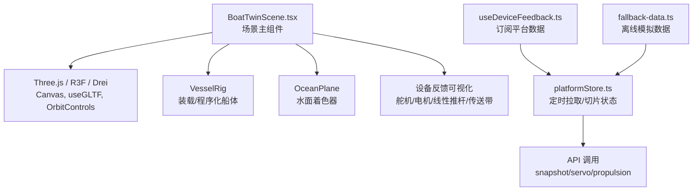
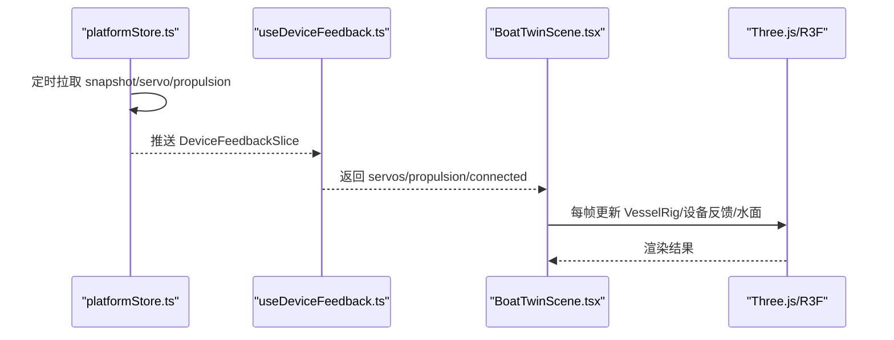
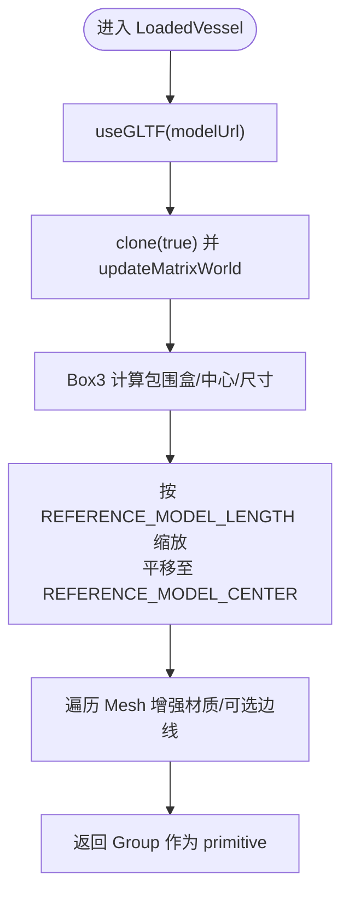
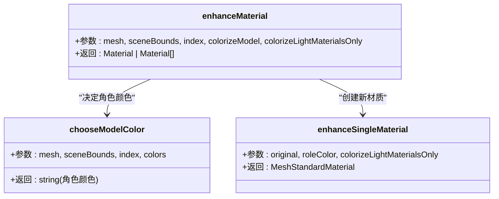
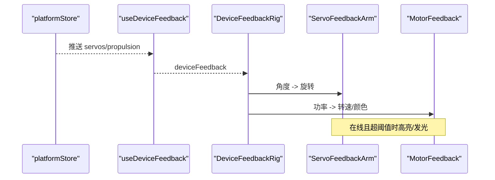
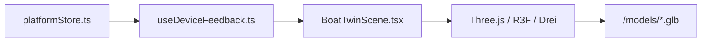

# 船模场景渲染

<cite>
**本文引用的文件**
- [BoatTwinScene.tsx](file://fishery-digital-twin-platform/apps/frontend/src/components/three/BoatTwinScene.tsx)
- [useDeviceFeedback.ts](file://fishery-digital-twin-platform/apps/frontend/src/hooks/useDeviceFeedback.ts)
- [platformStore.ts](file://fishery-digital-twin-platform/apps/frontend/src/lib/platformStore.ts)
- [fallback-data.ts](file://fishery-digital-twin-platform/apps/frontend/src/lib/fallback-data.ts)
</cite>

## 目录
1. [简介](#简介)
2. [项目结构](#项目结构)
3. [核心组件](#核心组件)
4. [架构总览](#架构总览)
5. [详细组件分析](#详细组件分析)
6. [依赖关系分析](#依赖关系分析)
7. [性能考量](#性能考量)
8. [故障排查指南](#故障排查指南)
9. [结论](#结论)
10. [附录](#附录)

## 简介
本文件面向基于 Three.js 的船舶数字孪生前端场景，系统性说明 GLTF 模型加载、材质系统、光照与环境、几何体构建、坐标与比例校准、颜色映射、程序化备用船体、设备反馈可视化（舵机角度、推进器状态、工作设备动态）、以及性能优化策略。文档以源码为依据，提供可追溯的章节来源与图示，帮助读者快速理解并扩展该渲染子系统。

## 项目结构
该功能位于前端 Next.js 应用中，核心实现集中在 React + React Three Fiber/Drei 组件内：
- 场景主入口与渲染循环控制：BoatTwinScene.tsx
- 设备数据订阅与更新：useDeviceFeedback.ts 与 platformStore.ts
- 离线回退数据生成：fallback-data.ts

图表来源
- [BoatTwinScene.tsx:1567-1776](file://fishery-digital-twin-platform/apps/frontend/src/components/three/BoatTwinScene.tsx#L1567-L1776)
- [useDeviceFeedback.ts:1-22](file://fishery-digital-twin-platform/apps/frontend/src/hooks/useDeviceFeedback.ts#L1-L22)
- [platformStore.ts:1-196](file://fishery-digital-twin-platform/apps/frontend/src/lib/platformStore.ts#L1-L196)
- [fallback-data.ts:1-164](file://fishery-digital-twin-platform/apps/frontend/src/lib/fallback-data.ts#L1-L164)

章节来源
- [BoatTwinScene.tsx:1567-1776](file://fishery-digital-twin-platform/apps/frontend/src/components/three/BoatTwinScene.tsx#L1567-L1776)
- [useDeviceFeedback.ts:1-22](file://fishery-digital-twin-platform/apps/frontend/src/hooks/useDeviceFeedback.ts#L1-L22)
- [platformStore.ts:1-196](file://fishery-digital-twin-platform/apps/frontend/src/lib/platformStore.ts#L1-L196)
- [fallback-data.ts:1-164](file://fishery-digital-twin-platform/apps/frontend/src/lib/fallback-data.ts#L1-L164)

## 核心组件
- 场景容器与帧率自适应：通过 Canvas、AdaptiveDpr、SceneTicker 控制渲染频率与像素密度，在交互或高运动时提升刷新率，空闲时降频至 12fps，隐藏标签页时停止动画。
- 船体装配：VesselRig 负责根据是否加载到 GLTF 模型选择 LoadedVessel 或 ProceduralVessel，并叠加设备反馈与工作设备可视化。
- 模型处理：LoadedVessel 使用 useGLTF 加载 GLB/GLTF，prepareImportedModel 进行归一化缩放、中心对齐、材质增强与可选边缘线叠加。
- 材质系统：enhanceMaterial 与 chooseModelColor 将模型部件按名称/位置/体积等特征映射到船体、侧舷、甲板、舱室、硬件等角色，并设置粗糙度/金属度/环境贴图强度。
- 光照与环境：半球光、环境光、方向光、点光源组合，配合雾与背景色营造海洋氛围；支持 hero 模式提高亮度。
- 水面：OceanPlane 使用自定义顶点/片段着色器实现波浪与高光。
- 设备反馈：DeviceFeedbackRig、ServoFeedbackArm、MotorFeedback、WorkEquipmentRig 等将舵机角度、电机功率、线性推杆位移、传送带与相机云台等实时可视化。
- 演示与预测路线：RouteLayer 与 PredictionRouteLayer 展示演示路径与风险预测轨迹。

章节来源
- [BoatTwinScene.tsx:128-273](file://fishery-digital-twin-platform/apps/frontend/src/components/three/BoatTwinScene.tsx#L128-L273)
- [BoatTwinScene.tsx:809-870](file://fishery-digital-twin-platform/apps/frontend/src/components/three/BoatTwinScene.tsx#L809-L870)
- [BoatTwinScene.tsx:872-1011](file://fishery-digital-twin-platform/apps/frontend/src/components/three/BoatTwinScene.tsx#L872-L1011)
- [BoatTwinScene.tsx:1013-1094](file://fishery-digital-twin-platform/apps/frontend/src/components/three/BoatTwinScene.tsx#L1013-L1094)
- [BoatTwinScene.tsx:1431-1486](file://fishery-digital-twin-platform/apps/frontend/src/components/three/BoatTwinScene.tsx#L1431-L1486)

## 架构总览
下图展示了从数据源到渲染输出的完整链路：平台数据通过 store 定时拉取，React Hook 订阅后注入场景，场景在每帧驱动模型姿态、设备反馈与动画。

图表来源
- [platformStore.ts:98-139](file://fishery-digital-twin-platform/apps/frontend/src/lib/platformStore.ts#L98-L139)
- [useDeviceFeedback.ts:1-22](file://fishery-digital-twin-platform/apps/frontend/src/hooks/useDeviceFeedback.ts#L1-L22)
- [BoatTwinScene.tsx:1664-1729](file://fishery-digital-twin-platform/apps/frontend/src/components/three/BoatTwinScene.tsx#L1664-L1729)

## 详细组件分析

### GLTF 模型加载与坐标/比例校准
- 模型检测与加载：通过 HEAD 请求探测模型可用性，useGLTF 异步加载 GLB/GLTF，并在 Suspense 中渲染。
- 坐标与缩放：计算模型包围盒尺寸与中心，依据参考长度与中心对模型进行统一缩放和平移，确保不同模型在同一坐标系下对齐。
- 遍历与增强：遍历所有 Mesh，关闭阴影以提升性能，替换为增强材质；可按需添加边线覆盖层。

图表来源
- [BoatTwinScene.tsx:809-870](file://fishery-digital-twin-platform/apps/frontend/src/components/three/BoatTwinScene.tsx#L809-L870)

章节来源
- [BoatTwinScene.tsx:1641-1658](file://fishery-digital-twin-platform/apps/frontend/src/components/three/BoatTwinScene.tsx#L1641-L1658)
- [BoatTwinScene.tsx:809-870](file://fishery-digital-twin-platform/apps/frontend/src/components/three/BoatTwinScene.tsx#L809-L870)

### 材质系统与颜色映射
- 角色判定：根据 Mesh 名称正则匹配、相对高度 yRatio、横向偏离 lateralRatio、相对体积 relativeVolume、薄件判断 thinPart，将部件归类为 hull、sideHull、deck、cabin、hardware。
- 材质增强：保留原贴图/法线/粗糙度/金属度/AO/自发光贴图，调整 roughness/metalness/envMapIntensity；若启用“仅浅色材质着色”，则只对低饱和度浅色且非高金属度的材质着色。
- 边缘线：当开启 showEdges 且网格规模适中时，为 Mesh 添加 EdgesGeometry 线框，区分水线上下颜色与透明度。

图表来源
- [BoatTwinScene.tsx:872-985](file://fishery-digital-twin-platform/apps/frontend/src/components/three/BoatTwinScene.tsx#L872-L985)

章节来源
- [BoatTwinScene.tsx:872-985](file://fishery-digital-twin-platform/apps/frontend/src/components/three/BoatTwinScene.tsx#L872-L985)
- [BoatTwinScene.tsx:987-1011](file://fishery-digital-twin-platform/apps/frontend/src/components/three/BoatTwinScene.tsx#L987-L1011)

### 光照与环境设置
- 光照：半球光提供天/地基础照明，环境光补充整体亮度，两束方向光塑造主光与补光，点光源增加局部高光。hero 模式下提高各光源强度以获得更亮的展示效果。
- 环境：背景色与雾效营造海洋氛围；相机 FOV、近远裁剪面、DPR 范围与抗锯齿开启，输出色彩空间 sRGB，色调映射 ACES Filmic。

章节来源
- [BoatTwinScene.tsx:1700-1723](file://fishery-digital-twin-platform/apps/frontend/src/components/three/BoatTwinScene.tsx#L1700-L1723)

### 几何体构建与水面
- 程序化船体：当模型不可用时，使用 Box/Cone/ Cylinder/Sphere 等基础几何体拼装出简化船体，包含船体、甲板、舱室、天线与灯光等。
- 水面：底层平面使用 PhysicalMaterial 模拟水体基础反射；上层 Plane 使用自定义 ShaderMaterial 实现波浪位移与高光纹理，透明混合避免深度写入。

章节来源
- [BoatTwinScene.tsx:1013-1094](file://fishery-digital-twin-platform/apps/frontend/src/components/three/BoatTwinScene.tsx#L1013-L1094)

### 设备反馈可视化
- 舵机角度：DeviceFeedbackRig 根据 importedModel 切换位置与朝向，每个 ServoFeedbackArm 将角度转换为弧度并绕轴旋转，在线且有效角度时高亮发光。
- 推进器状态：MotorFeedback 根据电机功率绝对值与正负控制转子旋转速度与颜色（前进/后退），在线且功率阈值以上才激活。
- 工作设备：WorkEquipmentRig 包含传送带条纹、滚轮、垃圾块、相机云台、多组伺服机构与线性推杆，均根据实时功率/在线状态或仿真相位驱动动画。
- 相机云台：CameraGimbal 支持 yaw/pitch 双轴旋转，仿真模式下平滑阻尼过渡，在线时显示发光指示。

图表来源
- [BoatTwinScene.tsx:275-379](file://fishery-digital-twin-platform/apps/frontend/src/components/three/BoatTwinScene.tsx#L275-L379)
- [useDeviceFeedback.ts:1-22](file://fishery-digital-twin-platform/apps/frontend/src/hooks/useDeviceFeedback.ts#L1-L22)
- [platformStore.ts:81-139](file://fishery-digital-twin-platform/apps/frontend/src/lib/platformStore.ts#L81-L139)

章节来源
- [BoatTwinScene.tsx:275-379](file://fishery-digital-twin-platform/apps/frontend/src/components/three/BoatTwinScene.tsx#L275-L379)
- [BoatTwinScene.tsx:381-510](file://fishery-digital-twin-platform/apps/frontend/src/components/three/BoatTwinScene.tsx#L381-L510)
- [BoatTwinScene.tsx:512-779](file://fishery-digital-twin-platform/apps/frontend/src/components/three/BoatTwinScene.tsx#L512-L779)

### 演示与预测路线
- 演示路线：RouteLayer 绘制虚线路径与节点，结合 VesselRig 的路径插值实现沿路移动与朝向变化。
- 预测路线：PredictionRouteLayer 根据风险等级改变颜色，动态标记沿预测路径移动的小船与箭头。

章节来源
- [BoatTwinScene.tsx:1416-1486](file://fishery-digital-twin-platform/apps/frontend/src/components/three/BoatTwinScene.tsx#L1416-L1486)

### 程序化船体生成（备用方案）
- 触发条件：当模型 URL 不存在或加载失败时，自动切换到程序化船体。
- 组成：船体主体、艏艉锥体、甲板、舱室、天线与发光灯等，保持与导入模型一致的视觉风格与尺度。

章节来源
- [BoatTwinScene.tsx:1013-1058](file://fishery-digital-twin-platform/apps/frontend/src/components/three/BoatTwinScene.tsx#L1013-L1058)

## 依赖关系分析
- 数据流：platformStore 定时拉取快照与设备反馈，useDeviceFeedback 将其暴露给 UI 组件；BoatTwinScene 订阅设备反馈并驱动三维场景。
- 外部库：Three.js、@react-three/fiber、@react-three/drei 提供 Canvas、useGLTF、OrbitControls、Line、Bounds 等能力。
- 资源：默认模型路径 /models/inspection-boat.glb，通过 useGLTF.preload 预加载。

图表来源
- [platformStore.ts:98-139](file://fishery-digital-twin-platform/apps/frontend/src/lib/platformStore.ts#L98-L139)
- [useDeviceFeedback.ts:1-22](file://fishery-digital-twin-platform/apps/frontend/src/hooks/useDeviceFeedback.ts#L1-L22)
- [BoatTwinScene.tsx:1775-1776](file://fishery-digital-twin-platform/apps/frontend/src/components/three/BoatTwinScene.tsx#L1775-L1776)

章节来源
- [platformStore.ts:1-196](file://fishery-digital-twin-platform/apps/frontend/src/lib/platformStore.ts#L1-L196)
- [useDeviceFeedback.ts:1-22](file://fishery-digital-twin-platform/apps/frontend/src/hooks/useDeviceFeedback.ts#L1-L22)
- [BoatTwinScene.tsx:1567-1776](file://fishery-digital-twin-platform/apps/frontend/src/components/three/BoatTwinScene.tsx#L1567-L1776)

## 性能考量
- 帧率自适应：SceneTicker 根据交互与运动状态在 30fps 与 12fps 间切换；页面隐藏或无活动动画时降低 GPU 负载。
- 像素密度自适应：AdaptiveDpr 限制 DPR 范围，hero 模式略高以保证清晰度。
- 材质复用与批管理：增强材质仅在模型加载时创建一次；Mesh 关闭阴影减少渲染开销；边线仅在规模适中时启用。
- 模型缓存：useGLTF 内部缓存已加载模型；同时 useGLTF.preload 提前预热默认模型。
- 渲染批次：合理设置 renderOrder 与 depthWrite 控制透明物体顺序，避免不必要的重绘。
- 数据节流：platformStore 使用固定间隔拉取快照与反馈，避免高频网络请求。

章节来源
- [BoatTwinScene.tsx:128-151](file://fishery-digital-twin-platform/apps/frontend/src/components/three/BoatTwinScene.tsx#L128-L151)
- [BoatTwinScene.tsx:1700-1729](file://fishery-digital-twin-platform/apps/frontend/src/components/three/BoatTwinScene.tsx#L1700-L1729)
- [BoatTwinScene.tsx:856-869](file://fishery-digital-twin-platform/apps/frontend/src/components/three/BoatTwinScene.tsx#L856-L869)
- [BoatTwinScene.tsx:1775-1776](file://fishery-digital-twin-platform/apps/frontend/src/components/three/BoatTwinScene.tsx#L1775-L1776)
- [platformStore.ts:20-22](file://fishery-digital-twin-platform/apps/frontend/src/lib/platformStore.ts#L20-L22)

## 故障排查指南
- 模型未加载：检查 modelUrl 是否可达，HEAD 请求是否成功；确认 useGLTF.preload 是否生效；查看 SceneLoaderOverlay 进度提示。
- 设备反馈不更新：确认 platformStore 定时器是否启动，接口是否返回数据；检查 useDeviceFeedback 是否正确订阅；核对 servoAngles/power 是否为 null 或未达阈值。
- 材质异常：检查 chooseModelColor 的正则匹配是否符合模型命名；确认 colorizeLightMaterialsOnly 是否误过滤了目标材质；验证 roughness/metalness/envMapIntensity 设置。
- 水面不显示：确认 showOcean 与 liveOcean 开关；检查 ShaderMaterial uniforms 是否更新；确保 transparent 与 depthWrite 配置正确。
- 性能问题：降低 demoMotion/float/工作设备动画频率；关闭 showEdges；减少网格规模或禁用部分环境元素。

章节来源
- [BoatTwinScene.tsx:1641-1658](file://fishery-digital-twin-platform/apps/frontend/src/components/three/BoatTwinScene.tsx#L1641-L1658)
- [BoatTwinScene.tsx:1762-1773](file://fishery-digital-twin-platform/apps/frontend/src/components/three/BoatTwinScene.tsx#L1762-L1773)
- [platformStore.ts:98-139](file://fishery-digital-twin-platform/apps/frontend/src/lib/platformStore.ts#L98-L139)
- [BoatTwinScene.tsx:872-985](file://fishery-digital-twin-platform/apps/frontend/src/components/three/BoatTwinScene.tsx#L872-L985)
- [BoatTwinScene.tsx:1060-1094](file://fishery-digital-twin-platform/apps/frontend/src/components/three/BoatTwinScene.tsx#L1060-L1094)

## 结论
该船模场景渲染模块以 React Three Fiber 为核心，实现了 GLTF 模型的标准化加载与材质增强、稳定的光照与环境、丰富的设备反馈可视化与程序化备用船体，并通过帧率自适应、DPR 控制与材质批管理等手段保障性能。其模块化设计便于扩展新的设备类型与视觉效果，适合在数字孪生平台中持续演进。

## 附录
- 默认模型路径：/models/inspection-boat.glb
- 参考模型中心与长度常量用于归一化对齐
- 颜色调色板：MODEL_COLORS 与 LIGHT_MATERIAL_COLORS
- 演示与预测路径数组：DEMO_ROUTE、PREDICTION_ROUTE

章节来源
- [BoatTwinScene.tsx:57-90](file://fishery-digital-twin-platform/apps/frontend/src/components/three/BoatTwinScene.tsx#L57-L90)
- [BoatTwinScene.tsx:1416-1486](file://fishery-digital-twin-platform/apps/frontend/src/components/three/BoatTwinScene.tsx#L1416-L1486)