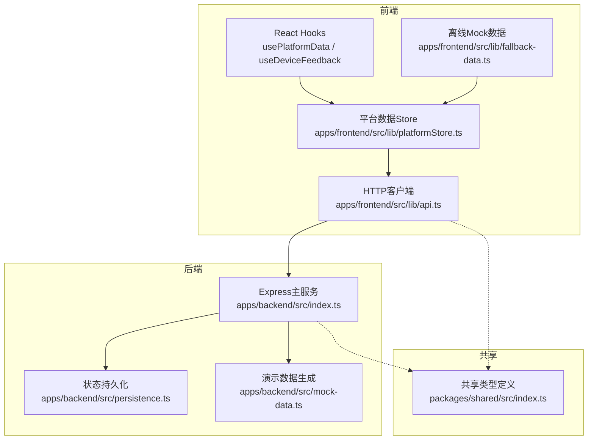
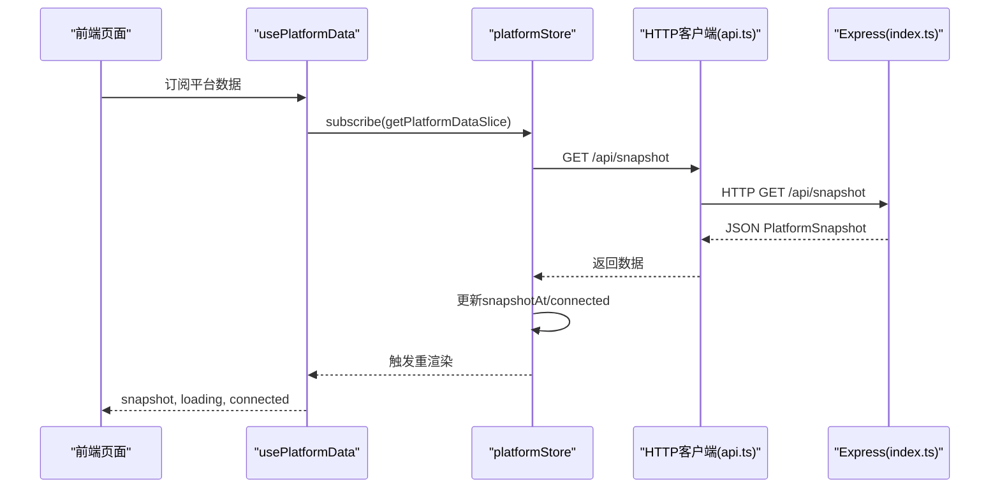
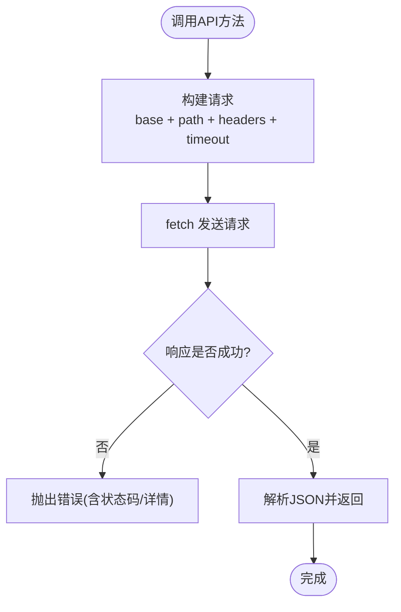
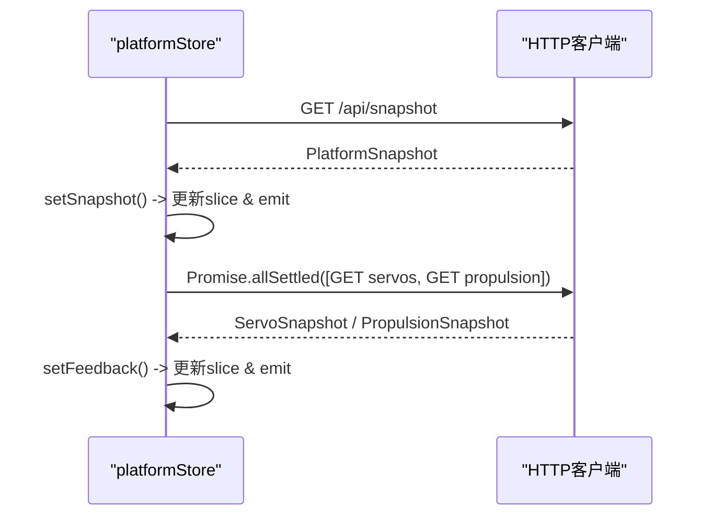
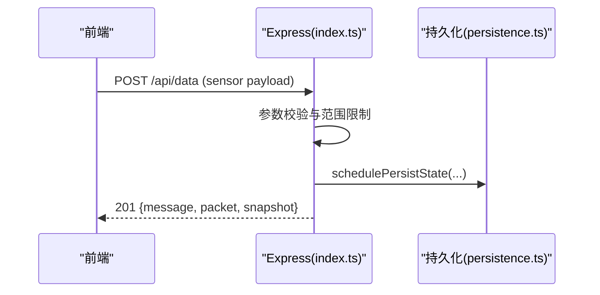
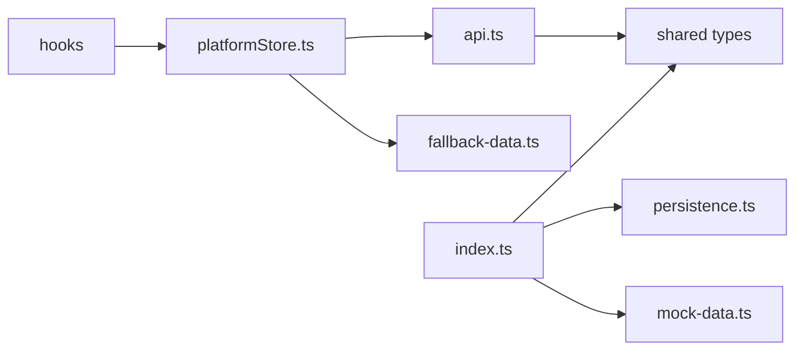

# API集成

<cite>
**本文引用的文件**
- [apps/frontend/src/lib/api.ts](file://apps/frontend/src/lib/api.ts)
- [apps/frontend/src/lib/platformStore.ts](file://apps/frontend/src/lib/platformStore.ts)
- [apps/frontend/src/hooks/usePlatformData.ts](file://apps/frontend/src/hooks/usePlatformData.ts)
- [apps/frontend/src/hooks/useDeviceFeedback.ts](file://apps/frontend/src/hooks/useDeviceFeedback.ts)
- [apps/frontend/src/lib/fallback-data.ts](file://apps/frontend/src/lib/fallback-data.ts)
- [apps/backend/src/index.ts](file://apps/backend/src/index.ts)
- [apps/backend/src/persistence.ts](file://apps/backend/src/persistence.ts)
- [apps/backend/src/mock-data.ts](file://apps/backend/src/mock-data.ts)
- [packages/shared/src/index.ts](file://packages/shared/src/index.ts)
</cite>

## 目录
1. [简介](#简介)
2. [项目结构](#项目结构)
3. [核心组件](#核心组件)
4. [架构总览](#架构总览)
5. [详细组件分析](#详细组件分析)
6. [依赖关系分析](#依赖关系分析)
7. [性能考虑](#性能考虑)
8. [故障排查指南](#故障排查指南)
9. [结论](#结论)
10. [附录：API参考与最佳实践](#附录api参考与最佳实践)

## 简介
本文件面向前端与后端的API集成，系统性说明RESTful调用封装、请求/响应处理、错误统一处理、数据格式化与类型映射、离线数据处理策略，以及性能优化与调试技巧。当前仓库未实现WebSocket实时通信，文档将明确说明现状并提供替代方案（轮询+状态管理）及未来扩展建议。

## 项目结构
本项目采用前后端分离的Monorepo结构：
- 前端：Next.js应用，提供Dashboard页面与数据可视化；通过统一的HTTP客户端访问后端API；使用共享类型定义确保前后端数据结构一致。
- 后端：Express服务，暴露REST接口，聚合设备状态、水质历史、AI报告、数字孪生推演等能力；内置CORS、鉴权中间件、日志与持久化。
- 共享包：集中定义前后端共用的TypeScript类型，保证契约一致性。

图表来源
- [apps/frontend/src/lib/api.ts:1-101](file://apps/frontend/src/lib/api.ts#L1-L101)
- [apps/frontend/src/lib/platformStore.ts:1-196](file://apps/frontend/src/lib/platformStore.ts#L1-L196)
- [apps/backend/src/index.ts:1-599](file://apps/backend/src/index.ts#L1-L599)
- [packages/shared/src/index.ts:1-288](file://packages/shared/src/index.ts#L1-L288)

章节来源
- [apps/frontend/src/lib/api.ts:1-101](file://apps/frontend/src/lib/api.ts#L1-L101)
- [apps/backend/src/index.ts:1-599](file://apps/backend/src/index.ts#L1-L599)
- [packages/shared/src/index.ts:1-288](file://packages/shared/src/index.ts#L1-L288)

## 核心组件
- HTTP客户端封装：统一基础URL、超时、认证头、错误抛出与JSON解析。
- 平台数据Store：定时轮询快照与设备反馈，维护连接状态与更新时间，提供稳定切片供React订阅。
- React Hooks：以useSyncExternalStore接入Store，向UI暴露只读数据切片。
- 后端Express路由：健康检查、快照、传感器数据上报、舵机/推进器控制、AI报告、数字孪生推演、系统日志等。
- 共享类型：前后端共用WaterData、PlatformSnapshot、ServoSnapshot、PropulsionSnapshot、AIReport、TwinSimulationInput/Result等类型。

章节来源
- [apps/frontend/src/lib/api.ts:6-24](file://apps/frontend/src/lib/api.ts#L6-L24)
- [apps/frontend/src/lib/platformStore.ts:20-139](file://apps/frontend/src/lib/platformStore.ts#L20-L139)
- [apps/frontend/src/hooks/usePlatformData.ts:1-24](file://apps/frontend/src/hooks/usePlatformData.ts#L1-L24)
- [apps/frontend/src/hooks/useDeviceFeedback.ts:1-22](file://apps/frontend/src/hooks/useDeviceFeedback.ts#L1-L22)
- [apps/backend/src/index.ts:101-110](file://apps/backend/src/index.ts#L101-L110)
- [packages/shared/src/index.ts:7-106](file://packages/shared/src/index.ts#L7-L106)

## 架构总览
前端通过HTTP客户端向后端发起REST请求，后端在Express中处理请求，必要时读取或更新内存状态并持久化到磁盘。前端使用Store进行轮询与状态合并，并通过Hooks暴露给页面组件。

图表来源
- [apps/frontend/src/hooks/usePlatformData.ts:10-23](file://apps/frontend/src/hooks/usePlatformData.ts#L10-L23)
- [apps/frontend/src/lib/platformStore.ts:98-114](file://apps/frontend/src/lib/platformStore.ts#L98-L114)
- [apps/frontend/src/lib/api.ts:26-28](file://apps/frontend/src/lib/api.ts#L26-L28)
- [apps/backend/src/index.ts:336-336](file://apps/backend/src/index.ts#L336-L336)

## 详细组件分析

### RESTful API封装与调用
- 基础配置：从环境变量读取API基础地址与Token，统一注入请求头X-UISYS-Token。
- 超时与缓存：默认5秒超时，禁用浏览器缓存no-store。
- 错误处理：非2xx响应直接抛出错误，包含响应体文本或状态码信息。
- 业务方法：提供获取平台快照、舵机/推进器查询与控制、AI状态/报告、系统日志、数字孪生推演等方法。

图表来源
- [apps/frontend/src/lib/api.ts:6-24](file://apps/frontend/src/lib/api.ts#L6-L24)
- [apps/frontend/src/lib/api.ts:26-100](file://apps/frontend/src/lib/api.ts#L26-L100)

章节来源
- [apps/frontend/src/lib/api.ts:1-101](file://apps/frontend/src/lib/api.ts#L1-L101)

### 平台数据Store与轮询机制
- 轮询间隔：快照每2秒、设备反馈每1秒。
- 并发控制：避免重复刷新，使用Promise去抖。
- 连接状态：根据请求结果设置snapshotConnected/feedbackConnected与更新时间。
- 数据切片：将快照与设备反馈拆分为两个稳定切片，减少不必要的重渲染。
- 初始数据：使用确定性初始快照避免SSR/Hydration不匹配。

图表来源
- [apps/frontend/src/lib/platformStore.ts:20-139](file://apps/frontend/src/lib/platformStore.ts#L20-L139)
- [apps/frontend/src/lib/platformStore.ts:150-159](file://apps/frontend/src/lib/platformStore.ts#L150-L159)

章节来源
- [apps/frontend/src/lib/platformStore.ts:1-196](file://apps/frontend/src/lib/platformStore.ts#L1-L196)

### React Hooks集成
- usePlatformData：订阅平台快照切片，暴露snapshot、updatedAt、loading、connected。
- useDeviceFeedback：订阅设备反馈切片，暴露servos、propulsion、connected、updatedAt。
- 使用useSyncExternalStore确保服务端渲染与客户端首次Hydration一致性。

章节来源
- [apps/frontend/src/hooks/usePlatformData.ts:1-24](file://apps/frontend/src/hooks/usePlatformData.ts#L1-L24)
- [apps/frontend/src/hooks/useDeviceFeedback.ts:1-22](file://apps/frontend/src/hooks/useDeviceFeedback.ts#L1-L22)

### 后端Express路由与中间件
- CORS：允许指定源或本地开发默认源。
- 鉴权：对写操作与LAN控制接口校验X-UISYS-Token，本地回环可绕过。
- 数据写入：传感器数据接收、GPS状态更新、舵机/推进器命令下发、AI报告生成、数字孪生推演。
- 日志与持久化：记录系统日志，周期性持久化平台状态到文件。

图表来源
- [apps/backend/src/index.ts:367-430](file://apps/backend/src/index.ts#L367-L430)
- [apps/backend/src/persistence.ts:51-58](file://apps/backend/src/persistence.ts#L51-L58)

章节来源
- [apps/backend/src/index.ts:101-110](file://apps/backend/src/index.ts#L101-L110)
- [apps/backend/src/index.ts:143-157](file://apps/backend/src/index.ts#L143-L157)
- [apps/backend/src/index.ts:322-557](file://apps/backend/src/index.ts#L322-L557)
- [apps/backend/src/persistence.ts:1-68](file://apps/backend/src/persistence.ts#L1-L68)

### 数据格式化转换与类型映射
- 共享类型：WaterData、PlatformSnapshot、ServoSnapshot、PropulsionSnapshot、AIReport、TwinSimulationInput/Result等定义于共享包。
- 前端：HTTP客户端使用泛型约束返回类型，确保类型安全。
- 后端：构造PlatformSnapshot时组合waterHistory、batteries、navigation、aiReport、vessel，并标注dataMode（live/mixed/demo/fallback）。
- 离线Mock：前端fallback-data.ts提供确定性初始数据，用于无网络时的界面展示与测试。

章节来源
- [packages/shared/src/index.ts:7-106](file://packages/shared/src/index.ts#L7-L106)
- [packages/shared/src/index.ts:108-288](file://packages/shared/src/index.ts#L108-L288)
- [apps/frontend/src/lib/api.ts:1-2](file://apps/frontend/src/lib/api.ts#L1-L2)
- [apps/backend/src/index.ts:247-262](file://apps/backend/src/index.ts#L247-L262)
- [apps/frontend/src/lib/fallback-data.ts:152-163](file://apps/frontend/src/lib/fallback-data.ts#L152-L163)

### 离线数据处理策略
- 前端Fallback：当后端不可用时，使用createSnapshot生成的确定性数据作为初始快照，避免空白界面。
- 数据模式：后端根据数据来源计算dataMode（live/mixed/demo/fallback），前端可据此提示用户数据可信度。
- 持久化：后端将关键状态（水质历史、电池、AI报告、日志）落盘，重启后可恢复。

章节来源
- [apps/frontend/src/lib/platformStore.ts:23-26](file://apps/frontend/src/lib/platformStore.ts#L23-L26)
- [apps/backend/src/index.ts:189-195](file://apps/backend/src/index.ts#L189-L195)
- [apps/backend/src/persistence.ts:32-49](file://apps/backend/src/persistence.ts#L32-L49)

### WebSocket实时通信现状与建议
- 现状：当前代码库未实现WebSocket；前端通过Store定时轮询获取最新数据。
- 建议：如需低延迟推送，可在后端引入WebSocket服务器，前端建立连接并订阅主题（如snapshot、device-feedback、logs）；断线重连可采用指数退避策略。

[本节为概念性说明，不直接分析具体文件]

## 依赖关系分析
- 前端依赖：
  - api.ts依赖共享类型，封装HTTP调用。
  - platformStore依赖api.ts与fallback-data.ts，负责轮询与状态管理。
  - hooks依赖platformStore，暴露数据切片给UI。
- 后端依赖：
  - index.ts依赖persistence.ts、mock-data.ts、各设备store（servo、propulsion、gps）、ai-service、twin-simulator。
  - persistence.ts负责状态落盘。
  - mock-data.ts提供演示数据生成。

图表来源
- [apps/frontend/src/lib/api.ts:1-2](file://apps/frontend/src/lib/api.ts#L1-L2)
- [apps/frontend/src/lib/platformStore.ts:1-6](file://apps/frontend/src/lib/platformStore.ts#L1-L6)
- [apps/backend/src/index.ts:1-45](file://apps/backend/src/index.ts#L1-L45)
- [packages/shared/src/index.ts:1-288](file://packages/shared/src/index.ts#L1-L288)

章节来源
- [apps/frontend/src/lib/api.ts:1-101](file://apps/frontend/src/lib/api.ts#L1-L101)
- [apps/frontend/src/lib/platformStore.ts:1-196](file://apps/frontend/src/lib/platformStore.ts#L1-L196)
- [apps/backend/src/index.ts:1-599](file://apps/backend/src/index.ts#L1-L599)

## 性能考虑
- 请求节流与去抖：Store中对refreshSnapshot与refreshFeedback使用Promise去抖，避免重复请求。
- 并行请求：设备反馈同时拉取舵机与推进器数据，提升整体吞吐。
- 最小化重渲染：使用稳定切片与Object.is比较，降低无关更新导致的渲染开销。
- 超时与缓存：默认5秒超时，禁用缓存，适合高频更新的监控场景。
- 后端限流：AI报告生成限制每分钟一次，防止滥用。

章节来源
- [apps/frontend/src/lib/platformStore.ts:98-130](file://apps/frontend/src/lib/platformStore.ts#L98-L130)
- [apps/backend/src/index.ts:456-473](file://apps/backend/src/index.ts#L456-L473)

## 故障排查指南
- 跨域问题：检查CORS配置与前端origin是否在允许列表中。
- 鉴权失败：确认X-UISYS-Token是否正确配置且与后端一致；局域网控制需令牌。
- 请求超时：检查网络与后端服务状态，必要时调整超时时间。
- 数据不一致：关注dataMode与connected标志，判断数据来源与连接状态。
- 日志定位：通过/api/logs查看系统日志，结合后端appendLog输出定位问题。

章节来源
- [apps/backend/src/index.ts:101-110](file://apps/backend/src/index.ts#L101-L110)
- [apps/backend/src/index.ts:143-157](file://apps/backend/src/index.ts#L143-L157)
- [apps/backend/src/index.ts:557-561](file://apps/backend/src/index.ts#L557-L561)

## 结论
本项目通过统一的HTTP客户端与Store实现了稳定的REST数据同步，配合共享类型确保前后端契约一致。当前未实现WebSocket，采用轮询满足实时监控需求。建议在需要更低延迟的场景引入WebSocket，并完善断线重连与消息订阅机制。

[本节为总结性内容，不直接分析具体文件]

## 附录：API参考与最佳实践

### 主要API端点
- 健康检查：GET /api/health
- 平台快照：GET /api/snapshot
- 传感器数据上报：POST /api/data（需鉴权）
- GPS状态更新：POST /api/gps/status（需鉴权）
- 舵机查询/控制：GET/POST /api/servos（写操作需鉴权）
- 推进器查询/控制：GET/POST /api/propulsion（写操作需鉴权）
- AI状态/报告：GET /api/ai/status，GET/POST /api/ai/report（写操作需鉴权）
- 数字孪生推演：POST /api/twin/simulate（需鉴权）
- 系统日志：GET /api/logs

章节来源
- [apps/backend/src/index.ts:322-557](file://apps/backend/src/index.ts#L322-L557)

### 请求与响应格式
- 请求头：Content-Type: application/json；可选X-UISYS-Token（鉴权）。
- 响应体：统一JSON，错误时包含error字段或消息。
- 数据类型：遵循共享包中的类型定义，如PlatformSnapshot、ServoSnapshot、PropulsionSnapshot、AIReport、TwinSimulationInput/Result。

章节来源
- [apps/frontend/src/lib/api.ts:6-24](file://apps/frontend/src/lib/api.ts#L6-L24)
- [packages/shared/src/index.ts:7-288](file://packages/shared/src/index.ts#L7-L288)

### 最佳实践
- 性能优化
  - 合理设置轮询间隔，避免过高频率导致带宽与CPU压力。
  - 使用并行请求减少端到端延迟。
  - 利用dataMode与connected标志优化UI展示与交互。
- 错误处理
  - 前端统一捕获异常并提示用户；后端统一错误格式便于前端解析。
  - 对写操作启用鉴权与参数校验，防止非法输入。
- 调试技巧
  - 使用/api/logs查看系统事件与错误。
  - 通过健康检查接口快速验证服务状态。
  - 在开发环境开启详细日志，生产环境收敛日志级别。

章节来源
- [apps/backend/src/index.ts:557-561](file://apps/backend/src/index.ts#L557-L561)
- [apps/frontend/src/lib/platformStore.ts:98-130](file://apps/frontend/src/lib/platformStore.ts#L98-L130)