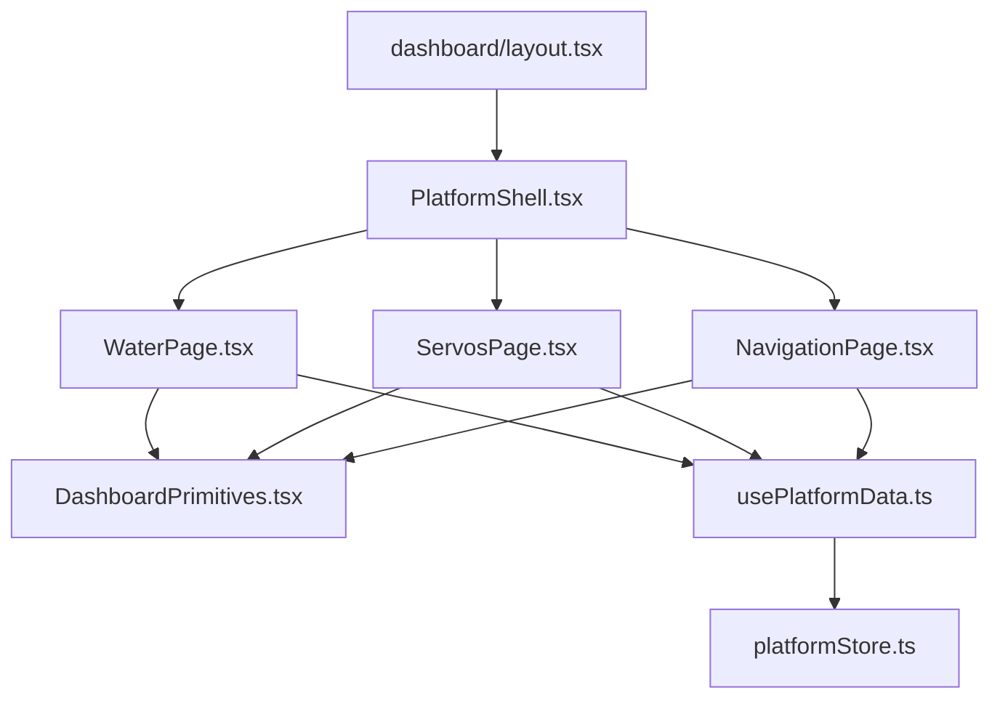
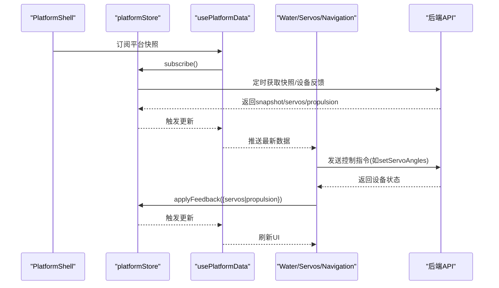
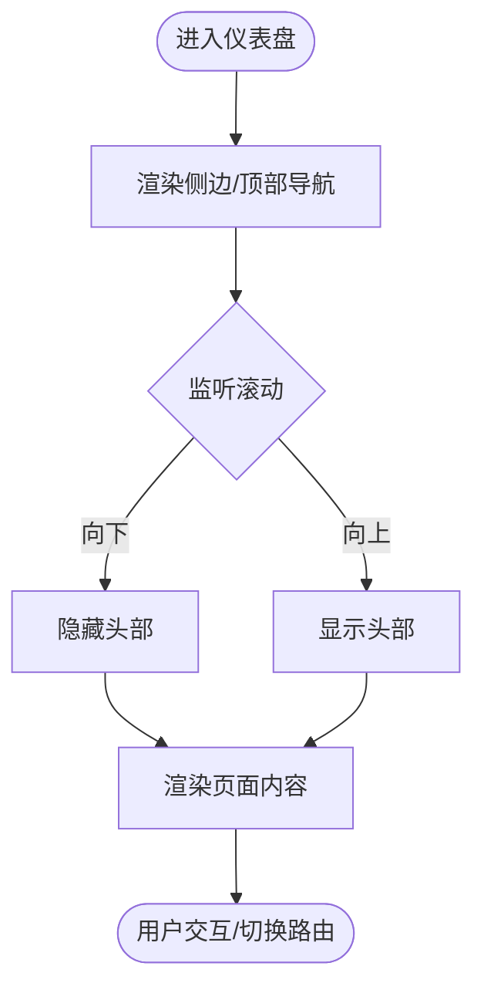
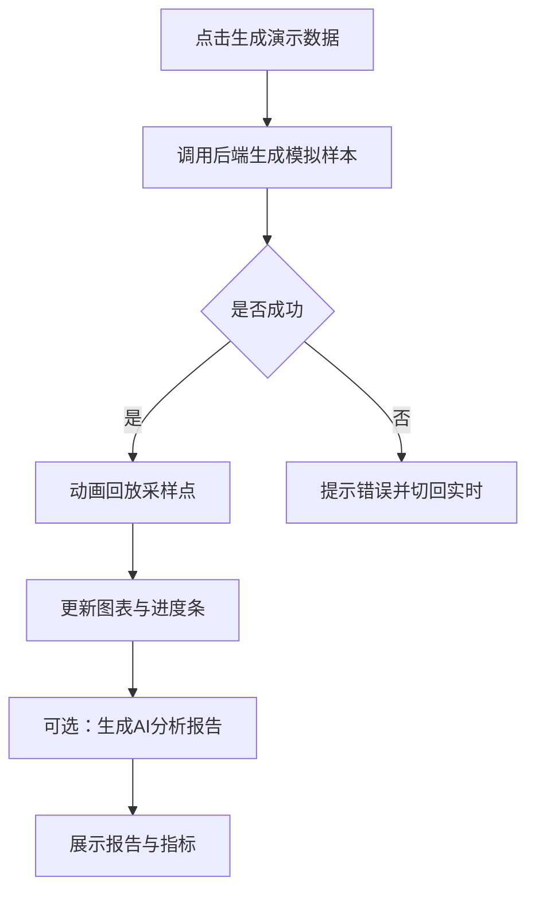
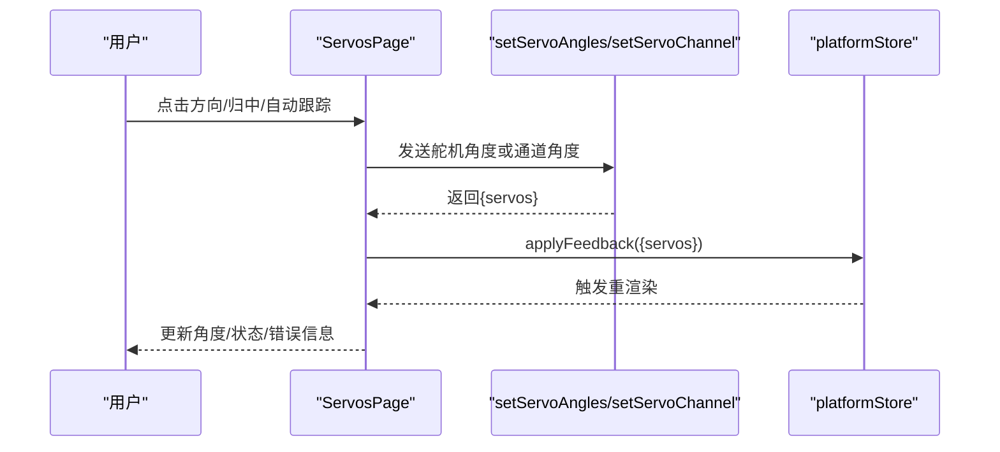
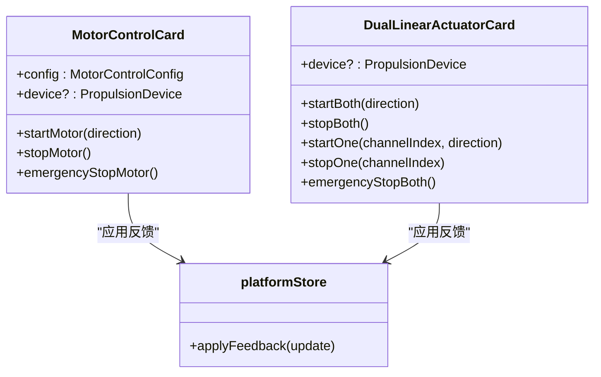
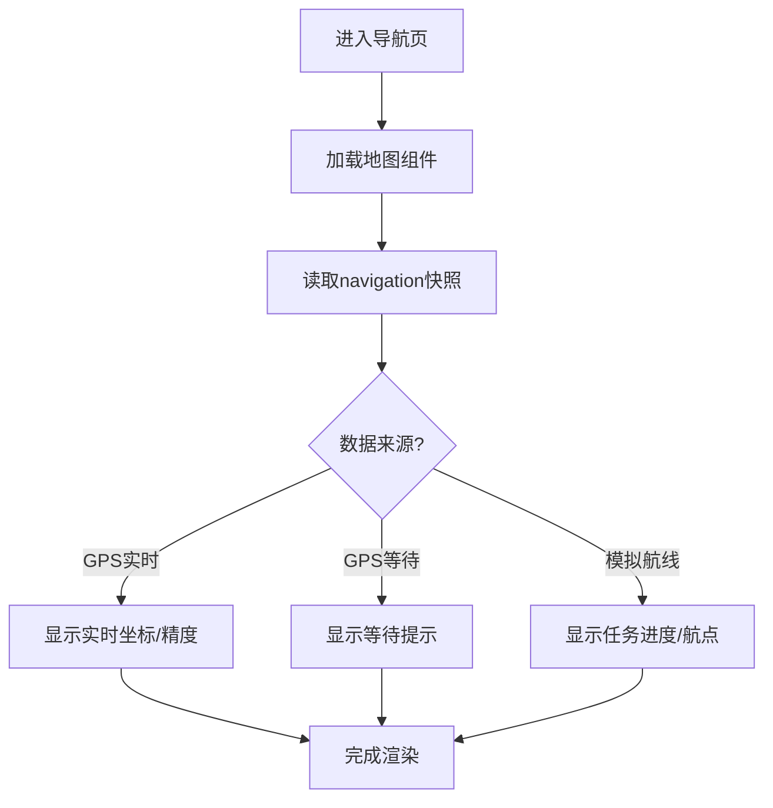
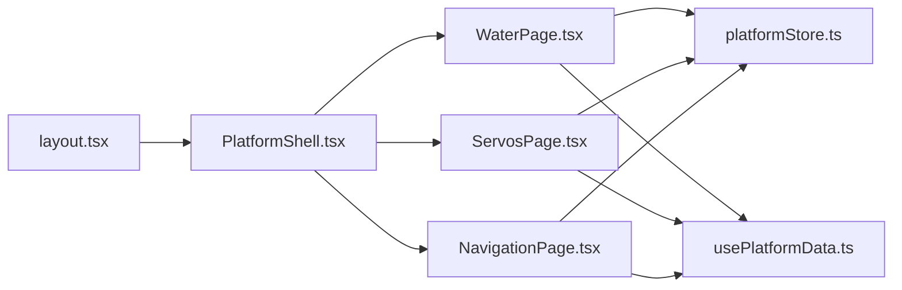

# Dashboard界面组件

<cite>
**本文引用的文件**
- [PlatformShell.tsx](file://apps/frontend/src/components/dashboard/PlatformShell.tsx)
- [DashboardPrimitives.tsx](file://apps/frontend/src/components/dashboard/DashboardPrimitives.tsx)
- [WaterPage.tsx](file://apps/frontend/src/components/dashboard/WaterPage.tsx)
- [ServosPage.tsx](file://apps/frontend/src/components/dashboard/ServosPage.tsx)
- [NavigationPage.tsx](file://apps/frontend/src/components/dashboard/NavigationPage.tsx)
- [MotorControlCard.tsx](file://apps/frontend/src/components/dashboard/MotorControlCard.tsx)
- [DualLinearActuatorCard.tsx](file://apps/frontend/src/components/dashboard/DualLinearActuatorCard.tsx)
- [usePlatformData.ts](file://apps/frontend/src/hooks/usePlatformData.ts)
- [platformStore.ts](file://apps/frontend/src/lib/platformStore.ts)
- [layout.tsx](file://apps/frontend/src/app/dashboard/layout.tsx)
- [propulsion/page.tsx](file://apps/frontend/src/app/dashboard/propulsion/page.tsx)
- [ai/page.tsx](file://apps/frontend/src/app/dashboard/ai/page.tsx)
</cite>

## 目录
1. [简介](#简介)
2. [项目结构](#项目结构)
3. [核心组件](#核心组件)
4. [架构总览](#架构总览)
5. [详细组件分析](#详细组件分析)
6. [依赖关系分析](#依赖关系分析)
7. [性能与响应式设计](#性能与响应式设计)
8. [故障排查指南](#故障排查指南)
9. [结论](#结论)
10. [附录：使用示例与扩展方法](#附录使用示例与扩展方法)

## 简介
本文件面向渔业数字孪船监控平台的 Dashboard 界面，系统性说明平台外壳（PlatformShell）与各功能页面组件的架构、数据流、状态同步、通信机制、响应式设计与移动端适配策略，并提供可复用的使用示例与扩展方法。重点覆盖：
- 平台外壳布局与导航设计
- 环境监测页面（WaterPage）
- 设备控制页面（ServosPage）
- 推进器控制相关卡片（MotorControlCard、DualLinearActuatorCard）
- 导航页面（NavigationPage）
- AI分析能力在环境监测中的集成
- 全局状态与数据同步（platformStore + usePlatformData）

## 项目结构
Dashboard 采用 Next.js App Router 组织页面，通过统一的布局包裹 PlatformShell，各功能页以独立组件实现，共享通用 UI 原语与全局状态。

图表来源
- [layout.tsx:1-7](file://apps/frontend/src/app/dashboard/layout.tsx#L1-L7)
- [PlatformShell.tsx:27-161](file://apps/frontend/src/components/dashboard/PlatformShell.tsx#L27-L161)
- [WaterPage.tsx:45-217](file://apps/frontend/src/components/dashboard/WaterPage.tsx#L45-L217)
- [ServosPage.tsx:111-731](file://apps/frontend/src/components/dashboard/ServosPage.tsx#L111-L731)
- [NavigationPage.tsx:44-144](file://apps/frontend/src/components/dashboard/NavigationPage.tsx#L44-L144)
- [usePlatformData.ts:1-24](file://apps/frontend/src/hooks/usePlatformData.ts#L1-L24)
- [platformStore.ts:1-196](file://apps/frontend/src/lib/platformStore.ts#L1-L196)

章节来源
- [layout.tsx:1-7](file://apps/frontend/src/app/dashboard/layout.tsx#L1-L7)
- [PlatformShell.tsx:27-161](file://apps/frontend/src/components/dashboard/PlatformShell.tsx#L27-L161)

## 核心组件
- 平台外壳 PlatformShell：提供侧边导航、顶部状态栏、滚动隐藏/显示逻辑、模块标题与在线状态展示，并渲染子页面内容。
- 页面框架 DashboardPrimitives：统一 PageFrame、PageHeader、StatusBadge、ActionButton、EmptyPanel、InfoPanel、TextList 等基础 UI。
- 数据层 usePlatformData + platformStore：集中订阅平台快照与设备反馈，保证多模块间数据一致性与最小化重渲染。
- 功能页面：
  - WaterPage：水质监测、趋势图、演示数据采集、AI分析报告。
  - ServosPage：云台手动/自动跟踪、水枪开关、电机与推杆控制。
  - NavigationPage：地图可视化、航点列表、GPS/模拟航线状态。
- 推进器控制卡片：MotorControlCard（单电机）、DualLinearActuatorCard（双路推杆）。

章节来源
- [PlatformShell.tsx:27-161](file://apps/frontend/src/components/dashboard/PlatformShell.tsx#L27-L161)
- [DashboardPrimitives.tsx:6-102](file://apps/frontend/src/components/dashboard/DashboardPrimitives.tsx#L6-L102)
- [usePlatformData.ts:1-24](file://apps/frontend/src/hooks/usePlatformData.ts#L1-L24)
- [platformStore.ts:20-139](file://apps/frontend/src/lib/platformStore.ts#L20-L139)
- [WaterPage.tsx:45-217](file://apps/frontend/src/components/dashboard/WaterPage.tsx#L45-L217)
- [ServosPage.tsx:111-731](file://apps/frontend/src/components/dashboard/ServosPage.tsx#L111-L731)
- [NavigationPage.tsx:44-144](file://apps/frontend/src/components/dashboard/NavigationPage.tsx#L44-L144)
- [MotorControlCard.tsx:27-439](file://apps/frontend/src/components/dashboard/MotorControlCard.tsx#L27-L439)
- [DualLinearActuatorCard.tsx:16-339](file://apps/frontend/src/components/dashboard/DualLinearActuatorCard.tsx#L16-L339)

## 架构总览
Dashboard 的数据流遵循“单一事实源”原则：platformStore 定时拉取平台快照与设备反馈，usePlatformData 暴露稳定切片给各页面；页面通过 API 调用写入设备指令后，将结果回灌到 store，形成闭环。

图表来源
- [platformStore.ts:98-139](file://apps/frontend/src/lib/platformStore.ts#L98-L139)
- [usePlatformData.ts:10-23](file://apps/frontend/src/hooks/usePlatformData.ts#L10-L23)
- [ServosPage.tsx:307-310](file://apps/frontend/src/components/dashboard/ServosPage.tsx#L307-L310)
- [ServosPage.tsx:438-441](file://apps/frontend/src/components/dashboard/ServosPage.tsx#L438-L441)
- [MotorControlCard.tsx:95-119](file://apps/frontend/src/components/dashboard/MotorControlCard.tsx#L95-L119)
- [DualLinearActuatorCard.tsx:45-74](file://apps/frontend/src/components/dashboard/DualLinearActuatorCard.tsx#L45-L74)

## 详细组件分析

### 平台外壳 PlatformShell
- 布局与导航：桌面端左侧固定导航，移动端顶部横向导航；根据当前路由高亮菜单项。
- 头部行为：滚动时自动隐藏/显示，保持内容区域最大化利用空间。
- 状态展示：数据时间、连接状态、在线指示灯。
- 可扩展性：新增菜单项只需在配置数组中添加条目。

图表来源
- [PlatformShell.tsx:37-70](file://apps/frontend/src/components/dashboard/PlatformShell.tsx#L37-L70)
- [PlatformShell.tsx:72-161](file://apps/frontend/src/components/dashboard/PlatformShell.tsx#L72-L161)

章节来源
- [PlatformShell.tsx:18-25](file://apps/frontend/src/components/dashboard/PlatformShell.tsx#L18-L25)
- [PlatformShell.tsx:27-161](file://apps/frontend/src/components/dashboard/PlatformShell.tsx#L27-L161)

### 环境监测页面 WaterPage
- 数据源：实时历史 water 数据来自 usePlatformData；支持“演示模式”生成模拟数据并动画回放。
- 图表：水温/溶解氧/pH 多轴折线图，支持时间范围切换与低氧区域标注。
- 分析与报告：本地异常判断与大模型报告生成（若配置），报告包含风险等级、关键发现、建议与预测指标。
- 摄像头面板：复用 NavigationCameraPanel 用于观测画面。

图表来源
- [WaterPage.tsx:109-145](file://apps/frontend/src/components/dashboard/WaterPage.tsx#L109-L145)
- [WaterPage.tsx:169-215](file://apps/frontend/src/components/dashboard/WaterPage.tsx#L169-L215)
- [WaterPage.tsx:403-538](file://apps/frontend/src/components/dashboard/WaterPage.tsx#L403-L538)

章节来源
- [WaterPage.tsx:45-217](file://apps/frontend/src/components/dashboard/WaterPage.tsx#L45-L217)
- [WaterPage.tsx:392-401](file://apps/frontend/src/components/dashboard/WaterPage.tsx#L392-L401)
- [WaterPage.tsx:403-612](file://apps/frontend/src/components/dashboard/WaterPage.tsx#L403-L612)

### 设备控制页面 ServosPage
- 云台控制：支持方向步进、归中、自动跟踪（基于视觉目标检测），具备安全区检测、锁定死区、平滑滤波与失锁处理。
- 水枪开关：一键开/关，角度映射为开/关位。
- 组合执行：集成 MotorControlCard 与 DualLinearActuatorCard，统一管理设备在线状态与指令下发。
- 状态同步：所有指令成功后通过 platformStore.applyFeedback 刷新设备状态，确保 UI 与设备一致。

图表来源
- [ServosPage.tsx:272-328](file://apps/frontend/src/components/dashboard/ServosPage.tsx#L272-L328)
- [ServosPage.tsx:330-461](file://apps/frontend/src/components/dashboard/ServosPage.tsx#L330-L461)
- [ServosPage.tsx:542-566](file://apps/frontend/src/components/dashboard/ServosPage.tsx#L542-L566)
- [ServosPage.tsx:568-590](file://apps/frontend/src/components/dashboard/ServosPage.tsx#L568-L590)

章节来源
- [ServosPage.tsx:111-731](file://apps/frontend/src/components/dashboard/ServosPage.tsx#L111-L731)

### 推进器控制卡片
- MotorControlCard：单电机/旋转执行器控制，支持功率滑块、方向按钮、心跳保活、运行时保护（冷却、往返周期、累计运行额度）、紧急停止。
- DualLinearActuatorCard：双路推杆同步/独立控制，计算 throttle/steering 并下发，支持紧急停止与板端 PWM 反馈。

图表来源
- [MotorControlCard.tsx:27-439](file://apps/frontend/src/components/dashboard/MotorControlCard.tsx#L27-L439)
- [DualLinearActuatorCard.tsx:16-339](file://apps/frontend/src/components/dashboard/DualLinearActuatorCard.tsx#L16-L339)
- [platformStore.ts:181-183](file://apps/frontend/src/lib/platformStore.ts#L181-L183)

章节来源
- [MotorControlCard.tsx:27-439](file://apps/frontend/src/components/dashboard/MotorControlCard.tsx#L27-L439)
- [DualLinearActuatorCard.tsx:16-339](file://apps/frontend/src/components/dashboard/DualLinearActuatorCard.tsx#L16-L339)

### 导航页面 NavigationPage
- 地图：动态加载 NavigationMap，无服务端渲染以避免浏览器 API 冲突。
- 状态：区分 GPS 实时定位、GPS 等待定位、模拟航线三种状态，展示速度、航向、卫星数/剩余航程、HDOP、ETA 等。
- 航点：列出前几个航点及当前位置坐标。

图表来源
- [NavigationPage.tsx:3-11](file://apps/frontend/src/components/dashboard/NavigationPage.tsx#L3-L11)
- [NavigationPage.tsx:44-144](file://apps/frontend/src/components/dashboard/NavigationPage.tsx#L44-L144)

章节来源
- [NavigationPage.tsx:44-144](file://apps/frontend/src/components/dashboard/NavigationPage.tsx#L44-L144)

### AI分析集成
- 在 WaterPage 中集成 AI 报告生成与展示，支持本地预测与大模型报告两种模式。
- 报告包含风险等级、关键发现、行动建议、预测周期、藻华风险、浊度趋势、续航估计等。

章节来源
- [WaterPage.tsx:392-401](file://apps/frontend/src/components/dashboard/WaterPage.tsx#L392-L401)
- [WaterPage.tsx:403-612](file://apps/frontend/src/components/dashboard/WaterPage.tsx#L403-L612)

## 依赖关系分析
- 页面与壳：所有页面通过 layout.tsx 被 PlatformShell 包裹，获得一致的导航与状态栏。
- 数据依赖：所有页面通过 usePlatformData 订阅 platformStore 提供的 snapshot/servos/propulsion。
- 控制路径：页面调用 API 下发指令后，将返回的设备状态通过 platformStore.applyFeedback 写回，形成闭环。

图表来源
- [layout.tsx:1-7](file://apps/frontend/src/app/dashboard/layout.tsx#L1-L7)
- [PlatformShell.tsx:27-161](file://apps/frontend/src/components/dashboard/PlatformShell.tsx#L27-L161)
- [usePlatformData.ts:10-23](file://apps/frontend/src/hooks/usePlatformData.ts#L10-L23)
- [platformStore.ts:181-196](file://apps/frontend/src/lib/platformStore.ts#L181-L196)

章节来源
- [layout.tsx:1-7](file://apps/frontend/src/app/dashboard/layout.tsx#L1-L7)
- [usePlatformData.ts:1-24](file://apps/frontend/src/hooks/usePlatformData.ts#L1-L24)
- [platformStore.ts:1-196](file://apps/frontend/src/lib/platformStore.ts#L1-L196)

## 性能与响应式设计
- 性能优化
  - 使用 useSyncExternalStore 与稳定切片对象，避免设备反馈频繁导致的全局重渲染。
  - 图表初始化延迟（visualReady）减少首屏阻塞。
  - 地图组件按需动态加载，禁用 SSR 以避免客户端 API 不兼容。
  - 控制指令心跳保活（800ms）确保设备持续接收命令。
- 响应式与移动端适配
  - 桌面端侧边导航，移动端顶部横向导航。
  - 网格布局自适应（grid-cols-*），图表容器使用 ResponsiveContainer。
  - 头部滚动隐藏提升内容可视面积。
  - 大圆角、阴影与留白提升触控友好性。

章节来源
- [platformStore.ts:53-57](file://apps/frontend/src/lib/platformStore.ts#L53-L57)
- [DashboardPrimitives.tsx:95-102](file://apps/frontend/src/components/dashboard/DashboardPrimitives.tsx#L95-L102)
- [NavigationPage.tsx:3-11](file://apps/frontend/src/components/dashboard/NavigationPage.tsx#L3-L11)
- [PlatformShell.tsx:72-161](file://apps/frontend/src/components/dashboard/PlatformShell.tsx#L72-L161)
- [MotorControlCard.tsx:121-131](file://apps/frontend/src/components/dashboard/MotorControlCard.tsx#L121-L131)
- [DualLinearActuatorCard.tsx:76-85](file://apps/frontend/src/components/dashboard/DualLinearActuatorCard.tsx#L76-L85)

## 故障排查指南
- 连接与数据
  - 检查平台快照与设备反馈是否成功拉取（store 内部已维护 connected 标志）。
  - 若 AI 报告生成失败，确认后端与密钥配置。
- 设备控制
  - 舵机/电机离线时，操作将被禁用或报错；请检查设备在线状态。
  - 云台自动跟踪需满足稳定帧与安全区条件，否则进入 waiting/acquiring/safety 状态。
- 运行时保护
  - 推杆/电机可能处于冷却或安全锁定状态，需按提示解除后再操作。
- 常见错误位置
  - 舵机控制错误提示：ServosPage 中设置角度失败后的错误分支。
  - 电机控制错误提示：MotorControlCard 中命令发送失败的 catch 分支。
  - 双推杆错误提示：DualLinearActuatorCard 中命令发送失败的 catch 分支。

章节来源
- [ServosPage.tsx:307-316](file://apps/frontend/src/components/dashboard/ServosPage.tsx#L307-L316)
- [ServosPage.tsx:438-446](file://apps/frontend/src/components/dashboard/ServosPage.tsx#L438-L446)
- [MotorControlCard.tsx:114-118](file://apps/frontend/src/components/dashboard/MotorControlCard.tsx#L114-L118)
- [DualLinearActuatorCard.tsx:69-73](file://apps/frontend/src/components/dashboard/DualLinearActuatorCard.tsx#L69-L73)
- [WaterPage.tsx:452-458](file://apps/frontend/src/components/dashboard/WaterPage.tsx#L452-L458)

## 结论
Dashboard 通过统一的外壳与稳定的全局状态管理，实现了多模块间的解耦与一致性。WaterPage、ServosPage、NavigationPage 分别聚焦环境、设备与航行三大场景，配合 MotorControlCard 与 DualLinearActuatorCard 完成对推进器的精细化控制。整体架构具备良好的扩展性、响应式体验与健壮的错误处理，适合在真实硬件环境中稳定运行。

## 附录：使用示例与扩展方法
- 新增导航菜单
  - 在 PlatformShell 的导航数组中添加新的 href、label 与图标即可。
- 接入新页面
  - 在 dashboard 目录下创建 page.tsx，并在 PlatformShell 中添加对应路由。
- 自定义控制卡片
  - 参考 MotorControlCard/DualLinearActuatorCard 的接口，传入 deviceId、maxPower、directionMultiplier 等配置，并通过 platformStore.applyFeedback 同步状态。
- 扩展 AI 分析
  - 在 WaterPage 的分析区域增加新的指标或报告字段，保持与 AIReport 类型一致。
- 调整数据频率
  - 通过 platformStore 中的定时器间隔调整快照与反馈刷新频率（谨慎修改，避免网络压力）。

章节来源
- [PlatformShell.tsx:18-25](file://apps/frontend/src/components/dashboard/PlatformShell.tsx#L18-L25)
- [MotorControlCard.tsx:10-25](file://apps/frontend/src/components/dashboard/MotorControlCard.tsx#L10-L25)
- [DualLinearActuatorCard.tsx:9-13](file://apps/frontend/src/components/dashboard/DualLinearActuatorCard.tsx#L9-L13)
- [platformStore.ts:20-21](file://apps/frontend/src/lib/platformStore.ts#L20-L21)