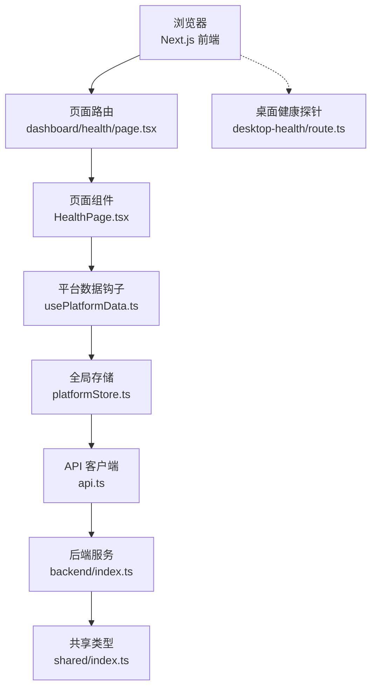
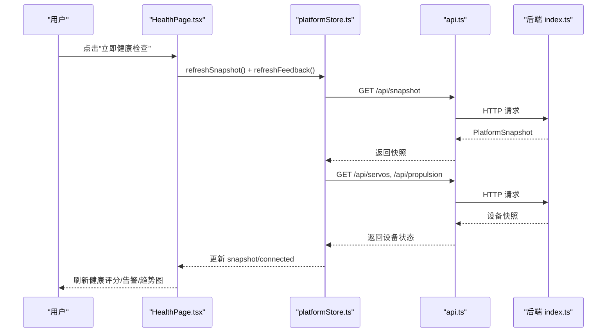
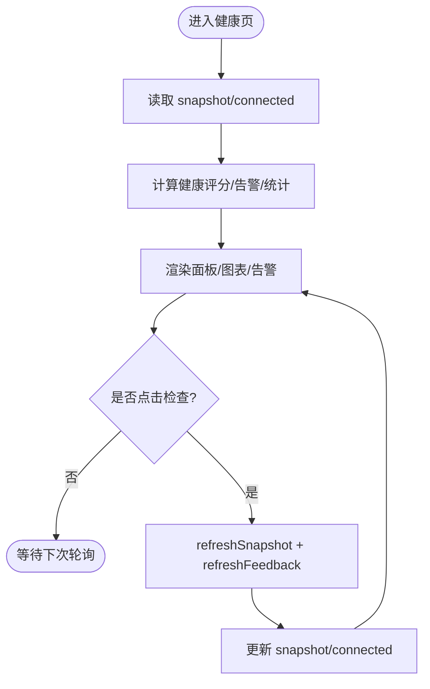
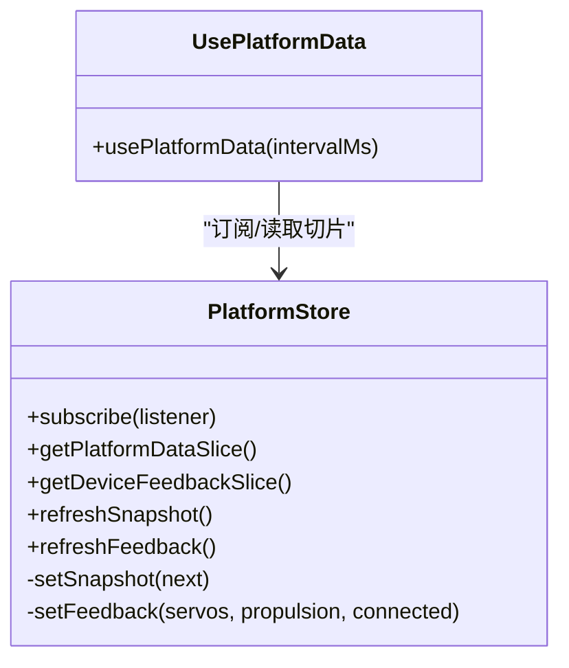
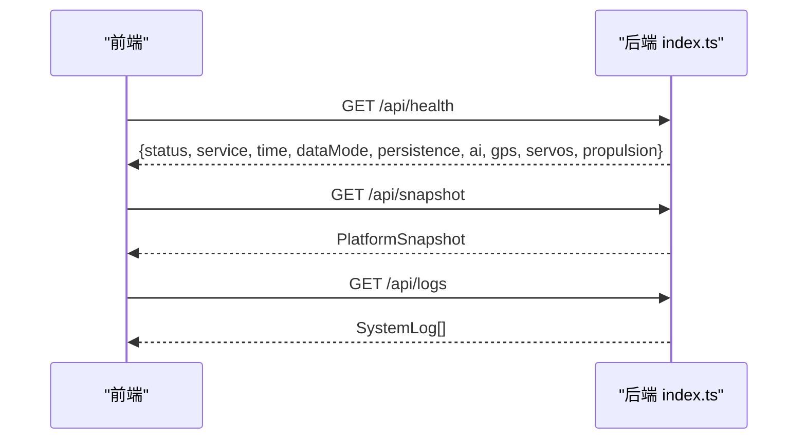
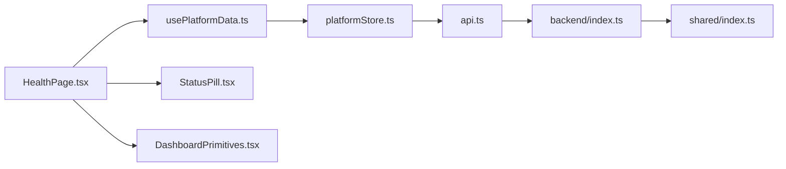

# 健康监控页面

<cite>
**本文引用的文件**
- [HealthPage.tsx](file://fishery-digital-twin-platform/apps/frontend/src/components/dashboard/HealthPage.tsx)
- [health/page.tsx](file://fishery-digital-twin-platform/apps/frontend/src/app/dashboard/health/page.tsx)
- [route.ts](file://fishery-digital-twin-platform/apps/frontend/src/app/api/desktop-health/route.ts)
- [usePlatformData.ts](file://fishery-digital-twin-platform/apps/frontend/src/hooks/usePlatformData.ts)
- [platformStore.ts](file://fishery-digital-twin-platform/apps/frontend/src/lib/platformStore.ts)
- [api.ts](file://fishery-digital-twin-platform/apps/frontend/src/lib/api.ts)
- [StatusPill.tsx](file://fishery-digital-twin-platform/apps/frontend/src/components/ui/StatusPill.tsx)
- [DashboardPrimitives.tsx](file://fishery-digital-twin-platform/apps/frontend/src/components/dashboard/DashboardPrimitives.tsx)
- [index.ts（后端入口）](file://fishery-digital-twin-platform/apps/backend/src/index.ts)
- [index.ts（共享类型定义）](file://fishery-digital-twin-platform/packages/shared/src/index.ts)
</cite>

## 目录
1. [简介](#简介)
2. [项目结构](#项目结构)
3. [核心组件](#核心组件)
4. [架构总览](#架构总览)
5. [详细组件分析](#详细组件分析)
6. [依赖关系分析](#依赖关系分析)
7. [性能与可观测性](#性能与可观测性)
8. [故障排查指南](#故障排查指南)
9. [结论](#结论)
10. [附录：配置与告警建议](#附录配置与告警建议)

## 简介
本页面提供船舶数字孪生平台的“健康管理”视图，用于集中展示系统健康状态、设备连接情况、电源系统与核心设备状态、最近告警与健康评分趋势。它通过前端组件 HealthPage 聚合平台快照数据，结合后端接口提供的实时/模拟数据，形成对系统资源、设备连通性与服务可用性的可视化监控。

该文档面向运维与产品人员，既解释实现机制，也给出配置、调优与排障建议。

## 项目结构
健康监控相关的前端路由与组件位于 Next.js 应用内，后端提供统一 API，共享类型定义在 packages/shared 中。关键路径如下：
- 页面路由：apps/frontend/src/app/dashboard/health/page.tsx
- 页面组件：apps/frontend/src/components/dashboard/HealthPage.tsx
- 数据获取与轮询：apps/frontend/src/lib/platformStore.ts、apps/frontend/src/hooks/usePlatformData.ts、apps/frontend/src/lib/api.ts
- 后端健康与快照接口：apps/backend/src/index.ts
- 桌面端轻量健康探针：apps/frontend/src/app/api/desktop-health/route.ts
- 共享数据类型：packages/shared/src/index.ts

图表来源
- [health/page.tsx:1-6](file://fishery-digital-twin-platform/apps/frontend/src/app/dashboard/health/page.tsx#L1-L6)
- [HealthPage.tsx:13-204](file://fishery-digital-twin-platform/apps/frontend/src/components/dashboard/HealthPage.tsx#L13-L204)
- [usePlatformData.ts:1-24](file://fishery-digital-twin-platform/apps/frontend/src/hooks/usePlatformData.ts#L1-L24)
- [platformStore.ts:1-196](file://fishery-digital-twin-platform/apps/frontend/src/lib/platformStore.ts#L1-L196)
- [api.ts:1-101](file://fishery-digital-twin-platform/apps/frontend/src/lib/api.ts#L1-L101)
- [index.ts（后端入口）:322-346](file://fishery-digital-twin-platform/apps/backend/src/index.ts#L322-L346)
- [route.ts:1-10](file://fishery-digital-twin-platform/apps/frontend/src/app/api/desktop-health/route.ts#L1-L10)
- [index.ts（共享类型定义）:86-106](file://fishery-digital-twin-platform/packages/shared/src/index.ts#L86-L106)

章节来源
- [health/page.tsx:1-6](file://fishery-digital-twin-platform/apps/frontend/src/app/dashboard/health/page.tsx#L1-L6)
- [HealthPage.tsx:13-204](file://fishery-digital-twin-platform/apps/frontend/src/components/dashboard/HealthPage.tsx#L13-L204)
- [platformStore.ts:1-196](file://fishery-digital-twin-platform/apps/frontend/src/lib/platformStore.ts#L1-L196)
- [api.ts:1-101](file://fishery-digital-twin-platform/apps/frontend/src/lib/api.ts#L1-L101)
- [index.ts（后端入口）:322-346](file://fishery-digital-twin-platform/apps/backend/src/index.ts#L322-L346)
- [route.ts:1-10](file://fishery-digital-twin-platform/apps/frontend/src/app/api/desktop-health/route.ts#L1-L10)
- [index.ts（共享类型定义）:86-106](file://fishery-digital-twin-platform/packages/shared/src/index.ts#L86-L106)

## 核心组件
- HealthPage：健康监控主视图，负责渲染综合健康评分、设备统计、电源系统、核心设备状态、最近告警与健康趋势图。
- usePlatformData：基于 React 外部存储订阅，提供 snapshot、connected、updatedAt 等响应式数据。
- platformStore：集中管理平台快照与设备反馈的轮询、去抖、错误处理与连接状态。
- api：封装 HTTP 请求，统一超时、鉴权头与错误抛出。
- StatusPill：设备状态小标签，显示在线/预警/离线。
- DashboardPrimitives：页面框架与通用 UI 原语。

章节来源
- [HealthPage.tsx:13-204](file://fishery-digital-twin-platform/apps/frontend/src/components/dashboard/HealthPage.tsx#L13-L204)
- [usePlatformData.ts:1-24](file://fishery-digital-twin-platform/apps/frontend/src/hooks/usePlatformData.ts#L1-L24)
- [platformStore.ts:1-196](file://fishery-digital-twin-platform/apps/frontend/src/lib/platformStore.ts#L1-L196)
- [api.ts:1-101](file://fishery-digital-twin-platform/apps/frontend/src/lib/api.ts#L1-L101)
- [StatusPill.tsx:1-24](file://fishery-digital-twin-platform/apps/frontend/src/components/ui/StatusPill.tsx#L1-L24)
- [DashboardPrimitives.tsx:1-102](file://fishery-digital-twin-platform/apps/frontend/src/components/dashboard/DashboardPrimitives.tsx#L1-L102)

## 架构总览
健康监控的数据流从后端到前端再到可视化呈现：
- 后端暴露 /api/snapshot、/api/vessel、/api/batteries、/api/servos、/api/propulsion、/api/logs 等接口，并维护水质历史、电池、AI 报告与系统日志。
- 前端 platformStore 定时拉取快照与设备反馈，使用 useSyncExternalStore 将数据同步给所有订阅者。
- HealthPage 消费 snapshot 计算健康评分、告警项与趋势图，并通过“立即健康检查”触发一次刷新。

图表来源
- [HealthPage.tsx:37-47](file://fishery-digital-twin-platform/apps/frontend/src/components/dashboard/HealthPage.tsx#L37-L47)
- [platformStore.ts:98-130](file://fishery-digital-twin-platform/apps/frontend/src/lib/platformStore.ts#L98-L130)
- [api.ts:26-72](file://fishery-digital-twin-platform/apps/frontend/src/lib/api.ts#L26-L72)
- [index.ts（后端入口）:322-346](file://fishery-digital-twin-platform/apps/backend/src/index.ts#L322-L346)

## 详细组件分析

### HealthPage 组件：状态检测、指标与可视化
- 数据来源：通过 usePlatformData 获取 snapshot、connected、updatedAt；snapshot.vessel 包含 esp32/pixhawk/communication/sensor 等设备状态；snapshot.batteries 为多电池列表；snapshot.navigation.targetWaypoint 显示当前航点。
- 健康评分：根据活跃告警数、严重故障数与平均电量计算，范围 0-100，并映射为“良好/需关注/预警”。
- 告警收集：筛选非在线设备与低电量/异常电池，生成“最近告警”列表。
- 可视化：使用面积图展示近 12 个时间点的健康评分趋势（基于当前快照推算）。
- 交互：支持“立即健康检查”，调用 platformStore.refreshSnapshot 与 refreshFeedback 主动刷新。

图表来源
- [HealthPage.tsx:18-35](file://fishery-digital-twin-platform/apps/frontend/src/components/dashboard/HealthPage.tsx#L18-L35)
- [HealthPage.tsx:37-47](file://fishery-digital-twin-platform/apps/frontend/src/components/dashboard/HealthPage.tsx#L37-L47)
- [HealthPage.tsx:158-200](file://fishery-digital-twin-platform/apps/frontend/src/components/dashboard/HealthPage.tsx#L158-L200)

章节来源
- [HealthPage.tsx:13-204](file://fishery-digital-twin-platform/apps/frontend/src/components/dashboard/HealthPage.tsx#L13-L204)

### 数据层：platformStore 与 usePlatformData
- 轮询策略：每 2 秒拉取平台快照，每 1 秒拉取舵机/推进器反馈，保证界面及时刷新。
- 连接状态：当快照或设备反馈请求失败时，设置 snapshotConnected/feedbackConnected 为 false，并在 UI 中体现。
- 并发控制：同一时刻仅允许一个快照/反馈刷新任务，避免重复请求。
- 初始值：使用确定性初始快照，避免 SSR/CSR 水合不一致。

图表来源
- [platformStore.ts:20-196](file://fishery-digital-twin-platform/apps/frontend/src/lib/platformStore.ts#L20-L196)
- [usePlatformData.ts:1-24](file://fishery-digital-twin-platform/apps/frontend/src/hooks/usePlatformData.ts#L1-L24)

章节来源
- [platformStore.ts:1-196](file://fishery-digital-twin-platform/apps/frontend/src/lib/platformStore.ts#L1-L196)
- [usePlatformData.ts:1-24](file://fishery-digital-twin-platform/apps/frontend/src/hooks/usePlatformData.ts#L1-L24)

### 后端接口：健康、快照与服务可用性
- /api/health：返回服务名、运行时间与数据模式、持久化状态、AI/GPS/舵机/推进器状态。
- /api/snapshot：返回完整平台快照（水质历史、电池、导航、AI 报告、船体状态）。
- /api/vessel、/api/batteries、/api/servos、/api/propulsion：细粒度查询设备与子系统状态。
- /api/logs：系统日志，便于问题定位。
- 桌面端探针：/api/desktop-health 返回 Web 服务基础健康信息。

图表来源
- [index.ts（后端入口）:322-346](file://fishery-digital-twin-platform/apps/backend/src/index.ts#L322-L346)
- [index.ts（后端入口）:557-557](file://fishery-digital-twin-platform/apps/backend/src/index.ts#L557-L557)
- [route.ts:1-10](file://fishery-digital-twin-platform/apps/frontend/src/app/api/desktop-health/route.ts#L1-L10)

章节来源
- [index.ts（后端入口）:322-346](file://fishery-digital-twin-platform/apps/backend/src/index.ts#L322-L346)
- [index.ts（后端入口）:557-557](file://fishery-digital-twin-platform/apps/backend/src/index.ts#L557-L557)
- [route.ts:1-10](file://fishery-digital-twin-platform/apps/frontend/src/app/api/desktop-health/route.ts#L1-L10)

### 类型与模型：共享数据结构
- VesselStatus：包含 esp32/pixhawk/communication/sensor 等设备状态与任务信息。
- BatteryData：电池 ID、百分比、电压、状态、来源与更新时间。
- PlatformSnapshot：聚合水质、电池、导航、AI 报告与船体状态。
- ServoSnapshot/PropulsionSnapshot：舵机与推进器的设备集合与在线计数。

章节来源
- [index.ts（共享类型定义）:86-106](file://fishery-digital-twin-platform/packages/shared/src/index.ts#L86-L106)
- [index.ts（共享类型定义）:19-26](file://fishery-digital-twin-platform/packages/shared/src/index.ts#L19-L26)
- [index.ts（共享类型定义）:108-177](file://fishery-digital-twin-platform/packages/shared/src/index.ts#L108-L177)

## 依赖关系分析
- HealthPage 依赖 usePlatformData 提供的 snapshot/connected，以及 platformStore 的刷新能力。
- platformStore 依赖 api 模块发起网络请求，并依赖 shared 中的类型约束。
- 后端依赖 GPS、舵机、推进器、AI 等子系统状态，组合成快照与健康信息。
- 前端还可通过 /api/logs 获取系统日志，辅助健康诊断。

图表来源
- [HealthPage.tsx:1-204](file://fishery-digital-twin-platform/apps/frontend/src/components/dashboard/HealthPage.tsx#L1-L204)
- [usePlatformData.ts:1-24](file://fishery-digital-twin-platform/apps/frontend/src/hooks/usePlatformData.ts#L1-L24)
- [platformStore.ts:1-196](file://fishery-digital-twin-platform/apps/frontend/src/lib/platformStore.ts#L1-L196)
- [api.ts:1-101](file://fishery-digital-twin-platform/apps/frontend/src/lib/api.ts#L1-L101)
- [index.ts（后端入口）:322-346](file://fishery-digital-twin-platform/apps/backend/src/index.ts#L322-L346)
- [index.ts（共享类型定义）:86-106](file://fishery-digital-twin-platform/packages/shared/src/index.ts#L86-L106)

章节来源
- [HealthPage.tsx:1-204](file://fishery-digital-twin-platform/apps/frontend/src/components/dashboard/HealthPage.tsx#L1-L204)
- [platformStore.ts:1-196](file://fishery-digital-twin-platform/apps/frontend/src/lib/platformStore.ts#L1-L196)
- [api.ts:1-101](file://fishery-digital-twin-platform/apps/frontend/src/lib/api.ts#L1-L101)
- [index.ts（后端入口）:322-346](file://fishery-digital-twin-platform/apps/backend/src/index.ts#L322-L346)
- [index.ts（共享类型定义）:86-106](file://fishery-digital-twin-platform/packages/shared/src/index.ts#L86-L106)

## 性能与可观测性
- 轮询频率：快照 2 秒、设备反馈 1 秒，兼顾实时性与负载。可根据实际网络与后端压力调整 platformStore 中的间隔。
- 请求合并：refreshSnapshot/refreshFeedback 使用 Promise 去重，避免重复请求。
- 错误降级：网络失败时设置连接状态为断开，UI 提示“后端连接已断开”，保障用户体验。
- 可视化优化：趋势图仅在视觉就绪后渲染，减少首屏阻塞。
- 日志与诊断：通过 /api/logs 获取系统日志，结合 /api/health 快速判断服务与子系统状态。

[本节为通用指导，不直接分析具体文件]

## 故障排查指南
- 页面无法加载或无数据：
  - 检查后端 /api/health 与 /api/snapshot 是否可达。
  - 查看 platformStore 的 snapshotConnected/feedbackConnected 是否为 true。
  - 确认 NEXT_PUBLIC_API_BASE 与环境变量是否正确。
- 设备状态异常：
  - 通过 /api/vessel、/api/servos、/api/propulsion 检查各子系统在线情况。
  - 若 esp32/communication/sensor 离线，优先检查设备供电与通信链路。
- 电池告警：
  - 低电量或状态非 online 会触发“最近告警”，建议在返航前检查对应电池。
- 趋势图不显示：
  - 确保视觉就绪后再渲染图表；如仍不显示，检查 recharts 依赖与容器尺寸。
- 日志分析：
  - 调用 /api/logs 获取最近系统日志，按级别筛选 info/warning/error，定位问题来源。

章节来源
- [platformStore.ts:98-130](file://fishery-digital-twin-platform/apps/frontend/src/lib/platformStore.ts#L98-L130)
- [api.ts:6-24](file://fishery-digital-twin-platform/apps/frontend/src/lib/api.ts#L6-L24)
- [index.ts（后端入口）:322-346](file://fishery-digital-twin-platform/apps/backend/src/index.ts#L322-L346)
- [index.ts（后端入口）:557-557](file://fishery-digital-twin-platform/apps/backend/src/index.ts#L557-L557)

## 结论
健康监控页面以 HealthPage 为核心，结合 platformStore 的轮询与错误处理，将后端提供的设备状态、电源信息与导航数据整合为直观的健康评分、告警列表与趋势图。通过 /api/health、/api/snapshot、/api/logs 等接口，可实现对系统资源、设备连接与服务可用性的持续监控与快速诊断。配合合理的轮询策略与日志分析，能有效支撑日常巡检与故障处置。

[本节为总结性内容，不直接分析具体文件]

## 附录：配置与告警建议
- 监控配置选项
  - 轮询间隔：可在 platformStore 中调整 SNAPSHOT_INTERVAL 与 FEEDBACK_INTERVAL，平衡实时性与负载。
  - 超时与重试：api.ts 默认 5 秒超时，可按网络环境调整 AbortSignal.timeout。
  - 鉴权：如需 LAN 控制，需在环境变量配置 UISYS_API_TOKEN，并在请求头携带 X-UISYS-Token。
- 告警规则建议
  - 设备离线：esp32/communication/sensor 任一 offline 即触发告警。
  - 电池低电量：percentage <= 30 或 status !== online 视为需关注。
  - 通信异常：vessel.communication 非 online 时提示通信异常。
- 日志分析
  - 使用 /api/logs 获取系统事件，结合 /api/health 的子系统状态进行交叉验证。
  - 针对 AI 报告生成失败、GPS 未定位、舵机/推进器命令异常等场景，优先查看日志来源与错误消息。

章节来源
- [platformStore.ts:20-21](file://fishery-digital-twin-platform/apps/frontend/src/lib/platformStore.ts#L20-L21)
- [api.ts:6-24](file://fishery-digital-twin-platform/apps/frontend/src/lib/api.ts#L6-L24)
- [index.ts（后端入口）:143-157](file://fishery-digital-twin-platform/apps/backend/src/index.ts#L143-L157)
- [index.ts（后端入口）:322-346](file://fishery-digital-twin-platform/apps/backend/src/index.ts#L322-L346)
- [index.ts（后端入口）:557-557](file://fishery-digital-twin-platform/apps/backend/src/index.ts#L557-L557)