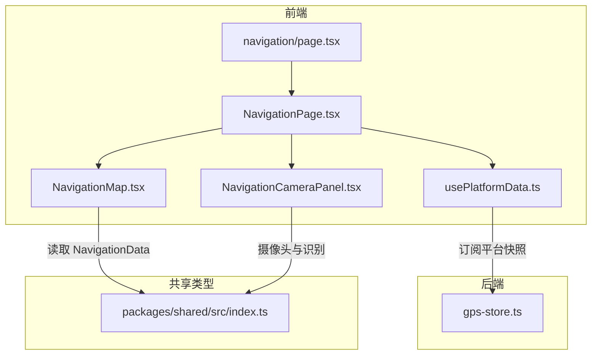
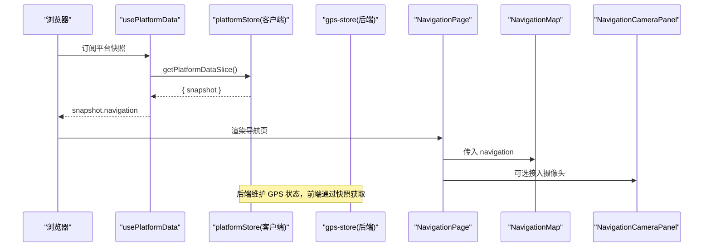
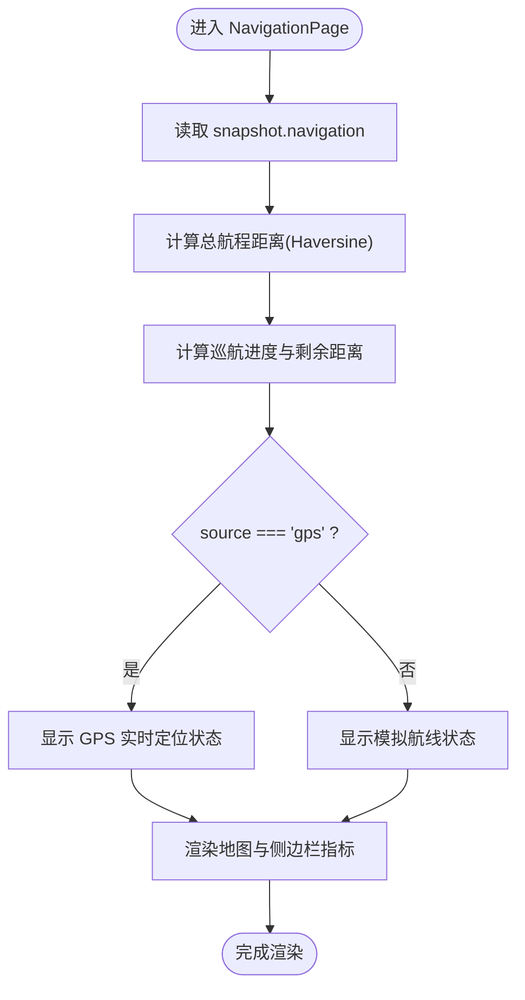
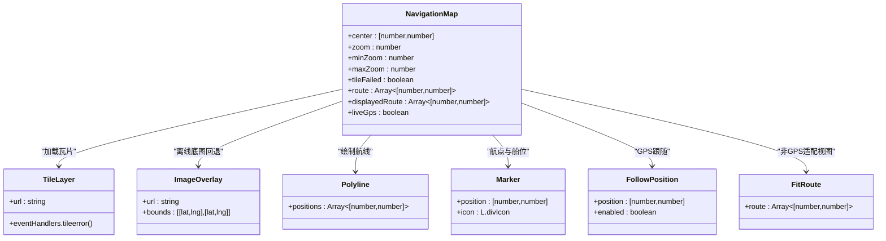
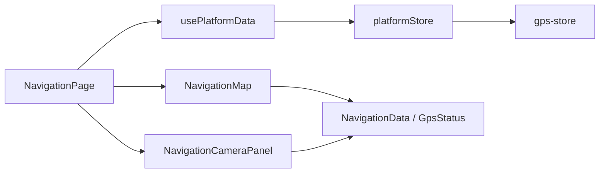

# 导航定位页面

<cite>
**本文引用的文件**
- [NavigationPage.tsx](file://fishery-digital-twin-platform/apps/frontend/src/components/dashboard/NavigationPage.tsx)
- [NavigationMap.tsx](file://fishery-digital-twin-platform/apps/frontend/src/components/map/NavigationMap.tsx)
- [NavigationCameraPanel.tsx](file://fishery-digital-twin-platform/apps/frontend/src/components/dashboard/NavigationCameraPanel.tsx)
- [navigation/page.tsx](file://fishery-digital-twin-platform/apps/frontend/src/app/dashboard/navigation/page.tsx)
- [usePlatformData.ts](file://fishery-digital-twin-platform/apps/frontend/src/hooks/usePlatformData.ts)
- [gps-store.ts](file://fishery-digital-twin-platform/apps/backend/src/gps-store.ts)
- [index.ts（共享类型）](file://fishery-digital-twin-platform/packages/shared/src/index.ts)
</cite>

## 目录
1. [简介](#简介)
2. [项目结构](#项目结构)
3. [核心组件](#核心组件)
4. [架构总览](#架构总览)
5. [详细组件分析](#详细组件分析)
6. [依赖关系分析](#依赖关系分析)
7. [性能与优化](#性能与优化)
8. [故障排查指南](#故障排查指南)
9. [结论](#结论)
10. [附录：使用示例与配置](#附录使用示例与配置)

## 简介
本页面聚焦“导航定位”能力，围绕以下目标展开：
- NavigationPage 组件的架构设计与数据流组织
- 地图渲染引擎（Leaflet + React Leaflet）与图层管理、交互控制
- GPS 数据可视化与航线规划展示
- NavigationCameraPanel 摄像头集成与实时画面显示
- 地图服务配置、坐标系统约束与路径计算算法
- 导航功能使用示例、位置精度优化建议与离线地图支持

## 项目结构
导航定位相关的前端页面由路由入口、页面容器、地图组件和摄像头面板组成；后端提供 GPS 状态管理与校验。共享类型定义统一了数据结构契约。



图表来源
- [navigation/page.tsx:1-6](file://fishery-digital-twin-platform/apps/frontend/src/app/dashboard/navigation/page.tsx#L1-L6)
- [NavigationPage.tsx:1-145](file://fishery-digital-twin-platform/apps/frontend/src/components/dashboard/NavigationPage.tsx#L1-L145)
- [NavigationMap.tsx:1-137](file://fishery-digital-twin-platform/apps/frontend/src/components/map/NavigationMap.tsx#L1-L137)
- [NavigationCameraPanel.tsx:1-800](file://fishery-digital-twin-platform/apps/frontend/src/components/dashboard/NavigationCameraPanel.tsx#L1-L800)
- [usePlatformData.ts:1-24](file://fishery-digital-twin-platform/apps/frontend/src/hooks/usePlatformData.ts#L1-L24)
- [gps-store.ts:1-103](file://fishery-digital-twin-platform/apps/backend/src/gps-store.ts#L1-L103)
- [index.ts（共享类型）:28-63](file://fishery-digital-twin-platform/packages/shared/src/index.ts#L28-L63)

章节来源
- [navigation/page.tsx:1-6](file://fishery-digital-twin-platform/apps/frontend/src/app/dashboard/navigation/page.tsx#L1-L6)
- [NavigationPage.tsx:1-145](file://fishery-digital-twin-platform/apps/frontend/src/components/dashboard/NavigationPage.tsx#L1-L145)
- [NavigationMap.tsx:1-137](file://fishery-digital-twin-platform/apps/frontend/src/components/map/NavigationMap.tsx#L1-L137)
- [NavigationCameraPanel.tsx:1-800](file://fishery-digital-twin-platform/apps/frontend/src/components/dashboard/NavigationCameraPanel.tsx#L1-L800)
- [usePlatformData.ts:1-24](file://fishery-digital-twin-platform/apps/frontend/src/hooks/usePlatformData.ts#L1-L24)
- [gps-store.ts:1-103](file://fishery-digital-twin-platform/apps/backend/src/gps-store.ts#L1-L103)
- [index.ts（共享类型）:28-63](file://fishery-digital-twin-platform/packages/shared/src/index.ts#L28-L63)

## 核心组件
- 导航页面容器 NavigationPage：聚合导航数据、计算航程进度、展示状态与侧边栏指标，并嵌入地图与摄像头面板。
- 地图组件 NavigationMap：基于 Leaflet 的地图渲染，负责瓦片加载、路线绘制、航点标记、跟随定位与自动适配视图。
- 摄像头面板 NavigationCameraPanel：实现摄像头枚举、权限处理、实时预览、截图录制、对象检测与跟踪输出。
- 数据源 usePlatformData：通过外部存储订阅平台快照，保证多模块数据一致。
- 后端 GPS 状态 gps-store：接收并校验 GPS 数据，维护在线与有效状态，限制坐标系统为 WGS84。
- 共享类型 index.ts：统一定义 NavigationData、GpsStatus、NavigationPoint 等关键结构。

章节来源
- [NavigationPage.tsx:44-145](file://fishery-digital-twin-platform/apps/frontend/src/components/dashboard/NavigationPage.tsx#L44-L145)
- [NavigationMap.tsx:27-86](file://fishery-digital-twin-platform/apps/frontend/src/components/map/NavigationMap.tsx#L27-L86)
- [NavigationCameraPanel.tsx:259-314](file://fishery-digital-twin-platform/apps/frontend/src/components/dashboard/NavigationCameraPanel.tsx#L259-L314)
- [usePlatformData.ts:10-23](file://fishery-digital-twin-platform/apps/frontend/src/hooks/usePlatformData.ts#L10-L23)
- [gps-store.ts:46-103](file://fishery-digital-twin-platform/apps/backend/src/gps-store.ts#L46-L103)
- [index.ts（共享类型）:28-63](file://fishery-digital-twin-platform/packages/shared/src/index.ts#L28-L63)

## 架构总览
导航定位系统采用前后端分离与组件化设计：
- 前端通过 usePlatformData 订阅平台快照，NavigationPage 消费导航数据并驱动 UI。
- NavigationMap 将导航数据映射到 Leaflet 图层，支持瓦片失败回退到离线底图。
- NavigationCameraPanel 独立管理摄像头生命周期，输出跟踪观察结果供上层业务使用。
- 后端 gps-store 对 GPS 输入进行严格校验，仅接受 WGS84 坐标，并维护 online/valid 状态。



图表来源
- [usePlatformData.ts:10-23](file://fishery-digital-twin-platform/apps/frontend/src/hooks/usePlatformData.ts#L10-L23)
- [NavigationPage.tsx:44-145](file://fishery-digital-twin-platform/apps/frontend/src/components/dashboard/NavigationPage.tsx#L44-L145)
- [NavigationMap.tsx:27-86](file://fishery-digital-twin-platform/apps/frontend/src/components/map/NavigationMap.tsx#L27-L86)
- [NavigationCameraPanel.tsx:259-314](file://fishery-digital-twin-platform/apps/frontend/src/components/dashboard/NavigationCameraPanel.tsx#L259-L314)
- [gps-store.ts:46-103](file://fishery-digital-twin-platform/apps/backend/src/gps-store.ts#L46-L103)

## 详细组件分析

### NavigationPage 组件
职责与流程：
- 从 usePlatformData 获取 snapshot.navigation，解析 source、gps、position、route、remainingDistance、etaMinutes、speed、heading 等字段。
- 计算总航程距离与进度，动态切换状态标签（GPS 实时定位/GPS 等待定位/模拟航线）。
- 渲染地图区域与右侧信息面板，包括任务名称、速度、航向、卫星数/剩余航程、HDOP、航点列表、GPS 设备信息等。
- 内置 Haversine 公式计算航段距离，用于进度条与剩余距离展示。



图表来源
- [NavigationPage.tsx:13-32](file://fishery-digital-twin-platform/apps/frontend/src/components/dashboard/NavigationPage.tsx#L13-L32)
- [NavigationPage.tsx:44-145](file://fishery-digital-twin-platform/apps/frontend/src/components/dashboard/NavigationPage.tsx#L44-L145)

章节来源
- [NavigationPage.tsx:13-32](file://fishery-digital-twin-platform/apps/frontend/src/components/dashboard/NavigationPage.tsx#L13-L32)
- [NavigationPage.tsx:44-145](file://fishery-digital-twin-platform/apps/frontend/src/components/dashboard/NavigationPage.tsx#L44-L145)

### NavigationMap 组件
职责与流程：
- 使用 react-leaflet 渲染地图，设置中心点、缩放范围与交互选项。
- 瓦片层 TileLayer 监听 tileerror，失败时切换到本地离线底图 ImageOverlay。
- 非 GPS 模式自动 FitRoute 以包含整条航线；GPS 模式启用 FollowPosition 跟随当前位置。
- 绘制 Polyline 航线与 Marker 航点，当前船位使用自定义 vesselIcon。



图表来源
- [NavigationMap.tsx:9-25](file://fishery-digital-twin-platform/apps/frontend/src/components/map/NavigationMap.tsx#L9-L25)
- [NavigationMap.tsx:27-86](file://fishery-digital-twin-platform/apps/frontend/src/components/map/NavigationMap.tsx#L27-L86)
- [NavigationMap.tsx:88-137](file://fishery-digital-twin-platform/apps/frontend/src/components/map/NavigationMap.tsx#L88-L137)

章节来源
- [NavigationMap.tsx:27-86](file://fishery-digital-twin-platform/apps/frontend/src/components/map/NavigationMap.tsx#L27-L86)
- [NavigationMap.tsx:88-137](file://fishery-digital-twin-platform/apps/frontend/src/components/map/NavigationMap.tsx#L88-L137)

### NavigationCameraPanel 组件
职责与流程：
- 设备枚举与选择：按优先级排序可用摄像头设备，支持记住上次选择的设备 ID。
- 摄像头生命周期：请求权限、尝试多种分辨率约束、等待帧就绪、错误处理与超时。
- 实时预览与分析：在 Worker 中进行图像分析，主线程仅传递像素缓冲，避免阻塞。
- 对象检测与跟踪：加载 YOLO 模型，按阈值过滤识别框，输出跟踪观察结果。
- 录制与截图：支持 WebM 录制与 JPEG 截图，自动下载文件。

```mermaid
sequenceDiagram
participant User as "用户"
panel as "NavigationCameraPanel"
browser as "浏览器媒体API"
worker as "vision Worker"
detector as "对象检测器"
User->>panel : 点击启动摄像头
panel->>browser : getUserMedia(多种约束)
browser-->>panel : MediaStream
panel->>panel : waitForFrame()
panel->>worker : postMessage(像素数据)
worker-->>panel : result(密度/观测)
panel->>detector : detect(video, threshold)
detector-->>panel : recognizedObjects
panel->>User : 更新UI/输出跟踪观察
```

图表来源
- [NavigationCameraPanel.tsx:66-107](file://fishery-digital-twin-platform/apps/frontend/src/components/dashboard/NavigationCameraPanel.tsx#L66-L107)
- [NavigationCameraPanel.tsx:140-178](file://fishery-digital-twin-platform/apps/frontend/src/components/dashboard/NavigationCameraPanel.tsx#L140-L178)
- [NavigationCameraPanel.tsx:390-447](file://fishery-digital-twin-platform/apps/frontend/src/components/dashboard/NavigationCameraPanel.tsx#L390-L447)
- [NavigationCameraPanel.tsx:449-532](file://fishery-digital-twin-platform/apps/frontend/src/components/dashboard/NavigationCameraPanel.tsx#L449-L532)
- [NavigationCameraPanel.tsx:558-689](file://fishery-digital-twin-platform/apps/frontend/src/components/dashboard/NavigationCameraPanel.tsx#L558-L689)

章节来源
- [NavigationCameraPanel.tsx:259-314](file://fishery-digital-twin-platform/apps/frontend/src/components/dashboard/NavigationCameraPanel.tsx#L259-L314)
- [NavigationCameraPanel.tsx:390-447](file://fishery-digital-twin-platform/apps/frontend/src/components/dashboard/NavigationCameraPanel.tsx#L390-L447)
- [NavigationCameraPanel.tsx:449-532](file://fishery-digital-twin-platform/apps/frontend/src/components/dashboard/NavigationCameraPanel.tsx#L449-L532)
- [NavigationCameraPanel.tsx:558-689](file://fishery-digital-twin-platform/apps/frontend/src/components/dashboard/NavigationCameraPanel.tsx#L558-L689)

### 数据模型与类型
- NavigationPoint：包含经纬度、标签与时间戳。
- GpsStatus：设备标识、坐标系统（WGS84）、串口在线、有效性、卫星数、HDOP、高度、速度、航向、字符计数、最后可见时间与最后定位时间。
- NavigationData：当前位置、航线、目标航点、速度、航向、剩余距离、预计到达时间、数据来源与 GPS 状态。

章节来源
- [index.ts（共享类型）:28-63](file://fishery-digital-twin-platform/packages/shared/src/index.ts#L28-L63)

## 依赖关系分析
- NavigationPage 依赖 usePlatformData 获取平台快照，进而消费 NavigationData。
- NavigationMap 依赖 Leaflet/react-leaflet 渲染地图，依赖 NavigationData 中的 route、position、source。
- NavigationCameraPanel 依赖浏览器媒体 API、Worker 与对象检测库，输出跟踪观察结果。
- 后端 gps-store 维护 GPS 状态，限制 coordinate_system 为 WGS84，并计算 online/valid。



图表来源
- [NavigationPage.tsx:44-145](file://fishery-digital-twin-platform/apps/frontend/src/components/dashboard/NavigationPage.tsx#L44-L145)
- [usePlatformData.ts:10-23](file://fishery-digital-twin-platform/apps/frontend/src/hooks/usePlatformData.ts#L10-L23)
- [gps-store.ts:46-103](file://fishery-digital-twin-platform/apps/backend/src/gps-store.ts#L46-L103)
- [index.ts（共享类型）:28-63](file://fishery-digital-twin-platform/packages/shared/src/index.ts#L28-L63)

章节来源
- [NavigationPage.tsx:44-145](file://fishery-digital-twin-platform/apps/frontend/src/components/dashboard/NavigationPage.tsx#L44-L145)
- [usePlatformData.ts:10-23](file://fishery-digital-twin-platform/apps/frontend/src/hooks/usePlatformData.ts#L10-L23)
- [gps-store.ts:46-103](file://fishery-digital-twin-platform/apps/backend/src/gps-store.ts#L46-L103)
- [index.ts（共享类型）:28-63](file://fishery-digital-twin-platform/packages/shared/src/index.ts#L28-L63)

## 性能与优化
- 地图渲染优化：禁用滚动惯性、缩放动画与标记动画，减少高频更新时的重绘开销；仅在 GPS 模式下跟随位置，非 GPS 模式自动适配视图。
- 瓦片失败回退：当在线瓦片加载失败时切换到本地离线底图，保障可用性。
- 摄像头分析卸载：图像分析在 Worker 中执行，主线程仅传递像素缓冲，避免 UI 卡顿。
- 检测频率控制：根据推理耗时动态调整下一次检测间隔，保持目标检测周期稳定。
- 内存与资源释放：摄像头停止时释放 MediaStream、关闭录制定时器、终止 Worker，防止资源泄漏。

[本节为通用性能讨论，不直接分析具体文件]

## 故障排查指南
- 地图瓦片加载失败：检查网络与 OpenStreetMap 服务；若失败将自动切换至离线底图。
- GPS 数据无效或离线：确认后端 gps-store 的 serial_online 与 last_seen 是否新鲜；确保 coordinate_system 为 WGS84；检查 lat/lng 范围与 valid 标志。
- 摄像头无法启动：
  - 权限被拒绝：需在 HTTPS 或 localhost 环境下允许摄像头权限。
  - 设备未找到或被占用：更换 USB 接口或关闭其他占用摄像头的程序。
  - 无画面输出：等待帧就绪事件，必要时重启摄像头或刷新页面释放请求。
- 录制失败：确认浏览器支持 WebM 编码；如不支持则降级提示。

章节来源
- [NavigationMap.tsx:56-69](file://fishery-digital-twin-platform/apps/frontend/src/components/map/NavigationMap.tsx#L56-L69)
- [gps-store.ts:59-103](file://fishery-digital-twin-platform/apps/backend/src/gps-store.ts#L59-L103)
- [NavigationCameraPanel.tsx:558-689](file://fishery-digital-twin-platform/apps/frontend/src/components/dashboard/NavigationCameraPanel.tsx#L558-L689)

## 结论
导航定位页面通过清晰的组件分层与数据契约，实现了地图渲染、GPS 可视化、航线规划与摄像头集成的完整闭环。NavigationPage 负责数据聚合与状态呈现，NavigationMap 提供稳定的地图交互与图层管理，NavigationCameraPanel 提供可靠的摄像头接入与智能识别能力。后端 gps-store 保证了 GPS 数据的合法性与一致性。整体方案具备良好的可扩展性与容错性，适用于渔业数字孪生平台的自主巡航场景。

[本节为总结性内容，不直接分析具体文件]

## 附录：使用示例与配置

### 导航功能使用示例
- 页面入口：导航路由挂载 NavigationPage。
- 数据订阅：usePlatformData 订阅 platformStore，获得 snapshot.navigation。
- 地图展示：NavigationMap 接收 navigation 数据，自动绘制航线与航点，支持 GPS 跟随与非 GPS 视图适配。
- 摄像头集成：NavigationCameraPanel 可嵌入页面，支持设备选择、实时预览、对象检测与跟踪输出。

章节来源
- [navigation/page.tsx:1-6](file://fishery-digital-twin-platform/apps/frontend/src/app/dashboard/navigation/page.tsx#L1-L6)
- [usePlatformData.ts:10-23](file://fishery-digital-twin-platform/apps/frontend/src/hooks/usePlatformData.ts#L10-L23)
- [NavigationMap.tsx:27-86](file://fishery-digital-twin-platform/apps/frontend/src/components/map/NavigationMap.tsx#L27-L86)
- [NavigationCameraPanel.tsx:259-314](file://fishery-digital-twin-platform/apps/frontend/src/components/dashboard/NavigationCameraPanel.tsx#L259-L314)

### 地图服务配置
- 在线瓦片：OpenStreetMap 瓦片服务 URL 与最大缩放级别。
- 离线底图：当瓦片加载失败时切换至本地 SVG 底图，覆盖当前视口范围。
- 比例尺控件：底部左侧显示公制比例尺。

章节来源
- [NavigationMap.tsx:56-70](file://fishery-digital-twin-platform/apps/frontend/src/components/map/NavigationMap.tsx#L56-L70)

### 坐标系统与转换
- 坐标系统：后端强制 coordinate_system 为 WGS84，前端直接使用经纬度。
- 范围校验：lat 在 [-90, 90]，lng 在 [-180, 180]，否则视为无效。
- 在线判定：结合 serial_online 与 last_seen 判断 GPS 是否在线。

章节来源
- [gps-store.ts:59-103](file://fishery-digital-twin-platform/apps/backend/src/gps-store.ts#L59-L103)
- [index.ts（共享类型）:35-51](file://fishery-digital-twin-platform/packages/shared/src/index.ts#L35-L51)

### 路径计算算法
- 总航程距离：使用 Haversine 公式逐段计算相邻航点间的球面距离并累加。
- 巡航进度：基于 remainingDistance 与总距离计算百分比。
- 剩余距离与 ETA：根据 remainingDistance 与 etaMinutes 展示。

章节来源
- [NavigationPage.tsx:13-32](file://fishery-digital-twin-platform/apps/frontend/src/components/dashboard/NavigationPage.tsx#L13-L32)
- [NavigationPage.tsx:44-145](file://fishery-digital-twin-platform/apps/frontend/src/components/dashboard/NavigationPage.tsx#L44-L145)

### 位置精度优化建议
- HDOP 阈值：当 HDOP > 3 时提示精度下降，建议在侧边栏高亮警告。
- 卫星数量：结合 satellites 数量评估定位可靠性。
- 数据新鲜度：关注 last_seen 与 last_fix_at，确保数据时效性。

章节来源
- [NavigationPage.tsx:94-106](file://fishery-digital-twin-platform/apps/frontend/src/components/dashboard/NavigationPage.tsx#L94-L106)
- [gps-store.ts:46-103](file://fishery-digital-twin-platform/apps/backend/src/gps-store.ts#L46-L103)

### 离线地图支持
- 触发条件：TileLayer 触发 tileerror 时启用离线底图。
- 覆盖范围：ImageOverlay 以当前中心点为中心，设定固定 bounds 覆盖视口。
- 用户体验：在地图加载中显示占位提示，提升感知。

章节来源
- [NavigationMap.tsx:56-69](file://fishery-digital-twin-platform/apps/frontend/src/components/map/NavigationMap.tsx#L56-L69)