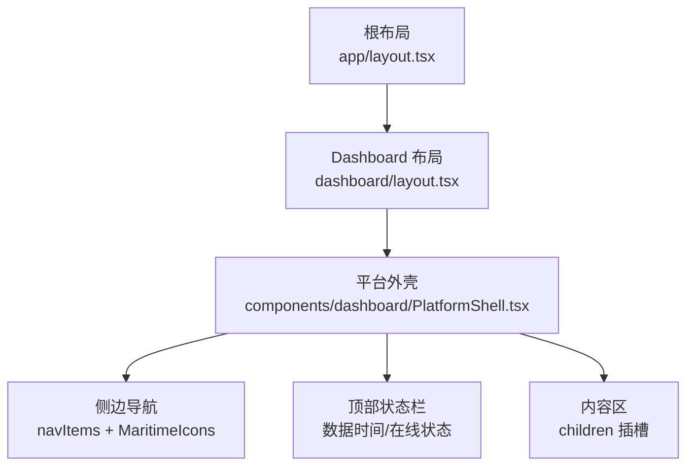
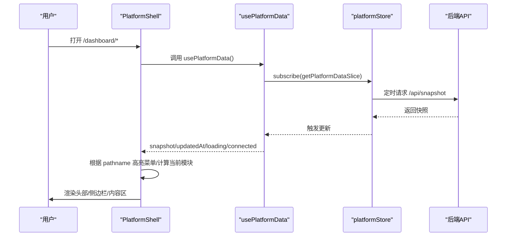
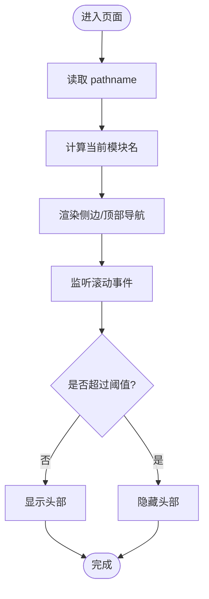
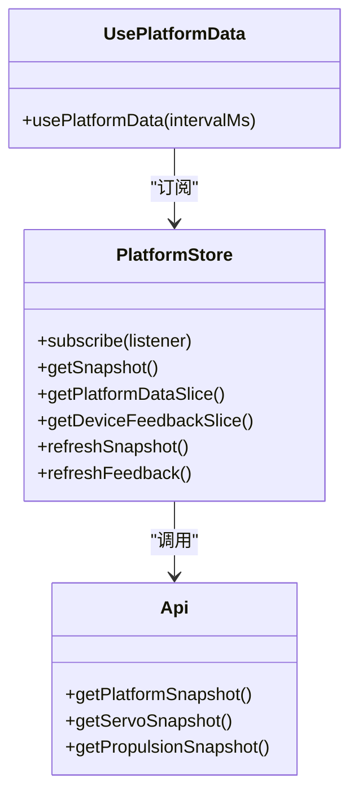
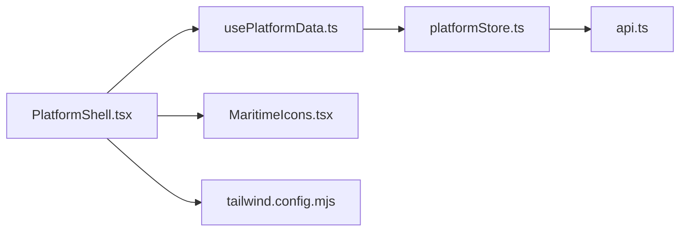

# 平台外壳组件

<cite>
**本文引用的文件**
- [PlatformShell.tsx](file://fishery-digital-twin-platform/apps/frontend/src/components/dashboard/PlatformShell.tsx)
- [dashboard/layout.tsx](file://fishery-digital-twin-platform/apps/frontend/src/app/dashboard/layout.tsx)
- [app/layout.tsx](file://fishery-digital-twin-platform/apps/frontend/src/app/layout.tsx)
- [usePlatformData.ts](file://fishery-digital-twin-platform/apps/frontend/src/hooks/usePlatformData.ts)
- [platformStore.ts](file://fishery-digital-twin-platform/apps/frontend/src/lib/platformStore.ts)
- [api.ts](file://fishery-digital-twin-platform/apps/frontend/src/lib/api.ts)
- [MaritimeIcons.tsx](file://fishery-digital-twin-platform/apps/frontend/src/components/icons/MaritimeIcons.tsx)
- [tailwind.config.mjs](file://fishery-digital-twin-platform/apps/frontend/tailwind.config.mjs)
- [NavigationPage.tsx](file://fishery-digital-twin-platform/apps/frontend/src/components/dashboard/NavigationPage.tsx)
</cite>

## 目录
1. [简介](#简介)
2. [项目结构](#项目结构)
3. [核心组件](#核心组件)
4. [架构总览](#架构总览)
5. [详细组件分析](#详细组件分析)
6. [依赖关系分析](#依赖关系分析)
7. [性能考量](#性能考量)
8. [故障排查指南](#故障排查指南)
9. [结论](#结论)
10. [附录：配置与扩展](#附录：配置与扩展)

## 简介
本文件围绕“平台外壳组件”展开，聚焦 PlatformShell 的架构设计与实现细节。内容涵盖整体布局、导航菜单设计、页面切换机制、响应式适配策略、应用状态管理、路由集成、模块组合方式，以及样式定制与扩展点说明。同时提供使用示例路径与最佳实践建议，帮助开发者快速上手并安全扩展。

## 项目结构
PlatformShell 位于前端 Next.js 应用的 dashboard 布局中，作为所有功能页面的统一外壳。其职责包括：
- 提供左侧固定导航栏（桌面端）与顶部横向导航（移动端）
- 渲染页面标题、数据时间、在线状态等全局信息
- 通过滚动行为控制头部显隐
- 承载子页面内容区域

图表来源
- [app/layout.tsx:13-19](file://fishery-digital-twin-platform/apps/frontend/src/app/layout.tsx#L13-L19)
- [dashboard/layout.tsx:1-7](file://fishery-digital-twin-platform/apps/frontend/src/app/dashboard/layout.tsx#L1-L7)
- [PlatformShell.tsx:27-161](file://fishery-digital-twin-platform/apps/frontend/src/components/dashboard/PlatformShell.tsx#L27-L161)

章节来源
- [app/layout.tsx:1-20](file://fishery-digital-twin-platform/apps/frontend/src/app/layout.tsx#L1-L20)
- [dashboard/layout.tsx:1-7](file://fishery-digital-twin-platform/apps/frontend/src/app/dashboard/layout.tsx#L1-L7)
- [PlatformShell.tsx:27-161](file://fishery-digital-twin-platform/apps/frontend/src/components/dashboard/PlatformShell.tsx#L27-L161)

## 核心组件
- PlatformShell：平台外壳容器，负责布局、导航、头部显隐、状态展示与内容区渲染。
- usePlatformData：基于 React useSyncExternalStore 的 Hook，订阅共享 store 的平台快照数据切片。
- platformStore：客户端共享状态存储，定时拉取平台快照与设备反馈，维护连接状态与更新时间。
- MaritimeIcons：导航图标集合，用于菜单项可视化。
- tailwind.config.mjs：主题色板与样式扩展，支撑外壳的视觉风格。

章节来源
- [PlatformShell.tsx:27-161](file://fishery-digital-twin-platform/apps/frontend/src/components/dashboard/PlatformShell.tsx#L27-L161)
- [usePlatformData.ts:1-24](file://fishery-digital-twin-platform/apps/frontend/src/hooks/usePlatformData.ts#L1-L24)
- [platformStore.ts:1-196](file://fishery-digital-twin-platform/apps/frontend/src/lib/platformStore.ts#L1-L196)
- [MaritimeIcons.tsx:1-171](file://fishery-digital-twin-platform/apps/frontend/src/components/icons/MaritimeIcons.tsx#L1-L171)
- [tailwind.config.mjs:9-72](file://fishery-digital-twin-platform/apps/frontend/tailwind.config.mjs#L9-L72)

## 架构总览
PlatformShell 采用“布局壳 + 内容插槽”的模式，结合 Next.js App Router 的路由体系，将各功能页以 children 形式注入。状态层通过 platformStore 统一管理，使用 usePlatformData 暴露给 UI 消费。

图表来源
- [PlatformShell.tsx:27-161](file://fishery-digital-twin-platform/apps/frontend/src/components/dashboard/PlatformShell.tsx#L27-L161)
- [usePlatformData.ts:1-24](file://fishery-digital-twin-platform/apps/frontend/src/hooks/usePlatformData.ts#L1-L24)
- [platformStore.ts:98-139](file://fishery-digital-twin-platform/apps/frontend/src/lib/platformStore.ts#L98-L139)
- [api.ts:26-28](file://fishery-digital-twin-platform/apps/frontend/src/lib/api.ts#L26-L28)

## 详细组件分析

### PlatformShell 组件
- 布局结构
  - 外层主容器：最小高度全屏，背景与应用主题色一致，最大宽度限制，网格布局在桌面端分为左侧导航与右侧内容区。
  - 侧边导航：仅在 lg 及以上显示，包含品牌 Logo 与菜单列表；菜单项支持高亮与图标。
  - 顶部区域：sticky 定位，带毛玻璃效果，根据滚动自动隐藏/显示；包含标题、当前模块名、数据时间与在线状态。
  - 移动端导航：在 header 内部以横向滚动条呈现，便于小屏快速切换。
- 导航与路由
  - 使用 Next.js Link 进行页面跳转，pathname 用于判断当前激活项。
  - navItems 集中定义菜单项，便于统一维护。
- 状态与数据
  - 通过 usePlatformData 获取 snapshot、updatedAt、loading、connected。
  - 使用 Intl.DateTimeFormat 格式化本地时间显示。
- 交互与体验
  - 滚动监听使用 requestAnimationFrame 节流，避免频繁重排。
  - 头部在接近顶部时显示，向下滚动一定阈值后隐藏，提升阅读沉浸感。

图表来源
- [PlatformShell.tsx:27-161](file://fishery-digital-twin-platform/apps/frontend/src/components/dashboard/PlatformShell.tsx#L27-L161)

章节来源
- [PlatformShell.tsx:18-167](file://fishery-digital-twin-platform/apps/frontend/src/components/dashboard/PlatformShell.tsx#L18-L167)

### 状态管理与数据流
- platformStore
  - 维护 snapshot、servos、propulsion、连接状态与更新时间。
  - 使用定时器周期性刷新快照与设备反馈，失败时更新连接状态。
  - 提供 slice 对象以减少不必要的重渲染（快照与设备反馈分离）。
- usePlatformData
  - 封装 useSyncExternalStore，订阅 platformStore 的快照切片。
  - 对外暴露 snapshot、updatedAt、loading、connected 四个字段供 UI 使用。
- api.ts
  - 封装 fetchJson，统一错误处理与超时控制。
  - 提供 getPlatformSnapshot、getServoSnapshot、getPropulsionSnapshot 等方法。

图表来源
- [platformStore.ts:150-195](file://fishery-digital-twin-platform/apps/frontend/src/lib/platformStore.ts#L150-L195)
- [usePlatformData.ts:1-24](file://fishery-digital-twin-platform/apps/frontend/src/hooks/usePlatformData.ts#L1-L24)
- [api.ts:26-72](file://fishery-digital-twin-platform/apps/frontend/src/lib/api.ts#L26-L72)

章节来源
- [platformStore.ts:20-139](file://fishery-digital-twin-platform/apps/frontend/src/lib/platformStore.ts#L20-L139)
- [usePlatformData.ts:1-24](file://fishery-digital-twin-platform/apps/frontend/src/hooks/usePlatformData.ts#L1-L24)
- [api.ts:1-101](file://fishery-digital-twin-platform/apps/frontend/src/lib/api.ts#L1-L101)

### 导航菜单与图标
- 菜单项集中定义于 navItems，包含 href、label、icon。
- 图标来自 MaritimeIcons，统一 SVG 框架，保持风格一致。
- 高亮逻辑基于 pathname 精确匹配或前缀匹配，确保子路由也能正确高亮。

章节来源
- [PlatformShell.tsx:18-25](file://fishery-digital-twin-platform/apps/frontend/src/components/dashboard/PlatformShell.tsx#L18-L25)
- [MaritimeIcons.tsx:22-84](file://fishery-digital-twin-platform/apps/frontend/src/components/icons/MaritimeIcons.tsx#L22-L84)

### 页面切换机制
- 使用 Next.js App Router 的 Link 进行无刷新跳转。
- 通过 pathname 变化驱动菜单高亮与头部模块名更新。
- 子页面通过 layout.tsx 包裹 PlatformShell，children 即为具体页面内容。

章节来源
- [dashboard/layout.tsx:1-7](file://fishery-digital-twin-platform/apps/frontend/src/app/dashboard/layout.tsx#L1-L7)
- [PlatformShell.tsx:85-106](file://fishery-digital-twin-platform/apps/frontend/src/components/dashboard/PlatformShell.tsx#L85-L106)

### 响应式适配策略
- 桌面端：左侧固定导航 + 右侧内容区，最大宽度限制保证可读性。
- 移动端：隐藏侧边导航，改为顶部横向滚动导航，提升操作效率。
- 头部 sticky 定位与滚动显隐，优化长页面浏览体验。
- 使用 Tailwind 断点类名（md、lg、xl）控制不同屏幕下的布局与间距。

章节来源
- [PlatformShell.tsx:72-158](file://fishery-digital-twin-platform/apps/frontend/src/components/dashboard/PlatformShell.tsx#L72-L158)
- [tailwind.config.mjs:14-66](file://fishery-digital-twin-platform/apps/frontend/tailwind.config.mjs#L14-L66)

### 实际使用示例
- 在 dashboard 目录下创建页面，例如 twin/page.tsx，直接返回业务组件。
- 该页面会被 dashboard/layout.tsx 中的 PlatformShell 包裹，自动获得外壳布局与导航。
- 如需自定义页面内布局，可使用 DashboardPrimitives 提供的 PageFrame/PageHeader 等基础组件。

章节来源
- [dashboard/layout.tsx:1-7](file://fishery-digital-twin-platform/apps/frontend/src/app/dashboard/layout.tsx#L1-L7)
- [NavigationPage.tsx:44-145](file://fishery-digital-twin-platform/apps/frontend/src/components/dashboard/NavigationPage.tsx#L44-L145)

## 依赖关系分析
- PlatformShell 依赖：
  - Next.js 导航与图片组件（Link、Image）
  - usePlatformData Hook
  - MaritimeIcons 图标集
  - Tailwind 样式系统
- usePlatformData 依赖：
  - platformStore 的状态订阅与快照切片
- platformStore 依赖：
  - api.ts 的数据获取方法
  - fallback-data 初始快照生成（用于 SSR/Hydration 一致性）

图表来源
- [PlatformShell.tsx:27-161](file://fishery-digital-twin-platform/apps/frontend/src/components/dashboard/PlatformShell.tsx#L27-L161)
- [usePlatformData.ts:1-24](file://fishery-digital-twin-platform/apps/frontend/src/hooks/usePlatformData.ts#L1-L24)
- [platformStore.ts:1-196](file://fishery-digital-twin-platform/apps/frontend/src/lib/platformStore.ts#L1-L196)
- [api.ts:1-101](file://fishery-digital-twin-platform/apps/frontend/src/lib/api.ts#L1-L101)
- [MaritimeIcons.tsx:1-171](file://fishery-digital-twin-platform/apps/frontend/src/components/icons/MaritimeIcons.tsx#L1-L171)
- [tailwind.config.mjs:9-72](file://fishery-digital-twin-platform/apps/frontend/tailwind.config.mjs#L9-L72)

章节来源
- [PlatformShell.tsx:27-161](file://fishery-digital-twin-platform/apps/frontend/src/components/dashboard/PlatformShell.tsx#L27-L161)
- [usePlatformData.ts:1-24](file://fishery-digital-twin-platform/apps/frontend/src/hooks/usePlatformData.ts#L1-L24)
- [platformStore.ts:1-196](file://fishery-digital-twin-platform/apps/frontend/src/lib/platformStore.ts#L1-L196)
- [api.ts:1-101](file://fishery-digital-twin-platform/apps/frontend/src/lib/api.ts#L1-L101)
- [MaritimeIcons.tsx:1-171](file://fishery-digital-twin-platform/apps/frontend/src/components/icons/MaritimeIcons.tsx#L1-L171)
- [tailwind.config.mjs:9-72](file://fishery-digital-twin-platform/apps/frontend/tailwind.config.mjs#L9-L72)

## 性能考量
- 滚动监听使用 requestAnimationFrame 节流，减少高频回调带来的重排开销。
- platformStore 将快照与设备反馈拆分为独立 slice，避免无关更新导致的全局重渲染。
- 使用 useSyncExternalStore 保证 SSR 与客户端首次渲染的一致性，降低 hydration 差异风险。
- API 请求设置超时与 no-store 缓存策略，避免陈旧数据影响实时性。

章节来源
- [PlatformShell.tsx:42-70](file://fishery-digital-twin-platform/apps/frontend/src/components/dashboard/PlatformShell.tsx#L42-L70)
- [platformStore.ts:53-96](file://fishery-digital-twin-platform/apps/frontend/src/lib/platformStore.ts#L53-L96)
- [usePlatformData.ts:1-24](file://fishery-digital-twin-platform/apps/frontend/src/hooks/usePlatformData.ts#L1-L24)
- [api.ts:6-24](file://fishery-digital-twin-platform/apps/frontend/src/lib/api.ts#L6-L24)

## 故障排查指南
- 数据不更新
  - 检查 platformStore 定时器是否正常启动与清理。
  - 确认 API 地址与 Token 环境变量配置正确。
  - 查看浏览器网络面板，确认 /api/snapshot 等接口是否成功返回。
- 头部不显示/不隐藏
  - 检查滚动监听事件是否正确绑定与移除。
  - 确认窗口尺寸与断点类名生效情况。
- 菜单高亮异常
  - 核对 navItems 的 href 与实际路由路径是否一致。
  - 检查 pathname 匹配逻辑是否覆盖子路由前缀。

章节来源
- [platformStore.ts:132-159](file://fishery-digital-twin-platform/apps/frontend/src/lib/platformStore.ts#L132-L159)
- [api.ts:6-24](file://fishery-digital-twin-platform/apps/frontend/src/lib/api.ts#L6-L24)
- [PlatformShell.tsx:42-70](file://fishery-digital-twin-platform/apps/frontend/src/components/dashboard/PlatformShell.tsx#L42-L70)
- [PlatformShell.tsx:85-106](file://fishery-digital-twin-platform/apps/frontend/src/components/dashboard/PlatformShell.tsx#L85-L106)

## 结论
PlatformShell 提供了稳定、可扩展的平台外壳能力，通过清晰的布局分层、集中的导航配置、高效的状态管理与良好的响应式适配，为智慧渔业监控平台奠定了统一的界面基座。开发者可在其基础上快速构建各功能模块，并通过主题与扩展点实现个性化定制。

## 附录：配置与扩展

### 配置选项
- 导航菜单
  - 修改 navItems 可增删菜单项、调整顺序与图标。
  - 建议在新增模块时同步更新对应路由与页面。
- 主题与样式
  - 在 tailwind.config.mjs 中扩展颜色、阴影、背景图等主题变量。
  - 使用 app-*、ink-*、harbor-* 等命名空间保持一致性。
- 数据刷新频率
  - platformStore 中定义了快照与设备反馈的刷新间隔，可按需调整。
  - 注意过高频率可能带来性能与后端压力。

章节来源
- [PlatformShell.tsx:18-25](file://fishery-digital-twin-platform/apps/frontend/src/components/dashboard/PlatformShell.tsx#L18-L25)
- [tailwind.config.mjs:14-66](file://fishery-digital-twin-platform/apps/frontend/tailwind.config.mjs#L14-L66)
- [platformStore.ts:20-22](file://fishery-digital-twin-platform/apps/frontend/src/lib/platformStore.ts#L20-L22)

### 样式定制方法
- 使用 Tailwind 工具类覆盖默认样式，如背景、边框、圆角、阴影等。
- 通过主题色板统一配色，避免硬编码颜色值。
- 对复杂组件可拆分样式到独立文件或 CSS-in-JS 方案（本项目使用 Tailwind）。

章节来源
- [tailwind.config.mjs:9-72](file://fishery-digital-twin-platform/apps/frontend/tailwind.config.mjs#L9-L72)
- [PlatformShell.tsx:72-158](file://fishery-digital-twin-platform/apps/frontend/src/components/dashboard/PlatformShell.tsx#L72-L158)

### 扩展点说明
- 新增模块
  - 在 navItems 中添加菜单项，并在 dashboard 下创建对应路由页面。
  - 如需新图标，可在 MaritimeIcons 中新增 SVG 组件。
- 接入新数据源
  - 在 api.ts 中新增接口方法，并在 platformStore 中集成到刷新流程。
  - 通过 usePlatformData 暴露给 UI 消费。
- 自定义外壳行为
  - 可复制 PlatformShell 并修改布局、导航、头部逻辑，形成特定场景的外壳变体。
  - 在 layout.tsx 中替换默认外壳，实现多套外壳并存。

章节来源
- [PlatformShell.tsx:18-25](file://fishery-digital-twin-platform/apps/frontend/src/components/dashboard/PlatformShell.tsx#L18-L25)
- [MaritimeIcons.tsx:22-84](file://fishery-digital-twin-platform/apps/frontend/src/components/icons/MaritimeIcons.tsx#L22-L84)
- [api.ts:26-72](file://fishery-digital-twin-platform/apps/frontend/src/lib/api.ts#L26-L72)
- [usePlatformData.ts:1-24](file://fishery-digital-twin-platform/apps/frontend/src/hooks/usePlatformData.ts#L1-L24)
- [dashboard/layout.tsx:1-7](file://fishery-digital-twin-platform/apps/frontend/src/app/dashboard/layout.tsx#L1-L7)