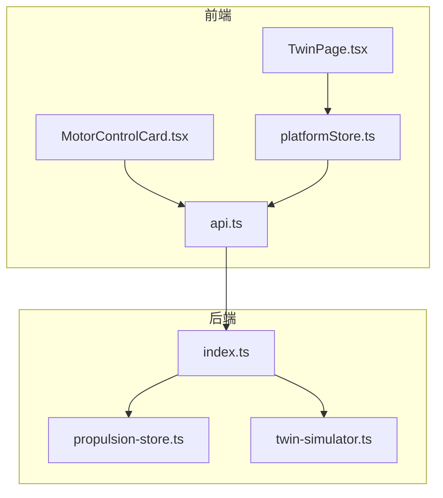
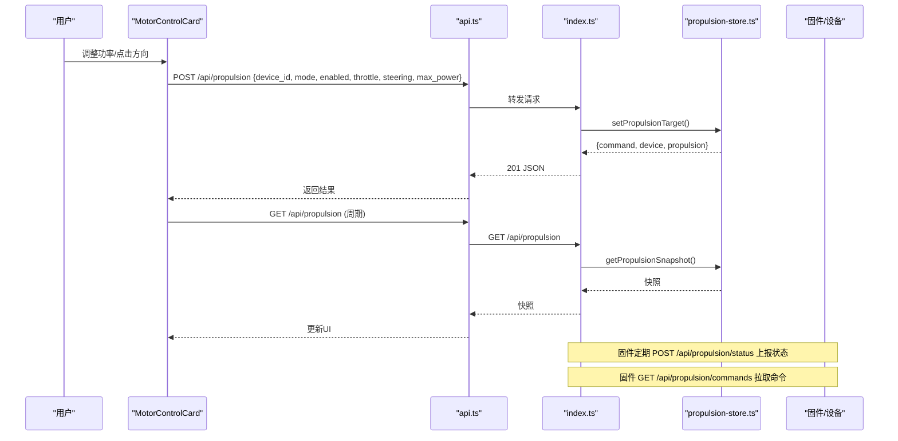
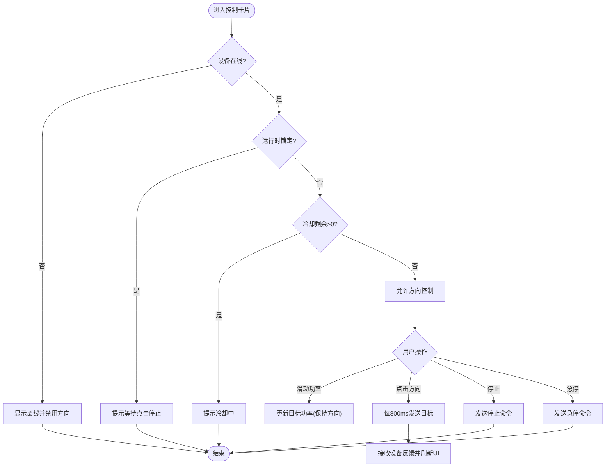
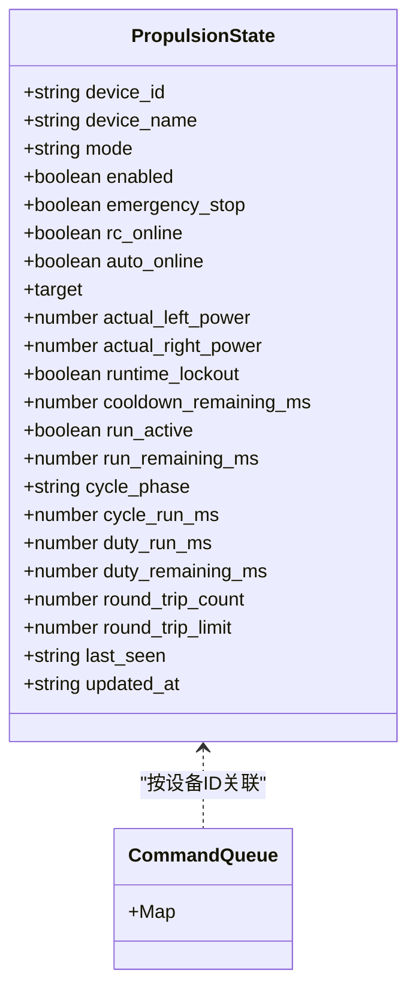
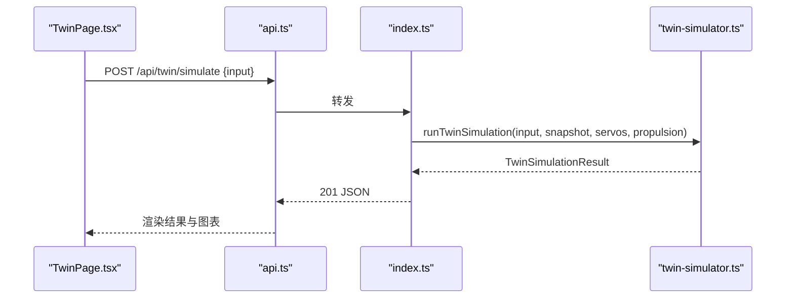
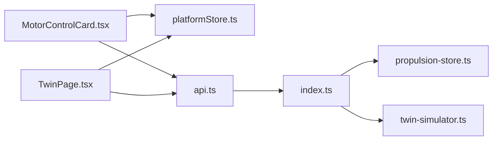

# 推进器控制页面

<cite>
**本文引用的文件**
- [MotorControlCard.tsx](file://fishery-digital-twin-platform/apps/frontend/src/components/dashboard/MotorControlCard.tsx)
- [TwinPage.tsx](file://fishery-digital-twin-platform/apps/frontend/src/components/dashboard/TwinPage.tsx)
- [api.ts](file://fishery-digital-twin-platform/apps/frontend/src/lib/api.ts)
- [platformStore.ts](file://fishery-digital-twin-platform/apps/frontend/src/lib/platformStore.ts)
- [propulsion-store.ts](file://fishery-digital-twin-platform/apps/backend/src/propulsion-store.ts)
- [twin-simulator.ts](file://fishery-digital-twin-platform/apps/backend/src/twin-simulator.ts)
- [index.ts](file://fishery-digital-twin-platform/apps/backend/src/index.ts)
</cite>

## 目录
1. [简介](#简介)
2. [项目结构](#项目结构)
3. [核心组件](#核心组件)
4. [架构总览](#架构总览)
5. [详细组件分析](#详细组件分析)
6. [依赖关系分析](#依赖关系分析)
7. [性能与实时性](#性能与实时性)
8. [故障诊断与安全保护](#故障诊断与安全保护)
9. [操作指南与最佳实践](#操作指南与最佳实践)
10. [常见问题排查](#常见问题排查)
11. [结论](#结论)

## 简介
本页面面向推进系统（电机、电动推杆等）的在线控制与监控，提供功率调节、方向控制、运行状态可视化、安全保护提示与数字孪生仿真能力。前端通过 MotorControlCard 组件实现交互，后端 propulsion-store 维护设备状态、命令队列与限速限流策略，并通过 REST API 暴露给前端与固件侧使用；数字孪生模块 twin-simulator 基于当前平台快照进行航线预演、故障推演与疲劳损耗估算，辅助决策但不直接下发控制指令。

## 项目结构
- 前端
  - 页面入口：数字孪生中心 TwinPage，集成三维场景、任务概览、环境数据与仿真实验台。
  - 控制卡片：MotorControlCard 提供功率滑块、方向按钮、停止与急停、运行时保护提示与反馈面板。
  - 数据层：platformStore 定时拉取平台快照与设备反馈；api.ts 封装 HTTP 调用。
- 后端
  - 推进存储：propulsion-store 管理设备状态、目标输出、命令队列、超时清理与在线判定。
  - 接口路由：index.ts 暴露 /api/propulsion、/api/propulsion/status、/api/propulsion/commands、/api/twin/simulate 等。
  - 仿真引擎：twin-simulator 计算能耗、风险与健康度，返回预测曲线与建议。

**图表来源**
- [TwinPage.tsx:1-163](file://fishery-digital-twin-platform/apps/frontend/src/components/dashboard/TwinPage.tsx#L1-L163)
- [MotorControlCard.tsx:1-180](file://fishery-digital-twin-platform/apps/frontend/src/components/dashboard/MotorControlCard.tsx#L1-L180)
- [platformStore.ts:1-196](file://fishery-digital-twin-platform/apps/frontend/src/lib/platformStore.ts#L1-L196)
- [api.ts:1-101](file://fishery-digital-twin-platform/apps/frontend/src/lib/api.ts#L1-L101)
- [index.ts:505-555](file://fishery-digital-twin-platform/apps/backend/src/index.ts#L505-L555)
- [propulsion-store.ts:1-319](file://fishery-digital-twin-platform/apps/backend/src/propulsion-store.ts#L1-L319)
- [twin-simulator.ts:1-254](file://fishery-digital-twin-platform/apps/backend/src/twin-simulator.ts#L1-L254)

**章节来源**
- [TwinPage.tsx:1-163](file://fishery-digital-twin-platform/apps/frontend/src/components/dashboard/TwinPage.tsx#L1-L163)
- [MotorControlCard.tsx:1-180](file://fishery-digital-twin-platform/apps/frontend/src/components/dashboard/MotorControlCard.tsx#L1-L180)
- [platformStore.ts:1-196](file://fishery-digital-twin-platform/apps/frontend/src/lib/platformStore.ts#L1-L196)
- [api.ts:1-101](file://fishery-digital-twin-platform/apps/frontend/src/lib/api.ts#L1-L101)
- [index.ts:505-555](file://fishery-digital-twin-platform/apps/backend/src/index.ts#L505-L555)
- [propulsion-store.ts:1-319](file://fishery-digital-twin-platform/apps/backend/src/propulsion-store.ts#L1-L319)
- [twin-simulator.ts:1-254](file://fishery-digital-twin-platform/apps/backend/src/twin-simulator.ts#L1-L254)

## 核心组件
- MotorControlCard
  - 功能：功率滑块设置、方向控制（正/反）、点动或保持模式、停止与急停、运行时保护提示、开发板反馈展示。
  - 关键逻辑：心跳发送目标功率、离线自动归零、冷却/锁定状态禁用方向控制、方向乘数适配不同设备极性。
- platformStore
  - 功能：定时刷新平台快照与设备反馈（推进/舵机），合并到全局 store，供页面订阅渲染。
  - 频率：快照 2s，设备反馈 1s。
- propulsion-store（后端）
  - 功能：解析并校验控制请求、合成左右通道输出、写入命令队列、维护设备在线/目标/保护状态。
  - 安全：最大功率限制、离线拒绝激活命令、命令超时清理。
- twin-simulator（后端）
  - 功能：基于当前快照与输入参数，计算航线 ETA、能耗、完成概率、故障影响与部件疲劳健康度。
  - 约束：仅计算不向设备下发命令。

**章节来源**
- [MotorControlCard.tsx:27-180](file://fishery-digital-twin-platform/apps/frontend/src/components/dashboard/MotorControlCard.tsx#L27-L180)
- [platformStore.ts:20-139](file://fishery-digital-twin-platform/apps/frontend/src/lib/platformStore.ts#L20-L139)
- [propulsion-store.ts:97-231](file://fishery-digital-twin-platform/apps/backend/src/propulsion-store.ts#L97-L231)
- [twin-simulator.ts:74-254](file://fishery-digital-twin-platform/apps/backend/src/twin-simulator.ts#L74-L254)

## 架构总览
前端通过 api.ts 调用后端 REST 接口，motor control 走 /api/propulsion（POST），状态查询走 /api/propulsion（GET）。后端 propulsion-store 维护设备状态与命令队列，由固件侧通过 /api/propulsion/status 上报实际状态，固件侧通过 /api/propulsion/commands 拉取待执行命令。数字孪生通过 /api/twin/simulate 获取预测结果。

**图表来源**
- [MotorControlCard.tsx:95-131](file://fishery-digital-twin-platform/apps/frontend/src/components/dashboard/MotorControlCard.tsx#L95-L131)
- [api.ts:70-89](file://fishery-digital-twin-platform/apps/frontend/src/lib/api.ts#L70-L89)
- [index.ts:505-538](file://fishery-digital-twin-platform/apps/backend/src/index.ts#L505-L538)
- [propulsion-store.ts:149-231](file://fishery-digital-twin-platform/apps/backend/src/propulsion-store.ts#L149-L231)

## 详细组件分析

### MotorControlCard 组件
- 控制流程
  - 功率滑块改变时，若当前有方向目标，则同步更新目标功率绝对值。
  - 方向按钮触发 startMotor，检查在线、锁定、冷却状态后设置 targetPower。
  - useEffect 中每 800ms 发送一次心跳（enabled=true），确保设备持续收到目标。
  - 离开页面或目标为 0 时，发送停止命令（enabled=false）。
- 安全与状态
  - 运行时保护：根据设备反馈计算剩余冷却时间、往返阶段、累计通电时间与额度，禁用方向控制直至解锁。
  - 紧急停止：立即置空目标并标记急停标志位。
  - 方向乘数：支持反向极性设备（directionMultiplier=-1）。
- 反馈展示
  - PWM 输出、往返周期、累计运行、剩余工作额度、剩余冷却时间等。
  - 状态标签：离线、紧急停止、等待点击停止、冷却中、第一段/反向行程、停止。

**图表来源**
- [MotorControlCard.tsx:36-180](file://fishery-digital-twin-platform/apps/frontend/src/components/dashboard/MotorControlCard.tsx#L36-L180)
- [MotorControlCard.tsx:249-438](file://fishery-digital-twin-platform/apps/frontend/src/components/dashboard/MotorControlCard.tsx#L249-L438)

**章节来源**
- [MotorControlCard.tsx:36-180](file://fishery-digital-twin-platform/apps/frontend/src/components/dashboard/MotorControlCard.tsx#L36-L180)
- [MotorControlCard.tsx:249-438](file://fishery-digital-twin-platform/apps/frontend/src/components/dashboard/MotorControlCard.tsx#L249-L438)

### 后端推进控制与状态管理
- 目标合成
  - WEB 模式下，根据 throttle 与 steering 混合得到左右通道目标，限制在 [-maxPower, maxPower]。
  - 单通道设备将右通道固定为 0。
- 在线判定
  - web_online：目标更新时间是否在 COMMAND_TIMEOUT_MS 内。
  - online：last_seen 是否在 10s 内。
- 命令队列
  - 每次 setPropulsionTarget 生成新命令入队，takePropulsionCommands 仅返回未过期的命令。
- 状态上报
  - updatePropulsionStatus 接收设备实际状态（包括保护、周期、电量等），更新 last_seen 与各项指标。

**图表来源**
- [propulsion-store.ts:97-147](file://fishery-digital-twin-platform/apps/backend/src/propulsion-store.ts#L97-L147)
- [propulsion-store.ts:166-231](file://fishery-digital-twin-platform/apps/backend/src/propulsion-store.ts#L166-L231)
- [propulsion-store.ts:233-319](file://fishery-digital-twin-platform/apps/backend/src/propulsion-store.ts#L233-L319)

**章节来源**
- [propulsion-store.ts:97-231](file://fishery-digital-twin-platform/apps/backend/src/propulsion-store.ts#L97-L231)
- [propulsion-store.ts:233-319](file://fishery-digital-twin-platform/apps/backend/src/propulsion-store.ts#L233-L319)

### 数字孪生仿真
- 输入：航程、目标航速、海况、故障类型与严重度、累计工时、舵机日动作次数。
- 输出：路线 ETA、能耗、到达电量、横向误差、完成概率与风险等级；故障速度损失、航向漂移、检测时间、建议；部件疲劳健康度与下次检查间隔。
- 特点：基于当前平台快照与设备反馈校准模型；仿真过程不向设备下发命令。

**图表来源**
- [TwinPage.tsx:67-78](file://fishery-digital-twin-platform/apps/frontend/src/components/dashboard/TwinPage.tsx#L67-L78)
- [api.ts:95-100](file://fishery-digital-twin-platform/apps/frontend/src/lib/api.ts#L95-L100)
- [index.ts:540-555](file://fishery-digital-twin-platform/apps/backend/src/index.ts#L540-L555)
- [twin-simulator.ts:74-254](file://fishery-digital-twin-platform/apps/backend/src/twin-simulator.ts#L74-L254)

**章节来源**
- [TwinPage.tsx:67-78](file://fishery-digital-twin-platform/apps/frontend/src/components/dashboard/TwinPage.tsx#L67-L78)
- [api.ts:95-100](file://fishery-digital-twin-platform/apps/frontend/src/lib/api.ts#L95-L100)
- [index.ts:540-555](file://fishery-digital-twin-platform/apps/backend/src/index.ts#L540-L555)
- [twin-simulator.ts:74-254](file://fishery-digital-twin-platform/apps/backend/src/twin-simulator.ts#L74-L254)

## 依赖关系分析
- 前端依赖
  - MotorControlCard 依赖 platformStore 提供的设备反馈与 api.ts 的控制接口。
  - TwinPage 依赖 platformStore 的导航/电池/水传感器快照，以及 api.ts 的数字孪生接口。
- 后端依赖
  - index.ts 路由调用 propulsion-store 与 twin-simulator。
  - propulsion-store 维护设备状态与命令队列，被路由与固件侧共同消费。
- 外部依赖
  - 固件侧通过 /api/propulsion/status 上报状态，通过 /api/propulsion/commands 拉取命令。

**图表来源**
- [MotorControlCard.tsx:1-180](file://fishery-digital-twin-platform/apps/frontend/src/components/dashboard/MotorControlCard.tsx#L1-L180)
- [platformStore.ts:1-196](file://fishery-digital-twin-platform/apps/frontend/src/lib/platformStore.ts#L1-L196)
- [api.ts:1-101](file://fishery-digital-twin-platform/apps/frontend/src/lib/api.ts#L1-L101)
- [index.ts:505-555](file://fishery-digital-twin-platform/apps/backend/src/index.ts#L505-L555)
- [propulsion-store.ts:1-319](file://fishery-digital-twin-platform/apps/backend/src/propulsion-store.ts#L1-L319)
- [twin-simulator.ts:1-254](file://fishery-digital-twin-platform/apps/backend/src/twin-simulator.ts#L1-L254)

**章节来源**
- [MotorControlCard.tsx:1-180](file://fishery-digital-twin-platform/apps/frontend/src/components/dashboard/MotorControlCard.tsx#L1-L180)
- [platformStore.ts:1-196](file://fishery-digital-twin-platform/apps/frontend/src/lib/platformStore.ts#L1-L196)
- [api.ts:1-101](file://fishery-digital-twin-platform/apps/frontend/src/lib/api.ts#L1-L101)
- [index.ts:505-555](file://fishery-digital-twin-platform/apps/backend/src/index.ts#L505-L555)
- [propulsion-store.ts:1-319](file://fishery-digital-twin-platform/apps/backend/src/propulsion-store.ts#L1-L319)
- [twin-simulator.ts:1-254](file://fishery-digital-twin-platform/apps/backend/src/twin-simulator.ts#L1-L254)

## 性能与实时性
- 前端刷新频率
  - 平台快照：2s 一次，避免频繁重绘。
  - 设备反馈：1s 一次，保证控制响应与状态可见性。
- 心跳机制
  - 方向控制期间每 800ms 发送一次目标，防止设备因超时丢弃命令。
- 后端超时与队列
  - COMMAND_TIMEOUT_MS 用于过滤过期命令，减少无效下发。
  - 在线判定：web_online 与 online 分别反映目标更新与设备心跳新鲜度。
- 建议
  - 网络不稳定时适当降低刷新频率或增加重试。
  - 高负载场景可考虑批量推送设备反馈以减少请求数。

[本节为通用指导，不直接分析具体文件]

## 故障诊断与安全保护
- 运行时保护
  - 往返周期计数与累计通电时间达到阈值后进入冷却，禁止方向控制。
  - 冷却倒计时与“等待点击停止”提示，需先停止再启动。
- 紧急停止
  - 前端急停按钮会发送急停标志，后端记录日志并返回最新快照。
- 常见错误
  - 设备离线：激活命令会被拒绝并抛出错误。
  - 参数越界：后端对百分比与最大功率进行钳制。
- 诊断要点
  - 观察“安全锁定”“往返周期”“累计通电时间”“剩余工作额度”“剩余冷却时间”。
  - 确认固件是否按时上报状态与拉取命令。

**章节来源**
- [MotorControlCard.tsx:441-537](file://fishery-digital-twin-platform/apps/frontend/src/components/dashboard/MotorControlCard.tsx#L441-L537)
- [propulsion-store.ts:166-231](file://fishery-digital-twin-platform/apps/backend/src/propulsion-store.ts#L166-L231)
- [index.ts:510-538](file://fishery-digital-twin-platform/apps/backend/src/index.ts#L510-L538)

## 操作指南与最佳实践
- 基本操作
  - 选择功率（5%~maxPower），点击方向按钮开始运行；按住式按钮支持点动。
  - 随时点击“停止”解除锁定；紧急情况点击“紧急停止”。
- 参数配置
  - 最大输出功率：受设备配置限制，前端滑块上限为设备 maxPower。
  - 方向乘数：用于适配不同设备的极性反转。
- 性能调优
  - 合理设置功率与方向切换节奏，避免频繁启停导致发热。
  - 利用数字孪生进行航线预演，评估能耗与风险后再执行。
- 安全限制
  - 遵循冷却与往返限制，避免长时间连续运行。
  - 关注“剩余工作额度”，接近阈值时提前规划停机。

**章节来源**
- [MotorControlCard.tsx:297-348](file://fishery-digital-twin-platform/apps/frontend/src/components/dashboard/MotorControlCard.tsx#L297-L348)
- [propulsion-store.ts:97-130](file://fishery-digital-twin-platform/apps/backend/src/propulsion-store.ts#L97-L130)
- [TwinPage.tsx:358-495](file://fishery-digital-twin-platform/apps/frontend/src/components/dashboard/TwinPage.tsx#L358-L495)

## 常见问题排查
- 无法启动方向控制
  - 检查设备是否在线、是否处于冷却或锁定状态。
  - 查看“安全锁定”与“剩余冷却时间”。
- 控制无响应
  - 确认心跳是否正常（目标非零时应每 800ms 发送）。
  - 检查后端日志与固件是否成功拉取命令。
- 数字孪生不可用
  - 检查 /api/twin/simulate 是否返回错误信息。
  - 确认平台快照与设备反馈是否可用。

**章节来源**
- [MotorControlCard.tsx:152-179](file://fishery-digital-twin-platform/apps/frontend/src/components/dashboard/MotorControlCard.tsx#L152-L179)
- [platformStore.ts:98-139](file://fishery-digital-twin-platform/apps/frontend/src/lib/platformStore.ts#L98-L139)
- [index.ts:540-555](file://fishery-digital-twin-platform/apps/backend/src/index.ts#L540-L555)

## 结论
推进器控制页面以 MotorControlCard 为核心交互组件，结合 platformStore 的实时数据与 propulsion-store 的安全策略，实现了可靠的功率调节、方向控制与状态监测。数字孪生模块提供航线预演、故障推演与疲劳评估，帮助制定更安全的操作策略。通过明确的通信协议、数据同步策略与实时性保障，系统在复杂环境下仍能提供稳定的人机交互与决策支持。