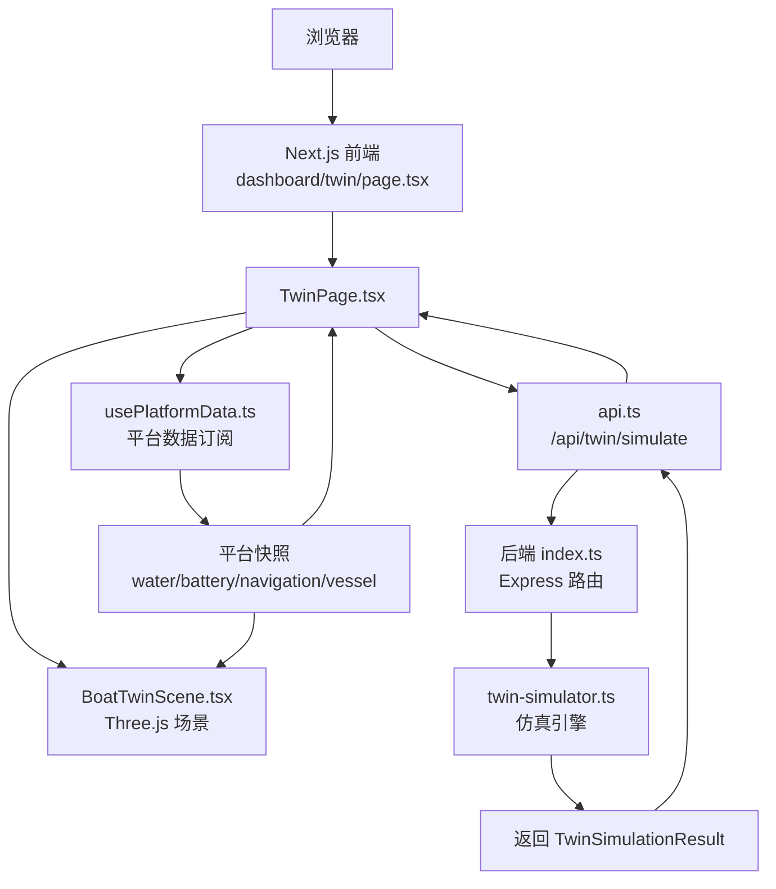
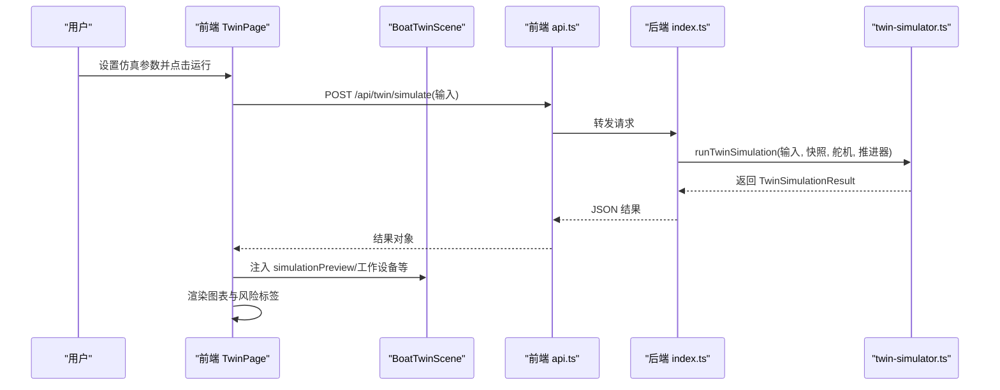
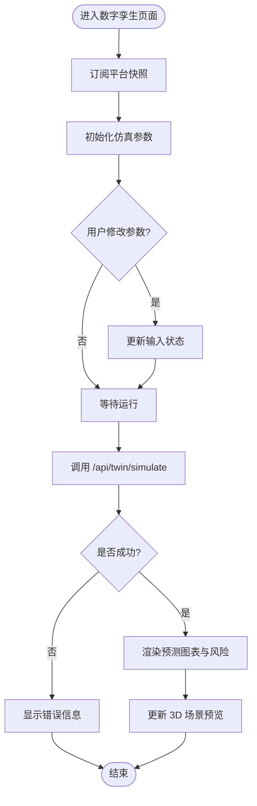
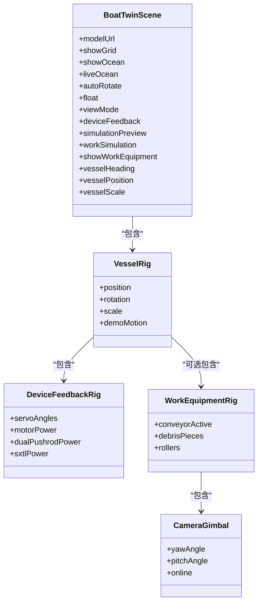
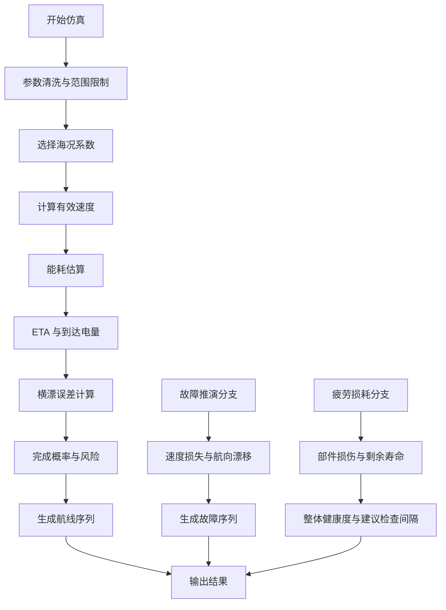
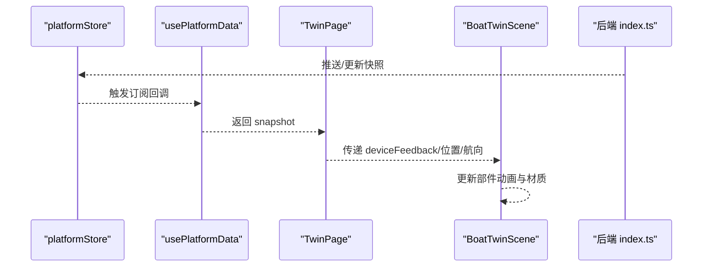
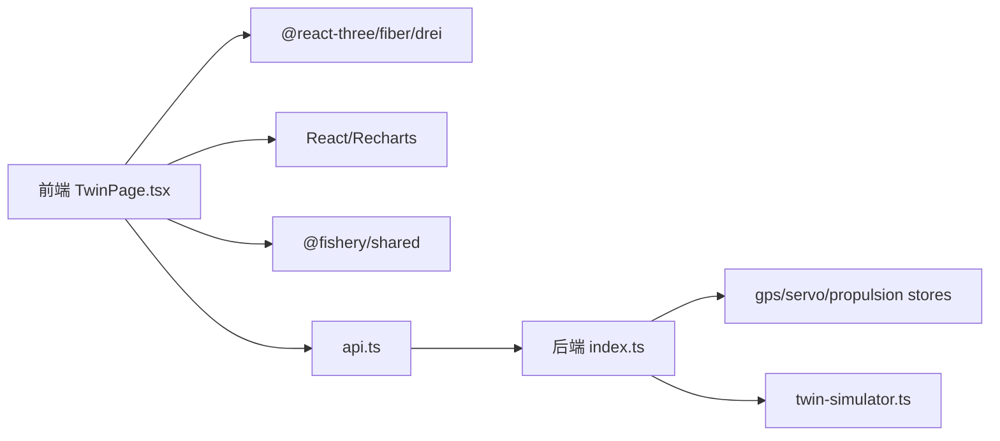

# 数字孪生仿真页面

<cite>
**本文引用的文件**
- [TwinPage.tsx](file://fishery-digital-twin-platform/apps/frontend/src/components/dashboard/TwinPage.tsx)
- [BoatTwinScene.tsx](file://fishery-digital-twin-platform/apps/frontend/src/components/three/BoatTwinScene.tsx)
- [twin/page.tsx](file://fishery-digital-twin-platform/apps/frontend/src/app/dashboard/twin/page.tsx)
- [usePlatformData.ts](file://fishery-digital-twin-platform/apps/frontend/src/hooks/usePlatformData.ts)
- [api.ts](file://fishery-digital-twin-platform/apps/frontend/src/lib/api.ts)
- [index.ts（共享类型）](file://fishery-digital-twin-platform/packages/shared/src/index.ts)
- [twin-simulator.ts](file://fishery-digital-twin-platform/apps/backend/src/twin-simulator.ts)
- [index.ts（后端服务）](file://fishery-digital-twin-platform/apps/backend/src/index.ts)
</cite>

## 目录
1. [简介](#简介)
2. [项目结构](#项目结构)
3. [核心组件](#核心组件)
4. [架构总览](#架构总览)
5. [详细组件分析](#详细组件分析)
6. [依赖关系分析](#依赖关系分析)
7. [性能考虑](#性能考虑)
8. [故障排查指南](#故障排查指南)
9. [结论](#结论)
10. [附录](#附录)

## 简介
本文件面向“数字孪生仿真页面”，系统性说明前端 TwinPage 与 Three.js 场景 BoatTwinScene 的架构设计、实时数据同步机制、3D 模型加载与动画控制、交互响应，以及后端数字孪生仿真引擎的数据映射算法、物理模拟策略与性能优化。文档同时提供 3D 场景配置、材质与光照设置要点，并给出仿真演示、调试方法与扩展开发建议。

## 项目结构
该功能位于 Next.js 前端应用与 Node.js 后端服务的协作中：
- 前端路由入口将用户导航到数字孪生页面，渲染 TwinPage。
- TwinPage 负责 UI 编排、仿真参数输入、调用后端仿真 API，并将结果以图表和图层形式展示。
- 3D 场景由 BoatTwinScene 管理，基于 React Three Fiber/Drei，实现模型加载、设备反馈可视化、工作设备动画、水面效果与相机控制。
- 后端 index.ts 暴露 /api/snapshot、/api/twin/simulate 等接口；twin-simulator.ts 实现航线预演、故障推演、疲劳损耗估算等仿真逻辑。

**图示来源**
- [twin/page.tsx:1-6](file://fishery-digital-twin-platform/apps/frontend/src/app/dashboard/twin/page.tsx#L1-L6)
- [TwinPage.tsx:24-163](file://fishery-digital-twin-platform/apps/frontend/src/components/dashboard/TwinPage.tsx#L24-L163)
- [BoatTwinScene.tsx:9-32](file://fishery-digital-twin-platform/apps/frontend/src/components/three/BoatTwinScene.tsx#L9-L32)
- [usePlatformData.ts:1-24](file://fishery-digital-twin-platform/apps/frontend/src/hooks/usePlatformData.ts#L1-L24)
- [api.ts:95-100](file://fishery-digital-twin-platform/apps/frontend/src/lib/api.ts#L95-L100)
- [index.ts（后端服务）:540-555](file://fishery-digital-twin-platform/apps/backend/src/index.ts#L540-L555)
- [twin-simulator.ts:74-253](file://fishery-digital-twin-platform/apps/backend/src/twin-simulator.ts#L74-L253)

**章节来源**
- [twin/page.tsx:1-6](file://fishery-digital-twin-platform/apps/frontend/src/app/dashboard/twin/page.tsx#L1-L6)
- [TwinPage.tsx:24-163](file://fishery-digital-twin-platform/apps/frontend/src/components/dashboard/TwinPage.tsx#L24-L163)
- [BoatTwinScene.tsx:9-32](file://fishery-digital-twin-platform/apps/frontend/src/components/three/BoatTwinScene.tsx#L9-L32)
- [usePlatformData.ts:1-24](file://fishery-digital-twin-platform/apps/frontend/src/hooks/usePlatformData.ts#L1-L24)
- [api.ts:95-100](file://fishery-digital-twin-platform/apps/frontend/src/lib/api.ts#L95-L100)
- [index.ts（后端服务）:540-555](file://fishery-digital-twin-platform/apps/backend/src/index.ts#L540-L555)
- [twin-simulator.ts:74-253](file://fishery-digital-twin-platform/apps/backend/src/twin-simulator.ts#L74-L253)

## 核心组件
- TwinPage：数字孪生页面的主容器，集成 3D 场景、仿真工作台、任务概览与环境采样数据面板。负责状态管理、仿真参数输入、调用后端仿真、渲染结果图表与风险标签。
- BoatTwinScene：Three.js 场景封装，处理模型加载、设备反馈可视化、工作设备动画、水面着色器、相机控制与预览模式。
- usePlatformData：通过外部 store 订阅平台快照，为 TwinPage 与 3D 场景提供一致的实时数据源。
- api.ts：统一的前端 API 客户端，封装 /api/twin/simulate 等请求。
- twin-simulator.ts：数字孪生仿真引擎，计算航线预演、故障推演、疲劳损耗与健康度评估，输出结构化结果。
- 后端 index.ts：Express 服务，聚合传感器、GPS、舵机、推进器数据，提供 /api/snapshot 与 /api/twin/simulate 接口。

**章节来源**
- [TwinPage.tsx:24-163](file://fishery-digital-twin-platform/apps/frontend/src/components/dashboard/TwinPage.tsx#L24-L163)
- [BoatTwinScene.tsx:9-32](file://fishery-digital-twin-platform/apps/frontend/src/components/three/BoatTwinScene.tsx#L9-L32)
- [usePlatformData.ts:1-24](file://fishery-digital-twin-platform/apps/frontend/src/hooks/usePlatformData.ts#L1-L24)
- [api.ts:95-100](file://fishery-digital-twin-platform/apps/frontend/src/lib/api.ts#L95-L100)
- [twin-simulator.ts:74-253](file://fishery-digital-twin-platform/apps/backend/src/twin-simulator.ts#L74-L253)
- [index.ts（后端服务）:540-555](file://fishery-digital-twin-platform/apps/backend/src/index.ts#L540-L555)

## 架构总览
数字孪生系统采用前后端分离架构：
- 前端通过 Next.js 路由挂载 TwinPage，使用 React Hooks 管理 UI 状态与仿真流程。
- 3D 场景通过 React Three Fiber 在浏览器内渲染，支持动态水面、设备反馈可视化与工作设备动画。
- 后端 Express 服务聚合多源数据（水质、电池、导航、GPS、舵机、推进器），并提供仿真计算接口。
- 仿真引擎根据输入参数与当前平台快照，输出航线预测、故障影响、疲劳健康度及置信度、数据来源与假设。

**图示来源**
- [TwinPage.tsx:67-78](file://fishery-digital-twin-platform/apps/frontend/src/components/dashboard/TwinPage.tsx#L67-L78)
- [api.ts:95-100](file://fishery-digital-twin-platform/apps/frontend/src/lib/api.ts#L95-L100)
- [index.ts（后端服务）:540-555](file://fishery-digital-twin-platform/apps/backend/src/index.ts#L540-L555)
- [twin-simulator.ts:74-253](file://fishery-digital-twin-platform/apps/backend/src/twin-simulator.ts#L74-L253)

## 详细组件分析

### TwinPage 组件分析
- 职责：承载数字孪生中心界面，整合 3D 场景、仿真工作台、任务概览与环境采样数据。
- 关键行为：
  - 订阅平台快照，获取导航、电池、水质等数据用于 UI 展示与仿真输入初始化。
  - 维护仿真模式（航线预演、故障推演、疲劳损耗）、输入参数、运行状态与错误信息。
  - 调用后端仿真接口，接收结果并在图表中展示预测曲线、风险等级与置信度。
  - 向 3D 场景注入仿真预览（如风险层级）与工作设备开关。
- 数据流：
  - 使用 usePlatformData 获取 snapshot，驱动导航趋势图、电量与航速显示。
  - 通过 api.runTwinPrediction 发起仿真，更新 simulationResult 并联动 3D 场景。
- 交互：
  - 视角复位、全屏切换、动态水面开关。
  - 仿真参数输入（航程、目标航速、海况、故障类型与严重度、工时与动作次数）。

**图示来源**
- [TwinPage.tsx:24-163](file://fishery-digital-twin-platform/apps/frontend/src/components/dashboard/TwinPage.tsx#L24-L163)
- [api.ts:95-100](file://fishery-digital-twin-platform/apps/frontend/src/lib/api.ts#L95-L100)

**章节来源**
- [TwinPage.tsx:24-163](file://fishery-digital-twin-platform/apps/frontend/src/components/dashboard/TwinPage.tsx#L24-L163)
- [TwinPage.tsx:358-495](file://fishery-digital-twin-platform/apps/frontend/src/components/dashboard/TwinPage.tsx#L358-L495)
- [TwinPage.tsx:586-767](file://fishery-digital-twin-platform/apps/frontend/src/components/dashboard/TwinPage.tsx#L586-L767)

### BoatTwinScene 组件分析
- 职责：封装 Three.js 场景，管理模型加载、设备反馈可视化、工作设备动画、水面效果与相机控制。
- 关键能力：
  - 模型加载与回退：优先加载 GLTF 模型，不可用时使用程序化船体。
  - 设备反馈可视化：舵机角度、电机功率、双推杆、伸缩机构等实时映射。
  - 工作设备动画：传送带、滚轮、垃圾碎片、云台相机等随功率或仿真相位运动。
  - 水面着色器：顶点与片段着色器实现波浪位移与高光反射。
  - 相机控制：OrbitControls 支持拖拽平移与缩放，支持俯视/跟随/前视模式。
  - 仿真预览：根据风险等级叠加图层提示。
- 数据绑定：
  - deviceFeedback 映射真实设备状态至 3D 部件旋转、伸缩与发光强度。
  - simulationPreview 控制预览图层可见性与风险标识。
  - vesselHeading/vesselPosition/vesselScale 控制船体姿态与尺寸。

**图示来源**
- [BoatTwinScene.tsx:9-32](file://fishery-digital-twin-platform/apps/frontend/src/components/three/BoatTwinScene.tsx#L9-L32)
- [BoatTwinScene.tsx:153-273](file://fishery-digital-twin-platform/apps/frontend/src/components/three/BoatTwinScene.tsx#L153-L273)
- [BoatTwinScene.tsx:275-319](file://fishery-digital-twin-platform/apps/frontend/src/components/three/BoatTwinScene.tsx#L275-L319)
- [BoatTwinScene.tsx:381-509](file://fishery-digital-twin-platform/apps/frontend/src/components/three/BoatTwinScene.tsx#L381-L509)
- [BoatTwinScene.tsx:512-576](file://fishery-digital-twin-platform/apps/frontend/src/components/three/BoatTwinScene.tsx#L512-L576)

**章节来源**
- [BoatTwinScene.tsx:9-32](file://fishery-digital-twin-platform/apps/frontend/src/components/three/BoatTwinScene.tsx#L9-L32)
- [BoatTwinScene.tsx:153-273](file://fishery-digital-twin-platform/apps/frontend/src/components/three/BoatTwinScene.tsx#L153-L273)
- [BoatTwinScene.tsx:275-319](file://fishery-digital-twin-platform/apps/frontend/src/components/three/BoatTwinScene.tsx#L275-L319)
- [BoatTwinScene.tsx:381-509](file://fishery-digital-twin-platform/apps/frontend/src/components/three/BoatTwinScene.tsx#L381-L509)
- [BoatTwinScene.tsx:512-576](file://fishery-digital-twin-platform/apps/frontend/src/components/three/BoatTwinScene.tsx#L512-L576)

### 数字孪生仿真引擎分析
- 输入：
  - 航线预演：距离、目标航速、海况等级。
  - 故障推演：故障类型、严重度、海况等级。
  - 疲劳损耗：累计工时、日动作次数、海况等级。
- 计算要点：
  - 有效速度受海况与执行机构反馈因子影响。
  - 能耗模型结合速度负载、遥测负载与海况载荷系数。
  - 横漂误差综合海况与舵机跟踪误差、推进不对称。
  - 完成概率与风险等级由到达电量与横漂误差推导。
  - 故障推演按类型计算速度损失、航向漂移、检测时间与降级建议。
  - 疲劳健康度基于各部件等效工时/循环与载荷修正，输出最高风险部件与建议检查间隔。
- 输出：
  - 航线预测序列（时间、距离、速度、电量）。
  - 故障影响序列（正常速度与故障后速度对比）。
  - 疲劳组件列表（损伤百分比、剩余寿命小时、风险等级、主要载荷）。
  - 置信度、数据来源与假设说明。

**图示来源**
- [twin-simulator.ts:35-50](file://fishery-digital-twin-platform/apps/backend/src/twin-simulator.ts#L35-L50)
- [twin-simulator.ts:74-116](file://fishery-digital-twin-platform/apps/backend/src/twin-simulator.ts#L74-L116)
- [twin-simulator.ts:118-153](file://fishery-digital-twin-platform/apps/backend/src/twin-simulator.ts#L118-L153)
- [twin-simulator.ts:155-189](file://fishery-digital-twin-platform/apps/backend/src/twin-simulator.ts#L155-L189)
- [twin-simulator.ts:191-253](file://fishery-digital-twin-platform/apps/backend/src/twin-simulator.ts#L191-L253)

**章节来源**
- [twin-simulator.ts:35-50](file://fishery-digital-twin-platform/apps/backend/src/twin-simulator.ts#L35-L50)
- [twin-simulator.ts:74-253](file://fishery-digital-twin-platform/apps/backend/src/twin-simulator.ts#L74-L253)

### 实时数据同步机制
- 前端通过 usePlatformData 订阅 platformStore，获得统一的 PlatformSnapshot。
- Snapshot 包含 water、batteries、navigation、aiReport、vessel 等字段，供 TwinPage 与 3D 场景消费。
- 后端 index.ts 聚合 GPS、舵机、推进器与水质历史，构造快照并对外暴露 /api/snapshot。
- 3D 场景中设备反馈通过 deviceFeedback 映射到具体部件的旋转、伸缩与发光强度，确保视觉与真实状态一致。

**图示来源**
- [usePlatformData.ts:1-24](file://fishery-digital-twin-platform/apps/frontend/src/hooks/usePlatformData.ts#L1-L24)
- [index.ts（后端服务）:247-262](file://fishery-digital-twin-platform/apps/backend/src/index.ts#L247-L262)
- [BoatTwinScene.tsx:153-273](file://fishery-digital-twin-platform/apps/frontend/src/components/three/BoatTwinScene.tsx#L153-L273)

**章节来源**
- [usePlatformData.ts:1-24](file://fishery-digital-twin-platform/apps/frontend/src/hooks/usePlatformData.ts#L1-L24)
- [index.ts（后端服务）:247-262](file://fishery-digital-twin-platform/apps/backend/src/index.ts#L247-L262)
- [BoatTwinScene.tsx:153-273](file://fishery-digital-twin-platform/apps/frontend/src/components/three/BoatTwinScene.tsx#L153-L273)

## 依赖关系分析
- 前端依赖：
  - React、React Three Fiber、Drei（Canvas、useGLTF、OrbitControls、AdaptiveDpr 等）。
  - Recharts（面积图与折线图）。
  - Lucide 图标与自定义 MaritimeIcons。
  - 共享类型包 @fishery/shared（定义 PlatformSnapshot、TwinSimulation* 等）。
- 后端依赖：
  - Express、CORS、dotenv。
  - 内部模块：gps-store、mock-data、persistence、propulsion-store、servo-store、ai-service。
  - 仿真引擎 twin-simulator.ts。

**图示来源**
- [TwinPage.tsx:1-17](file://fishery-digital-twin-platform/apps/frontend/src/components/dashboard/TwinPage.tsx#L1-L17)
- [BoatTwinScene.tsx:1-8](file://fishery-digital-twin-platform/apps/frontend/src/components/three/BoatTwinScene.tsx#L1-L8)
- [api.ts:1-4](file://fishery-digital-twin-platform/apps/frontend/src/lib/api.ts#L1-L4)
- [index.ts（后端服务）:1-44](file://fishery-digital-twin-platform/apps/backend/src/index.ts#L1-L44)
- [index.ts（共享类型）:1-288](file://fishery-digital-twin-platform/packages/shared/src/index.ts#L1-L288)

**章节来源**
- [TwinPage.tsx:1-17](file://fishery-digital-twin-platform/apps/frontend/src/components/dashboard/TwinPage.tsx#L1-L17)
- [BoatTwinScene.tsx:1-8](file://fishery-digital-twin-platform/apps/frontend/src/components/three/BoatTwinScene.tsx#L1-L8)
- [api.ts:1-4](file://fishery-digital-twin-platform/apps/frontend/src/lib/api.ts#L1-L4)
- [index.ts（后端服务）:1-44](file://fishery-digital-twin-platform/apps/backend/src/index.ts#L1-L44)
- [index.ts（共享类型）:1-288](file://fishery-digital-twin-platform/packages/shared/src/index.ts#L1-L288)

## 性能考虑
- 3D 场景性能：
  - 使用 AdaptiveDpr 自适应像素比，避免高分屏过度渲染。
  - 水面着色器仅对顶点进行位移计算，片段着色器使用轻量纹理混合与高光，降低 GPU 压力。
  - 设备反馈与动画仅在必要时更新（如电机功率阈值判断），减少每帧计算量。
  - 使用 useFrame 节流刷新频率（例如 SceneTicker 的 fps 控制），平衡流畅度与资源消耗。
- 前端渲染：
  - 图表禁用动画（isAnimationActive=false）以减少重绘开销。
  - 使用 useMemo 缓存导航趋势数据，避免重复计算。
- 网络与数据：
  - 仿真请求设置超时与 no-store 缓存，保证最新结果。
  - 后端快照聚合多源数据，减少前端多次请求。

[本节为通用性能指导，不直接分析具体代码行]

## 故障排查指南
- 仿真失败：
  - 检查 /api/twin/simulate 是否返回错误消息；查看后端日志记录。
  - 确认 CORS 与令牌配置（X-UISYS-Token），非本地访问需鉴权。
- 3D 场景异常：
  - 模型加载失败时自动回退到程序化船体；检查模型路径与资源可用性。
  - 设备反馈未生效：确认 deviceFeedback 字段在线状态与数值范围。
- 数据不同步：
  - 确认 platformStore 订阅是否正常；检查后端 /api/snapshot 返回结构是否符合共享类型。
- 常见问题定位：
  - 使用浏览器开发者工具观察网络请求与 3D 渲染帧率。
  - 在后端日志中搜索“数字孪生推演”相关条目，定位错误堆栈。

**章节来源**
- [index.ts（后端服务）:540-555](file://fishery-digital-twin-platform/apps/backend/src/index.ts#L540-L555)
- [BoatTwinScene.tsx:153-273](file://fishery-digital-twin-platform/apps/frontend/src/components/three/BoatTwinScene.tsx#L153-L273)
- [usePlatformData.ts:1-24](file://fishery-digital-twin-platform/apps/frontend/src/hooks/usePlatformData.ts#L1-L24)

## 结论
本数字孪生仿真页面通过 TwinPage 与 BoatTwinScene 协同，实现了从 UI 到 3D 场景再到后端仿真引擎的完整闭环。仿真引擎基于海况、执行机构反馈与能耗模型，输出航线预演、故障推演与疲劳健康度评估，并以图表与图层形式直观呈现。系统在性能与可维护性方面采用了多项优化策略，便于扩展与调试。

[本节为总结性内容，不直接分析具体代码行]

## 附录

### 3D 场景配置、材质与光照设置要点
- 场景配置：
  - viewMode：支持 follow/top/front，适配不同观测需求。
  - showOcean/liveOcean：控制水面显示与动态效果。
  - autoRotate/float：控制相机自动旋转与船体浮动动画。
  - workSimulation/showWorkEquipment：启用工作设备仿真与可视化。
  - vesselHeading/vesselPosition/vesselScale：控制船体姿态与尺寸。
- 材质与光照：
  - 模型材质颜色可通过 colorizeModel/colorizeLightMaterialsOnly 调整。
  - 水面使用自定义顶点与片段着色器，实现波浪位移与高光反射。
  - 设备反馈部件使用 MeshStandardMaterial，配合 emissive 与 roughness/metalness 表现金属与发光效果。
- 参考路径：
  - 场景属性与着色器定义：[BoatTwinScene.tsx:9-32](file://fishery-digital-twin-platform/apps/frontend/src/components/three/BoatTwinScene.tsx#L9-L32)、[BoatTwinScene.tsx:92-126](file://fishery-digital-twin-platform/apps/frontend/src/components/three/BoatTwinScene.tsx#L92-L126)
  - 设备反馈材质与动画：[BoatTwinScene.tsx:275-379](file://fishery-digital-twin-platform/apps/frontend/src/components/three/BoatTwinScene.tsx#L275-L379)

**章节来源**
- [BoatTwinScene.tsx:9-32](file://fishery-digital-twin-platform/apps/frontend/src/components/three/BoatTwinScene.tsx#L9-L32)
- [BoatTwinScene.tsx:92-126](file://fishery-digital-twin-platform/apps/frontend/src/components/three/BoatTwinScene.tsx#L92-L126)
- [BoatTwinScene.tsx:275-379](file://fishery-digital-twin-platform/apps/frontend/src/components/three/BoatTwinScene.tsx#L275-L379)

### 仿真功能演示与调试工具
- 演示步骤：
  - 在 TwinPage 中选择仿真模式（航线预演/故障推演/疲劳损耗），设置参数后点击运行。
  - 观察图表中的预测曲线与风险标签，同时在 3D 场景中查看仿真预览图层。
- 调试方法：
  - 打开浏览器控制台查看网络请求与错误信息。
  - 检查后端日志，确认仿真结果与数据来源。
  - 在 3D 场景中切换视角、全屏模式，验证设备反馈与动画。

**章节来源**
- [TwinPage.tsx:358-495](file://fishery-digital-twin-platform/apps/frontend/src/components/dashboard/TwinPage.tsx#L358-L495)
- [index.ts（后端服务）:540-555](file://fishery-digital-twin-platform/apps/backend/src/index.ts#L540-L555)

### 扩展开发指南
- 新增仿真维度：
  - 在 twin-simulator.ts 中扩展输入参数与计算逻辑，更新输出结构。
  - 在前端 TwinPage 中添加对应 UI 控件与图表展示。
- 增强 3D 场景：
  - 在 BoatTwinScene 中增加新设备或动画，映射 deviceFeedback 字段。
  - 调整水面着色器或光照参数，提升视觉效果。
- 数据接入：
  - 在后端 index.ts 中接入新传感器或设备状态，更新 PlatformSnapshot。
  - 在前端 usePlatformData 与共享类型中扩展数据结构。

**章节来源**
- [twin-simulator.ts:74-253](file://fishery-digital-twin-platform/apps/backend/src/twin-simulator.ts#L74-L253)
- [TwinPage.tsx:358-495](file://fishery-digital-twin-platform/apps/frontend/src/components/dashboard/TwinPage.tsx#L358-L495)
- [BoatTwinScene.tsx:153-273](file://fishery-digital-twin-platform/apps/frontend/src/components/three/BoatTwinScene.tsx#L153-L273)
- [index.ts（后端服务）:247-262](file://fishery-digital-twin-platform/apps/backend/src/index.ts#L247-L262)
- [index.ts（共享类型）:98-106](file://fishery-digital-twin-platform/packages/shared/src/index.ts#L98-L106)