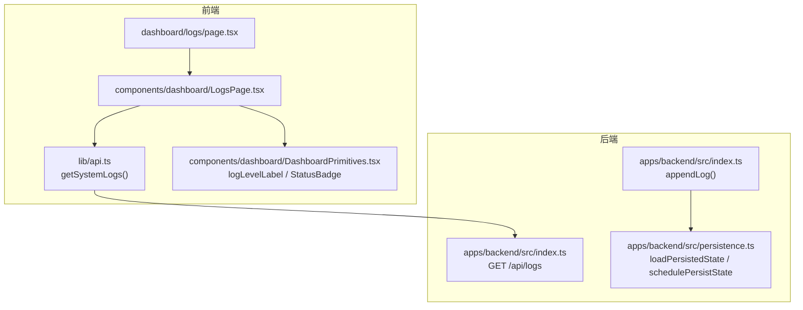
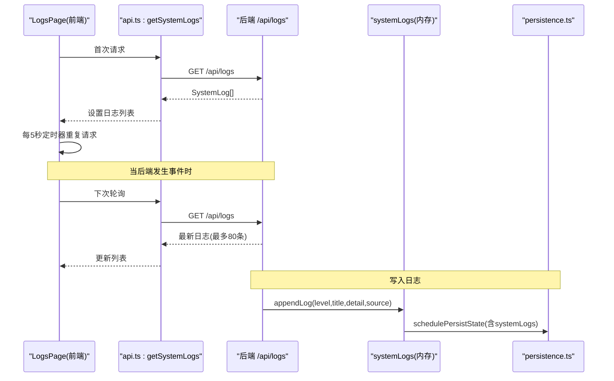
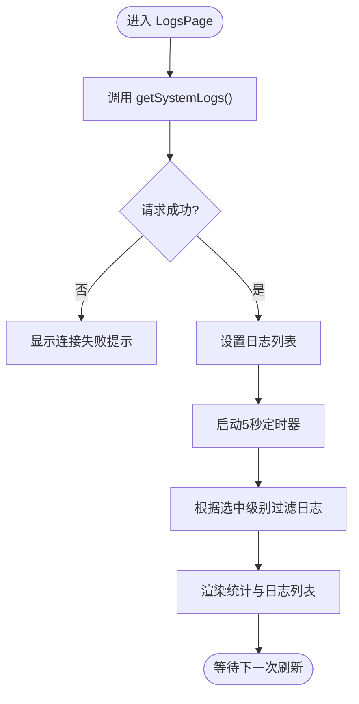
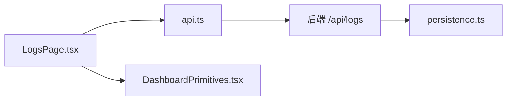

# 日志管理页面

<cite>
**本文引用的文件**
- [LogsPage.tsx](file://fishery-digital-twin-platform/apps/frontend/src/components/dashboard/LogsPage.tsx)
- [page.tsx](file://fishery-digital-twin-platform/apps/frontend/src/app/dashboard/logs/page.tsx)
- [DashboardPrimitives.tsx](file://fishery-digital-twin-platform/apps/frontend/src/components/dashboard/DashboardPrimitives.tsx)
- [api.ts](file://fishery-digital-twin-platform/apps/frontend/src/lib/api.ts)
- [index.ts（共享类型）](file://fishery-digital-twin-platform/packages/shared/src/index.ts)
- [index.ts（后端服务）](file://fishery-digital-twin-platform/apps/backend/src/index.ts)
- [persistence.ts](file://fishery-digital-twin-platform/apps/backend/src/persistence.ts)
</cite>

## 目录
1. [简介](#简介)
2. [项目结构](#项目结构)
3. [核心组件](#核心组件)
4. [架构总览](#架构总览)
5. [详细组件分析](#详细组件分析)
6. [依赖关系分析](#依赖关系分析)
7. [性能与可观测性](#性能与可观测性)
8. [故障排查指南](#故障排查指南)
9. [结论](#结论)
10. [附录：配置、存储与清理策略](#附录：配置存储与清理策略)

## 简介
本页面提供系统运行日志的集中展示能力，涵盖日志收集、过滤、格式化显示与基本统计。前端通过定时轮询获取后端日志接口数据，支持按日志级别筛选，并以表格形式呈现时间、级别、来源、事件标题与详情。当前实现未包含关键字搜索、时间范围筛选与导出功能，但文档提供了扩展建议与最佳实践。

## 项目结构
日志管理相关的前端路由与组件位于 Next.js 应用内，后端提供统一的日志查询接口，并在内存中维护日志列表，同时持久化到磁盘。

图表来源
- [page.tsx:1-6](file://fishery-digital-twin-platform/apps/frontend/src/app/dashboard/logs/page.tsx#L1-L6)
- [LogsPage.tsx:1-89](file://fishery-digital-twin-platform/apps/frontend/src/components/dashboard/LogsPage.tsx#L1-L89)
- [api.ts:91-93](file://fishery-digital-twin-platform/apps/frontend/src/lib/api.ts#L91-L93)
- [DashboardPrimitives.tsx:18-23](file://fishery-digital-twin-platform/apps/frontend/src/components/dashboard/DashboardPrimitives.tsx#L18-L23)
- [index.ts（后端服务）:116-129](file://fishery-digital-twin-platform/apps/backend/src/index.ts#L116-L129)
- [index.ts（后端服务）:557-557](file://fishery-digital-twin-platform/apps/backend/src/index.ts#L557-L557)
- [persistence.ts:32-44](file://fishery-digital-twin-platform/apps/backend/src/persistence.ts#L32-L44)

章节来源
- [page.tsx:1-6](file://fishery-digital-twin-platform/apps/frontend/src/app/dashboard/logs/page.tsx#L1-L6)
- [LogsPage.tsx:1-89](file://fishery-digital-twin-platform/apps/frontend/src/components/dashboard/LogsPage.tsx#L1-L89)
- [api.ts:91-93](file://fishery-digital-twin-platform/apps/frontend/src/lib/api.ts#L91-L93)
- [DashboardPrimitives.tsx:18-23](file://fishery-digital-twin-platform/apps/frontend/src/components/dashboard/DashboardPrimitives.tsx#L18-L23)
- [index.ts（后端服务）:116-129](file://fishery-digital-twin-platform/apps/backend/src/index.ts#L116-L129)
- [index.ts（后端服务）:557-557](file://fishery-digital-twin-platform/apps/backend/src/index.ts#L557-L557)
- [persistence.ts:32-44](file://fishery-digital-twin-platform/apps/backend/src/persistence.ts#L32-L44)

## 核心组件
- LogsPage：负责拉取并展示日志，提供级别过滤与自动刷新；计算预警与异常数量；渲染错误提示与空状态。
- DashboardPrimitives：提供日志级别中文标签映射与状态徽章样式。
- api.ts：封装 getSystemLogs 调用后端 /api/logs。
- 后端 index.ts：维护 systemLogs 数组，提供 GET /api/logs 返回全部日志；在关键操作处追加日志条目。
- persistence.ts：加载和调度持久化系统日志，限制历史长度。

章节来源
- [LogsPage.tsx:9-88](file://fishery-digital-twin-platform/apps/frontend/src/components/dashboard/LogsPage.tsx#L9-L88)
- [DashboardPrimitives.tsx:18-23](file://fishery-digital-twin-platform/apps/frontend/src/components/dashboard/DashboardPrimitives.tsx#L18-L23)
- [api.ts:91-93](file://fishery-digital-twin-platform/apps/frontend/src/lib/api.ts#L91-L93)
- [index.ts（后端服务）:116-129](file://fishery-digital-twin-platform/apps/backend/src/index.ts#L116-L129)
- [index.ts（后端服务）:557-557](file://fishery-digital-twin-platform/apps/backend/src/index.ts#L557-L557)
- [persistence.ts:32-44](file://fishery-digital-twin-platform/apps/backend/src/persistence.ts#L32-L44)

## 架构总览
前端每 5 秒轮询一次日志接口，后端以内存数组保存最近日志，并在每次写入后触发异步持久化。日志条目统一由 appendLog 生成，保证 id、level、title、detail、source、timestamp 字段完整。

图表来源
- [LogsPage.tsx:14-33](file://fishery-digital-twin-platform/apps/frontend/src/components/dashboard/LogsPage.tsx#L14-L33)
- [api.ts:91-93](file://fishery-digital-twin-platform/apps/frontend/src/lib/api.ts#L91-L93)
- [index.ts（后端服务）:557-557](file://fishery-digital-twin-platform/apps/backend/src/index.ts#L557-L557)
- [index.ts（后端服务）:116-129](file://fishery-digital-twin-platform/apps/backend/src/index.ts#L116-L129)
- [persistence.ts:51-67](file://fishery-digital-twin-platform/apps/backend/src/persistence.ts#L51-L67)

## 详细组件分析

### LogsPage 组件
- 数据获取与刷新：使用 useEffect 启动一次性请求，并设置 5 秒定时器周期性刷新；组件卸载时清理定时器与标志位，避免内存泄漏。
- 过滤机制：提供“全部/信息/成功/预警/异常”五个级别按钮，点击后对 logs 进行 level 过滤，仅渲染匹配项。
- 统计面板：展示日志总数、预警与异常数量、最近事件标题。
- 格式化显示：时间使用本地化格式；级别使用 logLevelLabel 映射为中文；来源默认 fallback 为 “system”。
- 错误处理：当 getSystemLogs 抛错时，显示连接失败提示，保留上次成功读取的数据。

图表来源
- [LogsPage.tsx:14-33](file://fishery-digital-twin-platform/apps/frontend/src/components/dashboard/LogsPage.tsx#L14-L33)
- [LogsPage.tsx:35-43](file://fishery-digital-twin-platform/apps/frontend/src/components/dashboard/LogsPage.tsx#L35-L43)
- [LogsPage.tsx:45-88](file://fishery-digital-twin-platform/apps/frontend/src/components/dashboard/LogsPage.tsx#L45-L88)

章节来源
- [LogsPage.tsx:9-88](file://fishery-digital-twin-platform/apps/frontend/src/components/dashboard/LogsPage.tsx#L9-L88)

### 日志级别与格式化
- 级别分类：info、success、warning、error。
- 中文标签：logLevelLabel 将级别映射为“信息/成功/预警/异常”。
- 视觉反馈：StatusBadge 根据级别选择不同色调（成功=good，预警/异常=warn，其他=neutral）。

章节来源
- [DashboardPrimitives.tsx:18-23](file://fishery-digital-twin-platform/apps/frontend/src/components/dashboard/DashboardPrimitives.tsx#L18-L23)
- [DashboardPrimitives.tsx:50-57](file://fishery-digital-twin-platform/apps/frontend/src/components/dashboard/DashboardPrimitives.tsx#L50-L57)
- [index.ts（共享类型）:196-203](file://fishery-digital-twin-platform/packages/shared/src/index.ts#L196-L203)

### 数据模型 SystemLog
- 字段：id、level、title、detail、source、timestamp。
- 用途：前后端共享的类型定义，确保日志数据结构一致。

章节来源
- [index.ts（共享类型）:196-203](file://fishery-digital-twin-platform/packages/shared/src/index.ts#L196-L203)

### 后端日志写入与接口
- appendLog：生成唯一 id、记录时间与来源，插入到 systemLogs 头部，并裁剪至最多 80 条，随后触发持久化。
- GET /api/logs：直接返回内存中的 systemLogs 数组。
- 多处业务逻辑会调用 appendLog 记录传感器数据接收、设备在线、AI 报告生成等事件。

章节来源
- [index.ts（后端服务）:116-129](file://fishery-digital-twin-platform/apps/backend/src/index.ts#L116-L129)
- [index.ts（后端服务）:557-557](file://fishery-digital-twin-platform/apps/backend/src/index.ts#L557-L557)
- [index.ts（后端服务）:419-425](file://fishery-digital-twin-platform/apps/backend/src/index.ts#L419-L425)
- [index.ts（后端服务）:465-471](file://fishery-digital-twin-platform/apps/backend/src/index.ts#L465-L471)
- [index.ts（后端服务）:513-518](file://fishery-digital-twin-platform/apps/backend/src/index.ts#L513-L518)
- [index.ts（后端服务）:548-552](file://fishery-digital-twin-platform/apps/backend/src/index.ts#L548-L552)

## 依赖关系分析
- 前端依赖：
  - LogsPage 依赖 api.ts 的 getSystemLogs 与 DashboardPrimitives 的 UI 原语。
  - 路由 page.tsx 仅作为容器渲染 LogsPage。
- 后端依赖：
  - index.ts 维护 systemLogs，并通过 persistence.ts 进行持久化。
  - 各业务模块通过 appendLog 统一写入日志。

图表来源
- [LogsPage.tsx:1-89](file://fishery-digital-twin-platform/apps/frontend/src/components/dashboard/LogsPage.tsx#L1-L89)
- [api.ts:91-93](file://fishery-digital-twin-platform/apps/frontend/src/lib/api.ts#L91-L93)
- [index.ts（后端服务）:557-557](file://fishery-digital-twin-platform/apps/backend/src/index.ts#L557-L557)
- [persistence.ts:32-67](file://fishery-digital-twin-platform/apps/backend/src/persistence.ts#L32-L67)

章节来源
- [LogsPage.tsx:1-89](file://fishery-digital-twin-platform/apps/frontend/src/components/dashboard/LogsPage.tsx#L1-L89)
- [api.ts:91-93](file://fishery-digital-twin-platform/apps/frontend/src/lib/api.ts#L91-L93)
- [index.ts（后端服务）:557-557](file://fishery-digital-twin-platform/apps/backend/src/index.ts#L557-L557)
- [persistence.ts:32-67](file://fishery-digital-twin-platform/apps/backend/src/persistence.ts#L32-L67)

## 性能与可观测性
- 轮询频率：前端每 5 秒请求一次，适合实时观察但不宜过高，避免网络压力。
- 数据量控制：后端限制 systemLogs 最多 80 条，减少传输与渲染开销。
- 渲染优化：列表采用固定列宽与滚动区域，避免重排；时间本地化仅在渲染时执行。
- 可扩展点：
  - 增加分页或虚拟滚动以支持更大日志集。
  - 引入服务端分页与过滤参数，降低前端计算成本。
  - 对高频日志进行采样或聚合，提升可读性与性能。

[本节为通用性能建议，不直接分析具体代码]

## 故障排查指南
- 连接失败：当 getSystemLogs 抛出异常时，界面显示“日志服务连接失败”，并保留上次成功数据。检查后端是否启动、CORS 配置与网络连通性。
- 无日志显示：若后端尚未产生日志，界面显示“暂无运行日志”；若已产生但被过滤，则显示“当前筛选条件下无记录”。
- 级别过滤无效：确认所选级别是否存在对应日志；可通过切换“全部”查看整体情况。
- 日志未持久化：检查 persistence.ts 的调度与保存逻辑，以及磁盘权限与路径是否正确。

章节来源
- [LogsPage.tsx:14-33](file://fishery-digital-twin-platform/apps/frontend/src/components/dashboard/LogsPage.tsx#L14-L33)
- [LogsPage.tsx:49-88](file://fishery-digital-twin-platform/apps/frontend/src/components/dashboard/LogsPage.tsx#L49-L88)
- [persistence.ts:32-67](file://fishery-digital-twin-platform/apps/backend/src/persistence.ts#L32-L67)

## 结论
当前日志管理页面实现了基础的日志收集、级别过滤与格式化展示，具备稳定的轮询刷新与错误提示能力。后端通过统一入口写入日志并限制历史长度，结合持久化保障数据不丢失。后续可在前端增加关键字搜索、时间范围筛选与导出功能，在后端增加服务端过滤与分页以提升可扩展性与性能。

[本节为总结性内容，不直接分析具体代码]

## 附录：配置、存储与清理策略
- 配置选项
  - 前端 API 基础地址与令牌：NEXT_PUBLIC_API_BASE、NEXT_PUBLIC_UISYS_API_TOKEN。
  - 后端端口与主机：PORT、HOST。
  - CORS 白名单：CORS_ORIGIN。
  - 演示模式开关与间隔：UISYS_DEMO_WATER_FEED、UISYS_DEMO_WATER_INTERVAL_MS。
  - 传感器新鲜度阈值：UISYS_SENSOR_FRESHNESS_MS。
- 存储策略
  - 内存：systemLogs 数组保存最近日志（最多 80 条），waterHistory 最多 180 条。
  - 持久化：schedulePersistState 延迟保存，flushPersistedState 立即保存；重启后从文件恢复 waterHistory、batteries、latestAiReport、systemLogs。
- 清理机制
  - 日志裁剪：appendLog 插入后 splice(80)，保持上限。
  - 历史裁剪：waterHistory 切片保持 maxHistory。
  - 定时器清理：前端 useEffect 清理定时器，后端 shutdown 关闭 UDP 与 HTTP 服务。

章节来源
- [api.ts:3-15](file://fishery-digital-twin-platform/apps/frontend/src/lib/api.ts#L3-L15)
- [index.ts（后端服务）:48-76](file://fishery-digital-twin-platform/apps/backend/src/index.ts#L48-L76)
- [index.ts（后端服务）:64-68](file://fishery-digital-twin-platform/apps/backend/src/index.ts#L64-L68)
- [index.ts（后端服务）:116-129](file://fishery-digital-twin-platform/apps/backend/src/index.ts#L116-L129)
- [index.ts（后端服务）:178-187](file://fishery-digital-twin-platform/apps/backend/src/index.ts#L178-L187)
- [persistence.ts:32-67](file://fishery-digital-twin-platform/apps/backend/src/persistence.ts#L32-L67)