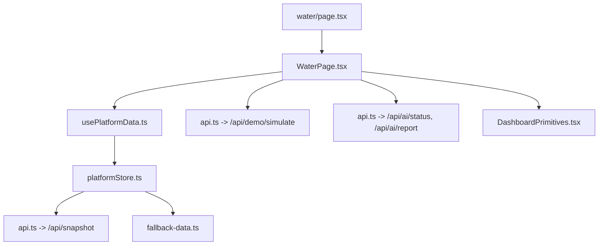
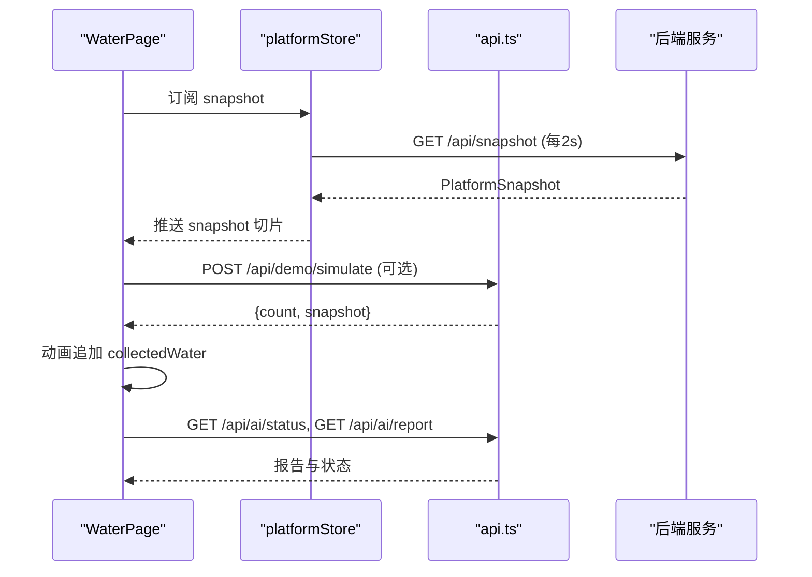
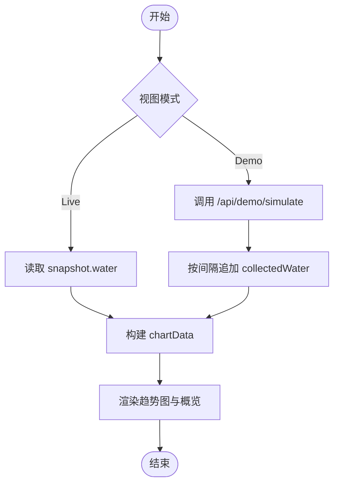
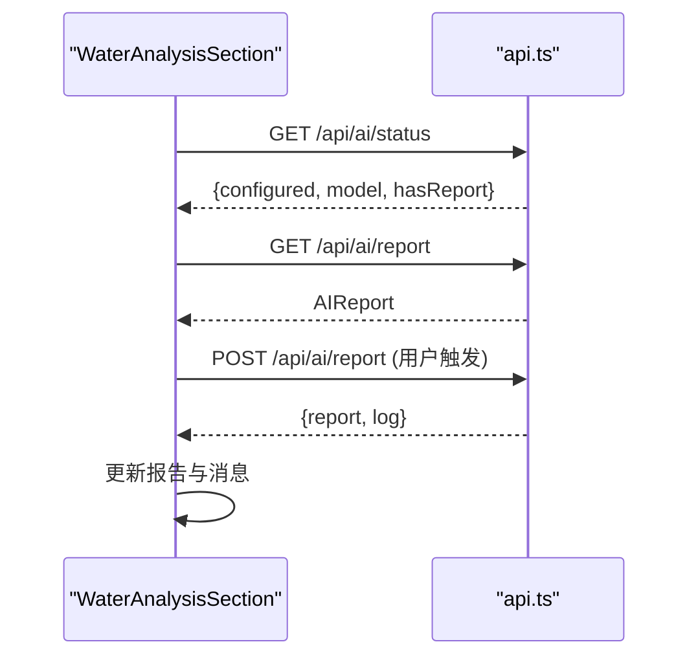
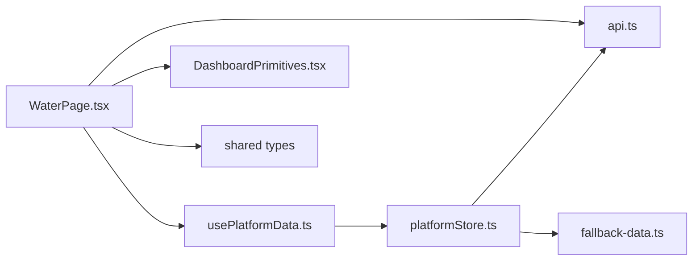

# 水质监测页面

<cite>
**本文引用的文件**
- [WaterPage.tsx](file://fishery-digital-twin-platform/apps/frontend/src/components/dashboard/WaterPage.tsx)
- [page.tsx](file://fishery-digital-twin-platform/apps/frontend/src/app/dashboard/water/page.tsx)
- [platformStore.ts](file://fishery-digital-twin-platform/apps/frontend/src/lib/platformStore.ts)
- [usePlatformData.ts](file://fishery-digital-twin-platform/apps/frontend/src/hooks/usePlatformData.ts)
- [api.ts](file://fishery-digital-twin-platform/apps/frontend/src/lib/api.ts)
- [fallback-data.ts](file://fishery-digital-twin-platform/apps/frontend/src/lib/fallback-data.ts)
- [DashboardPrimitives.tsx](file://fishery-digital-twin-platform/apps/frontend/src/components/dashboard/DashboardPrimitives.tsx)
- [index.ts（共享类型）](file://fishery-digital-twin-platform/packages/shared/src/index.ts)
</cite>

## 目录
1. [简介](#简介)
2. [项目结构](#项目结构)
3. [核心组件与职责](#核心组件与职责)
4. [架构总览](#架构总览)
5. [详细组件分析](#详细组件分析)
6. [依赖关系分析](#依赖关系分析)
7. [性能考虑](#性能考虑)
8. [故障排查指南](#故障排查指南)
9. [结论](#结论)
10. [附录：数据格式与API说明](#附录数据格式与api说明)

## 简介
本页面提供水域环境监测的一体化能力，包括：
- 实时水质参数展示（水温、浊度、pH、溶解氧、氨氮、电导率）
- 历史趋势图表（可切换时间范围）
- 演示数据采集动画与进度反馈
- 异常预警与本地判断
- AI智能分析报告生成与展示
- 与后端API交互获取平台快照、演示数据与AI报告

该页面通过统一的平台数据总线订阅最新快照，结合前端状态管理实现数据更新与视图同步。

## 项目结构
- 路由入口：dashboard/water/page.tsx 渲染 WaterPage 组件
- 业务主组件：WaterPage.tsx 负责布局、图表、采集流程、分析与报告
- 数据源：platformStore.ts 定时拉取 /api/snapshot，usePlatformData.ts 暴露给组件使用
- API封装：api.ts 统一请求封装，调用 /api/snapshot、/api/demo/simulate、/api/ai/status、/api/ai/report 等
- 离线兜底：fallback-data.ts 提供初始快照与模拟数据，保证无后端时仍可运行
- UI基础组件：DashboardPrimitives.tsx 提供 PageFrame、ActionButton、StatusBadge、EmptyPanel、useVisualReady 等

**图示来源**
- [page.tsx:1-6](file://fishery-digital-twin-platform/apps/frontend/src/app/dashboard/water/page.tsx#L1-L6)
- [WaterPage.tsx:1-218](file://fishery-digital-twin-platform/apps/frontend/src/components/dashboard/WaterPage.tsx#L1-L218)
- [usePlatformData.ts:1-24](file://fishery-digital-twin-platform/apps/frontend/src/hooks/usePlatformData.ts#L1-L24)
- [platformStore.ts:1-196](file://fishery-digital-twin-platform/apps/frontend/src/lib/platformStore.ts#L1-L196)
- [api.ts:1-101](file://fishery-digital-twin-platform/apps/frontend/src/lib/api.ts#L1-L101)
- [fallback-data.ts:1-164](file://fishery-digital-twin-platform/apps/frontend/src/lib/fallback-data.ts#L1-L164)
- [DashboardPrimitives.tsx:1-102](file://fishery-digital-twin-platform/apps/frontend/src/components/dashboard/DashboardPrimitives.tsx#L1-L102)

**章节来源**
- [page.tsx:1-6](file://fishery-digital-twin-platform/apps/frontend/src/app/dashboard/water/page.tsx#L1-L6)
- [WaterPage.tsx:1-218](file://fishery-digital-twin-platform/apps/frontend/src/components/dashboard/WaterPage.tsx#L1-L218)
- [platformStore.ts:1-196](file://fishery-digital-twin-platform/apps/frontend/src/lib/platformStore.ts#L1-L196)
- [usePlatformData.ts:1-24](file://fishery-digital-twin-platform/apps/frontend/src/hooks/usePlatformData.ts#L1-L24)
- [api.ts:1-101](file://fishery-digital-twin-platform/apps/frontend/src/lib/api.ts#L1-L101)
- [fallback-data.ts:1-164](file://fishery-digital-twin-platform/apps/frontend/src/lib/fallback-data.ts#L1-L164)
- [DashboardPrimitives.tsx:1-102](file://fishery-digital-twin-platform/apps/frontend/src/components/dashboard/DashboardPrimitives.tsx#L1-L102)

## 核心组件与职责
- WaterPage：页面容器，组织概览面板、趋势图、分析区；控制演示数据采集与进度；维护视图模式（live/demo）。
- WaterOverviewPanel：展示最新一条水质的综合状态与各指标卡片，依据阈值给出“良好/需关注/预警”等提示。
- CoreWaterTrendChart：基于 Recharts 的折线图，展示水温、溶解氧、pH 的趋势，支持双Y轴与低氧区域高亮。
- WaterAnalysisSection：本地异常检测 + AI报告展示；支持生成报告、查看风险等级、关键发现与建议。
- platformStore：集中式数据总线，定时轮询后端快照，向订阅者推送增量更新。
- usePlatformData：React Hook，将 store 切片以不可变对象形式提供给组件，避免不必要重渲染。
- api：统一HTTP封装，处理超时、鉴权头、错误抛出。
- fallback-data：离线初始数据与模拟数据生成，确保首屏可用。

**章节来源**
- [WaterPage.tsx:45-218](file://fishery-digital-twin-platform/apps/frontend/src/components/dashboard/WaterPage.tsx#L45-L218)
- [WaterPage.tsx:220-390](file://fishery-digital-twin-platform/apps/frontend/src/components/dashboard/WaterPage.tsx#L220-L390)
- [WaterPage.tsx:403-538](file://fishery-digital-twin-platform/apps/frontend/src/components/dashboard/WaterPage.tsx#L403-L538)
- [platformStore.ts:20-139](file://fishery-digital-twin-platform/apps/frontend/src/lib/platformStore.ts#L20-L139)
- [usePlatformData.ts:1-24](file://fishery-digital-twin-platform/apps/frontend/src/hooks/usePlatformData.ts#L1-L24)
- [api.ts:6-50](file://fishery-digital-twin-platform/apps/frontend/src/lib/api.ts#L6-L50)
- [fallback-data.ts:67-82](file://fishery-digital-twin-platform/apps/frontend/src/lib/fallback-data.ts#L67-L82)

## 架构总览
页面采用“数据总线 + 组件订阅”的模式：
- platformStore 每2秒调用 /api/snapshot，成功则更新 snapshot 并通知所有订阅者
- usePlatformData 通过 useSyncExternalStore 将 snapshot 切片暴露给组件
- WaterPage 在 live 模式下直接读取 snapshot.water，在 demo 模式下通过 /api/demo/simulate 生成演示数据并以动画方式追加到本地 collectedWater
- WaterAnalysisSection 会查询 /api/ai/status 和 /api/ai/report，并在用户点击后调用 /api/ai/report 生成新报告

**图示来源**
- [platformStore.ts:98-139](file://fishery-digital-twin-platform/apps/frontend/src/lib/platformStore.ts#L98-L139)
- [usePlatformData.ts:10-23](file://fishery-digital-twin-platform/apps/frontend/src/hooks/usePlatformData.ts#L10-L23)
- [WaterPage.tsx:109-145](file://fishery-digital-twin-platform/apps/frontend/src/components/dashboard/WaterPage.tsx#L109-L145)
- [api.ts:26-50](file://fishery-digital-twin-platform/apps/frontend/src/lib/api.ts#L26-L50)

## 详细组件分析

### WaterPage：数据流与交互
- 数据来源
  - live 模式：直接从 usePlatformData().snapshot.water 读取
  - demo 模式：调用 generateDemoSimulation(count)，截取最近 count 条数据，按间隔推进显示
- 图表数据
  - 将 collectedWater 或 snapshot.water 映射为 chartData，包含 time、水温、浊度、pH、溶解氧、氨氮、电导率
  - 支持 1h/6h/24h/7d 时间范围切换，仅显示最近 N 个采样点
- 演示采集
  - startWaterCollection 调用后端生成演示数据，设置 collectionRunning、collectionTotal，并通过 setInterval 逐步追加 collectedWater
  - 完成后恢复 live 模式或保持 demo 模式，并提供返回实时数据的按钮
- 错误处理
  - 捕获演示数据生成失败，设置 collectionError 并回退到 live 模式
  - 清理定时器，防止内存泄漏

**图示来源**
- [WaterPage.tsx:45-145](file://fishery-digital-twin-platform/apps/frontend/src/components/dashboard/WaterPage.tsx#L45-L145)
- [WaterPage.tsx:169-215](file://fishery-digital-twin-platform/apps/frontend/src/components/dashboard/WaterPage.tsx#L169-L215)

**章节来源**
- [WaterPage.tsx:45-218](file://fishery-digital-twin-platform/apps/frontend/src/components/dashboard/WaterPage.tsx#L45-L218)

### WaterOverviewPanel：实时指标与状态
- 展示最新一条 water 的六项指标：水温、pH、浊度、溶解氧、氨氮、电导率
- 根据阈值判定单项状态（正常/关注/未连接），并汇总整体状态（良好/需关注/预警）
- 显示数据来源标签（真实传感器/演示数据/离线占位）与更新时间

**章节来源**
- [WaterPage.tsx:220-287](file://fishery-digital-twin-platform/apps/frontend/src/components/dashboard/WaterPage.tsx#L220-L287)

### CoreWaterTrendChart：趋势可视化
- 使用 Recharts 的 LineChart，双Y轴：左轴显示水温与溶解氧，右轴显示pH
- 低溶解氧区域使用 ReferenceArea 高亮（y1=0, y2=5）
- Tooltip 自定义单位显示，数值保留小数位数
- 空态与初始化态分别用 EmptyPanel 提示

**章节来源**
- [WaterPage.tsx:289-390](file://fishery-digital-twin-platform/apps/frontend/src/components/dashboard/WaterPage.tsx#L289-L390)

### WaterAnalysisSection：异常预警与AI报告
- 本地异常检测：基于最新 water 的阈值判断（溶解氧偏低、氨氮偏高、pH越界、浊度高）
- AI报告：
  - 启动时调用 getAiStatus 与 getAiReport 获取当前配置与已有报告
  - 用户点击“生成预测报告”调用 generateAiReport，成功后更新 report 与消息
  - 演示模式下禁用报告生成，避免污染实时数据
- 建模可视化：展示最近48个采样点的温度、浊度、pH趋势

**图示来源**
- [WaterPage.tsx:403-538](file://fishery-digital-twin-platform/apps/frontend/src/components/dashboard/WaterPage.tsx#L403-L538)
- [api.ts:37-50](file://fishery-digital-twin-platform/apps/frontend/src/lib/api.ts#L37-L50)

**章节来源**
- [WaterPage.tsx:403-538](file://fishery-digital-twin-platform/apps/frontend/src/components/dashboard/WaterPage.tsx#L403-L538)

### platformStore 与 usePlatformData：数据总线
- 定时刷新：每2秒调用 getPlatformSnapshot()，成功则更新 snapshotAt 与 snapshotConnected，并通知订阅者
- 设备反馈：每1秒并行拉取 servos 与 propulsion 快照，合并连接状态
- 切片隔离：platformDataSlice 与 deviceFeedbackSlice 分离，减少无关重渲染
- React集成：usePlatformData 使用 useSyncExternalStore 订阅 store，返回只读切片

**章节来源**
- [platformStore.ts:20-139](file://fishery-digital-twin-platform/apps/frontend/src/lib/platformStore.ts#L20-L139)
- [usePlatformData.ts:1-24](file://fishery-digital-twin-platform/apps/frontend/src/hooks/usePlatformData.ts#L1-L24)

## 依赖关系分析
- WaterPage 依赖：
  - usePlatformData 获取实时 snapshot
  - api 调用演示与AI相关接口
  - DashboardPrimitives 提供通用UI组件
- platformStore 依赖：
  - api.getPlatformSnapshot 获取快照
  - fallback-data.createSnapshot 提供初始快照
- 共享类型来自 @fishery/shared，定义 WaterData、PlatformSnapshot、AIReport 等

**图示来源**
- [WaterPage.tsx:1-12](file://fishery-digital-twin-platform/apps/frontend/src/components/dashboard/WaterPage.tsx#L1-L12)
- [usePlatformData.ts:1-24](file://fishery-digital-twin-platform/apps/frontend/src/hooks/usePlatformData.ts#L1-L24)
- [platformStore.ts:1-196](file://fishery-digital-twin-platform/apps/frontend/src/lib/platformStore.ts#L1-L196)
- [api.ts:1-101](file://fishery-digital-twin-platform/apps/frontend/src/lib/api.ts#L1-L101)
- [fallback-data.ts:1-164](file://fishery-digital-twin-platform/apps/frontend/src/lib/fallback-data.ts#L1-L164)
- [DashboardPrimitives.tsx:1-102](file://fishery-digital-twin-platform/apps/frontend/src/components/dashboard/DashboardPrimitives.tsx#L1-L102)
- [index.ts（共享类型）:1-106](file://fishery-digital-twin-platform/packages/shared/src/index.ts#L1-L106)

**章节来源**
- [WaterPage.tsx:1-218](file://fishery-digital-twin-platform/apps/frontend/src/components/dashboard/WaterPage.tsx#L1-L218)
- [platformStore.ts:1-196](file://fishery-digital-twin-platform/apps/frontend/src/lib/platformStore.ts#L1-L196)
- [api.ts:1-101](file://fishery-digital-twin-platform/apps/frontend/src/lib/api.ts#L1-L101)
- [fallback-data.ts:1-164](file://fishery-digital-twin-platform/apps/frontend/src/lib/fallback-data.ts#L1-L164)
- [DashboardPrimitives.tsx:1-102](file://fishery-digital-twin-platform/apps/frontend/src/components/dashboard/DashboardPrimitives.tsx#L1-L102)
- [index.ts（共享类型）:1-106](file://fishery-digital-twin-platform/packages/shared/src/index.ts#L1-L106)

## 性能考虑
- 数据刷新频率
  - 平台快照每2秒一次，设备反馈每1秒一次，避免频繁网络请求
  - 使用 useSyncExternalStore 与切片隔离，降低无关组件重渲染
- 图表渲染优化
  - 使用 useMemo 计算 visibleWater 与 chartData，减少重复计算
  - 限制显示采样点数量（按时间范围选择最近N条）
  - 图表初始化延迟（useVisualReady）避免首次渲染闪烁
- 演示动画
  - 使用 setInterval 逐步追加数据，提升观感同时避免一次性大量更新
  - 组件卸载时清理定时器，防止内存泄漏
- 网络层
  - fetch 设置超时与 no-store，避免缓存导致的数据滞后
  - 错误统一抛出，便于上层捕获与降级

[本节为通用性能建议，不直接分析具体代码行]

## 故障排查指南
- 无法获取实时数据
  - 检查 NEXT_PUBLIC_API_BASE 是否正确指向后端地址
  - 若后端不可用，platformStore 会将 snapshotConnected 置为 false，页面应显示离线占位或兜底数据
- 演示数据生成失败
  - 检查 /api/demo/simulate 是否可达，确认请求体与响应格式
  - 捕获错误后页面会设置 collectionError 并回退到 live 模式
- AI报告生成失败
  - 检查 /api/ai/status 与 /api/ai/report 是否可达
  - 生成失败时 message 会提示“智能报告生成失败，请检查后端和密钥配置”
- 图表不显示
  - 确认 visualReady 为 true 且 chartData 非空
  - 检查 Recharts 容器尺寸与 ResponsiveContainer 是否正常挂载
- 内存泄漏与卡顿
  - 确认所有定时器在组件卸载时被清理
  - 避免在高频回调中创建大对象，优先使用 useMemo/useCallback

**章节来源**
- [platformStore.ts:98-114](file://fishery-digital-twin-platform/apps/frontend/src/lib/platformStore.ts#L98-L114)
- [WaterPage.tsx:68-86](file://fishery-digital-twin-platform/apps/frontend/src/components/dashboard/WaterPage.tsx#L68-L86)
- [WaterPage.tsx:109-145](file://fishery-digital-twin-platform/apps/frontend/src/components/dashboard/WaterPage.tsx#L109-L145)
- [WaterPage.tsx:445-461](file://fishery-digital-twin-platform/apps/frontend/src/components/dashboard/WaterPage.tsx#L445-L461)
- [api.ts:6-24](file://fishery-digital-twin-platform/apps/frontend/src/lib/api.ts#L6-L24)

## 结论
水质监测页面通过统一的数据总线与清晰的组件分层，实现了实时数据展示、历史趋势分析、异常预警与AI报告的完整闭环。其设计兼顾了用户体验与性能，具备较强的可扩展性与容错能力。后续可在以下方面继续优化：
- 增加更多时间粒度与聚合统计（均值、峰值、方差）
- 引入WebSocket替代轮询以降低延迟
- 扩展图表交互（缩放、筛选、导出）
- 增强告警策略与通知机制

[本节为总结性内容，不直接分析具体代码行]

## 附录：数据格式与API说明

### 共享数据类型（节选）
- WaterData：包含 timestamp、source、水温、浊度、pH、溶解氧、氨氮、电导率、status
- PlatformSnapshot：包含 generatedAt、dataMode、water[]、batteries[]、navigation、aiReport、vessel
- AIReport：包含 riskLevel、title、summary、findings[]、recommendations[]、dataQuality、confidence、sampleCount、model、forecast{}

**章节来源**
- [index.ts（共享类型）:7-106](file://fishery-digital-twin-platform/packages/shared/src/index.ts#L7-L106)

### API端点与用途
- GET /api/snapshot：获取平台快照（含水质历史）
- POST /api/demo/simulate：生成演示水质数据，返回 count 与 snapshot
- GET /api/ai/status：查询AI模型配置与是否有报告
- GET /api/ai/report：获取已有AI报告
- POST /api/ai/report：生成新的AI报告

**章节来源**
- [api.ts:26-50](file://fishery-digital-twin-platform/apps/frontend/src/lib/api.ts#L26-L50)

### 数据更新与状态同步
- platformStore 每2秒拉取快照，成功则更新 snapshotAt 与 snapshotConnected，并通知订阅者
- usePlatformData 将 snapshot 切片暴露给组件，保证SSR与客户端一致
- WaterPage 在 live 模式下直接使用 snapshot.water，demo 模式下使用 collectedWater 进行动画展示

**章节来源**
- [platformStore.ts:20-139](file://fishery-digital-twin-platform/apps/frontend/src/lib/platformStore.ts#L20-L139)
- [usePlatformData.ts:10-23](file://fishery-digital-twin-platform/apps/frontend/src/hooks/usePlatformData.ts#L10-L23)
- [WaterPage.tsx:45-80](file://fishery-digital-twin-platform/apps/frontend/src/components/dashboard/WaterPage.tsx#L45-L80)