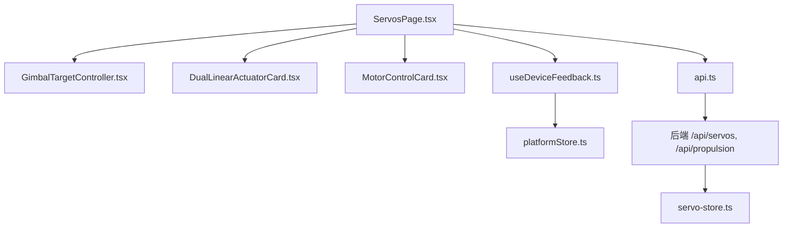
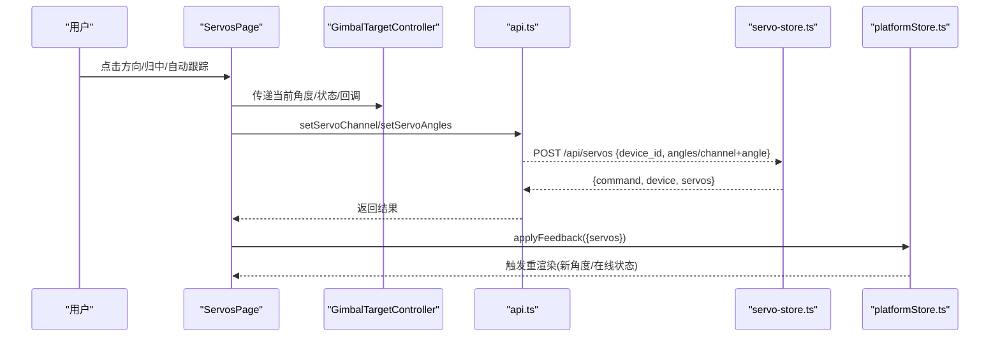
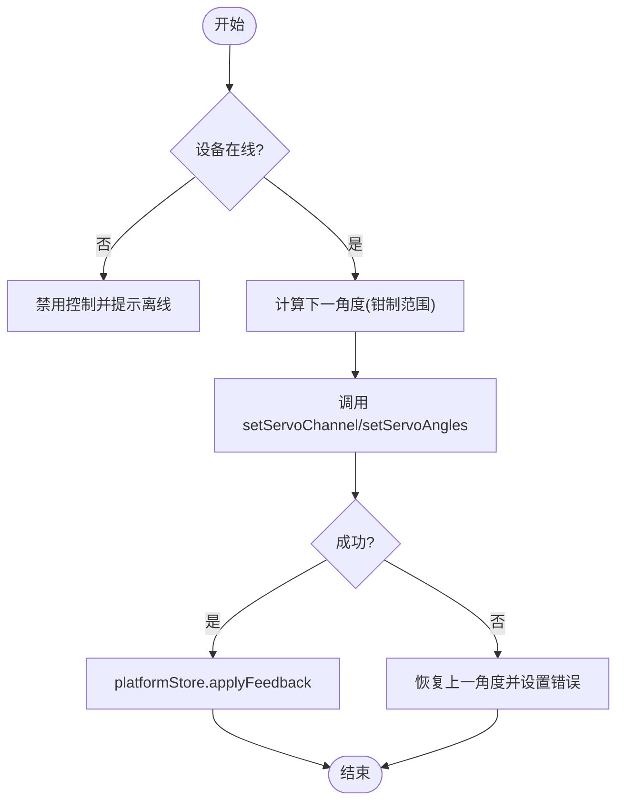
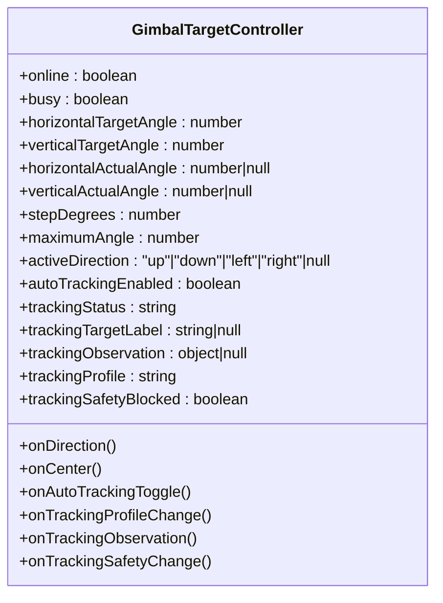
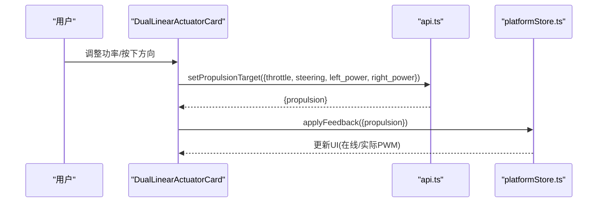
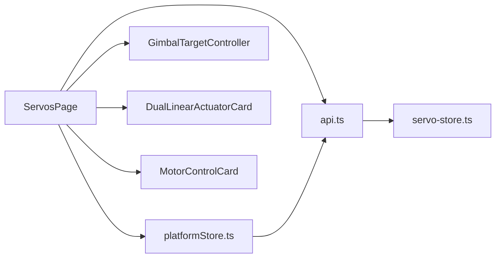

# 舵机控制页面

<cite>
**本文引用的文件**
- [ServosPage.tsx](file://apps/frontend/src/components/dashboard/ServosPage.tsx)
- [GimbalTargetController.tsx](file://apps/frontend/src/components/dashboard/GimbalTargetController.tsx)
- [DualLinearActuatorCard.tsx](file://apps/frontend/src/components/dashboard/DualLinearActuatorCard.tsx)
- [MotorControlCard.tsx](file://apps/frontend/src/components/dashboard/MotorControlCard.tsx)
- [useDeviceFeedback.ts](file://apps/frontend/src/hooks/useDeviceFeedback.ts)
- [platformStore.ts](file://apps/frontend/src/lib/platformStore.ts)
- [api.ts](file://apps/frontend/src/lib/api.ts)
- [servo-store.ts](file://apps/backend/src/servo-store.ts)
</cite>

## 目录
1. [简介](#简介)
2. [项目结构](#项目结构)
3. [核心组件](#核心组件)
4. [架构总览](#架构总览)
5. [详细组件分析](#详细组件分析)
6. [依赖关系分析](#依赖关系分析)
7. [性能与实时性](#性能与实时性)
8. [故障排查与安全保护](#故障排查与安全保护)
9. [结论](#结论)
10. [附录：配置与扩展](#附录：配置与扩展)

## 简介
本页面提供舵机与执行器的集中操控能力，包含云台（双轴舵机）的实时监控、手动步进控制、自动跟踪、水枪开关控制，以及双路推杆与单电机的运行控制。页面通过前端状态管理、设备反馈轮询与后端舵机存储协同，实现“所见即所得”的控制体验，并内置安全限制、错误回滚与调试可视化。

## 项目结构
- 前端页面与交互逻辑集中在 dashboard 组件中，其中 ServosPage 作为入口聚合多个子控件。
- 设备数据通过 platformStore 统一订阅，useDeviceFeedback 将 servos/propulsion 暴露给 UI。
- API 层封装了与后端的 HTTP 通信；后端 servo-store 维护舵机状态、命令队列与在线判定。

图表来源
- [ServosPage.tsx:111-731](file://apps/frontend/src/components/dashboard/ServosPage.tsx#L111-L731)
- [GimbalTargetController.tsx:43-345](file://apps/frontend/src/components/dashboard/GimbalTargetController.tsx#L43-L345)
- [DualLinearActuatorCard.tsx:16-339](file://apps/frontend/src/components/dashboard/DualLinearActuatorCard.tsx#L16-L339)
- [MotorControlCard.tsx:27-439](file://apps/frontend/src/components/dashboard/MotorControlCard.tsx#L27-L439)
- [useDeviceFeedback.ts:8-21](file://apps/frontend/src/hooks/useDeviceFeedback.ts#L8-L21)
- [platformStore.ts:116-139](file://apps/frontend/src/lib/platformStore.ts#L116-L139)
- [api.ts:52-89](file://apps/frontend/src/lib/api.ts#L52-L89)
- [servo-store.ts:89-184](file://apps/backend/src/servo-store.ts#L89-L184)

章节来源
- [ServosPage.tsx:111-731](file://apps/frontend/src/components/dashboard/ServosPage.tsx#L111-L731)
- [platformStore.ts:116-139](file://apps/frontend/src/lib/platformStore.ts#L116-L139)
- [api.ts:52-89](file://apps/frontend/src/lib/api.ts#L52-L89)
- [servo-store.ts:89-184](file://apps/backend/src/servo-store.ts#L89-L184)

## 核心组件
- ServosPage：页面容器，负责设备装配、全局状态、云台手动/自动跟踪、水枪开关、电机与推杆卡片集成。
- GimbalTargetController：云台瞄准界面，显示目标识别、偏差提示、方向步进、一键归中与自动跟踪开关。
- DualLinearActuatorCard：双路推杆控制面板，支持同步/独立控制、紧急停止、PWM 反馈展示。
- MotorControlCard：通用电机控制卡片，支持旋转/线性模式、运行时保护、冷却与往返周期等。
- useDeviceFeedback + platformStore：设备反馈订阅与刷新，保证多模块共享最新状态。
- api.ts：统一的 HTTP 调用封装，含超时、鉴权头与错误抛出。
- servo-store.ts：后端舵机状态机、指令校验、保留通道与角度上限、命令 TTL 清理。

章节来源
- [ServosPage.tsx:111-731](file://apps/frontend/src/components/dashboard/ServosPage.tsx#L111-L731)
- [GimbalTargetController.tsx:43-345](file://apps/frontend/src/components/dashboard/GimbalTargetController.tsx#L43-L345)
- [DualLinearActuatorCard.tsx:16-339](file://apps/frontend/src/components/dashboard/DualLinearActuatorCard.tsx#L16-L339)
- [MotorControlCard.tsx:27-439](file://apps/frontend/src/components/dashboard/MotorControlCard.tsx#L27-L439)
- [useDeviceFeedback.ts:8-21](file://apps/frontend/src/hooks/useDeviceFeedback.ts#L8-L21)
- [platformStore.ts:116-139](file://apps/frontend/src/lib/platformStore.ts#L116-L139)
- [api.ts:52-89](file://apps/frontend/src/lib/api.ts#L52-L89)
- [servo-store.ts:89-184](file://apps/backend/src/servo-store.ts#L89-L184)

## 架构总览
前端以 React 组件驱动 UI，使用 platformStore 定时拉取平台快照与设备反馈，并通过 api.ts 发送控制指令。后端 servo-store 维护舵机设备状态、校验参数、应用保留通道与角度上限，生成命令并返回快照供前端更新。

图表来源
- [ServosPage.tsx:272-328](file://apps/frontend/src/components/dashboard/ServosPage.tsx#L272-L328)
- [ServosPage.tsx:438-461](file://apps/frontend/src/components/dashboard/ServosPage.tsx#L438-L461)
- [api.ts:56-68](file://apps/frontend/src/lib/api.ts#L56-L68)
- [servo-store.ts:106-153](file://apps/backend/src/servo-store.ts#L106-L153)
- [platformStore.ts:181-183](file://apps/frontend/src/lib/platformStore.ts#L181-L183)

## 详细组件分析

### ServosPage：页面编排与控制中枢
- 设备装配：根据预设配置将 servos 数据映射为两个开发板对象，分别承载云台与水枪。
- 草稿角度：维护 draftAngles，用于本地预览与失败回滚。
- 云台手动控制：按住方向键周期性步进，调用 setServoChannel，成功后更新平台状态，失败则回滚到上一角度并提示错误。
- 自动跟踪：基于摄像头识别观察值计算误差，按 FOV 换算角误差，结合死区与稳定帧数进入锁定；周期性发送 setServoAngles 修正角度。
- 水枪开关：切换特定通道的开/关角度，提交后更新平台状态。
- 组合控制：提供全部复位/归中按钮，批量对在线设备下发角度。
- 错误处理：每个异步操作均 try/catch，失败时恢复本地草稿角度并设置错误消息。

图表来源
- [ServosPage.tsx:181-192](file://apps/frontend/src/components/dashboard/ServosPage.tsx#L181-L192)
- [ServosPage.tsx:272-328](file://apps/frontend/src/components/dashboard/ServosPage.tsx#L272-L328)
- [ServosPage.tsx:438-461](file://apps/frontend/src/components/dashboard/ServosPage.tsx#L438-L461)
- [ServosPage.tsx:542-566](file://apps/frontend/src/components/dashboard/ServosPage.tsx#L542-L566)

章节来源
- [ServosPage.tsx:111-731](file://apps/frontend/src/components/dashboard/ServosPage.tsx#L111-L731)

### GimbalTargetController：云台瞄准与跟踪可视化
- 输入输出：接收在线状态、目标/实际角度、步进大小、最大角度、跟踪状态与观察值，提供方向、归中、自动跟踪开关与跟踪模式切换回调。
- 视觉反馈：在瞄准区叠加十字线、目标标记、偏差方向与距离估算，底部面板显示“偏差方向/准星偏差/修正建议”。
- 跟踪模式：支持“水面垃圾”和“瓶子测试”两种识别策略，影响稳定帧阈值与平滑权重。
- 安全暂停：当检测到人员靠近目标区域时，自动跟踪进入安全暂停状态，禁止运动。

图表来源
- [GimbalTargetController.tsx:13-36](file://apps/frontend/src/components/dashboard/GimbalTargetController.tsx#L13-L36)
- [GimbalTargetController.tsx:43-345](file://apps/frontend/src/components/dashboard/GimbalTargetController.tsx#L43-L345)

章节来源
- [GimbalTargetController.tsx:43-345](file://apps/frontend/src/components/dashboard/GimbalTargetController.tsx#L43-L345)

### DualLinearActuatorCard：双路推杆控制
- 同步/独立功率：支持两路同步控制与各自独立 PWM 调节，保持方向一致性。
- 心跳保活：非零目标时周期性发送目标，确保固件侧持续执行。
- 在线检测：设备离线时自动清零目标并停止输出。
- 紧急停止：一键发送紧急停止指令，保障安全。
- 反馈展示：显示 M1/M2 的实际 PWM 百分比，辅助诊断。

图表来源
- [DualLinearActuatorCard.tsx:45-74](file://apps/frontend/src/components/dashboard/DualLinearActuatorCard.tsx#L45-L74)
- [DualLinearActuatorCard.tsx:76-99](file://apps/frontend/src/components/dashboard/DualLinearActuatorCard.tsx#L76-L99)
- [api.ts:74-89](file://apps/frontend/src/lib/api.ts#L74-L89)
- [platformStore.ts:181-183](file://apps/frontend/src/lib/platformStore.ts#L181-L183)

章节来源
- [DualLinearActuatorCard.tsx:16-339](file://apps/frontend/src/components/dashboard/DualLinearActuatorCard.tsx#L16-L339)

### MotorControlCard：通用电机控制卡片
- 模式支持：旋转与线性两类设备，通过配置项定制标题、标签、方向乘数、是否点动等。
- 运行时保护：可显示安全锁定、冷却时间、往返周期、累计运行与剩余工作额度等。
- 心跳保活：非零目标时周期性发送，离开或卸载时自动停止。
- 紧急停止：一键触发紧急停止，避免危险工况。

章节来源
- [MotorControlCard.tsx:27-439](file://apps/frontend/src/components/dashboard/MotorControlCard.tsx#L27-L439)

## 依赖关系分析
- 组件耦合：ServosPage 聚合多个子组件，通过 props 与回调解耦；子组件仅关注自身业务。
- 数据流：useDeviceFeedback 订阅 platformStore，platformStore 定时拉取快照与设备反馈；控制指令经 api.ts 发送至后端。
- 后端约束：servo-store 对角度进行解析与钳制，应用保留通道与最大角度限制，命令具有 TTL 过期清理。

图表来源
- [ServosPage.tsx:111-731](file://apps/frontend/src/components/dashboard/ServosPage.tsx#L111-L731)
- [api.ts:52-89](file://apps/frontend/src/lib/api.ts#L52-L89)
- [servo-store.ts:89-184](file://apps/backend/src/servo-store.ts#L89-L184)
- [platformStore.ts:116-139](file://apps/frontend/src/lib/platformStore.ts#L116-L139)

章节来源
- [ServosPage.tsx:111-731](file://apps/frontend/src/components/dashboard/ServosPage.tsx#L111-L731)
- [api.ts:52-89](file://apps/frontend/src/lib/api.ts#L52-L89)
- [servo-store.ts:89-184](file://apps/backend/src/servo-store.ts#L89-L184)
- [platformStore.ts:116-139](file://apps/frontend/src/lib/platformStore.ts#L116-L139)

## 性能与实时性
- 轮询频率：平台快照每 2 秒刷新一次，设备反馈每 1 秒刷新一次，兼顾实时性与网络开销。
- 增量更新：platformStore 使用不可变切片与 Object.is 比较，减少不必要重渲染。
- 指令节流：云台手动步进与自动跟踪采用定时器间隔发送，避免高频请求。
- 失败回滚：每次控制失败立即恢复本地草稿角度，防止 UI 与实际不一致。
- 命令 TTL：后端命令队列按创建时间过滤，避免陈旧指令被下发。

章节来源
- [platformStore.ts:20-21](file://apps/frontend/src/lib/platformStore.ts#L20-L21)
- [platformStore.ts:116-139](file://apps/frontend/src/lib/platformStore.ts#L116-L139)
- [ServosPage.tsx:272-328](file://apps/frontend/src/components/dashboard/ServosPage.tsx#L272-L328)
- [ServosPage.tsx:438-461](file://apps/frontend/src/components/dashboard/ServosPage.tsx#L438-L461)
- [servo-store.ts:175-183](file://apps/backend/src/servo-store.ts#L175-L183)

## 故障排查与安全保护
- 常见错误
  - 设备离线：控制前检查 online 标志，离线时禁用按钮并提示。
  - 角度越界：前端钳制 0-180°，后端再次校验并应用最大角度限制。
  - 保留通道：部分通道被保留（如云台专用），禁止直接控制。
  - 网络异常：API 超时与响应失败会抛出错误，UI 捕获并提示。
- 安全保护
  - 自动跟踪安全暂停：检测到人员靠近目标区域时暂停跟踪。
  - 运行时保护：电机/推杆显示冷却时间、往返次数与累计运行，达到阈值后限制启动。
  - 紧急停止：所有控制卡片提供紧急停止按钮，立即停止输出。
- 调试技巧
  - 观察跟踪状态：在云台面板查看“等待识别/正在确认/跟踪/已对准/丢失/安全暂停/限位/异常”。
  - 查看反馈数值：推杆与电机卡片显示实际 PWM 百分比，便于定位硬件问题。
  - 日志与快照：通过平台快照接口获取整体状态，辅助定位时序问题。

章节来源
- [ServosPage.tsx:257-264](file://apps/frontend/src/components/dashboard/ServosPage.tsx#L257-L264)
- [ServosPage.tsx:498-523](file://apps/frontend/src/components/dashboard/ServosPage.tsx#L498-L523)
- [servo-store.ts:75-87](file://apps/backend/src/servo-store.ts#L75-L87)
- [MotorControlCard.tsx:133-150](file://apps/frontend/src/components/dashboard/MotorControlCard.tsx#L133-L150)
- [DualLinearActuatorCard.tsx:87-99](file://apps/frontend/src/components/dashboard/DualLinearActuatorCard.tsx#L87-L99)

## 结论
舵机控制页面通过清晰的组件分层、稳健的状态管理与完善的错误回滚机制，实现了云台手动/自动跟踪、水枪开关与执行器控制的完整闭环。前后端协作保证了角度安全、指令有效与状态一致，同时提供丰富的可视化反馈与调试信息，便于快速定位问题与优化体验。

## 附录：配置与扩展
- 控件配置选项
  - 设备标识与标签：在 ServosPage 中定义设备 ID 与显示名称，便于区分不同开发板。
  - 步进与限幅：云台步进角度、最大角度可在页面常量中调整。
  - 跟踪策略：支持“水面垃圾”与“瓶子测试”，影响稳定帧阈值与平滑权重。
  - 电机/推杆：通过 MotorControlCard 的配置项定制标题、方向标签、是否点动、运行时保护显示等。
- 自定义样式
  - 使用 Tailwind 类名进行布局与配色，可通过主题变量或样式覆盖调整外观。
- 扩展方法
  - 新增设备：在 ServosPage 中添加设备配置，并在 API 层增加对应接口。
  - 新增跟踪模式：在 GimbalTargetController 中扩展跟踪状态与提示文案。
  - 增强保护：在 MotorControlCard 与 DualLinearActuatorCard 中接入更多传感器或固件保护信号。

章节来源
- [ServosPage.tsx:21-81](file://apps/frontend/src/components/dashboard/ServosPage.tsx#L21-L81)
- [GimbalTargetController.tsx:67-71](file://apps/frontend/src/components/dashboard/GimbalTargetController.tsx#L67-L71)
- [MotorControlCard.tsx:10-25](file://apps/frontend/src/components/dashboard/MotorControlCard.tsx#L10-L25)
- [api.ts:52-89](file://apps/frontend/src/lib/api.ts#L52-L89)