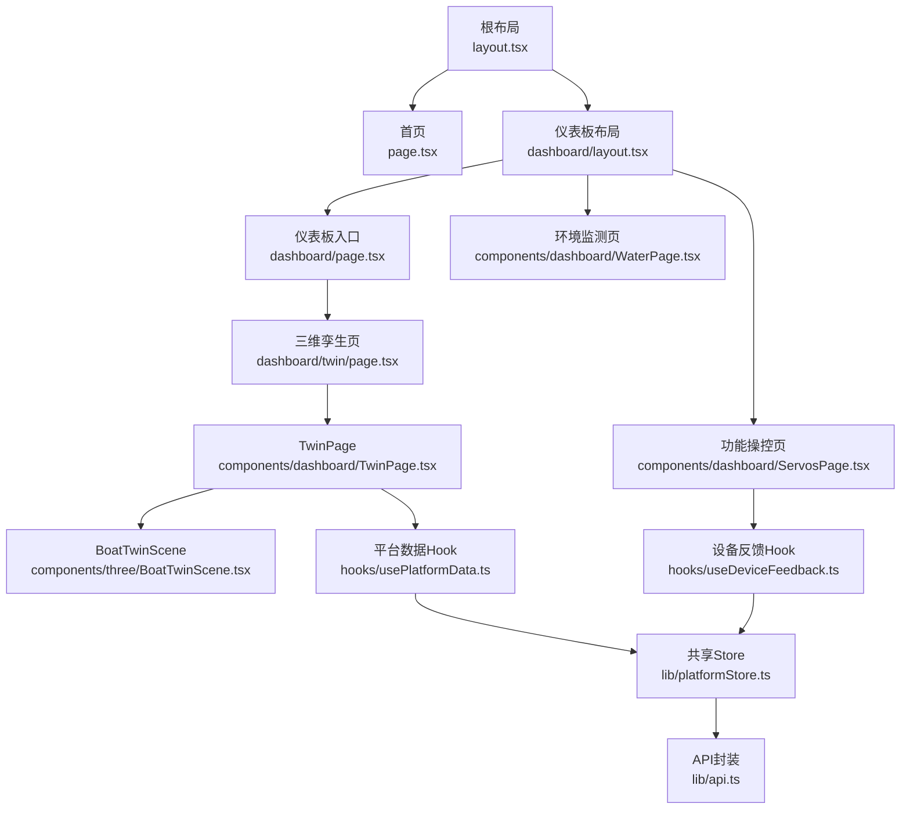
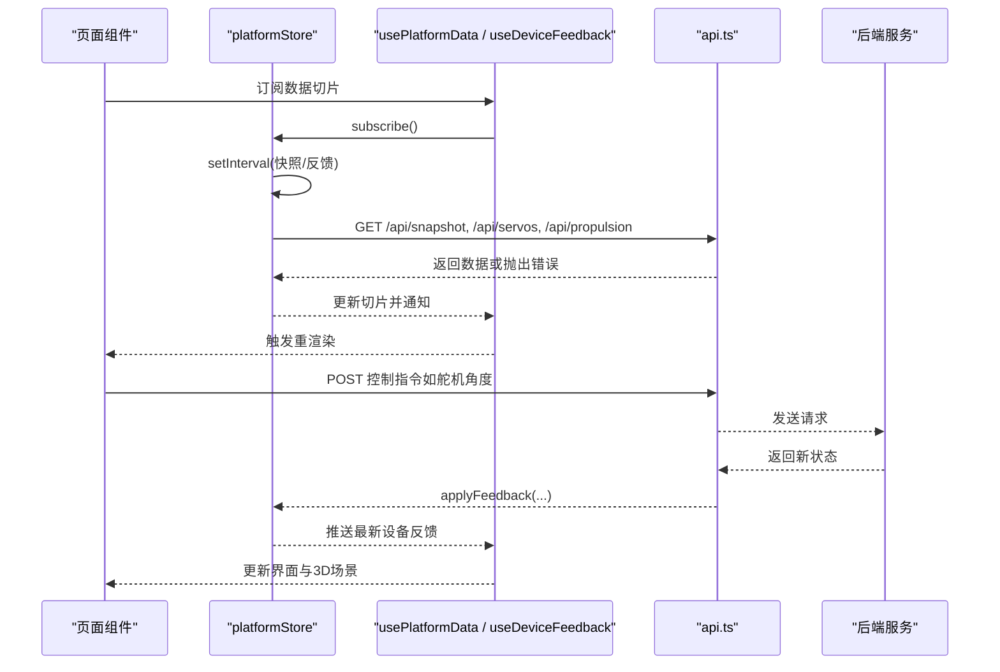
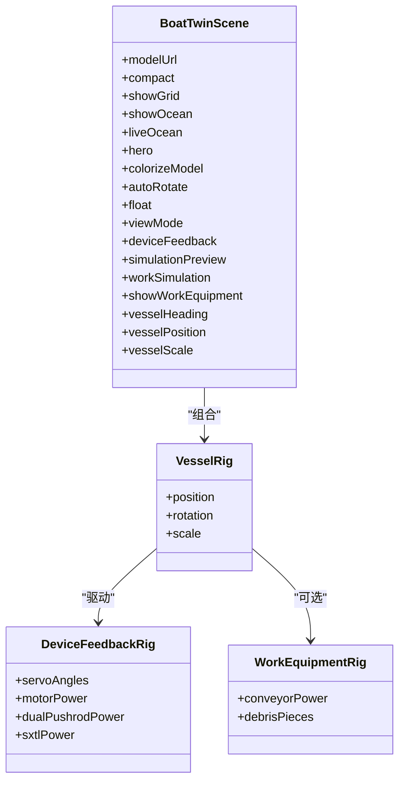
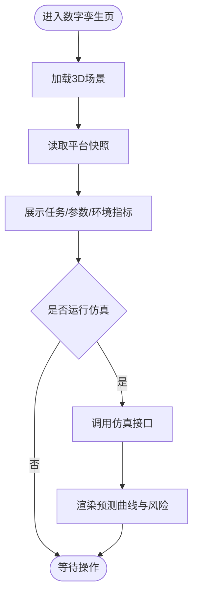
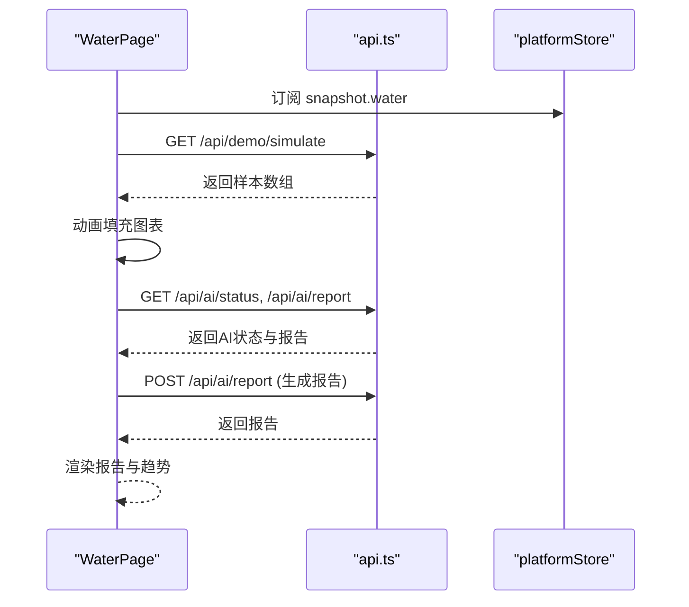
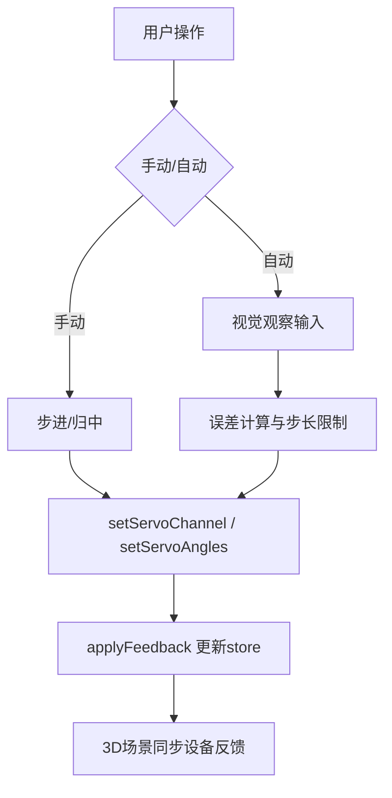
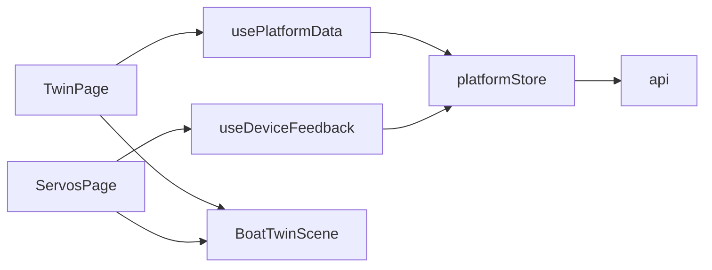

# 前端应用

<cite>
**本文引用的文件**
- [apps/frontend/src/app/layout.tsx](file://apps/frontend/src/app/layout.tsx)
- [apps/frontend/src/app/page.tsx](file://apps/frontend/src/app/page.tsx)
- [apps/frontend/src/app/dashboard/layout.tsx](file://apps/frontend/src/app/dashboard/layout.tsx)
- [apps/frontend/src/app/dashboard/page.tsx](file://apps/frontend/src/app/dashboard/page.tsx)
- [apps/frontend/src/components/dashboard/PlatformShell.tsx](file://apps/frontend/src/components/dashboard/PlatformShell.tsx)
- [apps/frontend/src/hooks/usePlatformData.ts](file://apps/frontend/src/hooks/usePlatformData.ts)
- [apps/frontend/src/hooks/useDeviceFeedback.ts](file://apps/frontend/src/hooks/useDeviceFeedback.ts)
- [apps/frontend/src/lib/platformStore.ts](file://apps/frontend/src/lib/platformStore.ts)
- [apps/frontend/src/lib/api.ts](file://apps/frontend/src/lib/api.ts)
- [apps/frontend/src/components/three/BoatTwinScene.tsx](file://apps/frontend/src/components/three/BoatTwinScene.tsx)
- [apps/frontend/src/components/dashboard/TwinPage.tsx](file://apps/frontend/src/components/dashboard/TwinPage.tsx)
- [apps/frontend/src/app/dashboard/twin/page.tsx](file://apps/frontend/src/app/dashboard/twin/page.tsx)
- [apps/frontend/src/components/dashboard/WaterPage.tsx](file://apps/frontend/src/components/dashboard/WaterPage.tsx)
- [apps/frontend/src/components/dashboard/ServosPage.tsx](file://apps/frontend/src/components/dashboard/ServosPage.tsx)
- [apps/frontend/package.json](file://apps/frontend/package.json)
</cite>

## 目录
1. [简介](#简介)
2. [项目结构](#项目结构)
3. [核心组件](#核心组件)
4. [架构总览](#架构总览)
5. [详细组件分析](#详细组件分析)
6. [依赖关系分析](#依赖关系分析)
7. [性能考量](#性能考量)
8. [故障排查指南](#故障排查指南)
9. [结论](#结论)
10. [附录](#附录)

## 简介
本前端应用基于 Next.js（App Router）与 React，构建“智慧渔业巡检船”监控与数字孪生平台。应用提供三维孪生、环境监测、功能操控、智能航行、船舶健康与日志等模块，并通过统一的设备数据总线实现全局状态同步。3D 可视化系统使用 Three.js 与 React Three Fiber/Drei，支持船模渲染、场景管理、动画效果与用户交互；Dashboard 各页面通过 Recharts 展示趋势与指标，结合 AI 报告与仿真推演辅助决策。

## 项目结构
- 路由组织：根布局定义站点元信息；首页为着陆体验；/dashboard 下以子路由划分功能模块，默认重定向至 /dashboard/twin。
- 组件分层：
  - 页面级：TwinPage、WaterPage、ServosPage 等
  - 布局壳：PlatformShell 提供侧边导航、顶部状态栏与滚动行为
  - 3D 场景：BoatTwinScene 封装模型加载、水面、设备反馈映射与动画
  - 数据层：platformStore 作为共享 store，usePlatformData/useDeviceFeedback 暴露切片给组件
  - API 层：api.ts 统一封装 REST 调用与错误处理
- 资源与依赖：Three.js、@react-three/fiber、@react-three/drei、Recharts、Leaflet、ONNX Runtime Web、TensorFlow.js 等。

**图表来源**
- [apps/frontend/src/app/layout.tsx:1-20](file://apps/frontend/src/app/layout.tsx#L1-L20)
- [apps/frontend/src/app/page.tsx:1-7](file://apps/frontend/src/app/page.tsx#L1-L7)
- [apps/frontend/src/app/dashboard/layout.tsx:1-7](file://apps/frontend/src/app/dashboard/layout.tsx#L1-L7)
- [apps/frontend/src/app/dashboard/page.tsx:1-6](file://apps/frontend/src/app/dashboard/page.tsx#L1-L6)
- [apps/frontend/src/app/dashboard/twin/page.tsx:1-6](file://apps/frontend/src/app/dashboard/twin/page.tsx#L1-L6)
- [apps/frontend/src/components/dashboard/TwinPage.tsx:1-768](file://apps/frontend/src/components/dashboard/TwinPage.tsx#L1-L768)
- [apps/frontend/src/components/three/BoatTwinScene.tsx:1-800](file://apps/frontend/src/components/three/BoatTwinScene.tsx#L1-L800)
- [apps/frontend/src/components/dashboard/WaterPage.tsx:1-612](file://apps/frontend/src/components/dashboard/WaterPage.tsx#L1-L612)
- [apps/frontend/src/components/dashboard/ServosPage.tsx:1-769](file://apps/frontend/src/components/dashboard/ServosPage.tsx#L1-L769)
- [apps/frontend/src/hooks/usePlatformData.ts:1-24](file://apps/frontend/src/hooks/usePlatformData.ts#L1-L24)
- [apps/frontend/src/hooks/useDeviceFeedback.ts:1-22](file://apps/frontend/src/hooks/useDeviceFeedback.ts#L1-L22)
- [apps/frontend/src/lib/platformStore.ts:1-196](file://apps/frontend/src/lib/platformStore.ts#L1-L196)
- [apps/frontend/src/lib/api.ts:1-101](file://apps/frontend/src/lib/api.ts#L1-L101)

**章节来源**
- [apps/frontend/src/app/layout.tsx:1-20](file://apps/frontend/src/app/layout.tsx#L1-L20)
- [apps/frontend/src/app/page.tsx:1-7](file://apps/frontend/src/app/page.tsx#L1-L7)
- [apps/frontend/src/app/dashboard/layout.tsx:1-7](file://apps/frontend/src/app/dashboard/layout.tsx#L1-L7)
- [apps/frontend/src/app/dashboard/page.tsx:1-6](file://apps/frontend/src/app/dashboard/page.tsx#L1-L6)
- [apps/frontend/package.json:1-45](file://apps/frontend/package.json#L1-L45)

## 核心组件
- PlatformShell：仪表板外壳，包含侧边导航、顶部状态栏（数据时间、在线状态）、移动端导航条与滚动头显隐逻辑。
- TwinPage：数字孪生中心，集成 3D 场景、任务概览、航行参数与环境采样数据，并提供仿真实验台。
- WaterPage：水域环境监测，含水质总览、历史趋势图、演示数据采集与 AI 分析报告。
- ServosPage：功能操控，覆盖云台控制、自动跟踪、水枪开关、电机与推杆控制，并联动 3D 设备反馈。
- BoatTwinScene：3D 场景，负责模型加载、水面着色器、设备反馈映射（舵机、电机、推杆、相机云台）、工作设备动画与轨迹尾迹。

**章节来源**
- [apps/frontend/src/components/dashboard/PlatformShell.tsx:1-189](file://apps/frontend/src/components/dashboard/PlatformShell.tsx#L1-L189)
- [apps/frontend/src/components/dashboard/TwinPage.tsx:1-768](file://apps/frontend/src/components/dashboard/TwinPage.tsx#L1-L768)
- [apps/frontend/src/components/dashboard/WaterPage.tsx:1-612](file://apps/frontend/src/components/dashboard/WaterPage.tsx#L1-L612)
- [apps/frontend/src/components/dashboard/ServosPage.tsx:1-769](file://apps/frontend/src/components/dashboard/ServosPage.tsx#L1-L769)
- [apps/frontend/src/components/three/BoatTwinScene.tsx:1-800](file://apps/frontend/src/components/three/BoatTwinScene.tsx#L1-L800)

## 架构总览
- 路由与布局：Next.js App Router 管理页面与布局；/dashboard 统一由 PlatformShell 包裹。
- 状态管理：platformStore 作为单一共享 store，使用 useSyncExternalStore 将快照与设备反馈切片暴露给各 Hook；每 2s 刷新平台快照，每 1s 刷新设备反馈。
- 通信方式：RESTful API 通过 api.ts 统一 fetchJson 封装，带超时与鉴权头；错误时设置连接状态为断开。
- 3D 可视化：BoatTwinScene 在 TwinPage 中动态导入，避免 SSR 问题；场景内使用自定义着色器实现动态水面，设备反馈驱动舵机角度、电机转速与推杆伸缩。
- 数据流：后端 → platformStore → Hooks → 页面组件；控制指令从页面 → api.ts → 后端 → 设备 → 反馈回 platformStore。

**图表来源**
- [apps/frontend/src/lib/platformStore.ts:1-196](file://apps/frontend/src/lib/platformStore.ts#L1-L196)
- [apps/frontend/src/hooks/usePlatformData.ts:1-24](file://apps/frontend/src/hooks/usePlatformData.ts#L1-L24)
- [apps/frontend/src/hooks/useDeviceFeedback.ts:1-22](file://apps/frontend/src/hooks/useDeviceFeedback.ts#L1-L22)
- [apps/frontend/src/lib/api.ts:1-101](file://apps/frontend/src/lib/api.ts#L1-L101)

## 详细组件分析

### 三维孪生系统（BoatTwinScene）
- 模型与场景：支持 GLTF 模型加载与程序化替代；内置参考尺寸与颜色映射；可切换俯视/跟随/前视视角。
- 水面与动画：自定义顶点/片段着色器实现波浪与高光；可选动态水面；支持漂浮与网格显示。
- 设备反馈映射：
  - 舵机：根据反馈角度旋转对应连杆，在线状态决定发光颜色。
  - 电机：功率驱动转子旋转，方向与速度映射到角速度。
  - 推杆：根据功率线性伸缩，支持冷却锁定与运行时保护。
  - 相机云台：俯仰/偏航角度映射，支持模拟模式与发光指示。
- 工作设备：传送带、收集箱、垃圾块动画；与电机功率联动。
- 交互：轨道控制器、全屏、视角复位；演示命令控制进度与暂停。

**图表来源**
- [apps/frontend/src/components/three/BoatTwinScene.tsx:1-800](file://apps/frontend/src/components/three/BoatTwinScene.tsx#L1-L800)

**章节来源**
- [apps/frontend/src/components/three/BoatTwinScene.tsx:1-800](file://apps/frontend/src/components/three/BoatTwinScene.tsx#L1-L800)

### 数字孪生页面（TwinPage）
- 3D 场景集成：动态导入 BoatTwinScene，配置俯视模式、动态水面与工作设备可视化。
- 任务与参数：展示任务进度、目标航点、运行状态；绘制速度与电量趋势。
- 环境采样：水温、浊度、pH 等指标卡片。
- 仿真实验台：航线预演、故障推演、疲劳损耗三种模式；调用 runTwinPrediction 获取预测结果与风险等级；结果以折线图与指标呈现。

**图表来源**
- [apps/frontend/src/components/dashboard/TwinPage.tsx:1-768](file://apps/frontend/src/components/dashboard/TwinPage.tsx#L1-L768)
- [apps/frontend/src/lib/api.ts:1-101](file://apps/frontend/src/lib/api.ts#L1-L101)

**章节来源**
- [apps/frontend/src/components/dashboard/TwinPage.tsx:1-768](file://apps/frontend/src/components/dashboard/TwinPage.tsx#L1-L768)
- [apps/frontend/src/app/dashboard/twin/page.tsx:1-6](file://apps/frontend/src/app/dashboard/twin/page.tsx#L1-L6)

### 环境监测页面（WaterPage）
- 数据源：实时 snapshot.water 或演示数据；支持 1h/6h/24h/7d 时间范围切换。
- 可视化：多轴折线图（水温、溶解氧、pH），低氧区域参考区高亮；汇总面板展示综合状态与各传感器指标。
- AI 分析：查询 AI 状态与报告；生成报告后展示风险等级、关键发现与建议；演示模式下隔离分析。
- 采集流程：点击“生成演示数据”拉取模拟样本并以动画形式填充图表。

**图表来源**
- [apps/frontend/src/components/dashboard/WaterPage.tsx:1-612](file://apps/frontend/src/components/dashboard/WaterPage.tsx#L1-L612)
- [apps/frontend/src/lib/api.ts:1-101](file://apps/frontend/src/lib/api.ts#L1-L101)

**章节来源**
- [apps/frontend/src/components/dashboard/WaterPage.tsx:1-612](file://apps/frontend/src/components/dashboard/WaterPage.tsx#L1-L612)

### 功能操控页面（ServosPage）
- 设备管理：两路舵机开发板与电机/推杆设备；在线状态与目标/实际角度展示。
- 云台控制：手动步进与归中；自动跟踪基于视觉观察（中心偏移计算、死区与稳定帧判定）；安全拦截与状态机（off/waiting/acquiring/locked/tracking/lost/error）。
- 水枪开关：开/关角度切换，失败回滚。
- 电机与推杆：旋转电机与线性推杆控制卡；支持运行时保护与方向乘数。
- 反馈同步：控制成功后通过 platformStore.applyFeedback 推送最新舵机状态，保持 3D 场景一致。

**图表来源**
- [apps/frontend/src/components/dashboard/ServosPage.tsx:1-769](file://apps/frontend/src/components/dashboard/ServosPage.tsx#L1-L769)
- [apps/frontend/src/lib/api.ts:1-101](file://apps/frontend/src/lib/api.ts#L1-L101)
- [apps/frontend/src/lib/platformStore.ts:1-196](file://apps/frontend/src/lib/platformStore.ts#L1-L196)

**章节来源**
- [apps/frontend/src/components/dashboard/ServosPage.tsx:1-769](file://apps/frontend/src/components/dashboard/ServosPage.tsx#L1-L769)

### 仪表板外壳（PlatformShell）
- 导航：桌面端侧边栏与移动端顶部导航；当前模块高亮。
- 状态栏：数据时间与后端连接状态；在线指示灯。
- 滚动行为：头部随滚动显隐，提升沉浸感。

**章节来源**
- [apps/frontend/src/components/dashboard/PlatformShell.tsx:1-189](file://apps/frontend/src/components/dashboard/PlatformShell.tsx#L1-L189)

## 依赖关系分析
- 框架与库：Next.js、React、TailwindCSS、Recharts、Leaflet、Three.js、React Three Fiber/Drei、ONNX Runtime Web、TensorFlow.js。
- 内部依赖：
  - 页面 → Hooks → platformStore → API
  - 3D 场景 → 设备反馈 → store → API
  - 控制面板 → API → store → 3D 场景

**图表来源**
- [apps/frontend/src/components/dashboard/TwinPage.tsx:1-768](file://apps/frontend/src/components/dashboard/TwinPage.tsx#L1-L768)
- [apps/frontend/src/components/dashboard/ServosPage.tsx:1-769](file://apps/frontend/src/components/dashboard/ServosPage.tsx#L1-L769)
- [apps/frontend/src/hooks/usePlatformData.ts:1-24](file://apps/frontend/src/hooks/usePlatformData.ts#L1-L24)
- [apps/frontend/src/hooks/useDeviceFeedback.ts:1-22](file://apps/frontend/src/hooks/useDeviceFeedback.ts#L1-L22)
- [apps/frontend/src/lib/platformStore.ts:1-196](file://apps/frontend/src/lib/platformStore.ts#L1-L196)
- [apps/frontend/src/lib/api.ts:1-101](file://apps/frontend/src/lib/api.ts#L1-L101)
- [apps/frontend/src/components/three/BoatTwinScene.tsx:1-800](file://apps/frontend/src/components/three/BoatTwinScene.tsx#L1-L800)

**章节来源**
- [apps/frontend/package.json:1-45](file://apps/frontend/package.json#L1-L45)

## 性能考量
- 渲染优化：
  - 3D 场景按需加载（dynamic import），避免首屏阻塞。
  - useSyncExternalStore 切片更新减少无关重渲染。
  - 水面与动画使用 requestAnimationFrame 与节流策略。
- 网络优化：
  - 快照与反馈独立定时器，降低耦合抖动。
  - fetchJson 设置 no-store 与超时，避免缓存与长时间挂起。
- 图表渲染：
  - Recharts 禁用动画以减少重绘开销；仅在可视就绪后渲染。
- 内存与生命周期：
  - 清理定时器与事件监听，防止泄漏。
  - 3D 场景组件内局部状态与引用管理，避免不必要重建。

[本节为通用指导，不直接分析具体文件]

## 故障排查指南
- 后端连接异常：
  - 现象：顶部状态显示“后端断开”，快照/反馈不再更新。
  - 排查：检查 NEXT_PUBLIC_API_BASE 与令牌配置；查看 api.ts 的 fetchJson 错误分支。
- 3D 模型加载失败：
  - 现象：场景显示占位或程序化模型。
  - 排查：确认 /models/inspection-boat.glb 路径与跨域；检查 useGLTF 加载状态。
- 设备控制失败：
  - 现象：舵机/电机指令无响应或报错。
  - 排查：确认设备在线；检查 setServoChannel/setServoAngles 返回值；查看 platformStore.applyFeedback 是否被调用。
- 自动跟踪失效：
  - 现象：跟踪状态停留在 waiting/lost。
  - 排查：检查视觉观察输入频率与稳定性阈值；确认 FOV 与误差方向配置。

**章节来源**
- [apps/frontend/src/lib/api.ts:1-101](file://apps/frontend/src/lib/api.ts#L1-L101)
- [apps/frontend/src/components/dashboard/ServosPage.tsx:1-769](file://apps/frontend/src/components/dashboard/ServosPage.tsx#L1-L769)
- [apps/frontend/src/components/three/BoatTwinScene.tsx:1-800](file://apps/frontend/src/components/three/BoatTwinScene.tsx#L1-L800)

## 结论
该前端应用以 Next.js 与 React 为核心，结合 Three.js 实现了高保真数字孪生与丰富的 Dashboard 功能。通过 platformStore 统一管理全局状态，配合 Hooks 提供细粒度数据切片，确保页面与 3D 场景的一致性。RESTful API 封装简化了前后端通信，错误处理与连接状态反馈提升了鲁棒性。未来可进一步引入 WebSocket 实时通道以降低轮询开销，并扩展更多仿真与可视化能力。

[本节为总结性内容，不直接分析具体文件]

## 附录
- 常用 Hook 使用示例路径：
  - 平台快照：[usePlatformData:1-24](file://apps/frontend/src/hooks/usePlatformData.ts#L1-L24)
  - 设备反馈：[useDeviceFeedback:1-22](file://apps/frontend/src/hooks/useDeviceFeedback.ts#L1-L22)
- 常用 API 路径：
  - 平台快照：[getPlatformSnapshot:26-28](file://apps/frontend/src/lib/api.ts#L26-L28)
  - 舵机控制：[setServoChannel / setServoAngles:56-68](file://apps/frontend/src/lib/api.ts#L56-L68)
  - 推进控制：[setPropulsionTarget:74-89](file://apps/frontend/src/lib/api.ts#L74-L89)
  - 仿真推演：[runTwinPrediction:95-100](file://apps/frontend/src/lib/api.ts#L95-L100)
- 页面入口路径：
  - 数字孪生：[dashboard/twin/page.tsx:1-6](file://apps/frontend/src/app/dashboard/twin/page.tsx#L1-L6)
  - 环境监测：[WaterPage:1-612](file://apps/frontend/src/components/dashboard/WaterPage.tsx#L1-L612)
  - 功能操控：[ServosPage:1-769](file://apps/frontend/src/components/dashboard/ServosPage.tsx#L1-L769)

[本节为索引性内容，不直接分析具体文件]