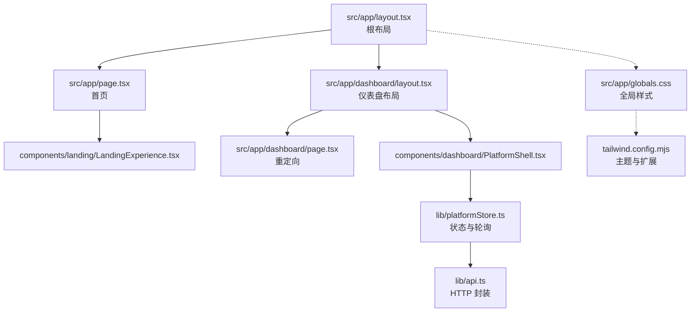
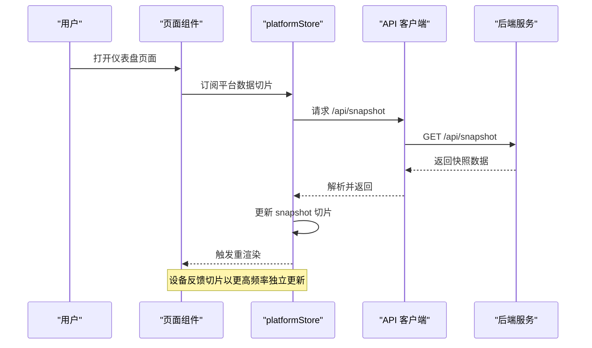
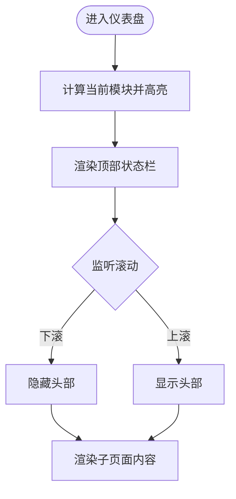
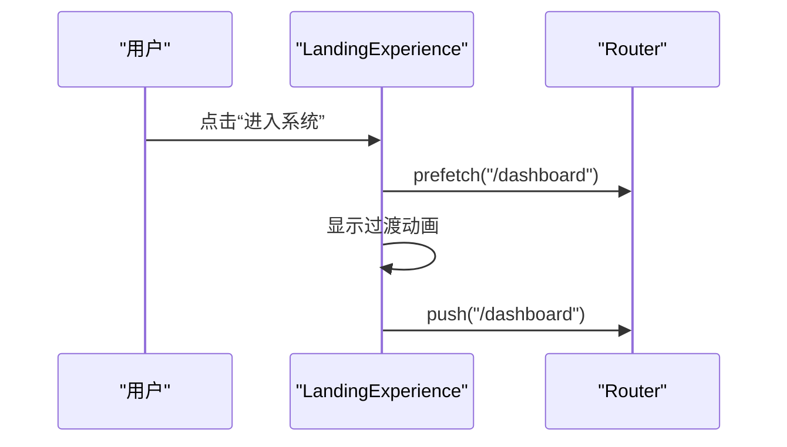
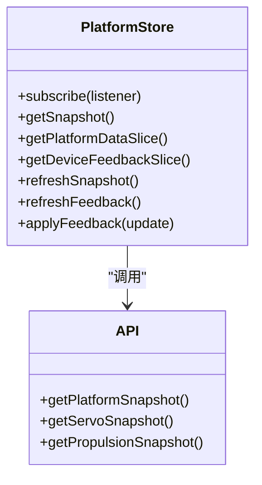
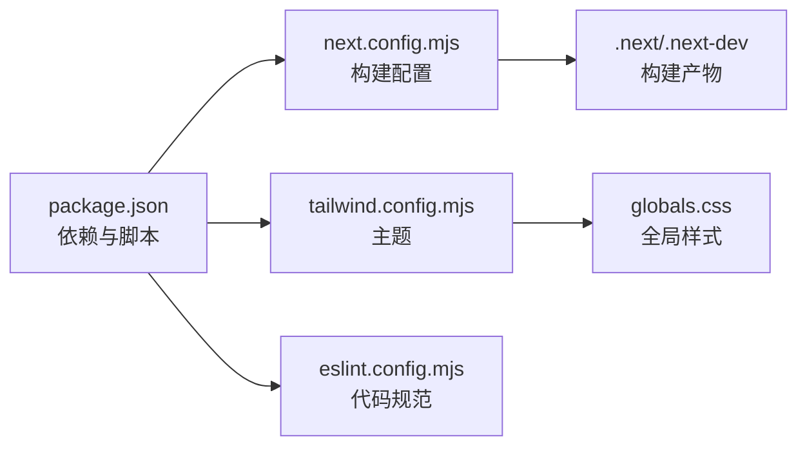

# 前端架构设计

<cite>
**本文引用的文件**
- [package.json](file://fishery-digital-twin-platform/apps/frontend/package.json)
- [next.config.mjs](file://fishery-digital-twin-platform/apps/frontend/next.config.mjs)
- [tailwind.config.mjs](file://fishery-digital-twin-platform/apps/frontend/tailwind.config.mjs)
- [postcss.config.mjs](file://fishery-digital-twin-platform/apps/frontend/postcss.config.mjs)
- [tsconfig.json](file://fishery-digital-twin-platform/apps/frontend/tsconfig.json)
- [eslint.config.mjs](file://fishery-digital-twin-platform/apps/frontend/eslint.config.mjs)
- [layout.tsx](file://fishery-digital-twin-platform/apps/frontend/src/app/layout.tsx)
- [page.tsx](file://fishery-digital-twin-platform/apps/frontend/src/app/page.tsx)
- [dashboard/layout.tsx](file://fishery-digital-twin-platform/apps/frontend/src/app/dashboard/layout.tsx)
- [dashboard/page.tsx](file://fishery-digital-twin-platform/apps/frontend/src/app/dashboard/page.tsx)
- [LandingExperience.tsx](file://fishery-digital-twin-platform/apps/frontend/src/components/landing/LandingExperience.tsx)
- [PlatformShell.tsx](file://fishery-digital-twin-platform/apps/frontend/src/components/dashboard/PlatformShell.tsx)
- [platformStore.ts](file://fishery-digital-twin-platform/apps/frontend/src/lib/platformStore.ts)
- [api.ts](file://fishery-digital-twin-platform/apps/frontend/src/lib/api.ts)
- [globals.css](file://fishery-digital-twin-platform/apps/frontend/src/app/globals.css)
</cite>

## 目录
1. [简介](#简介)
2. [项目结构](#项目结构)
3. [核心组件](#核心组件)
4. [架构总览](#架构总览)
5. [详细组件分析](#详细组件分析)
6. [依赖关系分析](#依赖关系分析)
7. [性能与优化](#性能与优化)
8. [故障排查指南](#故障排查指南)
9. [结论](#结论)
10. [附录](#附录)

## 简介
本文件面向基于 Next.js 14+（当前使用 Next 16）与 React 19 的前端应用，系统化说明整体架构、App Router 路由组织、页面布局层次、组件模块化策略，以及技术栈选择原因、构建配置与优化策略、开发环境配置与规范检查。同时给出最佳实践与扩展指导，帮助团队在数字孪生与设备监控场景中高效迭代。

## 项目结构
- 应用根入口：src/app/layout.tsx 定义全局元信息与 HTML 壳；src/app/page.tsx 为首页入口，渲染着陆体验。
- 仪表盘模块：src/app/dashboard/layout.tsx 提供平台外壳（侧边导航、顶部状态栏），dashboard/page.tsx 默认重定向到三维孪生页。
- 组件分层：
  - components/dashboard：平台外壳与业务容器组件
  - components/landing：着陆页与进入动效
  - components/three：Three.js 场景封装
  - components/map：地图相关
  - components/ui：通用 UI 原子组件
  - components/icons：图标集合
- 数据与工具：
  - lib/api.ts：统一 HTTP 客户端与后端接口封装
  - lib/platformStore.ts：基于 useSyncExternalStore 的轻量状态管理，负责定时拉取平台快照与设备反馈
  - hooks/usePlatformData.ts、hooks/useDeviceFeedback.ts：React Hook 封装，供页面订阅数据切片
- 样式体系：Tailwind CSS + PostCSS + Autoprefixer，主题色板与阴影、背景等通过 tailwind.config.mjs 扩展；全局样式在 globals.css 中引入 Leaflet 样式并设置基础样式。
- 构建与工程化：
  - next.config.mjs：输出 standalone、区分开发与生产产物目录、转译共享包
  - tsconfig.json：严格模式、路径别名 @/*、Next 插件
  - eslint.config.mjs：启用 Next Web Vitals 与 TypeScript 规则，针对 Three.js 场景放宽部分 Hooks 限制
  - package.json：脚本 dev/build/start/typecheck/lint，依赖包括 React 19、Next、Three.js、Leaflet、Recharts、Framer Motion、ONNX Runtime Web 等

图表来源
- [layout.tsx:1-20](file://fishery-digital-twin-platform/apps/frontend/src/app/layout.tsx#L1-L20)
- [page.tsx:1-7](file://fishery-digital-twin-platform/apps/frontend/src/app/page.tsx#L1-L7)
- [dashboard/layout.tsx:1-7](file://fishery-digital-twin-platform/apps/frontend/src/app/dashboard/layout.tsx#L1-L7)
- [dashboard/page.tsx:1-6](file://fishery-digital-twin-platform/apps/frontend/src/app/dashboard/page.tsx#L1-L6)
- [LandingExperience.tsx:1-144](file://fishery-digital-twin-platform/apps/frontend/src/components/landing/LandingExperience.tsx#L1-L144)
- [PlatformShell.tsx:1-189](file://fishery-digital-twin-platform/apps/frontend/src/components/dashboard/PlatformShell.tsx#L1-L189)
- [platformStore.ts:1-196](file://fishery-digital-twin-platform/apps/frontend/src/lib/platformStore.ts#L1-L196)
- [api.ts:1-101](file://fishery-digital-twin-platform/apps/frontend/src/lib/api.ts#L1-L101)
- [globals.css:1-664](file://fishery-digital-twin-platform/apps/frontend/src/app/globals.css#L1-L664)
- [tailwind.config.mjs:1-72](file://fishery-digital-twin-platform/apps/frontend/tailwind.config.mjs#L1-L72)

章节来源
- [layout.tsx:1-20](file://fishery-digital-twin-platform/apps/frontend/src/app/layout.tsx#L1-L20)
- [page.tsx:1-7](file://fishery-digital-twin-platform/apps/frontend/src/app/page.tsx#L1-L7)
- [dashboard/layout.tsx:1-7](file://fishery-digital-twin-platform/apps/frontend/src/app/dashboard/layout.tsx#L1-L7)
- [dashboard/page.tsx:1-6](file://fishery-digital-twin-platform/apps/frontend/src/app/dashboard/page.tsx#L1-L6)
- [LandingExperience.tsx:1-144](file://fishery-digital-twin-platform/apps/frontend/src/components/landing/LandingExperience.tsx#L1-L144)
- [PlatformShell.tsx:1-189](file://fishery-digital-twin-platform/apps/frontend/src/components/dashboard/PlatformShell.tsx#L1-L189)
- [platformStore.ts:1-196](file://fishery-digital-twin-platform/apps/frontend/src/lib/platformStore.ts#L1-L196)
- [api.ts:1-101](file://fishery-digital-twin-platform/apps/frontend/src/lib/api.ts#L1-L101)
- [globals.css:1-664](file://fishery-digital-twin-platform/apps/frontend/src/app/globals.css#L1-L664)
- [tailwind.config.mjs:1-72](file://fishery-digital-twin-platform/apps/frontend/tailwind.config.mjs#L1-L72)

## 核心组件
- 根布局与元信息：定义站点标题、描述与图标，注入全局样式。
- 着陆体验：动态加载 Three.js 场景，预取仪表盘路由，点击后进入系统。
- 仪表盘外壳：响应式侧边导航、顶部状态栏（数据时间、在线状态）、滚动隐藏逻辑，承载各业务子页面。
- 平台数据层：基于 useSyncExternalStore 的 store，维护平台快照与设备反馈两个稳定切片，分别以不同频率轮询，避免不必要重渲染。
- API 客户端：统一 fetch 封装，支持超时、错误处理、Token 注入，集中暴露平台快照、舵机、推进器、日志、AI 报告、孪生仿真等接口。

章节来源
- [layout.tsx:1-20](file://fishery-digital-twin-platform/apps/frontend/src/app/layout.tsx#L1-L20)
- [LandingExperience.tsx:1-144](file://fishery-digital-twin-platform/apps/frontend/src/components/landing/LandingExperience.tsx#L1-L144)
- [PlatformShell.tsx:1-189](file://fishery-digital-twin-platform/apps/frontend/src/components/dashboard/PlatformShell.tsx#L1-L189)
- [platformStore.ts:1-196](file://fishery-digital-twin-platform/apps/frontend/src/lib/platformStore.ts#L1-L196)
- [api.ts:1-101](file://fishery-digital-twin-platform/apps/frontend/src/lib/api.ts#L1-L101)

## 架构总览
- 路由与布局：采用 App Router，根 layout 提供全局 HTML 壳与元信息；dashboard 子路由通过 layout 注入 PlatformShell，实现一致的导航与状态展示。
- 数据流：页面通过 hooks 订阅 platformStore 的切片；store 定时调用 api.ts 获取后端数据，更新对应切片并通知订阅者。
- 渲染与交互：着陆页动态加载 Three.js 场景，减少首屏体积；仪表盘内嵌地图、图表、3D 场景等重型资源按需加载。
- 样式与主题：Tailwind 主题集中管理色彩、阴影、背景图；全局样式引入 Leaflet 样式并定制滚动条、滑块等细节。

图表来源
- [platformStore.ts:1-196](file://fishery-digital-twin-platform/apps/frontend/src/lib/platformStore.ts#L1-L196)
- [api.ts:1-101](file://fishery-digital-twin-platform/apps/frontend/src/lib/api.ts#L1-L101)

## 详细组件分析

### 根布局与首页
- 根布局：设置语言、平滑滚动、关闭水合警告，注入全局样式与站点元信息。
- 首页：直接渲染着陆体验组件，作为用户进入系统的入口。

章节来源
- [layout.tsx:1-20](file://fishery-digital-twin-platform/apps/frontend/src/app/layout.tsx#L1-L20)
- [page.tsx:1-7](file://fishery-digital-twin-platform/apps/frontend/src/app/page.tsx#L1-L7)

### 仪表盘布局与外壳
- 布局：将 children 包裹在 PlatformShell 中，确保所有仪表盘页面共享一致的外壳。
- 外壳：
  - 左侧导航：根据当前路径高亮，移动端提供横向导航条
  - 顶部状态栏：显示数据更新时间、在线状态
  - 滚动行为：向下滚动时隐藏头部，向上滚动时恢复
  - 响应式：大屏网格布局，小屏自适应

图表来源
- [PlatformShell.tsx:1-189](file://fishery-digital-twin-platform/apps/frontend/src/components/dashboard/PlatformShell.tsx#L1-L189)

章节来源
- [dashboard/layout.tsx:1-7](file://fishery-digital-twin-platform/apps/frontend/src/app/dashboard/layout.tsx#L1-L7)
- [dashboard/page.tsx:1-6](file://fishery-digital-twin-platform/apps/frontend/src/app/dashboard/page.tsx#L1-L6)
- [PlatformShell.tsx:1-189](file://fishery-digital-twin-platform/apps/frontend/src/components/dashboard/PlatformShell.tsx#L1-L189)

### 着陆体验与进入流程
- 动态加载 Three.js 场景，避免首屏阻塞
- 预取仪表盘路由，提升进入速度
- 点击“进入系统”后显示过渡动画并跳转

图表来源
- [LandingExperience.tsx:1-144](file://fishery-digital-twin-platform/apps/frontend/src/components/landing/LandingExperience.tsx#L1-L144)

章节来源
- [LandingExperience.tsx:1-144](file://fishery-digital-twin-platform/apps/frontend/src/components/landing/LandingExperience.tsx#L1-L144)

### 平台数据层与状态切片
- 双切片设计：
  - 平台数据切片：包含快照与连接状态，用于仪表板概览
  - 设备反馈切片：包含舵机与推进器数据，高频更新
- 轮询策略：快照每 2 秒刷新，设备反馈每 1 秒刷新，避免频繁重渲染影响性能
- 水合一致性：服务端与客户端使用确定性初始快照，防止 hydration mismatch
- 生命周期：首次订阅启动轮询，无订阅时停止定时器，避免内存泄漏

图表来源
- [platformStore.ts:1-196](file://fishery-digital-twin-platform/apps/frontend/src/lib/platformStore.ts#L1-L196)
- [api.ts:1-101](file://fishery-digital-twin-platform/apps/frontend/src/lib/api.ts#L1-L101)

章节来源
- [platformStore.ts:1-196](file://fishery-digital-twin-platform/apps/frontend/src/lib/platformStore.ts#L1-L196)
- [api.ts:1-101](file://fishery-digital-twin-platform/apps/frontend/src/lib/api.ts#L1-L101)

### 样式与主题
- Tailwind 主题：定义 app、ink、harbor、mist、sage、sand、ocean 等语义化颜色，扩展阴影与背景图
- PostCSS：直接传递已解析的配置对象，避免 Turbopack 下 ESM 配置重载问题
- 全局样式：引入 Leaflet 样式，定制滚动条、滑块、动画与响应式断点

章节来源
- [tailwind.config.mjs:1-72](file://fishery-digital-twin-platform/apps/frontend/tailwind.config.mjs#L1-L72)
- [postcss.config.mjs:1-12](file://fishery-digital-twin-platform/apps/frontend/postcss.config.mjs#L1-L12)
- [globals.css:1-664](file://fishery-digital-twin-platform/apps/frontend/src/app/globals.css#L1-L664)

## 依赖关系分析
- 运行时依赖：Next、React 19、Three.js、Leaflet、Recharts、Framer Motion、ONNX Runtime Web、@react-three/fiber/drei、TensorFlow JS 等
- 开发依赖：TypeScript、ESLint（Next Web Vitals + TypeScript 规则）、PostCSS、Autoprefixer、Tailwind CSS
- 构建配置：
  - distDir：开发使用 .next-dev，生产使用 .next，避免缓存混用
  - output：standalone，便于部署
  - transpilePackages：转译共享包 @fishery/shared
  - outputFileTracingRoot：指向工作区根，保证产物追踪正确

图表来源
- [package.json:1-45](file://fishery-digital-twin-platform/apps/frontend/package.json#L1-L45)
- [next.config.mjs:1-18](file://fishery-digital-twin-platform/apps/frontend/next.config.mjs#L1-L18)
- [tailwind.config.mjs:1-72](file://fishery-digital-twin-platform/apps/frontend/tailwind.config.mjs#L1-L72)
- [eslint.config.mjs:1-19](file://fishery-digital-twin-platform/apps/frontend/eslint.config.mjs#L1-L19)
- [globals.css:1-664](file://fishery-digital-twin-platform/apps/frontend/src/app/globals.css#L1-L664)

章节来源
- [package.json:1-45](file://fishery-digital-twin-platform/apps/frontend/package.json#L1-L45)
- [next.config.mjs:1-18](file://fishery-digital-twin-platform/apps/frontend/next.config.mjs#L1-L18)
- [tailwind.config.mjs:1-72](file://fishery-digital-twin-platform/apps/frontend/tailwind.config.mjs#L1-L72)
- [eslint.config.mjs:1-19](file://fishery-digital-twin-platform/apps/frontend/eslint.config.mjs#L1-L19)

## 性能与优化
- 代码分割与懒加载
  - 使用 next/dynamic 动态导入 Three.js 场景，ssr: false，避免服务端渲染开销
  - 仪表盘子模块按路由拆分，减少首屏体积
- 资源优化
  - 图片使用 next/image，静态资源置于 public 目录
  - 地图与图表按需加载，避免一次性引入全部库
- 网络与状态
  - 平台快照与设备反馈分片轮询，降低无关重渲染
  - 请求超时与错误处理，提升鲁棒性
- 构建与部署
  - 分离开发/生产产物目录，避免缓存污染
  - standalone 输出便于容器化部署
- 可观测性与监控
  - 可通过 Next Core Web Vitals ESLint 规则辅助识别性能问题
  - 建议在关键页面埋点采集 FCP、LCP、CLS 等指标

[本节为通用指导，不直接分析具体文件]

## 故障排查指南
- 常见问题定位
  - 水合不一致：确认平台数据初始快照在服务端与客户端一致，避免 Date.now 导致差异
  - 轮询未停止：检查订阅计数归零时是否清理定时器
  - 样式异常：确认 PostCSS 配置直接传递对象，避免 ESM 重载导致 undefined
  - 构建产物错乱：确认 distDir 区分开发与生产，避免 webpack-runtime 指向错误 chunk
- 调试建议
  - 使用浏览器开发者工具观察网络请求与状态更新
  - 通过 ESLint 规则快速发现潜在问题
  - 在关键函数添加日志或断点，跟踪数据流

章节来源
- [platformStore.ts:1-196](file://fishery-digital-twin-platform/apps/frontend/src/lib/platformStore.ts#L1-L196)
- [postcss.config.mjs:1-12](file://fishery-digital-twin-platform/apps/frontend/postcss.config.mjs#L1-L12)
- [next.config.mjs:1-18](file://fishery-digital-twin-platform/apps/frontend/next.config.mjs#L1-L18)
- [eslint.config.mjs:1-19](file://fishery-digital-twin-platform/apps/frontend/eslint.config.mjs#L1-L19)

## 结论
本项目采用 Next.js App Router 与 React 19，结合 Tailwind CSS、Three.js、Leaflet、Recharts 等技术栈，构建了面向智慧渔业巡检的数字孪生前端。通过稳定的状态切片与分频轮询、动态加载与代码分割、严格的类型与规范检查，实现了高性能、可维护、可扩展的架构。后续可在可视化、模型推理、多端适配等方面持续演进。

[本节为总结性内容，不直接分析具体文件]

## 附录
- 技术栈选择理由
  - Next.js：内置路由、SSR/CSR 灵活切换、构建优化与生态完善
  - React 19：最新特性与性能改进，配合 Next 良好兼容
  - TypeScript：类型安全与更好的开发体验
  - Tailwind CSS：原子化样式、主题扩展便捷、构建时裁剪无用样式
- 开发环境配置
  - 热重载：dev 脚本启用 Next 开发服务器，支持 Fast Refresh
  - 调试：浏览器 DevTools、React DevTools、Next 内置诊断
  - 代码规范：ESLint 集成 Next Web Vitals 与 TypeScript 规则
- 最佳实践与扩展
  - 页面按功能域划分，复用 PlatformShell 保持一致体验
  - 新增模块遵循路由即页面的约定，合理拆分组件与数据层
  - 对重型资源采用动态导入与懒加载，控制首屏体积
  - 使用统一的 API 客户端与错误处理，保持接口风格一致

[本节为通用指导，不直接分析具体文件]