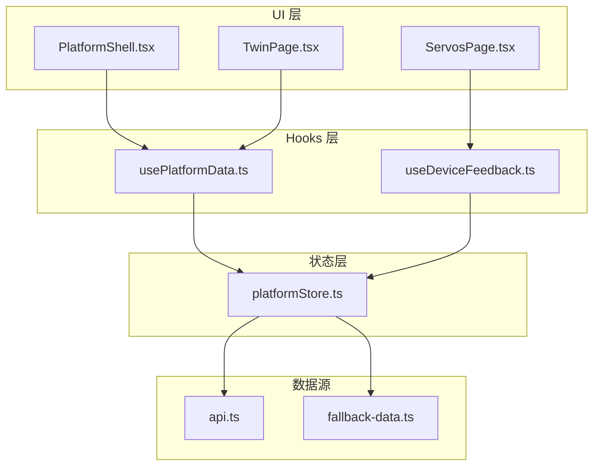
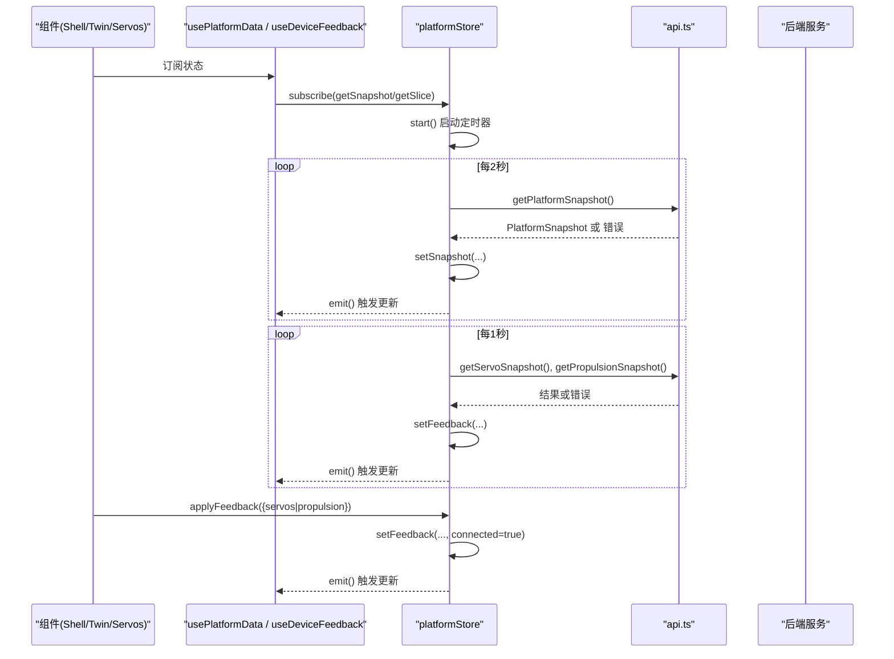
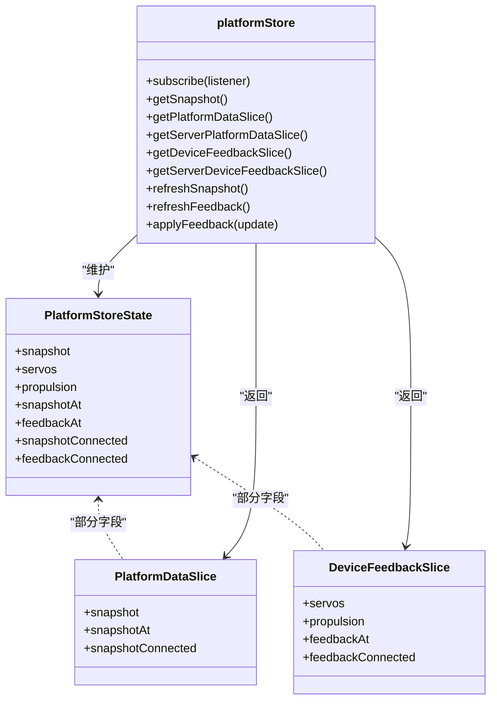
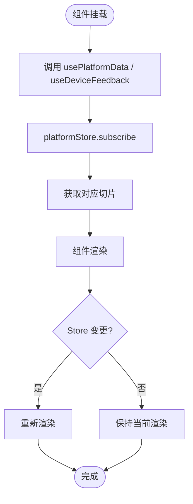
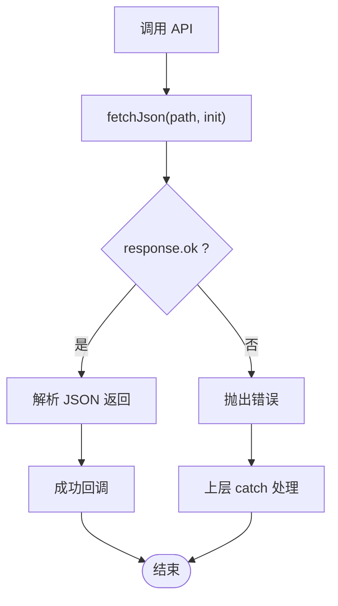
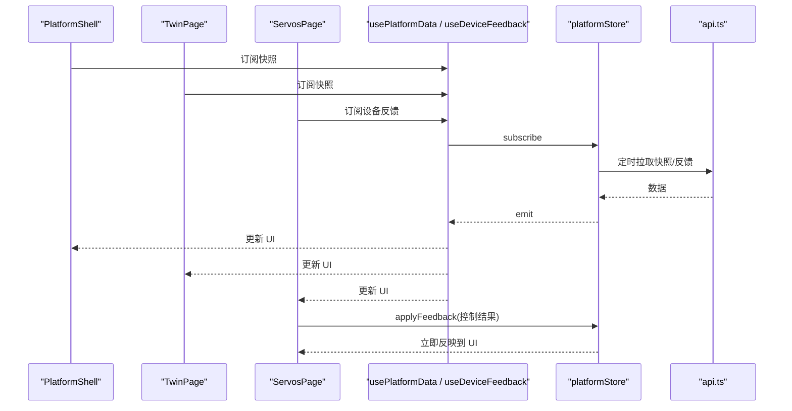
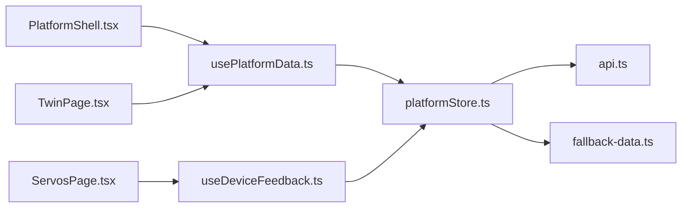

# 状态管理

<cite>
**本文引用的文件**
- [platformStore.ts](file://fishery-digital-twin-platform/apps/frontend/src/lib/platformStore.ts)
- [usePlatformData.ts](file://fishery-digital-twin-platform/apps/frontend/src/hooks/usePlatformData.ts)
- [useDeviceFeedback.ts](file://fishery-digital-twin-platform/apps/frontend/src/hooks/useDeviceFeedback.ts)
- [api.ts](file://fishery-digital-twin-platform/apps/frontend/src/lib/api.ts)
- [fallback-data.ts](file://fishery-digital-twin-platform/apps/frontend/src/lib/fallback-data.ts)
- [PlatformShell.tsx](file://fishery-digital-twin-platform/apps/frontend/src/components/dashboard/PlatformShell.tsx)
- [TwinPage.tsx](file://fishery-digital-twin-platform/apps/frontend/src/components/dashboard/TwinPage.tsx)
- [ServosPage.tsx](file://fishery-digital-twin-platform/apps/frontend/src/components/dashboard/ServosPage.tsx)
</cite>

## 目录
1. [简介](#简介)
2. [项目结构](#项目结构)
3. [核心组件](#核心组件)
4. [架构总览](#架构总览)
5. [详细组件分析](#详细组件分析)
6. [依赖关系分析](#依赖关系分析)
7. [性能考量](#性能考量)
8. [故障排查指南](#故障排查指南)
9. [结论](#结论)
10. [附录](#附录)

## 简介
本文件面向前端应用的状态管理，系统性阐述全局状态方案、数据流设计、自定义 Hooks 的使用方式、状态同步机制（实时刷新、本地缓存与持久化策略）、异步数据处理（API 调用、错误处理与重试）以及最佳实践与性能优化建议。该方案以单一共享 Store 为核心，通过 React useSyncExternalStore 将平台快照与设备反馈解耦为两个稳定切片，确保多模块间数据一致且渲染高效。

## 项目结构
前端状态管理相关代码主要分布在以下位置：
- 全局 Store：apps/frontend/src/lib/platformStore.ts
- 自定义 Hooks：apps/frontend/src/hooks/usePlatformData.ts、apps/frontend/src/hooks/useDeviceFeedback.ts
- API 层：apps/frontend/src/lib/api.ts
- 初始/回退数据：apps/frontend/src/lib/fallback-data.ts
- 使用示例页面：apps/frontend/src/components/dashboard/PlatformShell.tsx、TwinPage.tsx、ServosPage.tsx

图表来源
- [platformStore.ts:1-196](file://fishery-digital-twin-platform/apps/frontend/src/lib/platformStore.ts#L1-L196)
- [usePlatformData.ts:1-24](file://fishery-digital-twin-platform/apps/frontend/src/hooks/usePlatformData.ts#L1-L24)
- [useDeviceFeedback.ts:1-22](file://fishery-digital-twin-platform/apps/frontend/src/hooks/useDeviceFeedback.ts#L1-L22)
- [api.ts:1-101](file://fishery-digital-twin-platform/apps/frontend/src/lib/api.ts#L1-L101)
- [fallback-data.ts:1-164](file://fishery-digital-twin-platform/apps/frontend/src/lib/fallback-data.ts#L1-L164)

章节来源
- [platformStore.ts:1-196](file://fishery-digital-twin-platform/apps/frontend/src/lib/platformStore.ts#L1-L196)
- [usePlatformData.ts:1-24](file://fishery-digital-twin-platform/apps/frontend/src/hooks/usePlatformData.ts#L1-L24)
- [useDeviceFeedback.ts:1-22](file://fishery-digital-twin-platform/apps/frontend/src/hooks/useDeviceFeedback.ts#L1-L22)
- [api.ts:1-101](file://fishery-digital-twin-platform/apps/frontend/src/lib/api.ts#L1-L101)
- [fallback-data.ts:1-164](file://fishery-digital-twin-platform/apps/frontend/src/lib/fallback-data.ts#L1-L164)
- [PlatformShell.tsx:1-189](file://fishery-digital-twin-platform/apps/frontend/src/components/dashboard/PlatformShell.tsx#L1-L189)
- [TwinPage.tsx:1-768](file://fishery-digital-twin-platform/apps/frontend/src/components/dashboard/TwinPage.tsx#L1-L768)
- [ServosPage.tsx:1-769](file://fishery-digital-twin-platform/apps/frontend/src/components/dashboard/ServosPage.tsx#L1-L769)

## 核心组件
- platformStore：集中式全局状态容器，维护平台快照与设备反馈两类数据，提供订阅、获取切片、刷新与手动应用反馈等能力。
- usePlatformData：基于 useSyncExternalStore 的 Hook，读取“平台快照”切片，暴露 snapshot、更新时间、加载与连接状态。
- useDeviceFeedback：基于 useSyncExternalStore 的 Hook，读取“设备反馈”切片，暴露舵机与推进器数据、连接状态与更新时间。
- api：统一的网络请求封装，负责调用后端接口并处理超时与错误。
- fallback-data：生成确定性初始快照，用于服务端渲染与客户端首次水合，避免 hydration mismatch。

章节来源
- [platformStore.ts:1-196](file://fishery-digital-twin-platform/apps/frontend/src/lib/platformStore.ts#L1-L196)
- [usePlatformData.ts:1-24](file://fishery-digital-twin-platform/apps/frontend/src/hooks/usePlatformData.ts#L1-L24)
- [useDeviceFeedback.ts:1-22](file://fishery-digital-twin-platform/apps/frontend/src/hooks/useDeviceFeedback.ts#L1-L22)
- [api.ts:1-101](file://fishery-digital-twin-platform/apps/frontend/src/lib/api.ts#L1-L101)
- [fallback-data.ts:1-164](file://fishery-digital-twin-platform/apps/frontend/src/lib/fallback-data.ts#L1-L164)

## 架构总览
整体采用“单例 Store + 切片订阅 + 定时轮询”的模式：
- Store 内部维护两份稳定切片：平台快照切片与设备反馈切片。
- 通过 useSyncExternalStore 在组件中订阅对应切片，React 使用 Object.is 比较引用，避免不必要的重渲染。
- 定时器驱动数据刷新：平台快照每 2000ms 刷新一次；设备反馈每 1000ms 刷新一次。
- 网络请求失败时更新连接状态，UI 可据此显示“后端断开”或离线提示。
- 用户操作（如控制舵机）通过 applyFeedback 直接写入 Store，实现即时 UI 响应。

图表来源
- [platformStore.ts:98-139](file://fishery-digital-twin-platform/apps/frontend/src/lib/platformStore.ts#L98-L139)
- [platformStore.ts:150-183](file://fishery-digital-twin-platform/apps/frontend/src/lib/platformStore.ts#L150-L183)
- [usePlatformData.ts:10-16](file://fishery-digital-twin-platform/apps/frontend/src/hooks/usePlatformData.ts#L10-L16)
- [useDeviceFeedback.ts:10-14](file://fishery-digital-twin-platform/apps/frontend/src/hooks/useDeviceFeedback.ts#L10-L14)
- [api.ts:26-72](file://fishery-digital-twin-platform/apps/frontend/src/lib/api.ts#L26-L72)

## 详细组件分析

### platformStore 设计与状态组织
- 状态结构：包含 snapshot、servos、propulsion、snapshotAt、feedbackAt、snapshotConnected、feedbackConnected。
- 切片隔离：
  - 平台快照切片：仅包含 snapshot、snapshotAt、snapshotConnected，避免设备反馈变化导致快照页面重渲染。
  - 设备反馈切片：仅包含 servos、propulsion、feedbackAt、feedbackConnected，避免快照变化影响设备控制页。
- 服务器端与客户端一致性：
  - 使用确定性初始快照 createSnapshot()，保证 SSR 与客户端首次水合一致。
  - 提供 serverPlatformDataSlice 与 serverDeviceFeedbackSlice 作为服务端初始值。
- 生命周期管理：
  - refCount 计数：subscribe 增加引用，stop 减少引用，当无订阅者时停止定时器，节省资源。
  - 并发保护：refreshSnapshot 与 refreshFeedback 使用 Promise 变量防止重复请求。
- 错误与连接状态：
  - 请求失败时设置 snapshotConnected/feedbackConnected 为 false，UI 可据此降级展示。
- 手动反馈注入：
  - applyFeedback 允许组件在成功下发指令后立刻更新 Store，提升交互响应性。

图表来源
- [platformStore.ts:7-18](file://fishery-digital-twin-platform/apps/frontend/src/lib/platformStore.ts#L7-L18)
- [platformStore.ts:185-195](file://fishery-digital-twin-platform/apps/frontend/src/lib/platformStore.ts#L185-L195)

章节来源
- [platformStore.ts:23-66](file://fishery-digital-twin-platform/apps/frontend/src/lib/platformStore.ts#L23-L66)
- [platformStore.ts:71-96](file://fishery-digital-twin-platform/apps/frontend/src/lib/platformStore.ts#L71-L96)
- [platformStore.ts:98-139](file://fishery-digital-twin-platform/apps/frontend/src/lib/platformStore.ts#L98-L139)
- [platformStore.ts:150-183](file://fishery-digital-twin-platform/apps/frontend/src/lib/platformStore.ts#L150-L183)

### usePlatformData 与 useDeviceFeedback 的使用
- usePlatformData：
  - 订阅平台快照切片，暴露 snapshot、updatedAt、loading、connected。
  - 适用于需要展示平台级数据的页面，如数字孪生、环境监测、健康页等。
- useDeviceFeedback：
  - 订阅设备反馈切片，暴露 servos、propulsion、connected、updatedAt。
  - 适用于设备控制页面，如功能操控页中的云台与水枪控制。

图表来源
- [usePlatformData.ts:10-16](file://fishery-digital-twin-platform/apps/frontend/src/hooks/usePlatformData.ts#L10-L16)
- [useDeviceFeedback.ts:10-14](file://fishery-digital-twin-platform/apps/frontend/src/hooks/useDeviceFeedback.ts#L10-L14)
- [platformStore.ts:150-179](file://fishery-digital-twin-platform/apps/frontend/src/lib/platformStore.ts#L150-L179)

章节来源
- [usePlatformData.ts:1-24](file://fishery-digital-twin-platform/apps/frontend/src/hooks/usePlatformData.ts#L1-L24)
- [useDeviceFeedback.ts:1-22](file://fishery-digital-twin-platform/apps/frontend/src/hooks/useDeviceFeedback.ts#L1-L22)

### 状态同步机制
- 实时数据更新：
  - 定时器驱动：平台快照每 2000ms 刷新，设备反馈每 1000ms 刷新。
  - 并发保护：同一时刻只允许一个刷新请求进行中，避免重复网络开销。
- 本地缓存与持久化：
  - 当前实现未使用 localStorage/sessionStorage 进行持久化；所有状态由 Store 内存维护。
  - 若需持久化，建议在 setSnapshot/setFeedback 成功后将关键状态序列化到本地存储，并在应用启动时恢复。
- 状态持久化策略建议：
  - 对 snapshot 与 feedback 做增量保存，避免频繁写盘。
  - 结合版本号或时间戳判断是否恢复，避免脏数据覆盖。
  - 注意敏感信息不应落盘。

章节来源
- [platformStore.ts:20-21](file://fishery-digital-twin-platform/apps/frontend/src/lib/platformStore.ts#L20-L21)
- [platformStore.ts:98-139](file://fishery-digital-twin-platform/apps/frontend/src/lib/platformStore.ts#L98-L139)
- [platformStore.ts:150-159](file://fishery-digital-twin-platform/apps/frontend/src/lib/platformStore.ts#L150-L159)

### 异步数据处理策略
- API 调用：
  - 统一 fetchJson 封装，设置 no-store 缓存与超时信号，附加认证头。
  - 非 2xx 响应抛出错误，便于上层捕获与降级。
- 错误处理：
  - 刷新失败时更新连接状态，UI 显示“后端断开”。
  - 组件内（如 TwinPage、ServosPage）对业务 API 调用进行 try/catch，展示友好错误信息。
- 重试机制：
  - 当前未实现指数退避或重试队列；可通过包装 fetchJson 增加重试逻辑。
  - 建议：对关键接口（如 snapshot、servos、propulsion）增加最大重试次数与退避策略。

图表来源
- [api.ts:6-24](file://fishery-digital-twin-platform/apps/frontend/src/lib/api.ts#L6-L24)
- [api.ts:26-72](file://fishery-digital-twin-platform/apps/frontend/src/lib/api.ts#L26-L72)
- [TwinPage.tsx:67-78](file://fishery-digital-twin-platform/apps/frontend/src/components/dashboard/TwinPage.tsx#L67-L78)
- [ServosPage.tsx:307-320](file://fishery-digital-twin-platform/apps/frontend/src/components/dashboard/ServosPage.tsx#L307-L320)

章节来源
- [api.ts:1-101](file://fishery-digital-twin-platform/apps/frontend/src/lib/api.ts#L1-L101)
- [TwinPage.tsx:67-78](file://fishery-digital-twin-platform/apps/frontend/src/components/dashboard/TwinPage.tsx#L67-L78)
- [ServosPage.tsx:307-320](file://fishery-digital-twin-platform/apps/frontend/src/components/dashboard/ServosPage.tsx#L307-L320)

### 使用示例与数据流
- PlatformShell：
  - 使用 usePlatformData 获取 snapshot、更新时间、加载与连接状态，用于顶部状态栏显示。
- TwinPage：
  - 使用 usePlatformData 获取环境采样数据与导航信息，用于数字孪生场景展示与仿真输入。
- ServosPage：
  - 使用 useDeviceFeedback 获取舵机与推进器数据，用于控制面板显示与自动跟踪控制。
  - 控制指令成功后通过 platformStore.applyFeedback 立即更新 Store，提升交互体验。

图表来源
- [PlatformShell.tsx:27-35](file://fishery-digital-twin-platform/apps/frontend/src/components/dashboard/PlatformShell.tsx#L27-L35)
- [TwinPage.tsx:24-26](file://fishery-digital-twin-platform/apps/frontend/src/components/dashboard/TwinPage.tsx#L24-L26)
- [ServosPage.tsx:111-113](file://fishery-digital-twin-platform/apps/frontend/src/components/dashboard/ServosPage.tsx#L111-L113)
- [platformStore.ts:181-183](file://fishery-digital-twin-platform/apps/frontend/src/lib/platformStore.ts#L181-L183)

章节来源
- [PlatformShell.tsx:1-189](file://fishery-digital-twin-platform/apps/frontend/src/components/dashboard/PlatformShell.tsx#L1-L189)
- [TwinPage.tsx:1-768](file://fishery-digital-twin-platform/apps/frontend/src/components/dashboard/TwinPage.tsx#L1-L768)
- [ServosPage.tsx:1-769](file://fishery-digital-twin-platform/apps/frontend/src/components/dashboard/ServosPage.tsx#L1-L769)

## 依赖关系分析
- 组件依赖 Hooks：
  - PlatformShell、TwinPage 依赖 usePlatformData。
  - ServosPage 依赖 useDeviceFeedback。
- Hooks 依赖 Store：
  - 两者均通过 useSyncExternalStore 订阅 platformStore。
- Store 依赖 API 与回退数据：
  - 定时刷新调用 api.ts 中的接口。
  - 初始快照来自 fallback-data.ts 的 createSnapshot。

图表来源
- [PlatformShell.tsx:7-35](file://fishery-digital-twin-platform/apps/frontend/src/components/dashboard/PlatformShell.tsx#L7-L35)
- [TwinPage.tsx:9-26](file://fishery-digital-twin-platform/apps/frontend/src/components/dashboard/TwinPage.tsx#L9-L26)
- [ServosPage.tsx:6-113](file://fishery-digital-twin-platform/apps/frontend/src/components/dashboard/ServosPage.tsx#L6-L113)
- [platformStore.ts:1-196](file://fishery-digital-twin-platform/apps/frontend/src/lib/platformStore.ts#L1-L196)
- [api.ts:1-101](file://fishery-digital-twin-platform/apps/frontend/src/lib/api.ts#L1-L101)
- [fallback-data.ts:1-164](file://fishery-digital-twin-platform/apps/frontend/src/lib/fallback-data.ts#L1-L164)

章节来源
- [PlatformShell.tsx:1-189](file://fishery-digital-twin-platform/apps/frontend/src/components/dashboard/PlatformShell.tsx#L1-L189)
- [TwinPage.tsx:1-768](file://fishery-digital-twin-platform/apps/frontend/src/components/dashboard/TwinPage.tsx#L1-L768)
- [ServosPage.tsx:1-769](file://fishery-digital-twin-platform/apps/frontend/src/components/dashboard/ServosPage.tsx#L1-L769)
- [platformStore.ts:1-196](file://fishery-digital-twin-platform/apps/frontend/src/lib/platformStore.ts#L1-L196)
- [api.ts:1-101](file://fishery-digital-twin-platform/apps/frontend/src/lib/api.ts#L1-L101)
- [fallback-data.ts:1-164](file://fishery-digital-twin-platform/apps/frontend/src/lib/fallback-data.ts#L1-L164)

## 性能考量
- 切片隔离减少重渲染：
  - 平台快照与设备反馈分属不同切片，useSyncExternalStore 使用 Object.is 比较引用，避免无关更新导致的组件重渲染。
- 定时器节流：
  - 固定间隔刷新，避免高频网络请求与渲染压力。
- 并发保护：
  - 刷新函数使用 Promise 变量防止重复请求。
- 资源释放：
  - 无订阅者时停止定时器，降低内存与 CPU 占用。
- 建议优化：
  - 对大对象（如 water 数组）考虑分页或按需加载。
  - 对高频反馈（如 servos/propulsion）考虑合并更新或使用 Web Worker 处理计算密集型逻辑。
  - 引入本地缓存与断线续传，提升弱网体验。

[本节为通用性能指导，不直接分析具体文件]

## 故障排查指南
- 后端断开：
  - 现象：顶部状态显示“后端断开”，snapshotConnected 或 feedbackConnected 为 false。
  - 排查：检查 apiBase 配置、网络连通性与鉴权令牌。
- 数据不更新：
  - 现象：页面长时间无刷新。
  - 排查：确认 store 已启动（refCount > 0），定时器未被清理；检查浏览器控制台是否有异常。
- 控制指令无效：
  - 现象：舵机/推进器控制后 UI 未变化。
  - 排查：确认 applyFeedback 被调用且返回值正确；检查 API 是否返回最新状态。
- 仿真报错：
  - 现象：TwinPage 运行仿真失败。
  - 排查：查看 catch 分支的错误信息；检查 runTwinPrediction 接口可用性。

章节来源
- [PlatformShell.tsx:127-130](file://fishery-digital-twin-platform/apps/frontend/src/components/dashboard/PlatformShell.tsx#L127-L130)
- [platformStore.ts:98-114](file://fishery-digital-twin-platform/apps/frontend/src/lib/platformStore.ts#L98-L114)
- [ServosPage.tsx:307-320](file://fishery-digital-twin-platform/apps/frontend/src/components/dashboard/ServosPage.tsx#L307-L320)
- [TwinPage.tsx:67-78](file://fishery-digital-twin-platform/apps/frontend/src/components/dashboard/TwinPage.tsx#L67-L78)

## 结论
该状态管理方案以单一 Store 为核心，通过切片订阅与 useSyncExternalStore 实现了高内聚、低耦合的全局状态管理。平台快照与设备反馈解耦，既保证了多模块数据一致性，又提升了渲染性能。定时刷新与并发保护确保了稳定性，错误处理与连接状态为 UI 提供了良好的降级体验。未来可在本地缓存、重试机制与大数据量优化方面进一步增强。

[本节为总结性内容，不直接分析具体文件]

## 附录
- 最佳实践
  - 使用切片订阅，避免全量状态更新引发的重渲染。
  - 对用户操作结果立即 applyFeedback，提升交互响应性。
  - 对关键接口增加重试与退避策略，增强鲁棒性。
  - 对敏感数据避免持久化，必要时加密存储。
  - 合理设置刷新频率，平衡实时性与性能。
- 扩展建议
  - 引入本地缓存层（如 IndexedDB）实现离线可用。
  - 增加状态版本管理与迁移脚本，支持平滑升级。
  - 对高频反馈数据采用差分更新，减少传输体积。

[本节为通用指导，不直接分析具体文件]