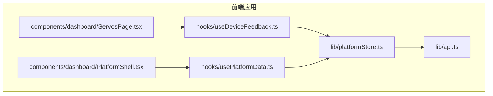
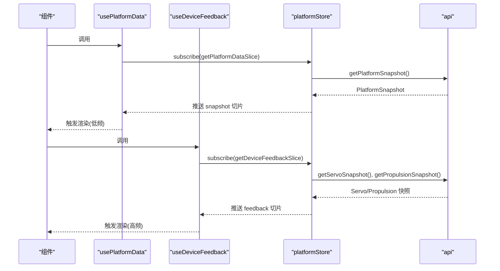
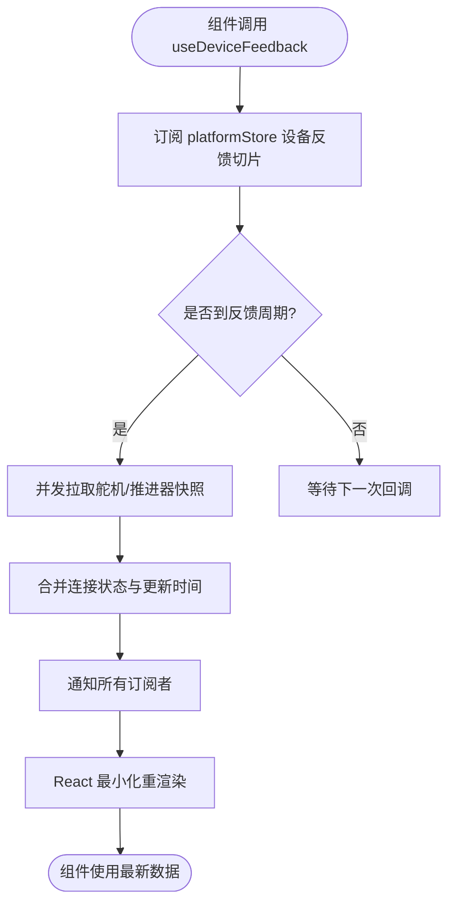
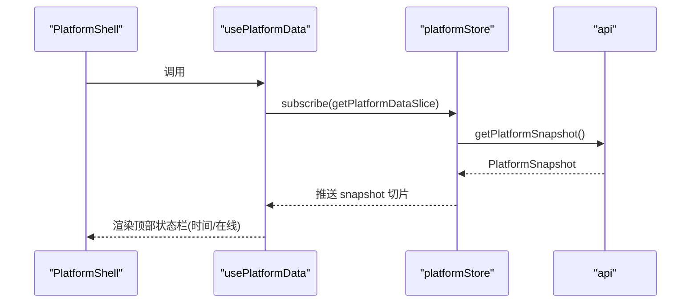
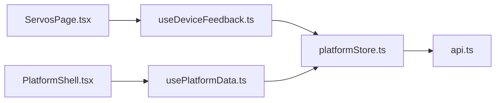

# 自定义Hooks

<cite>
**本文引用的文件**
- [useDeviceFeedback.ts](file://fishery-digital-twin-platform/apps/frontend/src/hooks/useDeviceFeedback.ts)
- [usePlatformData.ts](file://fishery-digital-twin-platform/apps/frontend/src/hooks/usePlatformData.ts)
- [platformStore.ts](file://fishery-digital-twin-platform/apps/frontend/src/lib/platformStore.ts)
- [api.ts](file://fishery-digital-twin-platform/apps/frontend/src/lib/api.ts)
- [ServosPage.tsx](file://fishery-digital-twin-platform/apps/frontend/src/components/dashboard/ServosPage.tsx)
- [PlatformShell.tsx](file://fishery-digital-twin-platform/apps/frontend/src/components/dashboard/PlatformShell.tsx)
</cite>

## 目录
1. [简介](#简介)
2. [项目结构](#项目结构)
3. [核心组件](#核心组件)
4. [架构总览](#架构总览)
5. [详细组件分析](#详细组件分析)
6. [依赖关系分析](#依赖关系分析)
7. [性能考量](#性能考量)
8. [故障排查指南](#故障排查指南)
9. [结论](#结论)
10. [附录](#附录)

## 简介
本文件面向前端应用中的自定义 Hooks，重点说明：
- useDeviceFeedback Hook 的设备反馈处理机制（事件监听、状态更新、用户交互响应）
- usePlatform Hook 的平台数据管理（数据获取、缓存策略、实时更新）
- Hook 的组合使用模式（条件渲染、副作用管理、性能优化）
- Hook 的测试方法与调试技巧
- 如何扩展新的自定义 Hook 以满足特定业务需求

## 项目结构
与自定义 Hooks 相关的代码主要位于前端应用的 hooks 与 lib 层，并通过具体页面组件消费。

图表来源
- [useDeviceFeedback.ts:1-22](file://fishery-digital-twin-platform/apps/frontend/src/hooks/useDeviceFeedback.ts#L1-L22)
- [usePlatformData.ts:1-24](file://fishery-digital-twin-platform/apps/frontend/src/hooks/usePlatformData.ts#L1-L24)
- [platformStore.ts:1-196](file://fishery-digital-twin-platform/apps/frontend/src/lib/platformStore.ts#L1-L196)
- [api.ts:1-101](file://fishery-digital-twin-platform/apps/frontend/src/lib/api.ts#L1-L101)
- [ServosPage.tsx:1-200](file://fishery-digital-twin-platform/apps/frontend/src/components/dashboard/ServosPage.tsx#L1-L200)
- [PlatformShell.tsx:1-189](file://fishery-digital-twin-platform/apps/frontend/src/components/dashboard/PlatformShell.tsx#L1-L189)

章节来源
- [useDeviceFeedback.ts:1-22](file://fishery-digital-twin-platform/apps/frontend/src/hooks/useDeviceFeedback.ts#L1-L22)
- [usePlatformData.ts:1-24](file://fishery-digital-twin-platform/apps/frontend/src/hooks/usePlatformData.ts#L1-L24)
- [platformStore.ts:1-196](file://fishery-digital-twin-platform/apps/frontend/src/lib/platformStore.ts#L1-L196)
- [api.ts:1-101](file://fishery-digital-twin-platform/apps/frontend/src/lib/api.ts#L1-L101)
- [ServosPage.tsx:1-200](file://fishery-digital-twin-platform/apps/frontend/src/components/dashboard/ServosPage.tsx#L1-L200)
- [PlatformShell.tsx:1-189](file://fishery-digital-twin-platform/apps/frontend/src/components/dashboard/PlatformShell.tsx#L1-L189)

## 核心组件
- useDeviceFeedback：订阅设备反馈切片（舵机、推进器），返回连接状态与更新时间，驱动高频 UI 刷新。
- usePlatformData：订阅平台快照切片（船体、传感器等），返回加载态、连接态与更新时间，驱动低频 UI 刷新。
- platformStore：集中式客户端 Store，负责定时拉取、错误处理、增量切片更新、订阅者通知与生命周期管理。
- api：统一网络请求封装，提供平台快照、舵机与推进器快照等接口。

章节来源
- [useDeviceFeedback.ts:1-22](file://fishery-digital-twin-platform/apps/frontend/src/hooks/useDeviceFeedback.ts#L1-L22)
- [usePlatformData.ts:1-24](file://fishery-digital-twin-platform/apps/frontend/src/hooks/usePlatformData.ts#L1-L24)
- [platformStore.ts:1-196](file://fishery-digital-twin-platform/apps/frontend/src/lib/platformStore.ts#L1-L196)
- [api.ts:1-101](file://fishery-digital-twin-platform/apps/frontend/src/lib/api.ts#L1-L101)

## 架构总览
整体数据流从后端 API 经 platformStore 聚合为两个稳定切片，分别被 usePlatformData 与 useDeviceFeedback 订阅并驱动不同频率的 UI 更新。

图表来源
- [usePlatformData.ts:1-24](file://fishery-digital-twin-platform/apps/frontend/src/hooks/usePlatformData.ts#L1-L24)
- [useDeviceFeedback.ts:1-22](file://fishery-digital-twin-platform/apps/frontend/src/hooks/useDeviceFeedback.ts#L1-L22)
- [platformStore.ts:98-139](file://fishery-digital-twin-platform/apps/frontend/src/lib/platformStore.ts#L98-L139)
- [api.ts:26-72](file://fishery-digital-twin-platform/apps/frontend/src/lib/api.ts#L26-L72)

## 详细组件分析

### useDeviceFeedback：设备反馈处理机制
- 职责
  - 通过 useSyncExternalStore 订阅 platformStore 的设备反馈切片。
  - 暴露 servos、propulsion、connected、updatedAt 给组件使用。
- 事件监听与状态更新
  - platformStore 内部维护定时器（反馈间隔约 1s），周期性并发拉取舵机与推进器快照，合并连接状态与时间戳后更新 deviceFeedbackSlice。
  - 任何订阅者收到 emit 通知后，React 会基于 Object.is 比较进行最小化重渲染。
- 用户交互响应
  - 组件可结合 store 提供的 applyFeedback 或 api 写入接口（如 setServoAngles、setPropulsionTarget）发起控制指令，随后在下一个反馈周期看到最新状态。
- 典型用法
  - 在舵机/推进器控制面板中读取当前角度、目标值与在线状态，实现实时可视化与交互。

图表来源
- [useDeviceFeedback.ts:1-22](file://fishery-digital-twin-platform/apps/frontend/src/hooks/useDeviceFeedback.ts#L1-L22)
- [platformStore.ts:81-139](file://fishery-digital-twin-platform/apps/frontend/src/lib/platformStore.ts#L81-L139)

章节来源
- [useDeviceFeedback.ts:1-22](file://fishery-digital-twin-platform/apps/frontend/src/hooks/useDeviceFeedback.ts#L1-L22)
- [platformStore.ts:81-139](file://fishery-digital-twin-platform/apps/frontend/src/lib/platformStore.ts#L81-L139)
- [ServosPage.tsx:111-145](file://fishery-digital-twin-platform/apps/frontend/src/components/dashboard/ServosPage.tsx#L111-L145)

### usePlatformData：平台数据管理
- 职责
  - 订阅 platformStore 的平台快照切片，暴露 snapshot、updatedAt、loading、connected。
- 数据获取与缓存策略
  - 平台快照以固定间隔（约 2s）拉取；store 维护 server-side 初始快照以避免水合不一致。
  - 每次成功拉取更新 snapshotAt 与 snapshotConnected；失败时置为断开。
  - 切片对象仅在自身数据变化时替换，避免无关页面重渲染。
- 实时更新
  - 通过 useSyncExternalStore 保证跨模块共享同一份快照，保持全局一致。
- 典型用法
  - 在导航壳、健康页、孪生页等展示总体状态、在线指示与数据时间。

图表来源
- [usePlatformData.ts:1-24](file://fishery-digital-twin-platform/apps/frontend/src/hooks/usePlatformData.ts#L1-L24)
- [platformStore.ts:71-114](file://fishery-digital-twin-platform/apps/frontend/src/lib/platformStore.ts#L71-L114)
- [api.ts:26-28](file://fishery-digital-twin-platform/apps/frontend/src/lib/api.ts#L26-L28)
- [PlatformShell.tsx:27-35](file://fishery-digital-twin-platform/apps/frontend/src/components/dashboard/PlatformShell.tsx#L27-L35)

章节来源
- [usePlatformData.ts:1-24](file://fishery-digital-twin-platform/apps/frontend/src/hooks/usePlatformData.ts#L1-L24)
- [platformStore.ts:71-114](file://fishery-digital-twin-platform/apps/frontend/src/lib/platformStore.ts#L71-L114)
- [PlatformShell.tsx:27-35](file://fishery-digital-twin-platform/apps/frontend/src/components/dashboard/PlatformShell.tsx#L27-L35)

### Hook 组合使用模式
- 条件渲染
  - 根据 connected/loading/snapshotAt 显示“同步中/后端断开/数据时间”等状态。
- 副作用管理
  - 组件内通过 useEffect 将外部输入（如用户操作）转换为对 store 或 api 的调用，并在反馈周期内观察结果。
- 性能优化
  - 使用 useSyncExternalStore 的切片访问函数，确保只有相关字段变化才触发重渲染。
  - 高频设备反馈与低频平台快照分离，避免相互干扰。
  - 组件内使用 useMemo/useCallback 减少不必要的计算与回调重建。

章节来源
- [PlatformShell.tsx:27-35](file://fishery-digital-twin-platform/apps/frontend/src/components/dashboard/PlatformShell.tsx#L27-L35)
- [ServosPage.tsx:111-145](file://fishery-digital-twin-platform/apps/frontend/src/components/dashboard/ServosPage.tsx#L111-L145)
- [platformStore.ts:53-57](file://fishery-digital-twin-platform/apps/frontend/src/lib/platformStore.ts#L53-L57)

## 依赖关系分析
- 组件层
  - ServosPage 依赖 useDeviceFeedback 获取舵机/推进器数据并进行交互控制。
  - PlatformShell 依赖 usePlatformData 展示全局状态与导航。
- Hook 层
  - 两个 Hook 均依赖 platformStore 的 subscribe 与对应切片 getter。
- Store 层
  - platformStore 依赖 api 获取数据，维护定时器、错误处理、切片对象稳定性与订阅者生命周期。
- 网络层
  - api 统一封装 fetch，设置超时、鉴权头与错误抛出。

图表来源
- [ServosPage.tsx:111-145](file://fishery-digital-twin-platform/apps/frontend/src/components/dashboard/ServosPage.tsx#L111-L145)
- [PlatformShell.tsx:27-35](file://fishery-digital-twin-platform/apps/frontend/src/components/dashboard/PlatformShell.tsx#L27-L35)
- [useDeviceFeedback.ts:1-22](file://fishery-digital-twin-platform/apps/frontend/src/hooks/useDeviceFeedback.ts#L1-L22)
- [usePlatformData.ts:1-24](file://fishery-digital-twin-platform/apps/frontend/src/hooks/usePlatformData.ts#L1-L24)
- [platformStore.ts:1-196](file://fishery-digital-twin-platform/apps/frontend/src/lib/platformStore.ts#L1-L196)
- [api.ts:1-101](file://fishery-digital-twin-platform/apps/frontend/src/lib/api.ts#L1-L101)

章节来源
- [ServosPage.tsx:111-145](file://fishery-digital-twin-platform/apps/frontend/src/components/dashboard/ServosPage.tsx#L111-L145)
- [PlatformShell.tsx:27-35](file://fishery-digital-twin-platform/apps/frontend/src/components/dashboard/PlatformShell.tsx#L27-L35)
- [platformStore.ts:1-196](file://fishery-digital-twin-platform/apps/frontend/src/lib/platformStore.ts#L1-L196)
- [api.ts:1-101](file://fishery-digital-twin-platform/apps/frontend/src/lib/api.ts#L1-L101)

## 性能考量
- 切片粒度与不可变性
  - platformStore 将平台快照与设备反馈拆分为独立切片，仅在各自数据变化时替换对象，降低 React 重渲染范围。
- 频率隔离
  - 平台快照（约 2s）与设备反馈（约 1s）分开调度，避免高频反馈拖慢低频页面。
- 订阅生命周期
  - 通过 refCount 控制 start/stop，无订阅时停止定时器，节省资源。
- 网络与错误
  - 单次请求失败仅影响对应连接标志位，不会中断其他数据流；Promise 去重避免重复请求风暴。
- 组件级优化
  - 使用 useMemo/useCallback 缓存派生数据与回调，减少无效计算。

[本节为通用性能建议，不直接分析具体文件]

## 故障排查指南
- 常见问题定位
  - 数据不更新：检查 platformStore 的定时器是否启动（subscribe 会增加引用计数并触发 start）。
  - 频繁重渲染：确认组件是否使用了正确的切片 getter，避免直接读取完整 state。
  - 连接状态异常：查看 api 层错误抛出逻辑与 platformStore 的连接标志更新路径。
- 调试技巧
  - 在组件中打印 updatedAt/connected 判断数据是否到达。
  - 在 platformStore 的 emit 前后添加日志，确认订阅者是否被通知。
  - 使用浏览器网络面板观察 /api/snapshot、/api/servos、/api/propulsion 的请求与响应。
- 恢复策略
  - 利用 refreshSnapshot/refreshFeedback 主动重试。
  - 通过 applyFeedback 注入模拟数据用于本地验证。

章节来源
- [platformStore.ts:59-69](file://fishery-digital-twin-platform/apps/frontend/src/lib/platformStore.ts#L59-L69)
- [platformStore.ts:98-139](file://fishery-digital-twin-platform/apps/frontend/src/lib/platformStore.ts#L98-L139)
- [api.ts:6-24](file://fishery-digital-twin-platform/apps/frontend/src/lib/api.ts#L6-L24)

## 结论
- useDeviceFeedback 与 usePlatformData 通过统一的 platformStore 解耦了数据源与 UI 层，实现了高内聚、低耦合的数据流。
- 切片化与频率隔离有效提升了渲染性能与用户体验。
- 借助稳定的切片对象与精确的订阅机制，可在复杂多模块应用中保持数据一致性。
- 未来扩展新 Hook 时，应遵循现有模式：定义清晰切片、复用 store 能力、合理划分频率与职责。

[本节为总结性内容，不直接分析具体文件]

## 附录

### 测试方法
- 单元测试思路
  - 模拟 platformStore 的 subscribe 与切片 getter，验证 Hook 返回值是否符合预期。
  - 覆盖连接/断连、首次加载、数据更新等场景。
- 集成测试思路
  - 使用测试环境 mock api 层，验证 store 的定时拉取与错误分支。
  - 验证组件在不同状态下的渲染行为（loading、connected、offline）。
- 工具建议
  - 使用 React Testing Library 编写组件测试。
  - 使用 Jest 进行异步与定时器相关测试。

[本节为通用测试建议，不直接分析具体文件]

### 调试技巧
- 在 useSyncExternalStore 的 getter 中记录返回对象的引用变化，辅助定位不必要重渲染。
- 在 platformStore 的 emit 处输出订阅者数量，确认订阅生命周期是否正确。
- 使用浏览器开发者工具的 Performance 面板录制交互过程，分析重渲染热点。

[本节为通用调试建议，不直接分析具体文件]

### 扩展新自定义 Hook 的实践
- 设计原则
  - 明确职责边界：按数据域拆分切片，避免大对象频繁变更导致的全局重渲染。
  - 复用 platformStore：新增数据域只需增加切片与对应的拉取/写入逻辑。
  - 频率与优先级：区分高频与低频数据，合理设置轮询间隔。
- 步骤建议
  - 在 platformStore 中定义新切片类型与初始值。
  - 实现 getNewSlice/getServerNewSlice 与更新函数。
  - 新增 Hook 使用 useSyncExternalStore 订阅新切片。
  - 在组件中按需组合多个 Hook，注意条件渲染与副作用管理。
- 示例参考
  - 参考 usePlatformData 与 useDeviceFeedback 的实现模式，保持一致的命名与返回结构。

[本节为通用扩展建议，不直接分析具体文件]