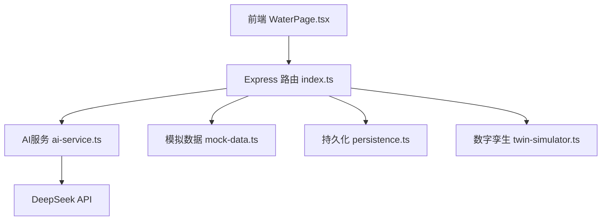
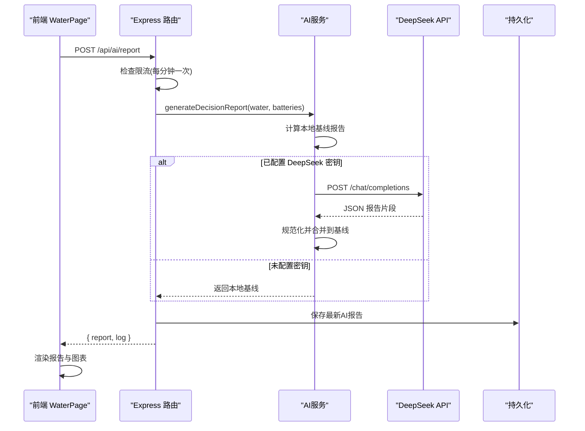
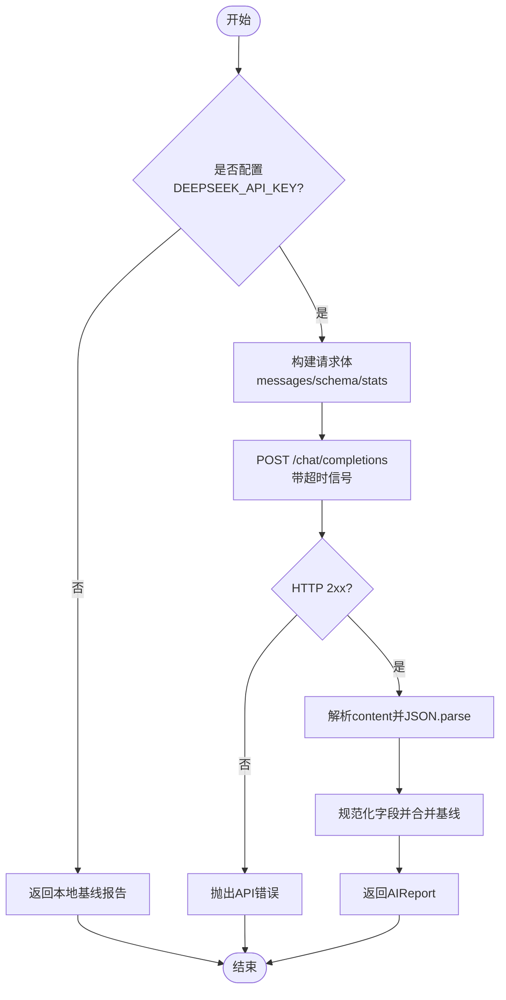
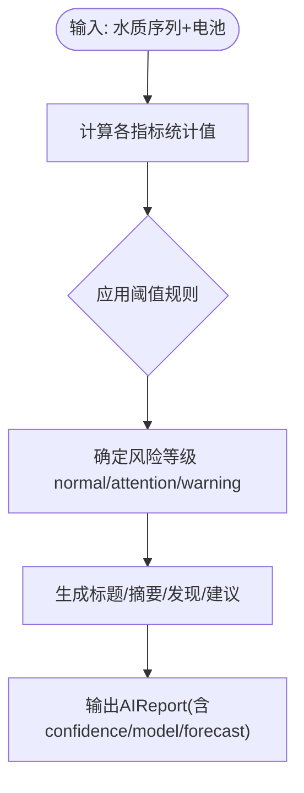
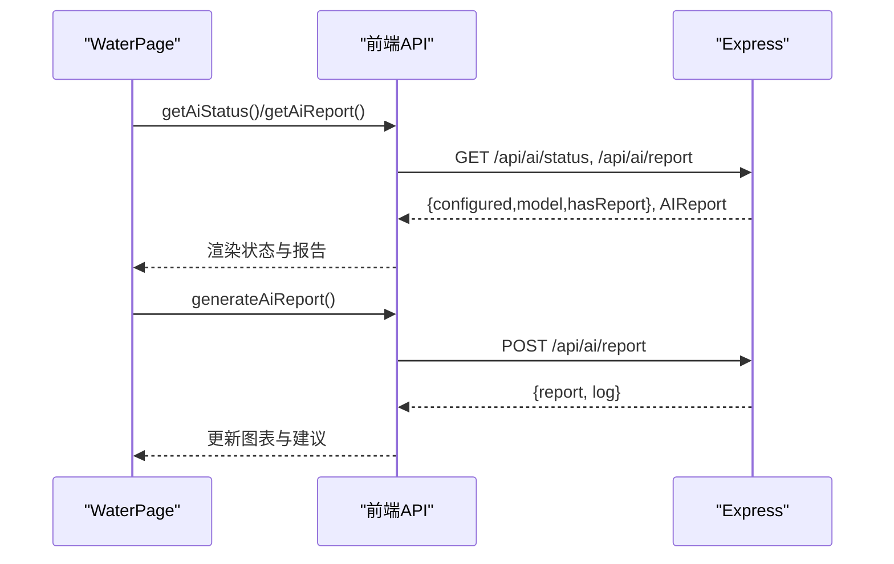
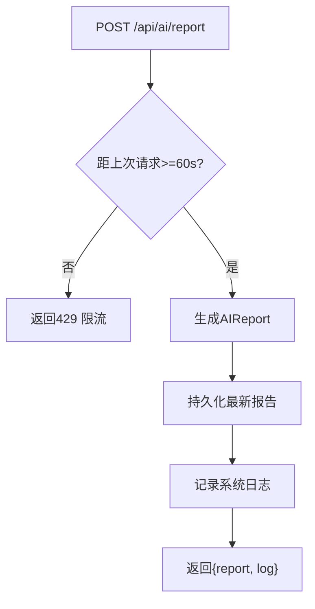
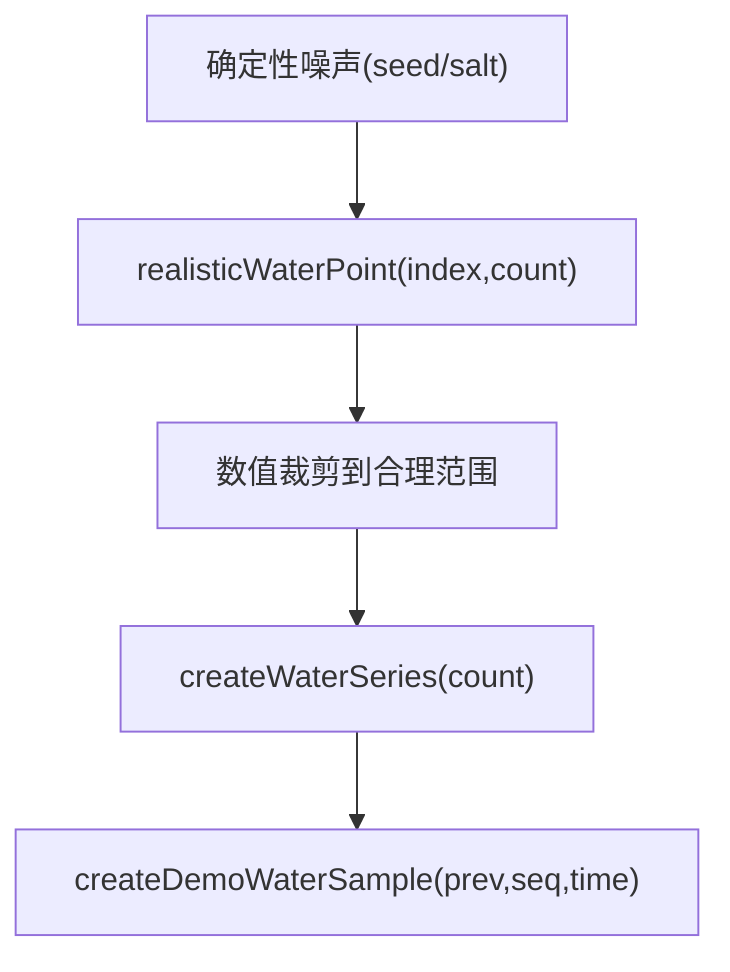
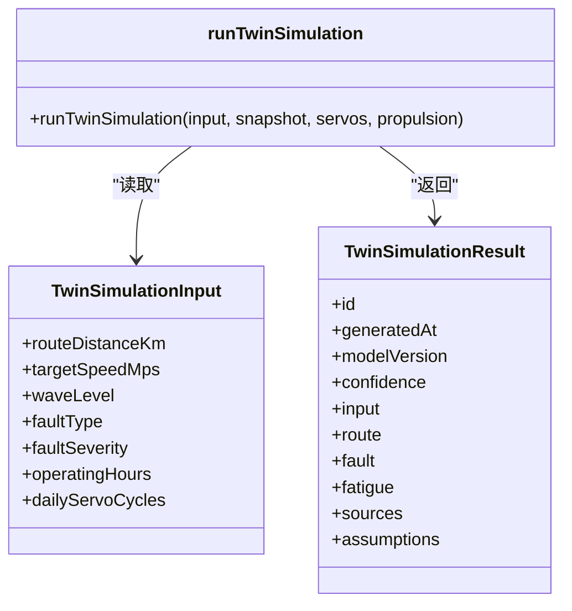
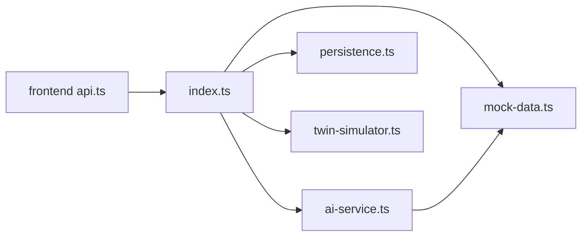

# AI服务集成

<cite>
**本文引用的文件**
- [ai-service.ts](file://fishery-digital-twin-platform/apps/backend/src/ai-service.ts)
- [mock-data.ts](file://fishery-digital-twin-platform/apps/backend/src/mock-data.ts)
- [index.ts](file://fishery-digital-twin-platform/apps/backend/src/index.ts)
- [persistence.ts](file://fishery-digital-twin-platform/apps/backend/src/persistence.ts)
- [twin-simulator.ts](file://fishery-digital-twin-platform/apps/backend/src/twin-simulator.ts)
- [api.ts](file://fishery-digital-twin-platform/apps/frontend/src/lib/api.ts)
- [WaterPage.tsx](file://fishery-digital-twin-platform/apps/frontend/src/components/dashboard/WaterPage.tsx)
- [package.json](file://fishery-digital-twin-platform/apps/backend/package.json)
- [security-and-network.md](file://fishery-digital-twin-platform/docs/security-and-network.md)
</cite>

## 目录
1. [简介](#简介)
2. [项目结构](#项目结构)
3. [核心组件](#核心组件)
4. [架构总览](#架构总览)
5. [详细组件分析](#详细组件分析)
6. [依赖关系分析](#依赖关系分析)
7. [性能与限流](#性能与限流)
8. [故障排查指南](#故障排查指南)
9. [结论](#结论)
10. [附录：扩展指南与环境配置](#附录：扩展指南与环境配置)

## 简介
本文件面向“智慧渔业数字孪生平台”的AI服务集成，覆盖以下目标：
- DeepSeek API 集成：调用方式、参数配置、响应处理与错误处理。
- 本地预测算法：水质分析模型、趋势判断与异常检测逻辑。
- 报告生成系统：模板渲染、数据分析、可视化图表与建议生成。
- AI状态管理：请求限流、缓存策略与性能监控。
- 模拟数据生成：演示数据集、随机数种子与数据一致性保证。
- AI服务扩展：如何接入新模型与分析算法。

## 项目结构
后端采用 Express 提供REST接口，AI能力由独立模块封装；前端通过Next.js页面调用后端API，展示水质趋势与AI报告。关键路径如下：
- 后端入口与路由：apps/backend/src/index.ts
- AI决策报告：apps/backend/src/ai-service.ts
- 模拟数据与基线报告：apps/backend/src/mock-data.ts
- 持久化：apps/backend/src/persistence.ts
- 数字孪生推演（辅助AI建议）：apps/backend/src/twin-simulator.ts
- 前端API客户端：apps/frontend/src/lib/api.ts
- 水质页面与AI报告交互：apps/frontend/src/components/dashboard/WaterPage.tsx

**图示来源**
- [index.ts:322-473](file://fishery-digital-twin-platform/apps/backend/src/index.ts#L322-L473)
- [ai-service.ts:167-232](file://fishery-digital-twin-platform/apps/backend/src/ai-service.ts#L167-L232)
- [mock-data.ts:192-244](file://fishery-digital-twin-platform/apps/backend/src/mock-data.ts#L192-L244)
- [persistence.ts:51-68](file://fishery-digital-twin-platform/apps/backend/src/persistence.ts#L51-L68)
- [twin-simulator.ts:74-253](file://fishery-digital-twin-platform/apps/backend/src/twin-simulator.ts#L74-L253)

**章节来源**
- [index.ts:1-120](file://fishery-digital-twin-platform/apps/backend/src/index.ts#L1-L120)
- [package.json:1-27](file://fishery-digital-twin-platform/apps/backend/package.json#L1-L27)

## 核心组件
- AI决策报告服务：封装本地基线与DeepSeek云端推理，统一输出AIReport。
- 模拟数据与基线：提供可复现实验的水质序列、电池与导航数据，以及本地风险判定。
- 数字孪生推演：基于当前快照与执行机构反馈，进行能耗、航迹偏差与疲劳评估，为AI建议提供依据。
- 持久化：将历史水质、电池、最新AI报告与日志落盘，支持重启恢复。
- 前端API与页面：提供AI状态查询、报告获取与一键生成，并在界面中渲染趋势图与建议。

**章节来源**
- [ai-service.ts:1-233](file://fishery-digital-twin-platform/apps/backend/src/ai-service.ts#L1-L233)
- [mock-data.ts:1-258](file://fishery-digital-twin-platform/apps/backend/src/mock-data.ts#L1-L258)
- [twin-simulator.ts:1-254](file://fishery-digital-twin-platform/apps/backend/src/twin-simulator.ts#L1-L254)
- [persistence.ts:1-68](file://fishery-digital-twin-platform/apps/backend/src/persistence.ts#L1-L68)
- [api.ts:1-101](file://fishery-digital-twin-platform/apps/frontend/src/lib/api.ts#L1-L101)
- [WaterPage.tsx:1-200](file://fishery-digital-twin-platform/apps/frontend/src/components/dashboard/WaterPage.tsx#L1-L200)

## 架构总览
整体流程：
- 前端触发“生成AI报告”，后端校验限流后读取历史水质与电池数据。
- 先计算本地基线报告作为兜底；若配置了DeepSeek密钥，则发起云端推理。
- 云端返回JSON内容经规范化后合并到本地基线，形成最终AIReport并持久化。
- 前端轮询或按需拉取报告，渲染图表与建议。

**图示来源**
- [index.ts:456-473](file://fishery-digital-twin-platform/apps/backend/src/index.ts#L456-L473)
- [ai-service.ts:167-232](file://fishery-digital-twin-platform/apps/backend/src/ai-service.ts#L167-L232)
- [persistence.ts:51-68](file://fishery-digital-twin-platform/apps/backend/src/persistence.ts#L51-L68)

## 详细组件分析

### DeepSeek API 集成
- 配置项
  - DEEPSEEK_API_KEY：鉴权令牌，缺失时仅使用本地基线。
  - DEEPSEEK_BASE_URL：默认 https://api.deepseek.com，可替换为代理或私有端点。
  - DEEPSEEK_MODEL：默认 deepseek-v4-flash。
  - DEEPSEEK_TIMEOUT_SECONDS：超时秒数，限制在5s~120s之间。
- 调用流程
  - 构造system提示词约束输出严格JSON。
  - user消息包含任务描述、required_schema、养殖参考范围、统计指标、最近样本与电池信息。
  - 设置response_format为json_object，temperature=0.2，max_tokens=1200。
  - 使用AbortSignal.timeout控制网络超时。
- 响应处理
  - 解析choices[0].message.content，去除Markdown包裹后JSON.parse。
  - 规范化字段：riskLevel/title/summary/findings/recommendations/dataQuality/confidence等，缺失时回退到本地基线。
- 错误处理
  - HTTP非2xx：抛出包含状态码与摘要的错误。
  - 内容为空：抛出明确错误。
  - 前端收到错误后显示“智能报告生成失败，请检查后端和密钥配置”。

**图示来源**
- [ai-service.ts:167-232](file://fishery-digital-twin-platform/apps/backend/src/ai-service.ts#L167-L232)

**章节来源**
- [ai-service.ts:160-232](file://fishery-digital-twin-platform/apps/backend/src/ai-service.ts#L160-L232)
- [security-and-network.md:52-55](file://fishery-digital-twin-platform/docs/security-and-network.md#L52-L55)

### 本地预测算法：水质分析与异常检测
- 统计聚合
  - 对水温、浊度、pH、溶解氧、氨氮、电导率分别计算latest/min/max/average/change。
  - 电池平均电量用于续航与风险判断。
- 风险等级
  - 低电量或污染/藻华风险直接标记warning。
  - 浊度上升、溶解氧偏低、氨氮升高或基础状态非正常则标记attention。
  - 否则normal。
- 趋势与阈值
  - 浊度变化>6 NTU视为显著上升。
  - 溶解氧<5 mg/L视为偏低。
  - 氨氮>0.2 mg/L或变化>0.08视为升高。
- 报告内容
  - 标题、摘要、发现与建议根据上述规则动态生成。
  - 置信度与模型标识写入AIReport。

**图示来源**
- [ai-service.ts:33-122](file://fishery-digital-twin-platform/apps/backend/src/ai-service.ts#L33-L122)
- [mock-data.ts:27-32](file://fishery-digital-twin-platform/apps/backend/src/mock-data.ts#L27-L32)

**章节来源**
- [ai-service.ts:33-122](file://fishery-digital-twin-platform/apps/backend/src/ai-service.ts#L33-L122)
- [mock-data.ts:27-32](file://fishery-digital-twin-platform/apps/backend/src/mock-data.ts#L27-L32)

### 报告生成系统与可视化
- 模板渲染
  - 前端WaterPage根据AIReport中的riskLevel映射中文标签，渲染状态徽章。
  - 图表区域展示多指标时间序列（水温、浊度、pH、溶解氧、氨氮、电导率）。
- 数据分析
  - 前端从后端拉取waterHistory与batteries，结合AIReport进行综合展示。
  - 支持1小时/6小时/24小时/7天等多时间窗口切换。
- 建议生成
  - 后端根据规则与统计数据生成具体行动建议，前端以列表形式呈现。
  - 数字孪生结果可作为补充依据（能耗、健康度、风险等级）。

**图示来源**
- [WaterPage.tsx:437-468](file://fishery-digital-twin-platform/apps/frontend/src/components/dashboard/WaterPage.tsx#L437-L468)
- [api.ts:37-50](file://fishery-digital-twin-platform/apps/frontend/src/lib/api.ts#L37-L50)
- [index.ts:447-473](file://fishery-digital-twin-platform/apps/backend/src/index.ts#L447-L473)

**章节来源**
- [WaterPage.tsx:1-200](file://fishery-digital-twin-platform/apps/frontend/src/components/dashboard/WaterPage.tsx#L1-L200)
- [api.ts:1-101](file://fishery-digital-twin-platform/apps/frontend/src/lib/api.ts#L1-L101)
- [index.ts:447-473](file://fishery-digital-twin-platform/apps/backend/src/index.ts#L447-L473)

### AI状态管理：限流、缓存与监控
- 请求限流
  - 同一分钟内仅允许一次AI报告生成，防止频繁调用导致资源浪费或触发服务商限流。
- 缓存策略
  - 最新AIReport保存在内存中，并通过持久化模块定期落盘，重启后可恢复。
  - 传感器数据到达后清空缓存，确保下次生成基于最新数据。
- 性能监控
  - 每次生成成功或失败均记录系统日志，包含模型、采样点数与错误信息。
  - 健康检查接口暴露AI状态、GPS、舵机、推进器等信息。

**图示来源**
- [index.ts:456-473](file://fishery-digital-twin-platform/apps/backend/src/index.ts#L456-L473)
- [persistence.ts:51-68](file://fishery-digital-twin-platform/apps/backend/src/persistence.ts#L51-L68)

**章节来源**
- [index.ts:456-473](file://fishery-digital-twin-platform/apps/backend/src/index.ts#L456-L473)
- [persistence.ts:1-68](file://fishery-digital-twin-platform/apps/backend/src/persistence.ts#L1-L68)

### 模拟数据生成：演示数据集、随机数种子与一致性
- 数据生成
  - createWaterSeries/createDemoWaterSample：基于确定性噪声函数与平滑步进，生成符合北理珠月牙湖特征的水质序列。
  - createBatteries：模拟三块电池的电量波动。
  - createNavigation：沿预设航点插值移动，计算速度、航向与剩余距离。
- 随机数种子
  - 使用确定性噪声（sin组合）替代Math.random，保证多次运行一致性与可重现性。
- 一致性保证
  - 所有数值经过clamp限制在合理区间，避免极端值影响趋势判断。
  - 演示模式不覆盖实时历史，避免污染真实数据。

**图示来源**
- [mock-data.ts:23-46](file://fishery-digital-twin-platform/apps/backend/src/mock-data.ts#L23-L46)
- [mock-data.ts:48-140](file://fishery-digital-twin-platform/apps/backend/src/mock-data.ts#L48-L140)

**章节来源**
- [mock-data.ts:1-258](file://fishery-digital-twin-platform/apps/backend/src/mock-data.ts#L1-L258)

### 数字孪生推演（辅助AI建议）
- 输入清洗：海况、故障类型、航程、目标速度、设备寿命与动作次数等参数被归一化与边界限制。
- 能耗与ETA：根据海况系数、电机负载与跟踪误差估算有效速度与能耗，计算到达电量与完成概率。
- 故障推演：不同故障类型对应不同的速度损失与航向漂移，给出检测时间与处置建议。
- 疲劳评估：推进、舵机、船体、电池四类部件损伤折算，输出整体健康度与下次巡检间隔。
- 输出：路线系列、故障系列、疲劳组件与置信度，供AI建议与前端可视化使用。

**图示来源**
- [twin-simulator.ts:35-50](file://fishery-digital-twin-platform/apps/backend/src/twin-simulator.ts#L35-L50)
- [twin-simulator.ts:74-253](file://fishery-digital-twin-platform/apps/backend/src/twin-simulator.ts#L74-L253)

**章节来源**
- [twin-simulator.ts:1-254](file://fishery-digital-twin-platform/apps/backend/src/twin-simulator.ts#L1-L254)

## 依赖关系分析
- 模块耦合
  - index.ts依赖ai-service、mock-data、persistence、twin-simulator以及多个设备存储模块。
  - ai-service依赖mock-data提供的基线报告与共享类型。
  - 前端api.ts集中封装所有后端接口，便于页面复用。
- 外部依赖
  - Express、cors、dotenv用于Web服务与配置加载。
  - Node内置dgram用于局域网设备发现。
- 潜在循环依赖
  - 当前未见循环引用；ai-service仅依赖mock-data与共享类型。

**图示来源**
- [index.ts:1-45](file://fishery-digital-twin-platform/apps/backend/src/index.ts#L1-L45)
- [ai-service.ts:1-3](file://fishery-digital-twin-platform/apps/backend/src/ai-service.ts#L1-L3)
- [api.ts:1-101](file://fishery-digital-twin-platform/apps/frontend/src/lib/api.ts#L1-L101)

**章节来源**
- [index.ts:1-45](file://fishery-digital-twin-platform/apps/backend/src/index.ts#L1-L45)
- [package.json:13-18](file://fishery-digital-twin-platform/apps/backend/package.json#L13-L18)

## 性能与限流
- 网络超时：DeepSeek请求使用AbortSignal.timeout，默认45秒，限制在5~120秒。
- 请求限流：AI报告生成每分钟最多一次，避免高频调用。
- 数据新鲜度：传感器数据到达后清空AI报告缓存，确保下次生成基于最新数据。
- 持久化节流：状态变更通过定时器批量落盘，减少磁盘IO。
- 前端超时：默认fetch超时5秒，避免长时间阻塞UI。

**章节来源**
- [ai-service.ts:174-186](file://fishery-digital-twin-platform/apps/backend/src/ai-service.ts#L174-L186)
- [index.ts:456-473](file://fishery-digital-twin-platform/apps/backend/src/index.ts#L456-L473)
- [persistence.ts:51-68](file://fishery-digital-twin-platform/apps/backend/src/persistence.ts#L51-L68)
- [api.ts:6-24](file://fishery-digital-twin-platform/apps/frontend/src/lib/api.ts#L6-L24)

## 故障排查指南
- 无法生成AI报告
  - 检查是否配置DEEPSEEK_API_KEY；未配置时将仅返回本地基线。
  - 查看系统日志中“AI 预测报告生成失败”条目，确认错误信息。
- DeepSeek返回错误
  - 检查DEEPSEEK_BASE_URL与DEEPSEEK_MODEL是否正确。
  - 确认网络可达与令牌权限；必要时更换代理或刷新密钥。
- 前端报错
  - 检查NEXT_PUBLIC_API_BASE与NEXT_PUBLIC_UISYS_API_TOKEN配置。
  - 观察控制台错误详情，定位是网络超时还是后端返回错误。
- 数据不一致
  - 确认演示模式与实时模式切换正确；演示数据不会覆盖实时历史。
  - 检查传感器数据是否持续上报，lastRealWaterAt是否更新。

**章节来源**
- [ai-service.ts:220-232](file://fishery-digital-twin-platform/apps/backend/src/ai-service.ts#L220-L232)
- [index.ts:456-473](file://fishery-digital-twin-platform/apps/backend/src/index.ts#L456-L473)
- [WaterPage.tsx:437-468](file://fishery-digital-twin-platform/apps/frontend/src/components/dashboard/WaterPage.tsx#L437-L468)
- [security-and-network.md:52-55](file://fishery-digital-twin-platform/docs/security-and-network.md#L52-L55)

## 结论
该AI服务集成以“本地基线优先、云端增强为辅”的策略实现稳健的决策支持与报告生成。通过严格的参数校验、超时与限流、持久化与日志记录，系统在无云环境下仍可工作，并在配置DeepSeek密钥后获得更丰富的自然语言建议。数字孪生推演为AI建议提供了工程化的能耗与健康度依据。整体架构清晰、可扩展性强，适合后续接入更多模型与分析算法。

## 附录：扩展指南与环境配置
- 新增AI模型
  - 在ai-service.ts中新增适配器，复用analyzeStats与normalize流程，保持输出AIReport结构一致。
  - 在generateDecisionReport中按优先级选择模型（如本地→新模型→DeepSeek），并记录model字段。
- 环境变量
  - DEEPSEEK_API_KEY、DEEPSEEK_BASE_URL、DEEPSEEK_MODEL、DEEPSEEK_TIMEOUT_SECONDS。
  - NEXT_PUBLIC_API_BASE、NEXT_PUBLIC_UISYS_API_TOKEN（前端）。
  - UISYS_API_TOKEN（后端控制接口鉴权）。
- 安全建议
  - 密钥仅存放于后端.env，不在前端暴露。
  - 若密钥泄露，立即在服务端控制台撤销并重新生成。
- 测试与验证
  - 使用/api/demo/simulate生成演示数据，验证图表与报告渲染。
  - 通过/api/health检查服务状态与AI配置。
  - 对比本地基线与云端报告的差异，评估新模型效果。

**章节来源**
- [ai-service.ts:160-232](file://fishery-digital-twin-platform/apps/backend/src/ai-service.ts#L160-L232)
- [index.ts:48-76](file://fishery-digital-twin-platform/apps/backend/src/index.ts#L48-L76)
- [api.ts:1-101](file://fishery-digital-twin-platform/apps/frontend/src/lib/api.ts#L1-L101)
- [security-and-network.md:44-55](file://fishery-digital-twin-platform/docs/security-and-network.md#L44-L55)