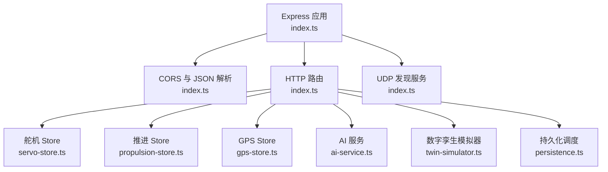
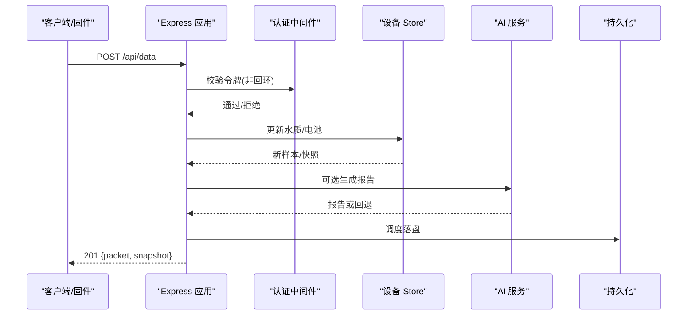
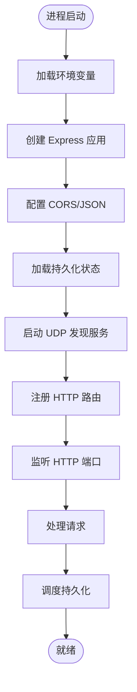
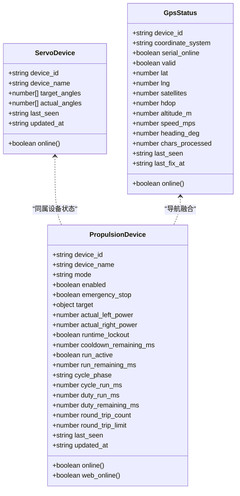
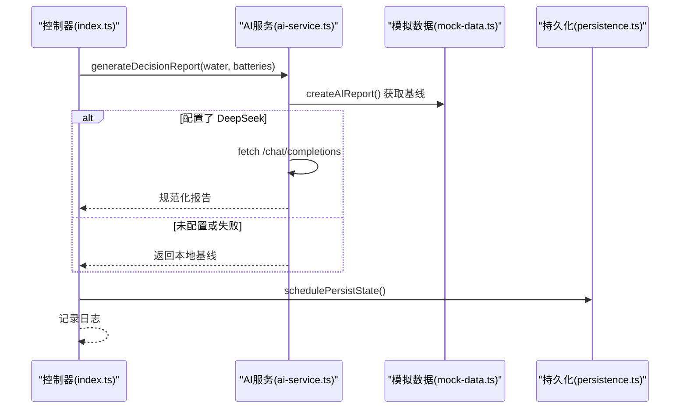
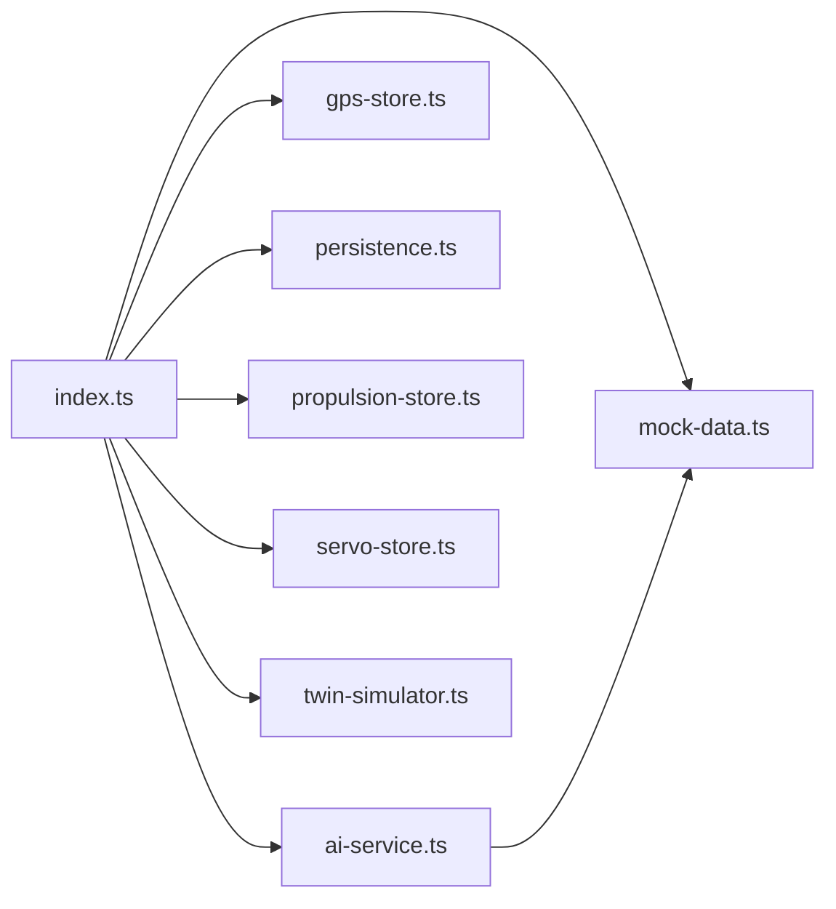

# 后端服务

<cite>
**本文引用的文件**
- [index.ts](file://fishery-digital-twin-platform/apps/backend/src/index.ts)
- [package.json](file://fishery-digital-twin-platform/apps/backend/package.json)
- [ai-service.ts](file://fishery-digital-twin-platform/apps/backend/src/ai-service.ts)
- [persistence.ts](file://fishery-digital-twin-platform/apps/backend/src/persistence.ts)
- [servo-store.ts](file://fishery-digital-twin-platform/apps/backend/src/servo-store.ts)
- [propulsion-store.ts](file://fishery-digital-twin-platform/apps/backend/src/propulsion-store.ts)
- [gps-store.ts](file://fishery-digital-twin-platform/apps/backend/src/gps-store.ts)
- [mock-data.ts](file://fishery-digital-twin-platform/apps/backend/src/mock-data.ts)
- [twin-simulator.ts](file://fishery-digital-twin-platform/apps/backend/src/twin-simulator.ts)
</cite>

## 目录
1. [简介](#简介)
2. [项目结构](#项目结构)
3. [核心组件](#核心组件)
4. [架构总览](#架构总览)
5. [详细组件分析](#详细组件分析)
6. [依赖关系分析](#依赖关系分析)
7. [性能考量](#性能考量)
8. [故障排查指南](#故障排查指南)
9. [结论](#结论)
10. [附录：API 接口规范与错误处理](#附录api-接口规范与错误处理)

## 简介
本后端服务基于 Express 构建，提供智慧渔业数字孪生平台的设备状态管理、AI 辅助决策、数据存储与持久化、以及 UDP 发现与 HTTP API 等能力。系统通过内存 Store 模块维护舵机、推进器、GPS 等设备状态，结合水质历史数据生成平台快照；支持本地预测算法与 DeepSeek API 的 AI 报告生成；通过 JSON 文件持久化关键状态并提供定时保存与优雅关闭；同时实现 UDP 广播发现服务与受控访问的安全认证机制。

## 项目结构
后端位于 apps/backend 目录，采用单入口应用模式：
- 入口与路由：index.ts 负责启动 Express、注册中间件、定义所有 HTTP 路由、启动 UDP 发现服务、处理生命周期事件。
- 设备状态 Store：servo-store.ts、propulsion-store.ts、gps-store.ts 分别管理舵机、推进器、GPS 的状态与命令队列。
- AI 服务：ai-service.ts 提供本地预测基线与可选的 DeepSeek API 调用，输出统一格式的 AI 报告。
- 模拟数据：mock-data.ts 提供演示水质序列、电池、导航与平台快照等。
- 数字孪生：twin-simulator.ts 根据当前快照与输入参数进行航次推演、能耗估算、故障影响评估与疲劳寿命分析。
- 持久化：persistence.ts 将水质历史、电池、AI 报告、系统日志写入 data/platform-state.json，并支持延迟批量落盘与优雅关闭。

**图表来源**
- [index.ts:56-110](file://fishery-digital-twin-platform/apps/backend/src/index.ts#L56-L110)
- [servo-store.ts:1-184](file://fishery-digital-twin-platform/apps/backend/src/servo-store.ts#L1-L184)
- [propulsion-store.ts:1-319](file://fishery-digital-twin-platform/apps/backend/src/propulsion-store.ts#L1-L319)
- [gps-store.ts:1-103](file://fishery-digital-twin-platform/apps/backend/src/gps-store.ts#L1-L103)
- [ai-service.ts:1-233](file://fishery-digital-twin-platform/apps/backend/src/ai-service.ts#L1-L233)
- [twin-simulator.ts:1-254](file://fishery-digital-twin-platform/apps/backend/src/twin-simulator.ts#L1-L254)
- [persistence.ts:1-68](file://fishery-digital-twin-platform/apps/backend/src/persistence.ts#L1-L68)

**章节来源**
- [index.ts:46-110](file://fishery-digital-twin-platform/apps/backend/src/index.ts#L46-L110)
- [package.json:1-27](file://fishery-digital-twin-platform/apps/backend/package.json#L1-L27)

## 核心组件
- 服务器启动流程
  - 读取环境变量（端口、主机、发现端口、演示开关、传感器新鲜度阈值、令牌、CORS 源）。
  - 初始化 Express 应用，配置 CORS、JSON 解析限制。
  - 加载持久化状态到内存，初始化水质历史、电池、AI 报告、系统日志。
  - 启动 UDP 发现服务，绑定端口并周期性广播。
  - 注册全部 HTTP 路由，监听 HTTP 服务，处理错误与进程信号。
- 中间件与安全
  - CORS 中间件按白名单放行，未授权来源返回 403。
  - 控制类路由使用 requireControlAuthorization 校验本地回环或 X-UISYS-Token。
- 请求处理机制
  - 读参校验：统一数值范围校验函数，保证边界安全。
  - 状态更新：Store 模块接收 payload 后更新内存状态，必要时入队命令。
  - 快照生成：组合水质历史、导航、AI 报告、设备状态生成平台快照。
  - 日志记录：每次关键操作追加系统日志并触发持久化。
- 设备状态管理
  - 舵机：四通道角度目标与实际反馈，保留通道保护与角度上限限制，命令 TTL 过滤。
  - 推进器：多设备配置、模式切换、左右功率混合、急停、运行周期与冷却。
  - GPS：坐标系统校验、有效定位判定、在线超时判断。
- AI 服务集成
  - 本地预测：统计水温、浊度、pH、溶解氧、氨氮、电导率与电池均值，输出风险等级与建议。
  - DeepSeek API：可选调用，带超时与响应格式规范化，失败时回退到本地报告。
- 数据存储策略
  - 内存为主：所有状态驻留内存，保证低延迟。
  - 文件持久化：platform-state.json，延迟合并写，优雅关闭强制落盘。
  - 历史数据：水质历史固定长度滑动窗口，系统日志固定长度。
  - 缓存机制：命令队列 TTL 自动清理，避免陈旧指令下发。

**章节来源**
- [index.ts:46-114](file://fishery-digital-twin-platform/apps/backend/src/index.ts#L46-L114)
- [index.ts:116-195](file://fishery-digital-twin-platform/apps/backend/src/index.ts#L116-L195)
- [index.ts:247-262](file://fishery-digital-twin-platform/apps/backend/src/index.ts#L247-L262)
- [servo-store.ts:1-184](file://fishery-digital-twin-platform/apps/backend/src/servo-store.ts#L1-L184)
- [propulsion-store.ts:1-319](file://fishery-digital-twin-platform/apps/backend/src/propulsion-store.ts#L1-L319)
- [gps-store.ts:1-103](file://fishery-digital-twin-platform/apps/backend/src/gps-store.ts#L1-L103)
- [ai-service.ts:1-233](file://fishery-digital-twin-platform/apps/backend/src/ai-service.ts#L1-L233)
- [persistence.ts:1-68](file://fishery-digital-twin-platform/apps/backend/src/persistence.ts#L1-L68)

## 架构总览
后端以 Express 为中心，聚合多个 Store 模块与外部服务（DeepSeek），并通过 UDP 发现服务与前端或固件设备进行局域网发现。所有写操作均记录系统日志并触发异步持久化。

**图表来源**
- [index.ts:367-430](file://fishery-digital-twin-platform/apps/backend/src/index.ts#L367-L430)
- [index.ts:456-473](file://fishery-digital-twin-platform/apps/backend/src/index.ts#L456-L473)
- [persistence.ts:51-68](file://fishery-digital-twin-platform/apps/backend/src/persistence.ts#L51-L68)

## 详细组件分析

### 服务器启动与路由组织
- 启动流程
  - 读取并校验端口、发现端口等环境变量。
  - 初始化 CORS、JSON 解析、令牌与来源白名单。
  - 加载持久化状态，初始化内存数据结构。
  - 启动 UDP 发现服务，绑定端口并设置广播。
  - 注册健康检查、快照、水质、电池、导航、GPS、设备控制、AI、数字孪生、日志等路由。
  - 监听 HTTP 服务，处理错误与进程信号，优雅关闭。
- 路由组织
  - 只读路由：/api/health、/api/snapshot、/api/water、/api/batteries、/api/navigation、/api/gps、/api/vessel、/api/ai/status、/api/ai/report、/api/servos、/api/propulsion、/api/logs。
  - 控制路由（需令牌）：/api/gps/status、/api/data、/api/demo/simulate、/api/ai/report、/api/servos、/api/servos/status、/api/device/commands、/api/propulsion、/api/propulsion/status、/api/propulsion/commands、/api/twin/simulate。
  - 已废弃路由：/api/simulate 返回 410。

**图表来源**
- [index.ts:46-114](file://fishery-digital-twin-platform/apps/backend/src/index.ts#L46-L114)
- [index.ts:320-561](file://fishery-digital-twin-platform/apps/backend/src/index.ts#L320-L561)
- [index.ts:563-599](file://fishery-digital-twin-platform/apps/backend/src/index.ts#L563-L599)

**章节来源**
- [index.ts:46-114](file://fishery-digital-twin-platform/apps/backend/src/index.ts#L46-L114)
- [index.ts:320-561](file://fishery-digital-twin-platform/apps/backend/src/index.ts#L320-L561)
- [index.ts:563-599](file://fishery-digital-twin-platform/apps/backend/src/index.ts#L563-L599)

### 设备状态管理系统（Store 模块）
- 舵机控制（servo-store.ts）
  - 设备模型：device_id、device_name、target_angles、actual_angles、last_seen、updated_at。
  - 通道保护：预留通道强制为 90°，防止误操作。
  - 角度限制：按设备最大角度限制，确保物理安全。
  - 命令队列：TTL 过滤，避免过期命令下发。
  - 在线判定：last_seen 超过 10s 视为离线。
- 推进器管理（propulsion-store.ts）
  - 设备配置：支持多种设备类型与最大功率限制。
  - 模式切换：MANUAL、WEB、AUTO，WEB 模式允许 Web 控制。
  - 功率混合：throttle 与 steering 合成左右功率，或直接指定左右功率。
  - 急停与冷却：紧急停止立即清零输出，冷却期限制再次启用。
  - 运行周期：记录运行阶段、剩余时间、占空比与往返次数。
  - 在线判定：last_seen 与 target.updated_at 分别用于设备与 Web 在线。
- GPS 数据处理（gps-store.ts）
  - 坐标系统：仅支持 WGS84。
  - 有效定位：lat/lng 合法且 valid=true 才认为定位有效。
  - 在线判定：serial_online 与 last_seen 新鲜度共同决定 online。
  - 字段更新：卫星数、HDOP、海拔、速度、航向、字符计数等。

**图表来源**
- [servo-store.ts:15-184](file://fishery-digital-twin-platform/apps/backend/src/servo-store.ts#L15-L184)
- [propulsion-store.ts:28-319](file://fishery-digital-twin-platform/apps/backend/src/propulsion-store.ts#L28-L319)
- [gps-store.ts:6-103](file://fishery-digital-twin-platform/apps/backend/src/gps-store.ts#L6-L103)

**章节来源**
- [servo-store.ts:1-184](file://fishery-digital-twin-platform/apps/backend/src/servo-store.ts#L1-L184)
- [propulsion-store.ts:1-319](file://fishery-digital-twin-platform/apps/backend/src/propulsion-store.ts#L1-L319)
- [gps-store.ts:1-103](file://fishery-digital-twin-platform/apps/backend/src/gps-store.ts#L1-L103)

### AI 服务集成
- 本地预测算法
  - 统计最近水质指标与电池均值，计算变化趋势。
  - 依据阈值与趋势判定风险等级（normal/attention/warning）。
  - 生成标题、摘要、发现与建议，包含数据质量说明与置信度。
- DeepSeek API 调用
  - 环境变量配置 API Key、Base URL、模型名与超时。
  - 构造系统提示与用户消息，要求严格 JSON 输出。
  - 响应规范化：提取 riskLevel、title、summary、findings、recommendations、dataQuality、confidence。
  - 失败回退：网络错误或空内容时抛出异常，上层捕获并记录日志。
- 报告生成逻辑
  - 控制器层限流：每分钟最多一次。
  - 成功：更新 latestAiReport，记录日志，持久化。
  - 失败：记录错误日志，返回 503。

**图表来源**
- [ai-service.ts:167-233](file://fishery-digital-twin-platform/apps/backend/src/ai-service.ts#L167-L233)
- [mock-data.ts:192-244](file://fishery-digital-twin-platform/apps/backend/src/mock-data.ts#L192-L244)
- [index.ts:456-473](file://fishery-digital-twin-platform/apps/backend/src/index.ts#L456-L473)
- [persistence.ts:51-68](file://fishery-digital-twin-platform/apps/backend/src/persistence.ts#L51-L68)

**章节来源**
- [ai-service.ts:1-233](file://fishery-digital-twin-platform/apps/backend/src/ai-service.ts#L1-L233)
- [mock-data.ts:192-244](file://fishery-digital-twin-platform/apps/backend/src/mock-data.ts#L192-L244)
- [index.ts:447-473](file://fishery-digital-twin-platform/apps/backend/src/index.ts#L447-L473)

### 数据存储策略
- JSON 文件持久化
  - 路径：data/platform-state.json，可被环境变量覆盖。
  - 原子写入：先写临时文件再 rename，避免损坏。
  - 延迟合并：schedulePersistState 在 250ms 内合并多次写入。
  - 优雅关闭：flushPersistedState 强制落盘。
- 历史数据管理
  - 水质历史：固定长度滑动窗口（默认 180 点）。
  - 系统日志：固定长度（默认 80 条）。
  - 电池数据：按设备更新，保留 source 与 lastUpdatedAt。
- 缓存机制
  - 命令队列：TTL 过滤，避免过期指令。
  - 在线判定：last_seen 与 updated_at 新鲜度判断设备与 Web 在线。
  - 演示数据：在未收到真实数据前，按间隔注入演示样本。

**章节来源**
- [persistence.ts:1-68](file://fishery-digital-twin-platform/apps/backend/src/persistence.ts#L1-L68)
- [index.ts:78-99](file://fishery-digital-twin-platform/apps/backend/src/index.ts#L78-L99)
- [servo-store.ts:175-184](file://fishery-digital-twin-platform/apps/backend/src/servo-store.ts#L175-L184)
- [propulsion-store.ts:310-319](file://fishery-digital-twin-platform/apps/backend/src/propulsion-store.ts#L310-L319)

### 设备通信协议
- UDP 发现服务
  - 监听 UISYS_DISCOVERY_PORT，接收“UISYS_DISCOVER_V1”或前缀匹配请求。
  - 广播响应“UISYS_BACKEND_V1|{port}”，向多个客户端端口广播。
  - 周期性广播，便于局域网设备发现后端。
- HTTP API 接口
  - 详见附录接口规范。
- 实时数据推送
  - 当前为拉取模式（GET 查询快照/历史），可通过前端轮询或 WebSocket 扩展推送。

**章节来源**
- [index.ts:271-318](file://fishery-digital-twin-platform/apps/backend/src/index.ts#L271-L318)

### 安全认证机制
- 令牌验证
  - 环境变量 UISYS_API_TOKEN 配置令牌。
  - requireControlAuthorization 对非回环请求校验 X-UISYS-Token。
  - 使用 timingSafeEqual 防时序攻击。
- CORS 配置
  - 环境变量 CORS_ORIGIN 逗号分隔白名单，未配置则默认允许 localhost:3000。
  - 未授权来源返回 403。
- 网络访问控制
  - 回环地址直接放行，LAN 控制必须携带令牌。
  - 未配置令牌时，LAN 控制请求返回 503。

**章节来源**
- [index.ts:68-76](file://fishery-digital-twin-platform/apps/backend/src/index.ts#L68-L76)
- [index.ts:101-110](file://fishery-digital-twin-platform/apps/backend/src/index.ts#L101-L110)
- [index.ts:131-157](file://fishery-digital-twin-platform/apps/backend/src/index.ts#L131-L157)

## 依赖关系分析
- 内部依赖
  - index.ts 依赖 ai-service、gps-store、mock-data、persistence、propulsion-store、servo-store、twin-simulator。
  - ai-service 依赖 mock-data。
  - twin-simulator 依赖共享类型（@fishery/shared）。
- 外部依赖
  - express、cors、dotenv。
  - Node.js 内置 dgram、crypto、fs、path、os。
- 耦合与内聚
  - Store 模块高内聚，职责单一，通过导出函数暴露能力。
  - index.ts 作为编排层，耦合较多但清晰。
  - 无循环依赖。

**图表来源**
- [index.ts:21-44](file://fishery-digital-twin-platform/apps/backend/src/index.ts#L21-L44)
- [ai-service.ts:1-3](file://fishery-digital-twin-platform/apps/backend/src/ai-service.ts#L1-L3)

**章节来源**
- [index.ts:21-44](file://fishery-digital-twin-platform/apps/backend/src/index.ts#L21-L44)
- [package.json:13-18](file://fishery-digital-twin-platform/apps/backend/package.json#L13-L18)

## 性能考量
- 内存存储：所有状态在内存中，读写延迟极低。
- 批量持久化：250ms 合并写，减少磁盘 IO。
- 命令 TTL：自动清理过期命令，降低无效负载。
- 限流：AI 报告生成每分钟一次，避免频繁调用外部 API。
- 数据窗口：水质历史与日志固定长度，避免无限增长。
- 建议优化
  - 增加并发请求下的锁或队列，避免竞态条件。
  - 对大体积快照考虑分页或增量更新。
  - 引入指标监控（QPS、延迟、错误率）。

[本节为通用指导，不直接分析具体文件]

## 故障排查指南
- 常见问题
  - 端口占用：EADDRINUSE 时退出码置 1 并退出。
  - 权限不足：EACCES 时退出码置 1 并退出。
  - CORS 拒绝：未授权来源返回 403。
  - 令牌缺失或错误：控制路由返回 401。
  - 未配置令牌：LAN 控制返回 503。
  - AI 报告失败：返回 503 并记录错误日志。
- 诊断步骤
  - 检查环境变量是否正确配置。
  - 查看系统日志 /api/logs。
  - 确认 UDP 端口是否被占用。
  - 验证 CORS_ORIGIN 与 X-UISYS-Token。
  - 检查持久化文件是否存在与可读。

**章节来源**
- [index.ts:305-310](file://fishery-digital-twin-platform/apps/backend/src/index.ts#L305-L310)
- [index.ts:559-561](file://fishery-digital-twin-platform/apps/backend/src/index.ts#L559-L561)
- [index.ts:573-579](file://fishery-digital-twin-platform/apps/backend/src/index.ts#L573-L579)
- [index.ts:456-473](file://fishery-digital-twin-platform/apps/backend/src/index.ts#L456-L473)

## 结论
该后端服务以简洁清晰的架构实现了设备状态管理、AI 辅助决策、数据存储与发现通信等核心能力。通过 Store 模块隔离设备逻辑，通过 AI 服务提供本地与云端两种报告生成方式，通过持久化保障状态不丢失。安全方面采用令牌与 CORS 白名单，满足 LAN 控制需求。整体设计易于扩展与维护，适合智慧渔业数字孪生平台的持续演进。

[本节为总结性内容，不直接分析具体文件]

## 附录：API 接口规范与错误处理

### 健康检查
- GET /api/health
- 响应：服务状态、数据模式、持久化状态、AI/GPS/舵机/推进器快照。

### 平台快照
- GET /api/snapshot
- 响应：waterHistory、batteries、navigation、aiReport、vessel。

### 水质数据
- GET /api/water
- 响应：水质历史数组。

### 电池数据
- GET /api/batteries
- 响应：电池数组。

### 导航与 GPS
- GET /api/navigation
- 响应：当前位置、航线、目标航点、速度、航向、剩余距离、ETA。
- GET /api/gps
- 响应：GPS 状态。

### 设备状态
- GET /api/vessel
- 响应：船体状态（在线、AI 就绪、各子系统状态）。

### 传感器数据上报
- POST /api/data（需令牌）
- 请求体：支持 waterTemperature/water_temperature、turbidity、ph/pH、dissolvedOxygen/dissolved_oxygen/do、ammoniaNitrogen/ammonia_nitrogen/nh3、conductivity/ec、batteryPercent/battery_percent。
- 响应：201 {message, packet, snapshot}。
- 错误：400 参数非法。

### 演示数据
- POST /api/demo/simulate（需令牌）
- 请求体：count（24-240）。
- 响应：201 {count, water, snapshot, log}。

### AI 报告
- GET /api/ai/status
- 响应：AI 配置状态与是否有报告。
- GET /api/ai/report
- 响应：最新 AI 报告或 404。
- POST /api/ai/report（需令牌，限频）
- 响应：201 {report, log} 或 429/503。

### 舵机控制
- GET /api/servos
- 响应：舵机快照。
- POST /api/servos（需令牌）
- 请求体：device_id、angles 或 channel+angle。
- 响应：201 {command, device, servos}。
- POST /api/servos/status（需令牌）
- 请求体：device_id、angles、device_name。
- 响应：201 {device, servos}。
- GET /api/device/commands（需令牌）
- 响应：待执行舵机命令。

### 推进器控制
- GET /api/propulsion
- 响应：推进器快照。
- POST /api/propulsion（需令牌）
- 请求体：device_id、mode、enabled、emergency_stop、throttle、steering、left_power/right_power、max_power。
- 响应：201 {command, device, propulsion}。
- POST /api/propulsion/status（需令牌）
- 请求体：设备状态字段（模式、在线、实际功率、冷却、运行阶段等）。
- 响应：201 {device, propulsion}。
- GET /api/propulsion/commands（需令牌）
- 响应：待执行推进器命令。

### 数字孪生推演
- POST /api/twin/simulate（需令牌）
- 请求体：routeDistanceKm、targetSpeedMps、waveLevel、faultType、faultSeverity、operatingHours、dailyServoCycles。
- 响应：201 推演结果（路线、故障、疲劳、置信度、假设）。

### 系统日志
- GET /api/logs
- 响应：系统日志数组。

### 错误处理策略
- 400：参数非法或业务校验失败。
- 401：令牌缺失或错误。
- 403：CORS 未授权来源。
- 410：已废弃接口。
- 429：AI 报告生成频率限制。
- 503：未配置令牌或 AI 报告生成失败。
- 500：未捕获异常。

**章节来源**
- [index.ts:322-557](file://fishery-digital-twin-platform/apps/backend/src/index.ts#L322-L557)
- [index.ts:559-561](file://fishery-digital-twin-platform/apps/backend/src/index.ts#L559-L561)