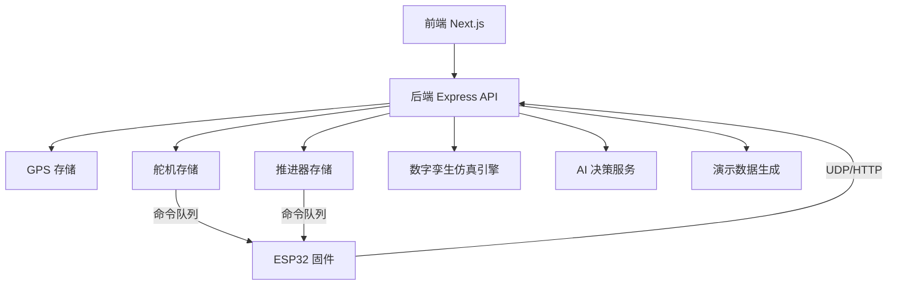
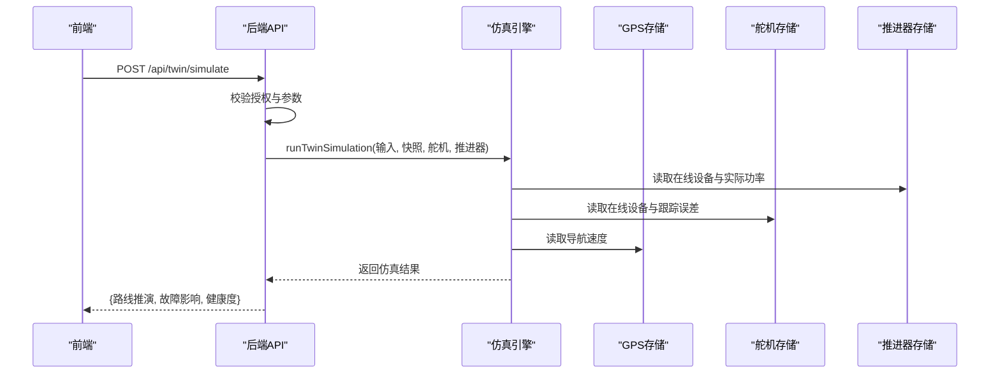
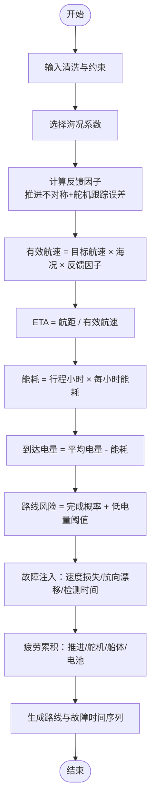
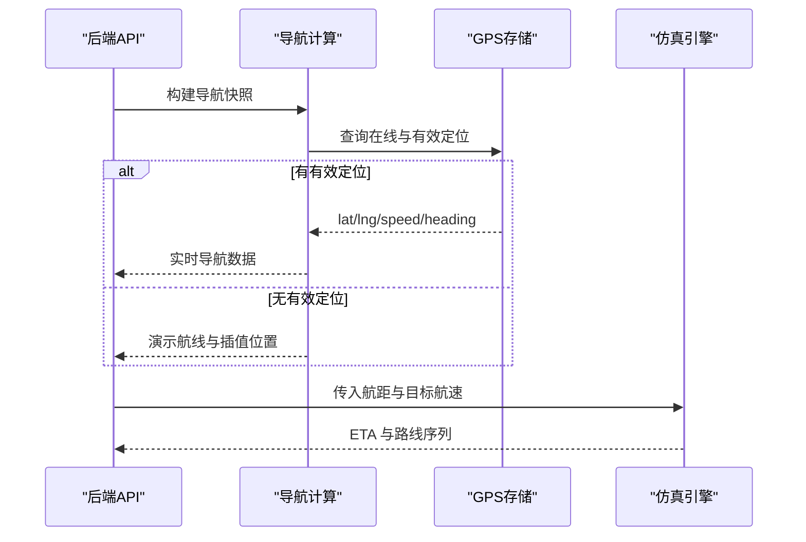
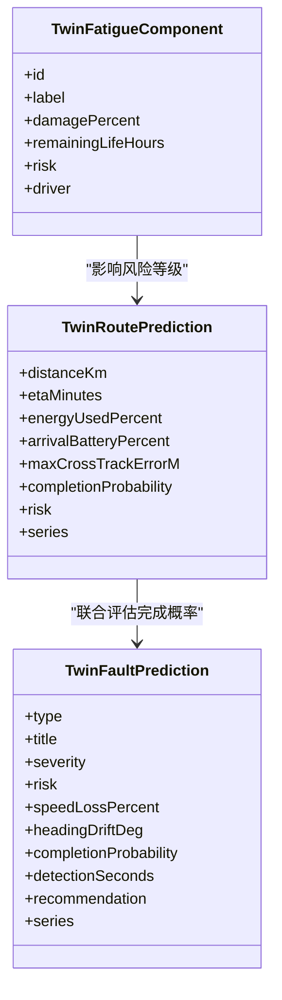
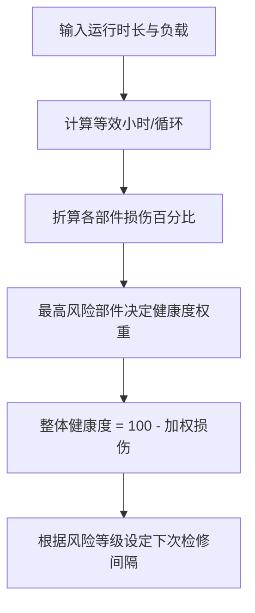
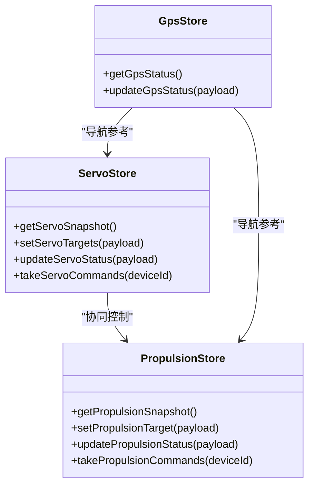
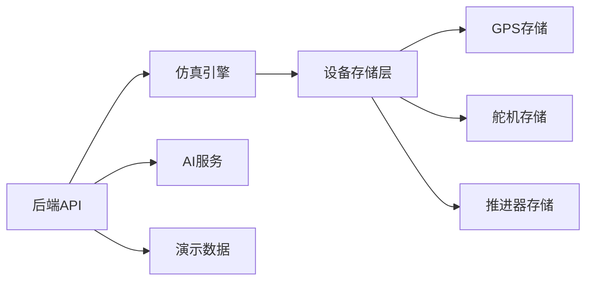

# 数字孪生仿真

<cite>
**本文引用的文件**
- [twin-simulator.ts](file://fishery-digital-twin-platform/apps/backend/src/twin-simulator.ts)
- [index.ts](file://fishery-digital-twin-platform/apps/backend/src/index.ts)
- [propulsion-store.ts](file://fishery-digital-twin-platform/apps/backend/src/propulsion-store.ts)
- [servo-store.ts](file://fishery-digital-twin-platform/apps/backend/src/servo-store.ts)
- [gps-store.ts](file://fishery-digital-twin-platform/apps/backend/src/gps-store.ts)
- [mock-data.ts](file://fishery-digital-twin-platform/apps/backend/src/mock-data.ts)
- [ai-service.ts](file://fishery-digital-twin-platform/apps/backend/src/ai-service.ts)
- [index.ts（共享类型）](file://fishery-digital-twin-platform/packages/shared/src/index.ts)
- [README.md](file://fishery-digital-twin-platform/README.md)
</cite>

## 目录
1. [简介](#简介)
2. [项目结构](#项目结构)
3. [核心组件](#核心组件)
4. [架构总览](#架构总览)
5. [详细组件分析](#详细组件分析)
6. [依赖关系分析](#依赖关系分析)
7. [性能与可扩展性](#性能与可扩展性)
8. [故障排查指南](#故障排查指南)
9. [结论](#结论)
10. [附录：场景设计指南](#附录：场景设计指南)

## 简介
本系统为智慧渔业巡检船的数字孪生平台，提供虚拟环境推演、故障模拟、健康度评估、航线规划与ETA预测等能力。后端以 Express 服务为核心，聚合水质、电池、导航、GPS、舵机与推进器状态，并通过统一的数字孪生接口输出可解释的仿真结果。前端负责可视化展示与控制交互，固件侧通过 UDP 自动发现与 HTTP 上报设备状态。

## 项目结构
- apps/backend：Express 后端，包含仿真引擎、设备存储、AI 报告生成、数据持久化与 API 路由。
- apps/frontend：Next.js 前端，提供仪表盘、三维孪生、地图与控制系统。
- packages/shared：前后端共享 TypeScript 类型定义，统一输入输出契约。
- firmware/esp32：ESP32 固件，负责传感器采集、执行机构控制与网络通信。
- docs：项目说明、安全与网络配置、最终检查清单等文档。

图表来源
- [index.ts:56-110](file://fishery-digital-twin-platform/apps/backend/src/index.ts#L56-L110)
- [propulsion-store.ts:166-231](file://fishery-digital-twin-platform/apps/backend/src/propulsion-store.ts#L166-L231)
- [servo-store.ts:106-153](file://fishery-digital-twin-platform/apps/backend/src/servo-store.ts#L106-L153)
- [gps-store.ts:59-102](file://fishery-digital-twin-platform/apps/backend/src/gps-store.ts#L59-L102)
- [twin-simulator.ts:74-253](file://fishery-digital-twin-platform/apps/backend/src/twin-simulator.ts#L74-L253)
- [ai-service.ts:167-232](file://fishery-digital-twin-platform/apps/backend/src/ai-service.ts#L167-L232)
- [mock-data.ts:114-176](file://fishery-digital-twin-platform/apps/backend/src/mock-data.ts#L114-L176)

章节来源
- [README.md:1-208](file://fishery-digital-twin-platform/README.md#L1-L208)

## 核心组件
- 数字孪生仿真引擎：基于输入参数与实时快照，计算航线能耗、ETA、完成概率、故障影响与健康度。
- 设备存储层：维护 GPS、舵机、推进器的在线状态、目标与实际值、命令队列与超时清理。
- AI 决策服务：基于水质历史与电池状态生成风险等级与建议；可选接入外部大模型。
- 演示数据生成：构造符合真实水体特征的时序数据与导航轨迹，用于演示与调试。
- 统一类型契约：在 shared 包中定义所有输入输出结构，确保前后端一致。

章节来源
- [twin-simulator.ts:74-253](file://fishery-digital-twin-platform/apps/backend/src/twin-simulator.ts#L74-L253)
- [propulsion-store.ts:149-319](file://fishery-digital-twin-platform/apps/backend/src/propulsion-store.ts#L149-L319)
- [servo-store.ts:89-184](file://fishery-digital-twin-platform/apps/backend/src/servo-store.ts#L89-L184)
- [gps-store.ts:46-102](file://fishery-digital-twin-platform/apps/backend/src/gps-store.ts#L46-L102)
- [ai-service.ts:49-122](file://fishery-digital-twin-platform/apps/backend/src/ai-service.ts#L49-L122)
- [mock-data.ts:114-176](file://fishery-digital-twin-platform/apps/backend/src/mock-data.ts#L114-L176)
- [index.ts（共享类型）:209-287](file://fishery-digital-twin-platform/packages/shared/src/index.ts#L209-L287)

## 架构总览
后端暴露 REST 接口，前端调用 /api/twin/simulate 触发仿真。仿真引擎读取当前平台快照、舵机与推进器状态，结合海况、航速、故障注入与运行时长，输出航线推演、故障影响与健康度评估。设备存储层维护命令队列并支持 TTL 清理，保证离线设备不会接收无效指令。

图表来源
- [index.ts:540-555](file://fishery-digital-twin-platform/apps/backend/src/index.ts#L540-L555)
- [twin-simulator.ts:74-253](file://fishery-digital-twin-platform/apps/backend/src/twin-simulator.ts#L74-L253)
- [propulsion-store.ts:149-164](file://fishery-digital-twin-platform/apps/backend/src/propulsion-store.ts#L149-L164)
- [servo-store.ts:89-104](file://fishery-digital-twin-platform/apps/backend/src/servo-store.ts#L89-L104)
- [gps-store.ts:55-57](file://fishery-digital-twin-platform/apps/backend/src/gps-store.ts#L55-L57)

## 详细组件分析

### 仿真引擎与时间步进机制
- 输入清洗与约束：对航距、目标航速、海况、故障类型与严重度、运行时长、日动作次数进行边界裁剪与四舍五入。
- 物理模型：
  - 海况系数：根据 calm/moderate/rough 调整速度、负载与横向偏差。
  - 反馈因子：考虑推进左右不对称与舵机跟踪误差，降低有效航速。
  - 能耗模型：基于目标航速、海况负载与实测电机功率估算每小时能耗，进而得到行程能耗与到达电量。
- 时间步进：将 ETA 分钟数划分为固定步长序列，逐点计算距离、速度、电量变化，形成路线时间序列。
- 故障模拟：按故障类型与严重度计算速度损失、航向漂移、检测时间与完成概率，生成正常与故障速度对比序列。
- 健康度评估：综合推进、舵机、船体、电池等效小时或循环次数，计算各部件损伤百分比与剩余寿命，汇总整体健康度与下次检修建议。

图表来源
- [twin-simulator.ts:35-50](file://fishery-digital-twin-platform/apps/backend/src/twin-simulator.ts#L35-L50)
- [twin-simulator.ts:81-116](file://fishery-digital-twin-platform/apps/backend/src/twin-simulator.ts#L81-L116)
- [twin-simulator.ts:118-153](file://fishery-digital-twin-platform/apps/backend/src/twin-simulator.ts#L118-L153)
- [twin-simulator.ts:155-189](file://fishery-digital-twin-platform/apps/backend/src/twin-simulator.ts#L155-L189)

章节来源
- [twin-simulator.ts:74-253](file://fishery-digital-twin-platform/apps/backend/src/twin-simulator.ts#L74-L253)

### 航线规划算法
- 路径计算：使用输入航距与有效航速推导 ETA；若存在 GPS 定位，则以实际速度与航向更新导航信息。
- 距离估算：按时间序列线性插值里程，叠加海况引起的速度脉动。
- ETA 预测：基于有效航速与航距计算分钟级 ETA；同时考虑完成概率与风险等级。
- 导航数据：若无 GPS 有效定位，则回退到演示航线与位置插值，标注数据来源。

图表来源
- [index.ts:197-222](file://fishery-digital-twin-platform/apps/backend/src/index.ts#L197-L222)
- [mock-data.ts:151-176](file://fishery-digital-twin-platform/apps/backend/src/mock-data.ts#L151-L176)
- [twin-simulator.ts:92-116](file://fishery-digital-twin-platform/apps/backend/src/twin-simulator.ts#L92-L116)

章节来源
- [index.ts:197-222](file://fishery-digital-twin-platform/apps/backend/src/index.ts#L197-L222)
- [mock-data.ts:151-176](file://fishery-digital-twin-platform/apps/backend/src/mock-data.ts#L151-L176)
- [twin-simulator.ts:92-116](file://fishery-digital-twin-platform/apps/backend/src/twin-simulator.ts#L92-L116)

### 故障模拟系统
- 设备故障注入：支持“单舵机卡滞”“推进电机降额”“执行机构反馈丢失”，分别对应不同的速度损失、航向漂移与检测时间。
- 性能退化：按严重度线性或分段放大速度损失，并在时间序列上呈现渐进式降级。
- 连锁反应：航向漂移与速度损失共同影响完成概率与风险等级；低电量与高横向偏差进一步降低成功率。
- 推荐策略：每种故障附带操作建议，如切换降级控制、限制航速、冻结目标值等待恢复。

图表来源
- [index.ts（共享类型）:232-274](file://fishery-digital-twin-platform/packages/shared/src/index.ts#L232-L274)
- [twin-simulator.ts:118-189](file://fishery-digital-twin-platform/apps/backend/src/twin-simulator.ts#L118-L189)

章节来源
- [twin-simulator.ts:118-189](file://fishery-digital-twin-platform/apps/backend/src/twin-simulator.ts#L118-L189)
- [index.ts（共享类型）:232-274](file://fishery-digital-twin-platform/packages/shared/src/index.ts#L232-L274)

### 健康度评估模型
- 部件磨损：
  - 推进电机与轴系：基于等效小时与负载修正，折算损伤与剩余寿命。
  - 舵机与连杆：依据日动作次数与跟踪误差折算循环寿命。
  - 船体连接结构：累计等效小时与海况载荷修正。
  - 动力电池：折算循环次数与当前均值电量。
- 疲劳分析：取最高风险部件与平均损伤加权计算整体健康度。
- 寿命预测：给出下次检修间隔，高风险时缩短至小时级，低风险时延长至数百小时。

图表来源
- [twin-simulator.ts:155-189](file://fishery-digital-twin-platform/apps/backend/src/twin-simulator.ts#L155-L189)

章节来源
- [twin-simulator.ts:155-189](file://fishery-digital-twin-platform/apps/backend/src/twin-simulator.ts#L155-L189)

### 仿真输入输出
- 输入参数：
  - 航距（km）、目标航速（m/s）、海况级别、故障类型与严重度、运行时长（h）、日舵机动作次数。
  - 平台快照：水质、电池、导航、AI 报告、船体状态。
  - 设备快照：舵机与推进器在线数量、实际功率与角度误差。
- 输出结果：
  - 路线推演：ETA、能耗百分比、到达电量、最大横向偏差、完成概率、风险等级与时间序列。
  - 故障影响：速度损失、航向漂移、检测时间、完成概率、风险等级与时间序列。
  - 健康度：整体健康度、下次检修间隔、最高风险部件与各部件详情。
  - 置信度与假设：说明数据来源与模型局限。

章节来源
- [index.ts（共享类型）:209-287](file://fishery-digital-twin-platform/packages/shared/src/index.ts#L209-L287)
- [twin-simulator.ts:74-253](file://fishery-digital-twin-platform/apps/backend/src/twin-simulator.ts#L74-L253)

### 设备存储与命令队列
- 舵机存储：维护多块舵机板的目标角度与实际角度，限制保留通道与最大角度，生成命令队列并 TTL 清理。
- 推进器存储：支持手动/网页/自动模式，混合油门与转向或直接左右通道输出，限制最大功率与冷却周期。
- GPS 存储：校验坐标范围与有效性，记录卫星数、HDOP、高度、速度与航向，判断在线与定位获取。

图表来源
- [servo-store.ts:89-184](file://fishery-digital-twin-platform/apps/backend/src/servo-store.ts#L89-L184)
- [propulsion-store.ts:149-319](file://fishery-digital-twin-platform/apps/backend/src/propulsion-store.ts#L149-L319)
- [gps-store.ts:46-102](file://fishery-digital-twin-platform/apps/backend/src/gps-store.ts#L46-L102)

章节来源
- [servo-store.ts:89-184](file://fishery-digital-twin-platform/apps/backend/src/servo-store.ts#L89-L184)
- [propulsion-store.ts:149-319](file://fishery-digital-twin-platform/apps/backend/src/propulsion-store.ts#L149-L319)
- [gps-store.ts:46-102](file://fishery-digital-twin-platform/apps/backend/src/gps-store.ts#L46-L102)

## 依赖关系分析
- 耦合关系：
  - 仿真引擎强依赖设备快照与平台快照，弱依赖 AI 报告与演示数据。
  - 设备存储之间通过 API 层解耦，避免直接相互调用。
  - GPS 存储影响导航数据质量，间接影响 ETA 与完成概率。
- 外部依赖：
  - 可选 DeepSeek API 用于增强 AI 报告；未配置时回退本地逻辑。
  - UDP 自动发现用于 ESP32 定位后端地址。
- 潜在循环依赖：未发现代码级循环导入；模块职责清晰。

图表来源
- [index.ts:540-555](file://fishery-digital-twin-platform/apps/backend/src/index.ts#L540-L555)
- [ai-service.ts:167-232](file://fishery-digital-twin-platform/apps/backend/src/ai-service.ts#L167-L232)
- [mock-data.ts:114-176](file://fishery-digital-twin-platform/apps/backend/src/mock-data.ts#L114-L176)

章节来源
- [index.ts:540-555](file://fishery-digital-twin-platform/apps/backend/src/index.ts#L540-L555)
- [ai-service.ts:167-232](file://fishery-digital-twin-platform/apps/backend/src/ai-service.ts#L167-L232)
- [mock-data.ts:114-176](file://fishery-digital-twin-platform/apps/backend/src/mock-data.ts#L114-L176)

## 性能与可扩展性
- 性能特征：
  - 仿真计算轻量，时间复杂度与序列长度线性相关；ETA 与能耗计算为常数时间。
  - 设备命令队列 TTL 清理避免内存增长；历史数据切片限制最大长度。
- 可扩展点：
  - 增加更多海况模型与风浪耦合项。
  - 引入电流、振动、应变传感器校准疲劳模型。
  - 扩展故障类型与连锁反应规则库。
  - 接入更丰富的导航算法与动态避障。

[本节为通用指导，不直接分析具体文件]

## 故障排查指南
- 仿真失败：
  - 检查授权令牌与 CORS 配置；确认输入参数在合法范围内。
  - 查看日志是否记录“数字孪生推演失败”。
- 设备离线：
  - 舵机/推进器离线时无法下发命令；需确认心跳与 last_seen 时间戳。
  - GPS 未有效定位时导航回退到演示数据。
- 网络问题：
  - UDP 自动发现失败可能导致固件无法找到后端；检查端口与防火墙。
  - 热点隔离会导致局域网通信失败。

章节来源
- [index.ts:143-157](file://fishery-digital-twin-platform/apps/backend/src/index.ts#L143-L157)
- [index.ts:559-561](file://fishery-digital-twin-platform/apps/backend/src/index.ts#L559-L561)
- [propulsion-store.ts:178-180](file://fishery-digital-twin-platform/apps/backend/src/propulsion-store.ts#L178-L180)
- [servo-store.ts:109-111](file://fishery-digital-twin-platform/apps/backend/src/servo-store.ts#L109-L111)
- [gps-store.ts:59-102](file://fishery-digital-twin-platform/apps/backend/src/gps-store.ts#L59-L102)
- [README.md:143-180](file://fishery-digital-twin-platform/README.md#L143-L180)

## 结论
该数字孪生仿真系统以清晰的模块化架构实现了虚拟环境推演与故障模拟，结合设备状态与海况模型，提供可解释的航线 ETA、完成概率与健康度评估。通过统一类型契约与命令队列机制，系统具备良好的可扩展性与稳定性。未来可通过传感器校准与更精细的物理模型进一步提升预测精度。

[本节为总结，不直接分析具体文件]

## 附录：场景设计指南
- 创建自定义测试用例：
  - 设置不同航距与目标航速，观察 ETA 与能耗变化。
  - 切换海况级别，验证速度衰减与横向偏差。
  - 注入不同故障类型与严重度，评估速度损失与航向漂移。
  - 调整运行时长与日动作次数，观察疲劳累积与健康度下降。
- 演示场景：
  - 使用演示数据生成器构造连续水质样本与导航轨迹。
  - 在无 GPS 环境下展示离线地图与参考航线。
  - 结合 AI 报告展示风险等级与建议。

章节来源
- [mock-data.ts:114-176](file://fishery-digital-twin-platform/apps/backend/src/mock-data.ts#L114-L176)
- [twin-simulator.ts:35-50](file://fishery-digital-twin-platform/apps/backend/src/twin-simulator.ts#L35-L50)
- [twin-simulator.ts:118-153](file://fishery-digital-twin-platform/apps/backend/src/twin-simulator.ts#L118-L153)
- [ai-service.ts:49-122](file://fishery-digital-twin-platform/apps/backend/src/ai-service.ts#L49-L122)