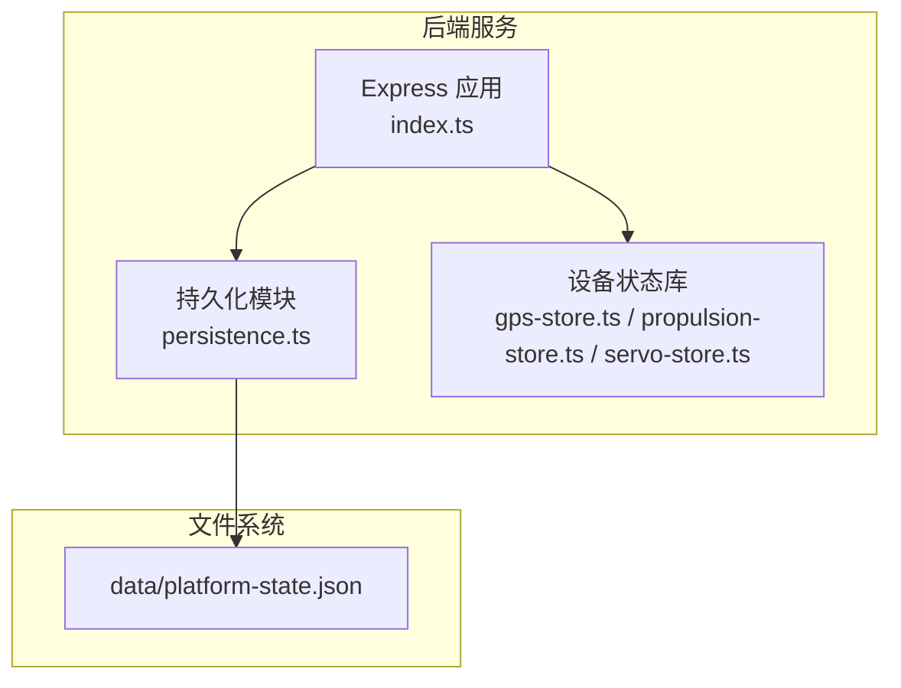
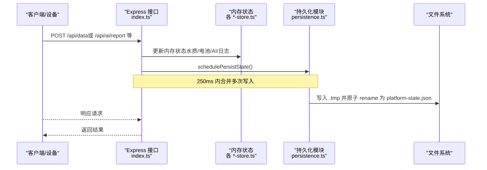
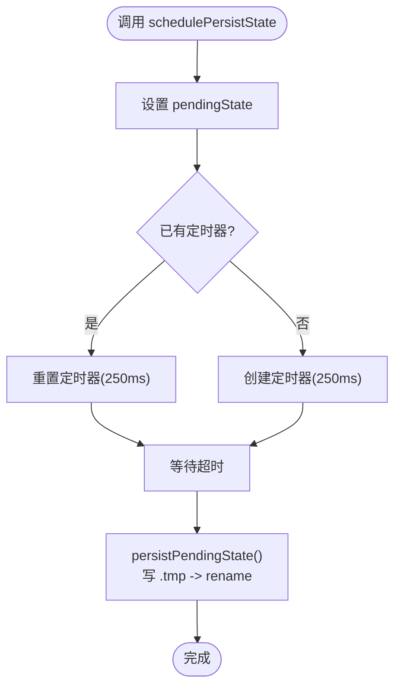
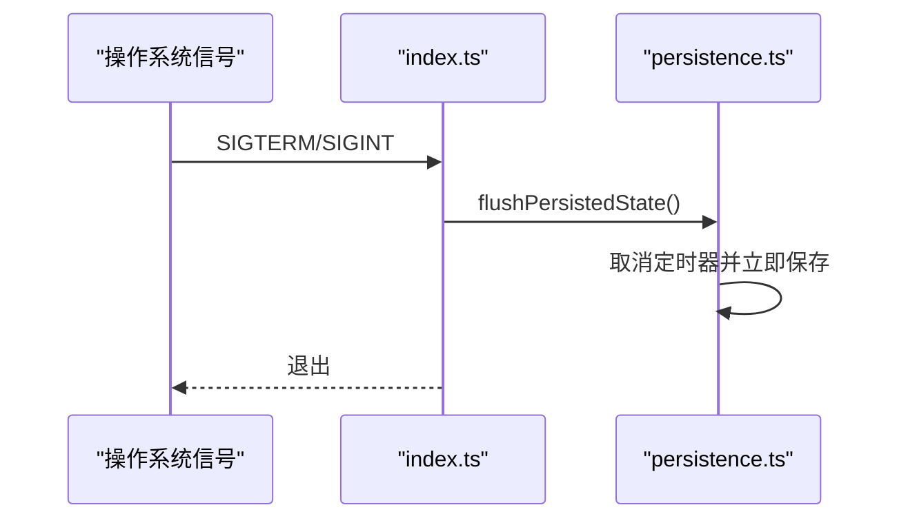
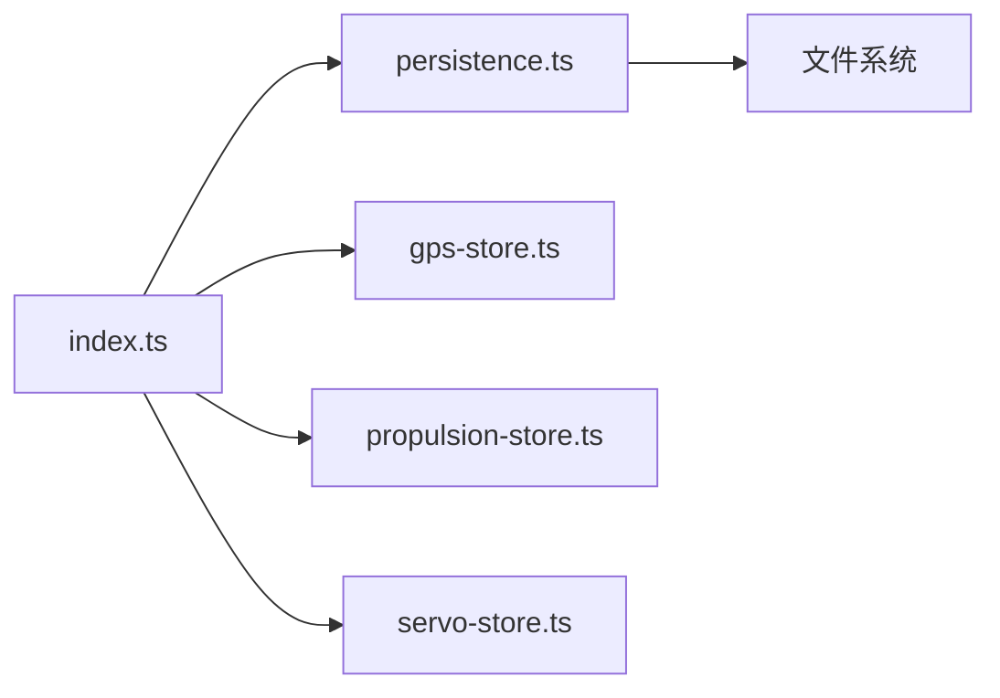

# 数据持久化

<cite>
**本文引用的文件**
- [persistence.ts](file://fishery-digital-twin-platform/apps/backend/src/persistence.ts)
- [index.ts](file://fishery-digital-twin-platform/apps/backend/src/index.ts)
- [platform-state.json](file://fishery-digital-twin-platform/apps/backend/data/platform-state.json)
- [gps-store.ts](file://fishery-digital-twin-platform/apps/backend/src/gps-store.ts)
- [propulsion-store.ts](file://fishery-digital-twin-platform/apps/backend/src/propulsion-store.ts)
- [servo-store.ts](file://fishery-digital-twin-platform/apps/backend/src/servo-store.ts)
</cite>

## 目录
1. [简介](#简介)
2. [项目结构](#项目结构)
3. [核心组件](#核心组件)
4. [架构总览](#架构总览)
5. [详细组件分析](#详细组件分析)
6. [依赖关系分析](#依赖关系分析)
7. [性能考量](#性能考量)
8. [故障排查指南](#故障排查指南)
9. [结论](#结论)
10. [附录](#附录)

## 简介
本文件面向“渔业数字孪生平台”后端的数据持久化子系统，聚焦于基于 JSON 的文件存储策略与文件管理机制。文档覆盖：
- 数据存储结构：水质历史、电池状态、AI 报告、系统日志的组织方式
- 写入策略：批量写入、事务性落盘、并发访问控制
- 读取机制：文件加载、内存缓存、增量更新
- 备份与恢复：自动备份（临时文件原子替换）、手动导出（API 暴露）、灾难恢复（启动时加载）
- 清理策略：历史数据裁剪、存储空间优化、日志轮转
- 迁移工具：版本升级与数据结构变更的迁移建议与实践

## 项目结构
后端以 Express 服务为核心，集中管理运行时内存状态，并通过统一的持久化模块将关键状态落盘到 JSON 文件。关键路径如下：
- 持久化实现：apps/backend/src/persistence.ts
- 主服务入口与业务接口：apps/backend/src/index.ts
- 持久化文件位置：apps/backend/data/platform-state.json
- 设备状态内存库（GPS/推进器/舵机）：apps/backend/src/*-store.ts

图表来源
- [index.ts:78-114](file://fishery-digital-twin-platform/apps/backend/src/index.ts#L78-L114)
- [persistence.ts:12-29](file://fishery-digital-twin-platform/apps/backend/src/persistence.ts#L12-L29)

章节来源
- [index.ts:78-114](file://fishery-digital-twin-platform/apps/backend/src/index.ts#L78-L114)
- [persistence.ts:12-29](file://fishery-digital-twin-platform/apps/backend/src/persistence.ts#L12-L29)

## 核心组件
- 持久化模块（persistence.ts）
  - 定义统一的状态结构：水质历史、电池数组、最新 AI 报告、系统日志
  - 提供加载、调度保存、强制刷写三个能力
  - 使用临时文件 + 原子重命名保证落盘一致性
- 主服务（index.ts）
  - 启动时加载持久化状态到内存
  - 在关键写路径触发批量保存
  - 进程退出前强制刷写
- 设备状态库（*-store.ts）
  - 维护 GPS、推进器、舵机的内存状态与命令队列
  - 通过快照 API 对外暴露当前状态

章节来源
- [persistence.ts:5-10](file://fishery-digital-twin-platform/apps/backend/src/persistence.ts#L5-L10)
- [index.ts:78-90](file://fishery-digital-twin-platform/apps/backend/src/index.ts#L78-L90)
- [gps-store.ts:55-103](file://fishery-digital-twin-platform/apps/backend/src/gps-store.ts#L55-L103)
- [propulsion-store.ts:149-231](file://fishery-digital-twin-platform/apps/backend/src/propulsion-store.ts#L149-L231)
- [servo-store.ts:89-153](file://fishery-digital-twin-platform/apps/backend/src/servo-store.ts#L89-L153)

## 架构总览
数据流从传感器/模拟源进入后端，经业务逻辑处理后写入内存，再由持久化模块按策略落盘。

图表来源
- [index.ts:367-430](file://fishery-digital-twin-platform/apps/backend/src/index.ts#L367-L430)
- [index.ts:456-473](file://fishery-digital-twin-platform/apps/backend/src/index.ts#L456-L473)
- [persistence.ts:17-29](file://fishery-digital-twin-platform/apps/backend/src/persistence.ts#L17-L29)

## 详细组件分析

### 持久化模块（persistence.ts）
- 状态结构
  - waterHistory：水质历史数组
  - batteries：电池状态数组
  - latestAiReport：最新 AI 报告（可为空）
  - systemLogs：系统日志数组
- 文件路径
  - 数据目录由环境变量 UISYS_DATA_DIR 决定，默认位于进程工作目录下的 data
  - 状态文件名为 platform-state.json
- 写入策略
  - 批量写入：schedulePersistState 将新状态放入 pendingState，并在 250ms 内合并多次调用，减少磁盘 IO
  - 事务处理：先写 .tmp 再原子 rename，避免部分写入导致文件损坏
  - 并发安全：单线程 Node.js 事件循环下无竞态；unref 定时器确保不阻塞进程退出
- 读取机制
  - loadPersistedState 读取并校验结构，对水样历史取最近 180 条，日志取最近 80 条，防止文件过大
  - 失败时记录错误并返回 null，不影响服务启动
- 刷新与关闭
  - flushPersistedState 立即执行一次保存，用于优雅停机

图表来源
- [persistence.ts:17-29](file://fishery-digital-twin-platform/apps/backend/src/persistence.ts#L17-L29)
- [persistence.ts:51-67](file://fishery-digital-twin-platform/apps/backend/src/persistence.ts#L51-L67)

章节来源
- [persistence.ts:5-10](file://fishery-digital-twin-platform/apps/backend/src/persistence.ts#L5-L10)
- [persistence.ts:12-29](file://fishery-digital-twin-platform/apps/backend/src/persistence.ts#L12-L29)
- [persistence.ts:32-49](file://fishery-digital-twin-platform/apps/backend/src/persistence.ts#L32-L49)
- [persistence.ts:51-67](file://fishery-digital-twin-platform/apps/backend/src/persistence.ts#L51-L67)

### 主服务集成（index.ts）
- 启动加载
  - 启动时调用 loadPersistedState，若存在则回填内存中的 waterHistory、batteries、latestAiReport、systemLogs
- 写入触发点
  - 接收传感器数据后更新内存并调用 persistPlatformState（即 schedulePersistState）
  - 生成 AI 报告后同样触发保存
  - 新增系统日志后触发保存
- 优雅停机
  - 捕获 SIGINT/SIGTERM，调用 flushPersistedState 确保最后一次状态落盘

图表来源
- [index.ts:581-599](file://fishery-digital-twin-platform/apps/backend/src/index.ts#L581-L599)
- [persistence.ts:61-67](file://fishery-digital-twin-platform/apps/backend/src/persistence.ts#L61-L67)

章节来源
- [index.ts:78-90](file://fishery-digital-twin-platform/apps/backend/src/index.ts#L78-L90)
- [index.ts:112-129](file://fishery-digital-twin-platform/apps/backend/src/index.ts#L112-L129)
- [index.ts:367-430](file://fishery-digital-twin-platform/apps/backend/src/index.ts#L367-L430)
- [index.ts:456-473](file://fishery-digital-twin-platform/apps/backend/src/index.ts#L456-L473)
- [index.ts:581-599](file://fishery-digital-twin-platform/apps/backend/src/index.ts#L581-L599)

### 设备状态内存库（gps-store.ts / propulsion-store.ts / servo-store.ts）
- 职责
  - 维护设备在线状态、目标与实际值、命令队列
  - 提供快照查询与命令消费接口
- 与持久化的关系
  - 这些模块主要服务于实时控制与展示，其状态不直接写入 platform-state.json
  - 但平台快照会聚合它们的状态，供前端展示与 AI 分析

章节来源
- [gps-store.ts:55-103](file://fishery-digital-twin-platform/apps/backend/src/gps-store.ts#L55-L103)
- [propulsion-store.ts:149-231](file://fishery-digital-twin-platform/apps/backend/src/propulsion-store.ts#L149-L231)
- [servo-store.ts:89-153](file://fishery-digital-twin-platform/apps/backend/src/servo-store.ts#L89-L153)

## 依赖关系分析
- index.ts 依赖 persistence.ts 进行状态落盘
- persistence.ts 依赖 Node.js fs/path 进行文件操作
- 设备状态库独立于持久化模块，通过 API 被 index.ts 聚合

图表来源
- [index.ts:21-44](file://fishery-digital-twin-platform/apps/backend/src/index.ts#L21-L44)
- [persistence.ts:1-3](file://fishery-digital-twin-platform/apps/backend/src/persistence.ts#L1-L3)

章节来源
- [index.ts:21-44](file://fishery-digital-twin-platform/apps/backend/src/index.ts#L21-L44)
- [persistence.ts:1-3](file://fishery-digital-twin-platform/apps/backend/src/persistence.ts#L1-L3)

## 性能考量
- 批量写入
  - 250ms 窗口合并多次写入，降低频繁 IO 带来的抖动
- 原子落盘
  - 临时文件 + rename 避免半写文件，提升可靠性
- 内存裁剪
  - 加载时限制 waterHistory 最多 180 条、systemLogs 最多 80 条，控制文件大小与加载时间
- 非阻塞定时器
  - unref 定时器不会阻止进程退出，保障优雅停机
- 建议
  - 在高写入频率场景下，可考虑增大批处理窗口或引入 WAL（预写日志）进一步降低丢失风险
  - 对超大历史数据，可考虑分片存储（如按天分文件）

[本节为通用指导，不直接分析具体文件]

## 故障排查指南
- 无法加载持久化状态
  - 现象：loadPersistedState 抛出“持久化状态结构无效”并返回 null
  - 可能原因：文件格式损坏或缺少必要字段
  - 处理：检查 platform-state.json 是否完整；必要时删除损坏文件让服务重建初始状态
- 写入失败
  - 现象：控制台输出“无法持久化平台状态”
  - 可能原因：磁盘空间不足、权限问题、路径不存在
  - 处理：确认 data 目录存在且可写；检查磁盘空间与权限
- 数据不一致
  - 现象：重启后数据缺失或异常
  - 可能原因：未触发 flush 或进程被强杀
  - 处理：确保服务正常退出；如需即时落盘，调用 flushPersistedState
- 日志过多导致文件膨胀
  - 现象：platform-state.json 体积增长过快
  - 处理：已内置日志裁剪（最近 80 条），可通过调整裁剪阈值进一步优化

章节来源
- [persistence.ts:22-29](file://fishery-digital-twin-platform/apps/backend/src/persistence.ts#L22-L29)
- [persistence.ts:32-49](file://fishery-digital-twin-platform/apps/backend/src/persistence.ts#L32-L49)
- [index.ts:581-599](file://fishery-digital-twin-platform/apps/backend/src/index.ts#L581-L599)

## 结论
该数据持久化子系统采用轻量级 JSON 文件存储，结合批量写入与原子落盘，满足数字孪生平台对关键状态（水质历史、电池、AI 报告、系统日志）的可靠保存需求。通过启动加载与优雅停机刷写，实现了基本的容错与恢复能力。对于更高吞吐与更强一致性的场景，可在现有基础上引入 WAL、分片归档与压缩等增强方案。

[本节为总结，不直接分析具体文件]

## 附录

### JSON 文件存储结构说明
- 文件位置：data/platform-state.json
- 顶层字段
  - waterHistory：WaterData[]，包含时间戳、来源、水温、浊度、pH、溶解氧、氨氮、电导率、状态等
  - batteries：BatteryData[]，包含电量、电压、状态、更新时间等
  - latestAiReport：AIReport | null，最新 AI 分析报告
  - systemLogs：SystemLog[]，包含级别、标题、详情、来源、时间戳等

章节来源
- [persistence.ts:5-10](file://fishery-digital-twin-platform/apps/backend/src/persistence.ts#L5-L10)
- [platform-state.json:1-12](file://fishery-digital-twin-platform/apps/backend/data/platform-state.json#L1-L12)

### 数据写入策略
- 批量写入
  - 通过 schedulePersistState 在 250ms 内合并多次写入
- 事务处理
  - 先写 .tmp 再原子 rename，避免部分写入
- 并发访问控制
  - 单线程事件循环天然避免并发写冲突；定时器 unref 避免阻塞退出

章节来源
- [persistence.ts:17-29](file://fishery-digital-twin-platform/apps/backend/src/persistence.ts#L17-L29)
- [persistence.ts:51-67](file://fishery-digital-twin-platform/apps/backend/src/persistence.ts#L51-L67)
- [index.ts:112-129](file://fishery-digital-twin-platform/apps/backend/src/index.ts#L112-L129)

### 数据读取机制
- 文件加载
  - 启动时 loadPersistedState 读取并校验结构
- 内存缓存
  - 加载后的数据驻留内存，作为后续读写的基础
- 增量更新
  - 每次写入仅追加/更新内存，定时批量落盘

章节来源
- [index.ts:78-90](file://fishery-digital-twin-platform/apps/backend/src/index.ts#L78-L90)
- [persistence.ts:32-49](file://fishery-digital-twin-platform/apps/backend/src/persistence.ts#L32-L49)

### 备份与恢复
- 自动备份
  - 通过 .tmp + rename 实现原子落盘，相当于隐式备份
- 手动导出
  - 通过 /api/water、/api/batteries、/api/logs 等接口获取当前内存数据，便于外部导出
- 灾难恢复
  - 启动时加载 platform-state.json；若损坏则忽略并重建初始状态

章节来源
- [persistence.ts:22-29](file://fishery-digital-twin-platform/apps/backend/src/persistence.ts#L22-L29)
- [index.ts:336-346](file://fishery-digital-twin-platform/apps/backend/src/index.ts#L336-L346)
- [index.ts:557-561](file://fishery-digital-twin-platform/apps/backend/src/index.ts#L557-L561)

### 数据清理策略
- 历史数据归档
  - 加载时限制 waterHistory 最近 180 条，避免无限增长
- 存储空间优化
  - 日志限制最近 80 条；可按需调整裁剪阈值
- 日志轮转
  - 当前为内存内裁剪；如需跨进程/跨实例共享日志，可引入按大小/时间的轮转策略

章节来源
- [persistence.ts:32-49](file://fishery-digital-twin-platform/apps/backend/src/persistence.ts#L32-L49)
- [index.ts:116-129](file://fishery-digital-twin-platform/apps/backend/src/index.ts#L116-L129)

### 数据迁移工具建议
- 版本升级与结构变更
  - 在 loadPersistedState 中增加向后兼容逻辑（如字段缺失时的默认值）
  - 对重大结构变更，可在启动时检测版本号并执行迁移脚本，生成新的 platform-state.json
  - 迁移前建议先复制一份原始文件作为回滚备份
- 实践步骤
  - 在加载后、使用前执行迁移函数
  - 迁移完成后重新触发一次 flush 确保落盘
  - 保留旧版本文件的归档目录，便于审计与回滚

[本节为通用指导，不直接分析具体文件]