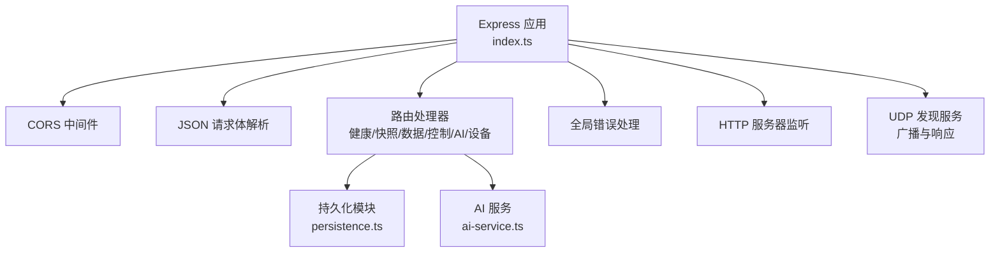
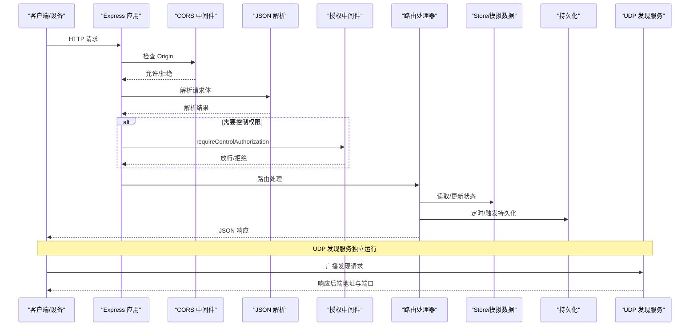
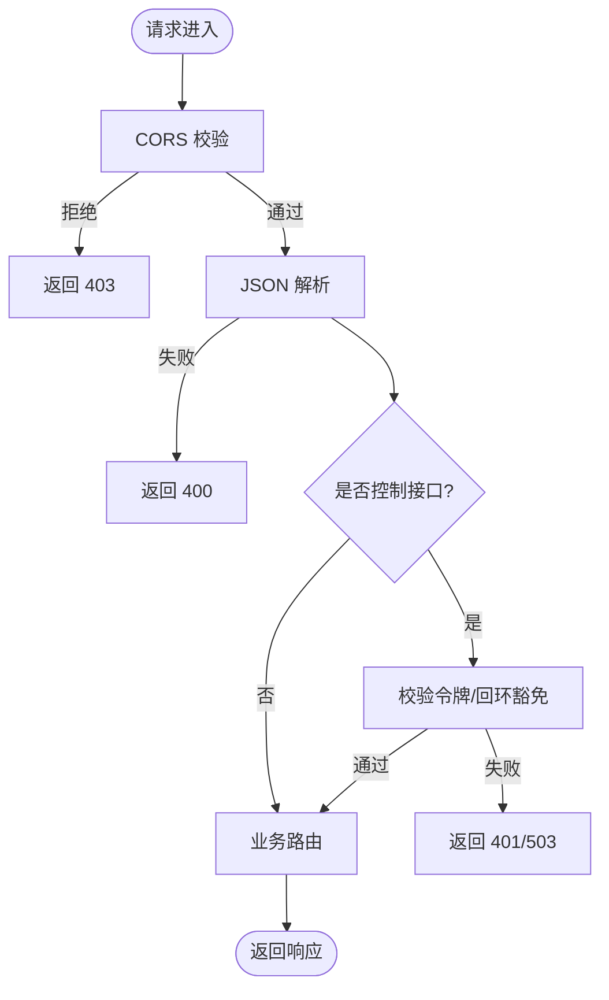
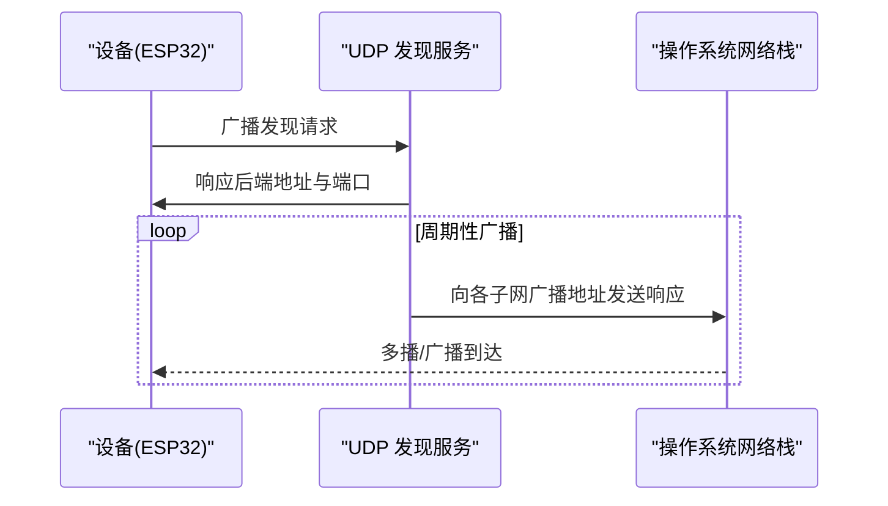
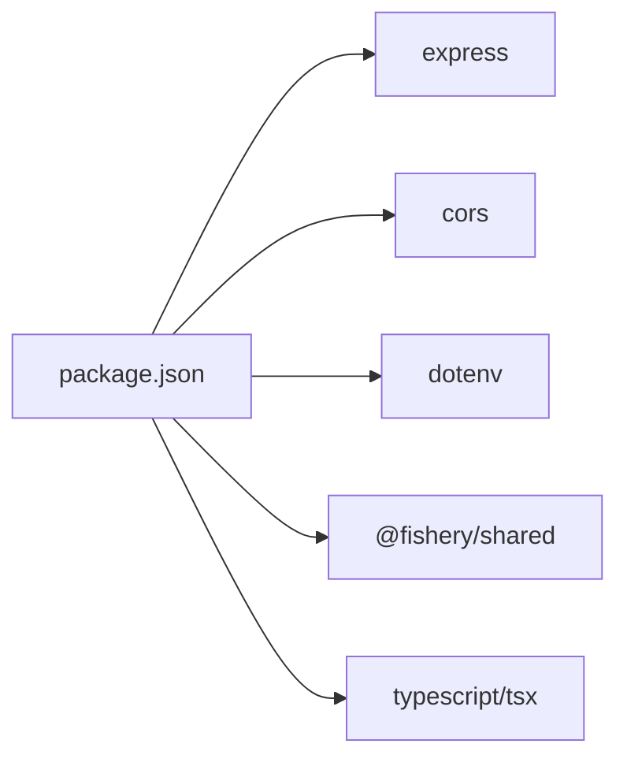

# 服务器架构

<cite>
**本文引用的文件**
- [index.ts](file://fishery-digital-twin-platform/apps/backend/src/index.ts)
- [persistence.ts](file://fishery-digital-twin-platform/apps/backend/src/persistence.ts)
- [ai-service.ts](file://fishery-digital-twin-platform/apps/backend/src/ai-service.ts)
- [package.json](file://fishery-digital-twin-platform/apps/backend/package.json)
- [configure-device-secrets.ps1](file://fishery-digital-twin-platform/scripts/configure-device-secrets.ps1)
</cite>

## 目录
1. [简介](#简介)
2. [项目结构](#项目结构)
3. [核心组件](#核心组件)
4. [架构总览](#架构总览)
5. [详细组件分析](#详细组件分析)
6. [依赖关系分析](#依赖关系分析)
7. [性能考量](#性能考量)
8. [故障排查指南](#故障排查指南)
9. [结论](#结论)
10. [附录：环境变量与配置](#附录：环境变量与配置)

## 简介
本文件面向后端开发者，系统性梳理基于 Express 的 Node.js 服务器设计与实现。内容覆盖启动流程、配置管理、中间件注册、路由组织、CORS 与请求体解析、错误处理与日志记录、UDP 设备发现服务、环境变量与端口管理、安全认证（令牌校验、本地回环豁免、跨域控制），以及扩展指南（如何新增中间件、路由与业务逻辑）。

## 项目结构
后端位于 apps/backend，采用单入口应用模式：
- 入口文件负责初始化 Express、加载配置、注册中间件、定义路由、启动 HTTP 服务与 UDP 发现服务。
- 持久化模块负责状态落盘与恢复。
- AI 服务模块提供本地报告生成与可选的外部模型调用。
- 其他 store 模块用于舵机、推进器、GPS 等设备的状态与命令队列。

图表来源
- [index.ts:56-110](file://fishery-digital-twin-platform/apps/backend/src/index.ts#L56-L110)
- [index.ts:271-318](file://fishery-digital-twin-platform/apps/backend/src/index.ts#L271-L318)
- [index.ts:322-557](file://fishery-digital-twin-platform/apps/backend/src/index.ts#L322-L557)
- [persistence.ts:12-68](file://fishery-digital-twin-platform/apps/backend/src/persistence.ts#L12-L68)
- [ai-service.ts:160-233](file://fishery-digital-twin-platform/apps/backend/src/ai-service.ts#L160-L233)

章节来源
- [index.ts:46-110](file://fishery-digital-twin-platform/apps/backend/src/index.ts#L46-L110)
- [package.json:1-27](file://fishery-digital-twin-platform/apps/backend/package.json#L1-L27)

## 核心组件
- 应用初始化与配置读取：从环境变量读取端口、主机、CORS 白名单、演示开关、传感器新鲜度阈值、操作员令牌等。
- 中间件链：CORS、JSON 解析、自定义授权中间件、业务路由、全局错误处理。
- 路由层：只读接口无需鉴权；写控接口需通过令牌校验或本地回环豁免。
- 设备发现：UDP 广播与响应，支持局域网设备自动发现后端地址与端口。
- 持久化：内存状态定时落盘，进程退出时强制刷新。
- AI 服务：本地统计报告为主，可选接入外部大模型生成决策报告。

章节来源
- [index.ts:48-76](file://fishery-digital-twin-platform/apps/backend/src/index.ts#L48-L76)
- [index.ts:101-110](file://fishery-digital-twin-platform/apps/backend/src/index.ts#L101-L110)
- [index.ts:143-157](file://fishery-digital-twin-platform/apps/backend/src/index.ts#L143-L157)
- [index.ts:271-318](file://fishery-digital-twin-platform/apps/backend/src/index.ts#L271-L318)
- [persistence.ts:12-68](file://fishery-digital-twin-platform/apps/backend/src/persistence.ts#L12-L68)
- [ai-service.ts:160-233](file://fishery-digital-twin-platform/apps/backend/src/ai-service.ts#L160-L233)

## 架构总览
下图展示请求从进入 Express 到路由处理、授权校验、业务逻辑、持久化与返回响应的完整链路，并包含 UDP 发现服务的并发运行。

图表来源
- [index.ts:101-110](file://fishery-digital-twin-platform/apps/backend/src/index.ts#L101-L110)
- [index.ts:143-157](file://fishery-digital-twin-platform/apps/backend/src/index.ts#L143-L157)
- [index.ts:322-557](file://fishery-digital-twin-platform/apps/backend/src/index.ts#L322-L557)
- [index.ts:271-318](file://fishery-digital-twin-platform/apps/backend/src/index.ts#L271-L318)
- [persistence.ts:51-68](file://fishery-digital-twin-platform/apps/backend/src/persistence.ts#L51-L68)

## 详细组件分析

### 启动流程与配置管理
- 环境变量加载：在应用启动时加载 .env，读取 PORT、HOST、UISYS_DISCOVERY_PORT、CORS_ORIGIN、UISYS_API_TOKEN、演示与传感器新鲜度等配置。
- 端口与主机：PORT 默认 5000，HOST 默认 0.0.0.0；端口范围校验失败将抛出错误。
- CORS 策略：若未显式配置 CORS_ORIGIN，则默认允许本地前端地址；否则按逗号分隔的白名单匹配。
- 演示与传感器新鲜度：可开启演示水质数据注入；根据最近真实数据时间判断传感器是否“在线”。
- 令牌与安全：当配置了 UISYS_API_TOKEN 后，非本地回环的控制接口必须携带 X-UISYS-Token 头，使用常量时间比较防止时序攻击。

章节来源
- [index.ts:46-76](file://fishery-digital-twin-platform/apps/backend/src/index.ts#L46-L76)
- [index.ts:131-157](file://fishery-digital-twin-platform/apps/backend/src/index.ts#L131-L157)
- [configure-device-secrets.ps1:111-116](file://fishery-digital-twin-platform/scripts/configure-device-secrets.ps1#L111-L116)

### 中间件注册与路由组织
- 中间件顺序：先 CORS，再 JSON 解析，随后是各路由；最后注册全局错误处理中间件。
- 路由分组：
  - 只读接口：健康检查、快照、水质历史、电池、导航、GPS、船态、AI 状态与报告等。
  - 控制接口：GPS 状态上报、传感器数据上报、舵机/推进器控制与状态、数字孪生推演等，均受授权中间件保护。
  - 日志接口：系统日志查询。
- 授权中间件：本地回环地址直接放行；否则要求配置令牌且请求头携带正确令牌。

图表来源
- [index.ts:101-110](file://fishery-digital-twin-platform/apps/backend/src/index.ts#L101-L110)
- [index.ts:143-157](file://fishery-digital-twin-platform/apps/backend/src/index.ts#L143-L157)
- [index.ts:322-557](file://fishery-digital-twin-platform/apps/backend/src/index.ts#L322-L557)

章节来源
- [index.ts:101-110](file://fishery-digital-twin-platform/apps/backend/src/index.ts#L101-L110)
- [index.ts:143-157](file://fishery-digital-twin-platform/apps/backend/src/index.ts#L143-L157)
- [index.ts:322-557](file://fishery-digital-twin-platform/apps/backend/src/index.ts#L322-L557)

### CORS 配置与跨域控制
- 行为：仅当请求 Origin 在白名单内才允许跨域；未配置时默认允许本地开发地址。
- 错误：非白名单 Origin 会返回明确的错误信息并被全局错误处理转换为 403。

章节来源
- [index.ts:69-76](file://fishery-digital-twin-platform/apps/backend/src/index.ts#L69-L76)
- [index.ts:101-109](file://fishery-digital-twin-platform/apps/backend/src/index.ts#L101-L109)
- [index.ts:559-561](file://fishery-digital-twin-platform/apps/backend/src/index.ts#L559-L561)

### 请求体解析与参数校验
- 解析：使用内置 JSON 解析器，限制最大体积为 1MB。
- 校验：对数值型字段进行边界校验，缺失或越界将返回 400。
- 示例：传感器数据接口支持多种字段名别名，统一归一化处理。

章节来源
- [index.ts:110](file://fishery-digital-twin-platform/apps/backend/src/index.ts#L110)
- [index.ts:159-176](file://fishery-digital-twin-platform/apps/backend/src/index.ts#L159-L176)
- [index.ts:367-430](file://fishery-digital-twin-platform/apps/backend/src/index.ts#L367-L430)

### 错误处理机制
- 全局错误处理：区分 CORS 相关错误与其他错误，分别返回 403 与 500。
- 启动期错误：端口占用或权限不足时设置退出码并立即退出。
- 业务异常：路由内部 try/catch 捕获并返回 400/503 等语义化状态码。

章节来源
- [index.ts:559-561](file://fishery-digital-twin-platform/apps/backend/src/index.ts#L559-L561)
- [index.ts:573-579](file://fishery-digital-twin-platform/apps/backend/src/index.ts#L573-L579)
- [index.ts:348-430](file://fishery-digital-twin-platform/apps/backend/src/index.ts#L348-L430)

### 日志记录系统
- 系统日志：每次关键操作（如 GPS 定位、传感器数据、舵机/推进器控制、AI 报告）都会追加一条带级别、标题、详情、来源与时间的日志条目。
- 存储：内存中维护固定长度列表，并定时持久化；进程退出时强制落盘。
- 查询：提供 /api/logs 接口供前端查看。

章节来源
- [index.ts:116-129](file://fishery-digital-twin-platform/apps/backend/src/index.ts#L116-L129)
- [index.ts:348-430](file://fishery-digital-twin-platform/apps/backend/src/index.ts#L348-L430)
- [index.ts:557](file://fishery-digital-twin-platform/apps/backend/src/index.ts#L557)
- [persistence.ts:12-68](file://fishery-digital-twin-platform/apps/backend/src/persistence.ts#L12-L68)

### UDP 发现服务：设备发现协议、广播机制与网络接口检测
- 协议：
  - 请求：设备发送特定字符串作为发现请求。
  - 响应：后端返回包含自身端口信息的标识串。
- 广播机制：
  - 启动时计算本机 IPv4 子网广播地址集合，向多个预定义的客户端端口周期广播后端信息。
  - 收到请求时，直接向发起方地址与端口回复。
- 网络接口检测：遍历所有 IPv4 非内部接口，结合 IP 与掩码计算广播地址。
- 绑定与错误：绑定到 0.0.0.0 指定端口，启用广播；端口占用或权限不足时记录错误并退出。

图表来源
- [index.ts:271-318](file://fishery-digital-twin-platform/apps/backend/src/index.ts#L271-L318)

章节来源
- [index.ts:271-318](file://fishery-digital-twin-platform/apps/backend/src/index.ts#L271-L318)

### 环境变量配置、端口管理与网络绑定策略
- 端口管理：
  - HTTP 端口：PORT，默认 5000，范围 1-65535。
  - UDP 发现端口：UISYS_DISCOVERY_PORT，默认 42110。
- 网络绑定：
  - HTTP 绑定 HOST，默认 0.0.0.0，表示监听所有网卡。
  - UDP 绑定 0.0.0.0 以接收来自任意接口的发现请求。
- 安全令牌：
  - UISYS_API_TOKEN：控制接口鉴权密钥；未配置时 LAN 控制请求将被拒绝。
- CORS 白名单：
  - CORS_ORIGIN：逗号分隔的允许来源；为空时使用默认本地地址。

章节来源
- [index.ts:48-76](file://fishery-digital-twin-platform/apps/backend/src/index.ts#L48-L76)
- [index.ts:564-571](file://fishery-digital-twin-platform/apps/backend/src/index.ts#L564-L571)
- [configure-device-secrets.ps1:111-116](file://fishery-digital-twin-platform/scripts/configure-device-secrets.ps1#L111-L116)

### 安全认证机制：令牌验证、本地回环与跨域控制
- 本地回环豁免：来自 127.0.0.1、::1 或其 IPv4 映射地址的请求直接放行。
- 令牌验证：非回环请求必须携带 X-UISYS-Token，使用常量时间比较避免侧信道攻击。
- 跨域控制：CORS 中间件依据白名单决定是否允许跨域；不满足时返回 403。

章节来源
- [index.ts:131-157](file://fishery-digital-twin-platform/apps/backend/src/index.ts#L131-L157)
- [index.ts:101-109](file://fishery-digital-twin-platform/apps/backend/src/index.ts#L101-L109)
- [index.ts:559-561](file://fishery-digital-twin-platform/apps/backend/src/index.ts#L559-L561)

### 扩展指南：添加新中间件、路由与处理逻辑
- 新增中间件：
  - 在现有中间件链中插入，例如在 JSON 解析之后、路由之前。
  - 注意中间件顺序对请求处理的影响（如鉴权应在业务路由前）。
- 新增路由：
  - 在对应路径下添加 app.get/post/... 处理器。
  - 如需控制权限，使用统一的授权中间件包裹。
  - 建议对输入进行边界校验，并在异常时返回合适的状态码。
- 新增业务逻辑：
  - 将复杂逻辑抽离到独立模块（如 store、service），保持 index.ts 简洁。
  - 涉及状态变更时调用持久化模块进行落盘。
- 新增 UDP 能力：
  - 复用 discoveryServer 或在合适位置创建新的 dgram socket。
  - 遵循现有协议约定，确保广播地址计算与端口配置一致。

章节来源
- [index.ts:101-110](file://fishery-digital-twin-platform/apps/backend/src/index.ts#L101-L110)
- [index.ts:322-557](file://fishery-digital-twin-platform/apps/backend/src/index.ts#L322-L557)
- [persistence.ts:51-68](file://fishery-digital-twin-platform/apps/backend/src/persistence.ts#L51-L68)

## 依赖关系分析
- 运行时依赖：
  - express：Web 框架。
  - cors：跨域中间件。
  - dotenv：环境变量加载。
  - @fishery/shared：共享类型定义。
- 开发依赖：
  - typescript、tsx：类型检查与开发运行。
  - @types/*：类型声明。

图表来源
- [package.json:13-25](file://fishery-digital-twin-platform/apps/backend/package.json#L13-L25)

章节来源
- [package.json:1-27](file://fishery-digital-twin-platform/apps/backend/package.json#L1-L27)

## 性能考量
- 请求体大小限制：设置为 1MB，避免过大负载影响内存与吞吐。
- 持久化频率：采用定时器合并写入，减少频繁磁盘 IO；进程退出时强制刷新保证数据一致性。
- 日志容量：内存中保留固定条数，避免无限增长。
- UDP 广播：周期性广播间隔可调，避免过多广播造成网络拥塞。
- AI 报告限流：同一分钟内限制生成次数，降低外部 API 压力。

[本节为通用指导，不直接分析具体文件]

## 故障排查指南
- 端口占用或权限不足：
  - HTTP 或 UDP 启动时报错并退出，检查端口是否被占用或是否需要管理员权限。
- CORS 报错：
  - 确认请求 Origin 是否在 CORS_ORIGIN 白名单中；未配置时使用默认本地地址。
- 控制接口 401/503：
  - 检查是否配置了 UISYS_API_TOKEN；非本地回环请求需携带正确的 X-UISYS-Token。
- 传感器数据无效：
  - 检查数值字段是否在允许范围内；缺失必填字段将返回 400。
- 持久化失败：
  - 检查数据目录是否存在且可写；查看控制台错误输出。

章节来源
- [index.ts:559-579](file://fishery-digital-twin-platform/apps/backend/src/index.ts#L559-L579)
- [index.ts:348-430](file://fishery-digital-twin-platform/apps/backend/src/index.ts#L348-L430)
- [persistence.ts:17-30](file://fishery-digital-twin-platform/apps/backend/src/persistence.ts#L17-L30)

## 结论
该后端服务器以 Express 为核心，围绕“只读接口开放、控制接口鉴权”的原则组织路由与中间件；通过 UDP 发现服务实现设备快速定位；借助持久化与日志系统保障状态可恢复与问题可追溯；同时提供灵活的 AI 报告能力与可扩展的架构设计，便于后续功能迭代与集成。

[本节为总结性内容，不直接分析具体文件]

## 附录：环境变量与配置
- 必需/常用变量：
  - PORT：HTTP 服务端口，默认 5000。
  - HOST：HTTP 服务绑定地址，默认 0.0.0.0。
  - UISYS_DISCOVERY_PORT：UDP 发现端口，默认 42110。
  - CORS_ORIGIN：允许的跨域来源，逗号分隔；为空时使用默认本地地址。
  - UISYS_API_TOKEN：控制接口鉴权令牌；未配置时拒绝 LAN 控制请求。
  - UISYS_DEMO_WATER_FEED：是否启用演示水质数据注入。
  - UISYS_DEMO_WATER_INTERVAL_MS：演示数据注入间隔。
  - UISYS_SENSOR_FRESHNESS_MS：传感器“在线”判定阈值。
  - DEEPSEEK_API_KEY、DEEPSEEK_BASE_URL、DEEPSEEK_MODEL、DEEPSEEK_TIMEOUT_SECONDS：AI 报告外部模型配置。
- 脚本辅助：
  - 提供脚本自动生成或更新必要的环境变量，包括令牌与 CORS 白名单。

章节来源
- [index.ts:48-76](file://fishery-digital-twin-platform/apps/backend/src/index.ts#L48-L76)
- [ai-service.ts:160-179](file://fishery-digital-twin-platform/apps/backend/src/ai-service.ts#L160-L179)
- [configure-device-secrets.ps1:111-116](file://fishery-digital-twin-platform/scripts/configure-device-secrets.ps1#L111-L116)