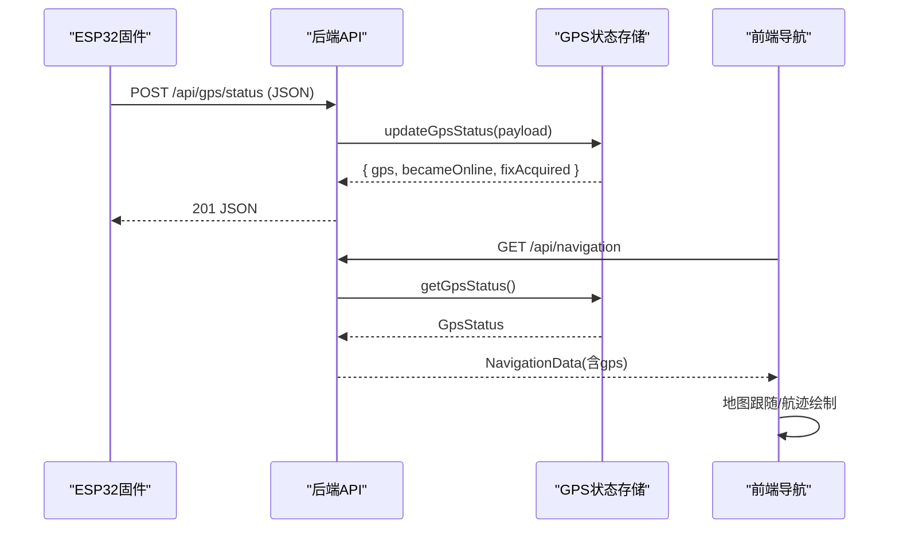
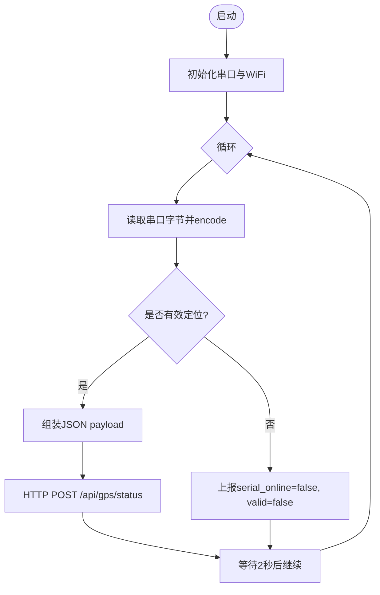
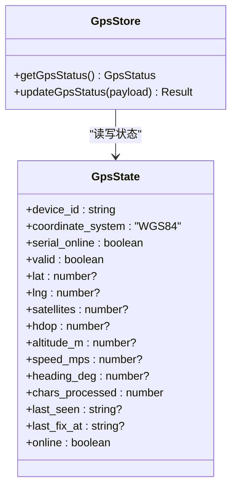
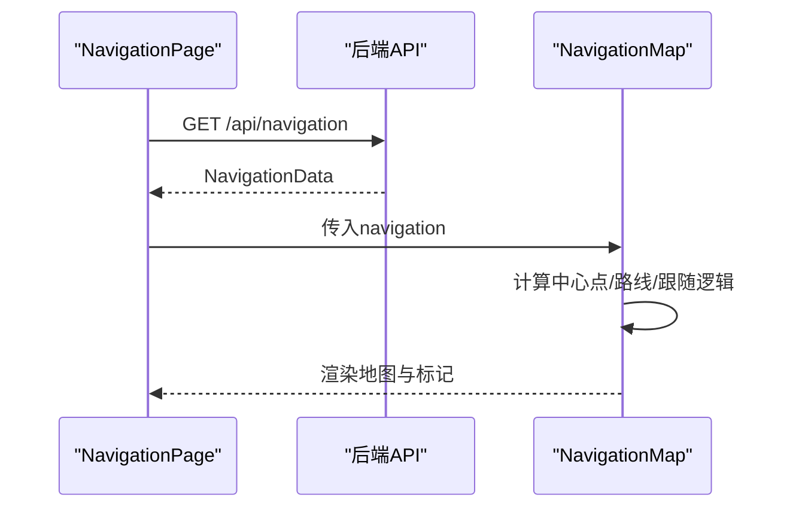
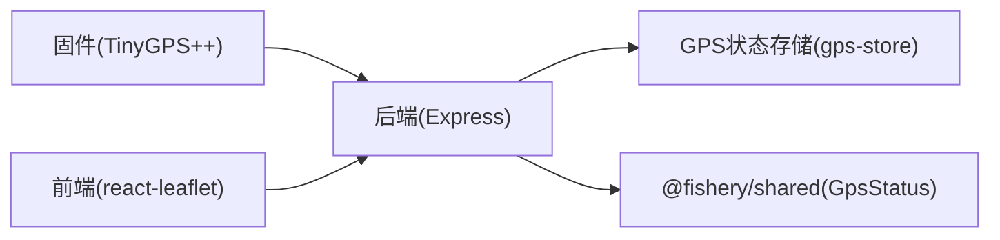

# GPS数据处理

<cite>
**本文引用的文件**
- [maker_esp32_pro_gps_only.ino](file://fishery-digital-twin-platform/firmware/esp32/maker_esp32_pro_gps_only/maker_esp32_pro_gps_only.ino)
- [gps-store.ts](file://fishery-digital-twin-platform/apps/backend/src/gps-store.ts)
- [index.ts](file://fishery-digital-twin-platform/apps/backend/src/index.ts)
- [index.ts（共享类型）](file://fishery-digital-twin-platform/packages/shared/src/index.ts)
- [NavigationMap.tsx](file://fishery-digital-twin-platform/apps/frontend/src/components/map/NavigationMap.tsx)
- [NavigationPage.tsx](file://fishery-digital-twin-platform/apps/frontend/src/components/dashboard/NavigationPage.tsx)
</cite>

## 目录
1. [简介](#简介)
2. [项目结构](#项目结构)
3. [核心组件](#核心组件)
4. [架构总览](#架构总览)
5. [详细组件分析](#详细组件分析)
6. [依赖关系分析](#依赖关系分析)
7. [性能与可靠性](#性能与可靠性)
8. [故障排查指南](#故障排查指南)
9. [结论](#结论)
10. [附录：集成与可视化示例](#附录：集成与可视化示例)

## 简介
本文件面向GPS定位数据的接收、验证与处理，覆盖从ESP32固件端NMEA解析到后端状态管理、API暴露、前端导航展示的全链路。重点包括：
- NMEA协议支持与坐标系统（WGS84）
- 时间戳与定位有效性判定
- 定位质量评估（卫星数量、HDOP精度因子、信号连续性）
- 历史数据管理与查询优化（内存缓存、窗口化存储）
- GPS状态同步（位置更新频率、轨迹记录、地图显示）
- 设备集成指南（串口配置、过滤策略、异常处理）
- 可视化与导航应用开发指导

## 项目结构
本项目由三部分组成：
- 固件层（ESP32）：通过TinyGPS++解析NMEA，周期性上报GPS状态至后端HTTP接口
- 后端服务（Node.js/Express）：提供UDP发现、HTTP API、GPS状态存储与快照聚合
- 前端界面（Next.js + React Leaflet）：展示实时定位、航迹、速度与航向等

```mermaid
graph TB
subgraph "固件层"
FW["ESP32<br/>TinyGPS++ 解析NMEA"]
end
subgraph "后端服务"
API["Express 服务器<br/>/api/gps/status, /api/navigation"]
Store["GPS状态存储<br/>gps-store.ts"]
UDP["UDP 发现服务"]
end
subgraph "前端"
UI["导航页面<br/>NavigationPage.tsx"]
Map["地图组件<br/>NavigationMap.tsx"]
end
FW --> |HTTP POST /api/gps/status| API
API --> Store
API --> |GET /api/navigation| UI
UI --> Map
UDP < --> FW
```

图表来源
- [index.ts:271-318](file://fishery-digital-twin-platform/apps/backend/src/index.ts#L271-L318)
- [index.ts:348-365](file://fishery-digital-twin-platform/apps/backend/src/index.ts#L348-L365)
- [gps-store.ts:59-102](file://fishery-digital-twin-platform/apps/backend/src/gps-store.ts#L59-L102)
- [maker_esp32_pro_gps_only.ino:313-365](file://fishery-digital-twin-platform/firmware/esp32/maker_esp32_pro_gps_only/maker_esp32_pro_gps_only.ino#L313-L365)

章节来源
- [maker_esp32_pro_gps_only.ino:18-52](file://fishery-digital-twin-platform/firmware/esp32/maker_esp32_pro_gps_only/maker_esp32_pro_gps_only.ino#L18-L52)
- [index.ts:56-78](file://fishery-digital-twin-platform/apps/backend/src/index.ts#L56-L78)
- [gps-store.ts:1-23](file://fishery-digital-twin-platform/apps/backend/src/gps-store.ts#L1-L23)

## 核心组件
- ESP32固件：负责串口读取NMEA、解析定位信息、构建JSON并POST到后端；支持WiFi连接与UDP发现后端地址
- 后端GPS状态存储：维护GPS状态对象，校验字段范围与有效性，计算在线/有效标志，返回增量事件（becameOnline、fixAcquired）
- 后端API路由：提供健康检查、快照、导航、GPS状态写入等接口；内置CORS、鉴权、日志记录
- 前端导航：基于Leaflet的地图组件，支持跟随定位、航迹绘制、离线底图降级

章节来源
- [maker_esp32_pro_gps_only.ino:118-142](file://fishery-digital-twin-platform/firmware/esp32/maker_esp32_pro_gps_only/maker_esp32_pro_gps_only.ino#L118-L142)
- [gps-store.ts:29-53](file://fishery-digital-twin-platform/apps/backend/src/gps-store.ts#L29-L53)
- [index.ts:322-346](file://fishery-digital-twin-platform/apps/backend/src/index.ts#L322-L346)
- [NavigationMap.tsx:27-85](file://fishery-digital-twin-platform/apps/frontend/src/components/map/NavigationMap.tsx#L27-L85)

## 架构总览
端到端数据流：
- 固件侧：串口读取NMEA -> TinyGPS++解码 -> 构造JSON -> HTTP POST到后端
- 后端侧：鉴权 -> 更新GPS状态 -> 生成日志 -> 响应结果
- 前端侧：轮询或订阅导航快照 -> 渲染地图与指标



图表来源
- [maker_esp32_pro_gps_only.ino:313-365](file://fishery-digital-twin-platform/firmware/esp32/maker_esp32_pro_gps_only/maker_esp32_pro_gps_only.ino#L313-L365)
- [index.ts:348-365](file://fishery-digital-twin-platform/apps/backend/src/index.ts#L348-L365)
- [gps-store.ts:59-102](file://fishery-digital-twin-platform/apps/backend/src/gps-store.ts#L59-L102)
- [index.ts:197-222](file://fishery-digital-twin-platform/apps/backend/src/index.ts#L197-L222)

## 详细组件分析

### 固件端：NMEA解析与上报
- 串口配置：使用HardwareSerial(2)，RX接GPIO33，波特率9600；调试串口115200
- NMEA解析：通过TinyGPS++逐字节编码，支持location、satellites、hdop、altitude、speed、course等字段
- 定位有效性：要求串口在线且定位有效且年龄不超过阈值（默认5秒）
- 上报周期：每2秒上报一次GPS状态到后端HTTP接口
- WiFi与发现：自动连接WiFi，通过UDP广播发现后端服务端口，建立HTTP连接



图表来源
- [maker_esp32_pro_gps_only.ino:82-116](file://fishery-digital-twin-platform/firmware/esp32/maker_esp32_pro_gps_only/maker_esp32_pro_gps_only.ino#L82-L116)
- [maker_esp32_pro_gps_only.ino:118-142](file://fishery-digital-twin-platform/firmware/esp32/maker_esp32_pro_gps_only/maker_esp32_pro_gps_only.ino#L118-L142)
- [maker_esp32_pro_gps_only.ino:313-365](file://fishery-digital-twin-platform/firmware/esp32/maker_esp32_pro_gps_only/maker_esp32_pro_gps_only.ino#L313-L365)

章节来源
- [maker_esp32_pro_gps_only.ino:25-52](file://fishery-digital-twin-platform/firmware/esp32/maker_esp32_pro_gps_only/maker_esp32_pro_gps_only.ino#L25-L52)
- [maker_esp32_pro_gps_only.ino:133-142](file://fishery-digital-twin-platform/firmware/esp32/maker_esp32_pro_gps_only/maker_esp32_pro_gps_only.ino#L133-L142)
- [maker_esp32_pro_gps_only.ino:204-263](file://fishery-digital-twin-platform/firmware/esp32/maker_esp32_pro_gps_only/maker_esp32_pro_gps_only.ino#L204-L263)

### 后端：GPS状态存储与API
- 状态模型：包含设备ID、坐标系（仅WGS84）、串口在线、定位有效、经纬度、卫星数、HDOP、海拔、速度、航向、已处理字符数、最近时间与最近定位时间
- 有效性判定：坐标范围校验（纬度-90~90，经度-180~180），结合请求valid标志与串口在线超时判断online
- 增量事件：becameOnline表示首次在线，fixAcquired表示首次获得有效定位
- API路由：
  - POST /api/gps/status：受控接口，需X-UISYS-Token鉴权
  - GET /api/gps：获取当前GPS状态
  - GET /api/navigation：聚合导航数据（含GPS）
- 日志记录：在获得定位或串口接入时追加系统日志



图表来源
- [gps-store.ts:8-23](file://fishery-digital-twin-platform/apps/backend/src/gps-store.ts#L8-L23)
- [gps-store.ts:55-102](file://fishery-digital-twin-platform/apps/backend/src/gps-store.ts#L55-L102)
- [index.ts:348-365](file://fishery-digital-twin-platform/apps/backend/src/index.ts#L348-L365)

章节来源
- [gps-store.ts:29-53](file://fishery-digital-twin-platform/apps/backend/src/gps-store.ts#L29-L53)
- [gps-store.ts:59-102](file://fishery-digital-twin-platform/apps/backend/src/gps-store.ts#L59-L102)
- [index.ts:136-157](file://fishery-digital-twin-platform/apps/backend/src/index.ts#L136-L157)
- [index.ts:197-222](file://fishery-digital-twin-platform/apps/backend/src/index.ts#L197-L222)

### 前端：导航与地图展示
- 导航页面：展示当前任务、速度、航向、卫星数量、HDOP、剩余航程、ETA等指标；根据source区分“GPS实时定位”、“GPS等待定位”、“模拟航线”
- 地图组件：使用Leaflet渲染OpenStreetMap瓦片，支持离线底图降级；当为GPS实时定位时启用跟随模式，否则适配航迹边界
- 航迹绘制：将route点序列转换为Polyline，并在末尾闭合以形成闭环路径



图表来源
- [NavigationPage.tsx:44-145](file://fishery-digital-twin-platform/apps/frontend/src/components/dashboard/NavigationPage.tsx#L44-L145)
- [NavigationMap.tsx:27-85](file://fishery-digital-twin-platform/apps/frontend/src/components/map/NavigationMap.tsx#L27-L85)
- [index.ts:197-222](file://fishery-digital-twin-platform/apps/backend/src/index.ts#L197-L222)

章节来源
- [NavigationPage.tsx:13-32](file://fishery-digital-twin-platform/apps/frontend/src/components/dashboard/NavigationPage.tsx#L13-L32)
- [NavigationMap.tsx:27-85](file://fishery-digital-twin-platform/apps/frontend/src/components/map/NavigationMap.tsx#L27-L85)

## 依赖关系分析
- 固件依赖：Arduino库（HardwareSerial、WiFi、HTTPClient、TinyGPS++）
- 后端依赖：Express、cors、dotenv、dgram（UDP）
- 前端依赖：react-leaflet、Leaflet
- 类型共享：@fishery/shared定义GpsStatus、NavigationData等



图表来源
- [maker_esp32_pro_gps_only.ino:18-23](file://fishery-digital-twin-platform/firmware/esp32/maker_esp32_pro_gps_only/maker_esp32_pro_gps_only.ino#L18-L23)
- [index.ts:1-6](file://fishery-digital-twin-platform/apps/backend/src/index.ts#L1-L6)
- [index.ts:7-20](file://fishery-digital-twin-platform/apps/backend/src/index.ts#L7-L20)
- [index.ts:348-365](file://fishery-digital-twin-platform/apps/backend/src/index.ts#L348-L365)
- [index.ts（共享类型）:35-51](file://fishery-digital-twin-platform/packages/shared/src/index.ts#L35-L51)

章节来源
- [maker_esp32_pro_gps_only.ino:18-23](file://fishery-digital-twin-platform/firmware/esp32/maker_esp32_pro_gps_only/maker_esp32_pro_gps_only.ino#L18-L23)
- [index.ts:1-6](file://fishery-digital-twin-platform/apps/backend/src/index.ts#L1-L6)
- [index.ts（共享类型）:35-51](file://fishery-digital-twin-platform/packages/shared/src/index.ts#L35-L51)

## 性能与可靠性
- 串口缓冲与超时：固件设置GPS串口缓冲区大小与超时，避免丢包与阻塞
- 定位时效性：固件限制定位年龄阈值；后端通过last_seen与超时判断online
- 内存缓存：后端使用数组维护水样历史（可类比GPS历史），采用切片保持固定长度，降低内存占用
- 网络重试：固件定期尝试WiFi重连与后端发现，提升鲁棒性
- 前端渲染优化：地图禁用动画与惯性，减少频繁更新时的卡顿

[本节为通用性能建议，不直接分析具体代码文件]

## 故障排查指南
- 无串口数据：检查GPS模块供电（5V/GND）与TX引脚接线（GPIO33），确认波特率9600
- 无法获得定位：确保天线在室外开阔环境，等待NMEA数据；查看串口输出中的“waiting”提示
- 后端拒绝请求：确认已配置UISYS_API_TOKEN，并在请求头携带X-UISYS-Token
- 地图不更新：检查导航源是否为“gps”，若为“mock”则不会跟随真实位置
- UDP发现失败：确认后端监听端口与客户端本地端口一致，检查防火墙与广播地址

章节来源
- [maker_esp32_pro_gps_only.ino:265-311](file://fishery-digital-twin-platform/firmware/esp32/maker_esp32_pro_gps_only/maker_esp32_pro_gps_only.ino#L265-L311)
- [index.ts:136-157](file://fishery-digital-twin-platform/apps/backend/src/index.ts#L136-L157)
- [index.ts:271-318](file://fishery-digital-twin-platform/apps/backend/src/index.ts#L271-L318)

## 结论
该GPS数据处理方案实现了从固件到前端的完整链路：固件可靠地解析NMEA并上报，后端进行严格校验与状态管理，前端直观展示定位与航迹。通过卫星数量、HDOP与串口在线性等多维度评估定位质量，结合内存缓存与窗口化存储保障性能。建议在复杂环境下增加多源融合与滤波算法以提升稳定性。

[本节为总结性内容，不直接分析具体代码文件]

## 附录：集成与可视化示例

### 串口通信配置
- 硬件接线：GPS TX -> GPIO33，GPS RX 不连接；供电5V/GND
- 波特率：GPS UART 9600，调试串口115200
- 缓冲区：设置GPS串口缓冲区大小为2048字节

章节来源
- [maker_esp32_pro_gps_only.ino:25-28](file://fishery-digital-twin-platform/firmware/esp32/maker_esp32_pro_gps_only/maker_esp32_pro_gps_only.ino#L25-L28)
- [maker_esp32_pro_gps_only.ino:86-88](file://fishery-digital-twin-platform/firmware/esp32/maker_esp32_pro_gps_only/maker_esp32_pro_gps_only.ino#L86-L88)

### 数据过滤算法
- 定位有效性：要求串口在线、定位有效且年龄不超过阈值
- 坐标范围校验：纬度-90~90，经度-180~180
- 在线判定：结合last_seen与超时阈值判断online

章节来源
- [maker_esp32_pro_gps_only.ino:133-142](file://fishery-digital-twin-platform/firmware/esp32/maker_esp32_pro_gps_only/maker_esp32_pro_gps_only.ino#L133-L142)
- [gps-store.ts:40-53](file://fishery-digital-twin-platform/apps/backend/src/gps-store.ts#L40-L53)
- [gps-store.ts:66-75](file://fishery-digital-twin-platform/apps/backend/src/gps-store.ts#L66-L75)

### 异常处理
- 固件侧：WiFi断开时重置后端发现状态；HTTP请求失败时清空后端地址并重试
- 后端侧：CORS错误返回403；未配置令牌时返回503；GPS状态更新失败返回400
- 前端侧：地图瓦片加载失败时切换为离线底图

章节来源
- [maker_esp32_pro_gps_only.ino:154-186](file://fishery-digital-twin-platform/firmware/esp32/maker_esp32_pro_gps_only/maker_esp32_pro_gps_only.ino#L154-L186)
- [maker_esp32_pro_gps_only.ino:348-365](file://fishery-digital-twin-platform/firmware/esp32/maker_esp32_pro_gps_only/maker_esp32_pro_gps_only.ino#L348-L365)
- [index.ts:101-109](file://fishery-digital-twin-platform/apps/backend/src/index.ts#L101-L109)
- [index.ts:559-561](file://fishery-digital-twin-platform/apps/backend/src/index.ts#L559-L561)
- [NavigationMap.tsx:56-69](file://fishery-digital-twin-platform/apps/frontend/src/components/map/NavigationMap.tsx#L56-L69)

### 历史数据管理
- 内存缓存：后端使用数组维护水样历史，采用切片保持固定长度（可类比GPS历史）
- 时间序列存储：每次新增数据后持久化平台状态
- 查询优化：提供/api/water、/api/snapshot等接口快速读取历史与快照

章节来源
- [index.ts:78-98](file://fishery-digital-twin-platform/apps/backend/src/index.ts#L78-L98)
- [index.ts:338-341](file://fishery-digital-twin-platform/apps/backend/src/index.ts#L338-L341)
- [index.ts:390-426](file://fishery-digital-twin-platform/apps/backend/src/index.ts#L390-L426)

### GPS状态同步
- 位置更新频率：固件每2秒上报一次GPS状态
- 轨迹记录：前端将route点序列绘制为Polyline，支持闭环显示
- 地图显示：GPS实时定位时启用跟随模式，否则适配航迹边界

章节来源
- [maker_esp32_pro_gps_only.ino:109-113](file://fishery-digital-twin-platform/firmware/esp32/maker_esp32_pro_gps_only/maker_esp32_pro_gps_only.ino#L109-L113)
- [NavigationMap.tsx:27-85](file://fishery-digital-twin-platform/apps/frontend/src/components/map/NavigationMap.tsx#L27-L85)
- [index.ts:197-222](file://fishery-digital-twin-platform/apps/backend/src/index.ts#L197-L222)

### 导航应用开发指导
- 数据来源：优先使用GPS实时定位（source="gps"），否则回退到模拟航线（source="mock"）
- 指标展示：速度、航向、卫星数量、HDOP、剩余航程、ETA
- 地图交互：支持缩放、平移、跟随定位、离线底图降级

章节来源
- [NavigationPage.tsx:44-145](file://fishery-digital-twin-platform/apps/frontend/src/components/dashboard/NavigationPage.tsx#L44-L145)
- [NavigationMap.tsx:27-85](file://fishery-digital-twin-platform/apps/frontend/src/components/map/NavigationMap.tsx#L27-L85)
- [index.ts:197-222](file://fishery-digital-twin-platform/apps/backend/src/index.ts#L197-L222)