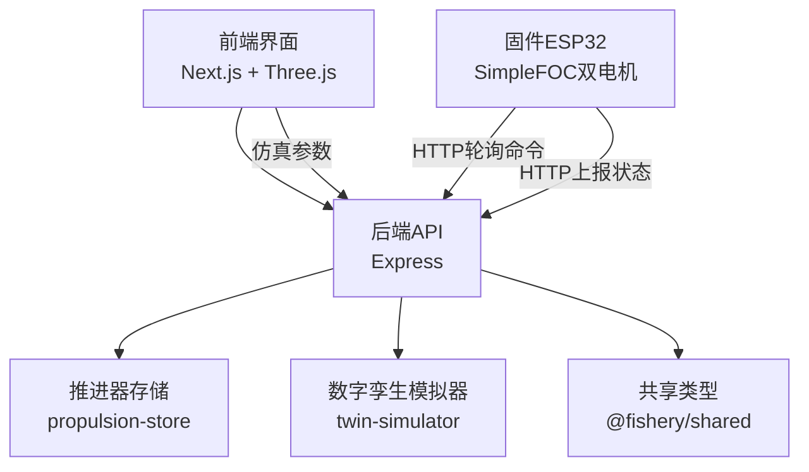
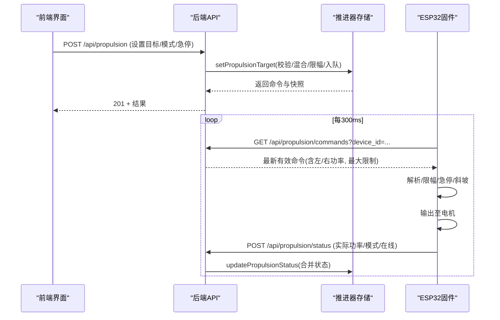
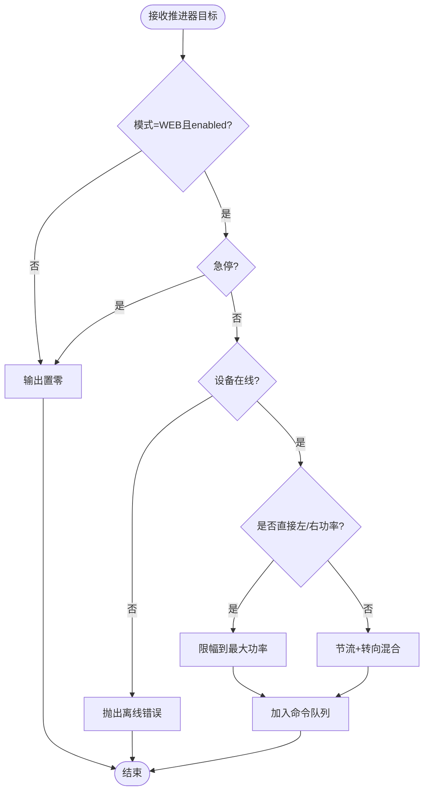
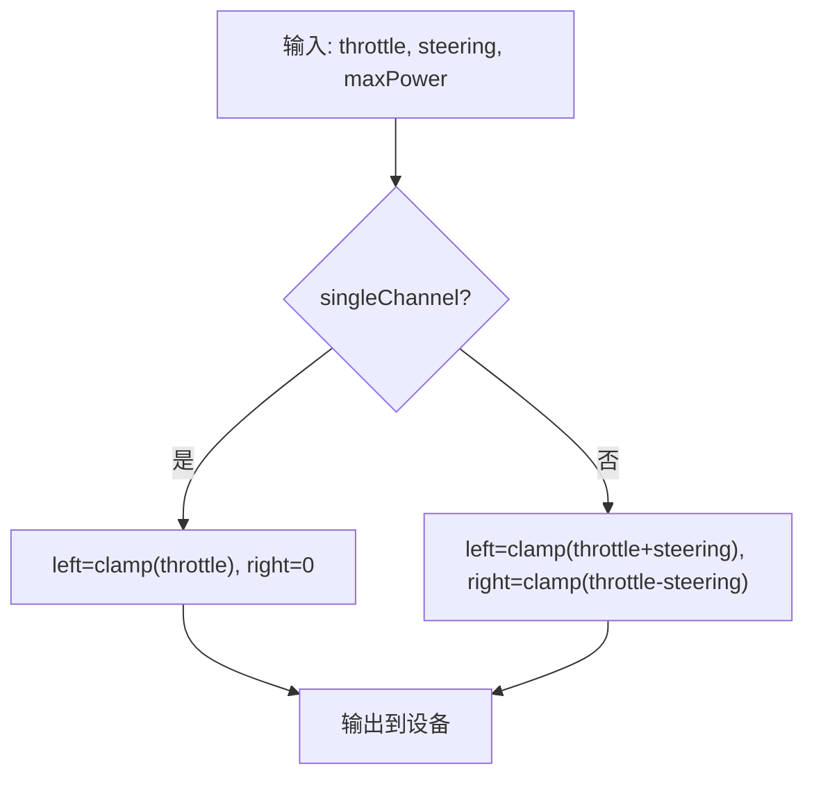
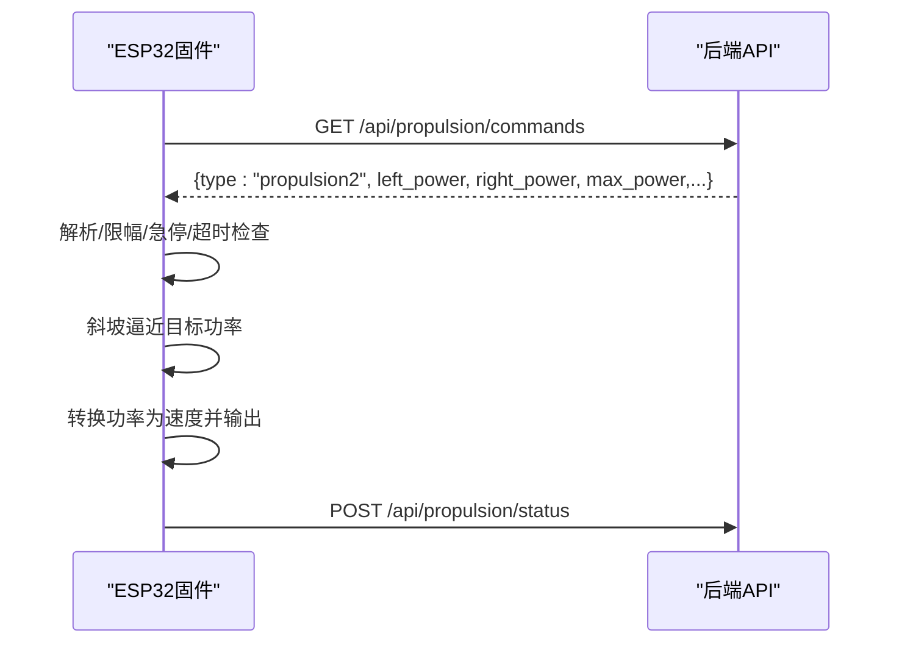
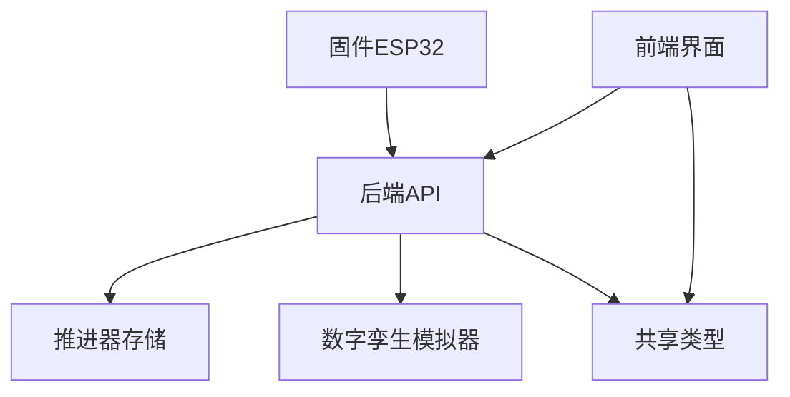

# 推进器管理系统

<cite>
**本文引用的文件**
- [apps/backend/src/index.ts](file://fishery-digital-twin-platform/apps/backend/src/index.ts)
- [apps/backend/src/propulsion-store.ts](file://fishery-digital-twin-platform/apps/backend/src/propulsion-store.ts)
- [apps/backend/src/twin-simulator.ts](file://fishery-digital-twin-platform/apps/backend/src/twin-simulator.ts)
- [packages/shared/src/index.ts](file://fishery-digital-twin-platform/packages/shared/src/index.ts)
- [firmware/esp32/esp32_simplefoc_dual_propulsion/esp32_simplefoc_dual_propulsion.ino](file://fishery-digital-twin-platform/firmware/esp32/esp32_simplefoc_dual_propulsion/esp32_simplefoc_dual_propulsion.ino)
- [apps/frontend/src/components/dashboard/TwinPage.tsx](file://fishery-digital-twin-platform/apps/frontend/src/components/dashboard/TwinPage.tsx)
- [apps/frontend/src/components/three/BoatTwinScene.tsx](file://fishery-digital-twin-platform/apps/frontend/src/components/three/BoatTwinScene.tsx)
</cite>

## 目录
1. [简介](#简介)
2. [项目结构](#项目结构)
3. [核心组件](#核心组件)
4. [架构总览](#架构总览)
5. [详细组件分析](#详细组件分析)
6. [依赖关系分析](#依赖关系分析)
7. [性能与安全注意事项](#性能与安全注意事项)
8. [故障诊断与排错指南](#故障诊断与排错指南)
9. [结论](#结论)
10. [附录：控制示例与安全操作规范](#附录控制示例与安全操作规范)

## 简介
本系统为双推进器（左右两路无刷电机）的“设备-后端-前端-数字孪生”一体化管理平台。系统提供：
- 推进器设备模型：功率范围、模式切换、安全保护与急停机制
- 控制算法：差速转向、直线航行、原地旋转等运动模式的实现原理
- 状态监控：电流监测、温度保护、负载检测与故障诊断（固件侧能力与平台侧展示）
- 数字孪生同步：姿态计算、位置更新与可视化反馈
- 调试工具：手动控制接口、性能测试与日志分析
- 完整控制示例与安全操作规范

## 项目结构
系统由四层组成：
- 前端界面：Next.js 页面与 Three.js 场景，用于可视化与仿真推演
- 后端服务：Express API，负责命令路由、设备状态聚合、持久化与数字孪生模拟
- 固件层：ESP32 SimpleFOC 驱动双 BLDC 电机，执行命令并上报状态
- 共享类型：前后端与固件协议共用 TypeScript 类型定义

图表来源
- [apps/backend/src/index.ts:505-555](file://fishery-digital-twin-platform/apps/backend/src/index.ts#L505-L555)
- [apps/backend/src/propulsion-store.ts:149-231](file://fishery-digital-twin-platform/apps/backend/src/propulsion-store.ts#L149-L231)
- [apps/backend/src/twin-simulator.ts:74-253](file://fishery-digital-twin-platform/apps/backend/src/twin-simulator.ts#L74-L253)
- [packages/shared/src/index.ts:133-194](file://fishery-digital-twin-platform/packages/shared/src/index.ts#L133-L194)
- [firmware/esp32/.../esp32_simplefoc_dual_propulsion.ino:476-700](file://fishery-digital-twin-platform/firmware/esp32/esp32_simplefoc_dual_propulsion/esp32_simplefoc_dual_propulsion.ino#L476-L700)

章节来源
- [apps/backend/src/index.ts:56-110](file://fishery-digital-twin-platform/apps/backend/src/index.ts#L56-L110)
- [apps/backend/src/index.ts:505-555](file://fishery-digital-twin-platform/apps/backend/src/index.ts#L505-L555)

## 核心组件
- 推进器存储模块：维护设备状态、目标输出、命令队列、超时与在线判定
- 数字孪生模拟器：基于当前快照与输入参数进行航线预演、故障推演与疲劳损耗估算
- 固件控制器：解析命令、限流限速、死区与急停、输出到电机并上报状态
- 前端界面：提供手动控制、仿真参数设置、三维可视化与结果展示

章节来源
- [apps/backend/src/propulsion-store.ts:97-231](file://fishery-digital-twin-platform/apps/backend/src/propulsion-store.ts#L97-L231)
- [apps/backend/src/twin-simulator.ts:74-253](file://fishery-digital-twin-platform/apps/backend/src/twin-simulator.ts#L74-L253)
- [firmware/esp32/.../esp32_simplefoc_dual_propulsion.ino:589-700](file://fishery-digital-twin-platform/firmware/esp32/esp32_simplefoc_dual_propulsion/esp32_simplefoc_dual_propulsion.ino#L589-L700)
- [apps/frontend/src/components/dashboard/TwinPage.tsx:67-78](file://fishery-digital-twin-platform/apps/frontend/src/components/dashboard/TwinPage.tsx#L67-L78)

## 架构总览
端到端数据与控制流如下：

图表来源
- [apps/backend/src/index.ts:505-538](file://fishery-digital-twin-platform/apps/backend/src/index.ts#L505-L538)
- [apps/backend/src/propulsion-store.ts:166-231](file://fishery-digital-twin-platform/apps/backend/src/propulsion-store.ts#L166-L231)
- [firmware/esp32/.../esp32_simplefoc_dual_propulsion.ino:476-700](file://fishery-digital-twin-platform/firmware/esp32/esp32_simplefoc_dual_propulsion/esp32_simplefoc_dual_propulsion.ino#L476-L700)

## 详细组件分析

### 推进器设备模型与安全机制
- 设备配置与默认值
  - 支持多设备ID映射名称与最大功率上限；单通道或双通道模式
  - 默认最大输出功率、命令超时、冷却与占空比等安全阈值
- 模式与使能
  - 模式：MANUAL、WEB、AUTO；仅 WEB 模式且 enabled 且未急停时允许输出
  - 急停优先：任何时刻紧急停止都会强制关闭输出
- 功率混合与限幅
  - 支持直接左/右通道功率或节流+转向混合
  - 所有输出均按设备最大功率限幅，防止超限
- 在线判定与超时
  - 通过 last_seen 与 updated_at 判断设备与Web是否在线
  - 离线时拒绝激活命令并记录错误
- 运行周期与锁出
  - 支持运行周期阶段、占空比计时、往返计数与限制
  - 运行时锁出与冷却剩余时间可被固件或上层写入

图表来源
- [apps/backend/src/propulsion-store.ts:166-231](file://fishery-digital-twin-platform/apps/backend/src/propulsion-store.ts#L166-L231)
- [apps/backend/src/propulsion-store.ts:89-95](file://fishery-digital-twin-platform/apps/backend/src/propulsion-store.ts#L89-L95)

章节来源
- [apps/backend/src/propulsion-store.ts:97-231](file://fishery-digital-twin-platform/apps/backend/src/propulsion-store.ts#L97-L231)
- [apps/backend/src/propulsion-store.ts:139-164](file://fishery-digital-twin-platform/apps/backend/src/propulsion-store.ts#L139-L164)

### 控制算法与运动模式
- 差速转向
  - 通过 left_power = throttle + steering，right_power = throttle - steering 实现
  - 结合最大功率限幅，保证左右输出在安全范围内
- 直线航行
  - steering 接近 0，左右功率相等，前进或后退
- 原地旋转
  - throttle 接近 0，steering 较大，左右功率相反，形成扭矩差
- 单通道设备
  - 单通道模式下，仅左侧输出有效，右侧固定为 0

图表来源
- [apps/backend/src/propulsion-store.ts:89-95](file://fishery-digital-twin-platform/apps/backend/src/propulsion-store.ts#L89-L95)
- [apps/backend/src/propulsion-store.ts:184-193](file://fishery-digital-twin-platform/apps/backend/src/propulsion-store.ts#L184-L193)

章节来源
- [apps/backend/src/propulsion-store.ts:89-95](file://fishery-digital-twin-platform/apps/backend/src/propulsion-store.ts#L89-L95)
- [apps/backend/src/propulsion-store.ts:184-193](file://fishery-digital-twin-platform/apps/backend/src/propulsion-store.ts#L184-L193)

### 固件侧执行与安全
- 命令解析与限幅
  - 解析 propulsion2 命令，提取 enabled、emergency_stop、mode、left/right power、max_power
  - 将功率限制在 [-max_power, max_power]
- 安全逻辑
  - 仅在 webMode && enabled && !emergencyStop 时允许输出
  - 命令超时自动清零，避免失控
- 输出控制
  - 使用 SimpleFOC 速度开环/闭环控制，将百分比转换为速度
  - 死区过滤小信号，避免抖动
  - 斜坡函数平滑过渡，降低冲击
- 状态上报
  - 周期性上报 actual_left_power、actual_right_power、模式、在线标志等

图表来源
- [firmware/esp32/.../esp32_simplefoc_dual_propulsion.ino:508-627](file://fishery-digital-twin-platform/firmware/esp32/esp32_simplefoc_dual_propulsion/esp32_simplefoc_dual_propulsion.ino#L508-L627)
- [firmware/esp32/.../esp32_simplefoc_dual_propulsion.ino:629-700](file://fishery-digital-twin-platform/firmware/esp32/esp32_simplefoc_dual_propulsion/esp32_simplefoc_dual_propulsion.ino#L629-L700)

章节来源
- [firmware/esp32/.../esp32_simplefoc_dual_propulsion.ino:508-700](file://fishery-digital-twin-platform/firmware/esp32/esp32_simplefoc_dual_propulsion/esp32_simplefoc_dual_propulsion.ino#L508-L700)

### 状态监控与健康评估
- 电流监测
  - 固件预留 INA240 电流采样引脚与 SimpleFOC 电流传感器接口，可按硬件启用
- 温度保护
  - 固件中未直接实现温度阈值保护；可通过外部温度传感器接入平台后扩展
- 负载检测
  - 后端根据 actual_left_power 与 actual_right_power 的平均绝对值估算负载
  - 数字孪生根据负载、海况与航速计算能耗与到达电量
- 故障诊断
  - 数字孪生支持注入故障（舵机卡滞、电机降额、反馈丢失），给出风险等级与建议
  - 平台日志记录命令下发、急停触发、设备在线事件

章节来源
- [firmware/esp32/.../esp32_simplefoc_dual_propulsion.ino:137-140](file://fishery-digital-twin-platform/firmware/esp32/esp32_simplefoc_dual_propulsion/esp32_simplefoc_dual_propulsion.ino#L137-L140)
- [apps/backend/src/twin-simulator.ts:81-106](file://fishery-digital-twin-platform/apps/backend/src/twin-simulator.ts#L81-L106)
- [apps/backend/src/index.ts:510-533](file://fishery-digital-twin-platform/apps/backend/src/index.ts#L510-L533)

### 数字孪生同步与可视化
- 姿态与位置
  - 前端从平台快照获取导航信息（航向、位置、速度），驱动三维场景中船体姿态与位置
- 仿真预览
  - 用户设置航线、海况、故障等参数，调用后端仿真接口得到预测曲线与风险等级
  - 三维场景叠加仿真图层，显示预测轨迹与风险提示
- 可视化反馈
  - 推进器功率、舵机角度、线性推杆伸缩等以动画形式实时呈现
  - 动态水面与尾迹增强沉浸感

图表来源
- [apps/frontend/src/components/dashboard/TwinPage.tsx:67-78](file://fishery-digital-twin-platform/apps/frontend/src/components/dashboard/TwinPage.tsx#L67-L78)
- [apps/backend/src/index.ts:540-555](file://fishery-digital-twin-platform/apps/backend/src/index.ts#L540-L555)
- [apps/backend/src/twin-simulator.ts:74-253](file://fishery-digital-twin-platform/apps/backend/src/twin-simulator.ts#L74-L253)
- [apps/frontend/src/components/three/BoatTwinScene.tsx:153-273](file://fishery-digital-twin-platform/apps/frontend/src/components/three/BoatTwinScene.tsx#L153-L273)

章节来源
- [apps/frontend/src/components/dashboard/TwinPage.tsx:80-232](file://fishery-digital-twin-platform/apps/frontend/src/components/dashboard/TwinPage.tsx#L80-L232)
- [apps/frontend/src/components/three/BoatTwinScene.tsx:153-273](file://fishery-digital-twin-platform/apps/frontend/src/components/three/BoatTwinScene.tsx#L153-L273)

## 依赖关系分析
- 后端API依赖推进器存储与数字孪生模块
- 固件通过HTTP轮询命令并上报状态，依赖后端发现UDP广播
- 前端依赖共享类型与后端API，渲染三维场景与图表

图表来源
- [apps/backend/src/index.ts:21-44](file://fishery-digital-twin-platform/apps/backend/src/index.ts#L21-L44)
- [apps/backend/src/index.ts:505-555](file://fishery-digital-twin-platform/apps/backend/src/index.ts#L505-L555)
- [packages/shared/src/index.ts:133-194](file://fishery-digital-twin-platform/packages/shared/src/index.ts#L133-L194)

章节来源
- [apps/backend/src/index.ts:21-44](file://fishery-digital-twin-platform/apps/backend/src/index.ts#L21-L44)
- [apps/backend/src/index.ts:505-555](file://fishery-digital-twin-platform/apps/backend/src/index.ts#L505-L555)

## 性能与安全注意事项
- 性能
  - 命令队列保留最近有效命令并按超时清理，减少无效处理
  - 固件采用斜坡函数与死区，降低机械冲击与功耗波动
  - 数字孪生基于快照与简化模型快速计算，适合交互式仿真
- 安全
  - 急停优先级最高，任何模式均可立即停止输出
  - 非本地请求需携带 X-UISYS-Token，否则拒绝控制
  - 功率限幅与最大功率约束防止过载
  - 离线状态下禁止激活命令，避免误控

章节来源
- [apps/backend/src/index.ts:143-157](file://fishery-digital-twin-platform/apps/backend/src/index.ts#L143-L157)
- [apps/backend/src/propulsion-store.ts:177-180](file://fishery-digital-twin-platform/apps/backend/src/propulsion-store.ts#L177-L180)
- [firmware/esp32/.../esp32_simplefoc_dual_propulsion.ino:599-627](file://fishery-digital-twin-platform/firmware/esp32/esp32_simplefoc_dual_propulsion/esp32_simplefoc_dual_propulsion.ino#L599-L627)

## 故障诊断与排错指南
- 常见问题
  - 设备离线：检查WiFi连接与后端发现UDP端口；确认设备ID一致
  - 命令不生效：确认模式为WEB且enabled；检查急停是否触发；查看命令超时
  - 功率异常：检查最大功率配置与实际输出限幅；核对单/双通道模式
- 日志定位
  - 后端日志记录命令下发、急停触发、设备在线事件
  - 固件串口打印命令解析、输出状态与HTTP响应码
- 建议步骤
  - 先断网测试固件干跑模式，再逐步接入网络
  - 使用最小功率与短时长测试，逐步提升
  - 通过数字孪生进行故障推演，验证降级策略

章节来源
- [apps/backend/src/index.ts:510-533](file://fishery-digital-twin-platform/apps/backend/src/index.ts#L510-L533)
- [firmware/esp32/.../esp32_simplefoc_dual_propulsion.ino:476-506](file://fishery-digital-twin-platform/firmware/esp32/esp32_simplefoc_dual_propulsion/esp32_simplefoc_dual_propulsion.ino#L476-L506)

## 结论
本系统以清晰的设备模型、严格的权限与安全机制、稳健的控制算法和强大的数字孪生能力，实现了双推进器的可控、可视、可预测管理。通过前后端与固件的紧密协作，既满足日常调试与运维需求，也为复杂工况下的决策提供了可靠依据。

## 附录：控制示例与安全操作规范
- 手动控制接口
  - 设置目标：POST /api/propulsion，包含 device_id、mode、enabled、throttle、steering、left_power、right_power、max_power、emergency_stop
  - 查询状态：GET /api/propulsion，获取设备快照与在线情况
  - 拉取命令：GET /api/propulsion/commands?device_id=...，供固件轮询
  - 上报状态：POST /api/propulsion/status，固件周期性上报实际功率与模式
- 安全操作规范
  - 首次上电保持急停，确认接线与参数后再解除
  - 先在无桨条件下低功率测试，逐步增加负载
  - 始终确保X-UISYS-Token配置正确，避免局域网误控
  - 遇到异常立即触发急停，并检查命令超时与设备在线状态
  - 使用数字孪生进行航线预演与故障推演，评估风险后再执行

章节来源
- [apps/backend/src/index.ts:505-555](file://fishery-digital-twin-platform/apps/backend/src/index.ts#L505-L555)
- [apps/backend/src/propulsion-store.ts:166-231](file://fishery-digital-twin-platform/apps/backend/src/propulsion-store.ts#L166-L231)
- [firmware/esp32/.../esp32_simplefoc_dual_propulsion.ino:508-700](file://fishery-digital-twin-platform/firmware/esp32/esp32_simplefoc_dual_propulsion/esp32_simplefoc_dual_propulsion.ino#L508-L700)