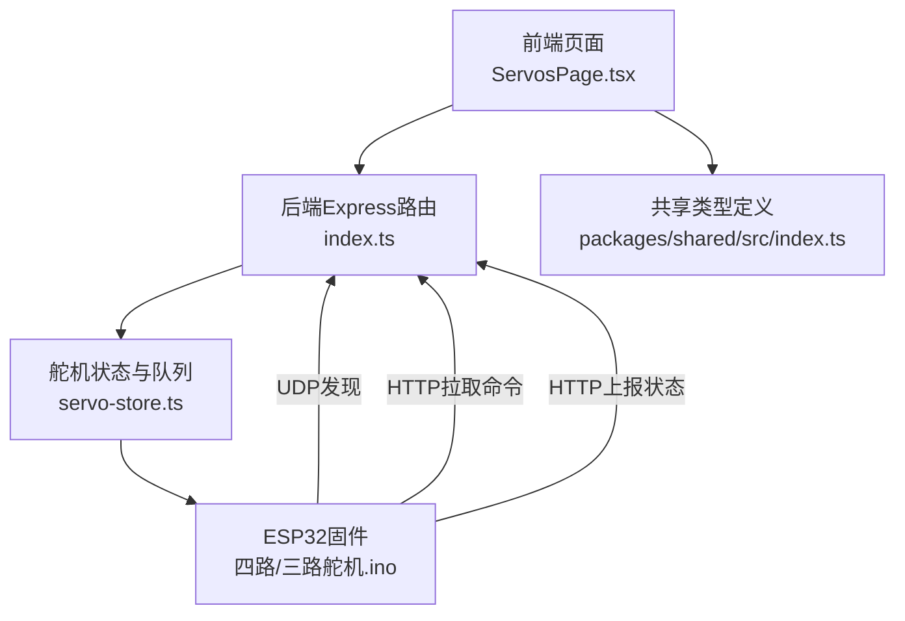
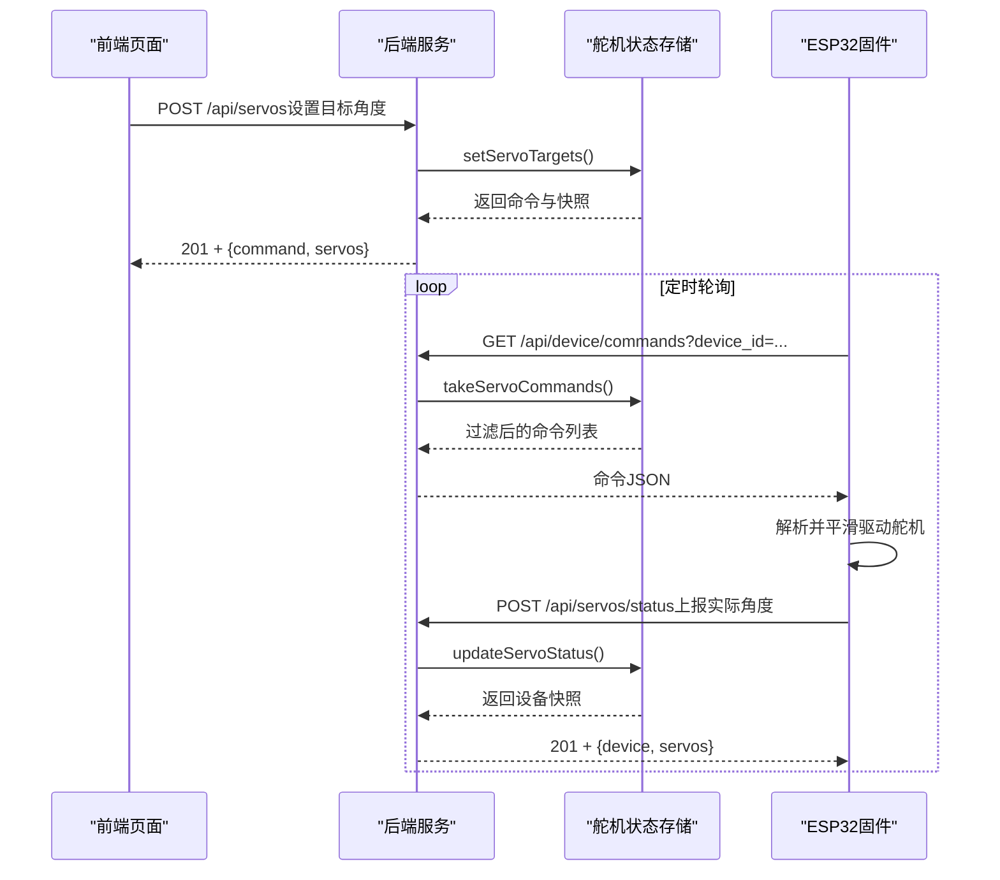
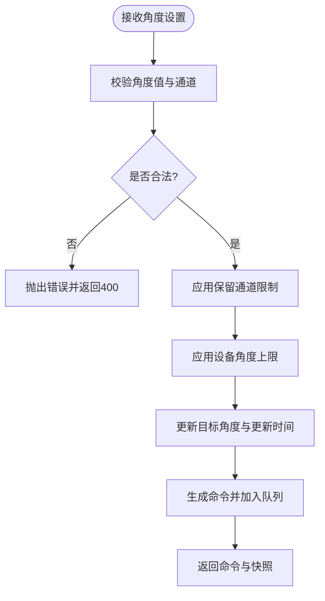
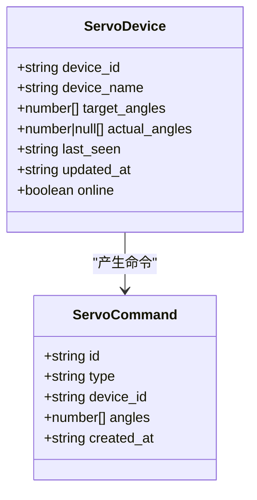
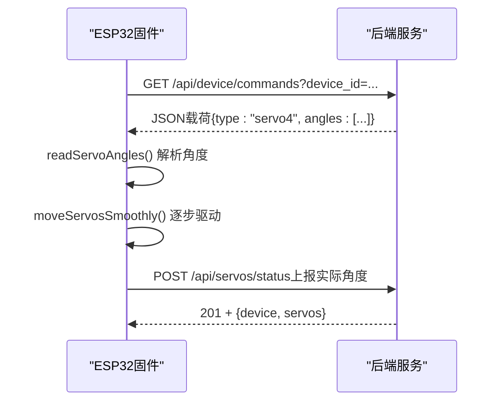
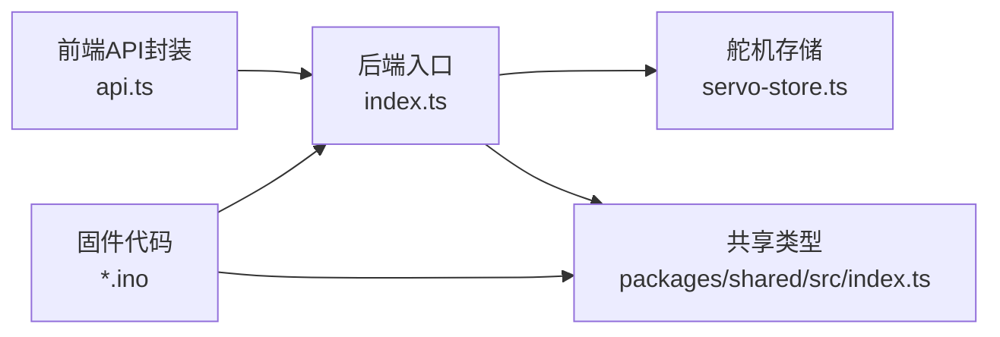

# 舵机控制系统

<cite>
**本文引用的文件**
- [servo-store.ts](file://fishery-digital-twin-platform/apps/backend/src/servo-store.ts)
- [index.ts（后端入口）](file://fishery-digital-twin-platform/apps/backend/src/index.ts)
- [api.ts（前端API封装）](file://fishery-digital-twin-platform/apps/frontend/src/lib/api.ts)
- [ServosPage.tsx（舵机控制页面）](file://fishery-digital-twin-platform/apps/frontend/src/components/dashboard/ServosPage.tsx)
- [index.ts（共享类型定义）](file://fishery-digital-twin-platform/packages/shared/src/index.ts)
- [maker_esp32_pro_four_servo_02.ino（四路舵机固件）](file://fishery-digital-twin-platform/firmware/esp32/maker_esp32_pro_four_servo_02/maker_esp32_pro_four_servo_02.ino)
- [maker_esp32_pro_servo_temp_01.ino（三路舵机+GPS固件）](file://fishery-digital-twin-platform/firmware/esp32/maker_esp32_pro_servo_temp_01/maker_esp32_pro_servo_temp_01.ino)
</cite>

## 目录
1. [简介](#简介)
2. [项目结构](#项目结构)
3. [核心组件](#核心组件)
4. [架构总览](#架构总览)
5. [详细组件分析](#详细组件分析)
6. [依赖关系分析](#依赖关系分析)
7. [性能与可靠性](#性能与可靠性)
8. [故障排查指南](#故障排查指南)
9. [结论](#结论)
10. [附录：API与使用示例](#附录api与使用示例)

## 简介
本系统实现了一套面向多块ESP32开发板的舵机控制系统，覆盖设备模型、命令下发、状态同步、在线检测、通道预留与角度限制、TTL超时清理等关键能力。前端提供云台跟踪与水枪开关等交互场景；后端通过HTTP API与UDP发现协议连接前端与固件；固件侧负责轮询命令、平滑驱动舵机并上报实际角度。

## 项目结构
- 后端服务
  - Express路由与鉴权：提供舵机快照、设置目标角度、设备命令拉取、状态上报等接口。
  - 舵机状态存储：内存中维护设备对象、目标角度、实际角度、最后在线时间、命令队列及TTL过滤。
- 前端界面
  - 舵机控制台：支持单通道步进、批量角度设置、自动跟踪、水枪开关、复位归中等操作。
  - 通过统一API封装调用后端舵机接口，并订阅平台状态更新。
- 固件端
  - 两块ESP32固件：一块为“四路舵机+推杆”，另一块为“三路舵机+GPS+电机”。均通过UDP发现后端，定时拉取命令并上报状态。
- 共享类型
  - 统一定义了舵机设备、快照、命令等数据结构，前后端与固件间保持一致的契约。

**图表来源**
- [ServosPage.tsx:111-145](file://fishery-digital-twin-platform/apps/frontend/src/components/dashboard/ServosPage.tsx#L111-L145)
- [index.ts（后端入口）:475-503](file://fishery-digital-twin-platform/apps/backend/src/index.ts#L475-L503)
- [servo-store.ts:17-18](file://fishery-digital-twin-platform/apps/backend/src/servo-store.ts#L17-L18)
- [maker_esp32_pro_four_servo_02.ino:295-346](file://fishery-digital-twin-platform/firmware/esp32/maker_esp32_pro_four_servo_02/maker_esp32_pro_four_servo_02.ino#L295-L346)
- [maker_esp32_pro_servo_temp_01.ino:349-408](file://fishery-digital-twin-platform/firmware/esp32/maker_esp32_pro_servo_temp_01/maker_esp32_pro_servo_temp_01.ino#L349-L408)

**章节来源**
- [index.ts（后端入口）:475-503](file://fishery-digital-twin-platform/apps/backend/src/index.ts#L475-L503)
- [servo-store.ts:1-184](file://fishery-digital-twin-platform/apps/backend/src/servo-store.ts#L1-L184)
- [ServosPage.tsx:111-145](file://fishery-digital-twin-platform/apps/frontend/src/components/dashboard/ServosPage.tsx#L111-L145)
- [maker_esp32_pro_four_servo_02.ino:295-346](file://fishery-digital-twin-platform/firmware/esp32/maker_esp32_pro_four_servo_02/maker_esp32_pro_four_servo_02.ino#L295-L346)
- [maker_esp32_pro_servo_temp_01.ino:349-408](file://fishery-digital-twin-platform/firmware/esp32/maker_esp32_pro_servo_temp_01/maker_esp32_pro_servo_temp_01.ino#L349-L408)

## 核心组件
- 设备模型与状态
  - 设备ID管理：默认设备ID集合，支持动态创建与快照聚合。
  - 角度范围与限制：全局0-180度校验；按设备配置最大角度上限；保留通道强制回中。
  - 通道分配与预留：每板4通道；特定设备指定保留通道（如第4通道用于GPS信号）。
  - 在线状态：基于last_seen时间戳判断是否在线（阈值约10秒）。
- 命令处理流程
  - 参数校验：角度数组长度、数值范围、通道号合法性、保留通道保护。
  - 命令入队：生成唯一命令ID、类型、设备ID、角度数组与创建时间。
  - TTL过期：拉取命令时仅返回创建时间在限定窗口内的命令。
  - 错误处理：非法输入或离线设备直接抛出错误，由路由层转为HTTP错误响应。
- 状态同步机制
  - 目标角度与实际角度分离：目标角度由后端维护，实际角度由固件上报。
  - 心跳维护：固件周期性上报实际角度与更新时间，后端据此计算在线状态。
- 多设备支持
  - 设备发现：固件通过UDP广播请求，后端在指定端口监听并回复IP与端口。
  - 配置管理：前端声明式配置设备ID、标签、保留通道；后端内置默认设备与角度上限。
  - 批量操作：前端可并行向多个设备发送角度指令，并合并反馈。

**章节来源**
- [servo-store.ts:4-13](file://fishery-digital-twin-platform/apps/backend/src/servo-store.ts#L4-L13)
- [servo-store.ts:24-48](file://fishery-digital-twin-platform/apps/backend/src/servo-store.ts#L24-L48)
- [servo-store.ts:60-87](file://fishery-digital-twin-platform/apps/backend/src/servo-store.ts#L60-L87)
- [servo-store.ts:106-153](file://fishery-digital-twin-platform/apps/backend/src/servo-store.ts#L106-L153)
- [servo-store.ts:155-183](file://fishery-digital-twin-platform/apps/backend/src/servo-store.ts#L155-L183)
- [ServosPage.tsx:52-55](file://fishery-digital-twin-platform/apps/frontend/src/components/dashboard/ServosPage.tsx#L52-L55)
- [maker_esp32_pro_four_servo_02.ino:49-75](file://fishery-digital-twin-platform/firmware/esp32/maker_esp32_pro_four_servo_02/maker_esp32_pro_four_servo_02.ino#L49-L75)
- [maker_esp32_pro_servo_temp_01.ino:49-76](file://fishery-digital-twin-platform/firmware/esp32/maker_esp32_pro_servo_temp_01/maker_esp32_pro_servo_temp_01.ino#L49-L76)

## 架构总览
系统采用“前端-后端-固件”三层架构：
- 前端负责用户交互与批量控制，调用后端API进行舵机控制与状态获取。
- 后端提供RESTful API与UDP发现服务，维护舵机状态与命令队列，并对设备命令进行TTL过滤。
- 固件侧通过UDP发现后端地址，定时HTTP拉取命令，执行舵机动作后上报实际角度。

**图表来源**
- [ServosPage.tsx:463-488](file://fishery-digital-twin-platform/apps/frontend/src/components/dashboard/ServosPage.tsx#L463-L488)
- [index.ts（后端入口）:475-503](file://fishery-digital-twin-platform/apps/backend/src/index.ts#L475-L503)
- [servo-store.ts:106-183](file://fishery-digital-twin-platform/apps/backend/src/servo-store.ts#L106-L183)
- [maker_esp32_pro_four_servo_02.ino:402-436](file://fishery-digital-twin-platform/firmware/esp32/maker_esp32_pro_four_servo_02/maker_esp32_pro_four_servo_02.ino#L402-L436)

## 详细组件分析

### 设备模型与状态管理
- 设备ID与名称
  - 默认设备ID集合用于预置设备；首次访问时按需创建设备对象，包含设备名、目标角度、实际角度、最后在线时间与更新时间。
- 角度验证与限制
  - 单个角度必须为0-180整数；批量角度需长度为4且全部合法。
  - 针对特定设备配置最大角度上限，防止机械限位损坏。
- 通道预留机制
  - 某些设备的特定通道被标记为保留（例如第4通道），写入时会强制回中或禁止控制。
- 在线状态判定
  - 根据last_seen时间与当前时间差判断设备是否在线，阈值约10秒。

**图表来源**
- [servo-store.ts:60-87](file://fishery-digital-twin-platform/apps/backend/src/servo-store.ts#L60-L87)
- [servo-store.ts:106-153](file://fishery-digital-twin-platform/apps/backend/src/servo-store.ts#L106-L153)

**章节来源**
- [servo-store.ts:24-48](file://fishery-digital-twin-platform/apps/backend/src/servo-store.ts#L24-L48)
- [servo-store.ts:60-87](file://fishery-digital-twin-platform/apps/backend/src/servo-store.ts#L60-L87)
- [servo-store.ts:106-153](file://fishery-digital-twin-platform/apps/backend/src/servo-store.ts#L106-L153)

### 命令队列与TTL处理
- 命令结构
  - 包含唯一ID、类型“servo4”、设备ID、角度数组与创建时间。
- TTL过滤
  - 固件拉取命令时，后端仅返回创建时间在限定窗口内的命令，避免陈旧指令重复执行。
- 错误与离线保护
  - 若设备离线则拒绝入队并返回错误；非法参数直接报错。

**图表来源**
- [index.ts（共享类型定义）:108-131](file://fishery-digital-twin-platform/packages/shared/src/index.ts#L108-L131)
- [servo-store.ts:138-147](file://fishery-digital-twin-platform/apps/backend/src/servo-store.ts#L138-L147)
- [servo-store.ts:175-183](file://fishery-digital-twin-platform/apps/backend/src/servo-store.ts#L175-L183)

**章节来源**
- [servo-store.ts:138-147](file://fishery-digital-twin-platform/apps/backend/src/servo-store.ts#L138-L147)
- [servo-store.ts:175-183](file://fishery-digital-twin-platform/apps/backend/src/servo-store.ts#L175-L183)

### 固件侧命令解析与执行
- 命令拉取
  - 固件定时HTTP GET后端命令接口，携带设备ID与认证头。
- 角度解析
  - 从JSON载荷中提取“servo4”类型与“angles”数组，逐位解析数字并校验范围。
- 平滑驱动
  - 逐步调整舵机角度，避免突变；移动过程中持续检查安全条件与线性推杆状态。
- 状态上报
  - 每次成功移动后上报实际角度与设备信息，后端据此更新在线状态。

**图表来源**
- [maker_esp32_pro_four_servo_02.ino:402-436](file://fishery-digital-twin-platform/firmware/esp32/maker_esp32_pro_four_servo_02/maker_esp32_pro_four_servo_02.ino#L402-L436)
- [maker_esp32_pro_four_servo_02.ino:470-517](file://fishery-digital-twin-platform/firmware/esp32/maker_esp32_pro_four_servo_02/maker_esp32_pro_four_servo_02.ino#L470-L517)
- [maker_esp32_pro_four_servo_02.ino:605-637](file://fishery-digital-twin-platform/firmware/esp32/maker_esp32_pro_four_servo_02/maker_esp32_pro_four_servo_02.ino#L605-L637)

**章节来源**
- [maker_esp32_pro_four_servo_02.ino:402-436](file://fishery-digital-twin-platform/firmware/esp32/maker_esp32_pro_four_servo_02/maker_esp32_pro_four_servo_02.ino#L402-L436)
- [maker_esp32_pro_four_servo_02.ino:470-517](file://fishery-digital-twin-platform/firmware/esp32/maker_esp32_pro_four_servo_02/maker_esp32_pro_four_servo_02.ino#L470-L517)
- [maker_esp32_pro_four_servo_02.ino:605-637](file://fishery-digital-twin-platform/firmware/esp32/maker_esp32_pro_four_servo_02/maker_esp32_pro_four_servo_02.ino#L605-L637)

### 前端交互与批量控制
- 设备配置
  - 前端声明式配置两块开发板的设备ID、标签与保留通道。
- 云台控制
  - 支持方向步进、归中、自动跟踪；跟踪过程根据摄像头观测误差计算修正步长并下发角度。
- 水枪开关
  - 通过单通道角度切换实现开/关；失败时回滚角度并提示错误。
- 批量操作
  - 对在线设备并行发送角度指令，合并最新快照以刷新界面。

**章节来源**
- [ServosPage.tsx:52-55](file://fishery-digital-twin-platform/apps/frontend/src/components/dashboard/ServosPage.tsx#L52-L55)
- [ServosPage.tsx:272-328](file://fishery-digital-twin-platform/apps/frontend/src/components/dashboard/ServosPage.tsx#L272-L328)
- [ServosPage.tsx:330-461](file://fishery-digital-twin-platform/apps/frontend/src/components/dashboard/ServosPage.tsx#L330-L461)
- [ServosPage.tsx:542-566](file://fishery-digital-twin-platform/apps/frontend/src/components/dashboard/ServosPage.tsx#L542-L566)
- [ServosPage.tsx:463-488](file://fishery-digital-twin-platform/apps/frontend/src/components/dashboard/ServosPage.tsx#L463-L488)

## 依赖关系分析
- 前端依赖
  - 通过统一API封装调用后端舵机接口；订阅平台状态以刷新设备在线情况。
- 后端依赖
  - 引入共享类型定义；集成舵机状态存储、推进器状态存储、GPS状态存储与AI报告服务。
  - 提供CORS、鉴权中间件与日志记录；启动UDP发现服务。
- 固件依赖
  - 使用WiFi、HTTPClient、ESP32Servo库；通过UDP发现后端地址；定时拉取命令并上报状态。

**图表来源**
- [api.ts:52-68](file://fishery-digital-twin-platform/apps/frontend/src/lib/api.ts#L52-L68)
- [index.ts（后端入口）:1-44](file://fishery-digital-twin-platform/apps/backend/src/index.ts#L1-L44)
- [servo-store.ts:1-3](file://fishery-digital-twin-platform/apps/backend/src/servo-store.ts#L1-L3)
- [maker_esp32_pro_four_servo_02.ino:33-55](file://fishery-digital-twin-platform/firmware/esp32/maker_esp32_pro_four_servo_02/maker_esp32_pro_four_servo_02.ino#L33-L55)

**章节来源**
- [api.ts:52-68](file://fishery-digital-twin-platform/apps/frontend/src/lib/api.ts#L52-L68)
- [index.ts（后端入口）:1-44](file://fishery-digital-twin-platform/apps/backend/src/index.ts#L1-L44)
- [servo-store.ts:1-3](file://fishery-digital-twin-platform/apps/backend/src/servo-store.ts#L1-L3)
- [maker_esp32_pro_four_servo_02.ino:33-55](file://fishery-digital-twin-platform/firmware/esp32/maker_esp32_pro_four_servo_02/maker_esp32_pro_four_servo_02.ino#L33-L55)

## 性能与可靠性
- 性能特性
  - 命令TTL窗口避免陈旧指令堆积，降低无效执行概率。
  - 固件平滑驱动减少舵机抖动，提升运动稳定性。
  - 前端批量操作利用Promise.all并行下发，提高控制效率。
- 可靠性保障
  - 在线状态基于心跳时间戳，快速识别离线设备。
  - 保留通道与角度上限防止误操作导致硬件损坏。
  - 网络异常时固件停止输出，避免失控。

[本节为通用指导，不直接分析具体文件]

## 故障排查指南
- 常见问题
  - 设备离线：检查last_seen是否更新；确认固件是否成功上报状态。
  - 命令未执行：查看命令TTL是否过期；确认设备是否在线。
  - 角度无效：校验角度范围与通道号；检查保留通道是否被占用。
  - 网络问题：确认UDP发现是否成功；检查HTTP请求是否携带正确Token。
- 定位方法
  - 查看后端日志：舵机命令下发与状态上报均有日志记录。
  - 查看固件串口：命令解析与舵机驱动过程有详细输出。
  - 前端错误提示：控制失败会回滚角度并显示错误信息。

**章节来源**
- [index.ts（后端入口）:480-503](file://fishery-digital-twin-platform/apps/backend/src/index.ts#L480-L503)
- [maker_esp32_pro_four_servo_02.ino:402-436](file://fishery-digital-twin-platform/firmware/esp32/maker_esp32_pro_four_servo_02/maker_esp32_pro_four_servo_02.ino#L402-L436)
- [ServosPage.tsx:307-328](file://fishery-digital-twin-platform/apps/frontend/src/components/dashboard/ServosPage.tsx#L307-L328)

## 结论
本舵机控制系统通过清晰的分层架构与严格的参数校验，实现了多设备、多通道的稳定控制。后端集中管理设备状态与命令队列，固件侧负责实时执行与反馈，前端提供直观的控制界面与自动化跟踪功能。系统具备完善的在线检测、TTL超时与错误处理机制，适合在实际场景中部署与扩展。

[本节为总结性内容，不直接分析具体文件]

## 附录：API与使用示例
- 获取舵机快照
  - 方法：GET
  - 路径：/api/servos
  - 说明：返回所有设备快照或指定设备快照。
- 设置舵机目标角度
  - 方法：POST
  - 路径：/api/servos
  - 请求体：包含device_id与angles或channel与angle；需携带X-UISYS-Token。
  - 说明：校验通过后生成命令并返回快照。
- 上报舵机状态
  - 方法：POST
  - 路径：/api/servos/status
  - 请求体：包含device_id与angles；需携带X-UISYS-Token。
  - 说明：更新实际角度与最后在线时间。
- 拉取设备命令
  - 方法：GET
  - 路径：/api/device/commands?device_id=...
  - 说明：返回TTL窗口内的有效命令。

**章节来源**
- [index.ts（后端入口）:475-503](file://fishery-digital-twin-platform/apps/backend/src/index.ts#L475-L503)
- [api.ts:52-68](file://fishery-digital-twin-platform/apps/frontend/src/lib/api.ts#L52-L68)
- [ServosPage.tsx:463-488](file://fishery-digital-twin-platform/apps/frontend/src/components/dashboard/ServosPage.tsx#L463-L488)