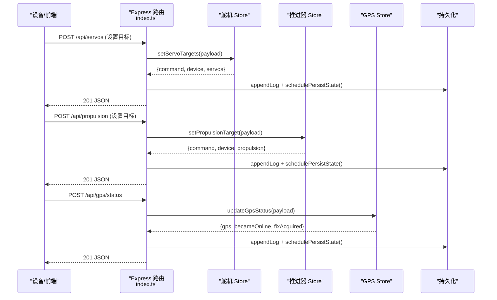
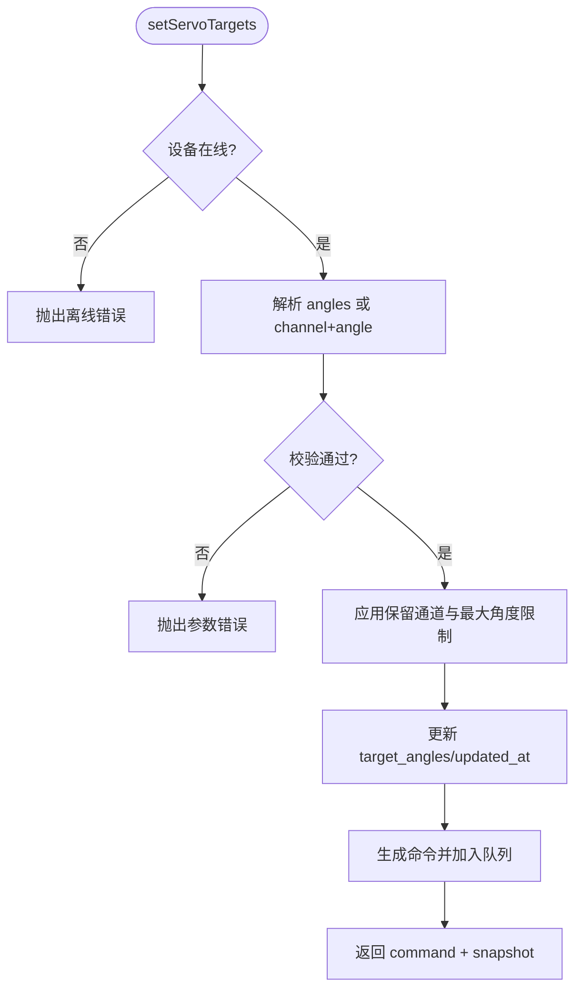
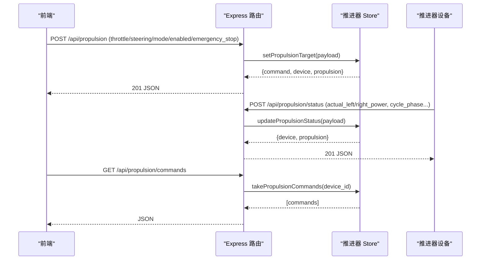
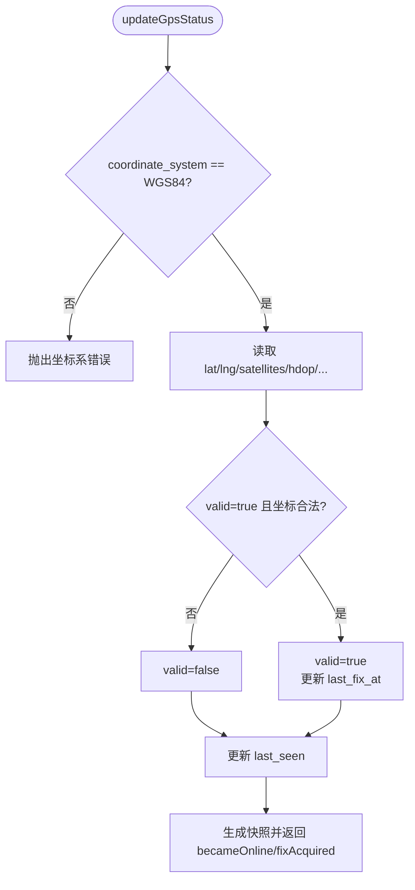
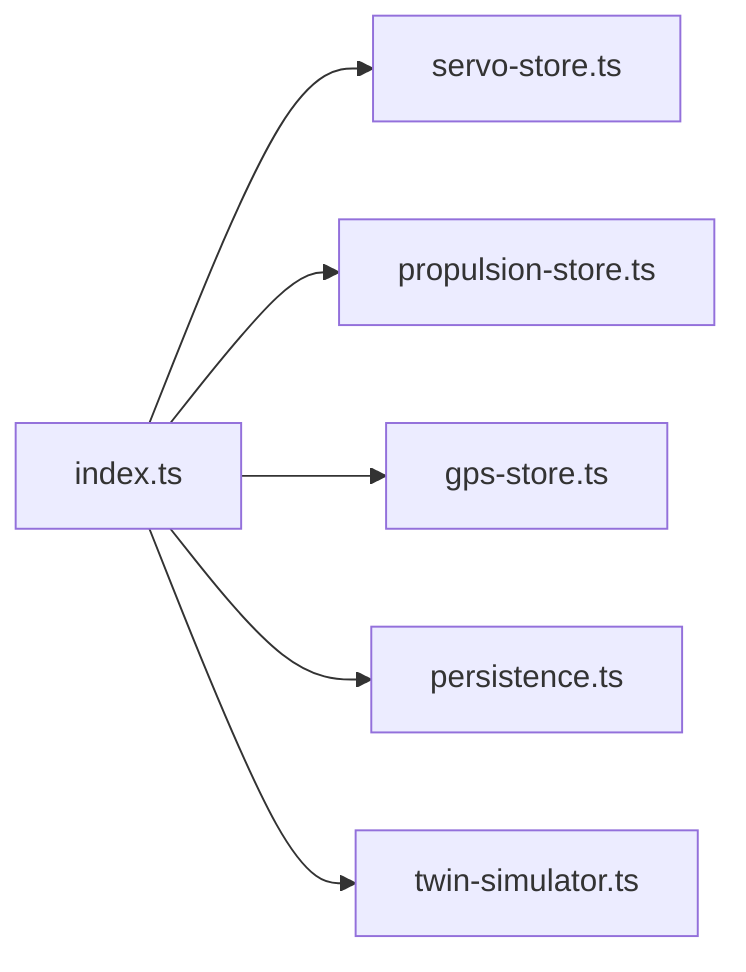

# 设备状态管理

<cite>
**本文引用的文件**
- [index.ts](file://fishery-digital-twin-platform/apps/backend/src/index.ts)
- [servo-store.ts](file://fishery-digital-twin-platform/apps/backend/src/servo-store.ts)
- [propulsion-store.ts](file://fishery-digital-twin-platform/apps/backend/src/propulsion-store.ts)
- [gps-store.ts](file://fishery-digital-twin-platform/apps/backend/src/gps-store.ts)
- [persistence.ts](file://fishery-digital-twin-platform/apps/backend/src/persistence.ts)
- [twin-simulator.ts](file://fishery-digital-twin-platform/apps/backend/src/twin-simulator.ts)
- [device-stores.test.ts](file://fishery-digital-twin-platform/apps/backend/src/device-stores.test.ts)
- [README.md](file://fishery-digital-twin-platform/README.md)
</cite>

## 目录
1. [简介](#简介)
2. [项目结构](#项目结构)
3. [核心组件](#核心组件)
4. [架构总览](#架构总览)
5. [详细组件分析](#详细组件分析)
6. [依赖关系分析](#依赖关系分析)
7. [性能与可靠性](#性能与可靠性)
8. [故障排查指南](#故障排查指南)
9. [结论](#结论)
10. [附录：设备集成指南](#附录设备集成指南)

## 简介
本文件面向“智慧渔业巡检船数字孪生平台”的设备状态管理系统，聚焦舵机、推进器与 GPS 三类设备的状态存储、命令队列、状态同步与事件处理。系统采用 Store 模式对设备状态进行集中管理，通过后端 Express 接口暴露查询与控制能力，并以 UDP 广播实现设备自动发现与重连。文档同时给出舵机角度控制、多设备管理、命令验证与执行反馈；推进器功率控制、模式切换、紧急停止与安全保护；GPS 数据接收、有效性校验、坐标系统与定位历史；以及设备通信协议、错误处理与重连机制的说明，并提供新设备接入指南。

## 项目结构
后端服务位于 apps/backend/src，核心由以下模块组成：
- index.ts：Express 应用入口，路由、鉴权、日志、UDP 发现、统一快照聚合。
- servo-store.ts：舵机设备状态与命令队列。
- propulsion-store.ts：推进器设备状态与命令队列。
- gps-store.ts：GPS 状态与定位有效性管理。
- persistence.ts：持久化（水质历史、电池、AI 报告、系统日志）。
- twin-simulator.ts：数字孪生推演（不直接下发控制命令）。
- device-stores.test.ts：Store 行为单元测试。

```mermaid
graph TB
A["前端/ESP32"] --> B["Express 路由<br/>index.ts"]
B --> C["舵机 Store<br/>servo-store.ts"]
B --> D["推进器 Store<br/>propulsion-store.ts"]
B --> E["GPS Store<br/>gps-store.ts"]
B --> F["持久化<br/>persistence.ts"]
B --> G["数字孪生模拟<br/>twin-simulator.ts"]
A <- --> H["UDP 发现服务<br/>index.ts"]
```

图表来源
- [index.ts:56-110](file://fishery-digital-twin-platform/apps/backend/src/index.ts#L56-L110)
- [index.ts:271-318](file://fishery-digital-twin-platform/apps/backend/src/index.ts#L271-L318)
- [servo-store.ts:17-18](file://fishery-digital-twin-platform/apps/backend/src/servo-store.ts#L17-L18)
- [propulsion-store.ts:30-31](file://fishery-digital-twin-platform/apps/backend/src/propulsion-store.ts#L30-L31)
- [gps-store.ts:8-23](file://fishery-digital-twin-platform/apps/backend/src/gps-store.ts#L8-L23)
- [persistence.ts:12-14](file://fishery-digital-twin-platform/apps/backend/src/persistence.ts#L12-L14)

章节来源
- [README.md:16-28](file://fishery-digital-twin-platform/README.md#L16-L28)
- [index.ts:56-110](file://fishery-digital-twin-platform/apps/backend/src/index.ts#L56-L110)

## 核心组件
- Store 模式：每个设备类型维护独立的状态容器与命令队列，提供统一的快照、更新与取命令接口。
- 命令队列与 TTL：命令入队后带有创建时间戳，取命令时按超时过滤，避免过期指令被重复或延迟执行。
- 在线判定：基于 last_seen 时间戳判断设备是否在线，不同 Store 使用不同的新鲜度阈值。
- 安全与鉴权：受控接口要求 X-UISYS-Token，本地回环地址可豁免。
- 持久化：水质历史、电池、AI 报告与系统日志周期性落盘，重启恢复。
- 数字孪生：基于当前快照与设备反馈进行能耗、疲劳与风险估算，不直接下发控制命令。

章节来源
- [servo-store.ts:17-18](file://fishery-digital-twin-platform/apps/backend/src/servo-store.ts#L17-L18)
- [propulsion-store.ts:30-31](file://fishery-digital-twin-platform/apps/backend/src/propulsion-store.ts#L30-L31)
- [gps-store.ts:8-23](file://fishery-digital-twin-platform/apps/backend/src/gps-store.ts#L8-L23)
- [index.ts:143-157](file://fishery-digital-twin-platform/apps/backend/src/index.ts#L143-L157)
- [persistence.ts:32-49](file://fishery-digital-twin-platform/apps/backend/src/persistence.ts#L32-L49)
- [twin-simulator.ts:74-79](file://fishery-digital-twin-platform/apps/backend/src/twin-simulator.ts#L74-L79)

## 架构总览
后端对外暴露 REST 接口，内部将请求分发到对应 Store。Store 负责：
- 参数校验与边界限制
- 状态更新与命令生成
- 命令队列管理与 TTL 清理
- 快照输出（含在线状态）

设备通过 HTTP POST 上报状态，或通过 UDP 广播与后端完成自动发现。



图表来源
- [index.ts:475-538](file://fishery-digital-twin-platform/apps/backend/src/index.ts#L475-L538)
- [servo-store.ts:106-153](file://fishery-digital-twin-platform/apps/backend/src/servo-store.ts#L106-L153)
- [propulsion-store.ts:166-231](file://fishery-digital-twin-platform/apps/backend/src/propulsion-store.ts#L166-L231)
- [gps-store.ts:59-102](file://fishery-digital-twin-platform/apps/backend/src/gps-store.ts#L59-L102)
- [persistence.ts:51-58](file://fishery-digital-twin-platform/apps/backend/src/persistence.ts#L51-L58)

## 详细组件分析

### 舵机控制系统
- 状态模型：每块舵机板维护 target_angles、actual_angles、last_seen、updated_at 等字段，支持 4 通道。
- 命令验证：
  - angles 数组必须为 4 个 0-180 的整数。
  - 单通道 angle 需指定 channel(1-4)，并检查保留通道。
  - 设备离线时拒绝入队控制命令。
- 安全与限制：
  - 保留通道强制固定角度（例如第 4 通道用于 GPS 天线）。
  - 根据设备预设的最大角度限制裁剪目标角度。
- 命令队列与执行反馈：
  - 设置目标后生成带唯一 id 的命令对象，入队并按 TTL 清理。
  - 设备通过 /api/servos/status 上报实际角度与心跳，后端更新 actual_angles 与 last_seen。
  - 前端通过 /api/device/commands 拉取待执行命令。



图表来源
- [servo-store.ts:106-153](file://fishery-digital-twin-platform/apps/backend/src/servo-store.ts#L106-L153)
- [servo-store.ts:60-87](file://fishery-digital-twin-platform/apps/backend/src/servo-store.ts#L60-L87)
- [servo-store.ts:175-183](file://fishery-digital-twin-platform/apps/backend/src/servo-store.ts#L175-L183)

章节来源
- [servo-store.ts:17-18](file://fishery-digital-twin-platform/apps/backend/src/servo-store.ts#L17-L18)
- [servo-store.ts:24-48](file://fishery-digital-twin-platform/apps/backend/src/servo-store.ts#L24-L48)
- [servo-store.ts:60-87](file://fishery-digital-twin-platform/apps/backend/src/servo-store.ts#L60-L87)
- [servo-store.ts:106-153](file://fishery-digital-twin-platform/apps/backend/src/servo-store.ts#L106-L153)
- [servo-store.ts:155-183](file://fishery-digital-twin-platform/apps/backend/src/servo-store.ts#L155-L183)
- [index.ts:475-503](file://fishery-digital-twin-platform/apps/backend/src/index.ts#L475-L503)
- [device-stores.test.ts:27-50](file://fishery-digital-twin-platform/apps/backend/src/device-stores.test.ts#L27-L50)

### 推进器管理系统
- 状态模型：包含 mode、enabled、emergency_stop、target(throttle/steering/left_power/right_power/max_power)、actual_left_power/actual_right_power、运行周期与冷却计数等。
- 功率控制与模式切换：
  - 支持 MANUAL、WEB、AUTO 三种模式。
  - WEB 模式下，enabled 且未急停才激活输出；否则左右功率置零。
  - 单通道设备仅左通道有效；双通道设备支持 left/right 直写或 throttle/steering 混合计算。
- 紧急停止与安全保护：
  - emergency_stop 优先于其他控制，立即清零输出。
  - 即使设备反馈离线，仍允许入队急停命令以保证安全。
- 命令队列与反馈：
  - 设置目标生成 PropulsionCommand，入队并按 TTL 清理。
  - 设备通过 /api/propulsion/status 上报实际功率、运行阶段、冷却剩余等。
  - 前端通过 /api/propulsion/commands 拉取待执行命令。



图表来源
- [propulsion-store.ts:166-231](file://fishery-digital-twin-platform/apps/backend/src/propulsion-store.ts#L166-L231)
- [propulsion-store.ts:233-318](file://fishery-digital-twin-platform/apps/backend/src/propulsion-store.ts#L233-L318)
- [index.ts:505-538](file://fishery-digital-twin-platform/apps/backend/src/index.ts#L505-L538)

章节来源
- [propulsion-store.ts:97-147](file://fishery-digital-twin-platform/apps/backend/src/propulsion-store.ts#L97-L147)
- [propulsion-store.ts:166-231](file://fishery-digital-twin-platform/apps/backend/src/propulsion-store.ts#L166-L231)
- [propulsion-store.ts:233-318](file://fishery-digital-twin-platform/apps/backend/src/propulsion-store.ts#L233-L318)
- [index.ts:505-538](file://fishery-digital-twin-platform/apps/backend/src/index.ts#L505-L538)
- [device-stores.test.ts:52-92](file://fishery-digital-twin-platform/apps/backend/src/device-stores.test.ts#L52-L92)

### GPS 数据处理
- 数据接收与有效性验证：
  - 仅接受 WGS84 坐标系。
  - valid 需要 serial_online 且 lat/lng 在合法范围。
  - 收到有效定位时记录 last_fix_at。
- 在线判定：
  - online = serial_online 且 last_seen 在 10 秒内新鲜。
- 坐标转换与历史记录：
  - 当前仅支持 WGS84；如需转换可在上层扩展。
  - 历史定位信息可通过导航快照获取（速度、航向、最近定位时间）。



图表来源
- [gps-store.ts:59-102](file://fishery-digital-twin-platform/apps/backend/src/gps-store.ts#L59-L102)
- [gps-store.ts:40-53](file://fishery-digital-twin-platform/apps/backend/src/gps-store.ts#L40-L53)

章节来源
- [gps-store.ts:8-23](file://fishery-digital-twin-platform/apps/backend/src/gps-store.ts#L8-L23)
- [gps-store.ts:59-102](file://fishery-digital-twin-platform/apps/backend/src/gps-store.ts#L59-L102)
- [index.ts:348-365](file://fishery-digital-twin-platform/apps/backend/src/index.ts#L348-L365)
- [index.ts:197-222](file://fishery-digital-twin-platform/apps/backend/src/index.ts#L197-L222)
- [device-stores.test.ts:12-25](file://fishery-digital-twin-platform/apps/backend/src/device-stores.test.ts#L12-L25)

### 设备通信协议与重连机制
- HTTP 接口：
  - 传感器数据：POST /api/data
  - GPS 状态：POST /api/gps/status
  - 舵机控制：POST /api/servos；状态上报：POST /api/servos/status；命令拉取：GET /api/device/commands
  - 推进器控制：POST /api/propulsion；状态上报：POST /api/propulsion/status；命令拉取：GET /api/propulsion/commands
  - 健康与快照：GET /api/health、GET /api/snapshot、GET /api/navigation、GET /api/gps、GET /api/vessel
- 鉴权：
  - 非本地回环地址需携带 X-UISYS-Token，否则返回 401；未配置令牌时 LAN 控制返回 503。
- UDP 自动发现：
  - 设备广播 UISYS_DISCOVER_V1 至 42110，后端回复/主动广播 UISYS_BACKEND_V1|端口。
  - 设备监听各自端口（42111-42114），便于多设备并行工作。
- 重连策略：
  - 设备侧在 WiFi/IP 变化后清除旧地址并重试发现。
  - 后端通过 last_seen 判定在线性，断线后命令仍可入队但受 TTL 限制。

章节来源
- [index.ts:143-157](file://fishery-digital-twin-platform/apps/backend/src/index.ts#L143-L157)
- [index.ts:271-318](file://fishery-digital-twin-platform/apps/backend/src/index.ts#L271-L318)
- [README.md:143-153](file://fishery-digital-twin-platform/README.md#L143-L153)
- [README.md:173-185](file://fishery-digital-twin-platform/README.md#L173-L185)

## 依赖关系分析
- index.ts 依赖各 Store 提供状态与命令能力，并通过 persistence.ts 持久化系统日志与平台数据。
- 数字孪生模拟器 twin-simulator.ts 依赖当前快照与设备状态进行能耗与风险评估，但不修改设备状态。
- Store 之间相互独立，耦合度低，便于扩展新设备类型。



图表来源
- [index.ts:21-44](file://fishery-digital-twin-platform/apps/backend/src/index.ts#L21-L44)
- [index.ts:112-129](file://fishery-digital-twin-platform/apps/backend/src/index.ts#L112-L129)

章节来源
- [index.ts:21-44](file://fishery-digital-twin-platform/apps/backend/src/index.ts#L21-L44)
- [index.ts:112-129](file://fishery-digital-twin-platform/apps/backend/src/index.ts#L112-L129)

## 性能与可靠性
- 命令队列 TTL：舵机与推进器命令默认 2.5 秒有效期，避免陈旧命令被执行。
- 在线判定阈值：舵机/推进器/GPS 使用 10 秒作为 last_seen 新鲜度阈值，兼顾实时性与抗抖动。
- 批量写入节流：持久化采用防抖定时器，减少频繁磁盘 IO。
- 安全优先：急停命令即使在设备反馈离线时也可入队，确保异常场景下能尽快停机。
- 资源占用：内存中 Map 存储设备状态，轻量高效；UDP 广播仅在局域网内使用。

章节来源
- [servo-store.ts:5](file://fishery-digital-twin-platform/apps/backend/src/servo-store.ts#L5)
- [propulsion-store.ts:6](file://fishery-digital-twin-platform/apps/backend/src/propulsion-store.ts#L6)
- [gps-store.ts:4](file://fishery-digital-twin-platform/apps/backend/src/gps-store.ts#L4)
- [persistence.ts:51-58](file://fishery-digital-twin-platform/apps/backend/src/persistence.ts#L51-L58)
- [propulsion-store.ts:177-180](file://fishery-digital-twin-platform/apps/backend/src/propulsion-store.ts#L177-L180)

## 故障排查指南
- 控制接口返回 401/503：
  - 检查是否配置了 UISYS_API_TOKEN，非本地访问需携带正确令牌。
- 设备离线导致无法控制：
  - 确认设备已上报状态（last_seen 在 10 秒内），否则控制命令会被拒绝。
- 舵机角度无效或被限制：
  - 检查是否在保留通道上操作，或超出设备最大角度限制。
- 推进器无输出：
  - 检查模式是否为 WEB、enabled 是否为真、是否触发急停；单通道设备仅左通道有效。
- GPS 定位无效：
  - 确认 coordinate_system 为 WGS84，lat/lng 在合法范围，serial_online 为真。
- 命令未执行：
  - 检查命令是否仍在 TTL 窗口内；若过期将被丢弃。

章节来源
- [index.ts:143-157](file://fishery-digital-twin-platform/apps/backend/src/index.ts#L143-L157)
- [servo-store.ts:106-153](file://fishery-digital-twin-platform/apps/backend/src/servo-store.ts#L106-L153)
- [propulsion-store.ts:166-231](file://fishery-digital-twin-platform/apps/backend/src/propulsion-store.ts#L166-L231)
- [gps-store.ts:59-102](file://fishery-digital-twin-platform/apps/backend/src/gps-store.ts#L59-L102)
- [servo-store.ts:175-183](file://fishery-digital-twin-platform/apps/backend/src/servo-store.ts#L175-L183)
- [propulsion-store.ts:310-318](file://fishery-digital-twin-platform/apps/backend/src/propulsion-store.ts#L310-L318)

## 结论
该设备状态管理系统以 Store 模式为核心，将舵机、推进器与 GPS 的状态与命令解耦，提供清晰的在线判定、命令队列与 TTL 机制，并通过 Express 接口与 UDP 广播实现设备发现与通信。系统在安全性（令牌鉴权、急停优先）、可靠性（TTL、在线判定、持久化）与可扩展性（模块化 Store）方面具备良好设计。配合数字孪生模拟，可为运维与决策提供依据。

## 附录：设备集成指南
为新设备类型添加支持的建议步骤：
- 定义设备状态与命令类型：
  - 在共享类型中新增设备状态与命令结构（参考现有 ServoDevice/PropulsionDevice/GpsStatus）。
- 新建 Store 模块：
  - 复制 servo-store.ts 或 propulsion-store.ts 的结构，实现状态容器、命令队列、TTL 清理、快照与更新函数。
  - 实现参数校验、边界限制、安全逻辑（如保留通道/急停）。
- 注册路由与鉴权：
  - 在 index.ts 中添加 GET/POST 路由，调用 Store 的查询与更新方法。
  - 对控制接口应用 requireControlAuthorization 中间件。
- 实现设备通信：
  - 设备通过 HTTP 上报状态；如需自动发现，复用 UDP 广播机制或扩展新端口。
- 测试与验证：
  - 编写单元测试覆盖在线判定、命令入队与 TTL、参数校验与限制。
  - 使用 device-stores.test.ts 的模式验证 Store 行为。
- 持久化与日志：
  - 在关键事件处调用 appendLog 与 schedulePersistState，保证可追溯。
- 数字孪生集成（可选）：
  - 在 twin-simulator.ts 中引入新设备状态，参与能耗、疲劳与风险评估计算。

章节来源
- [servo-store.ts:17-18](file://fishery-digital-twin-platform/apps/backend/src/servo-store.ts#L17-L18)
- [propulsion-store.ts:30-31](file://fishery-digital-twin-platform/apps/backend/src/propulsion-store.ts#L30-L31)
- [gps-store.ts:8-23](file://fishery-digital-twin-platform/apps/backend/src/gps-store.ts#L8-L23)
- [index.ts:143-157](file://fishery-digital-twin-platform/apps/backend/src/index.ts#L143-L157)
- [index.ts:475-538](file://fishery-digital-twin-platform/apps/backend/src/index.ts#L475-L538)
- [device-stores.test.ts:12-92](file://fishery-digital-twin-platform/apps/backend/src/device-stores.test.ts#L12-L92)
- [twin-simulator.ts:74-79](file://fishery-digital-twin-platform/apps/backend/src/twin-simulator.ts#L74-L79)