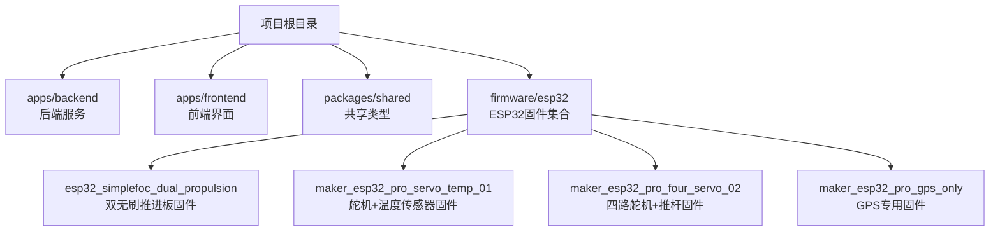
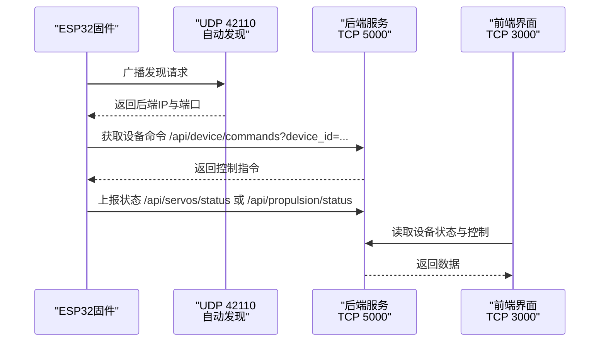
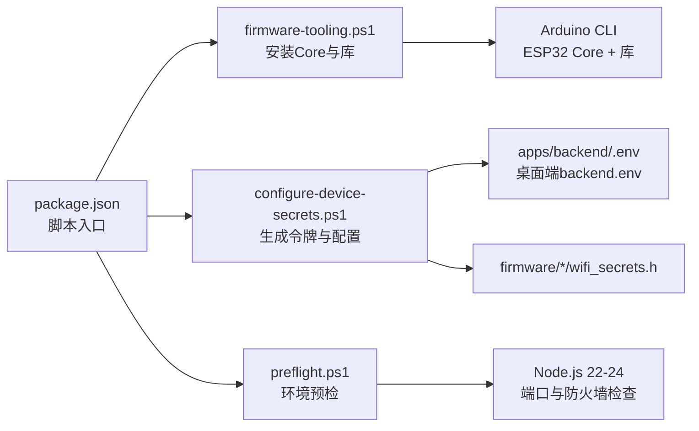

# ESP32开发环境搭建

<cite>
**本文引用的文件**
- [README.md](file://fishery-digital-twin-platform/README.md)
- [hardware-and-firmware.md](file://fishery-digital-twin-platform/docs/hardware-and-firmware.md)
- [package.json](file://fishery-digital-twin-platform/package.json)
- [firmware-tooling.ps1](file://fishery-digital-twin-platform/scripts/firmware-tooling.ps1)
- [configure-device-secrets.ps1](file://fishery-digital-twin-platform/scripts/configure-device-secrets.ps1)
- [preflight.ps1](file://fishery-digital-twin-platform/scripts/preflight.ps1)
- [esp32_simplefoc_dual_propulsion.ino](file://fishery-digital-twin-platform/firmware/esp32/esp32_simplefoc_dual_propulsion/esp32_simplefoc_dual_propulsion.ino)
- [maker_esp32_pro_servo_temp_01.ino](file://fishery-digital-twin-platform/firmware/esp32/maker_esp32_pro_servo_temp_01/maker_esp32_pro_servo_temp_01.ino)
- [maker_esp32_pro_four_servo_02.ino](file://fishery-digital-twin-platform/firmware/esp32/maker_esp32_pro_four_servo_02/maker_esp32_pro_four_servo_02.ino)
- [wifi_secrets.example.h（双无刷推进板）](file://fishery-digital-twin-platform/firmware/esp32/esp32_simplefoc_dual_propulsion/wifi_secrets.example.h)
- [wifi_secrets.h（双无刷推进板）](file://fishery-digital-twin-platform/firmware/esp32/esp32_simplefoc_dual_propulsion/wifi_secrets.h)
- [wifi_secrets.example.h（舵机+温度传感器固件）](file://fishery-digital-twin-platform/firmware/esp32/maker_esp32_pro_servo_temp_01/wifi_secrets.example.h)
</cite>

## 目录
1. [简介](#简介)
2. [项目结构](#项目结构)
3. [核心组件](#核心组件)
4. [架构总览](#架构总览)
5. [详细组件分析](#详细组件分析)
6. [依赖关系分析](#依赖关系分析)
7. [性能与稳定性考虑](#性能与稳定性考虑)
8. [故障排查指南](#故障排查指南)
9. [结论](#结论)
10. [附录：验证步骤与测试用例](#附录验证步骤与测试用例)

## 简介
本指南面向首次在本仓库中搭建ESP32开发环境的开发者，覆盖Arduino IDE或PlatformIO的安装配置、ESP32开发板支持包安装、串口驱动与编译器设置、项目结构组织、WiFi配置文件设置与安全注意事项、调试工具使用、常见问题排查以及完整的开发环境验证步骤和测试用例。文档内容基于仓库中的脚本、说明文档与固件源码路径进行整理，确保与实际工程一致。

## 项目结构
本项目采用多应用工作区结构，前端、后端、共享库与固件分目录管理；ESP32固件位于 firmware/esp32 下，按设备类型划分独立子目录，每个固件目录包含 .ino 主程序与 wifi_secrets.* 配置文件。

图表来源
- [README.md:16-34](file://fishery-digital-twin-platform/README.md#L16-L34)
- [hardware-and-firmware.md:1-20](file://fishery-digital-twin-platform/docs/hardware-and-firmware.md#L1-L20)

章节来源
- [README.md:16-34](file://fishery-digital-twin-platform/README.md#L16-L34)
- [hardware-and-firmware.md:1-20](file://fishery-digital-twin-platform/docs/hardware-and-firmware.md#L1-L20)

## 核心组件
- Arduino CLI 自动发现与依赖安装：通过脚本自动定位 Arduino IDE 内置的 arduino-cli，并安装 ESP32 Core 与所需库。
- 设备令牌与网络配置：统一生成并同步后端、桌面端与各固件的 UISYS_API_TOKEN，避免明文泄露。
- 预检与健康检查：启动前检查 Node.js 版本、端口占用、防火墙规则、后端健康状态与设备在线情况。
- 固件编译与校验：一键编译所有固件，确保依赖与目标平台一致。

章节来源
- [firmware-tooling.ps1:10-75](file://fishery-digital-twin-platform/scripts/firmware-tooling.ps1#L10-L75)
- [configure-device-secrets.ps1:20-169](file://fishery-digital-twin-platform/scripts/configure-device-secrets.ps1#L20-L169)
- [preflight.ps1:66-153](file://fishery-digital-twin-platform/scripts/preflight.ps1#L66-L153)
- [package.json:16-38](file://fishery-digital-twin-platform/package.json#L16-L38)

## 架构总览
ESP32固件通过同一WiFi连接到本地后端，使用UDP自动发现后端地址，并通过HTTP接口上报状态、接收命令。前后端提供Web控制界面与API。

图表来源
- [hardware-and-firmware.md:140-160](file://fishery-digital-twin-platform/docs/hardware-and-firmware.md#L140-L160)
- [hardware-and-firmware.md:118-138](file://fishery-digital-twin-platform/docs/hardware-and-firmware.md#L118-L138)
- [README.md:143-153](file://fishery-digital-twin-platform/README.md#L143-L153)

## 详细组件分析

### Arduino IDE 与 PlatformIO 环境搭建
- 推荐优先使用仓库提供的自动化脚本，它会自动查找已安装的 Arduino IDE 2.x 并调用其内置的 arduino-cli，完成ESP32 Core与库的安装与固件编译校验。
- 若使用 PlatformIO，需确保安装 ESP32 开发板支持包、配置正确的串口驱动与编译器选项，并在项目中指定目标板型与库版本，以保证与脚本一致的构建结果。

章节来源
- [firmware-tooling.ps1:10-75](file://fishery-digital-twin-platform/scripts/firmware-tooling.ps1#L10-L75)
- [README.md:94-104](file://fishery-digital-twin-platform/README.md#L94-L104)

### ESP32 开发板支持包与库依赖
- 脚本会检测并安装 esp32:esp32 核心，并安装以下库：ESP32Servo、TinyGPSPlus、Simple FOC。
- 这些库用于舵机控制、GPS解析与无刷电机FOC控制，是各固件运行的基础依赖。

章节来源
- [firmware-tooling.ps1:37-58](file://fishery-digital-twin-platform/scripts/firmware-tooling.ps1#L37-L58)
- [README.md:94-104](file://fishery-digital-twin-platform/README.md#L94-L104)

### 串口驱动与编译器设置
- 使用 Arduino IDE 时，请确保已安装对应ESP32开发板的USB转串口驱动，并在IDE中选择正确的COM口与开发板型号。
- 编译器设置由 arduino-cli 与 ESP32 Core 管理；如需自定义优化等级或分区表，请在IDE或PlatformIO工程中调整对应选项，保持与脚本默认目标一致。

章节来源
- [firmware-tooling.ps1:10-35](file://fishery-digital-twin-platform/scripts/firmware-tooling.ps1#L10-L35)
- [README.md:94-104](file://fishery-digital-twin-platform/README.md#L94-L104)

### 项目结构与头文件管理
- 源代码目录：firmware/esp32 下按设备类型划分，每个固件包含 .ino 主程序与 wifi_secrets.* 配置文件。
- 头文件管理：各固件通过 include 引入 wifi_secrets.h 以获取WiFi凭据与令牌；示例模板为 wifi_secrets.example.h，实际使用时复制并重命名为 wifi_secrets.h。
- 项目配置：package.json 定义了工作区、脚本入口与依赖；scripts 目录提供设备配置、网络设置、固件工具等自动化脚本。

章节来源
- [README.md:16-34](file://fishery-digital-twin-platform/README.md#L16-L34)
- [wifi_secrets.example.h（双无刷推进板）:1-7](file://fishery-digital-twin-platform/firmware/esp32/esp32_simplefoc_dual_propulsion/wifi_secrets.example.h#L1-L7)
- [wifi_secrets.h（双无刷推进板）:1-6](file://fishery-digital-twin-platform/firmware/esp32/esp32_simplefoc_dual_propulsion/wifi_secrets.h#L1-L6)
- [wifi_secrets.example.h（舵机+温度传感器固件）:1-7](file://fishery-digital-twin-platform/firmware/esp32/maker_esp32_pro_servo_temp_01/wifi_secrets.example.h#L1-L7)
- [package.json:1-38](file://fishery-digital-twin-platform/package.json#L1-L38)

### WiFi 配置文件设置与安全注意事项
- 设置方法：在项目根目录运行设备配置脚本，输入热点名称与密码，脚本会为后端、桌面端与各固件生成一致的令牌与配置，并将敏感信息写入受忽略的文件中。
- 安全注意：
  - wifi_secrets.h 已被 Git 忽略，不要提交或公开分享。
  - 令牌长度应不少于32位字符，且前后端与固件保持一致。
  - 热点不应开启客户端隔离，电脑与ESP32需在同一局域网。
  - 建议比赛现场使用手机热点或专用路由器，避免公共网络风险。

章节来源
- [configure-device-secrets.ps1:85-169](file://fishery-digital-twin-platform/scripts/configure-device-secrets.ps1#L85-L169)
- [preflight.ps1:91-115](file://fishery-digital-twin-platform/scripts/preflight.ps1#L91-L115)
- [hardware-and-firmware.md:161-176](file://fishery-digital-twin-platform/docs/hardware-and-firmware.md#L161-L176)
- [README.md:173-185](file://fishery-digital-twin-platform/README.md#L173-L185)

### 调试工具使用
- 串口监视器：在Arduino IDE或PlatformIO中打开串口监视器，查看固件启动日志、WiFi连接状态、命令接收与状态上报等信息。
- 断点调试：在IDE中设置断点，逐步执行关键逻辑（如WiFi连接、HTTP请求、控制输出），确认流程正确性。
- 日志输出：固件通过串口输出关键事件；后端可通过健康接口与设备心跳判断在线状态；前端页面展示设备状态与控制反馈。

章节来源
- [hardware-and-firmware.md:118-138](file://fishery-digital-twin-platform/docs/hardware-and-firmware.md#L118-L138)
- [preflight.ps1:127-143](file://fishery-digital-twin-platform/scripts/preflight.ps1#L127-L143)

### 常见环境问题与解决方案
- 未找到 Arduino CLI：确保已安装 Arduino IDE 2.x，脚本将自动查找内置 arduino-cli。
- ESP32 Core缺失：脚本会在需要时安装 esp32:esp32 核心；若失败，检查网络连接与权限。
- 端口被占用：启动前检查3000、5000、42110端口是否可用；如有占用，停止旧进程后重试。
- 防火墙阻止通信：运行网络设置脚本为“专用网络”开放TCP 5000与UDP 42110入站规则。
- 令牌不一致：确保后端、桌面端与各固件的UISYS_API_TOKEN一致；必要时重新运行设备配置脚本并重新烧录固件。
- WiFi配置占位符未替换：检查各固件的 wifi_secrets.h 是否仍包含示例占位符；替换为真实SSID与密码。

章节来源
- [firmware-tooling.ps1:10-44](file://fishery-digital-twin-platform/scripts/firmware-tooling.ps1#L10-L44)
- [preflight.ps1:116-148](file://fishery-digital-twin-platform/scripts/preflight.ps1#L116-L148)
- [configure-device-secrets.ps1:96-169](file://fishery-digital-twin-platform/scripts/configure-device-secrets.ps1#L96-L169)

## 依赖关系分析
- 脚本依赖：
  - firmware-tooling.ps1 依赖 arduino-cli 与 ESP32 Core，安装并校验库依赖。
  - configure-device-secrets.ps1 依赖 PowerShell 与文件系统操作，生成并同步令牌与配置。
  - preflight.ps1 依赖 Node.js、netstat、netsh，检查环境与端口占用。
- 固件依赖：
  - 各 .ino 文件依赖 ESP32Servo、TinyGPSPlus、Simple FOC 等库。
  - 通过 wifi_secrets.h 注入网络凭据与令牌。

图表来源
- [package.json:16-38](file://fishery-digital-twin-platform/package.json#L16-L38)
- [firmware-tooling.ps1:10-75](file://fishery-digital-twin-platform/scripts/firmware-tooling.ps1#L10-L75)
- [configure-device-secrets.ps1:85-169](file://fishery-digital-twin-platform/scripts/configure-device-secrets.ps1#L85-L169)
- [preflight.ps1:66-153](file://fishery-digital-twin-platform/scripts/preflight.ps1#L66-L153)

章节来源
- [package.json:16-38](file://fishery-digital-twin-platform/package.json#L16-L38)
- [firmware-tooling.ps1:10-75](file://fishery-digital-twin-platform/scripts/firmware-tooling.ps1#L10-L75)
- [configure-device-secrets.ps1:85-169](file://fishery-digital-twin-platform/scripts/configure-device-secrets.ps1#L85-L169)
- [preflight.ps1:66-153](file://fishery-digital-twin-platform/scripts/preflight.ps1#L66-L153)

## 性能与稳定性考虑
- 命令超时保护：部分固件具备命令超时机制，长时间未收到新命令会自动停车，适合安全测试；连续网页控制需前端周期性发送心跳命令。
- 保守限制：默认电压与速度限制较低，建议先低功率、低速测试，再逐步提升。
- 失联保护：固件在失联或异常情况下会停止输出，避免失控风险。
- 网络稳定性：确保热点稳定、无客户端隔离；后端监听0.0.0.0:5000供ESP32访问，CORS限制到本机前端，局域网控制接口要求令牌。

章节来源
- [esp32_simplefoc_dual_propulsion.ino:212-223](file://fishery-digital-twin-platform/firmware/esp32/esp32_simplefoc_dual_propulsion/esp32_simplefoc_dual_propulsion.ino#L212-L223)
- [hardware-and-firmware.md:177-204](file://fishery-digital-twin-platform/docs/hardware-and-firmware.md#L177-L204)
- [README.md:173-185](file://fishery-digital-twin-platform/README.md#L173-L185)

## 故障排查指南
- 无法发现后端：检查UDP 42110是否被占用或防火墙拦截；确认ESP32与电脑在同一WiFi。
- 无法连接WiFi：检查 wifi_secrets.h 是否正确填写SSID与密码；确认热点未开启客户端隔离。
- 后端不可达：检查Node.js版本、后端是否运行、端口5000是否开放；浏览器访问 http://电脑IPv4:5000/api/health 验证。
- 设备离线：通过诊断脚本检查设备心跳；确认固件已重新烧录且令牌一致。
- 编译失败：确认ESP32 Core与库已安装；检查目标板型与引脚配置是否与硬件匹配。

章节来源
- [hardware-and-firmware.md:177-204](file://fishery-digital-twin-platform/docs/hardware-and-firmware.md#L177-L204)
- [preflight.ps1:116-153](file://fishery-digital-twin-platform/scripts/preflight.ps1#L116-L153)
- [firmware-tooling.ps1:37-75](file://fishery-digital-twin-platform/scripts/firmware-tooling.ps1#L37-L75)

## 结论
本仓库提供了完善的ESP32开发环境自动化脚本与文档，涵盖从依赖安装、配置生成、环境预检到固件编译与调试的全流程。遵循本文档的步骤与最佳实践，可快速搭建稳定可靠的ESP32开发环境，并确保设备与后端的安全通信。

## 附录：验证步骤与测试用例
- 环境准备
  - 安装 Node.js 22-24 与 npm。
  - 安装 Arduino IDE 2.x。
- 初始化与配置
  - 运行 npm install。
  - 运行 npm run setup:local 或分别运行 setup:devices 与 setup:network。
  - 运行 npm run firmware:setup 与 npm run firmware:check。
- 启动与诊断
  - 运行 npm run dev 启动前后端。
  - 运行 npm run doctor 执行运行时诊断。
- 验证用例
  - 前端健康：访问 http://localhost:3000，确认页面加载正常。
  - 后端健康：访问 http://localhost:5000/api/health，确认服务返回预期响应。
  - 设备在线：在诊断输出中确认各设备 device_id 显示 online。
  - WiFi连通：确认各固件的 wifi_secrets.h 已替换为真实SSID与密码，且未被Git跟踪。
  - 防火墙规则：确认TCP 5000与UDP 42110在“专用网络”下允许入站。
  - 固件编译：确认所有 .ino 文件编译成功，无依赖错误。

章节来源
- [README.md:36-63](file://fishery-digital-twin-platform/README.md#L36-L63)
- [package.json:16-38](file://fishery-digital-twin-platform/package.json#L16-L38)
- [preflight.ps1:66-153](file://fishery-digital-twin-platform/scripts/preflight.ps1#L66-L153)
- [firmware-tooling.ps1:37-75](file://fishery-digital-twin-platform/scripts/firmware-tooling.ps1#L37-L75)