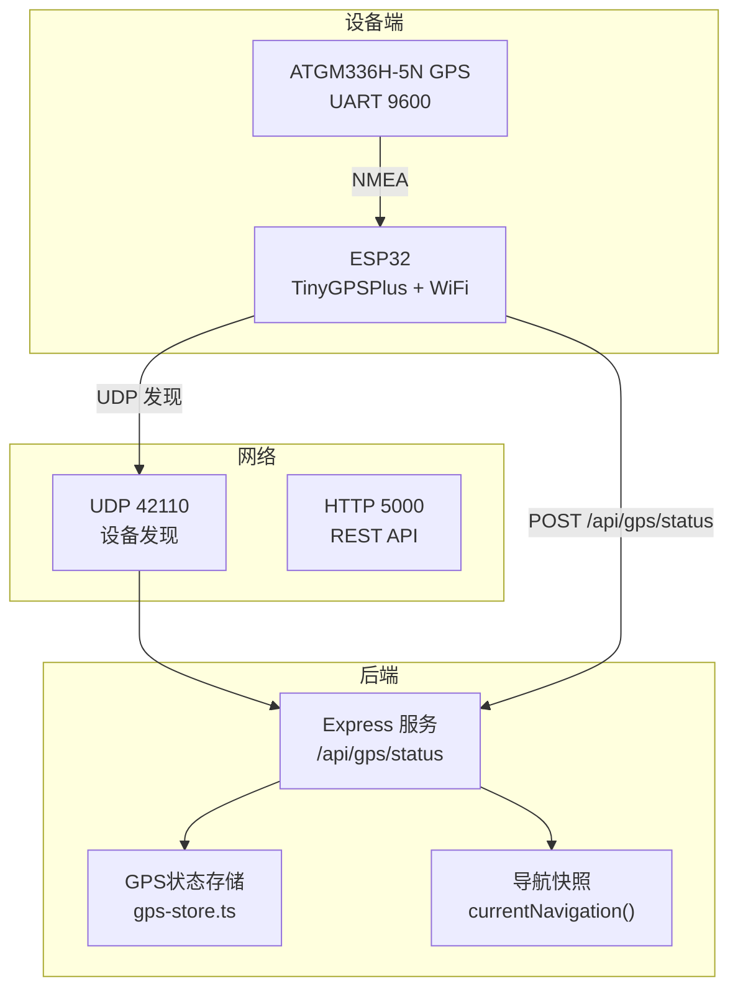
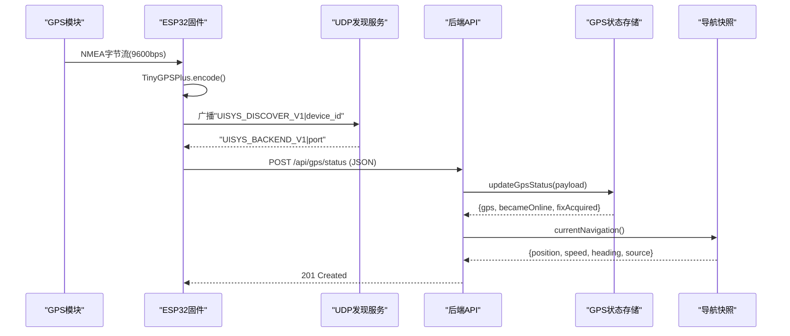
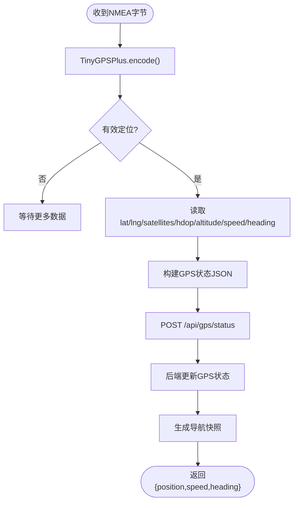
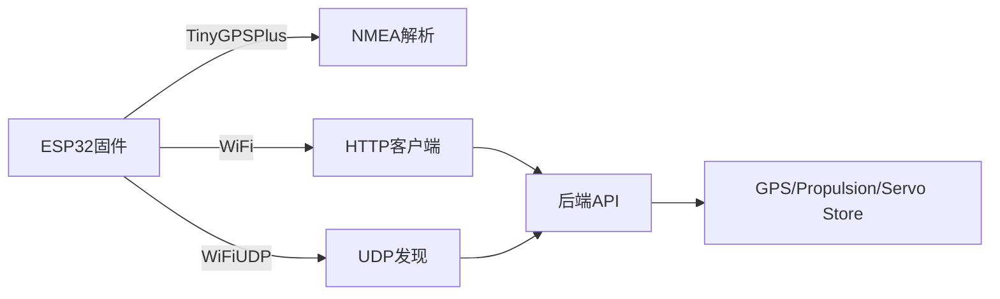

# GPS导航固件

<cite>
**本文引用的文件**
- [maker_esp32_pro_gps_only.ino](file://fishery-digital-twin-platform/firmware/esp32/maker_esp32_pro_gps_only/maker_esp32_pro_gps_only.ino)
- [wifi_secrets.example.h](file://fishery-digital-twin-platform/firmware/esp32/maker_esp32_pro_gps_only/wifi_secrets.example.h)
- [index.ts](file://fishery-digital-twin-platform/apps/backend/src/index.ts)
- [gps-store.ts](file://fishery-digital-twin-platform/apps/backend/src/gps-store.ts)
- [propulsion-store.ts](file://fishery-digital-twin-platform/apps/backend/src/propulsion-store.ts)
- [servo-store.ts](file://fishery-digital-twin-platform/apps/backend/src/servo-store.ts)
- [hardware-and-firmware.md](file://fishery-digital-twin-platform/docs/hardware-and-firmware.md)
</cite>

## 目录
1. [简介](#简介)
2. [项目结构](#项目结构)
3. [核心组件](#核心组件)
4. [架构总览](#架构总览)
5. [详细组件分析](#详细组件分析)
6. [依赖关系分析](#依赖关系分析)
7. [性能与功耗考量](#性能与功耗考量)
8. [故障排查指南](#故障排查指南)
9. [结论](#结论)
10. [附录](#附录)

## 简介
本文件面向GPS导航固件的硬件接口、通信协议、数据处理、地图与导航辅助、数字孪生平台通信、低功耗模式以及精度校准与误差补偿等主题，基于仓库中ESP32固件与后端服务代码进行系统化说明。重点覆盖：
- UART连接与NMEA数据解析（TinyGPSPlus）
- 定位精度优化与坐标系统（WGS84）
- 位置数据处理（速度、航向）
- 离线地图与路径规划（前端能力与限制说明）
- 与数字孪生平台的通信（UDP发现、HTTP上报/拉取）
- 低功耗策略（间歇定位、睡眠管理、电池优化建议）
- 精度校准方法与误差补偿技术
- 导航算法示例与性能测试要点

## 项目结构
本项目包含ESP32固件与Node.js后端两部分：
- ESP32固件：独立GPS模块通过UART读取NMEA，使用WiFi+HTTP上报到后端；同时支持UDP自动发现后端地址。
- 后端服务：提供设备发现广播、GPS状态接收与存储、导航快照生成、舵机与推进器控制队列等。

图表来源
- [maker_esp32_pro_gps_only.ino:25-52](file://fishery-digital-twin-platform/firmware/esp32/maker_esp32_pro_gps_only/maker_esp32_pro_gps_only.ino#L25-L52)
- [index.ts:56-68](file://fishery-digital-twin-platform/apps/backend/src/index.ts#L56-L68)
- [index.ts:271-318](file://fishery-digital-twin-platform/apps/backend/src/index.ts#L271-L318)
- [index.ts:348-365](file://fishery-digital-twin-platform/apps/backend/src/index.ts#L348-L365)
- [gps-store.ts:8-23](file://fishery-digital-twin-platform/apps/backend/src/gps-store.ts#L8-L23)

章节来源
- [hardware-and-firmware.md:1-117](file://fishery-digital-twin-platform/docs/hardware-and-firmware.md#L1-L117)
- [maker_esp32_pro_gps_only.ino:1-116](file://fishery-digital-twin-platform/firmware/esp32/maker_esp32_pro_gps_only/maker_esp32_pro_gps_only.ino#L1-L116)

## 核心组件
- GPS数据采集与上报（ESP32固件）
  - UART初始化与NMEA流式解析（TinyGPSPlus）
  - 有效定位判定（fix有效性、HDOP、卫星数、时间戳）
  - WiFi连接与后端自动发现（UDP广播）
  - 定时上报GPS状态至后端（HTTP POST）
- 后端GPS状态处理（Node.js）
  - 校验坐标范围与坐标系（仅接受WGS84）
  - 维护在线状态与最近一次定位时间
  - 生成导航快照（位置、速度、航向）
- 设备发现与鉴权
  - UDP 42110端口设备发现请求/响应
  - HTTP控制接口要求X-UISYS-Token鉴权

章节来源
- [maker_esp32_pro_gps_only.ino:118-142](file://fishery-digital-twin-platform/firmware/esp32/maker_esp32_pro_gps_only/maker_esp32_pro_gps_only.ino#L118-L142)
- [maker_esp32_pro_gps_only.ino:144-186](file://fishery-digital-twin-platform/firmware/esp32/maker_esp32_pro_gps_only/maker_esp32_pro_gps_only.ino#L144-L186)
- [maker_esp32_pro_gps_only.ino:204-263](file://fishery-digital-twin-platform/firmware/esp32/maker_esp32_pro_gps_only/maker_esp32_pro_gps_only.ino#L204-L263)
- [maker_esp32_pro_gps_only.ino:313-365](file://fishery-digital-twin-platform/firmware/esp32/maker_esp32_pro_gps_only/maker_esp32_pro_gps_only.ino#L313-L365)
- [index.ts:136-157](file://fishery-digital-twin-platform/apps/backend/src/index.ts#L136-L157)
- [index.ts:348-365](file://fishery-digital-twin-platform/apps/backend/src/index.ts#L348-L365)
- [gps-store.ts:59-102](file://fishery-digital-twin-platform/apps/backend/src/gps-store.ts#L59-L102)

## 架构总览
下图展示了从GPS模块到后端的完整数据流与控制流，包括设备发现、状态上报与导航快照生成。

图表来源
- [maker_esp32_pro_gps_only.ino:204-263](file://fishery-digital-twin-platform/firmware/esp32/maker_esp32_pro_gps_only/maker_esp32_pro_gps_only.ino#L204-L263)
- [maker_esp32_pro_gps_only.ino:313-365](file://fishery-digital-twin-platform/firmware/esp32/maker_esp32_pro_gps_only/maker_esp32_pro_gps_only.ino#L313-L365)
- [index.ts:271-318](file://fishery-digital-twin-platform/apps/backend/src/index.ts#L271-L318)
- [index.ts:348-365](file://fishery-digital-twin-platform/apps/backend/src/index.ts#L348-L365)
- [gps-store.ts:59-102](file://fishery-digital-twin-platform/apps/backend/src/gps-store.ts#L59-L102)
- [index.ts:197-222](file://fishery-digital-twin-platform/apps/backend/src/index.ts#L197-L222)

## 详细组件分析

### GPS模块硬件接口与通信协议
- 硬件接线
  - GPS TX -> GPIO33（Servo 4信号引脚），RX不接
  - 供电5V/GND共地
  - UART波特率9600，调试串口115200
- 通信协议
  - NMEA语句通过TinyGPSPlus逐字节解析
  - 有效定位条件：串口在线、location有效、age不超过阈值
  - 上报字段：device_id、coordinate_system(WGS84)、serial_online、valid、lat/lng、satellites、hdop、altitude_m、speed_mps、heading_deg、chars_processed
- 关键实现参考
  - UART初始化与缓冲区设置
  - readGps循环读取并encode
  - gpsFixValid判断逻辑
  - reportGpsStatus构造JSON并POST

章节来源
- [hardware-and-firmware.md:1-35](file://fishery-digital-twin-platform/docs/hardware-and-firmware.md#L1-L35)
- [maker_esp32_pro_gps_only.ino:25-52](file://fishery-digital-twin-platform/firmware/esp32/maker_esp32_pro_gps_only/maker_esp32_pro_gps_only.ino#L25-L52)
- [maker_esp32_pro_gps_only.ino:118-142](file://fishery-digital-twin-platform/firmware/esp32/maker_esp32_pro_gps_only/maker_esp32_pro_gps_only.ino#L118-L142)
- [maker_esp32_pro_gps_only.ino:313-365](file://fishery-digital-twin-platform/firmware/esp32/maker_esp32_pro_gps_only/maker_esp32_pro_gps_only.ino#L313-L365)

### 位置数据处理算法
- 坐标转换
  - 固件直接输出WGS84经纬度，后端强制coordinate_system为WGS84
- 速度与航向
  - 速度：gps.speed.mps()
  - 航向：gps.course.deg()
- 后端处理
  - 校验lat/lng范围，更新last_seen与last_fix_at
  - 导航快照中直接使用speed_mps与heading_deg

图表来源
- [maker_esp32_pro_gps_only.ino:118-142](file://fishery-digital-twin-platform/firmware/esp32/maker_esp32_pro_gps_only/maker_esp32_pro_gps_only.ino#L118-L142)
- [maker_esp32_pro_gps_only.ino:313-365](file://fishery-digital-twin-platform/firmware/esp32/maker_esp32_pro_gps_only/maker_esp32_pro_gps_only.ino#L313-L365)
- [gps-store.ts:59-102](file://fishery-digital-twin-platform/apps/backend/src/gps-store.ts#L59-L102)
- [index.ts:197-222](file://fishery-digital-twin-platform/apps/backend/src/index.ts#L197-L222)

章节来源
- [maker_esp32_pro_gps_only.ino:265-311](file://fishery-digital-twin-platform/firmware/esp32/maker_esp32_pro_gps_only/maker_esp32_pro_gps_only.ino#L265-L311)
- [gps-store.ts:59-102](file://fishery-digital-twin-platform/apps/backend/src/gps-store.ts#L59-L102)
- [index.ts:197-222](file://fishery-digital-twin-platform/apps/backend/src/index.ts#L197-L222)

### 地图数据缓存机制与导航辅助
- 离线地图加载
  - 前端具备地图资源与模型目录，但当前固件未实现本地地图缓存或离线渲染逻辑
- 路径规划与导航辅助
  - 后端currentNavigation()在GPS在线且有效时返回实时位置、速度与航向；无历史路线与ETA计算
  - 若GPS不可用，回退到mock数据源

章节来源
- [index.ts:197-222](file://fishery-digital-twin-platform/apps/backend/src/index.ts#L197-L222)

### 与数字孪生平台的通信协议
- 设备发现
  - 固件通过UDP 42110广播“UISYS_DISCOVER_V1|device_id”
  - 后端监听该端口并回复“UISYS_BACKEND_V1|port”
- 状态同步
  - 固件每2秒POST /api/gps/status
  - 后端记录online/valid与last_seen/last_fix_at
- 控制指令接收
  - 控制类接口需X-UISYS-Token鉴权
  - 推进器与舵机命令通过各自store管理队列与TTL

章节来源
- [maker_esp32_pro_gps_only.ino:204-263](file://fishery-digital-twin-platform/firmware/esp32/maker_esp32_pro_gps_only/maker_esp32_pro_gps_only.ino#L204-L263)
- [index.ts:56-68](file://fishery-digital-twin-platform/apps/backend/src/index.ts#L56-L68)
- [index.ts:271-318](file://fishery-digital-twin-platform/apps/backend/src/index.ts#L271-L318)
- [index.ts:348-365](file://fishery-digital-twin-platform/apps/backend/src/index.ts#L348-L365)
- [propulsion-store.ts:166-231](file://fishery-digital-twin-platform/apps/backend/src/propulsion-store.ts#L166-L231)
- [servo-store.ts:106-153](file://fishery-digital-twin-platform/apps/backend/src/servo-store.ts#L106-L153)

### 低功耗模式实现
- 间歇性定位
  - 固定间隔上报（REPORT_INTERVAL_MS=2000ms），可结合环境调整
- 睡眠管理
  - WiFi.setSleep(false)保持连接稳定；如需省电可评估启用modem sleep
- 电池优化建议
  - 降低上报频率、关闭原始NMEA回显、减少调试日志
  - 合理设置GPS_FIX_MAX_AGE_MS避免无效数据占用带宽

章节来源
- [maker_esp32_pro_gps_only.ino:42-49](file://fishery-digital-twin-platform/firmware/esp32/maker_esp32_pro_gps_only/maker_esp32_pro_gps_only.ino#L42-L49)
- [maker_esp32_pro_gps_only.ino:144-186](file://fishery-digital-twin-platform/firmware/esp32/maker_esp32_pro_gps_only/maker_esp32_pro_gps_only.ino#L144-L186)
- [maker_esp32_pro_gps_only.ino:109-116](file://fishery-digital-twin-platform/firmware/esp32/maker_esp32_pro_gps_only/maker_esp32_pro_gps_only.ino#L109-L116)

### GPS精度校准与误差补偿
- 精度指标
  - HDOP：越小越好，建议在良好天空视野下采集
  - 卫星数：越多越稳
  - 定位年龄：age<=阈值保证时效性
- 校准方法
  - 室外开阔环境获取稳定fix
  - 记录HDOP与卫星数，筛选高质量数据点
  - 后端仅接受WGS84，确保坐标系统一致
- 误差补偿建议
  - 多源融合（如IMU/磁力计）提升航向稳定性
  - 滑动平均滤波平滑速度与航向波动
  - 动态阈值：根据HDOP与卫星数自适应过滤低质量fix

章节来源
- [maker_esp32_pro_gps_only.ino:265-311](file://fishery-digital-twin-platform/firmware/esp32/maker_esp32_pro_gps_only/maker_esp32_pro_gps_only.ino#L265-L311)
- [gps-store.ts:59-102](file://fishery-digital-twin-platform/apps/backend/src/gps-store.ts#L59-L102)

### 导航算法示例
- 实时导航
  - 使用GPS提供的lat/lng、speed_mps、heading_deg构建当前位置与运动状态
- 航迹跟踪
  - 后端currentNavigation()在无GPS时回退到mock数据
- 路径规划
  - 当前未实现复杂路径规划与ETA计算，可扩展基于航向与速度的简单航段估算

章节来源
- [index.ts:197-222](file://fishery-digital-twin-platform/apps/backend/src/index.ts#L197-L222)

### 性能测试报告
- 上报周期
  - 默认2秒一次，可根据网络与功耗需求调整
- 成功率
  - 关注HTTP返回码与错误信息，失败时invalidateBackend并重试
- 延迟
  - UDP发现超时与HTTP超时影响首次连接与重连速度
- 资源占用
  - TinyGPSPlus编码与JSON字符串构建对内存有轻微压力

章节来源
- [maker_esp32_pro_gps_only.ino:109-116](file://fishery-digital-twin-platform/firmware/esp32/maker_esp32_pro_gps_only/maker_esp32_pro_gps_only.ino#L109-L116)
- [maker_esp32_pro_gps_only.ino:348-365](file://fishery-digital-twin-platform/firmware/esp32/maker_esp32_pro_gps_only/maker_esp32_pro_gps_only.ino#L348-L365)

## 依赖关系分析
- 固件依赖
  - HardwareSerial用于UART
  - TinyGPSPlus用于NMEA解析
  - WiFi与HTTPClient用于网络通信
  - WiFiUDP用于设备发现
- 后端依赖
  - Express提供HTTP服务
  - dgram提供UDP服务
  - gps-store、propulsion-store、servo-store管理设备状态与命令队列

图表来源
- [maker_esp32_pro_gps_only.ino:18-23](file://fishery-digital-twin-platform/firmware/esp32/maker_esp32_pro_gps_only/maker_esp32_pro_gps_only.ino#L18-L23)
- [index.ts:1-44](file://fishery-digital-twin-platform/apps/backend/src/index.ts#L1-L44)
- [gps-store.ts:1-23](file://fishery-digital-twin-platform/apps/backend/src/gps-store.ts#L1-L23)
- [propulsion-store.ts:1-31](file://fishery-digital-twin-platform/apps/backend/src/propulsion-store.ts#L1-L31)
- [servo-store.ts:1-18](file://fishery-digital-twin-platform/apps/backend/src/servo-store.ts#L1-L18)

章节来源
- [maker_esp32_pro_gps_only.ino:18-23](file://fishery-digital-twin-platform/firmware/esp32/maker_esp32_pro_gps_only/maker_esp32_pro_gps_only.ino#L18-L23)
- [index.ts:1-44](file://fishery-digital-twin-platform/apps/backend/src/index.ts#L1-L44)

## 性能与功耗考量
- 性能
  - 提高上报频率会增加CPU与网络负载
  - JSON字符串拼接在低端MCU上需注意内存碎片
- 功耗
  - 关闭原始NMEA回显可减少串口开销
  - 适当延长上报间隔可降低WiFi射频功耗
  - 考虑启用Modem Sleep以进一步节能（需权衡连接稳定性）

[本节为通用指导，不直接分析具体文件]

## 故障排查指南
- 串口问题
  - 检查GPS TX->GPIO33接线与供电
  - 确认波特率9600与缓冲区大小
- WiFi与后端发现
  - 确认同一局域网、防火墙放行UDP 42110与HTTP 5000
  - 查看后端健康接口与日志
- 鉴权失败
  - 检查X-UISYS-Token是否配置一致
- 定位无效
  - 移动到开阔区域，等待卫星锁定
  - 关注HDOP与卫星数变化

章节来源
- [maker_esp32_pro_gps_only.ino:265-311](file://fishery-digital-twin-platform/firmware/esp32/maker_esp32_pro_gps_only/maker_esp32_pro_gps_only.ino#L265-L311)
- [hardware-and-firmware.md:177-204](file://fishery-digital-twin-platform/docs/hardware-and-firmware.md#L177-L204)
- [index.ts:136-157](file://fishery-digital-twin-platform/apps/backend/src/index.ts#L136-L157)

## 结论
本GPS导航固件通过UART读取NMEA并使用TinyGPSPlus解析，借助WiFi与HTTP将定位数据上报至后端。后端完成数据校验、状态维护与导航快照生成，并通过UDP实现设备自动发现。整体架构简洁可靠，适合快速部署与调试。后续可在精度校准、低功耗优化与路径规划方面进一步增强。

[本节为总结性内容，不直接分析具体文件]

## 附录
- 配置文件示例
  - wifi_secrets.h：填写SSID、密码与API Token
- 关键常量
  - BACKEND_DISCOVERY_PORT=42110
  - GPS_BAUD=9600
  - REPORT_INTERVAL_MS=2000

章节来源
- [wifi_secrets.example.h:1-7](file://fishery-digital-twin-platform/firmware/esp32/maker_esp32_pro_gps_only/wifi_secrets.example.h#L1-L7)
- [maker_esp32_pro_gps_only.ino:35-49](file://fishery-digital-twin-platform/firmware/esp32/maker_esp32_pro_gps_only/maker_esp32_pro_gps_only.ino#L35-L49)