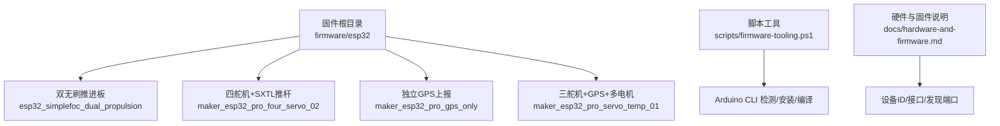
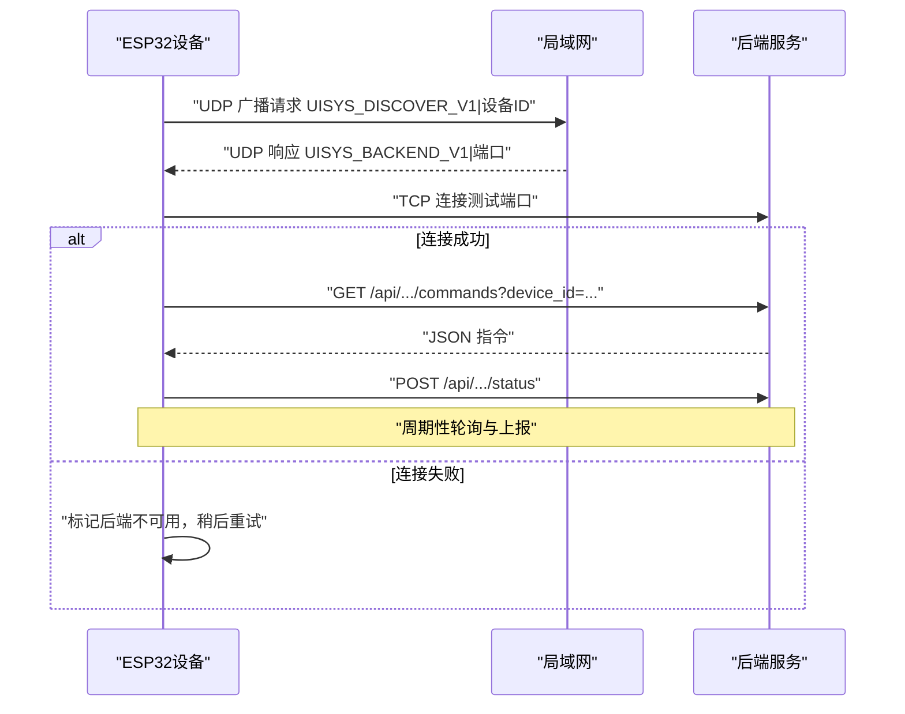
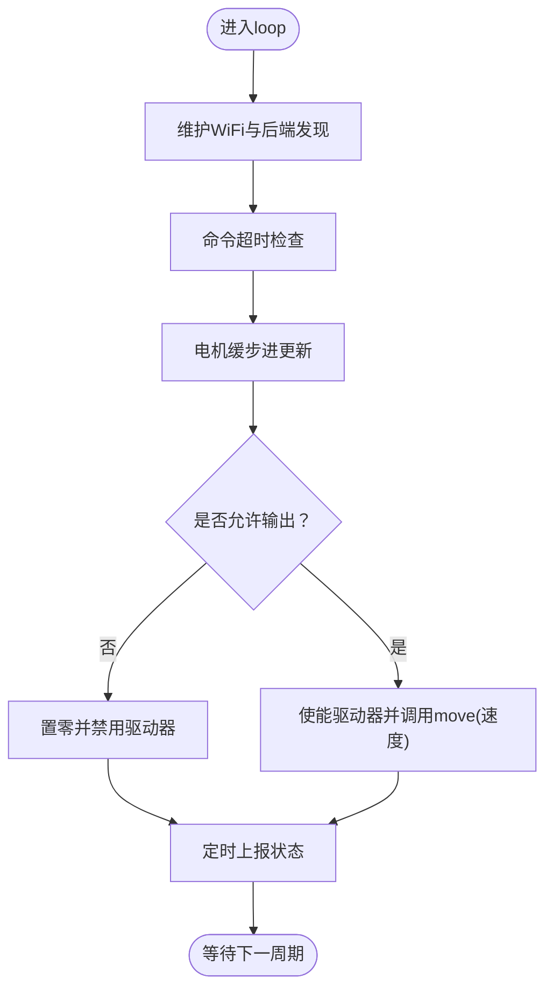
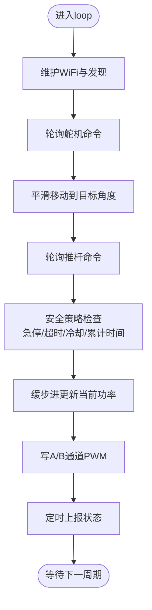
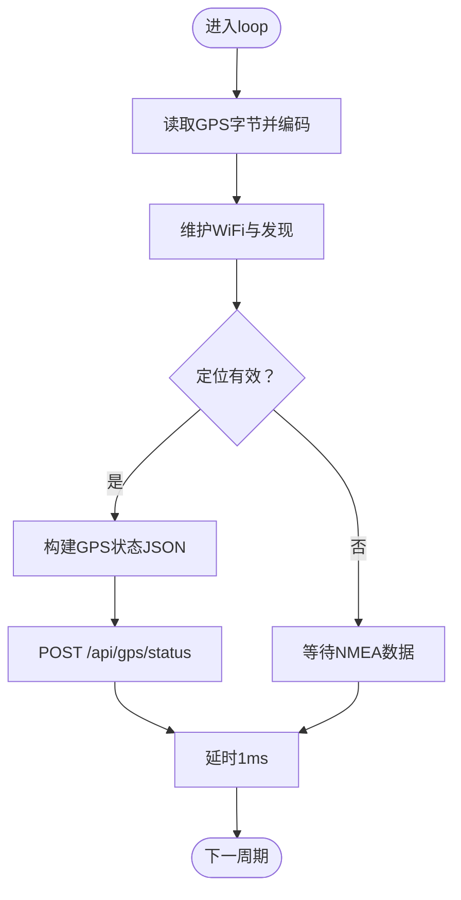
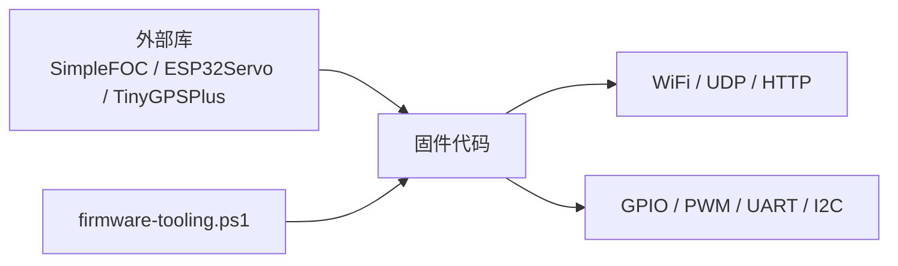

# 固件开发

<cite>
**本文引用的文件**
- [esp32_simplefoc_dual_propulsion.ino](file://fishery-digital-twin-platform/firmware/esp32/esp32_simplefoc_dual_propulsion/esp32_simplefoc_dual_propulsion.ino)
- [maker_esp32_pro_four_servo_02.ino](file://fishery-digital-twin-platform/firmware/esp32/maker_esp32_pro_four_servo_02/maker_esp32_pro_four_servo_02.ino)
- [maker_esp32_pro_gps_only.ino](file://fishery-digital-twin-platform/firmware/esp32/maker_esp32_pro_gps_only/maker_esp32_pro_gps_only.ino)
- [maker_esp32_pro_servo_temp_01.ino](file://fishery-digital-twin-platform/firmware/esp32/maker_esp32_pro_servo_temp_01/maker_esp32_pro_servo_temp_01.ino)
- [wifi_secrets.example.h（双无刷推进板）](file://fishery-digital-twin-platform/firmware/esp32/esp32_simplefoc_dual_propulsion/wifi_secrets.example.h)
- [wifi_secrets.example.h（四舵机板）](file://fishery-digital-twin-platform/firmware/esp32/maker_esp32_pro_four_servo_02/wifi_secrets.example.h)
- [hardware-and-firmware.md](file://fishery-digital-twin-platform/docs/hardware-and-firmware.md)
- [firmware-tooling.ps1](file://fishery-digital-twin-platform/scripts/firmware-tooling.ps1)
</cite>

## 目录
1. [简介](#简介)
2. [项目结构](#项目结构)
3. [核心组件](#核心组件)
4. [架构总览](#架构总览)
5. [详细组件分析](#详细组件分析)
6. [依赖关系分析](#依赖关系分析)
7. [性能与低功耗](#性能与低功耗)
8. [故障排查指南](#故障排查指南)
9. [结论](#结论)
10. [附录：开发与部署流程](#附录：开发与部署流程)

## 简介
本文件面向ESP32嵌入式设备的固件开发，覆盖Arduino框架使用、项目结构与库管理、编译配置与调试方法；并针对四类设备类型给出专用固件说明：舵机控制板、GPS模块、温度传感器（在现有代码中以舵机+电机+GPS组合形式体现）、无刷推进器。文档还阐述硬件抽象层设计（GPIO、中断、定时器、外设驱动）、网络通信（WiFi、UDP广播发现、HTTP客户端、TCP连接测试）、设备发现机制（自动IP发现、令牌认证、心跳/超时、故障恢复）、低功耗优化建议，以及固件开发规范、测试方法与部署流程。

## 项目结构
仓库中的固件位于 firmware/esp32 下，按设备类型分目录组织，每个目录包含一个 .ino 主程序与 wifi_secrets.example.h 模板。脚本 scripts/firmware-tooling.ps1 提供 Arduino CLI 检测、依赖安装与批量编译能力。文档 docs/hardware-and-firmware.md 汇总了硬件接线、设备ID、后端接口与WiFi自动发现方式。

图表来源
- [firmware-tooling.ps1:10-75](file://fishery-digital-twin-platform/scripts/firmware-tooling.ps1#L10-L75)
- [hardware-and-firmware.md:118-159](file://fishery-digital-twin-platform/docs/hardware-and-firmware.md#L118-L159)

章节来源
- [hardware-and-firmware.md:1-117](file://fishery-digital-twin-platform/docs/hardware-and-firmware.md#L1-L117)
- [firmware-tooling.ps1:1-75](file://fishery-digital-twin-platform/scripts/firmware-tooling.ps1#L1-L75)

## 核心组件
- 网络栈与自动发现
  - WiFi STA 模式连接，关闭深度睡眠以降低时延。
  - UDP 广播发现后端：设备向 42110 端口发送请求，附带设备ID；后端以“UISYS_BACKEND_V1|端口”格式回复；设备解析后建立 HTTP 基础地址。
  - TCP 连通性测试：发现成功后尝试连接后端端口，失败则失效缓存并重试。
  - 令牌认证：所有HTTP请求携带 X-UISYS-Token 头，令牌来自 wifi_secrets.h。
- 设备命令轮询与状态上报
  - 舵机类设备：周期性 GET /api/device/commands?device_id=... 获取角度指令，解析后平滑移动舵机，并 POST /api/servos/status 上报。
  - 推进类设备：周期性 GET /api/propulsion/commands?device_id=... 获取功率/急停/模式等指令，执行后 POST /api/propulsion/status 上报实际功率与状态。
  - GPS类设备：读取NMEA数据，定时 POST /api/gps/status 上报坐标、卫星数、HDOP、高度、速度、航向等。
- 硬件抽象与驱动
  - 舵机：通过 ESP32Servo 库控制 PWM 脉宽，限制角度范围，避免频繁重复写入。
  - 直流/线性电机：通过 GPIO + analogWrite 实现H桥方向与PWM调速，带死区、缓启动、超时保护与冷却逻辑。
  - 无刷推进：SimpleFOC 库驱动 BLDCMotor 与 BLDCDriver3PWM，支持开环/闭环速度控制、电流采样、I2C磁编码器。
- 安全与可靠性
  - 急停、命令超时、断网停止、累积运行时间限制与冷却周期。
  - 参数校验与边界约束（最大功率、角度范围、电压/速度限制）。

章节来源
- [esp32_simplefoc_dual_propulsion.ino:326-474](file://fishery-digital-twin-platform/firmware/esp32/esp32_simplefoc_dual_propulsion/esp32_simplefoc_dual_propulsion.ino#L326-L474)
- [maker_esp32_pro_four_servo_02.ino:252-400](file://fishery-digital-twin-platform/firmware/esp32/maker_esp32_pro_four_servo_02/maker_esp32_pro_four_servo_02.ino#L252-L400)
- [maker_esp32_pro_gps_only.ino:144-263](file://fishery-digital-twin-platform/firmware/esp32/maker_esp32_pro_gps_only/maker_esp32_pro_gps_only.ino#L144-L263)
- [maker_esp32_pro_servo_temp_01.ino:305-458](file://fishery-digital-twin-platform/firmware/esp32/maker_esp32_pro_servo_temp_01/maker_esp32_pro_servo_temp_01.ino#L305-L458)

## 架构总览
下图展示了设备端与后端之间的交互流程：设备通过UDP广播发现后端，随后通过HTTP轮询命令并上报状态；同时保持WiFi连接维护与重连逻辑。

图表来源
- [esp32_simplefoc_dual_propulsion.ino:369-445](file://fishery-digital-twin-platform/firmware/esp32/esp32_simplefoc_dual_propulsion/esp32_simplefoc_dual_propulsion.ino#L369-L445)
- [maker_esp32_pro_four_servo_02.ino:295-371](file://fishery-digital-twin-platform/firmware/esp32/maker_esp32_pro_four_servo_02/maker_esp32_pro_four_servo_02.ino#L295-L371)
- [maker_esp32_pro_gps_only.ino:204-263](file://fishery-digital-twin-platform/firmware/esp32/maker_esp32_pro_gps_only/maker_esp32_pro_gps_only.ino#L204-L263)
- [maker_esp32_pro_servo_temp_01.ino:349-426](file://fishery-digital-twin-platform/firmware/esp32/maker_esp32_pro_servo_temp_01/maker_esp32_pro_servo_temp_01.ino#L349-L426)

## 详细组件分析

### 无刷推进器固件（双BLDC）
- 目标与能力
  - 基于 SimpleFOC 库控制左右两路无刷电机，支持开环速度控制与可选的闭环速度控制（需I2C磁编码器）。
  - 可选电流采样（INA240），用于限流与保护。
  - 通过HTTP轮询获取推进指令，按百分比映射到速度上限，带死区与缓步进。
- 关键流程
  - 初始化：设置PWM引脚、驱动器、电机参数、可选编码器与电流采样，禁用输出确保安全。
  - 网络：WiFi连接→UDP发现→TCP测试→建立后端地址。
  - 控制循环：维护WiFi、命令超时处理、电机缓步进、应用输出（使能/失能、move速度）。
  - 状态上报：构造JSON并POST至 /api/propulsion/status。
- 安全与约束
  - 默认禁止电机输出，需确认引脚映射与安全后再启用。
  - 急停、Web模式开关、命令超时均会停止输出。
  - 功率到速度映射带死区与限幅。

图表来源
- [esp32_simplefoc_dual_propulsion.ino:219-236](file://fishery-digital-twin-platform/firmware/esp32/esp32_simplefoc_dual_propulsion/esp32_simplefoc_dual_propulsion.ino#L219-L236)
- [esp32_simplefoc_dual_propulsion.ino:615-666](file://fishery-digital-twin-platform/firmware/esp32/esp32_simplefoc_dual_propulsion/esp32_simplefoc_dual_propulsion.ino#L615-L666)
- [esp32_simplefoc_dual_propulsion.ino:668-700](file://fishery-digital-twin-platform/firmware/esp32/esp32_simplefoc_dual_propulsion/esp32_simplefoc_dual_propulsion.ino#L668-L700)

章节来源
- [esp32_simplefoc_dual_propulsion.ino:23-131](file://fishery-digital-twin-platform/firmware/esp32/esp32_simplefoc_dual_propulsion/esp32_simplefoc_dual_propulsion.ino#L23-L131)
- [esp32_simplefoc_dual_propulsion.ino:238-324](file://fishery-digital-twin-platform/firmware/esp32/esp32_simplefoc_dual_propulsion/esp32_simplefoc_dual_propulsion.ino#L238-L324)
- [esp32_simplefoc_dual_propulsion.ino:476-526](file://fishery-digital-twin-platform/firmware/esp32/esp32_simplefoc_dual_propulsion/esp32_simplefoc_dual_propulsion.ino#L476-L526)
- [esp32_simplefoc_dual_propulsion.ino:589-666](file://fishery-digital-twin-platform/firmware/esp32/esp32_simplefoc_dual_propulsion/esp32_simplefoc_dual_propulsion.ino#L589-L666)
- [esp32_simplefoc_dual_propulsion.ino:668-722](file://fishery-digital-twin-platform/firmware/esp32/esp32_simplefoc_dual_propulsion/esp32_simplefoc_dual_propulsion.ino#L668-L722)

### 舵机控制板（四舵机 + SXTL推杆）
- 目标与能力
  - 控制4路舵机，角度范围限制与平滑移动。
  - 通过M0端口驱动SXTL电动推杆，具备方向切换、累计运行时间限制与冷却逻辑。
  - 分别轮询舵机命令与推杆命令，并上报各自状态。
- 关键流程
  - 初始化：舵机attach、推杆GPIO与PWM频率设置、初始停止。
  - 网络：同通用发现流程。
  - 控制循环：轮询舵机命令→平滑移动到目标角度；轮询推杆命令→应用安全策略→缓步进→写PWM。
  - 状态上报：舵机角度与推杆状态分别上报。
- 安全与约束
  - 推杆方向切换先归零再反向，防止冲击。
  - 累计运行时间与往返次数限制触发冷却，期间拒绝新命令。
  - 断网或急停立即停止输出。

图表来源
- [maker_esp32_pro_four_servo_02.ino:184-209](file://fishery-digital-twin-platform/firmware/esp32/maker_esp32_pro_four_servo_02/maker_esp32_pro_four_servo_02.ino#L184-L209)
- [maker_esp32_pro_four_servo_02.ino:605-637](file://fishery-digital-twin-platform/firmware/esp32/maker_esp32_pro_four_servo_02/maker_esp32_pro_four_servo_02.ino#L605-L637)
- [maker_esp32_pro_four_servo_02.ino:639-769](file://fishery-digital-twin-platform/firmware/esp32/maker_esp32_pro_four_servo_02/maker_esp32_pro_four_servo_02.ino#L639-L769)

章节来源
- [maker_esp32_pro_four_servo_02.ino:33-167](file://fishery-digital-twin-platform/firmware/esp32/maker_esp32_pro_four_servo_02/maker_esp32_pro_four_servo_02.ino#L33-L167)
- [maker_esp32_pro_four_servo_02.ino:211-250](file://fishery-digital-twin-platform/firmware/esp32/maker_esp32_pro_four_servo_02/maker_esp32_pro_four_servo_02.ino#L211-L250)
- [maker_esp32_pro_four_servo_02.ino:402-468](file://fishery-digital-twin-platform/firmware/esp32/maker_esp32_pro_four_servo_02/maker_esp32_pro_four_servo_02.ino#L402-L468)
- [maker_esp32_pro_four_servo_02.ino:470-603](file://fishery-digital-twin-platform/firmware/esp32/maker_esp32_pro_four_servo_02/maker_esp32_pro_four_servo_02.ino#L470-L603)
- [maker_esp32_pro_four_servo_02.ino:639-796](file://fishery-digital-twin-platform/firmware/esp32/maker_esp32_pro_four_servo_02/maker_esp32_pro_four_servo_02.ino#L639-L796)

### GPS模块（独立上报）
- 目标与能力
  - 通过UART接收ATGM336H-5N的NMEA数据，解析位置、卫星数、HDOP、高度、速度与航向。
  - 定期将GPS状态POST到后端 /api/gps/status。
- 关键流程
  - 初始化：串口配置、RX上拉、缓冲区大小设置。
  - 数据读取：循环读取字节并编码到TinyGPSPlus。
  - 网络：WiFi连接与后端发现，周期性上报。
- 质量与健壮性
  - 判断串口在线与定位有效（年龄阈值）。
  - 断网时跳过上报并记录日志。

图表来源
- [maker_esp32_pro_gps_only.ino:99-116](file://fishery-digital-twin-platform/firmware/esp32/maker_esp32_pro_gps_only/maker_esp32_pro_gps_only.ino#L99-L116)
- [maker_esp32_pro_gps_only.ino:118-142](file://fishery-digital-twin-platform/firmware/esp32/maker_esp32_pro_gps_only/maker_esp32_pro_gps_only.ino#L118-L142)
- [maker_esp32_pro_gps_only.ino:313-366](file://fishery-digital-twin-platform/firmware/esp32/maker_esp32_pro_gps_only/maker_esp32_pro_gps_only.ino#L313-L366)

章节来源
- [maker_esp32_pro_gps_only.ino:18-52](file://fishery-digital-twin-platform/firmware/esp32/maker_esp32_pro_gps_only/maker_esp32_pro_gps_only.ino#L18-L52)
- [maker_esp32_pro_gps_only.ino:82-116](file://fishery-digital-twin-platform/firmware/esp32/maker_esp32_pro_gps_only/maker_esp32_pro_gps_only.ino#L82-L116)
- [maker_esp32_pro_gps_only.ino:144-263](file://fishery-digital-twin-platform/firmware/esp32/maker_esp32_pro_gps_only/maker_esp32_pro_gps_only.ino#L144-L263)
- [maker_esp32_pro_gps_only.ino:265-366](file://fishery-digital-twin-platform/firmware/esp32/maker_esp32_pro_gps_only/maker_esp32_pro_gps_only.ino#L265-L366)

### 舵机+GPS+多电机（组合板）
- 目标与能力
  - 控制三路舵机（其中两轴为云台，角度受限），通过GPIO33接收GPS数据。
  - 驱动M0（37GB555有刷电机）与M1/M2（双推杆），分别轮询对应设备ID的命令并上报状态。
- 关键流程
  - 初始化：舵机attach、GPS UART、电机GPIO与PWM频率设置。
  - 网络：WiFi连接与后端发现。
  - 控制循环：轮询舵机命令→平滑移动；轮询电机命令→安全策略→缓步进→写PWM；定时上报GPS与电机状态。
- 安全与约束
  - 云台角度限制在0°–160°，避免机械损坏。
  - 电机命令超时与断网立即停止输出。
  - 多设备ID轮询，降低单次请求负载。

章节来源
- [maker_esp32_pro_servo_temp_01.ino:30-186](file://fishery-digital-twin-platform/firmware/esp32/maker_esp32_pro_servo_temp_01/maker_esp32_pro_servo_temp_01.ino#L30-L186)
- [maker_esp32_pro_servo_temp_01.ino:252-303](file://fishery-digital-twin-platform/firmware/esp32/maker_esp32_pro_servo_temp_01/maker_esp32_pro_servo_temp_01.ino#L252-L303)
- [maker_esp32_pro_servo_temp_01.ino:460-534](file://fishery-digital-twin-platform/firmware/esp32/maker_esp32_pro_servo_temp_01/maker_esp32_pro_servo_temp_01.ino#L460-L534)
- [maker_esp32_pro_servo_temp_01.ino:536-629](file://fishery-digital-twin-platform/firmware/esp32/maker_esp32_pro_servo_temp_01/maker_esp32_pro_servo_temp_01.ino#L536-L629)
- [maker_esp32_pro_servo_temp_01.ino:729-800](file://fishery-digital-twin-platform/firmware/esp32/maker_esp32_pro_servo_temp_01/maker_esp32_pro_servo_temp_01.ino#L729-L800)

## 依赖关系分析
- 外部库
  - SimpleFOC：无刷电机控制与FOC算法。
  - ESP32Servo：舵机PWM生成与控制。
  - TinyGPSPlus：NMEA解析与地理信息提取。
  - Arduino内置：WiFi、WiFiUdp、HTTPClient、Wire、HardwareSerial。
- 内部依赖
  - 所有固件共享相同的UDP发现协议与HTTP API约定。
  - 各设备通过不同DEVICE_ID区分，后端据此路由命令与状态。
- 工具链
  - Arduino CLI由脚本自动查找与安装ESP32核心及所需库，支持批量编译。

图表来源
- [firmware-tooling.ps1:46-71](file://fishery-digital-twin-platform/scripts/firmware-tooling.ps1#L46-L71)
- [esp32_simplefoc_dual_propulsion.ino:23-29](file://fishery-digital-twin-platform/firmware/esp32/esp32_simplefoc_dual_propulsion/esp32_simplefoc_dual_propulsion.ino#L23-L29)
- [maker_esp32_pro_four_servo_02.ino:33-38](file://fishery-digital-twin-platform/firmware/esp32/maker_esp32_pro_four_servo_02/maker_esp32_pro_four_servo_02.ino#L33-L38)
- [maker_esp32_pro_gps_only.ino:18-24](file://fishery-digital-twin-platform/firmware/esp32/maker_esp32_pro_gps_only/maker_esp32_pro_gps_only.ino#L18-L24)
- [maker_esp32_pro_servo_temp_01.ino:30-37](file://fishery-digital-twin-platform/firmware/esp32/maker_esp32_pro_servo_temp_01/maker_esp32_pro_servo_temp_01.ino#L30-L37)

章节来源
- [firmware-tooling.ps1:10-75](file://fishery-digital-twin-platform/scripts/firmware-tooling.ps1#L10-L75)

## 性能与低功耗
- 性能特性
  - 非阻塞轮询：使用millis()进行周期任务调度，避免阻塞。
  - 平滑控制：舵机角度步进、电机功率缓步进，减少抖动与冲击。
  - 最小化网络开销：仅在角度变化时更新舵机，避免重复写入。
- 低功耗建议
  - 当前固件关闭WiFi深度睡眠以降低时延，适合实时控制场景。
  - 若需延长电池续航，可在空闲阶段采用轻睡眠（light sleep）或调制WiFi连接周期，但需权衡控制延迟与丢包风险。
  - 合理设置命令与状态上报间隔，避免过度网络活动。
  - 对无刷电机与直流电机，使用死区与限流避免无效功耗。

[本节为通用指导，不直接分析具体文件]

## 故障排查指南
- WiFi连接问题
  - 检查SSID与密码是否正确，确保设备与后端在同一WiFi且无客户端隔离。
  - 查看串口日志中“Connecting WiFi”与“Reconnecting WiFi...”提示。
- 后端发现失败
  - 确认后端监听UDP 42110并正确回复“UISYS_BACKEND_V1|端口”。
  - 检查防火墙是否放行UDP与TCP端口。
- HTTP请求错误
  - 查看GET/POST返回码与错误字符串，必要时降低超时或重试间隔。
  - 确认X-UISYS-Token与后端一致。
- 设备控制异常
  - 舵机抖动或啸叫：检查供电、共地、脉宽范围与机械限位。
  - 电机不停止：检查急停、命令超时与断网停止逻辑是否生效。
  - GPS无定位：确认天线朝向、串口接线与波特率，查看NMEA数据。

章节来源
- [esp32_simplefoc_dual_propulsion.ino:326-474](file://fishery-digital-twin-platform/firmware/esp32/esp32_simplefoc_dual_propulsion/esp32_simplefoc_dual_propulsion.ino#L326-L474)
- [maker_esp32_pro_four_servo_02.ino:252-400](file://fishery-digital-twin-platform/firmware/esp32/maker_esp32_pro_four_servo_02/maker_esp32_pro_four_servo_02.ino#L252-L400)
- [maker_esp32_pro_gps_only.ino:144-263](file://fishery-digital-twin-platform/firmware/esp32/maker_esp32_pro_gps_only/maker_esp32_pro_gps_only.ino#L144-L263)
- [maker_esp32_pro_servo_temp_01.ino:305-458](file://fishery-digital-twin-platform/firmware/esp32/maker_esp32_pro_servo_temp_01/maker_esp32_pro_servo_temp_01.ino#L305-L458)

## 结论
该固件体系以统一的UDP发现与HTTP API为基础，针对不同设备类型实现了可靠的控制与上报逻辑。通过参数化配置、安全策略与平滑控制，兼顾了安全性与实时性。结合脚本化工具与文档，开发者可快速完成环境搭建、编译与部署，并在现场进行调试与优化。

[本节为总结，不直接分析具体文件]

## 附录：开发与部署流程
- 环境准备
  - 安装Arduino IDE 2.x，脚本会自动查找arduino-cli。
  - 首次运行脚本选择安装依赖：ESP32核心、ESP32Servo、TinyGPSPlus、SimpleFOC。
- 配置网络与令牌
  - 复制对应目录的 wifi_secrets.example.h 为 wifi_secrets.h，填写WIFI_SSID、WIFI_PASSWORD与UISYS_API_TOKEN。
  - 确保后端已启动并可从浏览器访问健康检查接口。
- 编译与烧录
  - 使用脚本批量编译所有固件，或单独编译指定 .ino。
  - 通过Arduino IDE或CLI烧录到ESP32设备。
- 验证与调试
  - 观察串口日志，确认WiFi连接、后端发现、命令轮询与状态上报。
  - 使用后端健康检查与设备状态页面验证端到端链路。
- 发布与维护
  - 版本标识在固件中声明，便于追踪。
  - 修改参数或逻辑后重新编译并灰度部署，监控日志与状态。

章节来源
- [firmware-tooling.ps1:10-75](file://fishery-digital-twin-platform/scripts/firmware-tooling.ps1#L10-L75)
- [wifi_secrets.example.h（双无刷推进板）:1-7](file://fishery-digital-twin-platform/firmware/esp32/esp32_simplefoc_dual_propulsion/wifi_secrets.example.h#L1-L7)
- [wifi_secrets.example.h（四舵机板）:1-7](file://fishery-digital-twin-platform/firmware/esp32/maker_esp32_pro_four_servo_02/wifi_secrets.example.h#L1-L7)
- [hardware-and-firmware.md:167-204](file://fishery-digital-twin-platform/docs/hardware-and-firmware.md#L167-L204)