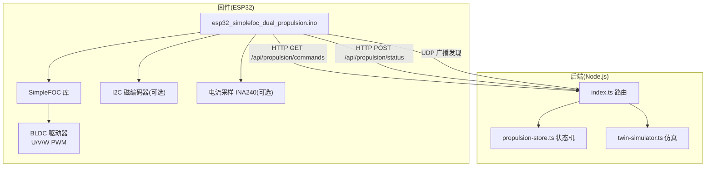
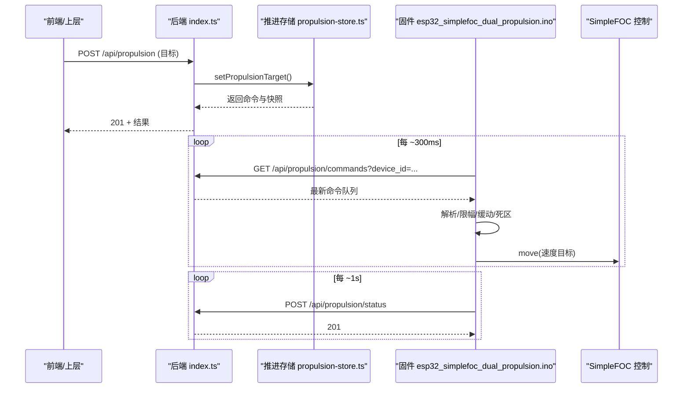
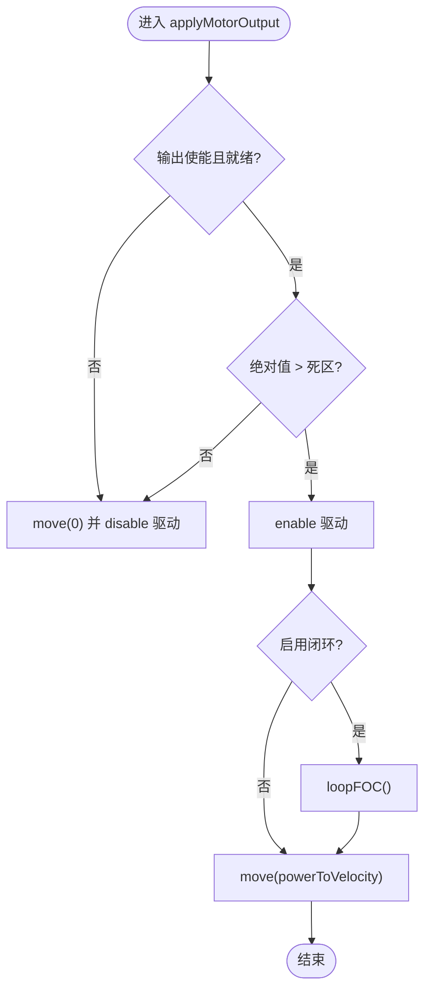
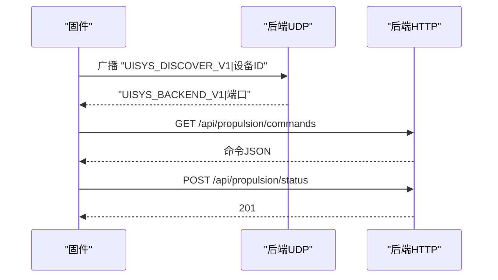
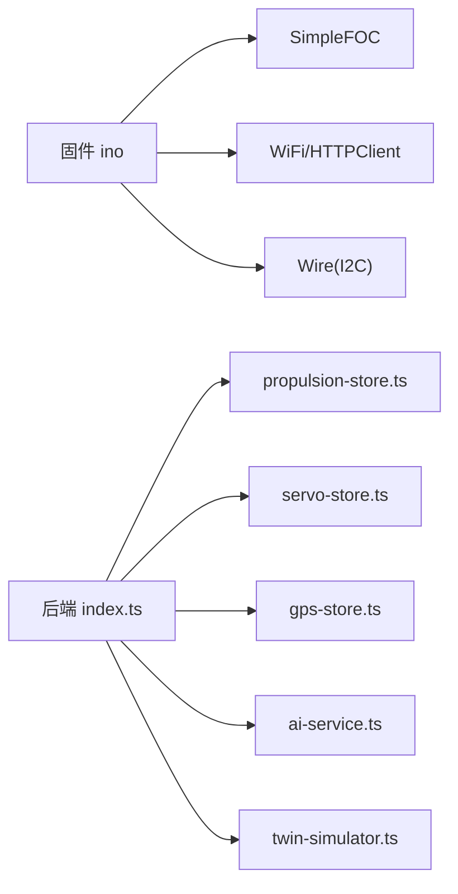

# 推进系统固件

<cite>
**本文引用的文件**
- [esp32_simplefoc_dual_propulsion.ino](file://fishery-digital-twin-platform/firmware/esp32/esp32_simplefoc_dual_propulsion/esp32_simplefoc_dual_propulsion.ino)
- [README.md](file://fishery-digital-twin-platform/firmware/esp32/esp32_simplefoc_dual_propulsion/README.md)
- [hardware-and-firmware.md](file://fishery-digital-twin-platform/docs/hardware-and-firmware.md)
- [propulsion-store.ts](file://fishery-digital-twin-platform/apps/backend/src/propulsion-store.ts)
- [index.ts](file://fishery-digital-twin-platform/apps/backend/src/index.ts)
- [twin-simulator.ts](file://fishery-digital-twin-platform/apps/backend/src/twin-simulator.ts)
</cite>

## 目录
1. [简介](#简介)
2. [项目结构](#项目结构)
3. [核心组件](#核心组件)
4. [架构总览](#架构总览)
5. [详细组件分析](#详细组件分析)
6. [依赖关系分析](#依赖关系分析)
7. [性能与功耗考量](#性能与功耗考量)
8. [故障排查指南](#故障排查指南)
9. [结论](#结论)
10. [附录：调试与测试流程、电机选型与调优案例](#附录调试与测试流程电机选型与调优案例)

## 简介
本文件面向“双无刷推进器”的固件与控制体系，覆盖硬件架构、控制原理、SimpleFOC 使用方式、FOC 算法与参数整定思路、双推进器协调控制（推力分配、姿态稳定、差速转向）、速度闭环控制（PID 调节、传感器集成、动态响应优化）、功率管理（电流限制、过热保护、效率优化）、与主控系统的通信协议（指令接收、状态反馈、故障报警），以及调试方法与性能测试流程。同时提供电机选型指导与控制系统调优案例，帮助在现有代码基础上安全、高效地完成部署与优化。

## 项目结构
本项目包含三层关键内容：
- 固件层：ESP32 上的 SimpleFOC 双路无刷推进控制器，负责驱动左右两个 BLDC 电机，并通过 HTTP/UDP 与后端交互。
- 后端服务层：Node.js Express 服务，提供设备发现、命令下发、状态上报、数字孪生仿真等接口。
- 文档与说明：硬件与固件说明、前端页面与后端接口的使用说明。



**图表来源**
- [esp32_simplefoc_dual_propulsion.ino:23-170](file://fishery-digital-twin-platform/firmware/esp32/esp32_simplefoc_dual_propulsion/esp32_simplefoc_dual_propulsion.ino#L23-L170)
- [index.ts:500-538](file://fishery-digital-twin-platform/apps/backend/src/index.ts#L500-L538)
- [propulsion-store.ts:89-231](file://fishery-digital-twin-platform/apps/backend/src/propulsion-store.ts#L89-L231)

**章节来源**
- [esp32_simplefoc_dual_propulsion.ino:1-223](file://fishery-digital-twin-platform/firmware/esp32/esp32_simplefoc_dual_propulsion/esp32_simplefoc_dual_propulsion.ino#L1-L223)
- [hardware-and-firmware.md:1-234](file://fishery-digital-twin-platform/docs/hardware-and-firmware.md#L1-L234)

## 核心组件
- 固件主程序：初始化 SimpleFOC 双通道驱动、配置引脚、设置电压/速度限制、实现命令轮询与安全逻辑、输出控制。
- 后端推进存储：维护多设备目标、模式、急停、最大输出、实际输出、在线状态、运行周期与冷却等。
- 后端路由：提供设备发现 UDP、命令下发、状态上报、健康检查等接口。
- 数字孪生仿真：基于推进与舵机反馈、海况、电池等输入，进行能耗、风险与健康度估算。

**章节来源**
- [esp32_simplefoc_dual_propulsion.ino:204-324](file://fishery-digital-twin-platform/firmware/esp32/esp32_simplefoc_dual_propulsion/esp32_simplefoc_dual_propulsion.ino#L204-L324)
- [propulsion-store.ts:97-231](file://fishery-digital-twin-platform/apps/backend/src/propulsion-store.ts#L97-L231)
- [index.ts:500-538](file://fishery-digital-twin-platform/apps/backend/src/index.ts#L500-L538)
- [twin-simulator.ts:74-253](file://fishery-digital-twin-platform/apps/backend/src/twin-simulator.ts#L74-L253)

## 架构总览
整体数据流：
- 前端或上层应用通过后端接口设置推进目标（油门/转向或直接左右推力）。
- 后端将目标转换为左右推进器百分比，并写入设备命令队列。
- ESP32 固件周期性轮询后端获取最新命令，解析后应用缓动与死区，再调用 SimpleFOC 输出速度目标。
- 固件定时上报当前实际输出与状态，后端更新设备快照。



**图表来源**
- [index.ts:500-538](file://fishery-digital-twin-platform/apps/backend/src/index.ts#L500-L538)
- [propulsion-store.ts:166-231](file://fishery-digital-twin-platform/apps/backend/src/propulsion-store.ts#L166-L231)
- [esp32_simplefoc_dual_propulsion.ino:476-700](file://fishery-digital-twin-platform/firmware/esp32/esp32_simplefoc_dual_propulsion/esp32_simplefoc_dual_propulsion.ino#L476-L700)

## 详细组件分析

### 固件：双无刷推进控制
- 硬件抽象与初始化
  - 使用 SimpleFOC 的 BLDCMotor 与 BLDCDriver3PWM 创建左右电机与驱动。
  - 配置供电电压、电压限制、速度限制；默认关闭输出，确保无桨安全测试。
  - 可选启用 I2C 磁编码器与 InlineCurrentSense 电流采样。
- 控制模式
  - 支持开环速度控制（velocity_openloop）与闭环速度控制（velocity，需编码器）。
  - 通过 powerToVelocity 将百分比映射为速度目标，带死区与限幅。
- 命令与安全
  - 从后端拉取 JSON 命令，解析 enabled、emergency_stop、mode、left_power、right_power、max_power。
  - 仅当 WEB 模式且已启用且未急停时允许输出；否则清零目标并禁用驱动。
  - 命令超时保护：超过阈值自动停车。
- 输出执行
  - 缓动 ramp：按步长逼近目标，避免突变冲击。
  - 死区过滤：低于阈值不输出，减少抖动与发热。
  - 根据是否启用编码器循环调用 loopFOC，然后 move 速度目标。



**图表来源**
- [esp32_simplefoc_dual_propulsion.ino:640-666](file://fishery-digital-twin-platform/firmware/esp32/esp32_simplefoc_dual_propulsion/esp32_simplefoc_dual_propulsion.ino#L640-L666)

**章节来源**
- [esp32_simplefoc_dual_propulsion.ino:238-324](file://fishery-digital-twin-platform/firmware/esp32/esp32_simplefoc_dual_propulsion/esp32_simplefoc_dual_propulsion.ino#L238-L324)
- [esp32_simplefoc_dual_propulsion.ino:508-613](file://fishery-digital-twin-platform/firmware/esp32/esp32_simplefoc_dual_propulsion/esp32_simplefoc_dual_propulsion.ino#L508-L613)
- [esp32_simplefoc_dual_propulsion.ino:629-717](file://fishery-digital-twin-platform/firmware/esp32/esp32_simplefoc_dual_propulsion/esp32_simplefoc_dual_propulsion.ino#L629-L717)

### 后端：推进器协调与状态管理
- 推力分配
  - 支持直接左右推力或油门/转向混合模式；单通道设备只输出单侧。
  - 对 left/right 进行限幅到 max_power，并在非活动模式下清零。
- 设备状态
  - 维护 mode、enabled、emergency_stop、actual_left/right_power、online/web_online、运行周期与冷却等。
  - 命令队列带时间戳，后端定期清理过期命令。
- 接口
  - GET /api/propulsion/commands：设备拉取命令。
  - POST /api/propulsion/status：设备上报状态。
  - POST /api/propulsion：设置目标（含模式、急停、最大输出、油门/转向或直接左右推力）。

```mermaid
classDiagram
class PropulsionStore {
+getPropulsionSnapshot(deviceId?)
+setPropulsionTarget(payload)
+updatePropulsionStatus(payload)
+takePropulsionCommands(deviceId)
}
class DeviceState {
+device_id
+device_name
+mode
+enabled
+emergency_stop
+target{throttle, steering, left_power, right_power, max_power}
+actual_left_power
+actual_right_power
+online
+web_online
+run_active
+cooldown_remaining_ms
+cycle_phase
+round_trip_count
}
PropulsionStore --> DeviceState : "维护"
```

**图表来源**
- [propulsion-store.ts:97-231](file://fishery-digital-twin-platform/apps/backend/src/propulsion-store.ts#L97-L231)
- [propulsion-store.ts:233-318](file://fishery-digital-twin-platform/apps/backend/src/propulsion-store.ts#L233-L318)

**章节来源**
- [propulsion-store.ts:89-231](file://fishery-digital-twin-platform/apps/backend/src/propulsion-store.ts#L89-L231)
- [index.ts:500-538](file://fishery-digital-twin-platform/apps/backend/src/index.ts#L500-L538)

### 通信协议与设备发现
- 设备发现
  - 固件通过 UDP 广播请求“UISYS_DISCOVER_V1”，后端监听端口并回复“UISYS_BACKEND_V1|端口”。
  - 固件记录后端 IP 与端口，后续通过 HTTP 访问。
- 命令与状态
  - 命令：GET /api/propulsion/commands?device_id=...
  - 状态：POST /api/propulsion/status
  - 鉴权：X-UISYS-Token（后端要求）
- 安全与容错
  - 网络断开或连接失败时，固件会失效后端地址并重试发现。
  - 命令超时保护，防止失联导致持续输出。



**图表来源**
- [esp32_simplefoc_dual_propulsion.ino:326-427](file://fishery-digital-twin-platform/firmware/esp32/esp32_simplefoc_dual_propulsion/esp32_simplefoc_dual_propulsion.ino#L326-L427)
- [index.ts:271-318](file://fishery-digital-twin-platform/apps/backend/src/index.ts#L271-L318)
- [index.ts:500-538](file://fishery-digital-twin-platform/apps/backend/src/index.ts#L500-L538)

**章节来源**
- [esp32_simplefoc_dual_propulsion.ino:326-427](file://fishery-digital-twin-platform/firmware/esp32/esp32_simplefoc_dual_propulsion/esp32_simplefoc_dual_propulsion.ino#L326-L427)
- [index.ts:271-318](file://fishery-digital-twin-platform/apps/backend/src/index.ts#L271-L318)

### 功率管理与安全
- 电流限制
  - 可通过 InlineCurrentSense 接入 INA240 电流采样，配合 SimpleFOC 实现电流限制与保护（需启用 USE_CURRENT_SENSE 并正确配置增益）。
- 电压与速度限制
  - 固件设置 voltage_limit 与 velocity_limit，防止过压超速。
- 过热保护
  - 当前固件未内置温度传感器；建议在后端或上层增加温升监控与降额策略。
- 效率优化
  - 使用死区与缓动减少无效输出与冲击。
  - 合理设置 max_power，避免长期高负载。

**章节来源**
- [esp32_simplefoc_dual_propulsion.ino:75-140](file://fishery-digital-twin-platform/firmware/esp32/esp32_simplefoc_dual_propulsion/esp32_simplefoc_dual_propulsion.ino#L75-L140)
- [esp32_simplefoc_dual_propulsion.ino:261-324](file://fishery-digital-twin-platform/firmware/esp32/esp32_simplefoc_dual_propulsion/esp32_simplefoc_dual_propulsion.ino#L261-L324)
- [esp32_simplefoc_dual_propulsion.ino:629-717](file://fishery-digital-twin-platform/firmware/esp32/esp32_simplefoc_dual_propulsion/esp32_simplefoc_dual_propulsion.ino#L629-L717)

### 速度闭环控制与 PID 整定
- 闭环条件
  - 启用 USE_I2C_ENCODERS 与 USE_CLOSED_LOOP_VELOCITY，并链接 MagneticSensorI2C 编码器。
  - 初始化 FOC 后，loopFOC 会在主循环中执行。
- PID 参数
  - 当前固件未暴露 PID 字段；需在 SimpleFOC 库配置中调整（如 velocity_pid 等）。
  - 建议先小比例积分微分，逐步增大 P，加入 I 消除静差，必要时加 D 抑制振荡。
- 动态响应优化
  - 降低 ramp step 提高平滑性，但会增加响应延迟。
  - 合理设置 velocity_limit 与 voltage_limit，避免饱和。
  - 结合 deadband 避免低速抖动。

**章节来源**
- [esp32_simplefoc_dual_propulsion.ino:248-324](file://fishery-digital-twin-platform/firmware/esp32/esp32_simplefoc_dual_propulsion/esp32_simplefoc_dual_propulsion.ino#L248-L324)
- [esp32_simplefoc_dual_propulsion.ino:640-666](file://fishery-digital-twin-platform/firmware/esp32/esp32_simplefoc_dual_propulsion/esp32_simplefoc_dual_propulsion.ino#L640-L666)

### 双推进器协调控制
- 推力分配
  - 后端 mixPropulsion 将油门与转向合成左右推力，并限幅到 max_power。
  - 单通道设备仅输出单侧，适合直流电机或推杆。
- 姿态稳定
  - 通过左右差速实现转向；若安装 IMU，可在上层做航向保持与横滚补偿。
- 差速转向
  - 左 = 油门 + 转向，右 = 油门 - 转向；注意方向一致性与极对数正确。

**章节来源**
- [propulsion-store.ts:89-95](file://fishery-digital-twin-platform/apps/backend/src/propulsion-store.ts#L89-L95)
- [propulsion-store.ts:166-231](file://fishery-digital-twin-platform/apps/backend/src/propulsion-store.ts#L166-L231)

## 依赖关系分析
- 固件依赖
  - Arduino 核心库、WiFi、HTTPClient、SimpleFOC、Wire（I2C）。
  - 可选：InlineCurrentSense、MagneticSensorI2C。
- 后端依赖
  - Express、dgram（UDP）、cors、dotenv。
  - 模块：propulsion-store、servo-store、gps-store、ai-service、persistence、mock-data、twin-simulator。



**图表来源**
- [esp32_simplefoc_dual_propulsion.ino:23-28](file://fishery-digital-twin-platform/firmware/esp32/esp32_simplefoc_dual_propulsion/esp32_simplefoc_dual_propulsion.ino#L23-L28)
- [index.ts:1-44](file://fishery-digital-twin-platform/apps/backend/src/index.ts#L1-L44)

**章节来源**
- [esp32_simplefoc_dual_propulsion.ino:23-28](file://fishery-digital-twin-platform/firmware/esp32/esp32_simplefoc_dual_propulsion/esp32_simplefoc_dual_propulsion.ino#L23-L28)
- [index.ts:1-44](file://fishery-digital-twin-platform/apps/backend/src/index.ts#L1-L44)

## 性能与功耗考量
- 控制频率
  - 命令轮询间隔约 300ms，状态上报约 1s；可根据网络与后端能力调整。
- 缓动与死区
  - 缓动步长影响响应速度与平滑性；死区避免低速抖动与无效功耗。
- 负载与能耗
  - 数字孪生仿真考虑海况、负载、电池均值与实际推进输出，用于预估能耗与风险。
- 安全限制
  - 电压与速度限制、急停、命令超时、最大输出限制，保障设备与人员安全。

[本节为通用指导，不直接分析具体文件]

## 故障排查指南
- 无法发现后端
  - 检查 UDP 端口与防火墙；确认后端 discovery 服务已启动。
  - 查看固件串口日志中的“Discovering backend via UDP ...”。
- 命令不生效
  - 检查 X-UISYS-Token 是否正确；确认后端 requireControlAuthorization。
  - 确认 WEB 模式、enabled、未急停；检查 max_power 与限幅。
- 电机抖动或无法启动
  - 校验极对数、U/V/W 接线顺序与方向；先无桨测试。
  - 降低电压与速度限制，逐步提升。
- 电流采样异常
  - 确认 INA240 型号与增益；启用 USE_CURRENT_SENSE 前务必核对硬件。
- 网络不稳定
  - 固件具备断网重连与失效后端地址机制；关注命令超时保护。

**章节来源**
- [esp32_simplefoc_dual_propulsion.ino:326-427](file://fishery-digital-twin-platform/firmware/esp32/esp32_simplefoc_dual_propulsion/esp32_simplefoc_dual_propulsion.ino#L326-L427)
- [esp32_simplefoc_dual_propulsion.ino:476-506](file://fishery-digital-twin-platform/firmware/esp32/esp32_simplefoc_dual_propulsion/esp32_simplefoc_dual_propulsion.ino#L476-L506)
- [index.ts:143-157](file://fishery-digital-twin-platform/apps/backend/src/index.ts#L143-L157)

## 结论
该推进系统固件以 SimpleFOC 为核心，实现了双无刷电机的安全可控驱动，并通过后端完成推力分配、状态管理与数字孪生仿真。当前版本默认采用开环速度控制，具备完善的命令超时、急停与限幅保护。后续可启用编码器与电流采样，实现闭环速度与电流限制，进一步提升控制精度与安全性。建议在无桨条件下逐步验证接线与参数，再上线实船测试。

[本节为总结，不直接分析具体文件]

## 附录：调试与测试流程、电机选型与调优案例

### 调试与测试流程
- 初始安全测试
  - 不安装螺旋桨；仅连接电机与电源，确认共地。
  - 保持 MOTOR_OUTPUT_ENABLED=0，上传固件，确认网页能看到状态与设备在线。
- 接线与参数确认
  - 确认 U/V/W 引脚与极对数；修正方向（必要时在代码中加方向修正）。
  - 如需闭环控制，安装 I2C 磁编码器并启用相应宏。
- 首次输出测试
  - 改为 MOTOR_OUTPUT_ENABLED=1；切到 WEB 模式，低功率低速测试。
  - 观察缓动与死区效果，逐步提升 max_power 与速度限制。
- 通信与稳定性
  - 验证 UDP 发现与 HTTP 命令/状态；检查 Token 与防火墙。
  - 模拟断网，确认命令超时保护生效。

**章节来源**
- [README.md:178-223](file://fishery-digital-twin-platform/firmware/esp32/esp32_simplefoc_dual_propulsion/README.md#L178-L223)
- [hardware-and-firmware.md:205-234](file://fishery-digital-twin-platform/docs/hardware-and-firmware.md#L205-L234)

### 电机选型指导
- 极对数
  - 必须与电机铭牌一致；错误会导致抖动、发热或无法转动。
- 供电电压与最大电流
  - 匹配驱动器与电源能力；设置 voltage_limit 与电流限制（启用电流采样）。
- 编码器
  - 推荐 I2C 磁编码器（AS5600/MT6701），便于闭环控制与方向检测。
- 方向
  - 左右电机正方向需一致；若反向，优先软件修正而非换线。

**章节来源**
- [esp32_simplefoc_dual_propulsion.ino:111-124](file://fishery-digital-twin-platform/firmware/esp32/esp32_simplefoc_dual_propulsion/esp32_simplefoc_dual_propulsion.ino#L111-L124)
- [esp32_simplefoc_dual_propulsion.ino:75-101](file://fishery-digital-twin-platform/firmware/esp32/esp32_simplefoc_dual_propulsion/esp32_simplefoc_dual_propulsion.ino#L75-L101)
- [README.md:144-166](file://fishery-digital-twin-platform/firmware/esp32/esp32_simplefoc_dual_propulsion/README.md#L144-L166)

### 控制系统调优案例
- 开环速度控制
  - 适用场景：无编码器或快速验证。
  - 步骤：设置合理的 voltage_limit 与 velocity_limit；调整 POWER_RAMP_STEP_PERCENT 与 POWER_DEADBAND_PERCENT；观察稳态误差与响应。
- 闭环速度控制
  - 启用 I2C 编码器与 velocity 模式；在 SimpleFOC 中配置 velocity_pid。
  - 步骤：先小 P，逐步增大至出现轻微超调；加入 I 消除静差；必要时加 D 抑制振荡；调整 velocity_limit 与 voltage_limit 避免饱和。
- 电流限制与保护
  - 启用 InlineCurrentSense；根据 INA240 增益校准；设置电流上限，防止堵转过流。
- 双推进器协调
  - 后端 mixPropulsion 合成左右推力；根据任务需求调整 max_power；在复杂海况下结合数字孪生仿真评估能耗与风险。

**章节来源**
- [esp32_simplefoc_dual_propulsion.ino:248-324](file://fishery-digital-twin-platform/firmware/esp32/esp32_simplefoc_dual_propulsion/esp32_simplefoc_dual_propulsion.ino#L248-L324)
- [esp32_simplefoc_dual_propulsion.ino:629-717](file://fishery-digital-twin-platform/firmware/esp32/esp32_simplefoc_dual_propulsion/esp32_simplefoc_dual_propulsion.ino#L629-L717)
- [propulsion-store.ts:89-231](file://fishery-digital-twin-platform/apps/backend/src/propulsion-store.ts#L89-L231)
- [twin-simulator.ts:74-253](file://fishery-digital-twin-platform/apps/backend/src/twin-simulator.ts#L74-L253)