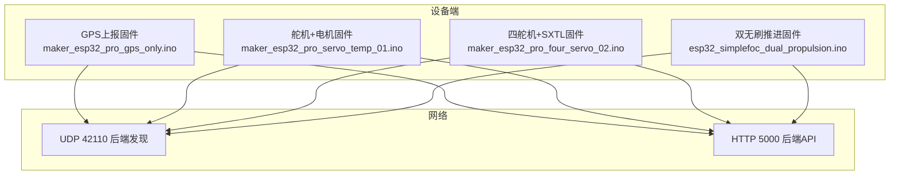
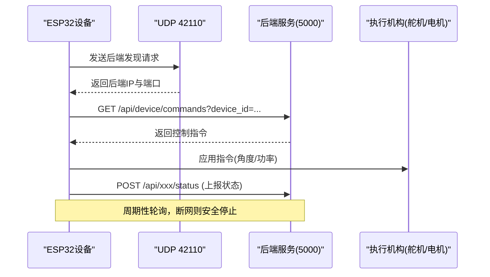
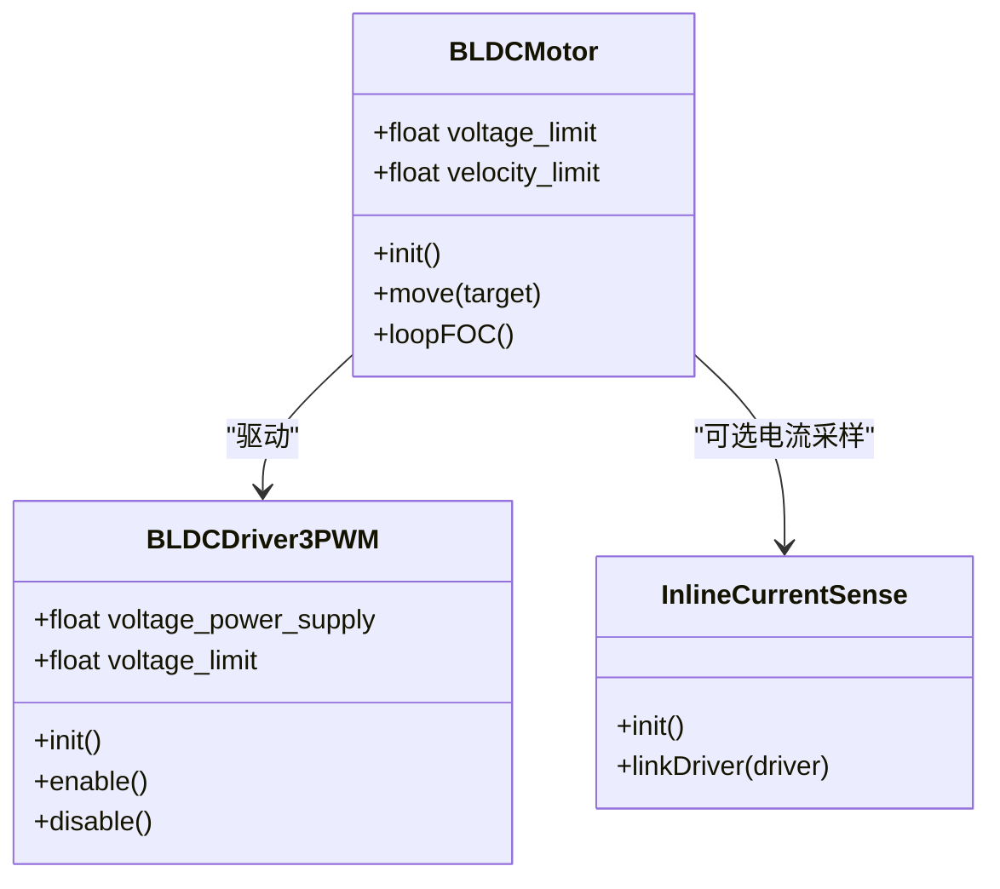
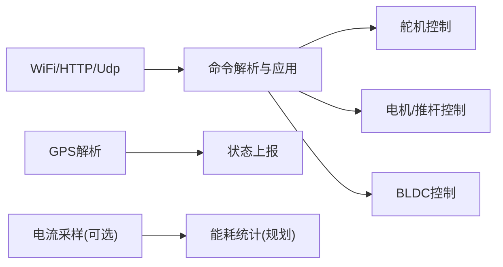

# 电源管理

<cite>
**本文引用的文件**
- [maker_esp32_pro_gps_only.ino](file://fishery-digital-twin-platform/firmware/esp32/maker_esp32_pro_gps_only/maker_esp32_pro_gps_only.ino)
- [maker_esp32_pro_servo_temp_01.ino](file://fishery-digital-twin-platform/firmware/esp32/maker_esp32_pro_servo_temp_01/maker_esp32_pro_servo_temp_01.ino)
- [esp32_simplefoc_dual_propulsion.ino](file://fishery-digital-twin-platform/firmware/esp32/esp32_simplefoc_dual_propulsion/esp32_simplefoc_dual_propulsion.ino)
- [maker_esp32_pro_four_servo_02.ino](file://fishery-digital-twin-platform/firmware/esp32/maker_esp32_pro_four_servo_02/maker_esp32_pro_four_servo_02.ino)
- [hardware-and-firmware.md](file://fishery-digital-twin-platform/docs/hardware-and-firmware.md)
</cite>

## 目录
1. [简介](#简介)
2. [项目结构](#项目结构)
3. [核心组件](#核心组件)
4. [架构总览](#架构总览)
5. [详细组件分析](#详细组件分析)
6. [依赖关系分析](#依赖关系分析)
7. [性能与功耗考量](#性能与功耗考量)
8. [故障排查指南](#故障排查指南)
9. [结论](#结论)
10. [附录](#附录)

## 简介
本文件面向ESP32在渔业数字孪生平台中的电源管理与低功耗优化，覆盖以下主题：
- ESP32低功耗模式（深度睡眠、轻睡眠、工作模式）的功耗特性与适用场景
- 电池管理系统（BMS）：电量检测、充电控制、续航优化策略
- 动态功耗调整：CPU频率调节、外设休眠、任务调度优化
- 电源监控机制：电压检测、电流测量、功耗统计
- 节能策略：间歇性工作、事件驱动、智能唤醒
- 功耗测试方法与优化技巧
- 不同工作场景下的功耗分析与电池寿命预测

说明：当前固件以“持续联网+轮询”为主，未启用ESP32深度/轻睡眠；但代码中已包含WiFi省电开关、网络超时与断网保护等关键节能点。SimpleFOC固件具备可选的电流采样能力，为后续能耗计量提供基础。

## 项目结构
本项目包含多套ESP32固件，分别对应GPS上报、舵机+电机控制、双无刷推进器控制等场景。它们共享统一的“后端发现+HTTP轮询”通信模型，并通过不同的设备ID区分功能模块。

图表来源
- [maker_esp32_pro_gps_only.ino:144-263](file://fishery-digital-twin-platform/firmware/esp32/maker_esp32_pro_gps_only/maker_esp32_pro_gps_only.ino#L144-L263)
- [maker_esp32_pro_servo_temp_01.ino:305-408](file://fishery-digital-twin-platform/firmware/esp32/maker_esp32_pro_servo_temp_01/maker_esp32_pro_servo_temp_01.ino#L305-L408)
- [maker_esp32_pro_four_servo_02.ino:252-353](file://fishery-digital-twin-platform/firmware/esp32/maker_esp32_pro_four_servo_02/maker_esp32_pro_four_servo_02.ino#L252-L353)
- [esp32_simplefoc_dual_propulsion.ino:326-427](file://fishery-digital-twin-platform/firmware/esp32/esp32_simplefoc_dual_propulsion/esp32_simplefoc_dual_propulsion.ino#L326-L427)

章节来源
- [hardware-and-firmware.md:1-117](file://fishery-digital-twin-platform/docs/hardware-and-firmware.md#L1-L117)

## 核心组件
- WiFi连接与保持：所有固件统一使用STA模式，并关闭WiFi省电以降低时延抖动；断网时执行安全停止或降级逻辑。
- 后端发现：通过UDP广播请求与响应，自动发现后端IP与端口，避免硬编码地址。
- 命令轮询与状态上报：按固定周期从后端拉取控制指令，并向后端上报设备状态。
- 电机/舵机控制：包括PWM输出、缓启动、死区、急停、超时保护等。
- 可选电流采样：SimpleFOC固件支持INA240电流采样，用于未来能耗计量。

章节来源
- [maker_esp32_pro_gps_only.ino:144-263](file://fishery-digital-twin-platform/firmware/esp32/maker_esp32_pro_gps_only/maker_esp32_pro_gps_only.ino#L144-L263)
- [maker_esp32_pro_servo_temp_01.ino:252-408](file://fishery-digital-twin-platform/firmware/esp32/maker_esp32_pro_servo_temp_01/maker_esp32_pro_servo_temp_01.ino#L252-L408)
- [maker_esp32_pro_four_servo_02.ino:211-353](file://fishery-digital-twin-platform/firmware/esp32/maker_esp32_pro_four_servo_02/maker_esp32_pro_four_servo_02.ino#L211-L353)
- [esp32_simplefoc_dual_propulsion.ino:238-427](file://fishery-digital-twin-platform/firmware/esp32/esp32_simplefoc_dual_propulsion/esp32_simplefoc_dual_propulsion.ino#L238-L427)

## 架构总览
下图展示设备端与后端的交互流程，以及各固件在其中的角色。

图表来源
- [maker_esp32_pro_gps_only.ino:204-263](file://fishery-digital-twin-platform/firmware/esp32/maker_esp32_pro_gps_only/maker_esp32_pro_gps_only.ino#L204-L263)
- [maker_esp32_pro_servo_temp_01.ino:460-534](file://fishery-digital-twin-platform/firmware/esp32/maker_esp32_pro_servo_temp_01/maker_esp32_pro_servo_temp_01.ino#L460-L534)
- [maker_esp32_pro_four_servo_02.ino:402-468](file://fishery-digital-twin-platform/firmware/esp32/maker_esp32_pro_four_servo_02/maker_esp32_pro_four_servo_02.ino#L402-L468)
- [esp32_simplefoc_dual_propulsion.ino:476-506](file://fishery-digital-twin-platform/firmware/esp32/esp32_simplefoc_dual_propulsion/esp32_simplefoc_dual_propulsion.ino#L476-L506)

## 详细组件分析

### 组件A：GPS上报设备的功耗与节能
- 工作模式：持续WiFi连接，周期性读取GPS数据并上报。
- 节能点：
  - WiFi.setSleep(false)降低时延抖动，适合实时性要求高的场景。
  - 报告间隔与状态打印间隔可配置，减少网络与串口开销。
  - 断网时不执行无效上报，避免空转。
- 建议优化：
  - 在无GPS信号或长时间静止时，延长上报周期。
  - 结合事件驱动（如NMEA有效定位变更）触发上报，减少空闲轮询。

章节来源
- [maker_esp32_pro_gps_only.ino:82-116](file://fishery-digital-twin-platform/firmware/esp32/maker_esp32_pro_gps_only/maker_esp32_pro_gps_only.ino#L82-L116)
- [maker_esp32_pro_gps_only.ino:144-186](file://fishery-digital-twin-platform/firmware/esp32/maker_esp32_pro_gps_only/maker_esp32_pro_gps_only.ino#L144-L186)
- [maker_esp32_pro_gps_only.ino:265-366](file://fishery-digital-twin-platform/firmware/esp32/maker_esp32_pro_gps_only/maker_esp32_pro_gps_only.ino#L265-L366)

### 组件B：舵机+电机控制设备的功耗与安全
- 工作模式：轮询舵机角度与电机命令，周期性上报状态。
- 节能点：
  - 仅在目标角度变化时更新舵机PWM，避免重复写入。
  - 电机命令采用缓启动与死区，减少频繁启停带来的冲击与能耗。
  - 断网立即停止所有电机，防止失控与额外功耗。
- 建议优化：
  - 将命令轮询周期与状态上报周期解耦，按需调整。
  - 在无动作时段进入低占用循环（例如仅维护WiFi与最小I/O）。

章节来源
- [maker_esp32_pro_servo_temp_01.ino:187-250](file://fishery-digital-twin-platform/firmware/esp32/maker_esp32_pro_servo_temp_01/maker_esp32_pro_servo_temp_01.ino#L187-L250)
- [maker_esp32_pro_servo_temp_01.ino:428-458](file://fishery-digital-twin-platform/firmware/esp32/maker_esp32_pro_servo_temp_01/maker_esp32_pro_servo_temp_01.ino#L428-L458)
- [maker_esp32_pro_servo_temp_01.ino:692-727](file://fishery-digital-twin-platform/firmware/esp32/maker_esp32_pro_servo_temp_01/maker_esp32_pro_servo_temp_01.ino#L692-L727)

### 组件C：线性推杆（SXTL）的安全与能耗管理
- 工作模式：根据命令控制推杆方向与功率，累计运行时间并冷却。
- 节能点：
  - 死区与缓启动，避免频繁反向切换造成额外损耗。
  - 累计运行时间与往返次数限制，达到阈值后强制冷却，降低热耗与电耗。
  - 断网或急停立即停止输出，避免无效功耗。
- 建议优化：
  - 在待机阶段关闭非必要I/O，降低静态功耗。
  - 结合外部事件（限位开关）触发停止，减少软件计时误差导致的过驱。

章节来源
- [maker_esp32_pro_four_servo_02.ino:168-209](file://fishery-digital-twin-platform/firmware/esp32/maker_esp32_pro_four_servo_02/maker_esp32_pro_four_servo_02.ino#L168-L209)
- [maker_esp32_pro_four_servo_02.ino:639-739](file://fishery-digital-twin-platform/firmware/esp32/maker_esp32_pro_four_servo_02/maker_esp32_pro_four_servo_02.ino#L639-L739)

### 组件D：双无刷推进器的电流采样与能耗计量基础
- 工作模式：基于SimpleFOC库控制BLDC电机，支持开环速度控制。
- 节能点：
  - 默认禁用电机输出，确保调试安全。
  - 可选电流采样（INA240），为能耗统计提供硬件基础。
  - 死区与缓启动，避免不必要的能量浪费。
- 建议优化：
  - 启用闭环速度与电流限制，提升能效。
  - 增加占空比自适应与负载感知调速，降低轻载功耗。

章节来源
- [esp32_simplefoc_dual_propulsion.ino:238-324](file://fishery-digital-twin-platform/firmware/esp32/esp32_simplefoc_dual_propulsion/esp32_simplefoc_dual_propulsion.ino#L238-L324)
- [esp32_simplefoc_dual_propulsion.ino:640-666](file://fishery-digital-twin-platform/firmware/esp32/esp32_simplefoc_dual_propulsion/esp32_simplefoc_dual_propulsion.ino#L640-L666)

#### 类图（SimpleFOC控制相关）

图表来源
- [esp32_simplefoc_dual_propulsion.ino:132-147](file://fishery-digital-twin-platform/firmware/esp32/esp32_simplefoc_dual_propulsion/esp32_simplefoc_dual_propulsion.ino#L132-L147)
- [esp32_simplefoc_dual_propulsion.ino:261-307](file://fishery-digital-twin-platform/firmware/esp32/esp32_simplefoc_dual_propulsion/esp32_simplefoc_dual_propulsion.ino#L261-L307)

## 依赖关系分析
- 网络栈：WiFi与HTTPClient、WiFiUdp，用于后端发现与命令/状态交换。
- 传感器/执行器：TinyGPSPlus解析NMEA；ESP32Servo控制舵机；H桥/PWM驱动直流/推杆；SimpleFOC控制BLDC。
- 安全与健壮性：超时、急停、断网保护、死区与缓启动。

图表来源
- [maker_esp32_pro_gps_only.ino:18-23](file://fishery-digital-twin-platform/firmware/esp32/maker_esp32_pro_gps_only/maker_esp32_pro_gps_only.ino#L18-L23)
- [maker_esp32_pro_servo_temp_01.ino:30-36](file://fishery-digital-twin-platform/firmware/esp32/maker_esp32_pro_servo_temp_01/maker_esp32_pro_servo_temp_01.ino#L30-L36)
- [esp32_simplefoc_dual_propulsion.ino:23-28](file://fishery-digital-twin-platform/firmware/esp32/esp32_simplefoc_dual_propulsion/esp32_simplefoc_dual_propulsion.ino#L23-L28)

章节来源
- [hardware-and-firmware.md:1-117](file://fishery-digital-twin-platform/docs/hardware-and-firmware.md#L1-L117)

## 性能与功耗考量
- 工作模式与功耗特性
  - 工作模式：当前固件保持WiFi连接，CPU全速运行，适合实时控制与低时延场景。
  - 轻睡眠：可通过ESP32 light sleep降低CPU时钟与部分外设功耗，适用于周期性唤醒采集。
  - 深度睡眠：关闭大部分外设与内存，功耗最低，需配合RTC唤醒或外部中断唤醒。
- 动态功耗调整
  - CPU频率：可在轻/深度睡眠之间切换；或在轻睡中降低主频。
  - 外设休眠：关闭未使用的UART、SPI、ADC、I2C等外设时钟。
  - 任务调度：将高频任务合并，减少唤醒次数；使用事件驱动替代轮询。
- 电源监控机制
  - 电压检测：可通过ADC读取电池分压，估算剩余电量。
  - 电流测量：SimpleFOC固件支持INA240电流采样，可用于能耗统计。
  - 功耗统计：累计电流×电压×时间，得到能耗；结合电池容量估算续航。
- 节能策略
  - 间歇性工作：在非活跃期进入轻/深度睡眠，定时唤醒处理必要任务。
  - 事件驱动：由传感器事件（如GPS定位变更、限位开关）触发处理，减少空闲轮询。
  - 智能唤醒：结合定时器与外部中断，按需唤醒，最大化休眠时间。
- 功耗测试方法
  - 使用高精度电流表或电源监测模块记录平均/峰值电流。
  - 分段测试：连接建立、命令轮询、数据处理、休眠唤醒各阶段。
  - 场景化测试：静置、巡航、机动、断网重连等不同工况。
- 优化技巧
  - 降低轮询频率与数据包大小。
  - 批量上报与压缩数据。
  - 合理设置WiFi参数（如DTIM、PSM）与超时。
  - 优化算法复杂度，减少CPU占用。
- 电池寿命预测
  - 基于平均电流与电池容量计算理论续航。
  - 考虑温度、老化、放电曲线对容量的影响。
  - 结合历史数据校准预测模型。

[本节为通用指导，不直接分析具体文件]

## 故障排查指南
- 无法连接WiFi
  - 检查SSID、密码与AP隔离设置。
  - 确认路由器允许客户端间通信。
  - 查看日志中的连接重试与断开原因。
- 后端发现失败
  - 确认UDP端口42110未被防火墙拦截。
  - 验证电脑与设备在同一局域网。
  - 检查后端是否监听并响应发现请求。
- 电机/推杆异常
  - 检查急停、超时与断网保护是否生效。
  - 确认PWM频率与死区设置合理。
  - 观察是否有堵转或过热现象。
- 电流采样异常
  - 确认INA240增益与采样电阻匹配。
  - 校验ADC引脚与I2C地址配置。
  - 检查驱动初始化顺序与链接关系。

章节来源
- [maker_esp32_pro_gps_only.ino:144-186](file://fishery-digital-twin-platform/firmware/esp32/maker_esp32_pro_gps_only/maker_esp32_pro_gps_only.ino#L144-L186)
- [maker_esp32_pro_servo_temp_01.ino:428-458](file://fishery-digital-twin-platform/firmware/esp32/maker_esp32_pro_servo_temp_01/maker_esp32_pro_servo_temp_01.ino#L428-L458)
- [esp32_simplefoc_dual_propulsion.ino:294-307](file://fishery-digital-twin-platform/firmware/esp32/esp32_simplefoc_dual_propulsion/esp32_simplefoc_dual_propulsion.ino#L294-L307)

## 结论
当前固件以“持续联网+轮询”为主，具备完善的网络发现、命令解析与安全保护机制。SimpleFOC固件提供了电流采样的硬件基础，便于后续实现能耗计量与续航优化。建议在非活跃期引入轻/深度睡眠与事件驱动，进一步降低功耗并延长电池寿命。

[本节为总结，不直接分析具体文件]

## 附录
- 常见常量与接口
  - 后端发现端口：UDP 42110
  - 后端服务端口：HTTP 5000
  - 设备标识：各固件定义唯一DEVICE_ID
  - 安全保护：急停、超时、断网停止、死区与缓启动
- 参考路径
  - 硬件与固件说明：[hardware-and-firmware.md](file://fishery-digital-twin-platform/docs/hardware-and-firmware.md)
  - GPS上报固件：[maker_esp32_pro_gps_only.ino](file://fishery-digital-twin-platform/firmware/esp32/maker_esp32_pro_gps_only/maker_esp32_pro_gps_only.ino)
  - 舵机+电机固件：[maker_esp32_pro_servo_temp_01.ino](file://fishery-digital-twin-platform/firmware/esp32/maker_esp32_pro_servo_temp_01/maker_esp32_pro_servo_temp_01.ino)
  - 四舵机+SXTL固件：[maker_esp32_pro_four_servo_02.ino](file://fishery-digital-twin-platform/firmware/esp32/maker_esp32_pro_four_servo_02/maker_esp32_pro_four_servo_02.ino)
  - 双无刷推进固件：[esp32_simplefoc_dual_propulsion.ino](file://fishery-digital-twin-platform/firmware/esp32/esp32_simplefoc_dual_propulsion/esp32_simplefoc_dual_propulsion.ino)

[本节为参考信息，不直接分析具体文件]