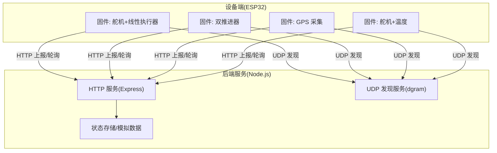
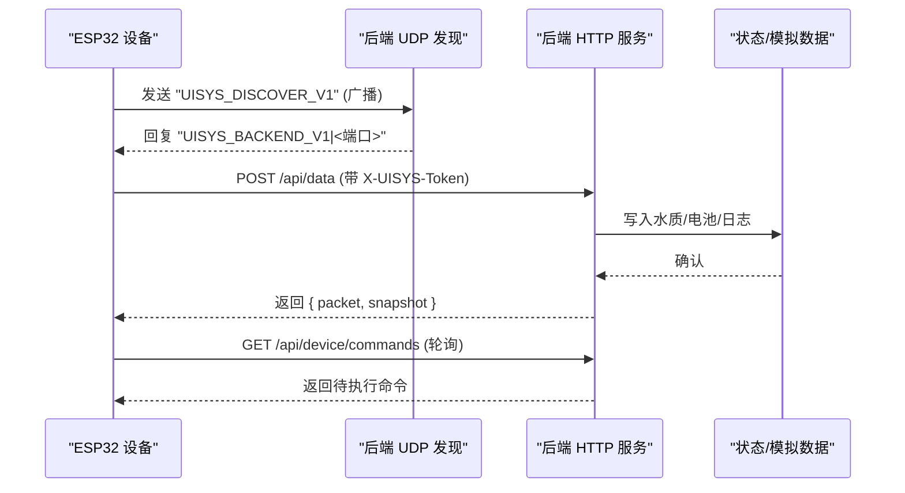
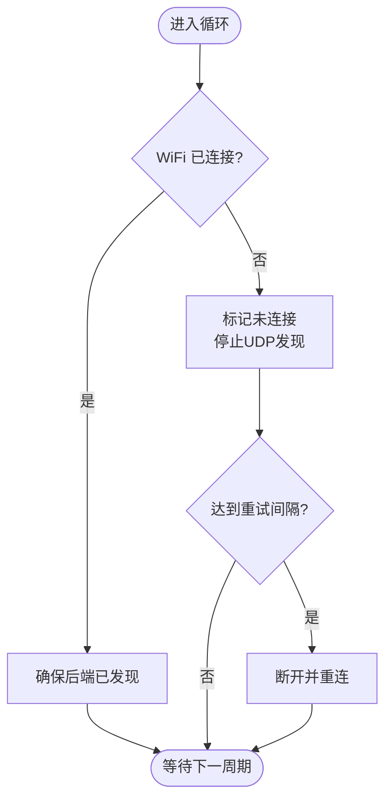
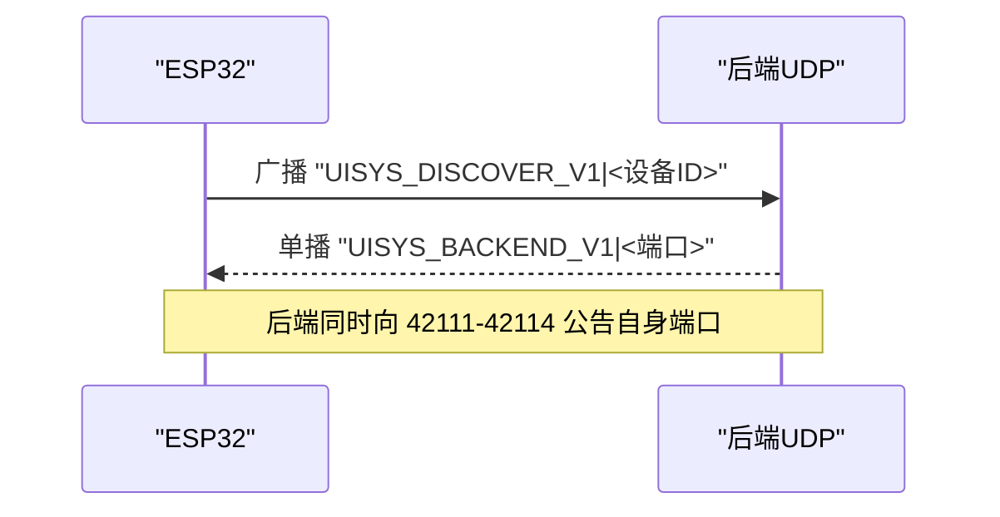
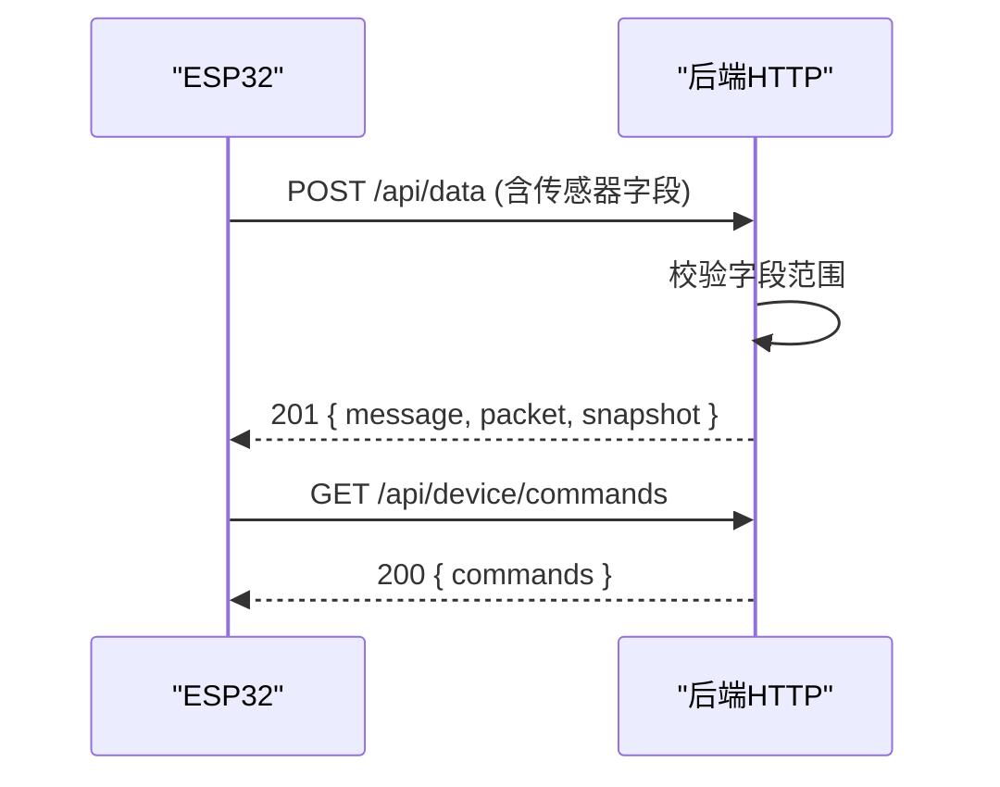
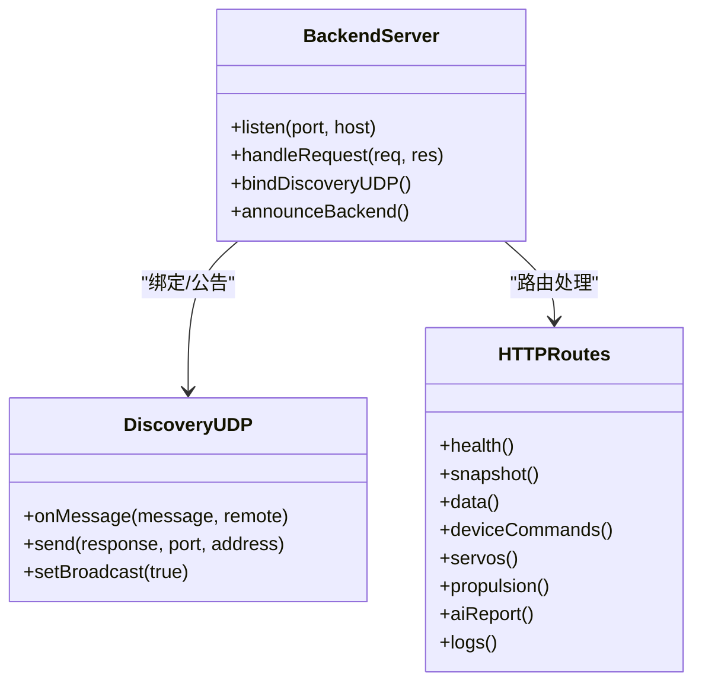
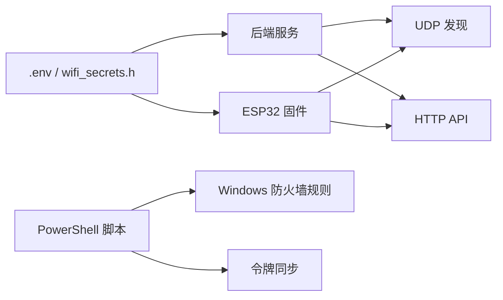
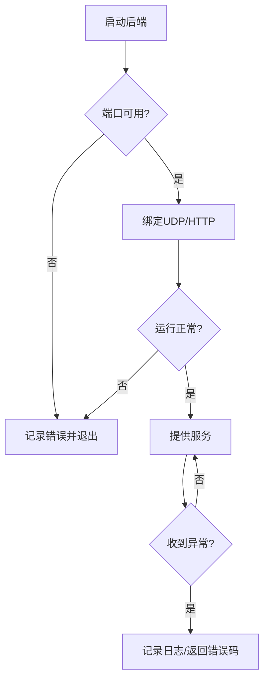

# 网络通信协议

<cite>
**本文引用的文件**
- [apps/backend/src/index.ts](file://fishery-digital-twin-platform/apps/backend/src/index.ts)
- [firmware/esp32/maker_esp32_pro_four_servo_02/maker_esp32_pro_four_servo_02.ino](file://fishery-digital-twin-platform/firmware/esp32/maker_esp32_pro_four_servo_02/maker_esp32_pro_four_servo_02.ino)
- [firmware/esp32/esp32_simplefoc_dual_propulsion/esp32_simplefoc_dual_propulsion.ino](file://fishery-digital-twin-platform/firmware/esp32/esp32_simplefoc_dual_propulsion/esp32_simplefoc_dual_propulsion.ino)
- [firmware/esp32/maker_esp32_pro_gps_only/maker_esp32_pro_gps_only.ino](file://fishery-digital-twin-platform/firmware/esp32/maker_esp32_pro_gps_only/maker_esp32_pro_gps_only.ino)
- [firmware/esp32/maker_esp32_pro_servo_temp_01/maker_esp32_pro_servo_temp_01.ino](file://fishery-digital-twin-platform/firmware/esp32/maker_esp32_pro_servo_temp_01/maker_esp32_pro_servo_temp_01.ino)
- [docs/security-and-network.md](file://fishery-digital-twin-platform/docs/security-and-network.md)
- [scripts/configure-device-secrets.ps1](file://fishery-digital-twin-platform/scripts/configure-device-secrets.ps1)
- [scripts/configure-windows-network.ps1](file://fishery-digital-twin-platform/scripts/configure-windows-network.ps1)
</cite>

## 目录
1. [简介](#简介)
2. [项目结构](#项目结构)
3. [核心组件](#核心组件)
4. [架构总览](#架构总览)
5. [详细组件分析](#详细组件分析)
6. [依赖关系分析](#依赖关系分析)
7. [性能考虑](#性能考虑)
8. [故障恢复与异常处理](#故障恢复与异常处理)
9. [结论](#结论)
10. [附录](#附录)

## 简介
本文件面向渔业数字孪生平台的网络通信协议，覆盖以下方面：
- WiFi 连接管理：自动重连、信号强度监控（实现建议）、网络切换（实现建议）
- UDP 广播协议：设备发现、心跳检测（实现建议）、状态同步（通过 HTTP 上报）
- HTTP 客户端功能：API 请求、数据上传、错误处理
- TCP 服务器实现：多连接管理、数据流控制、并发处理（基于 Express + Node.js）
- 安全机制：令牌鉴权、CORS、访问控制（当前未启用 TLS）
- 性能优化：数据包压缩（实现建议）、连接池管理（实现建议）、带宽控制（实现建议）
- 故障恢复与异常处理：断网重连、端口冲突、超时重试等

## 项目结构
平台由后端服务（Node.js/Express）与多个 ESP32 固件组成。ESP32 通过 UDP 广播发现后端，并通过 HTTP 上报传感器数据、轮询控制命令；后端提供 REST API 与 UDP 发现服务。

图表来源
- [apps/backend/src/index.ts:271-318](file://fishery-digital-twin-platform/apps/backend/src/index.ts#L271-L318)
- [apps/backend/src/index.ts:322-557](file://fishery-digital-twin-platform/apps/backend/src/index.ts#L322-L557)
- [firmware/esp32/maker_esp32_pro_four_servo_02/maker_esp32_pro_four_servo_02.ino:44-87](file://fishery-digital-twin-platform/firmware/esp32/maker_esp32_pro_four_servo_02/maker_esp32_pro_four_servo_02.ino#L44-L87)

章节来源
- [apps/backend/src/index.ts:46-76](file://fishery-digital-twin-platform/apps/backend/src/index.ts#L46-L76)
- [firmware/esp32/maker_esp32_pro_four_servo_02/maker_esp32_pro_four_servo_02.ino:168-200](file://fishery-digital-twin-platform/firmware/esp32/maker_esp32_pro_four_servo_02/maker_esp32_pro_four_servo_02.ino#L168-L200)

## 核心组件
- UDP 设备发现：ESP32 周期性向子网广播“UISYS_DISCOVER_V1”，后端在 42110 端口监听并回复“UISYS_BACKEND_V1|<port>”。后端还主动从本机所有 IPv4 接口计算广播地址并向 42111-42114 公告自身端口。
- HTTP API：后端提供健康检查、快照、水质数据、GPS、舵机、推进器、AI 报告、日志等接口；受控接口需携带 X-UISYS-Token。
- WiFi 管理：ESP32 维护连接状态，断线后按间隔重试，并在重新连接后重启 UDP 发现流程。
- 安全与访问控制：通过环境变量配置令牌，非回环地址必须携带令牌；CORS 白名单限制前端来源。

章节来源
- [apps/backend/src/index.ts:56-76](file://fishery-digital-twin-platform/apps/backend/src/index.ts#L56-L76)
- [apps/backend/src/index.ts:101-157](file://fishery-digital-twin-platform/apps/backend/src/index.ts#L101-L157)
- [apps/backend/src/index.ts:271-318](file://fishery-digital-twin-platform/apps/backend/src/index.ts#L271-L318)
- [firmware/esp32/maker_esp32_pro_four_servo_02/maker_esp32_pro_four_servo_02.ino:44-87](file://fishery-digital-twin-platform/firmware/esp32/maker_esp32_pro_four_servo_02/maker_esp32_pro_four_servo_02.ino#L44-L87)

## 架构总览
系统采用“设备端轻量发现 + 后端集中服务”的架构。ESP32 仅负责最小化的网络栈操作（WiFi、UDP 广播、HTTP 客户端），后端承担数据聚合、持久化、AI 推理、仿真与对外 API。

图表来源
- [apps/backend/src/index.ts:271-318](file://fishery-digital-twin-platform/apps/backend/src/index.ts#L271-L318)
- [apps/backend/src/index.ts:367-430](file://fishery-digital-twin-platform/apps/backend/src/index.ts#L367-L430)
- [apps/backend/src/index.ts:500-503](file://fishery-digital-twin-platform/apps/backend/src/index.ts#L500-L503)
- [firmware/esp32/maker_esp32_pro_four_servo_02/maker_esp32_pro_four_servo_02.ino:295-345](file://fishery-digital-twin-platform/firmware/esp32/maker_esp32_pro_four_servo_02/maker_esp32_pro_four_servo_02.ino#L295-L345)

## 详细组件分析

### WiFi 连接管理（自动重连、信号强度监控、网络切换）
- 自动重连：各固件在 maintainWiFi 中检测 WiFi 状态，断开时按固定间隔调用 disconnect/begin 重连，并在成功连接后重置后端发现状态并启动 UDP 发现。
- 信号强度监控：代码中未直接读取 RSSI；建议在 maintainWiFi 或状态上报中加入 RSSI 采集与上报，用于弱信号告警与切换策略。
- 网络切换：当前未实现多 SSID 切换；可在重连失败次数阈值后尝试备选 SSID，或在检测到强干扰时主动切换。

图表来源
- [firmware/esp32/maker_esp32_pro_four_servo_02/maker_esp32_pro_four_servo_02.ino:373-400](file://fishery-digital-twin-platform/firmware/esp32/maker_esp32_pro_four_servo_02/maker_esp32_pro_four_servo_02.ino#L373-L400)
- [firmware/esp32/esp32_simplefoc_dual_propulsion/esp32_simplefoc_dual_propulsion.ino:447-474](file://fishery-digital-twin-platform/firmware/esp32/esp32_simplefoc_dual_propulsion/esp32_simplefoc_dual_propulsion.ino#L447-L474)
- [firmware/esp32/maker_esp32_pro_gps_only/maker_esp32_pro_gps_only.ino:154-186](file://fishery-digital-twin-platform/firmware/esp32/maker_esp32_pro_gps_only/maker_esp32_pro_gps_only.ino#L154-L186)
- [firmware/esp32/maker_esp32_pro_servo_temp_01/maker_esp32_pro_servo_temp_01.ino:428-437](file://fishery-digital-twin-platform/firmware/esp32/maker_esp32_pro_servo_temp_01/maker_esp32_pro_servo_temp_01.ino#L428-L437)

章节来源
- [firmware/esp32/maker_esp32_pro_four_servo_02/maker_esp32_pro_four_servo_02.ino:373-400](file://fishery-digital-twin-platform/firmware/esp32/maker_esp32_pro_four_servo_02/maker_esp32_pro_four_servo_02.ino#L373-L400)
- [firmware/esp32/esp32_simplefoc_dual_propulsion/esp32_simplefoc_dual_propulsion.ino:447-474](file://fishery-digital-twin-platform/firmware/esp32/esp32_simplefoc_dual_propulsion/esp32_simplefoc_dual_propulsion.ino#L447-L474)
- [firmware/esp32/maker_esp32_pro_gps_only/maker_esp32_pro_gps_only.ino:154-186](file://fishery-digital-twin-platform/firmware/esp32/maker_esp32_pro_gps_only/maker_esp32_pro_gps_only.ino#L154-L186)

### UDP 广播协议（设备发现、心跳检测、状态同步）
- 设备发现：ESP32 构造广播地址并发送请求，后端解析请求并回复包含后端端口的响应；同时后端每 1s 主动向多个客户端端口公告自身端口。
- 心跳检测：当前未发现显式心跳包；可通过定时上报或心跳消息增强存活检测。
- 状态同步：通过 HTTP 上报传感器数据，后端更新历史并生成快照供前端拉取。

图表来源
- [apps/backend/src/index.ts:271-318](file://fishery-digital-twin-platform/apps/backend/src/index.ts#L271-L318)
- [firmware/esp32/maker_esp32_pro_four_servo_02/maker_esp32_pro_four_servo_02.ino:295-345](file://fishery-digital-twin-platform/firmware/esp32/maker_esp32_pro_four_servo_02/maker_esp32_pro_four_servo_02.ino#L295-L345)

章节来源
- [apps/backend/src/index.ts:271-318](file://fishery-digital-twin-platform/apps/backend/src/index.ts#L271-L318)
- [firmware/esp32/maker_esp32_pro_four_servo_02/maker_esp32_pro_four_servo_02.ino:295-345](file://fishery-digital-twin-platform/firmware/esp32/maker_esp32_pro_four_servo_02/maker_esp32_pro_four_servo_02.ino#L295-L345)

### HTTP 客户端功能（API 请求、数据上传、错误处理）
- 数据上传：ESP32 使用 HTTPClient 向 /api/data 上报传感器数据，后端校验字段范围并更新水质历史与电池信息。
- 命令轮询：ESP32 定期 GET /api/device/commands 获取待执行指令。
- 错误处理：后端对非法输入返回 400，对未授权返回 401/503；ESP32 侧在连接失败时清理后端发现状态并重试。

图表来源
- [apps/backend/src/index.ts:367-430](file://fishery-digital-twin-platform/apps/backend/src/index.ts#L367-L430)
- [apps/backend/src/index.ts:500-503](file://fishery-digital-twin-platform/apps/backend/src/index.ts#L500-L503)
- [firmware/esp32/maker_esp32_pro_four_servo_02/maker_esp32_pro_four_servo_02.ino:355-371](file://fishery-digital-twin-platform/firmware/esp32/maker_esp32_pro_four_servo_02/maker_esp32_pro_four_servo_02.ino#L355-L371)

章节来源
- [apps/backend/src/index.ts:367-430](file://fishery-digital-twin-platform/apps/backend/src/index.ts#L367-L430)
- [apps/backend/src/index.ts:500-503](file://fishery-digital-twin-platform/apps/backend/src/index.ts#L500-L503)
- [firmware/esp32/maker_esp32_pro_four_servo_02/maker_esp32_pro_four_servo_02.ino:355-371](file://fishery-digital-twin-platform/firmware/esp32/maker_esp32_pro_four_servo_02/maker_esp32_pro_four_servo_02.ino#L355-L371)

### TCP 服务器实现（多连接管理、数据流控制、并发处理）
- 多连接管理：Express 基于 Node.js 事件循环，天然支持高并发连接；每个 HTTP 请求独立处理，无共享可变状态。
- 数据流控制：通过 JSON 载荷与字段校验控制数据格式与范围；可结合速率限制扩展。
- 并发处理：利用异步 I/O 与定时器（如 AI 报告限流）避免阻塞；日志与持久化采用队列与延迟写入。

图表来源
- [apps/backend/src/index.ts:56-76](file://fishery-digital-twin-platform/apps/backend/src/index.ts#L56-L76)
- [apps/backend/src/index.ts:271-318](file://fishery-digital-twin-platform/apps/backend/src/index.ts#L271-L318)
- [apps/backend/src/index.ts:322-557](file://fishery-digital-twin-platform/apps/backend/src/index.ts#L322-L557)

章节来源
- [apps/backend/src/index.ts:56-76](file://fishery-digital-twin-platform/apps/backend/src/index.ts#L56-L76)
- [apps/backend/src/index.ts:271-318](file://fishery-digital-twin-platform/apps/backend/src/index.ts#L271-L318)
- [apps/backend/src/index.ts:322-557](file://fishery-digital-twin-platform/apps/backend/src/index.ts#L322-L557)

### 安全机制（TLS 加密、身份验证、访问控制）
- 身份验证：非回环地址的请求必须携带 X-UISYS-Token，使用常量时间比较防止时序攻击；未配置令牌时拒绝局域网控制请求。
- 访问控制：CORS 限制前端来源；日志记录敏感操作。
- TLS 加密：当前未启用 HTTPS；建议在反向代理层（Nginx/Traefik）或应用层启用 TLS，以保护传输安全。

章节来源
- [apps/backend/src/index.ts:101-157](file://fishery-digital-twin-platform/apps/backend/src/index.ts#L101-L157)
- [docs/security-and-network.md:17-26](file://fishery-digital-twin-platform/docs/security-and-network.md#L17-L26)

### 网络性能优化（数据包压缩、连接池管理、带宽控制）
- 数据包压缩：当前未启用；可在 HTTP 层启用 gzip/br 压缩以减少带宽占用。
- 连接池管理：ESP32 每次请求创建临时 WiFiClient；在高频率轮询场景下可复用连接或引入简单连接池以降低握手开销。
- 带宽控制：可通过调整上报频率、批量合并数据、限制 payload 大小来降低带宽压力。

[本节为通用优化建议，不直接分析具体文件]

## 依赖关系分析
- 后端依赖 Node.js dgram 模块实现 UDP 发现，Express 提供 HTTP 服务；通过环境变量注入端口、令牌、CORS 等配置。
- 固件依赖 Arduino WiFi/WiFiUdp/HTTPClient 库，使用 wifi_secrets.h 中的 SSID/密码与令牌。
- 脚本工具用于生成随机令牌、同步桌面与环境配置、添加防火墙规则。

图表来源
- [apps/backend/src/index.ts:46-76](file://fishery-digital-twin-platform/apps/backend/src/index.ts#L46-L76)
- [scripts/configure-device-secrets.ps1:1-41](file://fishery-digital-twin-platform/scripts/configure-device-secrets.ps1#L1-L41)
- [scripts/configure-windows-network.ps1:42-74](file://fishery-digital-twin-platform/scripts/configure-windows-network.ps1#L42-L74)

章节来源
- [apps/backend/src/index.ts:46-76](file://fishery-digital-twin-platform/apps/backend/src/index.ts#L46-L76)
- [scripts/configure-device-secrets.ps1:1-41](file://fishery-digital-twin-platform/scripts/configure-device-secrets.ps1#L1-L41)
- [scripts/configure-windows-network.ps1:42-74](file://fishery-digital-twin-platform/scripts/configure-windows-network.ps1#L42-L74)

## 性能考虑
- 上报频率：固件中定义了命令与状态上报间隔，可根据网络质量动态调整。
- 数据量控制：后端对 JSON 载荷设置大小限制，避免过大请求影响吞吐。
- 资源释放：后端在关闭时清理定时器与 UDP Socket，HTTP 服务优雅退出。

章节来源
- [apps/backend/src/index.ts:110-110](file://fishery-digital-twin-platform/apps/backend/src/index.ts#L110-L110)
- [apps/backend/src/index.ts:581-599](file://fishery-digital-twin-platform/apps/backend/src/index.ts#L581-L599)
- [firmware/esp32/maker_esp32_pro_four_servo_02/maker_esp32_pro_four_servo_02.ino:70-81](file://fishery-digital-twin-platform/firmware/esp32/maker_esp32_pro_four_servo_02/maker_esp32_pro_four_servo_02.ino#L70-L81)

## 故障恢复与异常处理
- 端口冲突：后端启动时若端口被占用或权限不足，记录错误并退出；UDP 绑定失败同样处理。
- 网络异常：ESP32 在 WiFi 断开时停止 UDP 发现并定时重连；TCP 测试失败则清空后端发现状态。
- 认证失败：未携带令牌或令牌不匹配时返回 401；未配置令牌时返回 503。
- 数据校验：字段越界或缺失时返回 400，并记录日志。

图表来源
- [apps/backend/src/index.ts:559-579](file://fishery-digital-twin-platform/apps/backend/src/index.ts#L559-L579)
- [apps/backend/src/index.ts:305-318](file://fishery-digital-twin-platform/apps/backend/src/index.ts#L305-L318)
- [firmware/esp32/maker_esp32_pro_four_servo_02/maker_esp32_pro_four_servo_02.ino:355-371](file://fishery-digital-twin-platform/firmware/esp32/maker_esp32_pro_four_servo_02/maker_esp32_pro_four_servo_02.ino#L355-L371)

章节来源
- [apps/backend/src/index.ts:559-579](file://fishery-digital-twin-platform/apps/backend/src/index.ts#L559-L579)
- [apps/backend/src/index.ts:305-318](file://fishery-digital-twin-platform/apps/backend/src/index.ts#L305-L318)
- [firmware/esp32/maker_esp32_pro_four_servo_02/maker_esp32_pro_four_servo_02.ino:355-371](file://fishery-digital-twin-platform/firmware/esp32/maker_esp32_pro_four_servo_02/maker_esp32_pro_four_servo_02.ino#L355-L371)

## 结论
该平台的网络通信以“UDP 发现 + HTTP 上报/轮询”为核心，具备稳定的自动重连与基础的安全控制。当前未启用 TLS，建议在部署层补充加密；同时可进一步增强心跳检测、RSSI 监控与带宽控制，以提升鲁棒性与性能。

## 附录
- 端口与协议
  - UDP 发现：42110（接收），42111-42114（公告）
  - HTTP API：默认 5000
- 安全配置
  - 令牌：X-UISYS-Token（非回环地址必需）
  - CORS：允许的前端来源
- 脚本工具
  - 生成与同步令牌
  - 配置 Windows 防火墙规则

章节来源
- [docs/security-and-network.md:17-30](file://fishery-digital-twin-platform/docs/security-and-network.md#L17-L30)
- [scripts/configure-device-secrets.ps1:1-41](file://fishery-digital-twin-platform/scripts/configure-device-secrets.ps1#L1-L41)
- [scripts/configure-windows-network.ps1:42-74](file://fishery-digital-twin-platform/scripts/configure-windows-network.ps1#L42-L74)