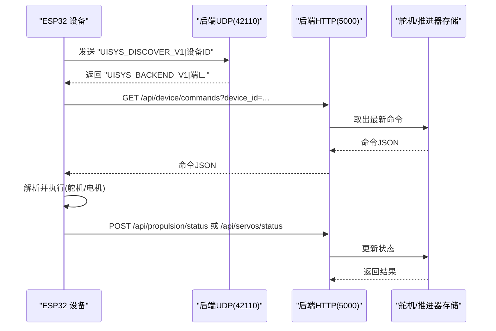
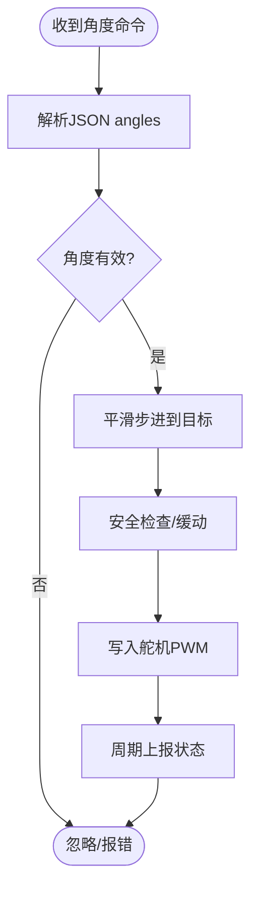
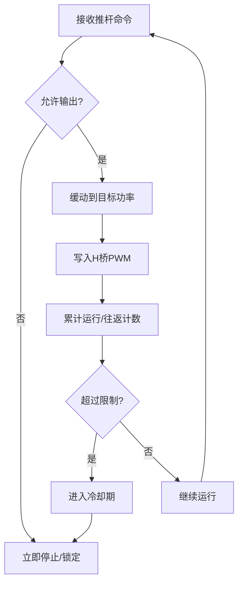
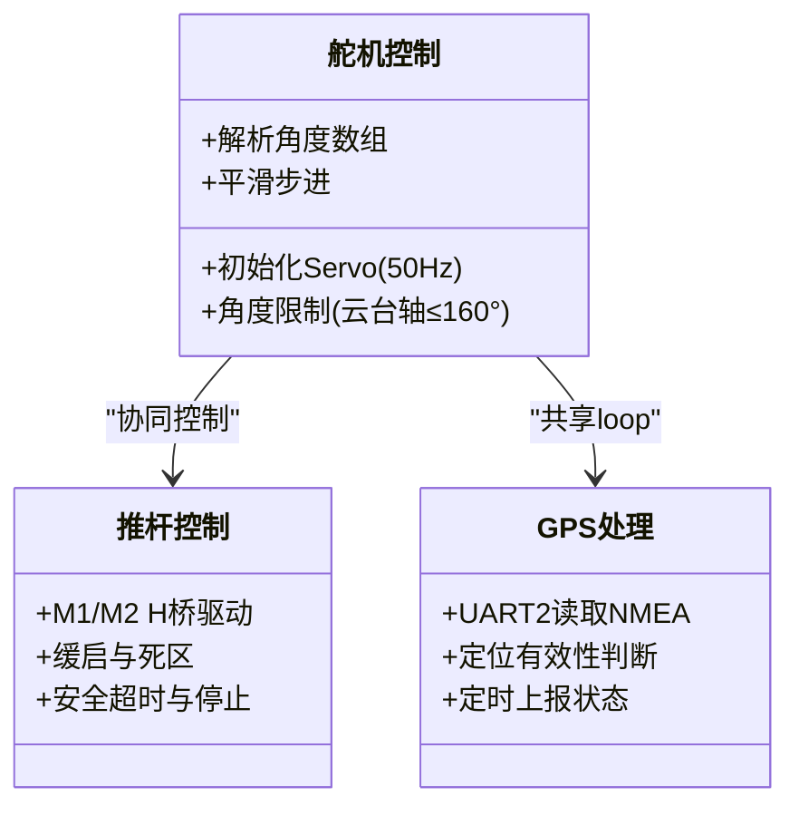
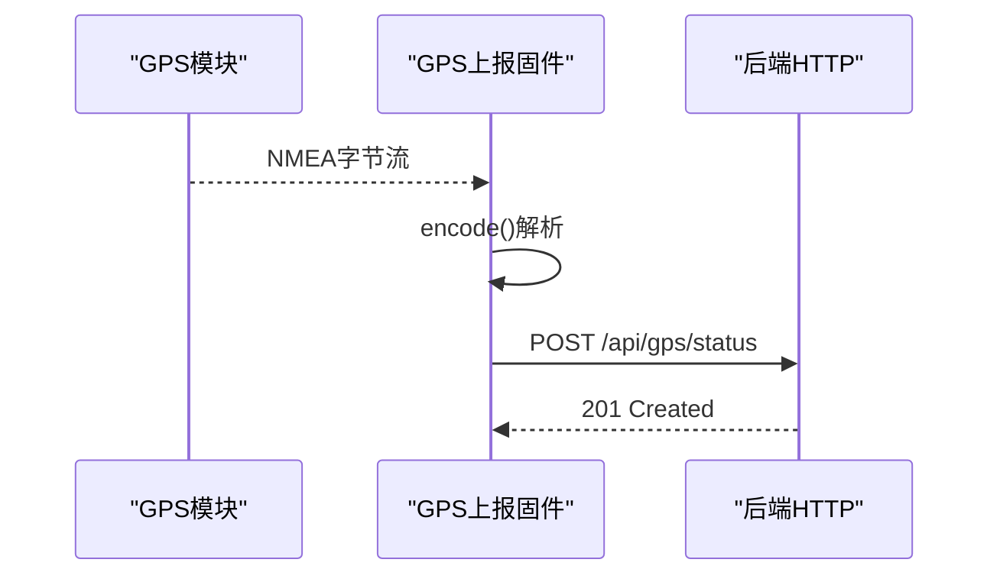
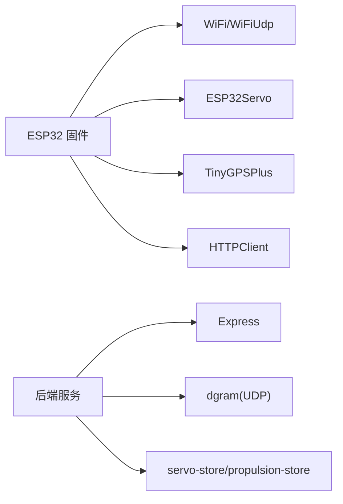

# 舵机控制固件

<cite>
**本文引用的文件**
- [maker_esp32_pro_four_servo_02.ino](file://fishery-digital-twin-platform/firmware/esp32/maker_esp32_pro_four_servo_02/maker_esp32_pro_four_servo_02.ino)
- [maker_esp32_pro_servo_temp_01.ino](file://fishery-digital-twin-platform/firmware/esp32/maker_esp32_pro_servo_temp_01/maker_esp32_pro_servo_temp_01.ino)
- [maker_esp32_pro_gps_only.ino](file://fishery-digital-twin-platform/firmware/esp32/maker_esp32_pro_gps_only/maker_esp32_pro_gps_only.ino)
- [esp32_simplefoc_dual_propulsion.ino](file://fishery-digital-twin-platform/firmware/esp32/esp32_simplefoc_dual_propulsion/esp32_simplefoc_dual_propulsion.ino)
- [wifi_secrets.example.h](file://fishery-digital-twin-platform/firmware/esp32/maker_esp32_pro_four_servo_02/wifi_secrets.example.h)
- [hardware-and-firmware.md](file://fishery-digital-twin-platform/docs/hardware-and-firmware.md)
- [index.ts](file://fishery-digital-twin-platform/apps/backend/src/index.ts)
- [servo-store.ts](file://fishery-digital-twin-platform/apps/backend/src/servo-store.ts)
</cite>

## 目录
1. [简介](#简介)
2. [项目结构](#项目结构)
3. [核心组件](#核心组件)
4. [架构总览](#架构总览)
5. [详细组件分析](#详细组件分析)
6. [依赖关系分析](#依赖关系分析)
7. [性能与调优](#性能与调优)
8. [故障诊断指南](#故障诊断指南)
9. [结论](#结论)
10. [附录：测试与协议参考](#附录测试与协议参考)

## 简介
本文件面向“四路舵机控制板”的固件实现，覆盖硬件引脚、PWM 信号生成、舵机角度控制、运动平滑与同步、UDP 设备发现、HTTP 命令与状态上报、温度/GPS 集成（在相关固件中）、以及安全保护机制。文档同时给出后端接口与数据格式说明，便于上层应用与前端调试。

## 项目结构
本项目包含多块 ESP32 固件与一个 Node.js 后端服务：
- 舵机与执行器固件
  - 第二块板：四路舵机 + SXTL 电动推杆控制器
  - 第一块板：三路舵机 + GPS + 双推杆（M1/M2）+ M0 直流电机
  - 独立 GPS 上报固件
  - SimpleFOC 双无刷推进固件（扩展用）
- 后端服务
  - 提供 UDP 设备发现、HTTP 控制与状态接口、舵机/推进器状态管理

```mermaid
graph TB
subgraph "ESP32 设备"
A["四路舵机+SXTL<br/>maker_esp32_pro_four_servo_02.ino"]
B["三路舵机+GPS+双推杆<br/>maker_esp32_pro_servo_temp_01.ino"]
C["独立GPS上报<br/>maker_esp32_pro_gps_only.ino"]
D["SimpleFOC 双无刷推进<br/>esp32_simplefoc_dual_propulsion.ino"]
end
subgraph "后端服务"
E["Express API + UDP 发现<br/>apps/backend/src/index.ts"]
F["舵机状态与命令队列<br/>apps/backend/src/servo-store.ts"]
end
A --> |HTTP GET /api/device/commands| E
A --> |HTTP POST /api/propulsion/status| E
B --> |HTTP GET /api/device/commands| E
B --> |HTTP GET /api/propulsion/commands| E
B --> |HTTP POST /api/propulsion/status| E
C --> |HTTP POST /api/gps/status| E
D --> |HTTP GET /api/propulsion/commands| E
D --> |HTTP POST /api/propulsion/status| E
E <- --> |UDP 42110 广播/单播| A
E <- --> |UDP 42110 广播/单播| B
E <- --> |UDP 42110 广播/单播| C
E <- --> |UDP 42110 广播/单播| D
```

图表来源
- [index.ts:271-318](file://fishery-digital-twin-platform/apps/backend/src/index.ts#L271-L318)
- [maker_esp32_pro_four_servo_02.ino:295-346](file://fishery-digital-twin-platform/firmware/esp32/maker_esp32_pro_four_servo_02/maker_esp32_pro_four_servo_02.ino#L295-L346)
- [maker_esp32_pro_servo_temp_01.ino:349-401](file://fishery-digital-twin-platform/firmware/esp32/maker_esp32_pro_servo_temp_01/maker_esp32_pro_servo_temp_01.ino#L349-L401)
- [maker_esp32_pro_gps_only.ino:204-256](file://fishery-digital-twin-platform/firmware/esp32/maker_esp32_pro_gps_only/maker_esp32_pro_gps_only.ino#L204-L256)
- [esp32_simplefoc_dual_propulsion.ino:369-420](file://fishery-digital-twin-platform/firmware/esp32/esp32_simplefoc_dual_propulsion/esp32_simplefoc_dual_propulsion.ino#L369-L420)

章节来源
- [hardware-and-firmware.md:1-234](file://fishery-digital-twin-platform/docs/hardware-and-firmware.md#L1-L234)

## 核心组件
- 四路舵机控制（第二块板）
  - 使用 ESP32Servo 库，50Hz PWM，脉宽范围 500–2400us
  - 引脚：Servo 1→GPIO25，Servo 2→GPIO26，Servo 3→GPIO32，Servo 4→GPIO33
  - 目标角度解析与平滑步进移动
- 线性推杆（SXTL）控制（第二块板）
  - H桥驱动：GPIO27/13，1kHz PWM
  - 死区、缓启动、方向切换、累计运行时间与往返计数、冷却保护
- 三路舵机 + GPS + 双推杆（第一块板）
  - Servo 1/2/3 对应 GPIO25/26/32；Servo 4 信号脚用于 GPS
  - M0 直流电机（GPIO27/13），M1/M2 推杆（GPIO4/2, GPIO17/12）
  - GPS 通过 UART2 读取 NMEA，定时上报定位
- 独立 GPS 上报固件
  - 仅负责串口读取与 HTTP 上报，不控制舵机或电机
- SimpleFOC 双无刷推进固件
  - 基于 SimpleFOC 库，支持开环速度控制、可选电流检测与 I2C 编码器
  - 默认关闭输出，需确认接线后开启

章节来源
- [maker_esp32_pro_four_servo_02.ino:56-82](file://fishery-digital-twin-platform/firmware/esp32/maker_esp32_pro_four_servo_02/maker_esp32_pro_four_servo_02.ino#L56-L82)
- [maker_esp32_pro_servo_temp_01.ino:65-106](file://fishery-digital-twin-platform/firmware/esp32/maker_esp32_pro_servo_temp_01/maker_esp32_pro_servo_temp_01.ino#L65-L106)
- [maker_esp32_pro_gps_only.ino:25-49](file://fishery-digital-twin-platform/firmware/esp32/maker_esp32_pro_gps_only/maker_esp32_pro_gps_only.ino#L25-L49)
- [esp32_simplefoc_dual_propulsion.ino:45-130](file://fishery-digital-twin-platform/firmware/esp32/esp32_simplefoc_dual_propulsion/esp32_simplefoc_dual_propulsion.ino#L45-L130)

## 架构总览
整体采用“设备主动轮询后端”的模式：
- 设备侧：ESP32 连接 WiFi，通过 UDP 广播发现后端地址，随后周期性 HTTP GET 拉取命令，执行后 HTTP POST 上报状态。
- 后端侧：监听 UDP 42110，响应设备发现请求并返回本机端口；维护舵机/推进器状态与命令队列；提供健康检查与日志查询。



图表来源
- [index.ts:271-318](file://fishery-digital-twin-platform/apps/backend/src/index.ts#L271-L318)
- [maker_esp32_pro_four_servo_02.ino:295-346](file://fishery-digital-twin-platform/firmware/esp32/maker_esp32_pro_four_servo_02/maker_esp32_pro_four_servo_02.ino#L295-L346)
- [servo-store.ts:175-183](file://fishery-digital-twin-platform/apps/backend/src/servo-store.ts#L175-L183)

## 详细组件分析

### 四路舵机控制（第二块板）
- 引脚定义
  - Servo 1→GPIO25，Servo 2→GPIO26，Servo 3→GPIO32，Servo 4→GPIO33
  - 脉宽范围 500–2400us，频率 50Hz
- PWM 与角度映射
  - 使用 ESP32Servo 库将角度写入对应引脚
  - 目标角度来自后端 JSON 中的 angles 数组（0–180）
- 运动平滑与同步
  - moveServosSmoothly 以固定步长逐步逼近目标，避免抖动
  - 每次步进期间调用安全检查和缓动逻辑，保证多任务并发安全
- 命令解析
  - readServoAngles 从 JSON 中解析 "servo4" 类型与 angles 数组
  - 校验每个角度在 0–180 范围内
- 状态上报
  - 定期调用 reportStatus 上报当前角度与在线状态



图表来源
- [maker_esp32_pro_four_servo_02.ino:470-517](file://fishery-digital-twin-platform/firmware/esp32/maker_esp32_pro_four_servo_02/maker_esp32_pro_four_servo_02.ino#L470-L517)
- [maker_esp32_pro_four_servo_02.ino:605-637](file://fishery-digital-twin-platform/firmware/esp32/maker_esp32_pro_four_servo_02/maker_esp32_pro_four_servo_02.ino#L605-L637)

章节来源
- [maker_esp32_pro_four_servo_02.ino:236-250](file://fishery-digital-twin-platform/firmware/esp32/maker_esp32_pro_four_servo_02/maker_esp32_pro_four_servo_02.ino#L236-L250)
- [maker_esp32_pro_four_servo_02.ino:470-517](file://fishery-digital-twin-platform/firmware/esp32/maker_esp32_pro_four_servo_02/maker_esp32_pro_four_servo_02.ino#L470-L517)
- [maker_esp32_pro_four_servo_02.ino:605-637](file://fishery-digital-twin-platform/firmware/esp32/maker_esp32_pro_four_servo_02/maker_esp32_pro_four_servo_02.ino#L605-L637)

### 线性推杆（SXTL）控制（第二块板）
- 硬件与引脚
  - H桥驱动：GPIO27/13，1kHz PWM
  - 功率限制、死区、缓启步长等参数可配置
- 安全策略
  - 断网停止、急停、命令超时（约2.2秒）
  - 累计运行时间上限（约2分钟）与往返次数上限（4次），任一条件触发即停机并进入18分钟冷却
  - 方向切换时先归零再反向，避免冲击
- 控制流程
  - applyLinearMotorCommand 解析命令并设置目标功率
  - updateLinearMotorRamp 按步长缓动至目标功率
  - writeLinearMotorPower 根据正负方向输出 PWM 占空比



图表来源
- [maker_esp32_pro_four_servo_02.ino:639-700](file://fishery-digital-twin-platform/firmware/esp32/maker_esp32_pro_four_servo_02/maker_esp32_pro_four_servo_02.ino#L639-L700)
- [maker_esp32_pro_four_servo_02.ino:702-739](file://fishery-digital-twin-platform/firmware/esp32/maker_esp32_pro_four_servo_02/maker_esp32_pro_four_servo_02.ino#L702-L739)
- [maker_esp32_pro_four_servo_02.ino:741-796](file://fishery-digital-twin-platform/firmware/esp32/maker_esp32_pro_four_servo_02/maker_esp32_pro_four_servo_02.ino#L741-L796)

章节来源
- [maker_esp32_pro_four_servo_02.ino:211-234](file://fishery-digital-twin-platform/firmware/esp32/maker_esp32_pro_four_servo_02/maker_esp32_pro_four_servo_02.ino#L211-L234)
- [maker_esp32_pro_four_servo_02.ino:519-542](file://fishery-digital-twin-platform/firmware/esp32/maker_esp32_pro_four_servo_02/maker_esp32_pro_four_servo_02.ino#L519-L542)
- [maker_esp32_pro_four_servo_02.ino:639-796](file://fishery-digital-twin-platform/firmware/esp32/maker_esp32_pro_four_servo_02/maker_esp32_pro_four_servo_02.ino#L639-L796)

### 三路舵机 + GPS + 双推杆（第一块板）
- 舵机引脚与限制
  - Servo 1/2/3 → GPIO25/26/32；Servo 4 信号脚用于 GPS
  - 云台轴（GPIO25/26）限制最大角度为 160°，防止机械损坏
- GPS 集成
  - 使用 TinyGPSPlus 解析 NMEA，UART2 9600bps
  - 定时上报定位、卫星数、HDOP、高度、速度与航向
- 双推杆控制
  - M1（GPIO4/2）、M2（GPIO17/12）分别控制两路推杆
  - 支持同步伸出/缩回与独立控制，具备安全超时与停止逻辑



图表来源
- [maker_esp32_pro_servo_temp_01.ino:65-106](file://fishery-digital-twin-platform/firmware/esp32/maker_esp32_pro_servo_temp_01/maker_esp32_pro_servo_temp_01.ino#L65-L106)
- [maker_esp32_pro_servo_temp_01.ino:280-303](file://fishery-digital-twin-platform/firmware/esp32/maker_esp32_pro_servo_temp_01/maker_esp32_pro_servo_temp_01.ino#L280-L303)
- [maker_esp32_pro_servo_temp_01.ino:496-534](file://fishery-digital-twin-platform/firmware/esp32/maker_esp32_pro_servo_temp_01/maker_esp32_pro_servo_temp_01.ino#L496-L534)

章节来源
- [maker_esp32_pro_servo_temp_01.ino:280-303](file://fishery-digital-twin-platform/firmware/esp32/maker_esp32_pro_servo_temp_01/maker_esp32_pro_servo_temp_01.ino#L280-L303)
- [maker_esp32_pro_servo_temp_01.ino:536-583](file://fishery-digital-twin-platform/firmware/esp32/maker_esp32_pro_servo_temp_01/maker_esp32_pro_servo_temp_01.ino#L536-L583)
- [maker_esp32_pro_servo_temp_01.ino:729-788](file://fishery-digital-twin-platform/firmware/esp32/maker_esp32_pro_servo_temp_01/maker_esp32_pro_servo_temp_01.ino#L729-L788)

### 独立 GPS 上报固件
- 功能
  - 仅负责读取 GPS 串口数据，解析定位信息，定时 POST 到后端 /api/gps/status
- 关键流程
  - readGps 循环读取字节并编码
  - gpsFixValid 判断定位是否有效且新鲜
  - reportGpsStatus 构造 JSON 并上报



图表来源
- [maker_esp32_pro_gps_only.ino:118-142](file://fishery-digital-twin-platform/firmware/esp32/maker_esp32_pro_gps_only/maker_esp32_pro_gps_only.ino#L118-L142)
- [maker_esp32_pro_gps_only.ino:313-355](file://fishery-digital-twin-platform/firmware/esp32/maker_esp32_pro_gps_only/maker_esp32_pro_gps_only.ino#L313-L355)

章节来源
- [maker_esp32_pro_gps_only.ino:118-142](file://fishery-digital-twin-platform/firmware/esp32/maker_esp32_pro_gps_only/maker_esp32_pro_gps_only.ino#L118-L142)
- [maker_esp32_pro_gps_only.ino:313-355](file://fishery-digital-twin-platform/firmware/esp32/maker_esp32_pro_gps_only/maker_esp32_pro_gps_only.ino#L313-L355)

### SimpleFOC 双无刷推进固件（扩展）
- 功能
  - 基于 SimpleFOC 库，支持开环速度控制，可选电流检测与 I2C 编码器
  - 默认关闭输出，需确认接线与参数后启用
- 关键点
  - 电压/速度限制、死区、缓启步长
  - 命令解析与状态上报

章节来源
- [esp32_simplefoc_dual_propulsion.ino:45-130](file://fishery-digital-twin-platform/firmware/esp32/esp32_simplefoc_dual_propulsion/esp32_simplefoc_dual_propulsion.ino#L45-L130)
- [esp32_simplefoc_dual_propulsion.ino:508-526](file://fishery-digital-twin-platform/firmware/esp32/esp32_simplefoc_dual_propulsion/esp32_simplefoc_dual_propulsion.ino#L508-L526)
- [esp32_simplefoc_dual_propulsion.ino:640-666](file://fishery-digital-twin-platform/firmware/esp32/esp32_simplefoc_dual_propulsion/esp32_simplefoc_dual_propulsion.ino#L640-L666)

## 依赖关系分析
- 设备侧依赖
  - WiFi 与 WiFiUdp：网络通信与设备发现
  - ESP32Servo：舵机 PWM 控制
  - TinyGPSPlus：GPS 数据解析
  - HTTPClient：拉取命令与上报状态
- 后端侧依赖
  - Express：HTTP 服务
  - dgram：UDP 设备发现
  - CORS、dotenv：跨域与环境变量
  - 内部 store：舵机/推进器状态与命令队列



图表来源
- [maker_esp32_pro_four_servo_02.ino:33-37](file://fishery-digital-twin-platform/firmware/esp32/maker_esp32_pro_four_servo_02/maker_esp32_pro_four_servo_02.ino#L33-L37)
- [maker_esp32_pro_servo_temp_01.ino:30-36](file://fishery-digital-twin-platform/firmware/esp32/maker_esp32_pro_servo_temp_01/maker_esp32_pro_servo_temp_01.ino#L30-L36)
- [index.ts:1-20](file://fishery-digital-twin-platform/apps/backend/src/index.ts#L1-L20)

章节来源
- [maker_esp32_pro_four_servo_02.ino:33-37](file://fishery-digital-twin-platform/firmware/esp32/maker_esp32_pro_four_servo_02/maker_esp32_pro_four_servo_02.ino#L33-L37)
- [index.ts:1-20](file://fishery-digital-twin-platform/apps/backend/src/index.ts#L1-L20)

## 性能与调优
- 舵机角度计算与平滑
  - 使用固定步长逐步逼近目标，避免瞬时跳变
  - 建议调整步长与延迟以获得更平滑的运动体验
- 响应速度与精度优化
  - 降低命令轮询间隔可减少控制延迟，但会增加网络负载
  - 合理设置舵机脉宽范围与角度上限，避免超程
- 死区与缓启
  - 推杆死区可消除微小指令导致的抖动
  - 缓启步长可降低机械冲击，延长寿命
- 安全与保护
  - 确保命令超时、急停、累计运行时间与冷却策略生效
  - 断网自动停止，避免失控

[本节为通用指导，无需特定文件引用]

## 故障诊断指南
- 无法发现后端
  - 检查 UDP 42110 是否被防火墙拦截
  - 确认设备与后端在同一局域网
  - 查看串口日志中的“Discovering backend via UDP”与“Backend discovered”
- 命令未生效
  - 检查 X-UISYS-Token 是否与后端一致
  - 确认设备 ID 正确，后端命令队列中有待消费命令
  - 查看 HTTP 状态码与错误信息
- 舵机抖动或异常
  - 检查供电与共地
  - 验证脉宽范围与角度限制
  - 观察是否有持续抖动或发热，立即断电检查
- GPS 无定位
  - 检查天线位置与供电
  - 查看串口日志中的“serial online/offline”与“fix waiting/valid”
  - 确认 UART 波特率与接线

章节来源
- [maker_esp32_pro_four_servo_02.ino:295-346](file://fishery-digital-twin-platform/firmware/esp32/maker_esp32_pro_four_servo_02/maker_esp32_pro_four_servo_02.ino#L295-L346)
- [maker_esp32_pro_servo_temp_01.ino:349-401](file://fishery-digital-twin-platform/firmware/esp32/maker_esp32_pro_servo_temp_01/maker_esp32_pro_servo_temp_01.ino#L349-L401)
- [maker_esp32_pro_gps_only.ino:265-311](file://fishery-digital-twin-platform/firmware/esp32/maker_esp32_pro_gps_only/maker_esp32_pro_gps_only.ino#L265-L311)
- [index.ts:136-157](file://fishery-digital-twin-platform/apps/backend/src/index.ts#L136-L157)

## 结论
该固件体系通过 UDP 设备发现与 HTTP 轮询实现了稳定的设备-后端通信，结合舵机平滑控制、推杆安全保护与 GPS 上报，满足多设备协同与可视化监控需求。建议在部署前完成接线确认、参数校准与安全策略验证，并在生产环境启用令牌认证与防火墙策略。

[本节为总结性内容，无需特定文件引用]

## 附录：测试与协议参考

### 设备发现与通信协议
- UDP 设备发现
  - 设备发送：UISYS_DISCOVER_V1|设备ID
  - 后端回复：UISYS_BACKEND_V1|端口
  - 端口：42110（后端监听），设备本地端口分别为 42111/42112/42113/42114
- HTTP 控制与状态
  - 获取舵机命令：GET /api/device/commands?device_id=...
  - 获取推进命令：GET /api/propulsion/commands?device_id=...
  - 上报舵机状态：POST /api/servos/status
  - 上报推进状态：POST /api/propulsion/status
  - 上报 GPS 状态：POST /api/gps/status
  - 鉴权头：X-UISYS-Token（与后端环境变量一致）

章节来源
- [index.ts:59-63](file://fishery-digital-twin-platform/apps/backend/src/index.ts#L59-L63)
- [index.ts:300-318](file://fishery-digital-twin-platform/apps/backend/src/index.ts#L300-L318)
- [index.ts:500-538](file://fishery-digital-twin-platform/apps/backend/src/index.ts#L500-L538)
- [maker_esp32_pro_four_servo_02.ino:295-346](file://fishery-digital-twin-platform/firmware/esp32/maker_esp32_pro_four_servo_02/maker_esp32_pro_four_servo_02.ino#L295-L346)

### 舵机参数调优方法
- 死区设置
  - 推杆死区可避免微小指令导致抖动，建议从 3–5% 开始调整
- 响应速度与精度
  - 减小命令轮询间隔可提高响应速度，但需权衡网络负载
  - 舵机步长与延迟影响平滑度，建议逐步微调
- 角度限制
  - 云台轴限制最大角度（如 160°），防止机械损坏
  - 确保脉宽范围与舵机型号匹配

章节来源
- [maker_esp32_pro_servo_temp_01.ino:65-76](file://fishery-digital-twin-platform/firmware/esp32/maker_esp32_pro_servo_temp_01/maker_esp32_pro_servo_temp_01.ino#L65-L76)
- [maker_esp32_pro_four_servo_02.ino:56-82](file://fishery-digital-twin-platform/firmware/esp32/maker_esp32_pro_four_servo_02/maker_esp32_pro_four_servo_02.ino#L56-L82)

### 完整测试代码与步骤
- 准备
  - 复制 wifi_secrets.example.h 为 wifi_secrets.h，填写 SSID、密码与令牌
  - 编译并烧录对应固件
- 启动后端
  - 运行 npm run dev，确保 http://localhost:5000/api/health 可访问
- 设备发现
  - 打开串口监视器，确认“Backend discovered”
- 控制测试
  - 通过前端或 curl 调用 /api/servos 设置角度
  - 观察舵机动作与状态上报
- 推进测试
  - 调用 /api/propulsion 设置左右功率
  - 观察推杆动作与安全保护（超时、冷却）
- GPS 测试
  - 放置天线于开阔处，等待定位有效
  - 查看 /api/gps 与后端日志

章节来源
- [wifi_secrets.example.h:1-7](file://fishery-digital-twin-platform/firmware/esp32/maker_esp32_pro_four_servo_02/wifi_secrets.example.h#L1-L7)
- [index.ts:322-334](file://fishery-digital-twin-platform/apps/backend/src/index.ts#L322-L334)
- [maker_esp32_pro_gps_only.ino:313-355](file://fishery-digital-twin-platform/firmware/esp32/maker_esp32_pro_gps_only/maker_esp32_pro_gps_only.ino#L313-L355)